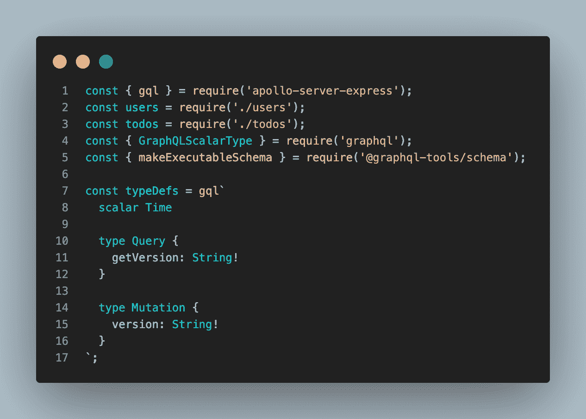
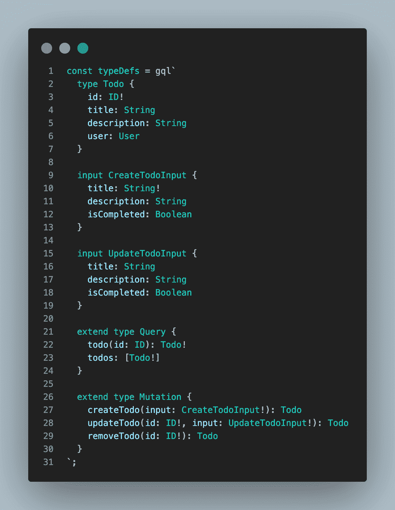
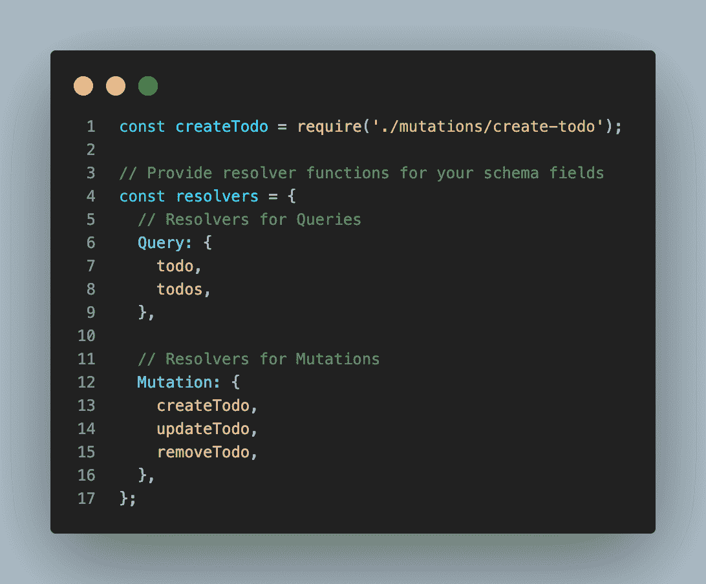
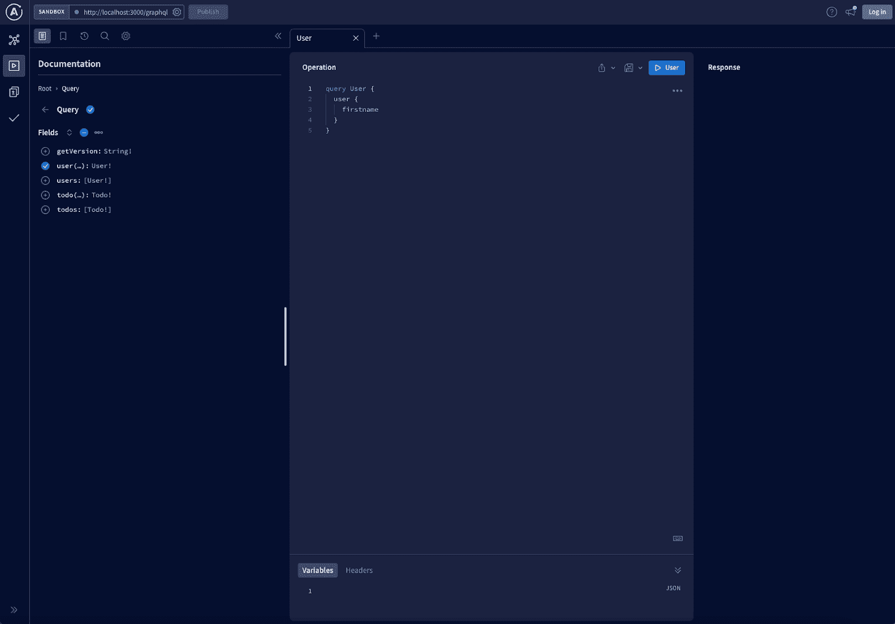

# 使用节点构建 GraphQL APIs

> 原文:[https://kinsta.com/blog/graphql-nodejs/](https://kinsta.com/blog/graphql-nodejs/)

GraphQL 是 API 开发中的新术语。虽然 RESTful APIs 仍然是从应用程序中公开数据的最流行的方式，但它们有许多限制，GraphQL 旨在解决这些限制。

GraphQL 是一种由脸书创建的查询语言，它在 2015 年变成了一个开源项目。它为描述和访问 API 中的数据提供了直观而灵活的语法。

本指南将探索如何构建 GraphQL [Node.js 项目](https://kinsta.com/blog/how-to-install-node-js/)。我们将使用 GraphQL 在 [Express.js web 框架](https://kinsta.com/knowledgebase/what-is-express-js/)中为 Node 构建一个 Todo 应用程序。

## GraphQL 是什么？

来自[官方文档](https://graphql.org/):“graph QL 是一种用于 API 的查询语言，是一种用现有数据完成这些查询的运行时。GraphQL 为您的 API 中的数据提供了完整且易于理解的描述，使客户能够准确地要求他们需要的东西，使 API 更容易随着时间的推移而发展，并支持强大的开发工具。”

GraphQL 是一个服务器端运行时，使用您为数据定义的类型系统来执行查询。此外，GraphQL 不依赖于任何特定的数据库或存储引擎。相反，它由您现有的代码和数据存储提供支持。你可以通过 [GraphQL 与 RESTful API 指南](https://kinsta.com/blog/graphql-vs-rest/)获得这些技术的详细比较。

要创建 GraphQL 服务，首先要定义模式类型并使用这些类型创建字段。接下来，提供一个函数解析器，每当客户端请求数据时，将对每个字段和类型执行该解析器。

## GraphQL 术语

GraphQL 类型系统用来描述什么数据可以查询，什么数据可以操作。它是 GraphQL 的核心。让我们讨论一下在 GraphQ 中描述和操作数据的不同方式。


> 需要在这里大声喊出来。Kinsta 太神奇了，我用它做我的个人网站。支持是迅速和杰出的，他们的服务器是 WordPress 最快的。
> 
> <footer class="wp-block-kinsta-client-quote__footer">
> 
> 
> 
> <cite class="wp-block-kinsta-client-quote__cite">Phillip Stemann</cite></footer>

[View plans](https://kinsta.com/plans/)

### 类型

GraphQL 对象类型是包含强类型字段的数据模型。您的模型和 GraphQL 类型之间应该有一对一的映射。下面是 GraphQL 类型的一个例子:

```
 type User {

  id: ID! # The "!" means required

  firstname: String

  lastname: String

  email: String

  username: String

  todos: [Todo] # Todo is another GraphQL type

} 
```

### 问题

GraphQL Query 定义了客户端可以在 GraphQL API 上运行的所有查询。按照惯例，您应该定义一个包含所有现有查询的根查询。

下面我们定义查询并将其映射到相应的 RESTful API:

```
 type RootQuery {

  user(id: ID): User           # Corresponds to GET /api/users/:id

  users: [User]                # Corresponds to GET /api/users

  todo(id: ID!): Todo    # Corresponds to GET /api/todos/:id

  todos: [Todo]          # Corresponds to GET /api/todos

} 
```

### 突变

如果 GraphQL 查询是 **GET** 请求，那么变异就是 **POST** 、 **PUT** 、 **PATCH** 、 **DELETE** 请求操纵 GraphQL API。

我们将把所有的突变放在一个单独的**根突变**中来演示:

```
 type RootMutation {

  createUser(input: UserInput!): User             # Corresponds to POST /api/users

  updateUser(id: ID!, input: UserInput!): User    # Corresponds to PATCH /api/users

  removeUser(id: ID!): User                       # Corresponds to DELETE /api/users

  createTodo(input: TodoInput!): Todo

  updateTodo(id: ID!, input: TodoInput!): Todo

  removeTodo(id: ID!): Todo

} 
```

您会注意到使用了 **-input** 类型的突变，例如**用户输入**、**输入**。为创建和更新资源定义输入类型始终是最佳实践。

您可以像下面这样定义 **I** nput 类型:

```
 input UserInput {

  firstname: String!

  lastname: String

  email: String!

  username: String!

} 
```

### 下决心者

解析器告诉 GraphQL 在每个查询或变异被请求时做什么。它是一个基本的函数，完成了访问数据库层以执行 CRUD(创建、读取、更新、删除)操作，访问内部 RESTful API 端点，或者调用一个[微服务](https://kinsta.com/blog/microservices-vs-api/)来完成客户端的请求。

您可以创建一个新的 **resolvers.js** 文件，并添加以下代码:

```
 import sequelize from '../models';

export default function resolvers () {

  const models = sequelize.models;

  return {

// Resolvers for Queries

    RootQuery: {

      user (root, { id }, context) {

        return models.User.findById(id, context);

      },

      users (root, args, context) {

        return models.User.findAll({}, context);

      }

    },

    User: {

      todos (user) {

        return user.getTodos();

      }

    },

    }

// Resolvers for Mutations

RootMutation: {

  createUser (root, { input }, context) {

    return models.User.create(input, context);    

  },

  updateUser (root, { id, input }, context) {

    return models.User.update(input, { ...context, where: { id } });

  },

  removeUser (root, { id }, context) {

    return models.User.destroy(input, { ...context, where: { id } });

  },

  // ... Resolvers for Todos go here

}

};

} 
```

### (计划或理论的)纲要

GraphQL schema 就是 GraphQL 向外界公开的内容。因此，类型、查询和变异都将包含在模式中，并向外界公开。

下面是如何向外界公开类型、查询和突变:

```
 schema {

  query: RootQuery

  mutation: RootMutation

} 
```

在上面的脚本中，我们包含了我们之前创建的 **RootQuery** 和 **RootMutation** 以向外界公开。

## GraphQL 如何与 Nodejs 和 Expressjs 一起工作

GraphQL 提供了所有主流编程语言的实现，Node.js 也不例外。在[官方 GraphQL 网站](https://graphql.org/code/#javascript)上，有一个关于 [JavaScript 支持](https://graphql.org/code/#javascript)的版块，而且，还有 GraphQL 的其他实现，让 GraphQL 的编写和编码变得简单。

GraphQL Apollo 提供了 Node.js 和 Express.js 的实现，使 GraphQL 的入门变得容易。

在下一节中，您将学习如何使用 GraphQL Apollo 在 Nodes.js 和 Express.js 后端框架中创建和开发您的第一个 GraphQL 应用程序。

## 使用 Express.js 设置 GraphQL

使用 Express.js 构建 GraphQL API 服务器很容易上手。在本节中，我们将探索如何构建一个 GraphQL 服务器。

### 用 Express 初始化项目

首先，您需要安装并设置一个新的 Express.js 项目。

使用以下命令为您的项目创建一个文件夹并安装 Express.js:

```
 cd <project-name> && npm init -y

npm install express 
```

上面的命令创建一个新的 **package.json** 文件，并将 Express.js 库安装到您的项目中。

接下来，我们将构建我们的项目，如下图所示。它将包含不同的项目功能模块，如用户，待办事项等。

## 注册订阅时事通讯


### 想知道我们是怎么让流量增长超过 1000%的吗？

加入 20，000 多名获得我们每周时事通讯和内部消息的人的行列吧！

[Subscribe Now](#newsletter)


Files for *graphql-todo*.


### 初始化图形 SQL

让我们从安装 GraphQL Express.js 依赖项开始。运行以下命令进行安装:

```
 npm install apollo-server-express graphql @graphql-tools/schema --save 
```

### 创建模式和类型

接下来，我们将在 modules 文件夹中创建一个 **index.js** 文件，并添加以下代码片段:

```
 const { gql } = require('apollo-server-express');

const users = require('./users');

const todos = require('./todos');

const { GraphQLScalarType } = require('graphql');

const { makeExecutableSchema } = require('@graphql-tools/schema');

const typeDefs = gql`

 scalar Time

 type Query {

   getVersion: String!

 }

 type Mutation {

   version: String!

 }

`;

const timeScalar = new GraphQLScalarType({

 name: 'Time',

 description: 'Time custom scalar type',

 serialize: (value) => value,

});

const resolvers = {

 Time: timeScalar,

 Query: {

   getVersion: () => `v1`,

 },

};

const schema = makeExecutableSchema({

 typeDefs: [typeDefs, users.typeDefs, todos.typeDefs],

 resolvers: [resolvers, users.resolvers, todos.resolvers],

});

module.exports = schema; 
```

#### 代码走查

让我们浏览代码片段并将其分解:

##### 第一步

首先，我们导入所需的库，并创建默认的查询和变异类型。查询和变异现在只设置了 GraphQL API 的版本。然而，随着我们的继续，我们将扩展查询和变异以包括其他模式。



Importing GraphQL and extensions.


##### 第二步:

然后，我们为 time 创建了一个新的标量类型，并为上面创建的查询和变异创建了第一个解析器。此外，我们还使用**makexecutablee chema**函数生成了一个模式。

生成的模式包括我们导入的所有其他模式，并且在我们创建和导入它们时还会包括更多模式。

Struggling with downtime and WordPress problems? Kinsta is the hosting solution designed to save you time! [Check out our features](https://kinsta.com/features/)


Creating a scalar type for time as well as our first resolver.


上面的代码片段显示了我们将不同的模式导入到 makeExecutableEchema 函数中。这种方法有助于我们构建复杂的应用程序。接下来，我们将创建导入的 Todo 和用户模式。

### 正在创建待办事项方案

Todo 模式显示了应用程序用户可以执行的简单 CRUD 操作。下面是实现 Todo CRUD 操作的模式。

```
 const { gql } = require('apollo-server-express');

const createTodo = require('./mutations/create-todo');

const updateTodo = require('./mutations/update-todo');

const removeTodo = require('./mutations/delete-todo');

const todo = require('./queries/todo');

const todos = require('./queries/todos');

const typeDefs = gql`

 type Todo {

   id: ID!

   title: String

   description: String

   user: User

 }

 input CreateTodoInput {

   title: String!

   description: String

   isCompleted: Boolean

 }

 input UpdateTodoInput {

   title: String

   description: String

   isCompleted: Boolean

 }

 extend type Query {

   todo(id: ID): Todo!

   todos: [Todo!]

 }

 extend type Mutation {

   createTodo(input: CreateTodoInput!): Todo

   updateTodo(id: ID!, input: UpdateTodoInput!): Todo

   removeTodo(id: ID!): Todo

 }

`;

// Provide resolver functions for your schema fields

const resolvers = {

 // Resolvers for Queries

 Query: {

   todo,

   todos,

 },

 // Resolvers for Mutations

 Mutation: {

   createTodo,

   updateTodo,

   removeTodo,

 },

};

module.exports = { typeDefs, resolvers }; 
```

#### ***代码预排***

让我们浏览代码片段并将其分解:

##### 第一步:

首先，我们使用 GraphQL **type** 、 **input** 和 **extend** 为 Todo 创建了一个模式。 **extend** 关键字用于继承和添加新的查询和变异到我们上面创建的现有根查询和变异中。



Creating the schema for our Todo.


##### 第二步:

接下来，我们创建了一个解析器，用于在调用特定查询或变异时检索正确的数据。



Creating a resolver.


有了 resolver 函数，我们可以为业务逻辑和数据库操作创建单独的方法，如 **create-todo.js** 示例所示。

在<代码>中创建一个 **create-user.js** 文件。/mutations < /code >文件夹，并添加业务逻辑以在数据库中创建一个新的 Todo。

```
 const models = require('../../../models');

module.exports = async (root, { input }, context) => {

 return models.todos.push({ ...input });

}; 
```

上面的代码片段是使用 Sequelize ORM 在我们的数据库中创建新 Todo 的简化方法。您可以了解更多关于 [Sequelize 以及如何使用 Node.js](https://sequelize.org/) 设置它的信息。

根据您的应用程序，您可以按照相同的步骤创建许多模式，或者您可以从 GitHub 克隆完整的项目。

接下来，我们将使用 Express.js 设置服务器，并使用 GraphQL 和 Node.js 运行新创建的 Todo 应用程序

### 设置和运行服务器

最后，我们将使用之前安装并配置的 **apollo-server-express** 库来设置我们的服务器。

**apollo-server-express** 是 Apollo Server for Express.js 的一个简单包装器，推荐它是因为它适合 Express.js 开发。

使用我们上面讨论的例子，让我们配置 Express.js 服务器来与新安装的 **apollo-server-express** 一起工作。

在根目录下创建一个 **server.js** 文件，并粘贴以下代码:

```
 const express = require('express');

const { ApolloServer } = require('apollo-server-express');

const schema = require('./modules');

const app = express();

async function startServer() {

 const server = new ApolloServer({ schema });

 await server.start();

 server.applyMiddleware({ app });

}

startServer();

app.listen({ port: 3000 }, () =>

 console.log(`Server ready at http://localhost:3000`)

); 
```

在上面的代码中，您已经成功地为 Todos 和用户创建了第一个 CRUD GraphQL 服务器。您可以启动您的开发服务器并使用[http://localhost:3000/graph QL](http://localhost:300/graphql)访问操场。如果一切顺利，您应该会看到下面的屏幕:



The verification screen.


## 摘要

GraphQL 是脸书支持的现代技术，它简化了使用 RESTful 架构模式创建大规模 API 的繁琐工作。

本指南阐述了 GraphQL，并演示了如何使用 Express.js 开发您的第一个 GraphQL API。

让我们知道您使用 GraphQL 构建了什么。

* * *

让你所有的[应用程序](https://kinsta.com/application-hosting/)、[数据库](https://kinsta.com/database-hosting/)和 [WordPress 网站](https://kinsta.com/wordpress-hosting/)在线并在一个屋檐下。我们功能丰富的高性能云平台包括:

*   在 MyKinsta 仪表盘中轻松设置和管理
*   24/7 专家支持
*   最好的谷歌云平台硬件和网络，由 Kubernetes 提供最大的可扩展性
*   面向速度和安全性的企业级 Cloudflare 集成
*   全球受众覆盖全球多达 35 个数据中心和 275 多个 pop

在第一个月使用托管的[应用程序或托管](https://kinsta.com/application-hosting/)的[数据库，您可以享受 20 美元的优惠，亲自测试一下。探索我们的](https://kinsta.com/database-hosting/)[计划](https://kinsta.com/plans/)或[与销售人员交谈](https://kinsta.com/contact-us/)以找到最适合您的方式。