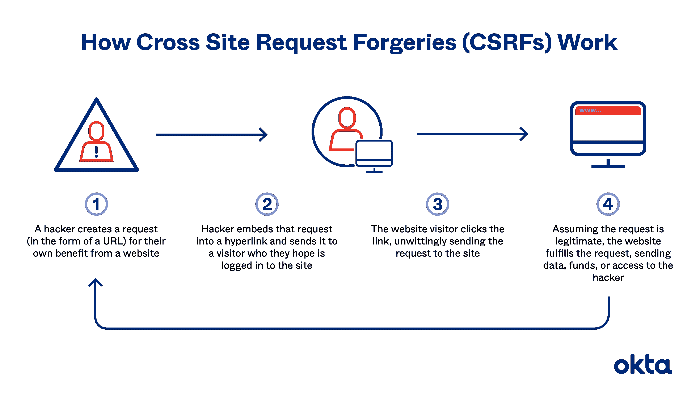

# 了解 CSRF 攻击并锁定 CSRF 漏洞

> 原文:[https://kinsta.com/blog/csrf-attack/](https://kinsta.com/blog/csrf-attack/)

网络漏洞猖獗，并不断增加。维护用户的安全和隐私比以往任何时候都更加重要。不解决网络漏洞会导致声誉受损和监管机构的巨额罚款，你也会失去用户的信任。

网站和 web 应用程序容易受到[恶意软件](https://kinsta.com/blog/types-of-malware/)、垃圾邮件和其他攻击——本文主要关注这样一种攻击媒介——跨站点请求伪造(CSRF)攻击。CSRF 攻击尤其令人不安，因为它们可能在用户不知情的情况下发生。开发者或网站所有者也很难检测到它们，因为恶意请求看起来与真实请求非常相似。

本文探讨了 CSRF 攻击，它是如何工作的，以及您可以采取的准备步骤。

 ## 什么是 CSRF 攻击？

跨站点请求伪造攻击，也称为 CSRF 攻击，通过提交恶意请求来欺骗经过身份验证的用户执行意外的操作，而用户并没有意识到这一点。



How CSRF attacks work. (Image Source: [Okta](https://www.okta.com/identity-101/csrf-attack/))


通常，CSRF 攻击涉及状态更改请求，因为攻击者没有收到响应。这种请求的例子包括删除记录、[更改密码](https://kinsta.com/blog/change-wordpress-password/)、购买产品或发送消息。这些都可能在用户不知情的情况下发生。

恶意攻击者通常使用社交工程通过聊天或电子邮件向不知情的用户发送链接。


> 需要在这里大声喊出来。Kinsta 太神奇了，我用它做我的个人网站。支持是迅速和杰出的，他们的服务器是 WordPress 最快的。
> 
> <footer class="wp-block-kinsta-client-quote__footer">
> 
> 
> 
> <cite class="wp-block-kinsta-client-quote__cite">Phillip Stemann</cite></footer>

[View plans](https://kinsta.com/plans/)

当用户单击链接时，它会执行攻击者设置的命令。

例如，点击一个链接可以从用户的账户中转移资金。或者，它可以更改用户的电子邮件地址，防止他们重新获得帐户访问权限。

## CSRF 攻击是如何进行的？

让用户在登录时发起状态更改请求是 CSRF 攻击的第一步，也是最关键的一步。在 CSRF 攻击中，攻击者的目标是让经过身份验证的用户在不知情的情况下向网站或 web 应用程序提交恶意的 web 请求。这些请求可以由 cookies、 [URL 参数](https://kinsta.com/knowledgebase/what-is-a-url/#query-strings-and-variables)和其他对用户来说正常的数据类型组成。

CSRF 攻击要想成功，必须满足以下条件:

*   经过身份验证的用户必须登录到使用 cookies 进行会话管理的 web 应用程序。
*   攻击者必须创建一个改变状态的伪造请求。
*   目标服务器处理的真正请求不应包含不可预测的参数。例如，在发起状态改变请求之前，请求不应该期望密码作为用于验证目的的参数。

完成 CSRF 攻击最常见的方法是在具有弱 SameSite cookie 策略的应用程序中使用 cookie。web 浏览器会自动包含 cookie，而且通常是匿名的，它们会将某个域使用的 cookie 保存在用户发送给该域的任何 Web 请求中。

SameSite cookie 策略定义了跨站点浏览上下文中的浏览器如何处理 cookie。如果设置为严格，cookie 不会在跨站点浏览上下文中共享，从而防止 CSRF 攻击。如果设置为无，浏览器会在所有跨站点上下文中附加 cookie。这使得应用程序容易受到 CSRF 攻击。

当用户在不知情的情况下通过 web 浏览器提交恶意请求时，保存的 cookies 会导致该请求在服务器看来是合法的。然后，服务器通过更改用户帐户、更改会话状态或返回请求的数据来响应请求。

让我们仔细看看 CSRF 攻击途径的两个例子，一个带有 GET 请求，另一个带有 POST 请求。

## CSRF 的一个 GET 请求

首先，考虑一个金融银行 web 应用程序使用的 GET 请求,攻击利用了 GET 请求和超链接传递。

假设转账的 GET 请求如下所示:

```
GET https://xymbank.com/online/transfer?amount=1000&accountNumber=547895 HTTP/1.1
```

在上面的正版请求中，用户请求向带有`547895`的账户转账 1000 美元，作为购买产品的付款。

虽然这个请求是明确、简单和实用的，但它将帐户持有人暴露给 CSRF 攻击。这是因为请求不需要攻击者可能不知道的细节。因此，要发起攻击，攻击者只需更改请求的参数(金额和帐号)就可以创建一个可执行的伪造请求。

只要银行的任何用户正在进行 cookie 管理的会话，恶意请求就会对他们有效。

这是伪造的向一个黑客账户转账 500 美元的请求(这里的数字是`654585`)的样子。请注意，下面的示例是 CSRF 攻击中所涉及步骤的高度简化版本。

```
GET https://xymbank.com/online/transfer?amount=500&accountNumber=654585 HTTP/1.1
```

一旦完成，攻击者必须想出一种方法来欺骗用户在登录他们的在线银行应用程序时发送这个请求。方法之一是创建一个无害的超链接来吸引用户的注意力。该链接可能如下所示:

```
<a
href="https://xymbank.com/online/transfer?amount=500&accountNumber=654585">Click here to get more information</a>.
```

假设攻击者[已经找到了他们目标的正确电子邮件地址](https://kinsta.com/blog/find-email-address/)，他们可以通过电子邮件将此发送给许多银行客户。那些在登录时点击链接的人将触发从登录帐户向攻击者发送$500 的请求。
T3】

## CSRF 申请一个职位

让我们看看，如果同一个金融机构只接受 [POST 请求](https://kinsta.com/knowledgebase/what-is-an-http-request/#what-is-an-http-request-and-how-does-it-work)，他们将如何经历 CSRF。在这种情况下，GET 请求示例中使用的超链接传递不起作用。因此，成功的 CSRF 攻击需要攻击者创建一个 HTML 表单。发送 1，000 美元购买产品的真实请求如下所示:

```
POST /online/transfer HTTP/1.1
Host: xymbank.com
Content-Type: application/x-www-form-urlencoded
Cookie: session=FRyhityeQkAPzeQ5gHgTvlyxHJYhg
amount=1000
account=547895
```

这个 POST 请求需要一个 cookie 来确定用户的身份、他们希望发送的金额以及他们希望发送的帐户。攻击者可以修改此请求来执行 CSRF 攻击。

攻击者只需将真实的 cookie 添加到伪造的请求中，就可以让服务器处理传输。他们可以通过创建一个看起来无害的超链接，将用户带到如下所示的触发网页:

```
<html>
<body>
<form action="https://xymbank.com/online/transfer" method="POST">
<input type="hidden" name="amount" value="500"/>
<input type="hidden" name="account" value="654585" />
</form>
<script>
document.forms[0].submit();
</script>
</body>
</html>
```

我们已经在上面的表格中设置了金额和帐户参数。一旦经过身份验证的用户访问了页面，浏览器就会在将请求转发到服务器之前添加会话 cookie。然后，服务器将 500 美元转到黑客的账户上。

 ## 注册订阅时事通讯


### 想知道我们是怎么让流量增长超过 1000%的吗？

加入 20，000 多名获得我们每周时事通讯和内部消息的人的行列吧！

[Subscribe Now](#newsletter)

## 减少 CSRF 攻击的三种方法

有几种方法可以防止并大大减轻您的网站或 web 应用程序上的潜在 CSRF 攻击，包括:

*   使用 CSRF 代币
*   使用引用标头
*   选择以安全为中心的托管解决方案，如 Kinsta

## 如何防止使用 CSRF 令牌的 CSRF 攻击

一个 CSRF 安全网站为每个会话分配一个唯一的令牌，并与服务器端和客户端浏览器共享。每当浏览器发送敏感请求时，服务器都希望它包含分配的 CSRF 令牌。如果它有错误的令牌，服务器会丢弃它。出于安全考虑，CSRF 令牌不会存储在客户端浏览器的会话 cookies 中。

### CSRF 令牌的潜在漏洞

尽管 CSRF 令牌是一种很好的安全措施，但这种方法并不能抵御攻击。伴随 CSRF 令牌的一些漏洞包括:

*   **验证绕过** —如果没有找到令牌，一些应用程序会跳过验证步骤。如果攻击者获得了包含令牌的代码的访问权限，他们可以删除该令牌并成功执行 CSRF 攻击。因此，如果对服务器的有效请求如下所示:

```
POST /change_password
POST body:
password=pass123&csrf_token=93j9d8eckke20d433
```

攻击者只需删除令牌并像这样发送它就可以执行攻击:

```
POST /change_password
POST body:
password=pass123
```

*   **共享令牌** —一些应用程序维护令牌池来验证用户会话，而不是为会话指定特定令牌。攻击者只需获得池中已经存在的一个令牌，就可以模拟站点的任何用户。

攻击者可以使用他们的帐户登录应用程序以获取令牌，例如:

Struggling with downtime and WordPress problems? Kinsta is the hosting solution designed to save you time! [Check out our features](https://kinsta.com/features/)

```
[application_url].com?csrf_token=93j9d8eckke20d433
```

由于令牌是池化的，攻击者可以复制并使用同一个令牌登录到不同的用户帐户，因为您将再次使用它:

*   **CSRFs 可以被令牌复制到 cookie** —一些应用程序会将与令牌相关的参数复制到用户的 cookie 中。如果攻击者获得了此类 cookie 的访问权限，他们可以轻松地创建另一个 cookie，将其放在浏览器中，并执行 CSRF 攻击。

因此，攻击者可以使用他们的帐户登录到应用程序，并打开 cookie 文件查看以下内容:

```
Csrf_token:93j9d8eckke20d433
```

然后，他们可以使用此信息创建另一个 cookie 来完成攻击

*   **无效令牌** —一些应用程序不会将 CSRF 令牌与用户会话相匹配。在这种情况下，攻击者可以真正登录到一个会话中，获得一个类似于上述的 CSRF 令牌，并使用它来组织对受害者会话的 CSRF 攻击。

## 如何防止 CSRF 攻击与参考头

防止 CSRF 攻击的另一个策略是使用 referrer 头。在 HTTP 中，referrer 头指示请求的来源。它们通常用于[执行分析](https://kinsta.com/blog/google-analytics-spam/)、优化和日志记录。

您也可以在服务器端启用检查参考头，以防止 CSRF 攻击。服务器端检查请求的来源，并确定请求的目标来源。如果它们匹配，则请求被允许。如果不匹配，服务器会放弃请求。

使用 referrer 头比使用令牌容易得多，因为它不需要单独的用户标识。

### 引用标头的潜在漏洞

像 CSRF 令牌一样，引用头也有一些严重的漏洞。

首先，推荐头不是强制性的，一些网站会发送没有推荐头的请求。如果 CSRF 没有处理无头请求的策略，攻击者可以使用无头请求来执行状态改变攻击。

此外，随着最近[推荐策略](https://www.sjoerdlangkemper.nl/2017/06/21/bypass-csrf-check-using-referrer-policy/)的引入，这种方法已经变得不那么有效了。该规范防止 URL 泄漏到其他域，使用户能够更好地控制 referrer 头中的信息。他们可以通过在 HTML 页面上添加元数据标签来选择显示部分引用头信息或禁用它，如下所示:

```
<meta name="referrer" content="no-referrer">
```

上述代码删除了该页面中所有请求的 referrer 标头。这样做使得依赖引用头的应用程序很难阻止来自这种页面的 CSRF 攻击。

## 金斯塔如何抵御 CSRF 的攻击

除了使用 referrer header 和 CSRF 令牌，还有第三个更简单的选择:为你的网站和网络应用程序选择一个像 Kinsta 这样的[安全托管服务，在攻击者和你的用户之间提供一个更强大、更安全的屏障。](https://kinsta.com/secure-wordpress-hosting/)

除了关键的安全功能之外，如自动备份、双因素身份验证、双因素身份验证和基于 SSH 协议的 SFTP，Kinsta 的 Cloudflare 集成提供了基于 IP 的企业级保护和防火墙保护。

具体来说，Kinsta 目前有大约 60 个自定义防火墙规则，以帮助防止恶意攻击和处理插件和主题中未经验证的严重漏洞，包括寻找 CSRF 漏洞的特定漏洞。


## 摘要

跨站点请求伪造(CSRF)是一种攻击，它欺骗经过身份验证的用户无意中发起状态更改请求。他们的目标是不能区分有效和伪造的状态改变请求的应用程序。

CSRF 只能在依赖会话 cookie 来识别登录用户和具有弱 SameSite cookie 策略的应用程序上取得成功。他们还需要一台接受不包含未知参数(如密码)的请求的服务器。黑客可以使用 GET 或 POST 发送恶意攻击。

虽然使用 CSRF 令牌或强制引用头验证可以防止一些 CSRF 攻击，但这两种措施都有潜在的漏洞，如果不小心，可能会使您的预防措施无效。

*[迁移到像金斯塔](https://kinsta.com/wordpress-migration/)这样的安全托管平台可以保护你的网站或网络应用免受 CSRF 攻击。此外，Kinsta 与 Cloudflare 的集成可防止特定的 CSRF 攻击。*

* * *

让你所有的[应用程序](https://kinsta.com/application-hosting/)、[数据库](https://kinsta.com/database-hosting/)和 [WordPress 网站](https://kinsta.com/wordpress-hosting/)在线并在一个屋檐下。我们功能丰富的高性能云平台包括:

*   在 MyKinsta 仪表盘中轻松设置和管理
*   24/7 专家支持
*   最好的谷歌云平台硬件和网络，由 Kubernetes 提供最大的可扩展性
*   面向速度和安全性的企业级 Cloudflare 集成
*   全球受众覆盖全球多达 35 个数据中心和 275 多个 pop

在第一个月使用托管的[应用程序或托管](https://kinsta.com/application-hosting/)的[数据库，您可以享受 20 美元的优惠，亲自测试一下。探索我们的](https://kinsta.com/database-hosting/)[计划](https://kinsta.com/plans/)或[与销售人员交谈](https://kinsta.com/contact-us/)以找到最适合您的方式。