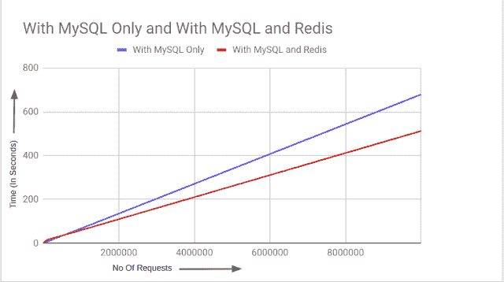

# 你应该使用内存数据库吗？

> 原文:[https://kinsta.com/blog/in-memory-database/](https://kinsta.com/blog/in-memory-database/)

许多网站和应用程序通常将其数据存储在数据库中。从数据库中读取和写入数据会显著影响应用程序的延迟。尽可能地减少延迟是很重要的，因为用户期望快速响应的应用程序，更快的网站在搜索引擎优化方面表现更好。

写入数据库会增加延迟，因为数据库通常将数据写入磁盘，而不是保存在内存中。数据库通常会应用压缩和加密，这增加了读写数据时的延迟。为了克服这些挑战，您可以使用内存中的数据库从 RAM 而不是磁盘快速存储和检索数据。

本文讨论了内存数据库是如何工作的，一些流行的选项，以及相对于标准数据库的一些权衡。

 ## 什么是内存数据库？

内存数据库使用 RAM 而不是[硬盘驱动器(HDD)或固态驱动器(SSD)](https://kinsta.com/blog/what-is-ssd/) 来存储数据，大大降低了读写数据的[延迟](https://kinsta.com/blog/network-latency/)。延迟减少是由于两个主要原因。首先，从内存访问数据比从磁盘快，其次，用于在内存中存储数据的数据结构比磁盘存储更简单。所以读写数据时 CPU 开销更低。

这种低延迟是有代价的，因为如果服务器出现故障，存储在内存中的数据将会丢失。与磁盘存储不同，内存不会在断电时保留其内容，因此需要在恢复能力和速度之间进行权衡。

对于需要快速或实时数据的应用程序，如排行榜或实时分析，内存数据库是一个很好的选择。它们还有助于[缓存通常存储在基于磁盘的数据库中的](https://kinsta.com/blog/what-is-cache/)数据，以减少对磁盘的读写次数并最小化延迟。

减少延迟对于网站来说尤为重要。觉得网站有反应的用户更有可能继续使用它。此外，谷歌和其他搜索引擎也使用网站加载速度作为搜索引擎优化的一个因素。快速网站在搜索结果中排名更高，增加了用户访问您网站的机会。

> 需要在这里大声喊出来。Kinsta 太神奇了，我用它做我的个人网站。支持是迅速和杰出的，他们的服务器是 WordPress 最快的。
> 
> <footer class="wp-block-kinsta-client-quote__footer">
> 
> 
> 
> <cite class="wp-block-kinsta-client-quote__cite">Phillip Stemann</cite></footer>

[View plans](https://kinsta.com/plans/)

## 解释了内存数据库

因为内存数据库将数据存储在 RAM 中，所以它们的延迟比 HDD 低得多，HDD 使用机械的移动部件来访问正确的磁盘位置。然后，硬盘驱动器必须读取数据，并通过存储设备和计算机之间的接口传输数据。此外，即使是固态硬盘，RAM 仍然比固态硬盘快 30 倍，因为它有更高性能的内存芯片和 CPU 接口。一些[基准测试](https://dzone.com/articles/redis-vs-mysql-benchmarks)表明，与使用独立的 MySQL 数据库相比，使用 MySQL 和 Redis(一种流行的内存数据库)作为缓存层可以减少高达 25%的查询延迟。

Benchmarks with only MySQL and with MySQL and Redis. (Image Source: [DZone](https://dzone.com/articles/redis-vs-mysql-benchmarks))

内存数据库速度快还有第二个原因。您可以[优化内存数据库使用的数据结构](https://towardsdatascience.com/intro-to-data-structures-2615eadc343d)以加快检索速度。例如，关系数据库经常使用 [B 树作为索引](https://www.complexsql.com/b-tree-index-b-tree-index-with-real-life-industry-examples/)，允许快速搜索，同时支持向磁盘读写大数据块。内存数据库不需要将数据块写入磁盘，可以选择更高性能的数据结构，从而进一步减少延迟。内存数据库通常按原样存储和使用数据，无需在数据库层进行任何转换或解析。这也有助于减少延迟，因为它加快了读写速度。

由于技术的进步，内存数据库变得越来越流行。首先，在过去 20 年中，每千兆字节(GB)RAM 的价格大幅下降，这使得使用内存进行数据存储变得更加经济实惠。内存数据库解决方案和托管云服务的改进也有助于减轻它们的一些主要缺点。

此外，像 [Redis](https://kinsta.com/help/redis-cache/) 这样的内存数据库现在可以将数据从内存快照到磁盘，允许在服务器出现故障时恢复数据。云服务提供地理复制，这意味着应用程序可以在出现问题时通过故障切换保持在线。这种成本的降低和可靠性的提高使得内存数据库成为现代应用程序和网站的可行选择。

## 内存数据库的优点和缺点

内存数据库的主要优势是:

*   他们[提高](https://kinsta.com/website-performance)T2 的表现。
*   由于它们存储数据的方式，它们更易于扩展。
*   它们通常会提高应用程序的可靠性。

内存数据库通常将数据存储为[非结构化](https://www.netapp.com/data-storage/unstructured-data/what-is-unstructured-data/)或半结构化，而不是存储在复杂的关系模型中。非结构化数据使数据库的扩展变得更加简单，因为连接位于多个节点上的数据的网络数据传输开销是不必要的。

 ## 注册订阅时事通讯

### 想知道我们是怎么让流量增长超过 1000%的吗？

加入 20，000 多名获得我们每周时事通讯和内部消息的人的行列吧！

[Subscribe Now](#newsletter)

由于存储在 RAM 中的数据的易失性，提高应用程序的可靠性似乎是违反直觉的。然而，当用作[缓存层](https://kinsta.com/blog/what-is-cache/)时，内存数据库可以在请求高峰期间减轻主数据库的负担。缓存层也有助于降低成本，因为扩展传统数据库比内存数据库更昂贵，这样可以加快频繁的请求，然后使用中央数据库进行长期存储。

内存数据库的主要缺点是:

*   如果用作唯一的数据库，成本会增加
*   有限的存储大小
*   更少的安全功能

内存数据库通常不使用加密等安全特性，因为所有东西都必须在内存中，包括加密密钥。这些特征使得加密数据无效，因为任何能够访问存储器的恶意实体理论上也能够访问加密密钥。

当与传统数据库一起使用时，内存数据库可以降低成本。然而，当作为唯一的数据库使用时，它们通常更昂贵，尤其是在存储大量数据的情况下，因为内存的价格高于磁盘存储。这一成本也限制了您可以保留的数据量，因为在内存中存储大型数据集变得非常昂贵，并且通常需要多台服务器。

## 为什么不是所有的数据库都在内存中？

阻止内存数据库普及的主要障碍是成本。虽然 RAM 的价格已经大幅下降，但它们的每 GB 价格仍然比硬盘和固态硬盘高得多。这一成本使得内存数据库对于具有巨大数据足迹的更广泛的应用程序来说过于昂贵。

Struggling with downtime and WordPress problems? Kinsta is the hosting solution designed to save you time! [Check out our features](https://kinsta.com/features/)

如果 RAM 的价格继续下降，可能会有一段时间内存数据库是默认的，而基于磁盘的数据库只用于利基环境。

## 内存数据库的用例

内存数据库最常见的用途之一是缓存。您可以将内存数据库作为缓存层与传统数据库结合使用。内存数据库存储经常访问的数据，避免在基于磁盘的数据库中进行重复且代价高昂的查找，并提供更快的用户体验。

内存数据库也因电子商务网站、论坛和带有评论区的高流量博客而闻名。这是因为这些都是高度动态的网站。电子商务网站希望个性化用户体验，并显示实时产品可用性。博客和论坛可以有成百上千的用户同时发帖和评论。这意味着一个网站需要处理很高的写吞吐量，并且能够快速地向用户提供最新的内容和评论。内存数据库减少了存储用户生成内容的延迟，并提供了最新的个性化体验。

内存数据库也是游戏排行榜的绝佳候选对象。他们可以实时更新和检索数据，并有效地对数据进行排序，以随着游戏的进行提供排行榜的当前视图。

您还可以使用它们进行[实时分析](https://kinsta.com/blog/google-analytics-alternatives/)。它们使您能够将数据流式传输到数据库中，并对最新版本的数据执行查询，以用于实时仪表板、风险分析和机器学习模型。

## 内存数据库的示例

在选择内存数据库时，有许多选择。一些最受欢迎的是[雷迪斯](https://kinsta.com/help/redis-cache/)、[记忆图](https://memgraph.com/)和[黑兹尔卡斯特](https://hazelcast.com/)。Redis 是使用最广泛的，是大多数云平台上的托管服务。Memgraph 提供流数据的图形计算，全部在内存中，Hazelcast 提供与 Redis 类似的功能，但具有不同的缓存模式。

Redis 通常是网站和应用程序之间的缓存层，通过防止代价高昂的数据库读取来提高性能。在 Kinsta 的 Redis [插件的帮助下，](https://kinsta.com/add-ons/?plan=visits-business1&interval=month) [WordPress](https://kinsta.com/knowledgebase/what-is-wordpress/) 网站也有可能实现这种性能提升。除了这个插件，Kinsta 还提供了 [Kinsta APM 工具](https://kinsta.com/help/apm-tool/#slowest-redis-cache)来帮助解决 Redis 查询的任何性能问题。

在 Kinsta 上运行的网站默认使用缓存。然而，数据库请求频繁的网站仍将从 Redis 中受益匪浅。数据库延迟是降低网站速度的最重要因素之一，但 Redis 有助于减轻这一负担，并使网站能够快速扩展。

## 摘要

数据库延迟会显著影响网站或应用程序的整体延迟。读写硬盘会增加延迟。内存数据库减少了数据库延迟，因为它们将数据存储在 RAM 中。即使使用固态硬盘，RAM 仍然更快，因为它使用更快的内存芯片和更快的 CPU 接口。此外，您可以优化内存数据库使用的数据结构，以加快检索速度。

当用作网站和传统数据库之间的缓存层时，内存数据库可以加快网站和应用程序的速度。这是因为内存的访问速度比磁盘更快，这种减少的开销导致网站加载速度更快，有助于提高 SEO。

Redis 是最受欢迎的内存数据库选项之一，你可以使用 Kinsta 插件轻松地将其添加到 WordPress 站点。为你的 Kinsta 托管的站点尝试一下 [Redis 插件](https://kinsta.com/help/redis-cache/#:~:text=Adding%20Redis%20to%20a%20Site%20at%20Kinsta,-If%20you%20would&text=Our%20Support%20team%20will%20install,%24100%20a%20month%20per%20site.)。

* * *

让你所有的[应用程序](https://kinsta.com/application-hosting/)、[数据库](https://kinsta.com/database-hosting/)和 [WordPress 网站](https://kinsta.com/wordpress-hosting/)在线并在一个屋檐下。我们功能丰富的高性能云平台包括:

*   在 MyKinsta 仪表盘中轻松设置和管理
*   24/7 专家支持
*   最好的谷歌云平台硬件和网络，由 Kubernetes 提供最大的可扩展性
*   面向速度和安全性的企业级 Cloudflare 集成
*   全球受众覆盖全球多达 35 个数据中心和 275 多个 pop

在第一个月使用托管的[应用程序或托管](https://kinsta.com/application-hosting/)的[数据库，您可以享受 20 美元的优惠，亲自测试一下。探索我们的](https://kinsta.com/database-hosting/)[计划](https://kinsta.com/plans/)或[与销售人员交谈](https://kinsta.com/contact-us/)以找到最适合您的方式。