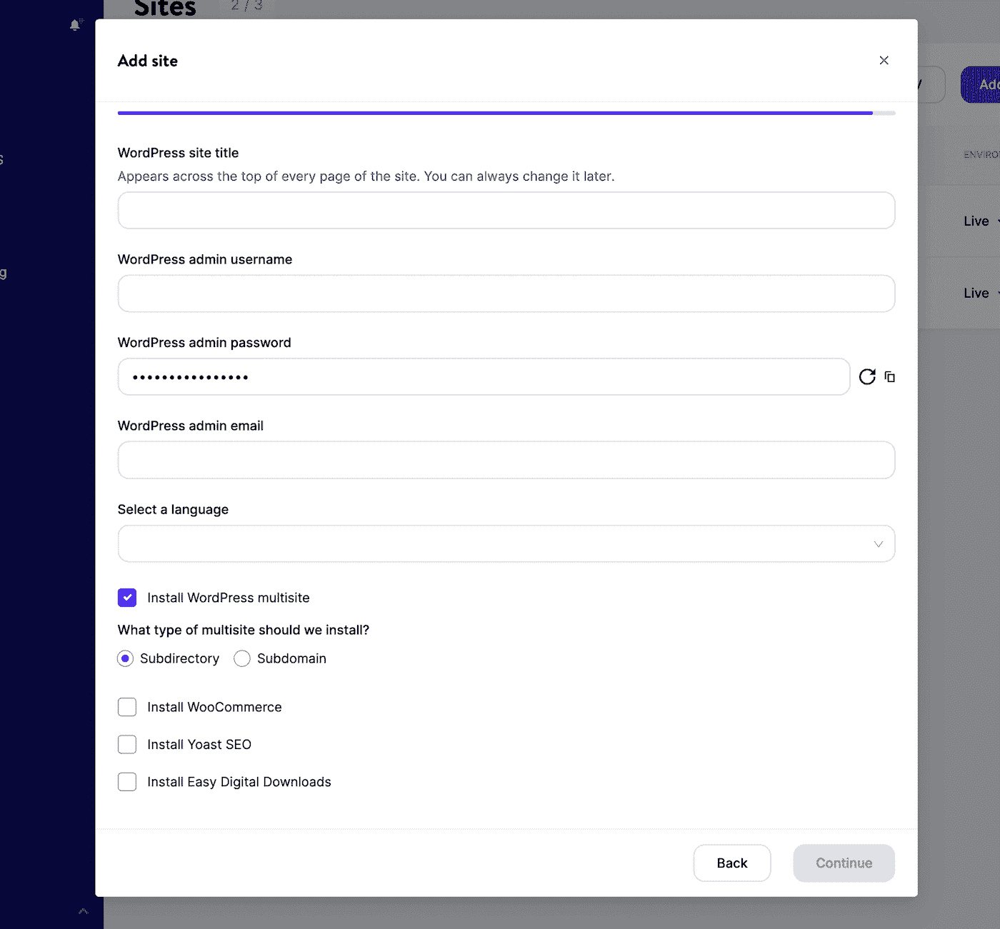
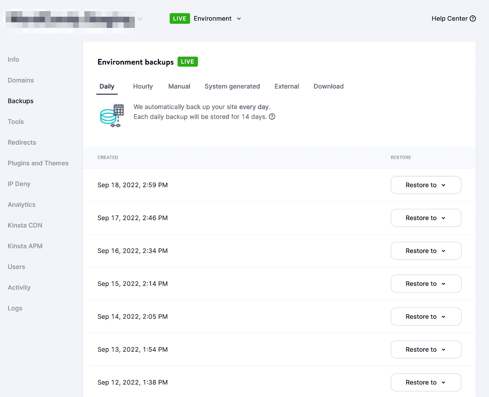
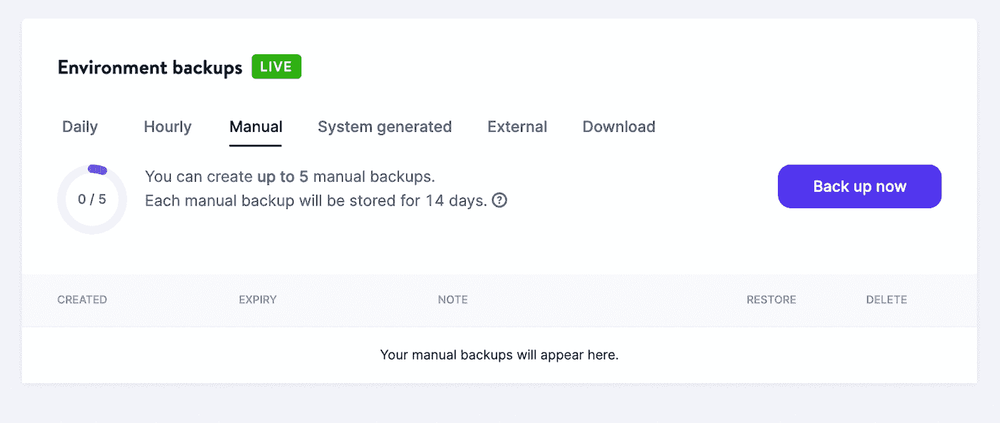
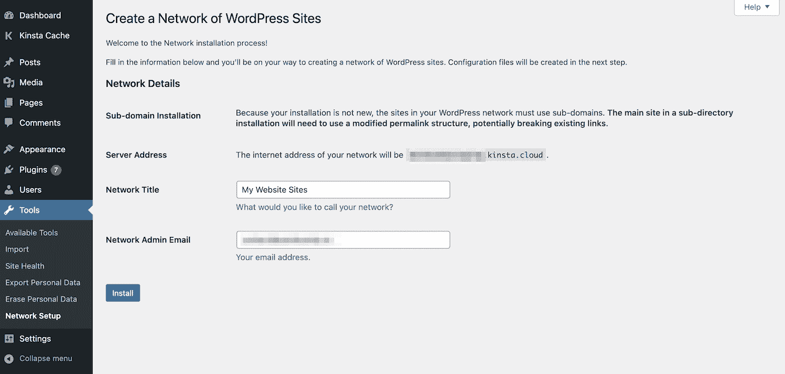
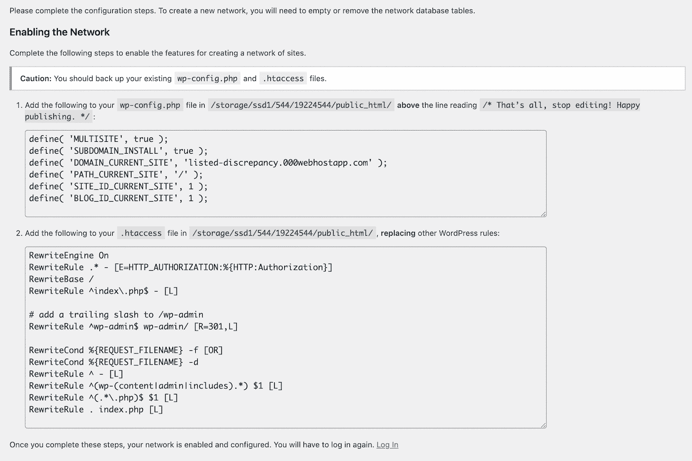
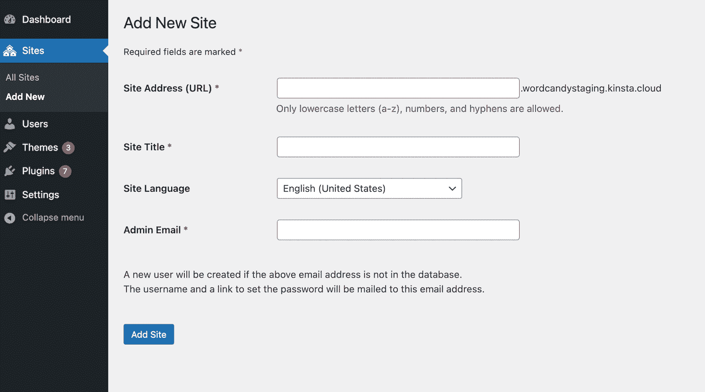
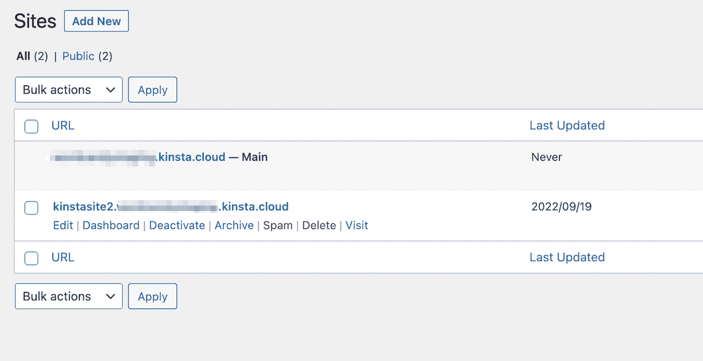
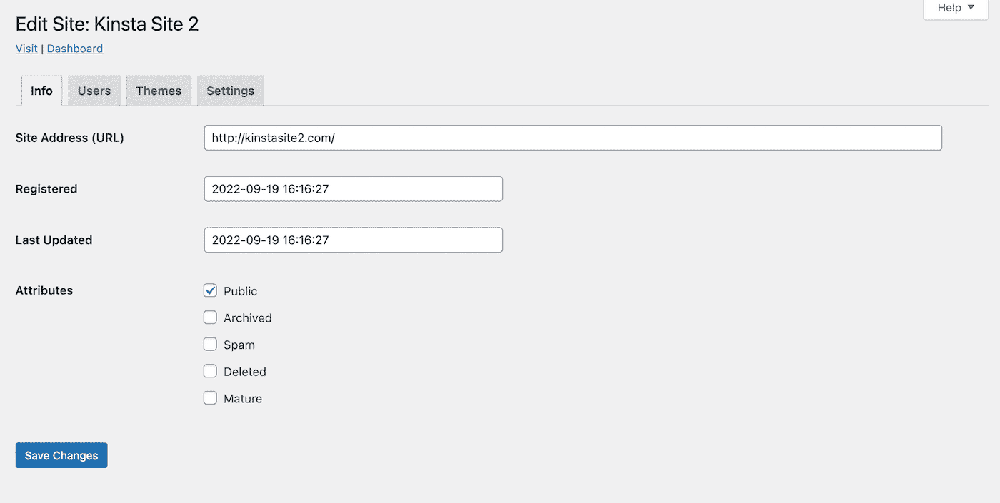
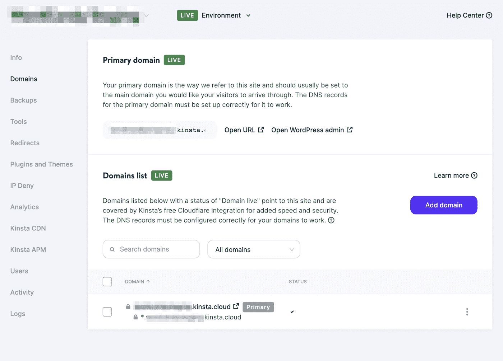
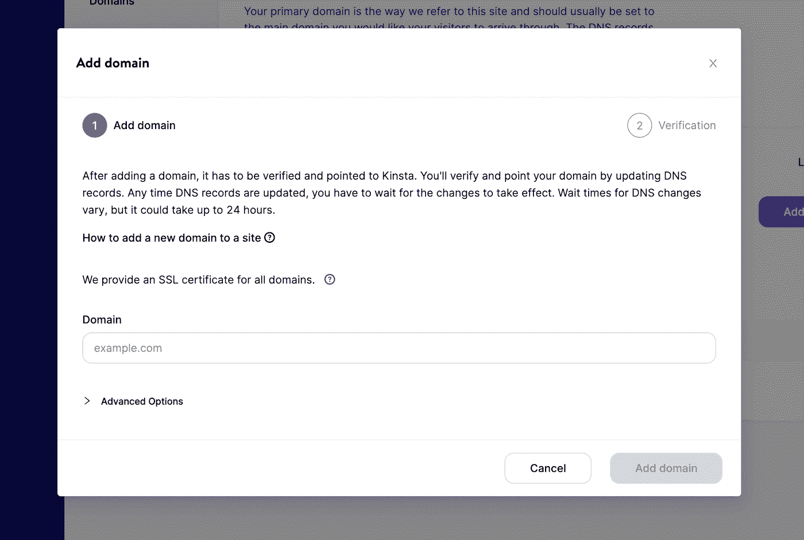

# 如何用不同的域创建一个 WordPress 多站点(4 个步骤)

> 原文:[https://kinsta . com/blog/WordPress-multisite-different-domains/](https://kinsta.com/blog/wordpress-multisite-different-domains/)

在 WordPress 中创建一个多站点可以让你管理多个网站的更新和其他管理任务。你可以在一个 WordPress 安装上建立一个集中的网络，而不是处理许多单独的网站。然而，你可能会对 WordPress 的[子网站域名](https://kinsta.com/knowledgebase/devkinsta/subdomain-multisite/)的默认选项感到失望。

幸运的是，你可以很容易地用不同的域创建一个 WordPress 多站点。只需在站点文件中添加一些代码，就可以将单站点安装变成一个网络。然后，您可以附加新的网站，并使用[域映射](https://kinsta.com/help/multisite-domain-mapping/)使其唯一。

在这篇文章中，我们将解释为什么你会考虑使用 WordPress multisite。然后，我们将向您展示如何为网络中的每个子站点创建自定义域。我们开始吧！

## 为什么创建一个不同域的 WordPress Multisite？

有了 [WordPress multisite](https://kinsta.com/blog/wordpress-multisite/) ，你可以在一次安装中创建一个网站网络。这些网站将共享相同的核心 WordPress 文件，也可以包含相同的插件和主题。

创建多站点时，您可以自动成为新的网络管理员。使用中央仪表板，您将能够在一个地方管理您的所有网站。任何网站管理员现在都可以创建新网站，并在您控制整个网络的同时独立工作。

对于企业或学校来说，这可能是一种有效的方式来处理每个位置的独特网站。例如，玛丽·华盛顿大学有一个网络，可以提供每个校园的信息:


> 需要在这里大声喊出来。Kinsta 太神奇了，我用它做我的个人网站。支持是迅速和杰出的，他们的服务器是 WordPress 最快的。
> 
> <footer class="wp-block-kinsta-client-quote__footer">
> 
> 
> 
> <cite class="wp-block-kinsta-client-quote__cite">Phillip Stemann</cite></footer>

[View plans](https://kinsta.com/plans/)


University of Mary Washington multisite


当你激活 WordPress multisite 时，你可以选择使用[子域](https://kinsta.com/blog/wordpress-subdomain/)或者子目录。下面是一个例子，展示了它们的外观:

*   **子域名**:site1.kinsta.com
*   **子目录**:kinsta.com/site1

正如你所看到的，这两种选择都会使链接更长，可信度更低。然而，您可以实现[域映射](https://kinsta.com/knowledgebase/wordpress-multisite-domain-mapping/)来建立一个定制的域结构。通过指向一个外部域名，比如“kinsta.com”，访问者会立即知道每个单独的网站都是你的网络的一部分。

尽管 WordPress multisite 有很多好处，但也有一些缺点需要考虑。例如，您网络上的所有站点都将使用相同的资源，因此当您的服务器停机时，它们可能会面临停机。

此外，有些插件不是为多站点设计的，这会导致软件冲突或错误。不过，如果您在建立多站点后发现任何严重的问题，您可以随时[再次恢复到单站点安装](https://kinsta.com/blog/wordpress-multisite-to-single-site/)。

[Creating a multisite in WordPress allows you to manage updates and other administrative tasks across multiple websites. 🗂 And getting started is easy... 🛠.Click to Tweet](https://twitter.com/intent/tweet?url=https%3A%2F%2Fkinsta.com%2Fblog%2Fwordpress-multisite-different-domains%2F&via=kinsta&text=Creating+a+multisite+in+WordPress+allows+you+to+manage+updates+and+other+administrative+tasks+across+multiple+websites.+%F0%9F%97%82+And+getting+started+is+easy...+%F0%9F%9B%A0.&hashtags=WordPress%2CMultisite)

## 如何用不同的域创建一个 WordPress 多站点(4 个步骤)

在你开始将你的 WordPress 网站转换到网络之前，你需要确保你的网络主机能够支持这个过程。在 Kinsta，我们提供了 [WordPress 多站点主机](https://kinsta.com/wordpress-multisite-hosting/),使得开始管理多个域变得容易:


Kinsta multisite hosting


通过内置的缓存系统，Kinsta 可以帮助你优化 WordPress 多站点网络的性能。由于全球数据中心和强大的基础设施，你不必担心[缓慢的页面速度](https://kinsta.com/blog/wordpress-slow/)或频繁的停机时间。

无论何时你准备好升级你的主机，你都可以免费在 T2 把你的网站迁移到金斯塔！一旦你有了一个可靠的网络主机，你就可以开始创建一个包含不同域的 WordPress 多站点了。

### 第一步:备份你的网站

如果你正在从头开始创建一个新网站，你可以在安装 WordPress 时激活 multisite。使用 [MyKinsta](https://kinsta.com/mykinsta/) 非常简单。只需在您的仪表盘中点击**添加**T4】站点。然后，确保选择**安装 WordPress multisite** :



Install WordPress multisite in MyKinsta


您还需要选择一个子目录或子域。点击**继续**后，你将能够登录到你的新 WordPress 多站点仪表板。

然而，你可能已经有一个现有的网站。在这种情况下，最好从[备份你的网站](https://kinsta.com/help/wordpress-backups/)开始。因为你将编辑你的核心 WordPress 文件，这是避免丢失你辛苦获得的内容和任何关键数据的重要一步。

一旦您[将您的网站迁移到 Kinsta](https://kinsta.com/blog/migrate-to-kinsta/) ，请登录您的 MyKinsta 仪表盘。然后，导航至**网站**，选择您的网站:


Select Kinsta site


从左侧的选项卡列表中，单击**备份**。在这里，您将看到 Kinsta 执行的[每日自动备份](https://kinsta.com/help/wordpress-backups/)列表:



MyKinsta automatic backups


如果您注意到最近的备份，您可以继续下一步。然而，要执行手动备份，选择**手动>** **备份** **现在**选项:



MyKinsta manual backups


在创建备份之前，您可以添加简短的注释，以便以后识别它。最后，点击**创建备份**:


Create a manual backup


如果在设置多站点时出现任何问题，您可以轻松地[恢复该备份](https://kinsta.com/blog/restore-wordpress-from-backup/)。这将恢复对原始网站的任何更改。

## 注册订阅时事通讯


### 想知道我们是怎么让流量增长超过 1000%的吗？

加入 20，000 多名获得我们每周时事通讯和内部消息的人的行列吧！

[Subscribe Now](#newsletter) ### 步骤 2:设置多站点

现在是时候将你的单站点 WordPress 安装转换成多站点网络了！为此，你需要编辑你的和 **[。htaccess](https://kinsta.com/knowledgebase/wordpress-htaccess-file/)** 文件。首先，使用[代码编辑器](https://kinsta.com/blog/free-html-editor/)打开你站点的**wp-config.php**文件。在这里，找到这条线:

```
/* That's all, stop editing! Happy blogging. */
```

在它的正上方，粘贴以下代码:

```
define( 'WP_ALLOW_MULTISITE', true );
```

最后，保存文件。接下来，打开你的 [WordPress 仪表盘](https://kinsta.com/blog/wordpress-custom-dashboard/)，进入**工具>网络设置**:



Multisite network setup in the WordPress dashboard


在此页面上，您可以选择在网络中使用子域还是子目录。然而，旧的 WordPress 安装将只能使用子域。然后，输入网络的标题和管理员电子邮件。

点击**安装**后，你会被带到一个配置页面。这将指导您如何更新核心文件以支持多站点:



WordPress multisite coding instructions


一旦你给你的**wp-config.php**和**添加了正确的编码。htaccess** 文件，你需要再次登录你的 WordPress 仪表盘。如果操作正确，现在应该会带您进入新的多站点仪表板。

Struggling with downtime and WordPress problems? Kinsta is the hosting solution designed to save you time! [Check out our features](https://kinsta.com/features/)

### 步骤 3:向多站点网络添加站点

要开始构建您的网络，您可以创建一个新网站。首先，导航到**站点>添加新的**:



Add a new subsite


在此配置页面上，您可以自定义您的新网站。你可以通过输入**网站地址**开始，这将是网站的 [URL](https://kinsta.com/knowledgebase/what-is-a-url/) 。

对于此设置，它当前只允许为主站点的子域的值。但是，我们将在接下来的步骤中将其更改为自定义域。

接下来，选择标题、主要语言和管理电子邮件。要完成网站创建，请点击**添加网站**。此后，您可以根据需要继续向网络中添加任意数量的网站。

### 步骤 4:为每个站点映射一个域

最后一步，您可以将子域或子文件夹映射到自定义域。你可以为你的网站创建独特的地址，而不是冗长、混乱的网址。为此，在您的多站点仪表板中导航至**站点>所有站点**:


List of multisite sites


将鼠标悬停在新网站上以查看其配置选项。然后，点击**编辑**:



Open site settings


在这里，您将看到当前的**站点地址，**包括子域。删除它并用自定义域替换它:



Add custom site domain


然后，保存您的更改。请确保对网络中的每个子网站重复此过程。

接下来，您需要将这些额外的子网站域添加到您的托管帐户中。在你的 MyKinsta 仪表盘中，打开**域名**页面，点击**添加域名**:



Kinsta domains list


在弹出窗口中，列出所有新子站点域，并用逗号分隔它们。完成后，选择**添加域**:



Add new Kinsta domains


现在你可以开始在不同的域中使用你的 WordPress multisite 了！您可以开始安装[多站点插件](https://kinsta.com/blog/wordpress-multisite-plugins/)并在您的网络上执行其他必要的管理任务。

[Easily spin up custom domains for each subsite in your network with a little help from this guide 🛠Click to Tweet](https://twitter.com/intent/tweet?url=https%3A%2F%2Fkinsta.com%2Fblog%2Fwordpress-multisite-different-domains%2F&via=kinsta&text=Easily+spin+up+custom+domains+for+each+subsite+in+your+network+with+a+little+help+from+this+guide+%F0%9F%9B%A0&hashtags=WordPress%2CMultisite) ## 摘要

创建一个 WordPress 多站点通常是构建需要多个子站点的网站的有效方法。这允许你用集中的主题、插件和更新建立一个易于管理的网络。虽然这可能涉及比单次安装更复杂的设置过程，但从长远来看，这可能更有效。

当构建一个 WordPress multisite 时，你可以将单个网站设置为子域或子目录。但是，您也可以为每个子网站创建自定义域。这有助于保留您的品牌标识，避免生成冗长且不可读的 URL。

当你准备好开始向多站点过渡时，你需要一个虚拟主机来支持你。查看我们的[多站点托管计划](https://kinsta.com/wordpress-multisite-hosting/)今天就开始管理多达 150 个 WordPress 站点！

* * *

让你所有的[应用程序](https://kinsta.com/application-hosting/)、[数据库](https://kinsta.com/database-hosting/)和 [WordPress 网站](https://kinsta.com/wordpress-hosting/)在线并在一个屋檐下。我们功能丰富的高性能云平台包括:

*   在 MyKinsta 仪表盘中轻松设置和管理
*   24/7 专家支持
*   最好的谷歌云平台硬件和网络，由 Kubernetes 提供最大的可扩展性
*   面向速度和安全性的企业级 Cloudflare 集成
*   全球受众覆盖全球多达 35 个数据中心和 275 多个 pop

在第一个月使用托管的[应用程序或托管](https://kinsta.com/application-hosting/)的[数据库，您可以享受 20 美元的优惠，亲自测试一下。探索我们的](https://kinsta.com/database-hosting/)[计划](https://kinsta.com/plans/)或[与销售人员交谈](https://kinsta.com/contact-us/)以找到最适合您的方式。