# 如何利用 WooCommerce 出口产品

> 原文:[https://kinsta.com/blog/woocommerce-export-products/](https://kinsta.com/blog/woocommerce-export-products/)

许多用户会转向 WooCommerce，以便使用 T2 WordPress 经营一个功能齐全的网上商店。一般的“流”包括将资产、产品和内容引入这两个平台。然而，你也可以[使用 WooCommerce](https://kinsta.com/learn/woocommerce-guide/) 出口产品。

你这么做有很多原因。大多数情况下，您需要执行一些管理工作，比如批量修复条目。然而，如果你选择移动你的虚拟主机，你也可以出口产品。

不管怎样，知道如何出口你的产品——以及相关的步骤——是你箭筒里的一支强有力的箭。

[Knowing how to export your products — and the steps involved — is a powerful arrow to have in your quiver. 🏹 Learn more in this guide ✅Click to Tweet](https://twitter.com/intent/tweet?url=https%3A%2F%2Fbit.ly%2F3Jy135I&via=kinsta&text=Knowing+how+to+export+your+products+%E2%80%94+and+the+steps+involved+%E2%80%94+is+a+powerful+arrow+to+have+in+your+quiver.+%F0%9F%8F%B9+Learn+more+in+this+guide+%E2%9C%85&hashtags=WooCommerce%2CEcommerce)

在本教程中，我们将向您展示如何使用 WooCommerce 来导出产品。我们将收集一些插件来帮助你，并为你提供一步一步的教程来完成这项工作。

首先，让我们简单地讨论一下导出的用例，以及导入过程。

## 为什么你想出口电子商务产品

你所有的[股票和库存](https://kinsta.com/blog/conversions-woocommerce-product-pages/)都在 WordPress——具体来说，就是 WooCommerce。导出这些产品意味着生成一个列表，这样您就可以在另一个程序中处理数据，而不用安装到商店中。

> Kinsta 把我宠坏了，所以我现在要求每个供应商都提供这样的服务。我们还试图通过我们的 SaaS 工具支持达到这一水平。
> 
> <footer class="wp-block-kinsta-client-quote__footer">
> 
> 
> 
> <cite class="wp-block-kinsta-client-quote__cite">Suganthan Mohanadasan from @Suganthanmn</cite></footer>

[View plans](https://kinsta.com/plans/)

A spreadsheet of a product export.

您经常会将这些产品导出为某种电子表格格式，无论是逗号分隔值(CSV)文件、Excel 电子表格还是纯文本文件。

虽然这看起来像是一件激烈的事情，但实际上，你经常会因为一些平凡而常规的原因出口你的产品:

*   效率:通过电子表格批量编辑你的库存比通过 WooCommerce 界面更简单、更熟悉。此外，您可以使用电子表格应用程序的专用功能来节省一些启动时间和精力。
*   **全局错误纠正:**您的产品列表可能有问题，您需要在全局级别进行排序。例如，您的库存单位(SKU)值可能有错误。导出您的 WooCommerce 产品可以让您解决这个问题，并在瞬间重新导入列表。
*   **迁移简单性:**你甚至可能想要[升级你的主机](https://kinsta.com/woocommerce-hosting/)到更健壮的和特定于你需求的东西。如果你出口你的 WooCommerce 产品，将整个列表导入到一个[的新安装](https://kinsta.com/knowledgebase/export-wordpress-site/)，或者一个新的服务器上，什么都不用做。

说到进口，在进入出口流程之前，了解一下如何进口是值得的。这将让你很好地理解条目如何与“内部”和“外部”世界联系起来(至少对于 WooCommerce 来说)。

## 如何导入 WooCommerce 产品和订单

从表面上看，WooCommerce 产品和订单的进口过程似乎很简单。事实上，有许多齿轮组成了整个轮子。

在接下来的几节中，我们将讨论一些“需要知道”的元素，并展示将产品导入 WooCommerce 的确切流程。

### CSV 文件的基础

尽管我们称之为“CSV 文件”，但它并不是真正的文件类型，而是一种文件格式。尽管 CSV 文件有**。csv** 扩展名。

你可以使用几乎任何可以解析和显示文本的应用程序来阅读 CSV 格式。大多数用户会在电子表格应用程序中打开 CSV，因为这将提供相关功能来处理其中的值。然而，从技术角度来说，使用文本编辑器或其他解决方案并没有错。

CSV 文件的关键方面是它使用了“分隔符”用基本术语来说，这是一个分隔符，缺省值是一个逗号，因此格式显示“逗号分隔值”当你使用 CSV 格式时,“翻译”软件(在我们的例子中，是 WooCommerce 和一个电子表格应用程序)会理解由逗号分隔的每一段信息都是唯一的、独立的数据:

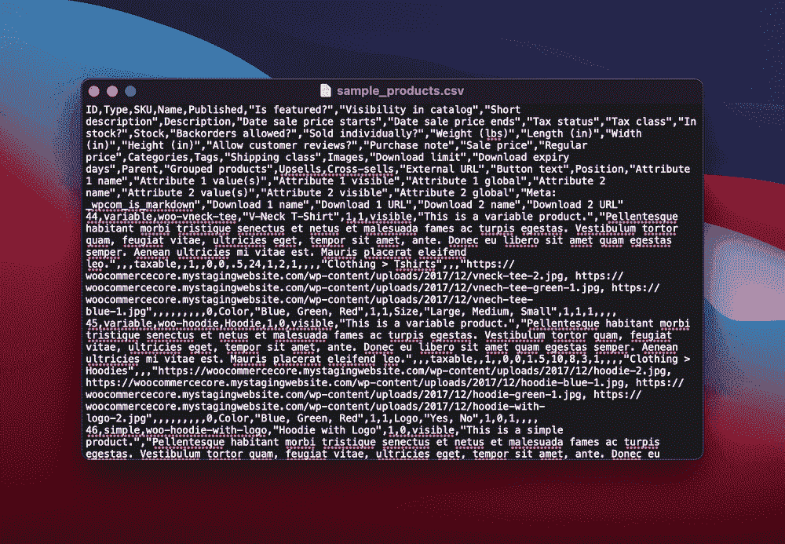

User names separated by commas.

如果没有逗号分隔符，您会看到数据被分成一个单元格:

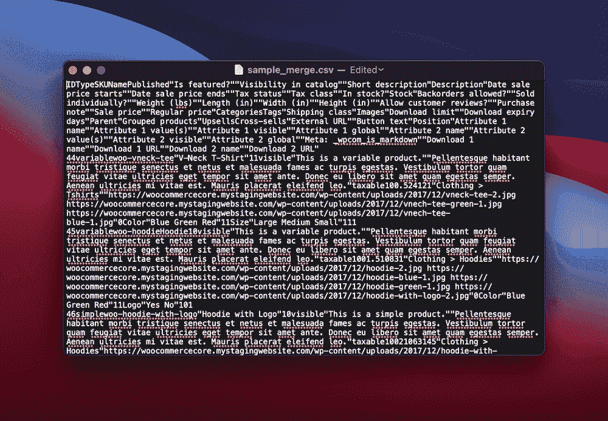

A dataset merged due to the lack of a delimiter.

CSV 格式的美妙之处在于，它不仅不知道用来读取数据的程序，而且不知道导入的程序。如果一个[应用程序可以使用](https://kinsta.com/blog/wordpress-database-plugin/)CSV 值，那么您几乎可以将数据移动到任何地方——只要您可以将数据适当地映射到您导入数据的程序。

### WooCommerce 如何使用 CSV 数据

WooCommerce 使用 CSV 数据的方式与其他程序类似。在 WooCommerce 中，您有许多指定产品价值的字段:

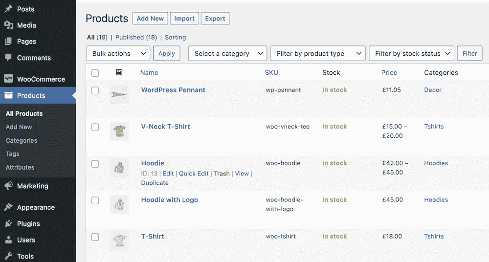

A list of WooCommerce products and data fields.

当您从 CSV 文件导入一组产品时，每个值都将被整理到一个标题下—SKU、产品名称、变量值等等。然而，这些头需要对应 WooCommerce 中的一个适当的值。

例如，如果你的 WooCommerce 产品列表不使用那个头值，你就不能从一个**引擎类型**头导入数据。让我们结合一般的导入流程来讨论这一点。

### 从 CSV 文件导入 WooCommerce 产品和订单

好消息是，尽管有所有的背景信息，WooCommerce 产品和订单的进口程序很简单。这要感谢 WordPress 的友好界面。

为此，您需要一个 CSV 文件，我们将使用 [WooCommerce 样本数据](https://woocommerce.com/document/importing-woocommerce-sample-data/)。这是免费的，尽管你需要从 WordPress.org 的 T4 下载 WooCommerce 插件文件。在其中，您会找到一个名为 **sample-data** 的文件夹，其中包含要使用的文件:

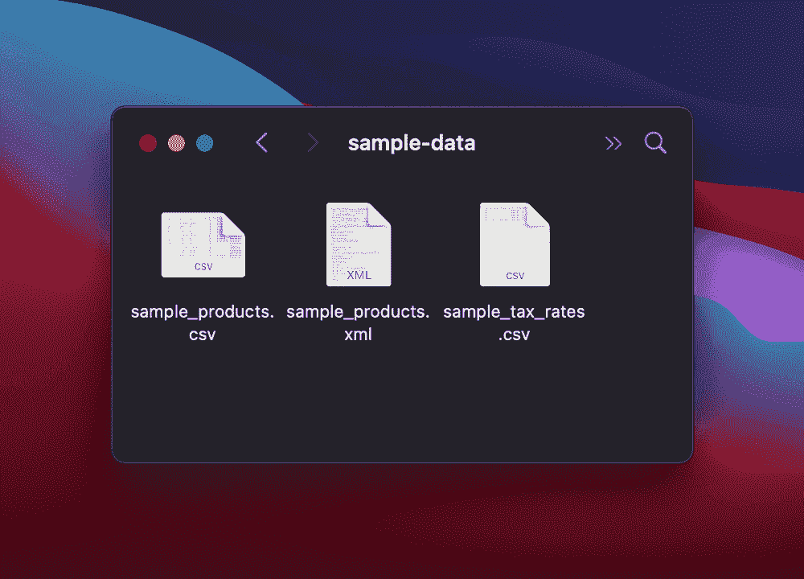

WooCommerce’s three sample data files.

有几种方法可以将产品导入 WooCommerce。如果您有新的安装并通过 Onboarding 向导运行，您可以在该过程中导入 CSV 文件:

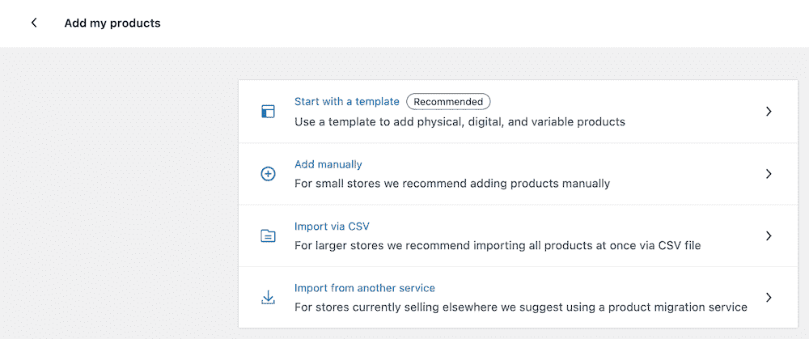

The WooCommerce Onboarding Wizard asking you to import products.

但是，这只会是没有产品的全新门店的一个选项。接下来我们将向您展示如何更新您的 WooCommerce 产品数据，这也包括使用 CSV 文件的导入过程。

#### 使用 CSV 文件更新现有订单和产品

导入 WooCommerce 产品的最佳(也是推荐的)方式是通过 WordPress 中的**产品** > **所有产品**屏幕。如果您选择**开始导入**，您将看到一个选择 CSV 文件的对话框:

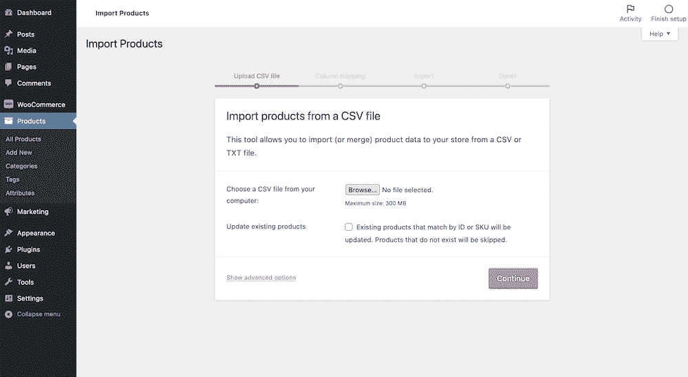

Choosing a file from the WooCommerce import dialog.

如果您点击这里的**显示高级选项**按钮，您可以看到 CSV 文件路径的一些可选设置以及使用先前映射设置的选项。最重要的是选择文件分隔符的选项。如果您的文件不使用逗号，这将有所帮助:

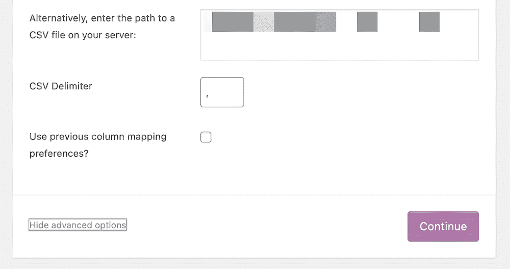

The Show advanced options dialog.

一般来说，这里的过程很简单:从你的电脑中选择一个 CSV 文件，然后点击**继续**。

然而，这里的额外复选框是你如何更新产品。

工具提示解释说，但它会比较具有匹配 ID 或 SKU 的产品，并将信息更新为您的 CSV 文件显示的内容。此外，工作表中与现有产品(即新产品)不匹配的线条不会导入。这意味着您可以用您需要的任何数据更新文件，然后导入它来更新您的库存，所有这一切都使用一个复选框。

### 映射产品列

列映射屏幕是您将 CSV 文件中的列与 WooCommerce 产品标题相关联的方式。事实上，WooCommerce 在这方面做了一个“最佳猜测”——如果您使用样本数据或导入一个以 origins 作为导出的文件，这将是非常准确或足够接近的:

The WooCommerce Column Mapping screen.

检查完这些列并进行必要的更改以帮助您准确映射列后，您可以向下滚动并单击**运行导入器**按钮。从这里开始，WordPress 将做必要的工作，这可能需要一段时间，取决于您的 CSV 文件的大小。

但是，该过程完成后，您会看到一个成功屏幕:

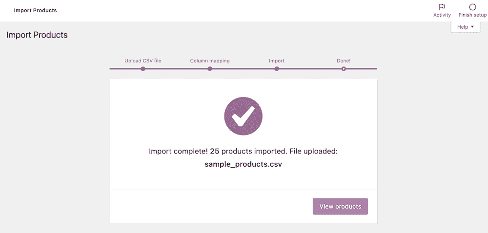

The WooCommerce Import Complete screen.

这就是使用本机功能导入产品所需要做的全部工作。接下来，我们将看看 WooCommerce 在出口方面也提供了什么。

## 如何利用 WooCommerce 出口产品

要从 WooCommerce 导出，您需要前往**产品** > **所有产品**屏幕。一旦产品安装完毕，就会有一个额外的**导出**按钮:

## 注册订阅时事通讯

### 想知道我们是怎么让流量增长超过 1000%的吗？

加入 20，000 多名获得我们每周时事通讯和内部消息的人的行列吧！

[Subscribe Now](#newsletter)

The WooCommerce “Export” button.

但是，如果您在没有选择产品的情况下单击此按钮，将不会导出任何内容。您首先需要使用列表中的复选框选择想要导出的产品，然后单击**导出**按钮。

这将把你带到一个不需要你太多输入的屏幕——**Export Products**对话框:

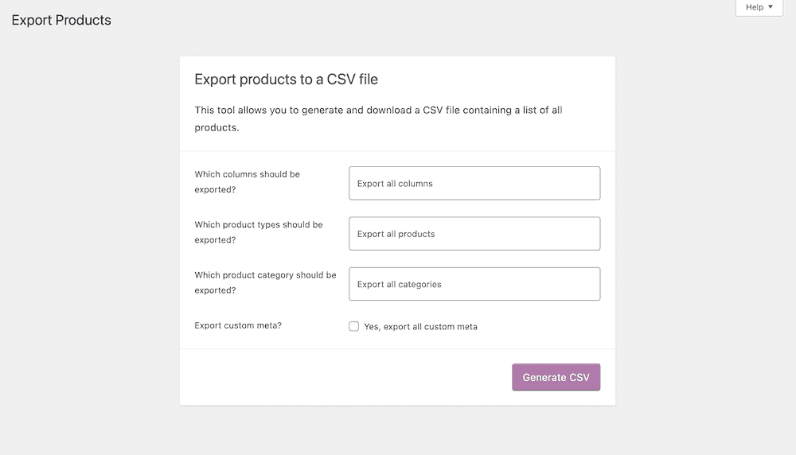

The WooCommerce “Export Products” dialog screen.

在这里，从下拉列表中选择与您想要导出的数据相对应的选项。完成后，点击**生成 CSV** 按钮开始该过程，并将 CSV 保存到您的计算机。

在这里，您可以使用任何您喜欢的程序来查看您的 CSV。比如 Excel 很流行， [Google Sheets](http://sheets.new) 也是。

然而，尽管这个本地过程快速而简单，但它并不是最灵活或最强大的。接下来我们会更深入地讨论这个问题。

### WooCommerce 原生功能的局限性

WooCommerce 的本地导出功能和导入过程的局限性不会在很多日常用例中表现出来。

这是一把双刃剑。一方面，你将能够在很多情况下实现几乎所有你需要的东西。

然而，另一方面，有一些限制直到你遇到它们时才会显现出来。例如，您可能无法以最佳方式导入特定类型的自定义数据和复杂产品。

这就是插件可以帮助的地方，它在本地导出过程和根据您的需求定制的东西之间架起了一座桥梁。automatic 认识到了这一点，这就是为什么他们发布了[产品 CSV 导入套件](https://woocommerce.com/products/product-csv-import-suite/) WooCommerce 扩展。

该扩展在许多方面超越了基本的本机功能:

*   你对其他 WooCommerce 扩展有更多的支持，比如 WooCommerce 摄影、WooCommerce 预订和 Google 产品订阅。
*   有一种方法可以导入、导出和更新定制的复杂信息。无论您[将产品分配给供应商](https://woocommerce.com/products/product-vendors/)，为产品添加品牌名称，还是做其他任何事情，您都可以在 CSV 文件中处理这些数据。

然而，除了第一方的 WooCommerce 扩展，还有更多选择。你也可以使用第三方插件来帮助出口 WooCommerce 产品。我们将在最后一节讨论这个问题，以及如何使用插件导出。

## 如何用插件导出 WooCommerce 产品和订单

鉴于一个插件可能会提供一个更好的出口 WooCommerce 产品的方法，你会在市场上找到很多这样的插件。接下来，我们将运行市场上的一些插件，给你一个提供的味道。

从这里开始，我们将讨论如何使用这些解决方案之一来导出 WooCommerce 产品，并将其与本地方法进行比较。

Struggling with downtime and WordPress problems? Kinsta is the hosting solution designed to save you time! [Check out our features](https://kinsta.com/features/)

### 用于出口 WooCommerce 产品的插件

有各种价位的[插件可以帮助你出口 WooCommerce 产品。你还会发现，尽管有很多可用的插件，但它们中的一大块做了一些与其他插件不同的事情。](https://kinsta.com/blog/woocommerce-plugins/)

像 [WP All Import](https://www.wpallimport.com/woocommerce-product-export/) 这样的插件更多的是一个通用的导出器插件。这里最突出的特性是拖放编辑器。这使您有机会使用类似于页面生成器的界面来构建复杂的产品。您甚至可以使用拖放功能来设计 XML 方案，如果您一想到[使用您的文本编辑器](https://kinsta.com/blog/free-html-editor/)就会不寒而栗，那就太棒了。

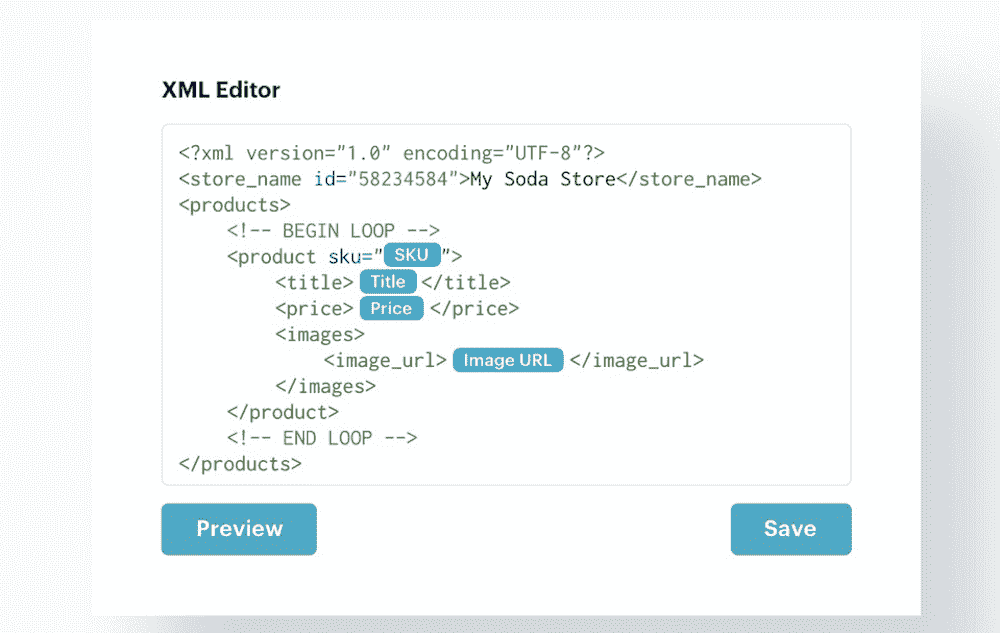

The WP All Import XML Editor.

[产品导入导出](https://www.webtoffee.com/product/product-import-export-woocommerce/)是另一个支持 CSV 和 XML 格式，与第三方插件和 WooCommerce 扩展高度兼容的插件。它还有另一个锦囊妙计。

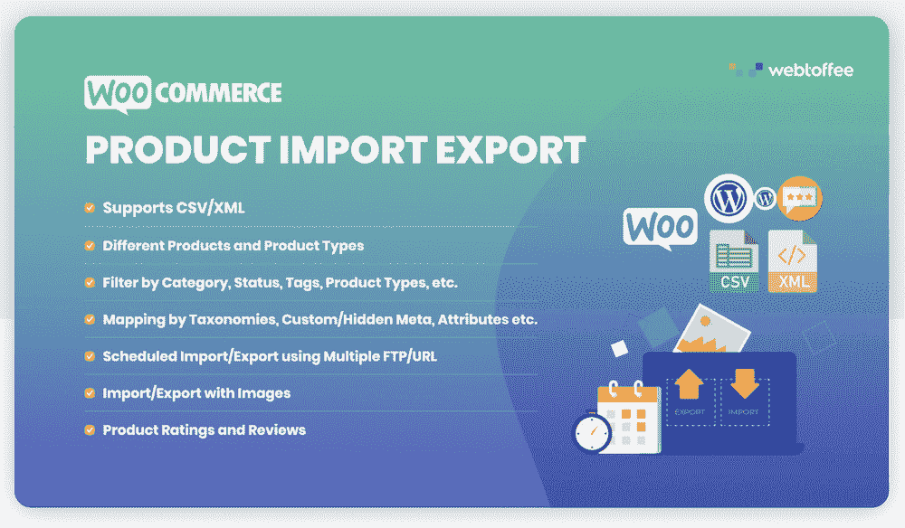

The Product Import Export plugin.

该插件使您能够设置多个[安全文件传输协议(SFTP)](https://kinsta.com/knowledgebase/ftp-vs-sftp/) 通道，以便安排您的导入和导出。这有两个好处:第一，你可以通过 SFTP 以高效的方式传输数据；第二，你采取了一种“不干涉”的方法，这将减少错误并提高你的效率。

虽然这两个解决方案都是高级插件，但您可能不想花钱购买解决方案。WooCommerce Store Exporter 是一个免费插件，专注于极简主义。

The WooCommerce Store Exporter plugin.

您还可以导出到远程 SFTP 格式，以及使用 **POST** 。这是一个开发级功能，如果您需要自定义导出解决方案，它将对您有所帮助。然而，如果你想使用插件作为一个简单的导出工具，有一个点击选项可以输出一个包含你的数据的电子表格。

最后一个插件是我们将在下一节演示的。[WooCommerce 的高级订单导出](https://wordpress.org/plugins/woo-order-export-lite/)与 woo commerce 商店导出器一样简单，在输出设置方面具有更大的灵活性。

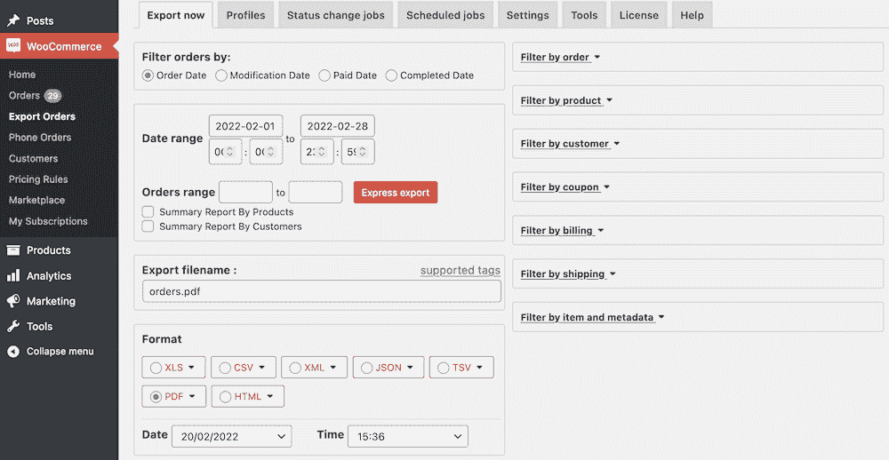

The Advanced Order Export plugin’s dashboard.

你得到了过多的输出设置，这取决于你的需要，你会重视。常见的有 CSV、XML 和 XLS 格式，也有 PDF 和 HTML 格式。

您还可以获得制表符分隔值(TSV)文件格式。虽然这不像设置分隔符那样灵活，但是如果您喜欢使用这种数据格式，它确实给了您一个永久的选择。

### 如何逐步出口电子商务产品

当然，根据你选择的插件，你导出 WooCommerce 产品的过程会有所不同。我们将在这里使用 WooCommerce 的高级订单导出插件，我们将讨论这个过程的一些一般步骤。

一旦你安装并激活插件，你会想要寻找相关的配置文件设置。在大多数情况下，插件会让你创建一个专用的导出配置文件。这使您能够保存一个独特的设置，以便再次使用。

对于 WooCommerce 的高级订单出口，在 **WooCommerce** > **出口** > **配置文件**部分下:

The Export Profiles section of the plugin.

我们可以使用从“立即导出”配置文件中复制的**——如果您点击它，您将进入一个详细的屏幕，显示您需要的字段，以便根据您的喜好完成导出:**

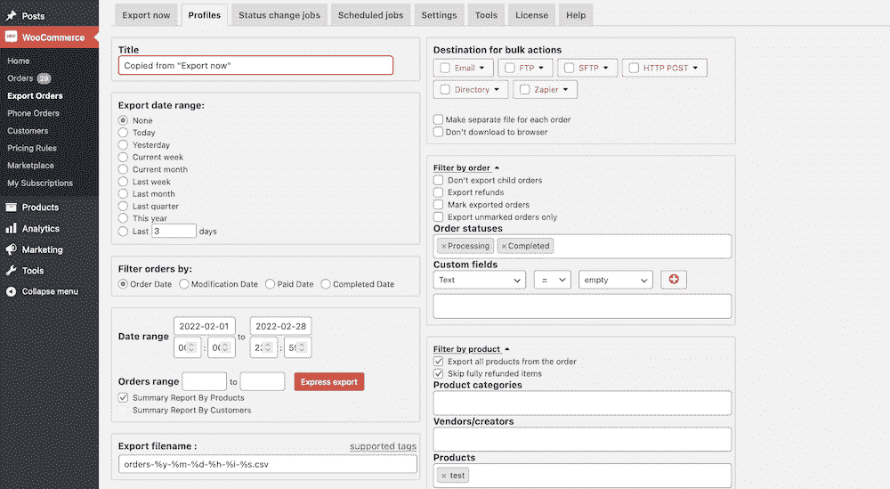

The Export Orders screen showing a single profile.

从这里开始，您需要根据以下内容更改设置:

*   **日期范围:**应该有一个日期范围与你要导出的数据相匹配，仅此而已。
*   **输出格式:**您需要选择合适的输出格式。CSV 将是大多数应用程序的默认格式，尽管您可能也想要一个 XML 格式的副本。
*   **Columns:** 过滤器让您选择要导出的列，因此这应该是您花费大部分注意力的地方。

 woo commerce 的 Advanced Order Export 有无数个过滤器供您选择输出数据的确切范围。例如，我们有针对商品重量、产品是否延期交货(作为自定义字段值)、可变属性等的过滤器:

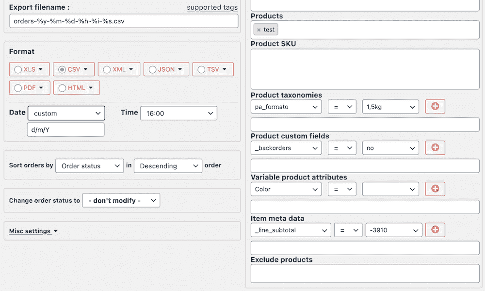

Editing product filters in WordPress.

但是，这不会限制您在电子表格中看到的列数。对于这个插件，您将打开“设置要导出的字段”菜单:

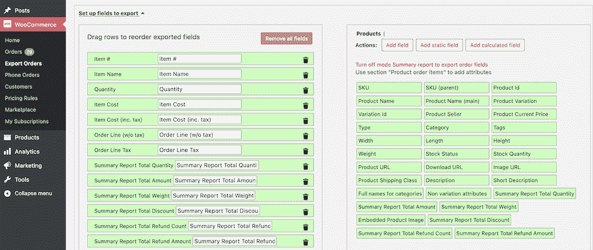

The Field Export list in WordPress.

一旦您设置了这些，最好保存您的更改和配置文件以备将来使用。从那里，您可以运行导出。

对于该插件，如果您想要快速的常规导出，您将使用 **WooCommerce** > **导出订单** > **立即导出**屏幕，或者如果您需要特定的导出，则使用配置文件底部的导出按钮:

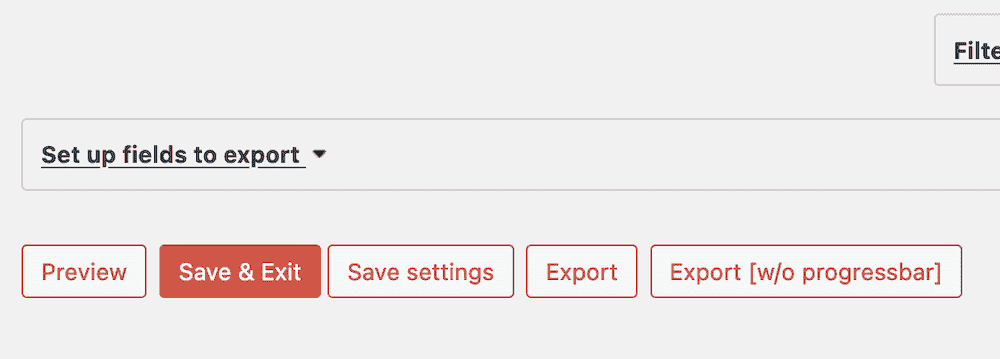

The Export button within WordPress.

这会将包含数据导出的 CSV 文件保存到您的计算机上:

A Google Sheets document that contains the export data from WordPress.

一旦你完成了你的修改，你可以毫不费力地保存并导入电子表格到 WooCommerce 和 WordPress。

[Want to expedite your WooCommerce workflow? Start here 🚀Click to Tweet](https://twitter.com/intent/tweet?url=https%3A%2F%2Fbit.ly%2F3Jy135I&via=kinsta&text=Want+to+expedite+your+WooCommerce+workflow%3F+Start+here+%F0%9F%9A%80&hashtags=WooCommerce%2CEcommerce)

## 摘要

从 WooCommerce 中获取数据的能力是一项基本和必要的能力。因此，WooCommerce 提供了实现这两者的本地方法。虽然内置的导入过程简单、直观并且相对来说没有错误，但是本地导出功能并不总是最好的方法。

这篇文章着眼于使用插件来输出 WooCommerce 产品，好消息是有很多解决方案。一旦你有了你的 CSV 文件，你就可以在 Google Sheets、Excel 或者甚至是文本编辑器中打开它。从那里，您可以将文件导入 WooCommerce 并更新您的产品。

你是否经常出口 WooCommerce 产品，如果是，你的策略是什么？请在下面的评论区告诉我们！

* * *

让你所有的[应用程序](https://kinsta.com/application-hosting/)、[数据库](https://kinsta.com/database-hosting/)和 [WordPress 网站](https://kinsta.com/wordpress-hosting/)在线并在一个屋檐下。我们功能丰富的高性能云平台包括:

*   在 MyKinsta 仪表盘中轻松设置和管理
*   24/7 专家支持
*   最好的谷歌云平台硬件和网络，由 Kubernetes 提供最大的可扩展性
*   面向速度和安全性的企业级 Cloudflare 集成
*   全球受众覆盖全球多达 35 个数据中心和 275 多个 pop

在第一个月使用托管的[应用程序或托管](https://kinsta.com/application-hosting/)的[数据库，您可以享受 20 美元的优惠，亲自测试一下。探索我们的](https://kinsta.com/database-hosting/)[计划](https://kinsta.com/plans/)或[与销售人员交谈](https://kinsta.com/contact-us/)以找到最适合您的方式。