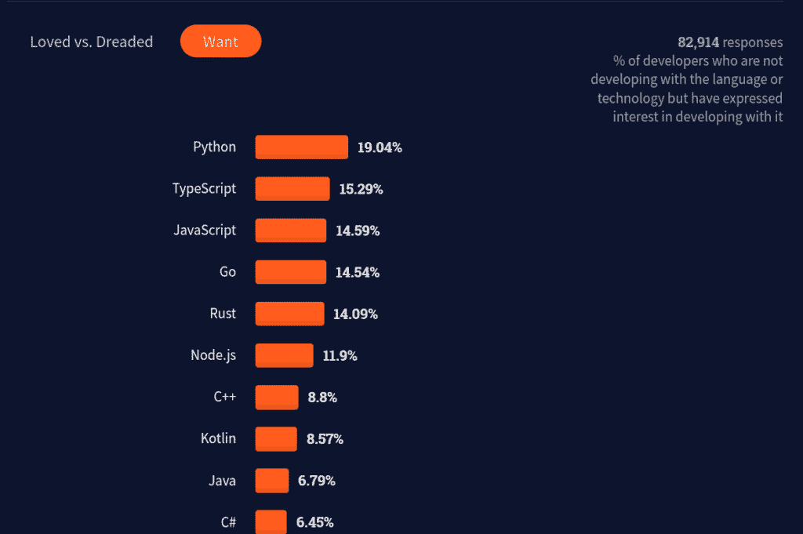
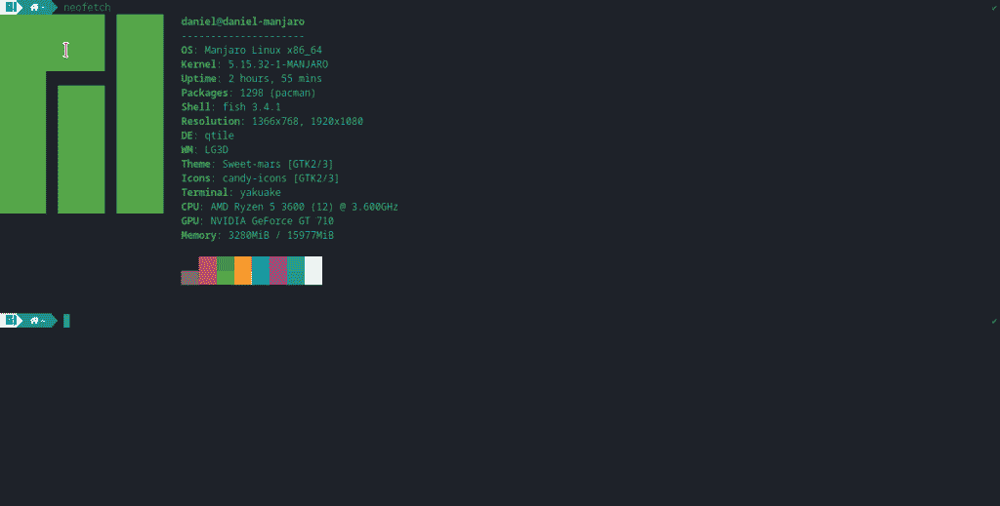
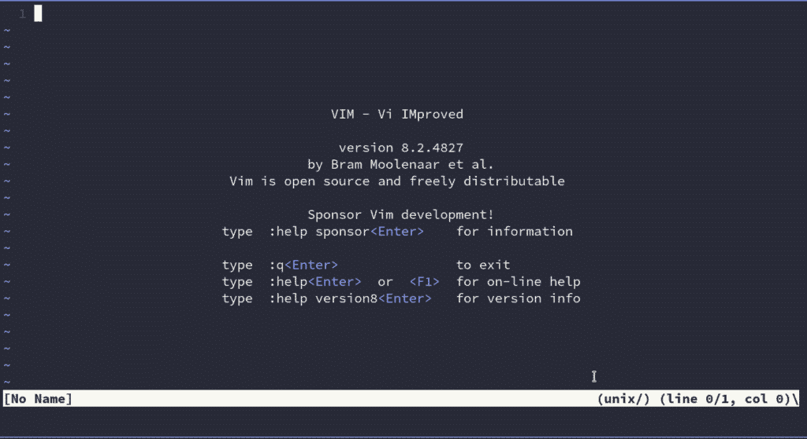

# 您应该知道的 20 多个基本 Python 命令

> 原文:[https://kinsta.com/blog/python-commands/](https://kinsta.com/blog/python-commands/)

Python 是目前最流行的编程语言之一。这是一种强大而简单的语言，几乎可以在任何开发环境中使用。

2021 年栈溢出调查显示 Python 是大多数开发者最想使用的编程语言。



Stack Overflow survey.


[You'll want to bookmark this one for later & save yourself some time in your next project ✅Click to Tweet](https://twitter.com/intent/tweet?url=https%3A%2F%2Fkinsta.com%2Fblog%2Fpython-commands%2F&via=kinsta&text=You%27ll+want+to+bookmark+this+one+for+later+%26amp%3B+save+yourself+some+time+in+your+next+project+%E2%9C%85&hashtags=Python%2CProgramming)

感谢像 Jupyter Notebook、Google Colaboratory 和在线编译器这样的工具，您可以开始使用这种语言，而不必担心安装任何东西。

然而，如果你想更进一步，享受 Python 这样的通用语言的真正力量(特别是通过创建[复杂的应用](https://kinsta.com/blog/node-js-apps/))，迟早你需要学会使用 CLI，或者命令行界面。

 大多数开发人员都认为，学习 Python 最令人生畏的部分之一是 CLI。但是只需要几个命令，你马上就能掌握它。

在本文中，您将学习 Python 开发中最有用的命令。


> Kinsta 把我宠坏了，所以我现在要求每个供应商都提供这样的服务。我们还试图通过我们的 SaaS 工具支持达到这一水平。
> 
> <footer class="wp-block-kinsta-client-quote__footer">
> 
> 
> 
> <cite class="wp-block-kinsta-client-quote__cite">Suganthan Mohanadasan from @Suganthanmn</cite></footer>

[View plans](https://kinsta.com/plans/)

## 什么是命令行界面？

命令行界面(通常缩写为 CLI)是一种基于文本的程序，用于运行程序和执行与操作系统(OS)相关的任务，如创建和管理文件。

CLI 以命令的形式接受来自键盘[的输入，并将它们传递给 shell 或命令解释器。这些 shells 解释用户给出的命令，执行它们并返回一个结果，这个结果通常被称为输出。](https://kinsta.com/blog/linux-commands/)

CLI 可以执行不同的 shells。这个截图展示了两个不同的 CLI，一个使用 Python shell，另一个使用 Bash:


Python and Bash shells.


这两个概念经常被混淆，所以下面是分类:

*   CLI 是一个基于文本的界面，您可以在这里输入命令并获得这些命令的输出。它可以执行不同的外壳。
*   一个**外壳**是一个能够与操作系统交互的命令解释器。

信不信由你，你的系统运行的每个程序都包含一个命令。你每天交互的窗口( [GUI](https://en.wikipedia.org/wiki/Graphical_user_interface) )是由触发命令的绑定组成的，这些命令让你与操作系统进行交互。


### 信息

命令只不过是给计算机操作系统的特定命令。


### Python 开发需要 CLI 吗？

要成为一名高效的[全栈开发者](https://kinsta.com/blog/what-is-a-full-stack-developer/)，你需要对命令行有扎实的了解。这是因为大多数后端框架需要直接与 CLI 进行某种形式的交互，如果你打算自己部署一个应用程序，命令行将是你最好的朋友。

现在，你可以从无数的在线服务中运行 Python，也可以从 ide 中运行 Python，这使得你的程序执行起来更加容易。但是如果你对 [web 开发](https://kinsta.com/blog/git-for-web-development/)——尤其是[后端](https://kinsta.com/blog/backend-vs-frontend/)、任务自动化、区块链、通过 [SSH](https://kinsta.com/blog/generate-ssh-key/) 使用远程计算机，或者管理像 Docker 这样的 Python 友好工具，你肯定需要使用 CLI。

事实上，Python 有很多构建 CLI 应用程序的库，比如 Typer、Argsparse 和 Click。您可以从一名 CLI 用户变成自己 CLI 应用程序的创建者！这展示了 CLI 环境和 Python 之间的紧密联系。

一旦你掌握了 CLI，作为一名 [Python 程序员](https://kinsta.com/blog/python-tutorials/)执行你的任务就会容易得多，而且你会看到使用其他编程语言如 [PHP](https://kinsta.com/blog/php-vs-python/) 、C、C++或 [Java](https://kinsta.com/blog/java-developer/) 时的优势。


## CLI 简介

根据您运行的操作系统，您会发现使用命令行的方式有所不同。由于不同的文件组织结构和默认命令外壳，每个操作系统都有自己打开 CLI 并与之交互的方式。

让我们来看看开发人员最常用的三种操作系统:Windows、Mac 和 Linux。

### Windows 操作系统

Windows 是最受欢迎的桌面操作系统，主要是因为它的价格和易用性。如果要在 Windows 中访问 CLI，必须打开程序“命令提示符”或“Windows Powershell”。

请记住，Windows 使用`\`而不是`/`作为路径。在浏览目录时，您应该记住这一点。

同样在 Windows 上，您可以选择安装 [Git Bash](https://git-scm.com/download/win) ，这是一个命令行，模拟 Windows 中 Bash shell 的行为。这将使下面显示的大多数 Unix 命令与您的系统兼容。

### 苹果个人计算机

至于 Mac，命令行可以从名为“终端”的内置应用程序中访问。您可以使用 Launchpad 搜索它，或者在“应用程序”下的“实用工具”文件夹中找到它。

### Linux 操作系统

在 Linux 上，根据您使用的发行版，您有许多不同的选项，但是命令“Ctrl + Alt + T”通常会触发系统中的默认终端。

现在，您应该有一个类似于下图所示的窗口:



CLI.


## 20 多个对 Python 开发最有用的 CLI 命令

一旦您打开了 CLI，就该开始研究顶级 shell 命令了，这将使您作为 Python 开发人员的生活变得更加轻松。

### 安装命令

您可能已经偶然发现了一百万种安装 Python 的方法。但有时，只需一个命令就可以方便得多。

下面是不同的命令，可以帮助你在不同的操作系统上安装 Python。

#### 1.巧克力吗

在 Windows 上，默认情况下没有软件包管理器。解决这个问题的一个选择是 [Chocolatey](https://chocolatey.org/) ，它为你提供了直接从命令行安装的程序——显然包括 [Python](https://community.chocolatey.org/packages/python) 。

在运行以下命令之前，请确保您[安装了 Chocolatey](https://chocolatey.org/install) :

```
choco install python --pre 
```

#### 2.家酿和 Pyenv

macOS 默认安装了 Python 2.7。然而，Python 2.7 现在已被弃用。整个社区都转向了 Python 3。为了有效地管理您的 Python 版本，您可以使用类似于 [pyenv](https://github.com/pyenv/pyenv) 的程序。

打开一个命令行，用下面的命令安装最新版本的 [Homebrew](https://brew.sh/) (一个类似 Chocolatey 的包管理器):

```
/bin/bash -c "$(curl -fsSL
https://raw.githubusercontent.com/Homebrew/install/HEAD/install.sh)"
```

然后，您可以用这个简单的命令安装 pyenv:

```
brew install pyenv
```

您可以安装特定的 Python 版本，并将其设置为全局 Python 可执行文件，而不是 Python 2:

```
pyenv install 3.10 # Version you want
pyenv global 3.10.4 # Sets that version as default
```

现在，如果您调用 Python，它将是您用 pyenv 设置的版本:

```
python
# Python 3.10.4 ....
# >>>
```

#### 3.apt、pacman 和 dnf

随着 [Python](https://kinsta.com/blog/php-vs-python/) 对[开源软件](https://kinsta.com/blog/open-source-database/)的广泛使用，大量的 Linux 发行版都预装了 Python。如果您的系统没有，您可以用一个包管理器来安装 Python。

在基于 Debian 的发行版(Ubuntu、Linux Mint、Kali Linux)中，您将使用 apt，它代表“高级打包工具”:

```
sudo apt update
sudo apt install python3
```

此外，如果想将 Python 3 设置为默认的 Python 解释器，可以使用以下命令:

```
sudo apt install python-is-python3
```

在基于 Arch 的发行版中，您可以使用官方的包管理器 pacman:

```
sudo pacman -S python
```

在 Fedora 和基于 RPM 的 Linux 发行版(Red Hat，CentOS)中，您使用 dnf:

```
sudo dnf install python3
```

### 解释器命令

让我们快速回顾一下 Python 命令及其包管理器 pip 的主要标志——命令行选项。

#### 4.大蟒

`python`命令有几个标志，表示修改代码执行行为的选项。

首先，要执行一个 Python 文件，只需调用解释器并添加文件名，包括`.py`扩展名:

```
python helloworld.py
```

如果您需要记住标志的作用，您可以在以下三种演示中使用`help`标志:

```
python -?
python -h
python --help
```

要打印(查看)您正在运行的 Python 版本，请使用以下命令:

```
python -V
python --version
```

如果您想在不打开和编辑`.py`文件的情况下运行 Python 代码，您可以使用命令标志直接从终端执行它:

```
# Hello, World!
python -c "print('Hello, World!')"
```

`m`标志将 Python 模块作为脚本执行。当你想用内置的 **venv** 模块创建一个虚拟环境时，这真的很有用:

```
python -m venv .venv
```

#### 5.点

[pip](https://pip.pypa.io/en/stable/) 命令在 Python 包索引(PyPI)中查找包，解析依赖关系，并安装您指定的包版本。

要安装一个 Python 包，你只需输入`pip`和你想安装的包的名字。

以下命令将安装软件包的最新版本:

```
pip install django
```

如果您需要特定的版本，请运行以下命令:

```
# pip install package==version
pip install django==4.0.4
```

当处理协作项目时，您需要跟踪依赖关系，通常是通过需求文件。使用`r`标志，您可以从一个文本文件中读取和安装软件包:

```
pip install -r requirements.txt
```

另一个常用的特性是`freeze`标志。它用于输出您在环境中安装的软件包版本列表。您可以使用它将您的依赖项输出到一个需求文件中:

```
pip freeze >> requirements.txt
```

### 权限命令

Python 确实擅长脚本和文件处理。要处理这些任务，您需要了解一些权限在您的操作系统中是如何工作的。

#### 6.苏多，鲁纳斯

在基于 Unix 的系统(macOS，Linux，BSD)中，你必须有超级用户权限来执行某些任务，比如安装一个程序，就像我们上面做的那样。

sudo 命令允许您短暂地获得管理员权限来执行这些命令之一。

下面是一个全局安装 ueberzug(一个图像预览 Python 包)的例子:

```
sudo pip install ueberzug
```

Windows 的等效程序是 [Runas](http://technet.microsoft.com/en-us/library/bb490994.aspx) ，它以不同用户或管理员的身份执行脚本:

```
runas /noprofile /user:Administrator cmd
```

还有其他类似 [Gsudo](https://gerardog.github.io/gsudo/) 的项目，这使得权限提升过程比其他内置的 Windows 命令更容易:

```
:: Installs gsudo
choco install gsudo

:: Reads a file named MySecretFile.txt
gsudo type MySecretFile.txt
```

#### 7.chmod

`[chmod](https://linux.die.net/man/1/chmod)`用于改变 Unix 中文件和目录的权限。

一种常见的用法是使 Python 脚本可执行:

```
# Makes mypythonscript.py executablechmod +x
mypythonscript.py
```

在您创建了一个可执行脚本之后，您可以使用`./`符号直接运行它:

```
# Runs the script
./mypythonscript.py
```

### 导航命令

在命令行界面中导航文件系统是 Python 开发人员的日常任务。以下是使用 Python 编程时用于导航系统的一些基本命令。

#### 8\. ls, dir

要列出一个目录(文件夹)的内容，必须使用`ls` (Unix)或`dir` (Windows)命令。这可能是您第一次遇到 CLI 时学到的第一条命令。

下面是使用的语法:

```
ls # Shows the contents of the working directory
ls mydirectory
```

下面是本地文件系统中文件夹内容的一个示例:

```
ls test_python/
# classes_error.py radius.py test-Django
```

这个命令有许多有用的标志。事实上，查看[隐藏文件](https://kinsta.com/blog/show-hidden-files/)(开头带点的文件)以及每个文件的模式、大小和日期通常会使用`ls -al`的别名:

## 注册订阅时事通讯


### 想知道我们是怎么让流量增长超过 1000%的吗？

加入 20，000 多名获得我们每周时事通讯和内部消息的人的行列吧！

[Subscribe Now](#newsletter)

```
alias ls="ls -al"

# Results
total 20
drwx------ 3 daniel daniel 4096 ene 16 19:13 .
drwxr-xr-x 36 daniel daniel 4096 may 17 22:18 ..
-rw------- 1 daniel daniel  32 nov 17 2020 classes_error.py
-rw------- 1 daniel daniel 327 nov 10 2020 radius.py
drwx------ 4 daniel daniel 4096 ene 16 01:07 test-Django
```

至于 Windows，您可以使用 Git Bash 来使用`ls`,也可以使用内置的`[dir](https://docs.microsoft.com/en-us/windows-server/administration/windows-commands/dir)`命令:

```
dir
```

#### 9.显示当前工作目录

`pwd`代表“打印工作目录”，它的作用就是:给出你所在目录的完整路径:

```
pwd
# /home/daniel/github/HTML-site/images
```

如果您曾经迷失在终端中，这个命令是您的救命稻草。

您可以通过使用不带参数的`cd`命令在 Windows 中获得相同的输出(注意，Unix 中的相同命令会将您带到主目录):

```
# Only on Windows
cd
# D:\Folder\subFolder
```

#### 10.丙酸纤维素

用图形文件管理器复制文件很直观，但效率很低。使用此命令，您可以在系统上复制任何类型的文件:

```
cp old_file.txt copy_old_file.txt
```

要复制一个目录的所有内容，必须使用`cp -r`:

```
cp -r originaldirectory/ newdir
```

Windows 中的`cp`对应的是`copy`:

```
copy old_file.txt copy_old_file.txt /a
```

#### 11.猫，类型

要在终端中打印文本文件的内容而不使用编辑器打开文件，您可以在 Unix 上使用`cat`、`more`或`less`，在 Windows 上使用`type`:

```
cat old_file.txt # Unix
type old_file.txt # Windows

# Content
Hi there I hope you're enjoying the article ...
as much as I've enjoyed writing it!
End of the sample.
```

#### 12.mv，移动

`mv`命令将文件和目录从一个目录移动到另一个目录——基本上是剪切和粘贴——或者在目标不存在的情况下重命名文件:

```
# Rename files
mv source_file.txt renamed_file.txt
```

```
# File to another directory
mv renamed_file.txt newdir/
```

您还可以使用模式匹配来移动文件。例如，将所有的`.py`文件移动到另一个文件夹:

```
mv *.py mypythondir/
```

Windows 上的一个等效命令是`[move](https://docs.microsoft.com/en-us/windows-server/administration/windows-commands/move)`，其功能与上面的命令几乎相同:

```
# Windows
move source_file.txt renamed_file.txt
```

#### 13.特拉华州 rm

您可以使用`rm`命令删除文件和目录。

要删除一个文件，*而不是*一个目录，您可以使用:

```
rm file_to_remove.txt
```

如果你想删除一个空目录，你可以使用递归(`-r`)标志:

```
rm -r dir_to_remove/
```

要删除包含内容的目录，可以使用 force ( `-f`)和递归标志:

```
rm -rf dir_with_content/
```

以类似的形式，你可以在 Windows 上找到`del`。更加小心，因为这个命令没有上面看到的阻止标志:

```
del \mywindowsdir
```


### 信息

小心使用这个命令。一旦你删除了一些东西，就很难恢复。


#### 14.出口

一旦你完成了你的 Python 编程，你应该能够退出你的 shell 会话。在大多数情况下，这也会关闭您正在使用的终端:

Struggling with downtime and WordPress problems? Kinsta is the hosting solution designed to save you time! [Check out our features](https://kinsta.com/features/)

```
exit
```

请注意，该命令在 Windows 和 Unix 上都有效。

### 命令行编辑器

一旦你习惯了命令行，你会发现改变窗口甚至使用鼠标来编辑你的代码会更慢。

在命令行中编写代码不仅是节省时间的好方法，还会让你在队友中看起来像个超级英雄！

下面是一些最常用的命令行编辑器。

#### 15\. Vim/Neovim

Vim 及其后代 Neovim 是基于键盘的文本编辑器，主要用于命令行。根据 2021 年栈溢出调查，他们在开发者最喜爱的编辑器中排名第 4 和第 1。


Favorite code editors.


Vim 预装在 Linux 和 macOS 上。事实上，当[与服务器](https://kinsta.com/blog/wordpress-server-requirements/)交互时，它是你最常遇到的编辑器。在 Windows 上，你需要使用 Vim 页面上的[可执行安装程序](https://www.vim.org/download.php#pc)来安装它。

现在，只需在命令行中键入 Vim 的名称，就可以享受它的强大功能:

```
vim
```

这将触发一个基于文本的界面，在 Python 中编码时，您可能需要的每个动作都有多个键盘组合。

Vim 有一个陡峭的学习曲线，但一旦你掌握了它，你不会很快转向其他东西。



Vi IMproved.


### 信息

要退出 Vim，请按“Escape”并键入`:q`。


#### 16.毫微；纤（10 的负九次方）

Nano 是另一个命令行文本编辑器，主要用于快速编辑。

假设您在代码中引入了一个语法错误，但不想打开编辑器来纠正它。Nano 帮助您直接从 CLI 修复它:

```
nano
```


### 信息

如果上面的命令出现“未知命令”错误，返回并遵循完整的[安装过程](https://www.nano-editor.org/download.php)。


#### 17.Emacs

Emacs 是你能找到的最具可扩展性和可定制性的文本编辑器之一。它有一整节专门介绍 [Python 编程](https://www.emacswiki.org/emacs/PythonProgrammingInEmacs)，在这里你会发现大量的插件来增强你的开发体验。

Emacs 在几乎所有的操作系统中都有，所以如果你还没有安装的话，看看[下载说明](https://www.gnu.org/software/emacs/download.html)。

要从命令行类型打开 Emacs，使用 no window 系统标志(`-nw`):

```
emacs -nw
```

### 开发工具

Python 开发不仅意味着编码，还意味着处理额外的工具，如虚拟环境、版本控制系统和部署工具。

通过学习下面的命令，你将在用 Python 开发任何类型的应用程序时获得优势。

#### 18.virtualenv/venv

虚拟环境是 Python 开发中使用的一项关键技术。有了它们，您可以将不同项目中使用的包隔离到一个轻量级文件夹中，通常命名为`.venv`。

使用 Python 3.3 或更高版本，您可以使用内置的 venv 模块来创建虚拟环境:

```
# .venv being the name of the virtual environment
python -m venv .venv
```

与内置选项相比，virtualenv 是一个速度更快、可扩展性更强的外部项目。要创建虚拟环境，首先安装 virtualenv 软件包:

```
# Installs virtualenv
pip install --user virtualenv

# Creates a .venv virtual environment
virtualenv .venv
```

接下来，您需要激活虚拟环境。在 Windows 上，根据您使用的是 cmd 还是 PowerShell，运行以下命令之一(推荐):

```
:: PowerShell
.venv\Scripts\Activate.ps1
```

```
:: Cmd
.venv\Scripts\activate.bat
```

在 Linux 或 macOs 上:

```
source .venv/bin/activate
```

#### 19.饭桶

版本控制是软件开发中最重要的实践之一。它允许我们跟踪所有的代码修改，与其他开发人员合作，并查看整个开发过程的清晰画面。

Git 是迄今为止使用最多的版本控制系统。你可以从它的[下载页面](https://git-scm.com/downloads)安装它。

安装完成后，您可以使用以下命令打开一个终端并初步了解所有可用选项:

```
git help
```

要创建存储库，请使用`git init`并键入您的存储库的名称:

```
git init name_repository
Initialized empty Git repository in /home/daniel/name_repository/.git/
```

注意，这只会创建一个本地 Git repo。如果你想有一个远程存储库来在线存储你所有的变更，你应该使用像 [GitHub](https://kinsta.com/knowledgebase/what-is-github/) 或者 [BitBucket](https://kinsta.com/blog/bitbucket-vs-github/) 这样的平台。

要克隆一个远程存储库，您将使用`git clone`和存储库的源。在下面的例子中，我们通过 SSH 克隆了一个 GitHub repo [:](https://kinsta.com/blog/ssh-commands/)

```
git clone [[email protected]](/cdn-cgi/l/email-protection#74131d0034131d001c01165a171b19):DaniDiazTech/HTML-site.git
...
Cloning into 'HTML-site'...
remote: Enumerating objects: 24, done.
remote: Counting objects: 100% (24/24), done.
remote: Compressing objects: 100% (18/18), done.
remote: Total 24 (delta 6), reused 21 (delta 4), pack-reused 0
Receiving objects: 100% (24/24), 4.98 MiB | 438.00 KiB/s, done.
Resolving deltas: 100% (6/6), done.
```

#### 20.码头工人

Docker 使得将 Python 应用程序打包成轻量级、可移植、自给自足的容器更加容易。它有助于开发和部署，允许所有合作者使用相同的设置。

要使用 Docker，您必须严格遵循在 [Get Docker 页面](https://docs.docker.com/desktop/linux/install/)上为您的操作系统显示的安装过程。

要列出可用的 Docker 命令，请运行以下命令:

```
docker help 
```

在这个狭窄的部分很难解释如何运行 Docker compose，所以一定要查看官方文档。

#### 21.可做文件内的字符串查找

Grep 是一个基本的命令行工具，用于纯文本文件中的模式匹配。

常见的用法是找出一个单词在文件中重复的次数:

```
grep -ic python pythondocument.txt
2
```

在上面的例子中，我们得到了 Python(不区分大小写)在`pythondocument.txt`文件中出现的次数。

grep 的 Windows 等价物是 [findstr](https://docs.microsoft.com/en-us/windows-server/administration/windows-commands/findstr) 。然而，它不是完全相同的程序。您可以使用 Git Bash 在 Windows 中利用 grep:

```
findstr /i /C python pythondocument.txt
2
```

#### 22.HTTPie

HTTPie 是一个命令行 HTTP 客户端，它使得与 web 服务的交互更加容易。例如，您可以使用它来测试您的 Python APIs，或者与第三方站点进行交互。

这个 CLI 工具几乎在每个包管理器中都有，如 [HTTPie 的官方文档](https://httpie.io/docs/cli/installation)所示。但是，它也可以作为 Python 包使用，所以您可以用 pip 安装它。

```
pip install httpie
```

以下是查询远程 API 的方法——在本例中，是 [GitHub API](https://api.github.com/) :

```
http GET [https://api.github.com/users/danidiaztech](https://api.github.com/users/danidiaztech)
HTTP/1.1 200 OK
Accept-Ranges: bytes
Access-Control-Allow-Origin: *
...
```

#### 23.砰

默认情况下，几乎任何操作系统都可以使用 CLI 命令。它的工作原理是向一个 IP 地址发送数据包，测试传输数据和接收响应需要多长时间，然后以毫秒为单位显示结果

此命令主要用于验证两台机器之间的连接，即您的机器和 web 服务器上的 Python 应用程序:

```
ping kinsta.com
PING kinsta.com(2606:4700:4400::ac40:917d (2606:4700:4400::ac40:917d)) 56 data bytes
64 bytes from 2606:4700:4400::ac40:917d (2606:4700:4400::ac40:917d): icmp_seq=1 ttl=50 time=686 ms
```

## 命令参考表

下面，您可以找到我们讨论过的每个命令的快速参考:

| **命令** | **用途** |
| --- | --- |
| `choco` | 在 Windows 上安装软件包 |
| `brew` | macOS 软件包管理器 |
| `apt, pacman, dnf` | 不同 Linux 发行版上的软件包管理器 |
| `python` | 运行 Python 解释器 |
| `pip` | Python 包管理器 |
| `sudo, runas` | 用于扩展权限的 Unix 和 Windows 程序 |
| `chmod` | 更改文件权限 |
| `ls` | 列出目录的内容 |
| `pwd` | 打印工作目录 |
| `cp` | 复制文件和目录 |
| `cat` | 打印文件内容 |
| `mv, move` | 移动(重命名)文件和目录 |
| `rm, del` | 删除文件和目录 |
| `exit` | 退出当前 shell 会话 |
| `vim, neovim` | 高效的文本编辑 |
| `nano` | 用于快速编辑的文本编辑器 |
| `emacs` | 最可定制的编辑器 |
| `virtualenv, venv` | 虚拟环境生成器 |
| `git` | 版本控制系统 |
| `docker` | 容器化应用 |
| `grep` | 模式匹配实用程序 |
| `http` | Web 服务测试实用程序 |
| `ping` | 测试网络连接 |
| `kill` | 终止程序 |

## 摘要

Python 是最容易学习的编程语言之一。您将发现的唯一绊脚石是当您进入命令行时，没有理解您将需要的命令。
[大多数开发者都认为学习 Python 最令人生畏的部分之一就是 CLI。😅但是只需要几个命令，你马上就能掌握它💪 点击发送推文](https://twitter.com/intent/tweet?url=https%3A%2F%2Fkinsta.com%2Fblog%2Fpython-commands%2F&via=kinsta&text=Most+developers+agree+that+one+of+the+most+intimidating+parts+of+learning+Python+is+the+CLI.+%F0%9F%98%85+But+with+just+a+few+commands+under+your+belt%2C+you%E2%80%99ll+have+it+mastered+in+no+time+%F0%9F%92%AA&hashtags=Python%2CProgramming)
在这篇文章中，您了解了命令行以及一些用于 Python 开发的最流行的命令。

您发现 Python 开发中还有哪些有用的命令？在下面的评论中分享吧！

* * *

让你所有的[应用程序](https://kinsta.com/application-hosting/)、[数据库](https://kinsta.com/database-hosting/)和 [WordPress 网站](https://kinsta.com/wordpress-hosting/)在线并在一个屋檐下。我们功能丰富的高性能云平台包括:

*   在 MyKinsta 仪表盘中轻松设置和管理
*   24/7 专家支持
*   最好的谷歌云平台硬件和网络，由 Kubernetes 提供最大的可扩展性
*   面向速度和安全性的企业级 Cloudflare 集成
*   全球受众覆盖全球多达 35 个数据中心和 275 多个 pop

在第一个月使用托管的[应用程序或托管](https://kinsta.com/application-hosting/)的[数据库，您可以享受 20 美元的优惠，亲自测试一下。探索我们的](https://kinsta.com/database-hosting/)[计划](https://kinsta.com/plans/)或[与销售人员交谈](https://kinsta.com/contact-us/)以找到最适合您的方式。