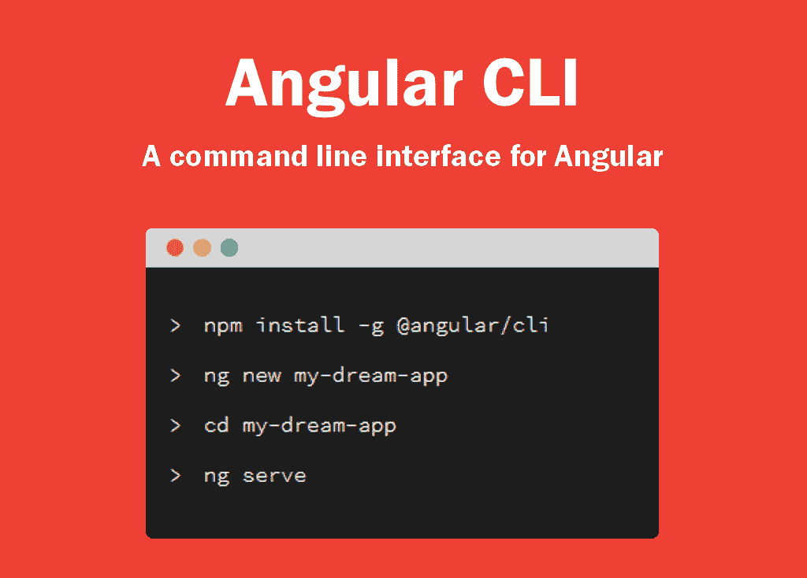
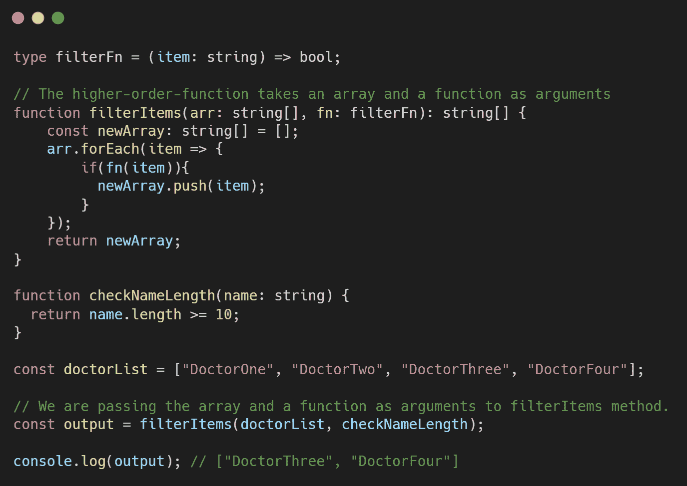
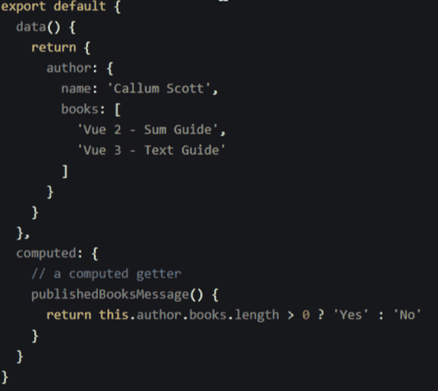
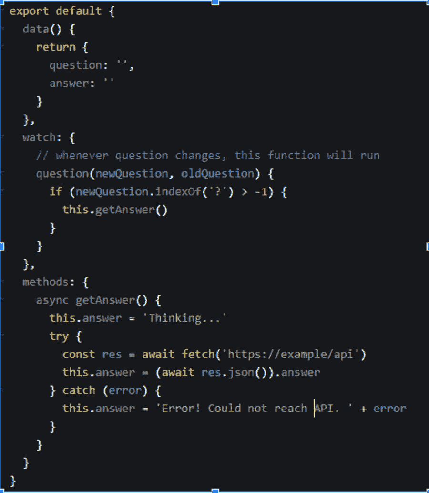

# Angular vs Vue:一个头对头的比较

> 原文:# t0]https://kinta . com/blog/angular-vs-view/

在过去的十年中，框架有了很大的发展，其中一些成为了游戏规则的改变者。每个项目经理或任何其他项目负责人在启动项目之前都会遇到的一个常见问题是，“接下来我必须处理什么技术？”

在本文中，我们将为开发人员展示两个健壮的 JavaScript 框架 Angular vs Vue 的公平比较。

 <kinsta-auto-toc heading="Table of Contents" exclude="last" list-style="arrow" selector="h2" count-number="-1">[Angular vs Vue: pick your fighter 🥊Click to Tweet](https://twitter.com/intent/tweet?url=https%3A%2F%2Fkinsta.com%2Fblog%2Fangular-vs-vue%2F&via=kinsta&text=Angular+vs+Vue%3A+pick+your+fighter+%F0%9F%A5%8A&hashtags=Angular%2CVue)

## 什么是有角？

Angular’s logo.

Angular 是一个基于 HTML 和 TypeScript 的平台和架构，用于创建单页面应用程序。TypeScript 用来写 Angular。它以一组类型脚本库的形式提供基本的和附加的功能，您可以将这些类型脚本库加载到您的应用程序中。此外，它允许用户构建易于管理的大型应用程序。

<link rel="stylesheet" href="https://kinsta.com/wp-content/themes/kinsta/dist/components/ctas/cta-mini.css?ver=2e932b8aba3918bfb818">

> Kinsta 把我宠坏了，所以我现在要求每个供应商都提供这样的服务。我们还试图通过我们的 SaaS 工具支持达到这一水平。
> 
> <footer class="wp-block-kinsta-client-quote__footer">
> 
> 
> 
> <cite class="wp-block-kinsta-client-quote__cite">Suganthan Mohanadasan from @Suganthanmn</cite></footer>

[View plans](https://kinsta.com/plans/)

 <kinsta-advanced-cta language="en_US" type-int-post="125857" type-int-position="0">### 历史

谷歌在 2010 年首次推出 Angular 时，它被称为 AngularJS。它最初是谷歌高级开发人员 Miko Hevery 的一个兼职项目。该项目的最初目标是通过实现一些小的改变来使 web 应用程序开发变得更容易。

它是作为开源项目引入的，就像谷歌的其他项目一样。随着时间的推移，许多使用这个新框架的开发人员不断努力，使它变得更好，对各种 web 项目更有帮助。

这组开发人员最终创建了 Angular 2.0，除了 AngularJS 现有的好处之外，它还有许多新的特性和元素。这个新版本的 Angular 是为了消除旧 AngularJS 的许多限制和缺陷而从头开始创建的。

### 用 Angular 构建的流行 Web 应用程序

Angular 一推出，许多公司就开始在他们的应用程序中使用它。

由于其更快的端到端应用程序开发，以及对大小应用程序的支持，以下公司已经使用它很长时间了:

*   谷歌
*   谷歌邮箱
*   微软 Xbox
*   福布斯（美国出版及媒体集团）
*   贝宝
*   德意志银行
*   维基世界
*   向上工作
*   《卫报》
*   Weather.com
*   微软办公
*   搅拌器
*   深蓝色

## Vue 是什么？

The Vue.js logo.

Web 框架可以是[后端或者前端](https://kinsta.com/blog/backend-vs-frontend/)。Vue 是一个 [JavaScript](https://kinsta.com/knowledgebase/what-is-javascript/) 框架，为构建现代前端 web 项目提供了强大的 web 工具。它也被认为是一个动态的渐进式 JavaScript 框架，因为它通过在不影响任何基本功能的情况下修改应用程序代码来实现渐进式 UI。Vue 的相当大的灵活性支持向 web 应用程序添加定制模块和可视化组件。

### 历史

Vue 是尤雨溪在与谷歌合作了许多基于 AngularJS 的项目后创建的。“我意识到，如果我能简单地拿走我喜欢的棱角，做一些真正轻便的东西会怎么样，”他后来回忆起他的想法。

在 2013 年 7 月项目的初始源代码提交之后，Vue 于次年 2 月发布。

### 使用 Vue 构建的流行 Web 应用程序

正如你所说，Vue 的设计理念是提取 Angular 的最佳特性，同时使其轻量化。许多公司确实对这个想法感兴趣，并开始使用 Vue 来构建他们的应用程序。

*   Teleo
*   电话港:虚拟电话号码管理器
*   Gitlab
*   拉勒维尔火花
*   惯习
*   游戏玩家
*   字体真棒
*   [语法](https://kinsta.com/blog/grammarly-alternative/#overview-of-grammarly)
*   行为
*   砖坯黏土

## 棱角分明的主要特征

Angular 提供了一些引人注目的特性，这些特性对于启动和运行业务应用程序非常有价值。Angular 的一些主要特性描述如下。

*   **MVC 架构:** MVC 是模型-视图-控制器的缩写。模型负责应用程序数据，而视图负责显示数据。另一方面，控制器充当显示层和模型层之间的链接。MVC 架构通常允许你把你的应用分成几个部分，然后创建代码把它们连接起来。
*   **高效的双向数据绑定:** Angular 利用双向绑定，这使得跨级别的数据维护更加容易。它支持不同组件之间的双向数据传输。它还将保证逻辑层和视图组件持续同步，而无需任何额外的工作。Angular 通过使用 ngModel 指令来帮助您完成它。
*   **代码较少的框架:**相比其他前端技术，Angular 确实是一个低代码的框架。用户不必再编写任何代码来连接 MVC 层次。它也不需要手动检查任何独特的代码。指令也与应用程序代码分开。所有这些特性的结合自动减少了开发时间。
*   **Angular CLI(命令行界面):**Angular CLI 反映了创建具有独特内置功能(如 SCSS 支持和路由)的网站的行业最佳实践。此外，标准的 Angular CLI，如`ng-new`或`ng-add`，让程序员可以轻松找到准备充分的特性。

Angular CLI commands.

*   **CDK 和 Angular material:** 作为领先的前端语言，Angular 一直在通过版本更新来增强其组件开发工具包(CDK)。角度 CDK 的当前版本包括刷新和虚拟滚动等功能。它有助于 DOM 的持续加载和卸载，这有助于创建一个大规模的高性能信息列表。ScrollingModule 和 DragDropModule 都可以导入应用程序。
*   **虚拟滚动:**角度虚拟滚动使代码更容易响应不同的滚动事件。除了加载和卸载暴露的 DOM 元素之外，虚拟滚动还支持出色的项目模拟。
*   **TypeScript:** TypeScript was a very popular frontend programming language in 2019\. It effectively detects problems, which cuts down on development time. Moreover, TypeScript automatically fills up the root file configuration for quick compilation. It has more generics, enums, interfaces, hybrid types, access modifiers, union/intersection types, and other features than [JavaScript](https://kinsta.com/knowledgebase/what-is-javascript/).

    

    函数式打字稿示例。

    

*   **依赖注入:**Angular 内置的依赖注入让开发者创建应用更加容易。它只是询问你的依赖关系。简单地说，‘我需要 y’，然后它创造出同样的东西，给你。
*   **指令:** Angular 是第一个提供指令的，它的可访问性随着每次迭代都有所提高。它还允许开发人员扩展 HTML 组件的功能。这些指令在操作 DOM(文档对象模型)树的功能和数据方面是最有效的。

 <kinsta-advanced-cta language="en_US" type-int-post="125857" type-int-position="1">## Vue 的主要特点

Vue 是一个渐进式的 [JavaScript](https://kinsta.com/knowledgebase/what-is-javascript/) 框架。Vue 有很多特性，关于 Vue.js 有很多[重要的事情要知道](https://kinsta.com/blog/vue-js/)

*   虚拟 DOM: Vue 使用虚拟 DOM。虚拟 DOM 组件基本上是 Js 数据结构形式的主要 DOM 元素的副本，并吸收所有 DOM 更改。然后将初始数据结构与引入 Js 数据结构的修改进行比较。只有对查看者可见的最终修改才会出现在真正的 DOM 中。这是一个独特的解决方案，可以快速实施，成本效益高。
*   **数据绑定:**该功能在 Vue 中使用一个名为 v-bind 的绑定指令。它允许用户编辑 HTML 属性或为其赋值，修改格式，以及分配类。
*   **CSS 转换和动画:**这个功能提供了多种方法，用于在 DOM 中引入、更改或删除 HTML 元素时执行转换。它带有一个内置的过渡组件，该组件围绕着负责过渡效果返回的项目。开发人员还可以轻松使用第三方动画库来增强用户体验。
*   **Template:** 如前所述，这个特性提供了基于 HTML 的模板，将 DOM 连接到 Vue 实例数据。它将模板转换成虚拟 DOM 渲染函数。开发者可以使用渲染函数的模板，而渲染函数可以代替模板使用。
*   **Computed Properties:** Computed properties assist in listening to changes made to UI elements and performing the relevant logic, eliminating the need for further coding. We should use a calculated property if we want to mutate a parameter reliant on another variable being altered. Additional data properties heavily influence computed properties. Each and every change to the dependant properties will also cause the logic of the calculated property to be triggered. Since computed properties are cached depending on their dependencies, it will only run if one of those dependents changes.

    

    计算属性举例。

    

*   **Watchers:** Watchers are used on data that is likely to change frequently. A programmer does not need to perform any additional actions in this case. Watcher handles any data updates while still keeping the code simple and speedy. There are three basic approaches to exploiting the reactive nature of Vue components. These three types are Computed Properties, Methods, and Watchers. We use watchers whenever we wish to perform computation due to changes to a specific data attribute. This is the best option if you need to do an asynchronous or costly operation based on changing data.

    

    守望者的例子。

    

*   **方法:**当我们试图改变一个组件的状态时，或者当一个与被改变的实例数据没有必然联系的事件发生时，我们使用方法。尽管方法接受参数，但它们不跟踪任何依赖关系。它导致组件内部的区别。每当重新加载组件时，都会执行方法。
*   **复杂性:**就 API 和设计而言，Vue 更易于使用。它使 web 开发人员能够在一天之内开发简单的应用程序。
*   **灵活性和模块化:**它是 It 的模块化、多功能替代品。如果你不想为应用程序 UI 的每一个组件编码，你可以使用 Vue web-pack 模板。它允许您连接到强大的功能，如热模块重载，CSS 提取，林挺等。任何第三方包都可以轻松添加到 vue.js 中。
*   **指令与组件:**在 Vue 中，指令和组件的角色通过反射性的区别来区分。[组件](https://kinsta.com/blog/web-components/)是自包含的实体，有自己的显示和数据逻辑，而指令封装了 DOM 变化。
*   **优化:** Vue 在渲染时跟踪组件依赖关系。因此，每当表单改变时，系统识别哪些组件需要重新呈现。每个组件将被允许使用 shouldComponentUpdate 来消除嵌套组件的[错误](https://kinsta.com/blog/errors-in-javascript/)。

## Angular vs Vue:相似性和共同特征

Vue 是一个 [JavaScript](https://kinsta.com/knowledgebase/what-is-javascript/) 框架，是 Angular 框架的子框架。因此，毫不奇怪，这些框架有很多共同点。

这两个框架之间有一些相似之处:

*   **模板化**
*   **模型绑定:**这里，语法是相似的，只有属性不同。
*   **循环**
*   **条件句:**除了前缀`ng-`和`v-`外，代码类似。
*   **偶数绑定:**Angular 中不同的事件名称有`ng-click`、`ng-mouseover`、`ng-mousedown`等。Vue 中只有一个名为`v-on`的事件绑定属性。事件的名称出现在定义绑定的字符串中。

## Angular vs Vue:哪个更好？

当谈到不同的属性和功能时，Angular 和 Vue 齐头并进。在这一节中，我们将对一些共同特征进行彻底的比较。

 ## 注册订阅时事通讯

### 想知道我们是怎么让流量增长超过 1000%的吗？

加入 20，000 多名获得我们每周时事通讯和内部消息的人的行列吧！

[Subscribe Now](#newsletter)

### 受欢迎程度和就业市场

Angular 有一个重要的社区，自最初发布以来一直在稳步扩大。它每周收到大约 50 万次下载，在 GitHub 上有超过 7 万颗星。工作机会方面，Angular 的市场更广阔。有了 Angular，[成为 web 开发者](https://kinsta.com/blog/how-to-become-a-web-developer/)就容易多了。它的简单性使你能够设计和管理庞大复杂的网络应用，这也是大多数大企业选择 Angular 的原因。

实际上，我们利用 Angular 框架作为 Angular web 开发业务来生产企业级解决方案。由于 Angular 非常受欢迎，你会从不同的人那里得到各种各样的解决方案。您还可以获得专业开发人员的帮助，而无需漫长的技术支持过程。

Vue 是一个快速扩张的社区。即使它已经迅速成为一个广泛使用的框架，Vue 仍然有一个小市场。因此，Vue 需要几年时间来提供足够的就业机会。

Vue 主要关注开源社区。然而，信息共享目前仅限于角度。

### 学习曲线

你需要[学习 HTML](https://kinsta.com/blog/learn-html/) 、MVC 和 Typescript 来使用 Angular 前端开发框架创建一个应用程序。然而，Vue 的情况并非如此。

Vue 比 Angular 更容易使用，因为它有内置的应用程序模板，并允许更多的灵活性。此外，很容易将 Angular 或基于 React 的移动解决方案集成到 Vue 平台中，因为 Vue.js 是通过结合 Angular 和 React 创建的。

### 性能(速度)

在线和移动应用程序开发的性能水平与 DOM(文档对象模型)直接相关。Angular 利用了 real DOM，即使单个组件发生变化，它也能呈现整个 web/app 页面。

另一方面，Vue.js 使用了虚拟 DOM，它只在已经改变的组件上呈现真实的 DOM。这种方法提高了应用程序的性能，使 Vue 成为超越 Angular 的首选 JavaScript 框架。

### 组件和扩展性

Angular 提供了一个定义更加清晰的应用架构。这在处理大型应用程序时非常有用。许多大型企业使用 angular 胜过其他框架，因为它为所有开发人员提供了一个通用的架构。

Struggling with downtime and WordPress problems? Kinsta is the hosting solution designed to save you time! [Check out our features](https://kinsta.com/features/)

Vue 没有过度结构化，这给开发者提供了很大的灵活性。它提供了对大量构建方法的官方支持，允许您随意定制您的应用程序。应用程序设计没有放之四海而皆准的方法。您可以使用 HTML 或 [JavaScript 文件](https://kinsta.com/knowledgebase/what-is-javascript/)来创建您的模板。

### 状态管理

Angular 自己处理所有事情，并且内置了大多数功能，不需要外部资源。然而，在使用精确的地图简化大规模项目的过程方面，没有什么比 NgRx 商店更好的了。Angular 程序的反应式状态管理由 NgRx 提供，NgRx 是 Angular 库的集合。

Vuex 是 Vue 的一个状态管理库，不同于其他框架，它有助于开发和管理复杂的应用。该库有助于在整个应用程序中存储和共享反应数据，而不会降低性能。这是选择 JavaScript 框架时要考虑的最重要的因素。

### 生态系统

框架及其社区的内部结构有助于开发人员理解其环境并最好地利用它。对特定框架的理解以及流畅而专业地使用它的能力会影响开发速度。

Angular 由一个企业专家团队维护，而 Vue 有一个忠诚的团队和一个开源社区。Angular 提供了内置的解决方案和更全面的文档。此外，这个框架比较老，有广泛的专业社区。

Vue 的优势包括大量的第三方插件和插件，轻量级的架构，以及各种技术的可扩展性。

### 安全性

Vue 和 Angular 都具有针对特定漏洞和有害攻击的内置防御功能。这些特性包括 Vue 的 HTML 内容过滤和属性绑定。Angular 执行类似于消毒的功能。它还防止跨站点请求伪造(XSRF)、跨站点脚本和跨站点脚本包含(XSSI)。

然而，重要的是要注意代码的[安全性通常在程序员的控制范围内是至关重要的。保护您的产品及其消费者的最佳方法是遵循最佳实践，例如及时的框架更新；仅使用可信的模板、API 和插件；和遵守安全文件。](https://kinsta.com/blog/website-security-check/)

### 测试和调试

就测试而言，Angular 是比 Vue 更好的选择。它有一个优秀的测试方法，并提供了许多工具，如 Jasmine 和 Karma，它们可以单独测试整个开发代码。

另一方面，Vue 缺乏适当的测试规则，使得开发者很难提供一个无 bug 的应用。当谈到性能测试时，你可以找到许多[性能测试工具](https://kinsta.com/blog/performance-testing-tools/),用于使用这些框架构建的应用程序。

### 支持和社区

与谷歌支持的 Angular 不同，Vue 完全由开源社区驱动。因此，尽管 GitHub 上有更多的明星、观察者和分叉，它在提交和合作者方面还是落后于 Angular 和许多其他框架。

此外，Vue 迁移辅助工具对于大规模应用程序来说是无效的，因为缺乏一个专注于不断更新其计划的计划。所有这些指标都表明 Angular 在社区支持方面优于 Vue。

## Angular vs Vue 的缺点

正如一句名言所说，每一件好事都有其弊端。这两种框架都有自己的缺点。基于这些，用户可以决定它是否是最适合使用的框架。

棱角分明的最大缺点包括:

*   搜索引擎爬虫的有限选择
*   陡峭的学习曲线
*   太多可用版本，使迁移变得复杂
*   对于小型应用程序来说过于复杂和冗长
*   与 JavaScript 或 TypeScript 紧密结合
*   可能导致性能折衷的双向绑定，尤其是在旧设备中
*   具有挑战性的基于组件的架构
*   由于新框架的出现，受欢迎程度下降

 <kinsta-advanced-cta language="en_US" type-int-post="125857" type-int-position="2">从上面的列表可以看出，Angular 的学习曲线很陡。更重要的是，Angular 对于小型应用来说并不理想，尤其是随着新框架的到来。此外，由于 Vue 等新框架的出现，Angular 正面临着受欢迎程度的下降。

Vue 的最大缺点包括:

*   社区有用性的限制
*   缺乏可扩展性
*   插件很少
*   缺乏高素质的专业人员
*   移动支持的问题
*   困难的双向绑定
*   代码中的过度灵活性

Vue 的主要缺点是它没有太多可以学习的资源，因为它还在发展中。然而，我们也可以预测，这些缺点将随着时间的推移得到解决，因为 Vue 仍然是一个新兴的框架，还有很多改进的机会。
[不确定使用哪个 JavaScript 框架？🤔本帖已覆盖✅ 点击推文](https://twitter.com/intent/tweet?url=https%3A%2F%2Fkinsta.com%2Fblog%2Fangular-vs-vue%2F&via=kinsta&text=Not+sure+which+JavaScript+framework+to+use%3F+%F0%9F%A4%94+This+post+has+you+covered+%E2%9C%85&hashtags=JavaScript%2CWebDev)

## 摘要

两种框架各有优势。Angular 坚固耐用，久经考验，而 Vue 简单快捷。然而，您的业务需要的框架或库完全取决于您的需求和应用程序的目标。

你计划在下一个项目中使用哪个框架——Angular 还是 Vue——为什么？请在下面的评论中分享你的想法。

* * *

让你所有的[应用程序](https://kinsta.com/application-hosting/)、[数据库](https://kinsta.com/database-hosting/)和 [WordPress 网站](https://kinsta.com/wordpress-hosting/)在线并在一个屋檐下。我们功能丰富的高性能云平台包括:

*   在 MyKinsta 仪表盘中轻松设置和管理
*   24/7 专家支持
*   最好的谷歌云平台硬件和网络，由 Kubernetes 提供最大的可扩展性
*   面向速度和安全性的企业级 Cloudflare 集成
*   全球受众覆盖全球多达 35 个数据中心和 275 多个 pop

在第一个月使用托管的[应用程序或托管](https://kinsta.com/application-hosting/)的[数据库，您可以享受 20 美元的优惠，亲自测试一下。探索我们的](https://kinsta.com/database-hosting/)[计划](https://kinsta.com/plans/)或[与销售人员交谈](https://kinsta.com/contact-us/)以找到最适合您的方式。</kinsta-advanced-cta></kinsta-advanced-cta></kinsta-advanced-cta></kinsta-auto-toc>