# 如何集成 Elementor 和 Mailchimp(5 个步骤)

> 原文:[https://kinsta.com/blog/elementor-mailchimp/](https://kinsta.com/blog/elementor-mailchimp/)

Mailchimp 是你网站上最好的电子邮件营销自动化工具之一。它的服务可以有效地组织你的订户，并向他们发送他们感兴趣的内容。然而，Mailchimp 联系方式可能与您网站的品牌不符。

要解决这个问题，可以集成 [Elementor](https://elementor.com/) 和 Mailchimp。使用 Elementor，您可以轻松设计自定义订阅表单并将其嵌入到您的网站中。然后，[可以直接从 Mailchimp 管理注册信息](https://kinsta.com/blog/wordpress-registration-form/)。

在这篇文章中，我们将讨论为什么你可能想要集成 Elementor 和 Mailchimp。然后，我们将用五个步骤向您展示如何做到这一点。我们还包括了一个附加组件列表，以访问额外的特性和功能。我们开始吧！

 <kinsta-auto-toc heading="Table of Contents" exclude="last" list-style="arrow" selector="h2" count-number="-1"><kinsta-advanced-cta language="en_US" type-int-post="119584" type-int-position="0">## 集成 element or 和 mailchimp 的好处

无论你是在经营网上业务还是博客，你都可能需要一种方式来持续联系你的受众。有了 [Mailchimp](https://mailchimp.com/) ，你就可以做到这一点。

<link rel="stylesheet" href="https://kinsta.com/wp-content/themes/kinsta/dist/components/ctas/cta-mini.css?ver=2e932b8aba3918bfb818">

> 需要在这里大声喊出来。Kinsta 太神奇了，我用它做我的个人网站。支持是迅速和杰出的，他们的服务器是 WordPress 最快的。
> 
> <footer class="wp-block-kinsta-client-quote__footer">
> 
> 
> 
> <cite class="wp-block-kinsta-client-quote__cite">Phillip Stemann</cite></footer>

[View plans](https://kinsta.com/plans/)

Mailchimp 是一种电子邮件营销服务，可以建立用户列表和设计电子邮件:

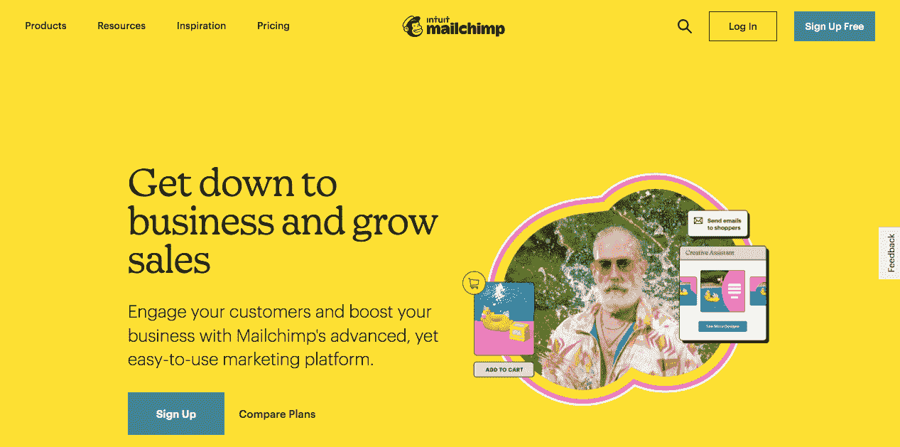

Mailchimp.

使用 Mailchimp，您可以创建包含订户联系信息的电子邮件列表。使用预先制作的电子邮件模板和[内容优化器](https://mailchimp.com/features/content-optimizer/)，您可以向您的受众发送引人入胜的信息更新。

如果您是 Mailchimp 的新用户，您可以免费创建一个帐户。只要你的订户少于 2000 人，你就可以免费使用其易于使用的功能。

当你试图增加你的邮件列表时，在你的网站上嵌入一些订阅表格是个好主意。他们可以帮助你从你的有机交通产生线索。虽然 Mailchimp 有这个功能，但是它的嵌入形式通常是通用的，很可能与你的品牌不匹配。

这就是 Elementor 的用武之地。Elementor 是一个简单易用的页面生成器，你可以用它来设计你的网站，而不需要编码。它的拖放式编辑器使创建您的站点所需的特性和功能变得简单:

Elementor page builder.

此外，Elementor 可以轻松地与 Mailchimp 集成。[与其他页面构建器](https://kinsta.com/blog/divi-vs-elementor/#divi-vs-elementor-which-one-should-you-choose)相比，Elementor 是创建和管理选择加入表单的最佳选项之一。

有了 Elementor，你可以在网站的任何地方添加一个[联系人表单](https://kinsta.com/blog/wordpress-forms/)，并在它的设置中链接 Mailchimp。当您的在线访问者注册后，他们将自动添加到您的 Mailchimp 列表中。使用这两种工具可以让您拥有设计良好的表单，而不会错过订户分析。

[Elementor+ Mailchimp = the dream team 😌 Learn more about integrating these two powerful tools in this guide 🚀Click to Tweet](https://twitter.com/intent/tweet?url=https%3A%2F%2Fkinsta.com%2Fblog%2Felementor-mailchimp%2F&via=kinsta&text=Elementor%2B+Mailchimp+%3D+the+dream+team+%F0%9F%98%8C+Learn+more+about+integrating+these+two+powerful+tools+in+this+guide+%F0%9F%9A%80&hashtags=Mailchimp%2CElementor)

## 如何集成 Elementor 和 Mailchimp(5 个步骤)

现在你已经知道 Elementor 和 Mailchimp 如何让你的网站受益，让我们讨论一下如何开始这个整合过程！

### 第一步:注册一个 Mailchimp 账户

首先，你需要去 Mailchimp 网站[注册](https://login.mailchimp.com/signup/)账户。您只需输入您的电子邮件地址、用户名和密码，即可免费完成此操作:

Sign up for a Mailchimp account.

然后，Mailchimp 将向您发送一封带有激活链接的电子邮件。点击此处，您将看到一个包含不同计划选项的页面:

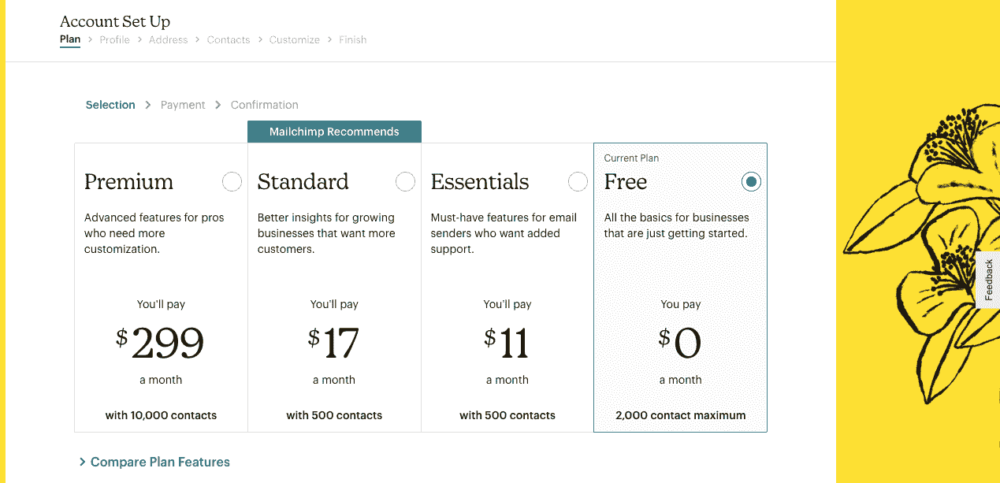

Mailchimp plan options.

如果您不确定哪个计划适合您，请选择**比较计划功能**。在这里，您可以查看每一层中的所有内容:

Compare Mailchimp plans.

在本教程中，我们选择了**免费计划**，它可以支持 2000 个联系人和 10000 封电子邮件。这对于一个基本的[电子邮件营销计划](https://kinsta.com/blog/email-marketing-automation/)来说已经足够了。但是，您将无法访问重定向广告、自定义编码的电子邮件模板或自定义品牌。

要开始注册过程，请填写您的姓名和业务信息。尽管这是可选的，但您也可以输入您网站的 URL 并导入您的内容:

Add your name and business info.

接下来，填写您的地址信息。此步骤确保您的电子邮件不会导致垃圾邮件:

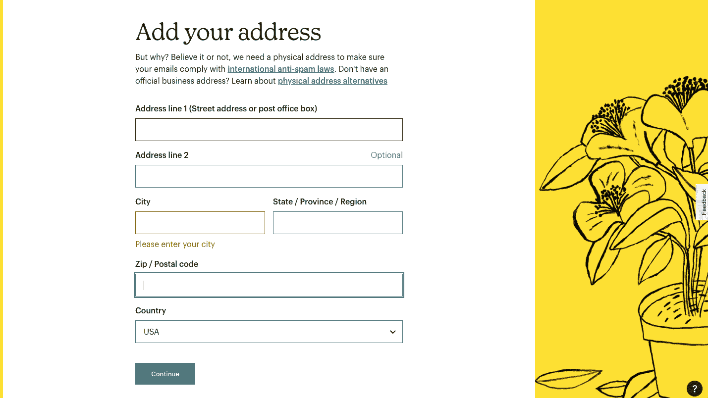

Add your address to the field.

Mailchimp 会询问你是否已经有用户。如果是，选择**是**并填写您有多少:

Fill in how many subscribers you have.

为了帮助 Mailchimp 了解您的业务，请指明您销售的是产品还是服务。要绕过这个问题，您可以点击**跳过**:

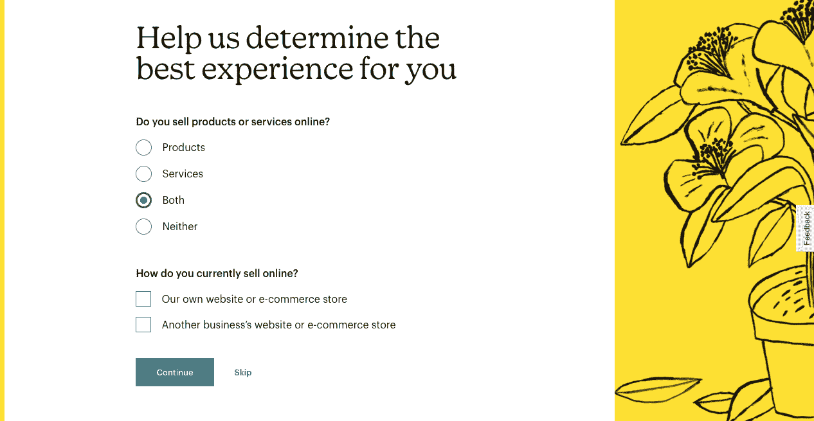

Products or services option.

完成注册过程后，您将能够访问您的 Mailchimp 帐户！

### 步骤 2:创建受众和 API 密钥

要开始在 Mailchimp 中组织您的订户，您需要创建一个受众。请记住，一个免费帐户只支持一个观众，但任何高级计划可以包括三个或更多。

尽管你可能想创造几个受众，Mailchimp 建议从一个开始[。这种设置可以帮助您从整体上了解您的订户。它还可以简化您的电子邮件流程，并随着公司的发展保持您的联系。](https://mailchimp.com/resources/one-audience-organize-contacts-to-optimize-marketing/)

即使只有一个受众，您也可以创建标签和段来将联系人组织成不同的子集。然而，建立多个受众可以有一定的好处。

例如，如果您同时向卖方和买方发送电子邮件，您可能需要向这些群体分别发送邮件。

在你的 Mailchimp 仪表盘中，转到**观众>观众仪表盘**。然后，点击**添加您的联系人**:

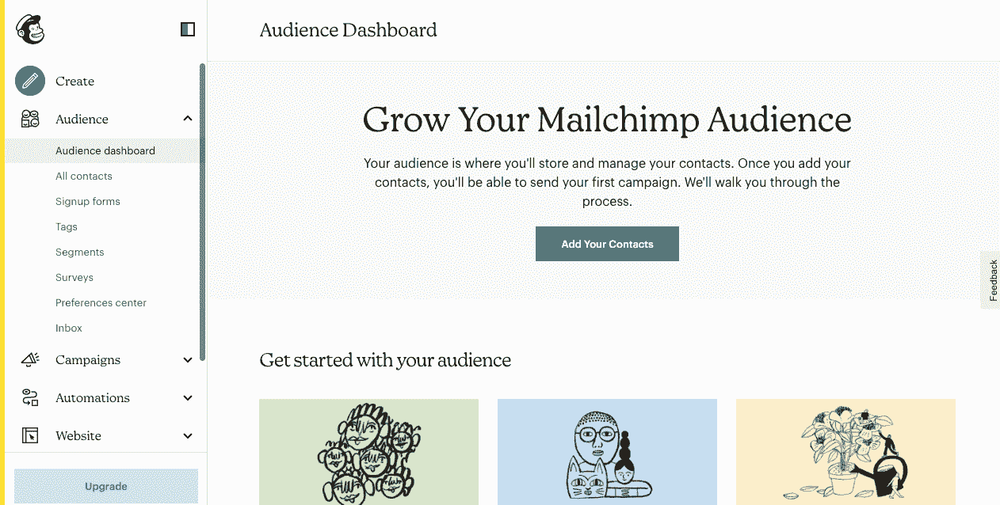

Add contacts in Mailchimp.

这将带您进入一个页面，导入您的订户的联系信息。只需将他们的姓名和电子邮件地址复制并粘贴到文本框中。或者，您可以从第三方服务导入数据或上传 CSV 或 TXT 文件:

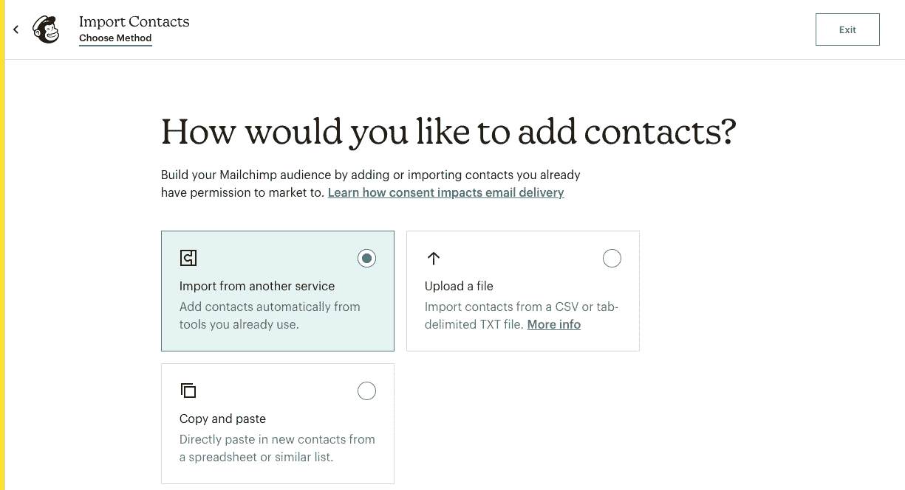

Different upload options are available.

一旦你做到了这一点，去你的**观众仪表板**，找到**管理观众>设置**。在这里，您可以更改名称和默认设置:

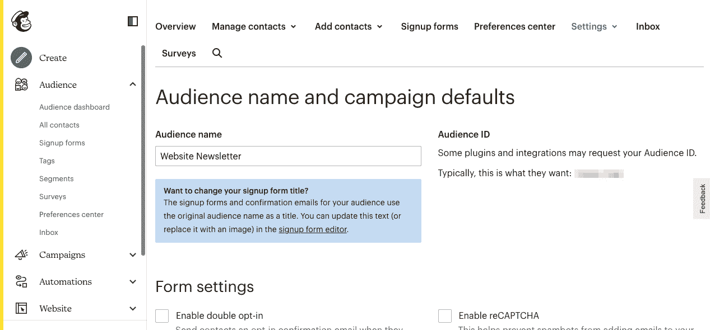

Change the name and default settings.

请务必从姓名设置一个**，从电子邮件地址**设置一个**。您还可以启用双重选择加入，以便在订户注册后向他们发送确认电子邮件:**

Add more campaign options.

创建和设置完帐户后，请转到您的**个人资料**。然后点击**附加功能> API 键**:

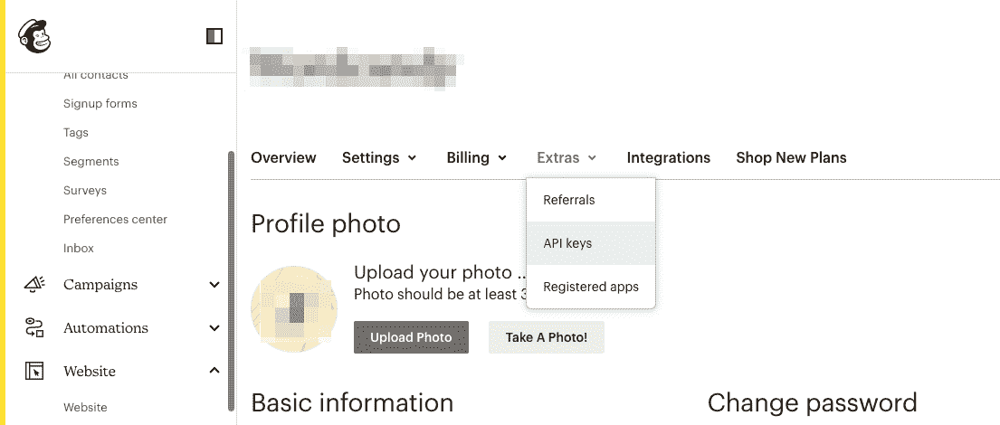

Click on the “Extras” tab to find the API option.

如果你没有 API 密钥，你需要点击**创建一个密钥**。Mailchimp 会自动为您添加一个:

Create an API key.

一旦你的 [API 键](https://kinsta.com/knowledgebase/api-endpoint/)被激活，复制它。由于此信息授权访问您的 Mailchimp 帐户，因此切勿公开共享此代码。

### 步骤 3:用 Elementor 设计一个 Mailchimp 注册表单

接下来，你需要下载并[安装 Elementor Pro](https://elementor.com/help/installing-elementor-pro/) 。它包括一个 [WordPress 表单生成器](https://elementor.com/features/form-builder/)，你可以用它来设计定制表单，并从你的观众那里收集反馈。

激活 Elementor Pro 后，进入 **Elementor >设置>集成**。向下滚动到 **Mailchimp** 部分并粘贴 API 键:

Paste your Mailchimp API key.

点击**验证 API 键**。如果集成成功，您会在该按钮旁边看到一个绿色的勾号。在此之后，保存您的更改。

现在您可以开始设计您的注册表单。首先，添加一篇新文章或页面，并选择**用元素编辑或**:

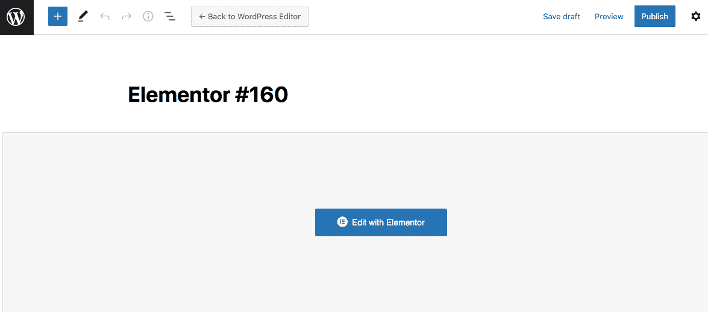

Select “Edit with Elementor”.

在 Elementor 编辑器中，向下滚动到 **Pro** 小部件。在这里，您将看到一个**表单**的选项。将此小部件拖放到页面上:

Drag and drop the “Form” widget to the page.

Elementor 将自动创建一个基本表单，包括姓名、电子邮件地址和消息字段。但是，您可以继续自定义表单，直到它满足您的需要:

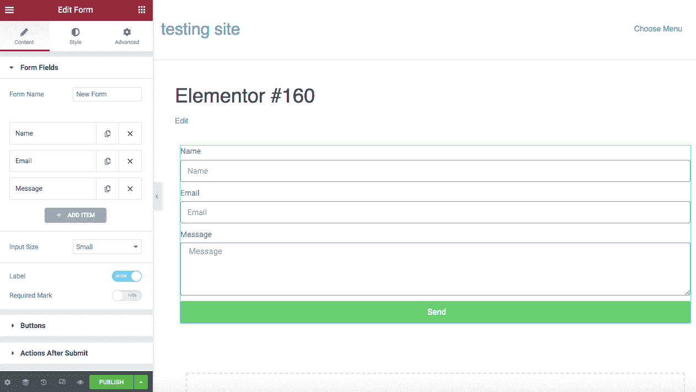

Customize the form how you see fit.

例如，如果您想要[添加一个订阅表单](https://kinsta.com/blog/wordpress-registration-form/)，它通常不需要消息字段。你可以简单的点击这个项目旁边的 **X** 。

为了产生潜在客户，你需要要求访问者填写他们的姓名和电子邮件。您可以点击每个字段并选择【T2 要求】旁边的**是**:

 ## 注册订阅时事通讯

### 想知道我们是怎么让流量增长超过 1000%的吗？

加入 20，000 多名获得我们每周时事通讯和内部消息的人的行列吧！

[Subscribe Now](#newsletter)

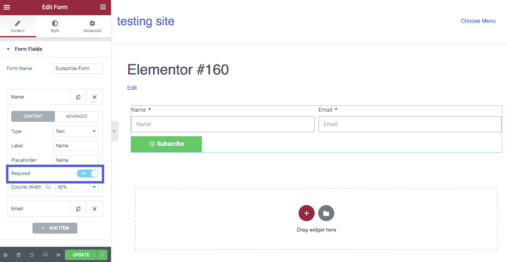

Click on the appropriate elements.

然后，转到**按钮**部分编辑动作按钮。尽管默认文本是“发送”，但考虑将其更改为“订阅”或“注册:”

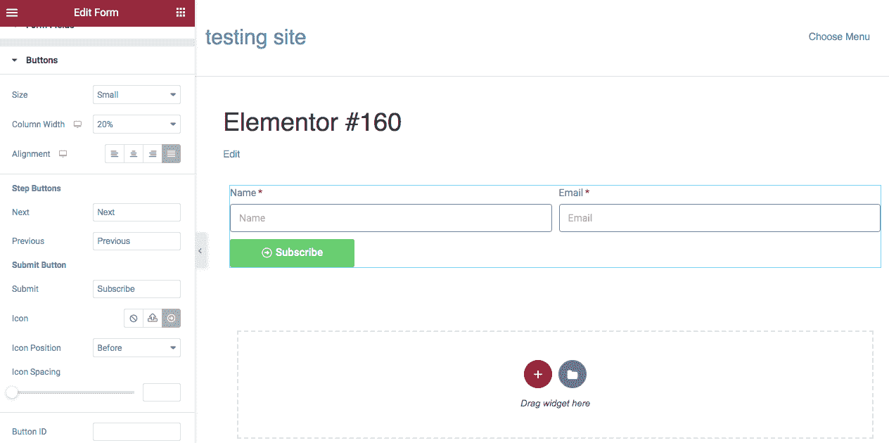

Edit the button action in Elementor.

您可以根据需要继续更改按钮的大小和列宽。如果你愿意，你也可以添加一个图标。

 <kinsta-advanced-cta language="en_US" type-int-post="119584" type-int-position="1">### 第四步:连接 Mailchimp

根据自己的喜好自定义表单后，就可以连接 Mailchimp 帐户了。为此，在提交部分之后找到**动作:**

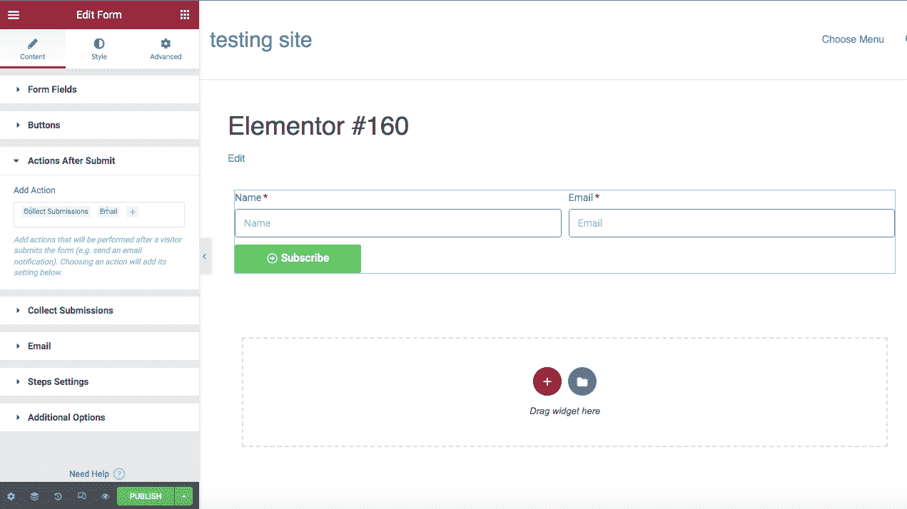

Access the “Actions After Submit” option.

然后，点击 **+** 图标，从下拉菜单中选择 **Mailchimp** :

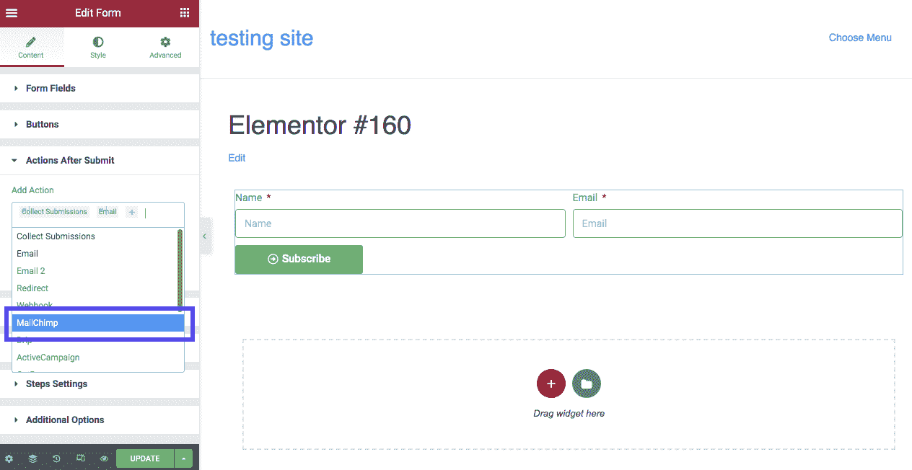

Choose Mailchimp from the dropdown menu.

这将在下面创建一个名为 **Mailchimp** 的新部分。当您点击它时，您将看到设置 API 密钥和受众的选项:

Set API and audience options if needed.

如果您已经在集成设置中输入了您的 API 密钥，您可以将 **API 密钥**部分保留为**默认**。然后，选择您想要链接到此订阅表单的**受众**:

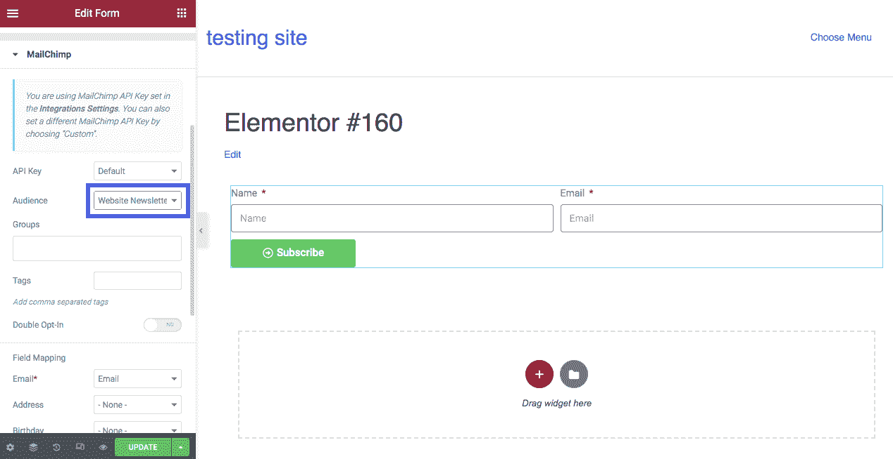

Select the appropriate audience from Mailchimp.

您还可以选择您在 Mailchimp 中创建的任何群组或标签。最后，根据您在表单中提供的字段定制**字段映射**设置。这将告诉 Mailchimp 在其系统中编目哪些信息。

对于这个例子，我们的订阅表单只包含一个姓名和电子邮件字段。这意味着我们将只在**字段映射**部分包含此信息:

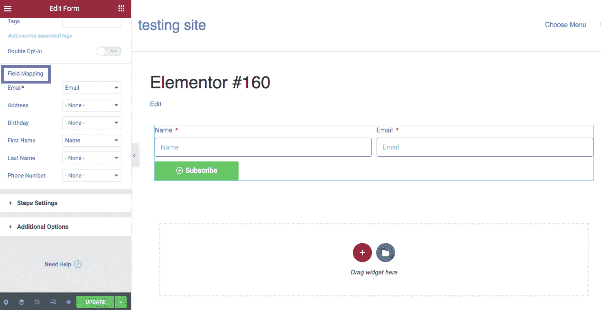

Field Mapping options.

最后，导航到**附加选项**并找到**自定义信息**。打开此选项以在某人完成表单后提供成功消息:

Add a success message for your users.

默认消息将是“此表单已成功发送”你可以考虑把它改成类似于“感谢你的订阅”您还可以为错误和必填字段添加自定义消息。

### 步骤 5:将表单添加到您的站点

完成表单定制后，选择**发布**。考虑自己使用注册表单来检查它是否正常工作。然后，您可以查看新的[电子邮件地址](https://kinsta.com/blog/professional-email-address/)是否记录在您的 Mailchimp 帐户中。

您可能还想将这个新表单添加到网站的多个区域。您可以将它保存为一个全局小部件，以便简化这个过程。

首先，在表单右侧找到**编辑表单**图标。右键点击并选择**另存为全局**:

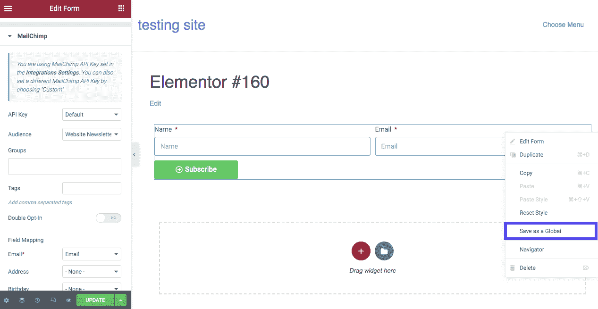

Save as Global.

这将把订阅表单添加到您的**全局设置**中。当你添加一个新页面或帖子时，你只需进入 **GLOBAL** ，找到预先设计好的表单，然后将其拖放到你想要的任何地方:

Struggling with downtime and WordPress problems? Kinsta is the hosting solution designed to save you time! [Check out our features](https://kinsta.com/features/)

Drag and drop the Global form wherever you want.

当考虑在网站的什么地方放置订阅表单时，您可能会考虑可见性。你可以在一个设计良好的[登陆页面](https://kinsta.com/blog/wordpress-landing-page-plugins/)上收集更多的线索，访问者在进入你的网站时可以看到。然而，用户可能没有兴趣这么早订阅。

有时，一个更好的选择是在你的内容或侧边栏中包含联系方式。虽然这比登陆页面的可见性稍差，但这种布局可以让访问者在与你的网站互动时订阅。

将表单添加到页脚也是一个实用的选择。滚动到网站底部的用户通常对你的内容很好奇，这意味着他们更有可能订阅。但是，这种放置不像其他选项那样明显。

## Elementor/Mailchimp 集成的顶级附加组件

有了[最好的 WordPress 插件](https://kinsta.com/best-wordpress-plugins/)，你可以为你的观众创建一个定制的网站。Elementor Pro 为设计表单和集成 Mailchimp 等第三方服务提供了大量选项。

尽管如此，您可能需要更多的高级功能。通过一些加载项，您可以更好地控制表单的外观和功能。

### 1.基本附件

使用[基本插件](https://essential-addons.com/elementor/)是扩展核心元素或特性的好方法。有了这个工具，你可以接触到更多的创意元素。其中包括交互式功能，如 Woo 产品网格、倒计时和可过滤图库:

Essential Addons.

**特性:**

*   高级内容小部件，用于添加活动日历、信息框、证明等
*   [WooCommerce](https://kinsta.com/blog/woocommerce-vs-shopify/) 产品展示区、网格和传送带等元素
*   与 Mailchimp 和 Ninja Forms 等第三方平台集成

当你在你的 WordPress 站点上安装基本插件时，你可以使用 Mailchimp 的 [Form Styler 元素](https://essential-addons.com/elementor/docs/form-styler-elements/mailchimp/)来集成它。在这里，您可以简单地输入您的 Mailchimp API 键，这会将一个 EA Mailchimp 小部件添加到 Elementor 编辑器中。然后，您可以将小部件拖放到页面上，并根据需要继续定制。

价格:一个网站的基本插件订阅计划起价 39.97 美元。它包括 70 多个小部件和 7 个扩展。

### 2.快乐插件

有了[快乐插件](https://happyaddons.com/)，你可以从超过 400 个预先设计的模块和部件中进行选择，导入到 Elementor 编辑器中。要加快创建过程，您可以设置设计预设。

Happy Addons 还可以从一个网站复制元素，然后粘贴到另一个网站上:

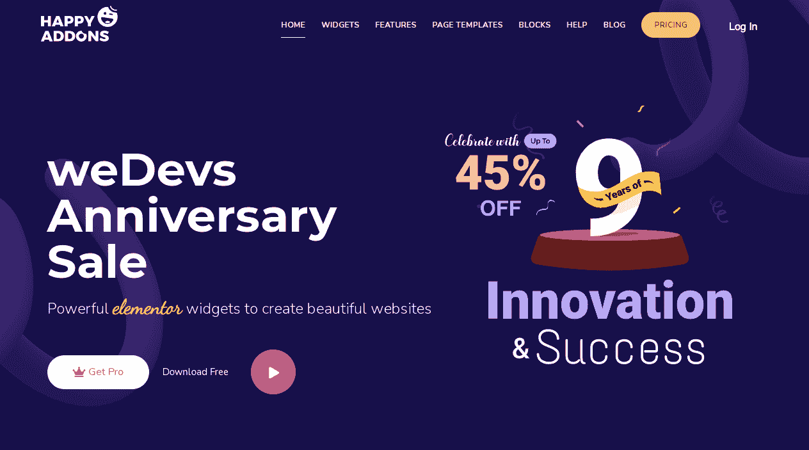

Happy Addons.

**特性:**

*   部分嵌套
*   跨域复制粘贴
*   400 多套预制设计

在 Happy Addons 设置中的**凭证**下输入 Mailchimp API 键后，您可以使用 Elementor 将 Mailchimp 表单小部件拖放到页面上。

然后，您可以编辑该工具的高级设置，以自定义表单边距、颜色和版式。您还可以重新设计字段和按钮，使其具有独特的背景、阴影、字体大小和间距。

**价格**:快乐插件提供[年度订阅计划](https://happyaddons.com/pricing/)，一个网站起价 39 美元。

### 3.元素短剧

像这个列表中的其他选项一样， [ElementsKit](https://wpmet.com/plugin/elementskit/) 是一个一体化插件包，为 Elementor 提供了额外的插件和扩展。在编辑诸如页眉、页脚或菜单等功能特性时，它可以提供更多的定制。

此外，如果您找不到适合您的选项，ElementsKit 还包括一个自定义小部件生成器:

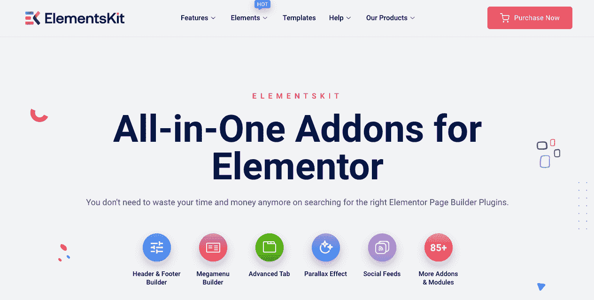

ElementsKit.

**特性:**

*   自定义控件，如多窗口小部件、AjaxSELECT2 和图像拾取器
*   85 个以上的小部件和扩展
*   500 多个预先设计的 web 块

您可以使用 ElementsKit 通过 Elementor 编辑器完全集成 Elementor 和 Mailchimp。您只需要将 [Mailchimp 小部件](https://wpmet.com/doc/mailchimp-3/)拖放到一个页面上，并定义 API 键。然后，您可以向表单中添加自定义字段和图标。

**价格**:[elements kit 的年度计划](https://wpmet.com/plugin/elementskit/pricing/)一个站点起价 39 美元。

### 4.加号插件

Plus Addons 宣称自己是为每个人打造的 Elementor 工具。有了现成的模板和深入的 YouTube 教程，即使是初学者也能很快学会如何设计一个功能性网站。

此外，Plus Addons 还包含大量的小部件，为设计师提供可定制的功能:

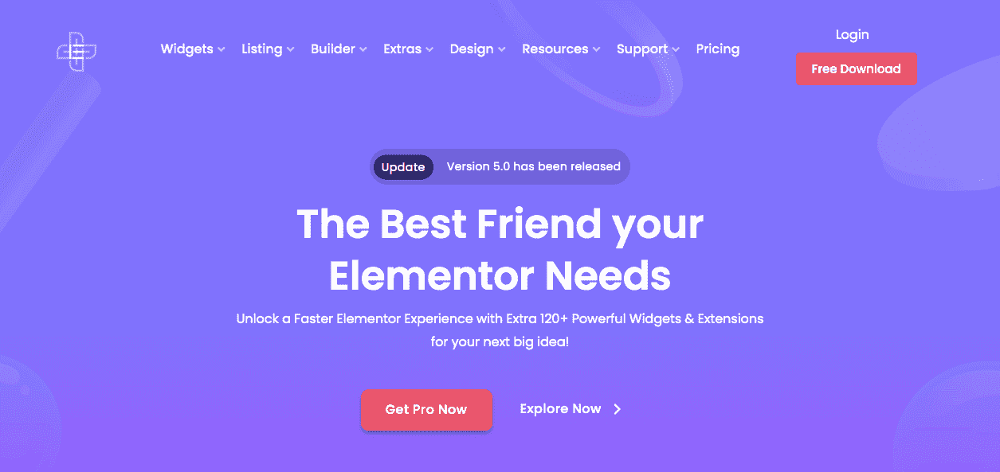

The Plus Addons.

**特性:**

*   96+高级元素或小部件
*   列出显示产品、博客文章和图片库的选项
*   为自定义帖子类型设计的易于使用的生成器

Plus Addons 工具提供了一种集成 Elementor 和 Mailchimp 的最简单的方法。从您的 Mailchimp 帐户中，复制 API 密钥和受众的列表 ID。然后，转到 **API 连接设置**并粘贴这些信息。之后，您可以拖放 Mailchimp 订阅小部件，并编辑其布局和结构。

**价格**:Plus 插件有免费版。然而，它的[计划选择](https://theplusaddons.com/pricing/)包含更多的部件和扩展。这些套餐每年起价 31 美元。

[Mailchimp 🤝 Elementor. Discover how you can level up your services with help from these tools ⬇️Click to Tweet](https://twitter.com/intent/tweet?url=https%3A%2F%2Fkinsta.com%2Fblog%2Felementor-mailchimp%2F&via=kinsta&text=Mailchimp+%F0%9F%A4%9D+Elementor.+Discover+how+you+can+level+up+your+services+with+help+from+these+tools+%E2%AC%87%EF%B8%8F&hashtags=Mailchimp%2CElementor) <kinsta-advanced-cta language="en_US" type-int-post="119584" type-int-position="2">## 摘要

尽管将 Mailchimp 和 Elementor 结合起来似乎令人生畏，但任何人都可以集成这两个工具。通过这样做，您可以创建自定义订阅表单，以满足您对外观和功能的期望。

回顾一下，下面是在你的网站上集成 Elementor 和 Mailchimp 的五个简单步骤:

1.  注册一个 Mailchimp 账户。
2.  创建受众和 API 密钥。
3.  用 Elementor 设计一个 Mailchimp 注册表单。
4.  连接 Mailchimp。
5.  将您的表单添加到您的网站。

电子邮件营销和设计是网站成功的关键。你还会想与一个专门的托管服务提供商合作。

在 Kinsta，我们的托管计划([应用程序托管](https://kinsta.com/application-hosting/)、[数据库托管](https://kinsta.com/database-hosting/)和[托管 WordPress 托管](https://kinsta.com/wordpress-hosting/))可以让你的网站性能更上一层楼。联系我们了解更多信息！

关于集成 Elementor 和 Mailchimp，你有什么问题吗？在下面的评论区问我们吧！

* * *

让你所有的[应用程序](https://kinsta.com/application-hosting/)、[数据库](https://kinsta.com/database-hosting/)和 [WordPress 网站](https://kinsta.com/wordpress-hosting/)在线并在一个屋檐下。我们功能丰富的高性能云平台包括:

*   在 MyKinsta 仪表盘中轻松设置和管理
*   24/7 专家支持
*   最好的谷歌云平台硬件和网络，由 Kubernetes 提供最大的可扩展性
*   面向速度和安全性的企业级 Cloudflare 集成
*   全球受众覆盖全球多达 35 个数据中心和 275 多个 pop

在第一个月使用托管的[应用程序或托管](https://kinsta.com/application-hosting/)的[数据库，您可以享受 20 美元的优惠，亲自测试一下。探索我们的](https://kinsta.com/database-hosting/)[计划](https://kinsta.com/plans/)或[与销售人员交谈](https://kinsta.com/contact-us/)以找到最适合您的方式。</kinsta-advanced-cta></kinsta-advanced-cta></kinsta-advanced-cta></kinsta-auto-toc>