# 如何创建和使用元素或选项卡

> 原文:[https://kinsta.com/blog/elementor-tabs/](https://kinsta.com/blog/elementor-tabs/)

当[建立一个网站](https://kinsta.com/blog/website-design-software/)时，确保你的内容组织良好是至关重要的。整齐地排列你的页面可以帮助改善用户体验(UX ),并使文本更容易消化。组织内容的方法之一是使用 Elementor 或 Tabs 小部件。

选项卡式内容允许用户在不同的内容部分之间进行切换。此功能消除了访问者导航到页面不同区域的需要。将相关内容分组到选项卡式容器中可以增强站点的外观和可用性。另外，你可以在没有任何 WordPress 开发经验的情况下设置这一切。

在这篇文章中，我们将简要介绍 Elementor 及其不同版本。然后，我们将带您了解如何创建和定制 Elementor 选项卡以及一些第三方工具，您可以使用这些工具来增强小部件的默认功能。

我们开始吧！

## 元素概述

[Elementor](https://elementor.com/) 是一个流行且强大的[网站构建器插件:](https://kinsta.com/blog/divi-vs-elementor/)

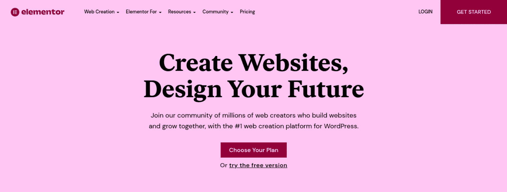

Elementor page builder.

您可以使用页面生成器为您的网站创建漂亮的页面，无论是从头开始还是使用预制的模板。Elementor 有一个拖放编辑器，所以你不需要[接触一行代码](https://kinsta.com/blog/wordpress-page-builders/)。

需要注意的是 Elementor 有免费版和付费版。免费的 Elementor 插件让你创建标准的页面和文章。

但是，它的特性和功能可能会受到限制。要解锁全套工具，我们建议升级到 Elementor Pro。在这篇文章中，我们将指出在使用 Tabs 小部件时，免费和专业计划的区别。

[The secret to improving your site's UX? 👀Make sure your content is well organized 😌 Learn more in this guide ✅Click to Tweet](https://twitter.com/intent/tweet?url=https%3A%2F%2Fkinsta.com%2Fblog%2Felementor-tabs%2F&via=kinsta&text=The+secret+to+improving+your+site%27s+UX%3F+%F0%9F%91%80Make+sure+your+content+is+well+organized+%F0%9F%98%8C+Learn+more+in+this+guide+%E2%9C%85&hashtags=Elementor%2CUX)

## 如何创建元素或选项卡(选项卡小部件)

既然我们对 Elementor 有了更多的了解，让我们来看看如何使用 Tabs 小部件。注意，在接下来的教程中，我们假设你已经在你的 WordPress 站点上安装并激活了 Elementor [。](https://kinsta.com/knowledgebase/how-to-install-wordpress-plugins/)

首先，导航到你想添加标签内容的文章或页面，选择**用元素编辑或**:

Select “Edit with Elementor”.

这将启动 Elementor 编辑器界面。在左侧面板的**元素**下，搜索并选择**选项卡**小部件:

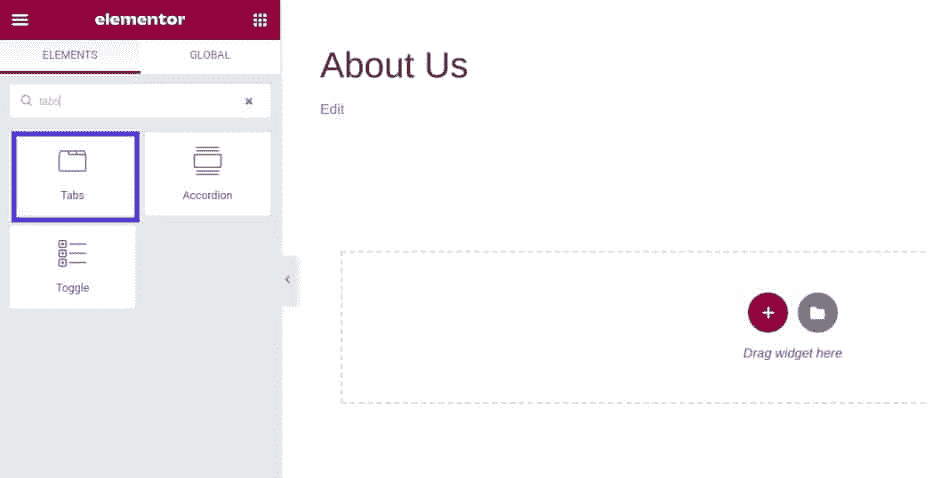

Search for and select the “Tabs” widget.

您可以将小部件拖放到页面部分。放置选项卡小部件后，将出现一个新的控制面板，其中包含其设置:

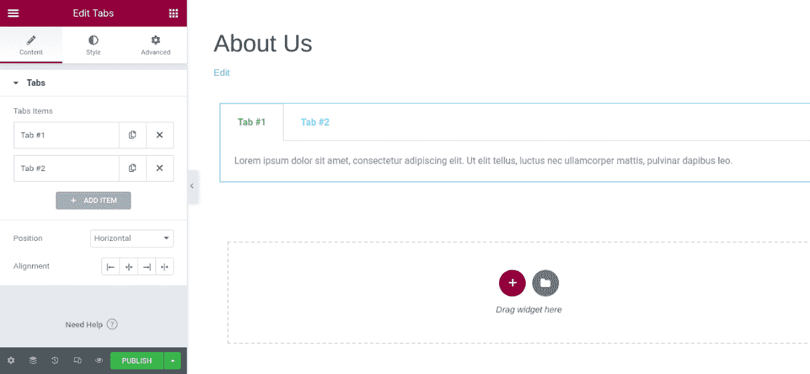

Drag the widget to your page.

您可以为每个选项卡输入标题和内容。您也可以点击 **+添加项目**按钮来插入另一个选项卡。在**类型**下，选择是水平还是垂直显示选项卡。

## 如何自定义元素或选项卡

将文本添加到选项卡后，您可以自定义整体小部件设置。有几种不同的选择。

选择每个自定义选项卡[修改其属性](https://kinsta.com/knowledgebase/edit-wordpress-code/)，包括其标题、框内容和图标。您还可以更改其位置和对齐方式:

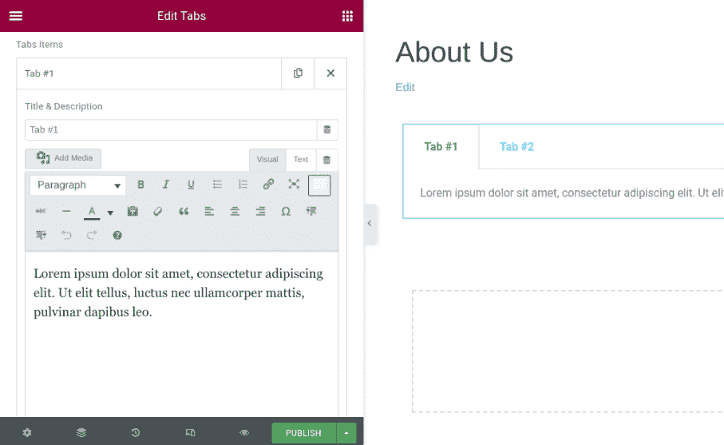

Modify tabs as needed.

接下来，在 **Style** 选项卡下，您会发现许多用于定制 Elementor Tabs 小部件的设计和外观的选项。您可以修改其文本颜色和阴影、版式、间距等:

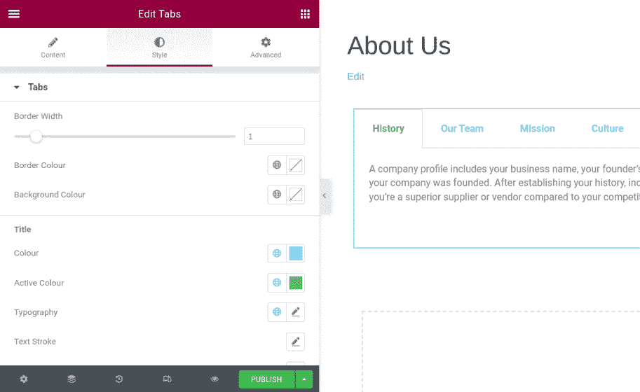

Customize styles and spacing.

您可以更改选项卡周围的边框颜色和宽度。这种设计特征有助于区分各个部分。

在**标题**下，可以修改标签标题的文字颜色。您也可以通过点击**排版**来更改字体和文本大小:

More modification options.

完成后，保存您的更改。还有一些高级设置，你可以考虑使用，使你的标签内容更加复杂。

## 元素或选项卡的高级设置

在 widget 设置面板的**高级**标签下，你会发现大量的[附加选项](https://elementor.com/help/advanced-tab/):

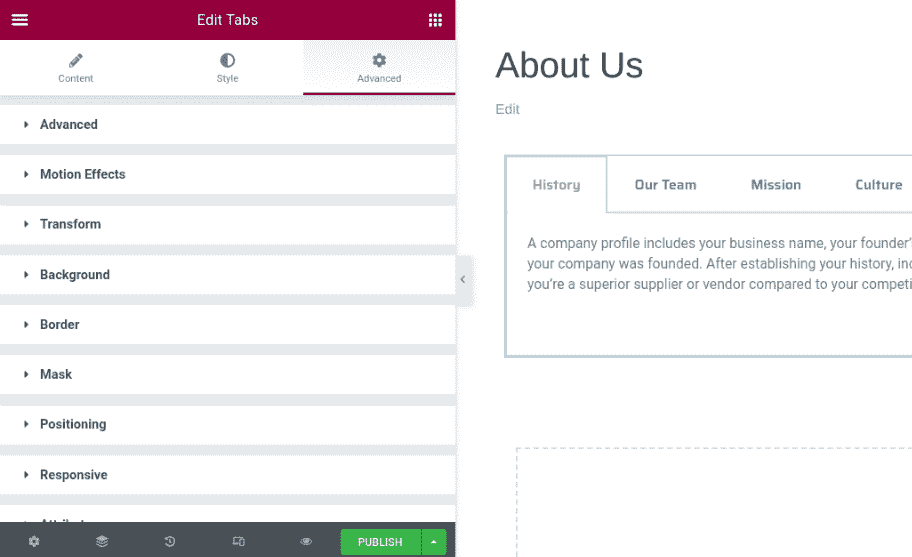

Advanced tab options.

让我们仔细看看这些设置:

*   **高级:**改变标签页的边距和填充。
*   **运动效果:**增加滚动和鼠标效果，让 widget 更具互动性，增加入口动画。
*   **变换:**翻转、旋转和缩放您的小部件。
*   **背景:**选择标准背景或悬停以插入过渡。
*   **边框:**选择边框类型，如实线或虚线。
*   **蒙版:**选择一个时尚的设计蒙版，应用到 widget 上。
*   **定位:**调整 widget 的宽度和位置。
*   **Responsive:** 更改将影响预览或实时页面的响应可见性。
*   **属性:**为元素包装器设置自定义属性。
*   **自定义 CSS:** 插入您的[自定义 CSS](https://kinsta.com/blog/optimize-css/) 。

需要注意的是，如果您使用的是 Elementor 的免费版本，您将无法访问所有这些高级设置。例如，你不能添加自定义属性，滚动效果，或者[你的 CSS](https://kinsta.com/blog/wordpress-css/) 。

### 如何在选项卡小部件中添加元素

使用 Elementor Pro，您还可以在 Tabs 小部件中插入另一个元素。例如，假设您想要在**位置**选项卡下添加地图小部件。

为此，创建您想要使用的地图，然后通过右键单击铅笔图标并选择**另存为全局**将其保存为[全局小部件](https://elementor.com/help/global-widget-pro/):

Save as a “Global” widget.

接下来，导航到你的**模板库**(从你的 WordPress 仪表盘)并复制你刚刚创建的全球窗口小部件的[短代码](https://kinsta.com/blog/wordpress-shortcodes/)。

然后在选项卡小部件内单击并选择 **+添加项目**按钮来添加一个新的选项卡。在容器的文本区域中，粘贴刚刚复制的短代码:

Paste the shortcode into the container.

完成后，点击屏幕底部的**更新**或**发布**。然后，您可以预览小部件在站点前端的外观:

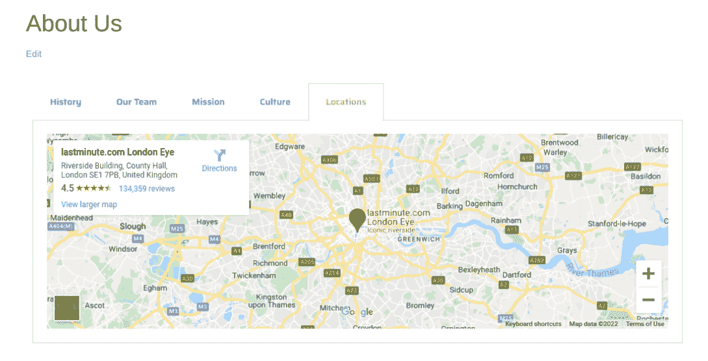

A view from the front end.

就是这样！你们都完了。

## 元素或标签的 8 大插件

Elementor 是一个强大的工具，拥有创建美观实用的选项卡式内容所需的所有功能和特性。

但是，您可能希望进一步改进您的设计或使用高级功能。在这种情况下，您也可以考虑将 Elementor 与另一个第三方工具配对。

让我们来看看 Elementor 选项卡的一些[顶级插件](https://kinsta.com/best-wordpress-plugins/)，排名不分先后。

### 1.ElementsKit 元素或表格小部件

Elementor 的 ElementsKit 插件是一个流行的扩展:

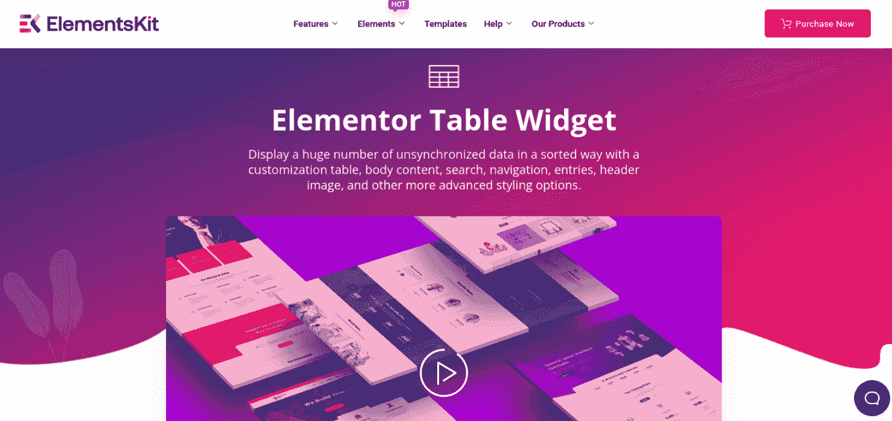

ElementsKit Elementor Table Widget.

它的 Table 小部件允许您以一种有组织的方式展示大量未同步的数据。您可以构建一个可定制的表格，添加正文内容，并插入图像和导航元素。

## 注册订阅时事通讯

### 想知道我们是怎么让流量增长超过 1000%的吗？

加入 20，000 多名获得我们每周时事通讯和内部消息的人的行列吧！

[Subscribe Now](#newsletter)

elemontskit 的功能包括:

*   比较表
*   日程和日历
*   项目管理
*   菜单
*   500 多个街区
*   70 多个插件
*   一个巨大的菜单建设者
*   视差效果
*   弹出式模型生成器

ElementsKit 的价格从单个网站每年 39 美元起。该计划包括一年的更新和支持。

### 2.Elementor 的优雅标签

[elements or](https://codecanyon.net/item/elegant-tabs-for-elementor/21669071)是一款直观的工具，可帮助您创建和定制动态标签:

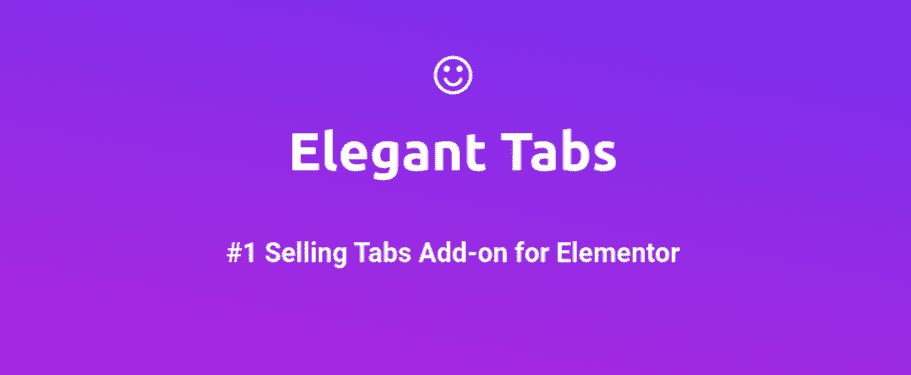

Elegant Tabs.

如果您正在寻找一个具有许多[设计定制](https://kinsta.com/blog/how-to-become-a-web-developer/)选项的扩展，这个插件可以是一个可靠的选择。您可以添加自定义颜色、图标和字体。你也可以使用优雅的标签来给你的标签添加自动切换功能，并把它们链接到你网站上的其他内容。

优雅标签的主要特点包括:

*   高级样式选项
*   自动切换功能
*   在加载时将任何选项卡设置为活动的选项
*   对齐和垂直制表符
*   深层链接
*   制表符对齐支持

优雅标签的价格从每年 19 美元起。该计划包括六个月的更新。

### 3.Livemesh Addons

[Elementor](https://livemeshelementor.com/)的 Livemesh 插件包括大量现成的元素，帮助您轻松设计和构建选项卡式内容:

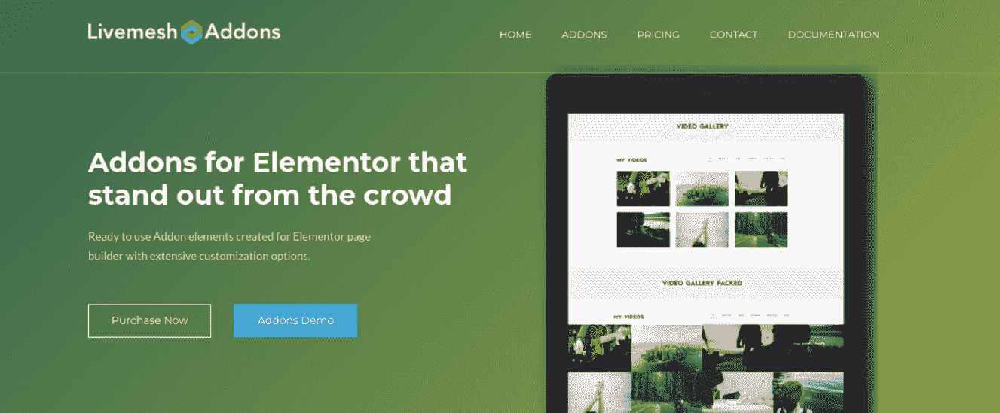

Livemesh Addons.

您可以选择浅色和深色标签类型，超过 10 种标签设计，以及水平和垂直布局选项。Livemesh 插件使用起来也很简单，如果你是 WordPress 或 Elementor 的新手，这是非常好的。

Livemesh 的主要功能包括:

*   10 种浅色标签设计和 10 种深色标签设计
*   垂直和水平选项
*   可定制的移动分辨率
*   25+插件
*   支持图标

Livemesh 插件计划每年起价 37 美元。该计划包括为期一年的更新和支持。

### 4.元素或附件

来自流行的 PowerPack 的 Elementor Addons 是一个功能丰富的插件，用于提升 Elementor Tabs 小部件的设计和功能:

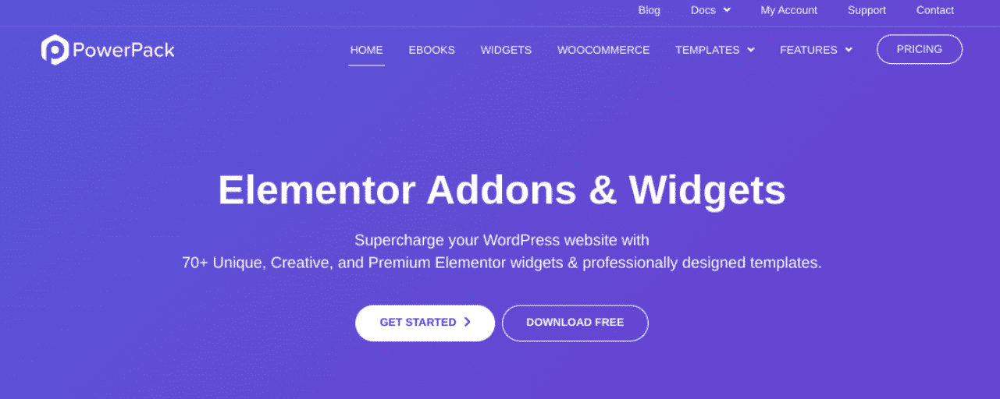

Elementor Addons.

你可以使用这个插件给你的标签页添加文本和图像，并为[高级标签页部件](https://powerpackelements.com/elementor-widgets/advanced-tab/)应用六种样式。很人性化，很容易理解。此外，Elementor Addons 也是轻量级的，所以你不必担心你的网站变慢。

Struggling with downtime and WordPress problems? Kinsta is the hosting solution designed to save you time! [Check out our features](https://kinsta.com/features/)

由 powerpack 提供的 elemontor 插件的主要特性包括:

*   一个快速轻量级的界面
*   预建模板
*   自定义内容显示
*   高级选项卡样式

起价[$ 44/年](https://powerpackelements.com/pricing/)，这个插件比列表上的其他一些选项更贵。然而，它有一整套小部件来定制你的网站的所有方面，而不仅仅是你的标签内容。

### 5.喷气元素

JetElements 提供了一个[响应式表格小部件](https://crocoblock.com/widgets/table/)，如果您正在寻找一种快速简单的方法来对内容进行分组，这可能是一个理想的选择:

JetElements.

它让您以一种干净、现代的方式展示非结构化数据。JetElements 还提供了一个[定价表小部件](https://crocoblock.com/widgets/pricing-table/)，以八种不同的方式定制和样式化您的定价细节。

jetelemonts 的主要特点包括:

*   45 个部件
*   CSV 导入到表格设置
*   8 种风格选择
*   支持所有内容类型
*   完全可定制

JetElements 的订阅费用从每年 24 美元开始。Crocoblock 还提供一个全包包，每年 130 美元，有 150 多个小工具。

### 6.基本附件

另一个你可能考虑用于元素或标签的流行插件是[基本插件](https://essential-addons.com/elementor/table/):

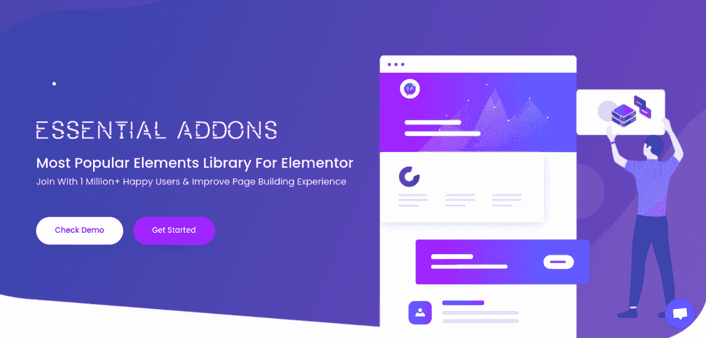

Essential Addons.

这是最流行的 Elementor 插件之一。它包括 100 多个现成的块和 80 多个元素，用于扩展和增强网站构建器。

插件的[数据表](https://essential-addons.com/elementor/table/)是选项卡式内容可以利用的最佳元素之一。这个工具可以让你无缝地设计几乎任何表格类型，并添加图标，过滤器，等等。

基本插件的主要功能包括:

*   CSV 导入到表格设置
*   过滤选项
*   完全可定制的设置
*   高级样式选项
*   高级选项卡和折叠元素
*   定价表

对于一个网站来说，基本插件的价格从每年 39.97 美元开始。它附带一年的更新和支持。

### 7.高级附加组件

[Premium Addons](https://premiumaddons.com/table-widget-for-elementor-page-builder/) 是 Elementor 的一个高度可定制的工具，附带了大量免费和高级的插件:

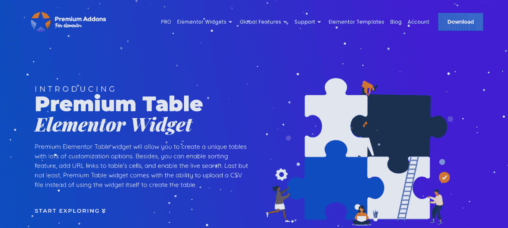

Premium Addons.

在这个插件包含的许多强大的部件中，有一个是 Elementor 价格表。它带有排序功能，实时搜索，以及按升序或降序排列项目的选项。

高级插件的主要功能包括:

*   导入 CSV 文件的选项
*   将 URL 添加到表格单元格
*   实时搜索和排序
*   定制和样式选项
*   洛蒂动画

你可以免费下载并使用 Premium Addons[elements 或 Table](https://kinsta.com/blog/elementor-table/) Widget。还有一个[高级版](https://premiumaddons.com/pro/)，每年 39 美元起。

### 8.元素包

你可以考虑在 Element 或 Tabs 部件中使用的最后一个插件是 [Element Pack](https://www.elementpack.pro/demo/element/table/) :

Element Pack.

这个 Elementor 扩展包包括一个表格小部件，它可以以一种迷人而时尚的方式呈现您的内容。您可以在选项卡式内容中创建各种表格，包括价格、内容和加密货币表格。

Element Pack 的主要功能包括:

*   CSV 导入到表格设置
*   三表元素
*   定制和样式选项
*   过滤功能
*   实时搜索

Element Pack [的单一站点许可费用为每年 29.25 美元](https://www.elementpack.pro/pricing/)，是这个列表中最便宜的选项之一。该计划还包括 20 天的退款保证。

[It's time to get organized 🗂 Elementor tabs (and this guide!) are here to help 💪Click to Tweet](https://twitter.com/intent/tweet?url=https%3A%2F%2Fkinsta.com%2Fblog%2Felementor-tabs%2F&via=kinsta&text=It%27s+time+to+get+organized+%F0%9F%97%82+Elementor+tabs+%28and+this+guide%21%29+are+here+to+help+%F0%9F%92%AA&hashtags=Elementor%2CUX) ## 摘要

Elementor 是一个优秀的工具，可以帮助你毫不费力地设计和构建你的网站。如果你想以一种吸引人的方式来分组和组织你的内容，你可以考虑使用 Elementor 或 Tabs 小部件。

正如我们在本文中讨论的，您可以通过 Elementor 编辑器轻松地将这个小部件插入到任何页面或文章中。然后你可以添加你的内容和风格，以配合你的品牌。为了扩展小部件的功能，您还可以将它与第三方插件配对，比如 ElementsKit。

用户友好和吸引人的设计对网站的成功至关重要。

你还需要与强大的[应用托管](https://kinsta.com/application-hosting/)、[数据库托管](https://kinsta.com/database-hosting/)和[托管 WordPress 托管](https://kinsta.com/wordpress-hosting/)提供商合作。

查看我们的[托管计划](https://kinsta.com/plans/),看看 Kinsta 如何将您的网站提升到一个新的水平！

* * *

让你所有的[应用程序](https://kinsta.com/application-hosting/)、[数据库](https://kinsta.com/database-hosting/)和 [WordPress 网站](https://kinsta.com/wordpress-hosting/)在线并在一个屋檐下。我们功能丰富的高性能云平台包括:

*   在 MyKinsta 仪表盘中轻松设置和管理
*   24/7 专家支持
*   最好的谷歌云平台硬件和网络，由 Kubernetes 提供最大的可扩展性
*   面向速度和安全性的企业级 Cloudflare 集成
*   全球受众覆盖全球多达 35 个数据中心和 275 多个 pop

在第一个月使用托管的[应用程序或托管](https://kinsta.com/application-hosting/)的[数据库，您可以享受 20 美元的优惠，亲自测试一下。探索我们的](https://kinsta.com/database-hosting/)[计划](https://kinsta.com/plans/)或[与销售人员交谈](https://kinsta.com/contact-us/)以找到最适合您的方式。