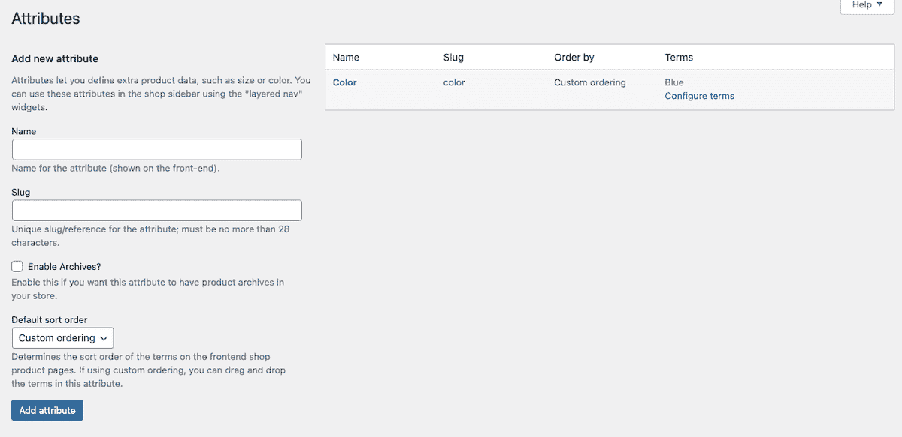
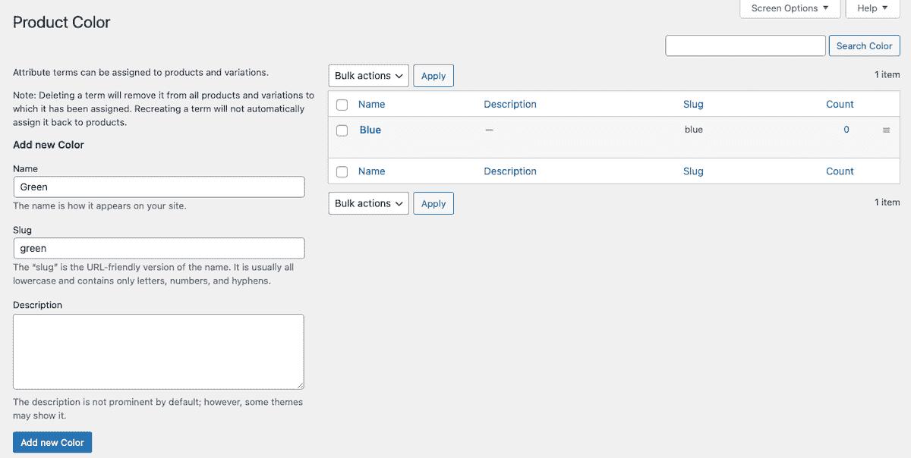
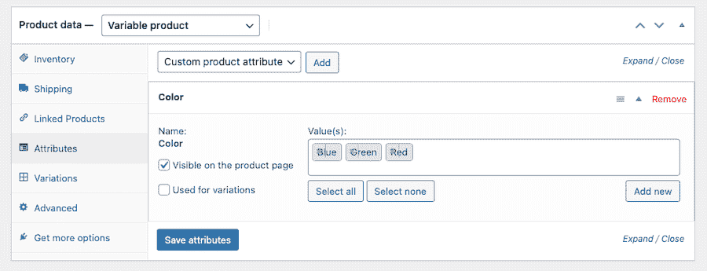
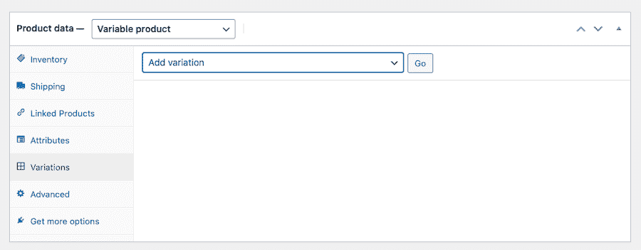
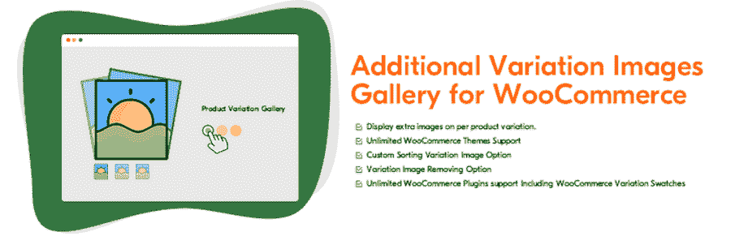
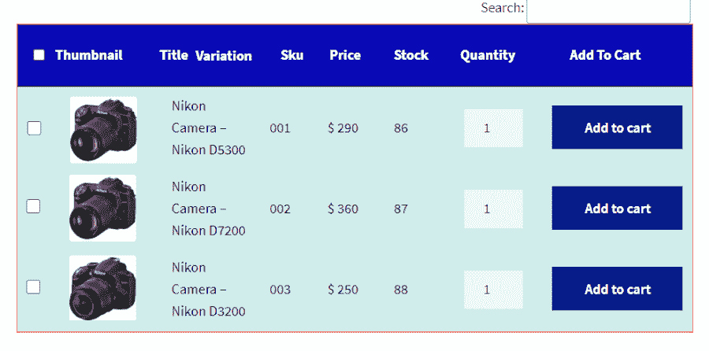
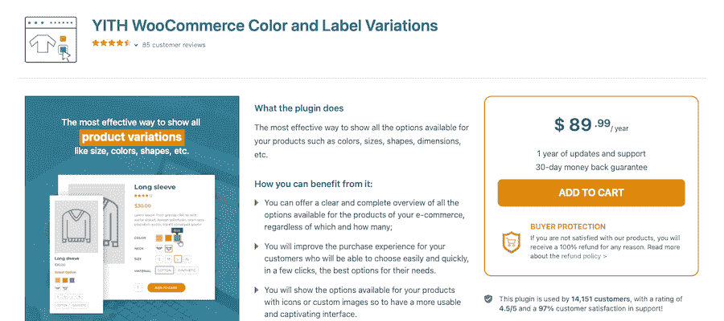

# 如何在 WooCommerce 中创建可变产品

> 原文:[https://kinsta.com/blog/woocommerce-variable-product/](https://kinsta.com/blog/woocommerce-variable-product/)

当你第一次[推出一家网上商店](https://kinsta.com/learn/woocommerce-guide/)时，你可能会专注于一些基础工作，比如添加新产品、设置你的[购物车](https://kinsta.com/blog/shopping-cart-abandonment/)，以及简化[的结账流程](https://kinsta.com/blog/woocommerce-checkout/)。但是，设置一个 WooCommerce 变量产品对你来说可能有点神秘。

或者说，至少，这不是当务之急。但是当你遇到一个有很多变化的产品时，它突然变得非常紧迫。

### 查看我们的[视频指南，在 WooCommerce 中创建可变产品](https://www.youtube.com/watch?v=4cUvXBESlLM)

幸运的是，在 WooCommerce 中添加产品变化非常简单，不需要太多的技术知识。但如果你是电子商务平台的新手，在选择时有点迷失方向是正常的。

我们今天的目标是在这方面提供帮助。我们将讨论什么是可变产品，变量和属性之间的区别，如何创建 WooCommerce 可变产品，以及如何使用插件更好地优化您的产品变化。

让我们开始吧。

## 什么是 WooCommerce 可变产品？

WooCommerce 可变产品可以很容易地定义为几种不同类型、风格或变化的产品。变化的例子包括:

> 需要在这里大声喊出来。Kinsta 太神奇了，我用它做我的个人网站。支持是迅速和杰出的，他们的服务器是 WordPress 最快的。
> 
> <footer class="wp-block-kinsta-client-quote__footer">
> 
> 
> 
> <cite class="wp-block-kinsta-client-quote__cite">Phillip Stemann</cite></footer>

[View plans](https://kinsta.com/plans/)

*   颜色
*   大小
*   风格
*   材料

这与 WooCommerce 中的[产品过滤器不太一样。即使在筛选产品时，您仍然需要选择变量。](https://kinsta.com/blog/woocommerce-product-filter/)

当客户访问包含变量的产品页面时，他们需要在将商品添加到购物车之前进行某种选择。许多类型的商店和企业利用不同的产品。以下是一些流行的例子:

*   提供各种尺寸和颜色选择的服装店。
*   一家比萨店，允许顾客在将商品添加到购物车之前，从下拉菜单或复选框式菜单中选择浇头。
*   一位艺术家出售各种材料的定制印刷品，如帆布或木头，有多种尺寸可供选择。
*   家居用品销售商需要顾客为家具选择材料和/或面料。

这样的例子不胜枚举。事实上，每种类型的商店在某些时候都需要产品的变化。

好消息是 WooCommerce 可以创造内置的可变产品。而且配置起来也没那么难。但是在我们进入如何做到这一点的逐步教程之前，我们需要首先对变体和属性进行本质上的区分。

[Is setting up a WooCommerce variable product may be a bit of a mystery to you? 🤔 Read this 📚Click to Tweet](https://twitter.com/intent/tweet?url=https%3A%2F%2Fkinsta.com%2Fblog%2Fwoocommerce-variable-product%2F&via=kinsta&text=Is+setting+up+a+WooCommerce+variable+product+may+be+a+bit+of+a+mystery+to+you%3F+%F0%9F%A4%94+Read+this+%F0%9F%93%9A&hashtags=WooCommerce%2CEcommerce)

### 属性与变化

在 WooCommerce 中，变化和属性之间最重要的区别是，变化可以被客户交互，而属性不能。

首先，属性是定义变化的东西。这些是不同的款式，如颜色、图案等。你也可以在 WooCommerce 中根据这些属性进行排序。但是它们仅仅是信息性的，没有任何功能。

属性也用于定义特定产品的特性。一个钱包的[产品页面](https://kinsta.com/ebooks/wordpress/ecommerce-conversion-rate/)可能会列出尺寸、使用的织物和把手的材料作为属性。这些是关于产品的陈述事实——它的属性——客户不能基于这些属性做出选择。

另一方面，变体通过不同的产品使用不同的属性，并允许用户购买某种属性的商品。变体还包括这些属性的不同组合，这可以创建单独的产品选项。

例如，假设您有产品的颜色和徽标属性。在这种情况下，这些可以组合成不同的变化，即带有蓝色海豚标志的帽子，带有绿色火蜥蜴标志的帽子，等等。

这里的要点是顾客可以在结账前选择变化作为[转换过程](https://kinsta.com/blog/conversions-woocommerce-product-pages/)的一部分，而属性不能。

但是，如果您在设置任何变体之前已经建立了属性，这将会有所帮助。但是，在你出于完全的困惑而奔向群山之前，不要担心:这个过程相当简单。

## 如何创建 WooCommerce 可变产品

现在我们来到了文章的[教程](https://kinsta.com/blog/woocommerce-tutorial/)部分。在我们开始之前，我们假设您已经安装了 WooCommerce，并且已经在您的商店中添加了一些产品。

### 1.创建产品属性

在这里，您的首要任务是创建一些产品属性。你可以在 [WordPress 仪表盘](https://kinsta.com/knowledgebase/wordpress-admin/)中进入**产品>属性**。

Adding a new attribute to WooCommerce.

在这个部分中，您可以为您的[在线商店](https://kinsta.com/blog/ecommerce-platforms/)创建一个新属性。第一次安装时，WooCommerce 会添加一个默认属性“Color”。

我们在这里添加了一个额外的属性“大小”只需键入属性(大小)的名称，一个相关的 slug(大小)，然后在完成后点击蓝色的**添加属性**按钮。

Attributes in WooCommerce.

在这里，您可以单击您刚刚创建的属性旁边的链接，上面写着**配置术语**。

Adding the “Medium” term to the “Size” Attribute.

在这个部分中，您可以添加尽可能多的术语来与您的新属性相关联。对于“大小”，我们在这里添加了术语“中等”。这与添加属性遵循相同的过程。只需键入名称(在我们的例子中，我们使用了“Medium”)、一个 slug (medium)和一个描述(如果您愿意的话)。完成更改后，按蓝色的**添加新尺寸**按钮。

Adding the term “Green” to the “Color” Attribute.

我们还为“颜色”属性添加了额外的术语。你可以看到上面显示的“绿色”。

你可以用这种方式在 WooCommerce 中为每个属性添加尽可能多的属性和相关术语。哪些属性和术语以及每种属性和术语的数量取决于您经营的商店类型和您销售的产品类型。

### 2.创建一个可变的 WooCommerce 产品

下一步是创建一个产品页面，在这个页面上可以应用您的属性。为此，你需要去**产品>添加新的**。

给你的产品起一个名字和描述，[添加任何你喜欢的图片](https://kinsta.com/blog/wordpress-background-image/)，或者以你认为合适的方式编辑它。然后，向下滚动到**产品数据**部分。

在顶部，点击下拉菜单并选择**可变产品**。

Creating a variable product.

接下来，您可以在 **General** 选项卡下填写定价等所有相关详细信息。

### 3.分配属性

将您的产品设置为可变产品后，您现在可以将之前创建的属性添加到其中。点击**属性**选项卡，选择一个您创建的属性。然后点击**添加**按钮。

将出现一个名为 **Value(s)** 的部分，在该部分下，您将看到之前分配给该属性的所有术语。选择适用于该特定产品的任何条款(或点击**全选**，如果适用且更简单)。

如果您希望这些属性可供客户选择，请确保您选中了“在产品页面上可见”旁边的复选框。

如果您希望从这些属性中创建变体，也请选中“用于变体”旁边的框。

Assigning attributes to a product.

点击**保存属性**完成本部分。

### 4.添加变体

这里您的最后一项任务是将变体本身添加到您的产品页面。点击**变化**选项卡。

## 注册订阅时事通讯

### 想知道我们是怎么让流量增长超过 1000%的吗？

加入 20，000 多名获得我们每周时事通讯和内部消息的人的行列吧！

[Subscribe Now](#newsletter)

Adding variations in WooCommerce.

在这个部分，您应该会看到一个下拉菜单，上面写着 **Add variation** 。点击旁边显示**开始**的按钮。

当您可以选择适用于该特定产品的属性时，一个新的[下拉菜单](https://kinsta.com/knowledgebase/wordpress-dropdown-menu/)将会出现。请根据产品选择合适的选项。

在每个变体下，您也可以调整设置，例如为每个变体设置价格、销售价格、 [SKU 号、库存状态、重量和尺寸](https://kinsta.com/blog/woocommerce-inventory-management/)。然而，只需要价格。

当您完成对变体的更改后，单击蓝色的**保存更改**按钮。

然后，您可以重复该过程来创建您想要的任何其他变体。

## 优化 WooCommerce 产品变化

现在你知道了什么是可变产品，以及如何在 WooCommerce 中创建它们，你可以更深入地研究如何让它们真正发光。这里有几个 [WooCommerce 插件](https://kinsta.com/blog/woocommerce-plugins/)和[扩展](https://kinsta.com/blog/woocommerce-extensions/)选项，可以让你的产品页面和[提升转化率](https://kinsta.com/ebooks/wordpress/ecommerce-conversion-rate/)发挥到极致。

**查看我们的[视频指南，优化 WooCommerce 产品变化](https://www.youtube.com/watch?v=9cuuyLRL-lQ)**

### 1.样本

Variation Swatches

我们在这里讨论的第一个插件是 WooCommerce 的[变体样本。它提供了一种简洁美观的方式来展示产品属性和变化。这个插件还以色块样本、标签和无线电图像的形式，为客户如何选择这些选项提供了更多的选项。这是一种全方位展示产品变化的时尚方式，完全消除了下拉菜单。](https://wordpress.org/plugins/woo-variation-swatches/)

这些选项在产品快速查看和产品页面中都有效。您甚至可以选择样本的形状–圆形或圆形。其他功能包括悬停工具提示和自定义 CSS 功能。

WooCommerce 的变化样本是免费的。

### 2.附加变体图像

Additional Variation Images Gallery

接下来，我们为 WooCommerce 提供了[额外的变体图像库，这使得为产品变体显示多个图像成为可能。默认情况下，WooCommerce 允许你为每个产品变体显示一张图片，但是这个插件扩展了这个功能，允许你为每个变体显示一个图库。](https://wordpress.org/plugins/woo-variation-gallery/)

Struggling with downtime and WordPress problems? Kinsta is the hosting solution designed to save you time! [Check out our features](https://kinsta.com/features/)

毕竟，让顾客更多地了解你的产品可以促进销售。因此，当客户在产品页面上切换不同的产品时，他们将看到一组不同的图像。更多信息=更好地了解你在卖什么。这可以让你对自己的品牌更加信任。

WooCommerce 插件的附加变体图片库是免费的。

### 3.产品属性过滤器

Product Filter by WooBeWoo

WooBeWoo 的产品过滤器是另一个非常值得一看的插件选项。这样一来，你的在线商店的访问者就可以根据更广泛的因素对你的产品进行分类，包括类别、[标签](https://kinsta.com/knowledgebase/wordpress-tags/)、[分类](https://kinsta.com/knowledgebase/what-is-taxonomy/)、价格和属性。

这里包含的主要功能是根据任何标准进行过滤，如销售状态、评级或商品是否有货。它还允许您使用多个选项在网站的前端显示过滤器，包括下拉菜单、复选框列表、单选按钮列表和图标。它还支持 [AJAX](https://kinsta.com/blog/admin-ajax-php/) live search，并与 [Elementor](https://kinsta.com/blog/wordpress-elementor/) 协同工作。

WooBeWoo 的产品过滤器是免费的。

### 4.自定义产品源

Product Feed PRO

另一个要检查的插件是 [Product Feed PRO](https://wordpress.org/plugins/woo-product-feed-pro/) ，它可以为[的营销目的](https://kinsta.com/blog/email-marketing-statistics/)创建产品 Feed。有了它，您可以使用 100 多个不同的模板为各种在线营销场所创建无限数量的产品和提要。它包括对谷歌购物、脸书再营销、Pricerunner、必应广告、Skroutz 等的支持。

其他特性包括字段映射、类别映射、过滤和对产品变量的支持。你也可以使用这个插件添加一个脸书像素到你的网站，一个谷歌动态再营销像素，和脸书转换 API。

产品饲料亲是免费的。

### 5.添加更多产品选项

Extra Product Options

如果你需要在每件商品上展示更多的选项，WooCommerce 的 [Extra Product Options 是一个很好的选择。它允许您轻松地将自定义产品字段添加到您的产品页面。该插件不是自己创建自定义布局或在标准产品页面编辑器中工作，而是向产品页面添加高级字段，让您创建真正满足客户需求的页面。](https://wordpress.org/plugins/woo-extra-product-options/)

这个插件附带了 17 个不同的[自定义字段](https://kinsta.com/blog/advanced-custom-fields/)供使用，包括文本、密码、隐藏、电子邮件、数字、 [URL](https://kinsta.com/knowledgebase/what-is-a-url/) 、电话、文本区域、选择、单选按钮、复选框、复选框组滑块、日期选择器、颜色选择器、标题和段落。

WooCommerce 插件的额外产品选项是免费的。还有一个高级选项，增加了 7 个产品选项，包括时间选择器、HTML、调色板、文件上传、多选、数据和时间范围选择器以及图像组。高级版本的单站点许可费用为 39 美元。

### 6.为变化添加动态定价

Advanced Dynamic Pricing for WooCommerce

高级动态定价插件对许多卖家来说也有一席之地。它的工作原理是为你的 WooCommerce 商店添加动态定价或折扣功能，你可以随时打开或关闭这些规则。

使用它，您可以为单个产品或产品组设置金额、百分比和固定产品。其他功能包括批量定价和基于角色的价格。因此，您可以为整个类别的产品设置折扣，并建立特殊交易，如果客户购买一定数量的商品，他们可以获得一定比例的折扣或建立 BOGO 交易。

这些选项非常灵活，让你在定价和销售上更有创意。WooCommerce 的高级动态定价是免费的，但有一个附加规则和功能的高级版本。高级定价从每年 50 美元开始。

### 7.在表格中显示变体

Product Variations Table for WooCommerce

WooCommerce 扩展的 [Product Variations Table 是手头上另一个可靠的工具，尤其是如果你销售的产品喜欢复杂和并发的变化。客户可以通过过滤和分类每个产品页面上的变化来使用这个插件。](https://woocommerce.com/products/product-variations-table-for-woocommerce/)

它允许您以表格的形式显示产品变化，客户可以通过排序和 Ajax 过滤功能与之交互。客户甚至可以通过该表格格式中的变化来搜索产品。它还包括表中每个商品旁边的**添加到购物车**按钮，提高了转换的机会。客户甚至可以将变体信息导出为 PDF、Excel 或 CSV 格式的下载文件。

您创建的所有桌子都可以定制，以匹配您商店的品牌，并包括一个[短代码](https://kinsta.com/ebooks/wordpress/woocommerce-shortcodes/)以方便应用。WooCommerce 扩展的产品变化表每年花费 49 美元。

### 8.YITH WooCommerce 颜色和标签变化

YITH WooCommerce Color and Label Variations

最后，还有 [YITH WooCommerce 颜色和标签变化](https://yithemes.com/themes/plugins/yith-woocommerce-color-and-label-variations/)，它提供了一种在你的产品页面上显示产品选项的简单方法。它以一种吸引人的方式做到这一点，旨在更有效地转化。

这里的想法是将你所有的产品选项放在你的客户手边，以便准确地知道他们有哪些选项，他们可以得到什么。每种产品变化都可以通过您选择的图标或自定义图像来显示。

YITH woo commerce Color and Label Variations 是一款超值产品，定价为每年 89.99 美元。

[Adding product variations doesn’t require a lot of technical know-how... but if you’re new to WooCommerce, it’s normal to be a bit disoriented. 😅 This post is here to help. 💪Click to Tweet](https://twitter.com/intent/tweet?url=https%3A%2F%2Fkinsta.com%2Fblog%2Fwoocommerce-variable-product%2F&via=kinsta&text=Adding+product+variations+doesn%E2%80%99t+require+a+lot+of+technical+know-how...+but+if+you%E2%80%99re+new+to+WooCommerce%2C+it%E2%80%99s+normal+to+be+a+bit+disoriented.+%F0%9F%98%85+This+post+is+here+to+help.+%F0%9F%92%AA&hashtags=WooCommerce%2CEcommerce) ## 摘要

就这样了。在 WooCommerce 中创建可变产品现在并不那么令人望而生畏，不是吗？一旦你清楚地了解了变量是什么以及它们是如何工作的，你就可以相对容易地创建它们。

今天，我们讨论了什么是可变产品以及它们是如何工作的。我们已经讨论了变化和属性之间的区别，以及如何创建可变产品及其相关属性。

我们已经编译了几个插件，在形式和功能方面增强了可变的产品特性。这里有适合每个人的东西。希望你现在可以创造各种各样的产品，让它们为你的网上商店服务。

如果你需要更多关于促进网上商务销售的建议，我们有完整的指南。

* * *

让你所有的[应用程序](https://kinsta.com/application-hosting/)、[数据库](https://kinsta.com/database-hosting/)和 [WordPress 网站](https://kinsta.com/wordpress-hosting/)在线并在一个屋檐下。我们功能丰富的高性能云平台包括:

*   在 MyKinsta 仪表盘中轻松设置和管理
*   24/7 专家支持
*   最好的谷歌云平台硬件和网络，由 Kubernetes 提供最大的可扩展性
*   面向速度和安全性的企业级 Cloudflare 集成
*   全球受众覆盖全球多达 35 个数据中心和 275 多个 pop

在第一个月使用托管的[应用程序或托管](https://kinsta.com/application-hosting/)的[数据库，您可以享受 20 美元的优惠，亲自测试一下。探索我们的](https://kinsta.com/database-hosting/)[计划](https://kinsta.com/plans/)或[与销售人员交谈](https://kinsta.com/contact-us/)以找到最适合您的方式。