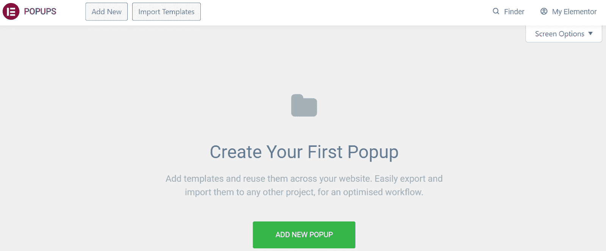
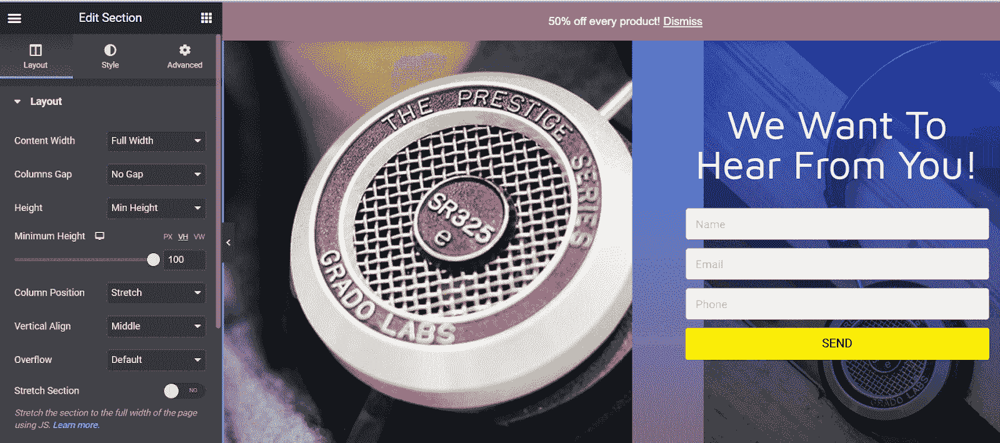
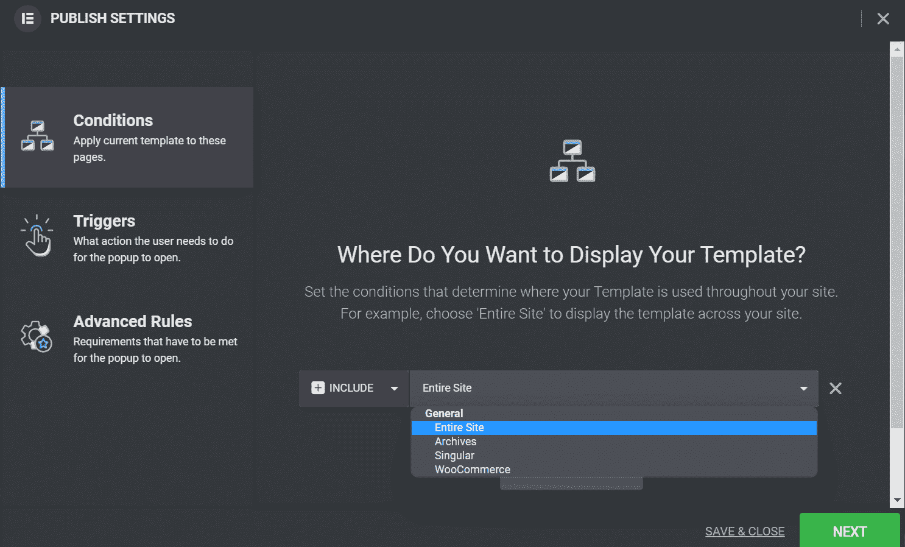
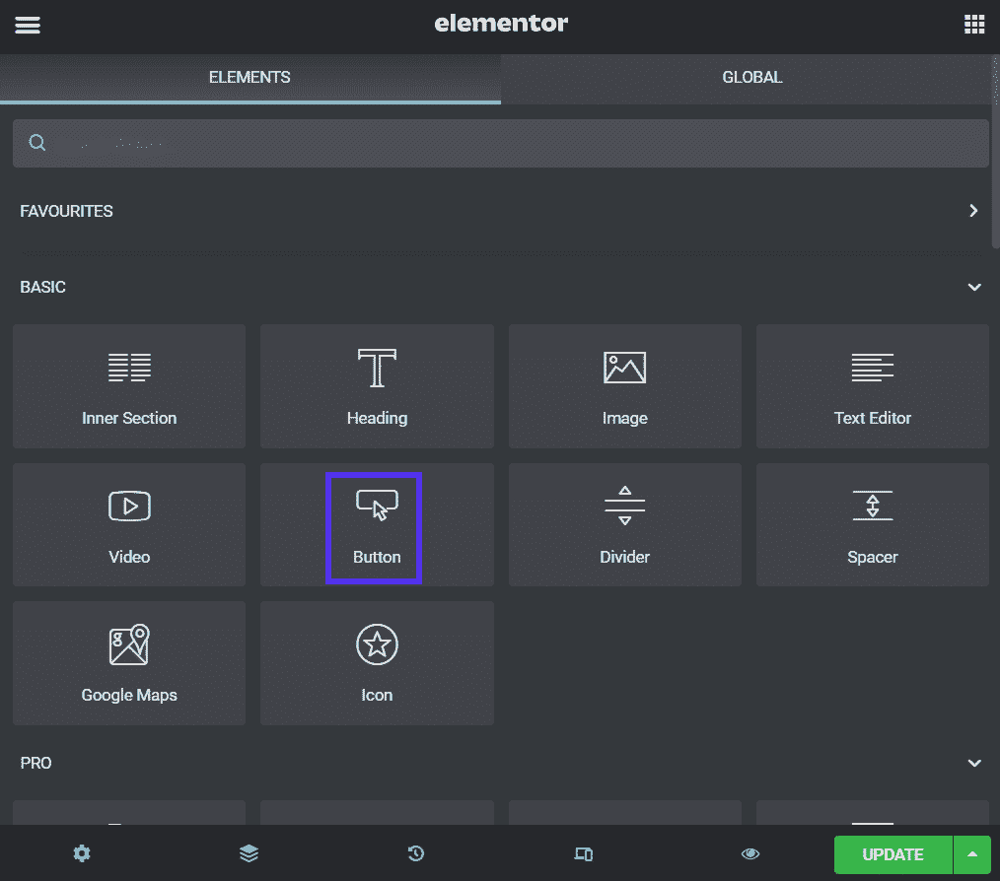
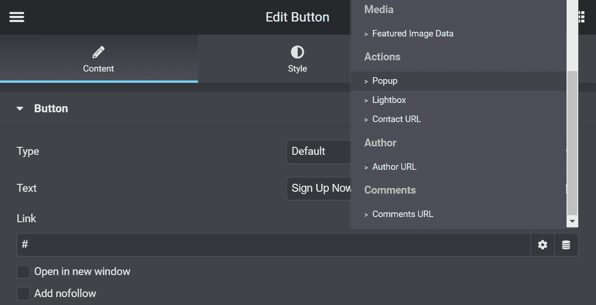
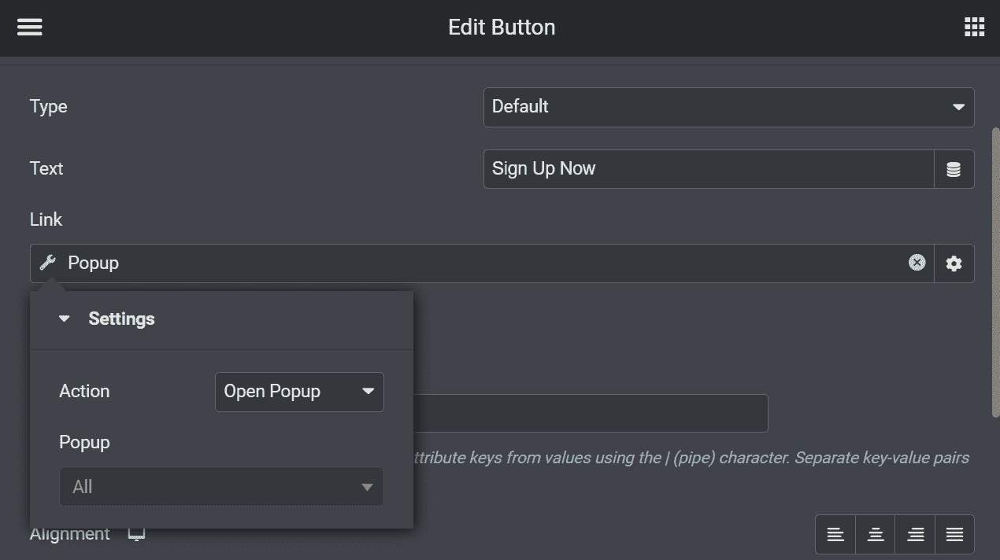
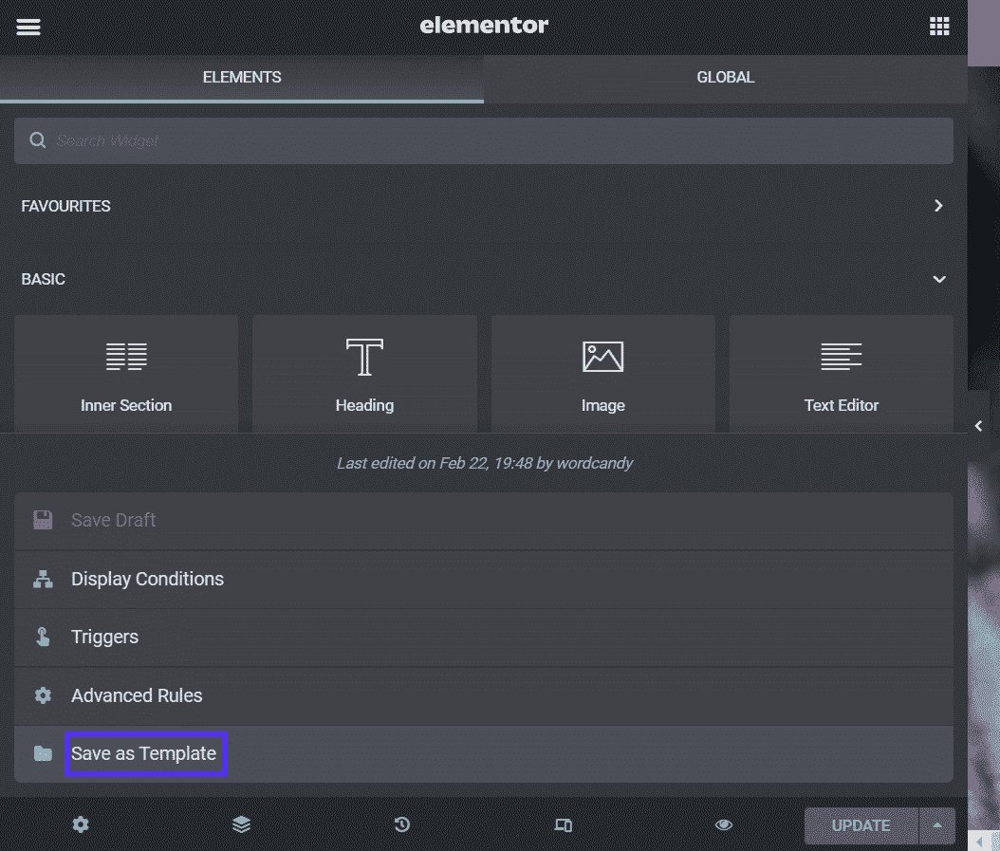
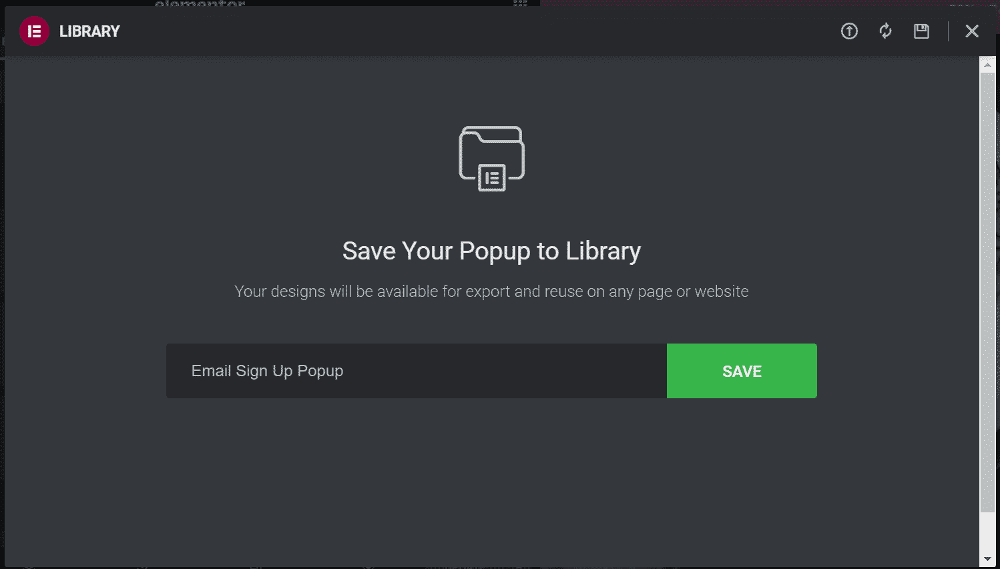
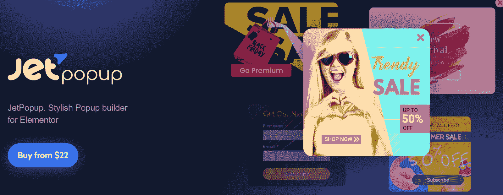

# Elementor 弹出窗口的完整指南(以及如何创建它们)

> 原文:[https://kinsta.com/blog/elementor-popup/](https://kinsta.com/blog/elementor-popup/)

弹出式表单可以是基本的营销工具，使您能够[获取电子邮件地址](https://kinsta.com/blog/how-to-build-an-email-list/)，促进销售，等等。然而，在 WordPress 中制作有吸引力的定制弹出窗口并不总是简单的。

幸运的是， [Elementor 页面生成器插件](https://kinsta.com/blog/divi-vs-elementor/)使得在你的网站上创建和定制弹出窗口变得容易。你可以调整它们来匹配你的[网站的设计](https://kinsta.com/blog/website-design-software/)，并根据用户行为或来源添加触发器。

本指南将概述不同种类的 Elementor 弹出窗口，以及为什么您可能想要使用它们。然后，我们将解释如何使用免费和 [Pro Elementor](https://elementor.com/pricing/) 工具制作这些弹出窗口。我们开始吧！

 <kinsta-auto-toc heading="Table of Contents" exclude="last" list-style="arrow" selector="h2" count-number="-1"><kinsta-advanced-cta language="en_US" type-int-post="118521" type-int-position="0">## 元素或弹出窗口概述

Elementor 是 WordPress 网站最受欢迎的页面生成器插件之一。它使您能够将元素拖放到适当的位置，以设计美观且用户友好的页面:

Elementor page builder

此外，Elementor 使您能够创建各种弹出窗口。这些自定义表单在预定时间后或用户完成特定操作后出现在您的站点上。

<link rel="stylesheet" href="https://kinsta.com/wp-content/themes/kinsta/dist/components/ctas/cta-mini.css?ver=2e932b8aba3918bfb818">

> 需要在这里大声喊出来。Kinsta 太神奇了，我用它做我的个人网站。支持是迅速和杰出的，他们的服务器是 WordPress 最快的。
> 
> <footer class="wp-block-kinsta-client-quote__footer">
> 
> 
> 
> <cite class="wp-block-kinsta-client-quote__cite">Phillip Stemann</cite></footer>

[View plans](https://kinsta.com/plans/)

出于各种原因，弹出窗口可能是必不可少的工具。你可以用它们来收集线索，扩大你的[电子邮件营销](https://kinsta.com/blog/email-marketing-statistics/)列表。Elementor 弹出窗口[与电子邮件营销软件](https://kinsta.com/help/transactional-email/)集成，将客户地址直接发送到你选择的平台。

你甚至可以利用它们来促进销售、折扣和与你的[电子商务商店](https://kinsta.com/blog/ecommerce-platforms/)相关的活动。因此，弹出窗口可以成为你整体营销策略的一部分。

此外，弹出窗口可以帮助你联系你的客户。您可以嵌入调查，以征求消费者的反馈，并改进您的产品和服务。

然而，如果你没有很好地设计弹出窗口，并且没有为你的观众选择正确的触发器，那么弹出窗口会让人觉得廉价和烦人。因此，你需要确保有效地使用它们。这就是 Elementor 的用武之地。

[Popup forms can help you capture email addresses, promote sales, and more. 📧 Learn how to make your own in this guide! 🚀Click to Tweet](https://twitter.com/intent/tweet?url=https%3A%2F%2Fbit.ly%2F3aousS9&via=kinsta&text=Popup+forms+can+help+you+capture+email+addresses%2C+promote+sales%2C+and+more.+%F0%9F%93%A7+Learn+how+to+make+your+own+in+this+guide%21+%F0%9F%9A%80&hashtags=EmailMarketing%2CElementor)

### 元素或弹出窗口的类型

Elementor 提供了 100 多个弹出式模板，您可以根据自己的需要进行定制。这些设计包括:

*   销售线索捕获表单
*   [电子邮件注册](https://kinsta.com/blog/secure-email-providers/)弹出窗口
*   促销弹出窗口
*   登录和欢迎表单
*   受限内容弹出窗口
*   追加销售和交叉销售形式

这些弹出模板内置于 [Elementor 工具包](https://elementor.com/library/)中，其中包括针对不同类型网站的各种设计功能:

ElementorKits popup templates

此外，您可以选择不同的弹出位置和视觉设计，包括:

*   情态的
*   滑入式
*   全屏
*   顶部或底部条

最后，您可以使用 Elementor 编辑器快速定制任何弹出模板来满足您的需求。我们现在将解释如何使用 free 和 Elementor Pro 实现这一点。

## 如何用 Elementor(免费)创建一个弹出窗口

之前，Elementor 插件的[基本插件有一个**模态弹出**特性，使用户能够创建一个免费的弹出表单。使用它是最受欢迎的支付 Elementor Pro 的方式之一。你可以找到很多几年前的教程视频，教你如何使用这种方法。](https://wordpress.org/plugins/essential-addons-for-elementor-lite/)

然而，免费的**模态弹出**功能已经转变成了一个高级的**灯箱和模态**元素。它不再免费使用。因此，你需要升级到 Elementor Pro，或者购买一个我们将在本文后面介绍的高级 Elementor 插件。

## 如何用 Elementor Pro 创建一个弹出窗口(5 个简单的步骤)

Elementor Pro 带有一个内置的弹出窗口功能，我们将在本教程中使用。你首先需要购买并激活 [Elementor Pro](https://elementor.com/pricing/) 。然后，你可以去你的 WordPress 仪表盘开始制作弹出窗口。

### 步骤 1:制作弹出窗口

首先在你的 WordPress 仪表盘中导航到**元素或者>模板>弹出窗口**。然后，点击**添加新弹出**创建一个新的:

Go to “Templates” then “Add New Popup”

然后会提示您命名模板。一旦决定了名称，选择**创建模板**:

Name your popup template and click on “Create”

这将启动 Elementor 页面生成器。现在，您可以从现有的弹出模板设计中进行选择，或者从头开始构建自己的弹出模板。在我们的示例中，我们选择了一个现有模板进行编辑:

Choose from existing popup designs or build one from scratch

现在，您可以使用设计设置来自定义您的弹出窗口。例如，您可以更改其布局、对齐方式、背景图像和颜色。

### 第二步:选择你的展示条件

一旦你对你的设计满意，点击**发布**旁边的向上箭头。然后，从出现的菜单中选择**显示条件**:

Choose your display conditions

接下来，点击**添加条件**来选择你的元素或弹出窗口将在你的网站上显示的位置。然后您可以从以下选项中选择一个位置:**整个站点**、**档案**、**单个**或 **WooCommerce** :

Choose where you want the popup to display

当你对自己的选择满意时，点击**下一个**。您将被带到弹出表单的**触发器**。

### 步骤 3:设置你的弹出窗口触发器

在**触发器**页面上，您可以决定用户需要做什么来查看您的元素或弹出窗口。默认情况下，每个选项都是禁用的，您可以通过单击滑块来启用它。然后，您需要为您的触发器指定值。

例如，如果您在页面加载上选择**，您将需要选择弹出窗口显示的秒数:**

Select the popup triggers you want

当**在滚动**时，你可以选择用户需要滚动的方向，以及在弹出窗口出现之前他们必须覆盖多少页面:

Page scroll triggers

滚动到元素时的**设置要求您输入一个 CSS ID。当用户到达页面上的该元素时，将出现弹出窗口:**

Scroll to element triggers

当**点击**时，你必须指定在弹出窗口显示之前用户必须点击你的网站多少次:

More trigger options under advanced rules

不活动后设置使您能够在用户在您的页面上闲置一段特定时间后触发您的弹出窗口:

Inactivity triggers

最后，您可以选择在页面退出意图上启用**。当用户试图离开您的页面时，此设置将触发您的弹出窗口:**

Select the “On Page Exit Intent” trigger when applicable

完成后，点击**保存&关闭**或**下一步**导航至**高级规则。我们将在本教程的稍后部分研究这些规则。**

 <kinsta-advanced-cta language="en_US" type-int-post="118521" type-int-position="1">### 步骤 4:在你的站点上添加一个弹出按钮(可选)

您可能希望在用户单击页面上的特定元素时触发 element 或 popup。例如，你可以设计一个写着“立即注册”的按钮，并将其嵌入你的页脚。当用户点击按钮时，他们会在屏幕上看到你的[电子邮件注册](https://kinsta.com/blog/keep-email-and-hosting-separate/)表单。

首先，你需要在你的网站上创建一个元素或按钮。在 Elementor 编辑器中打开文章或页面，从菜单中选择**按钮**。将其拖放到您的页面上:

Choose the “Button” option from the menu

一旦你指定了按钮文本并定制了它的外观，点击**链接>动态标签**。然后，从下拉菜单中选择**动作>弹出**:

 ## 注册订阅时事通讯

### 想知道我们是怎么让流量增长超过 1000%的吗？

加入 20，000 多名获得我们每周时事通讯和内部消息的人的行列吧！

[Subscribe Now](#newsletter)

Select the popup action for the button

点击**弹出框**并从**动作**下拉菜单中选择**打开弹出框**。您也可以从**弹出菜单**中选择您的表单:

Select the popup dropdown option

最后，选择**更新**来发布你的按钮。每当用户点击它，他们将被带到你的注册表单。

### 步骤 5:保存你的弹出模板以备后用

您也可以将弹出窗口保存为模板。用 Elementor 编辑器打开你的弹出窗口，点击**更新**旁边的向上箭头。从菜单中选择**另存为模板**:

Save your popup as a template

然后会提示您命名模板。完成后，点击**保存**:

Give the popup template a name and click “Save”

弹出窗口将保存到您的模板库中。现在，您可以在使用模板构建页面或帖子时使用它。

## 如何配置高级元素或弹出设置

我们已经介绍了如何制作一个基本的弹出元素。但是，也有一些您可能想要使用的高级设置。

用 Elementor 编辑器再次打开弹出窗口，导航到**显示规则**。让我们来看看不同的设置。

### 弹出显示设置

一些高级弹出显示设置使您能够控制用户何时看到您的表单。这些配置可以方便地针对回头客，而不是第一次。

例如，您可以选择在访问者查看您的页面一定次数后显示您的弹出窗口:

More advanced settings and conditions

或者，您可以选择在 X 个会话后显示**。此设置针对整体访问，而不是特定页面:**

Show popup after a certain amount of sessions

**最多显示 X 次**设置可以限制用户查看您的弹出窗口的次数。如果您不想不断地向访问者发送带有侵扰性表单的垃圾邮件，您可以考虑启用它:

Select how many times users will see your popup

您还可以使用**在设备上显示**和**在浏览器上显示**设置来限制弹出窗口的显示位置。在[移动设备](https://kinsta.com/blog/google-mobile-first-index/)上弹出窗口可能会特别烦人，所以你可以考虑在那里禁用它们:

Struggling with downtime and WordPress problems? Kinsta is the hosting solution designed to save you time! [Check out our features](https://kinsta.com/features/)

You can choose the “Show on devices” option

提供更好的移动用户体验可以让你的访问者满意。它还可以提高你的搜索引擎优化(SEO)努力，帮助你的网站在搜索结果中排名更高。

### 用户来源设置

最后，Elementor 使您能够根据您的用户来自哪里来配置弹出显示设置。如果您将访问者引导到促销登录页面，然后使用弹出窗口进行广告交易或询问联系方式，这些设置会很方便。

以下设置使您能够指定 URL 并选择哪些链接将触发弹出窗口:

Show to users arriving from a specific place

最后，您可以选择对登录用户隐藏弹出窗口。如果你运营一个付费会员网站，你可以使用这个设置:

Hide popups for logged in users

当你对所有选择的设置满意时，点击**保存&关闭**。如果需要，您可以返回到这里并更改这些配置。

## 元素或弹出窗口的前 3 个插件

正如我们所看到的，Elementor Pro 使得为你的网站创建弹出窗口变得很容易。但是，您可能还没有准备好升级到高级页面生成器。或者，您可能正在寻找额外的设计功能。

考虑到这些因素，这里有几个最好的 Elementor 弹出窗口插件。

### 1.JetPopUp (Crocoblock)

JetPopUp (Crocoblock)

JetPopUp 是一个用户友好的插件，具有拖放界面，与 Elementor 完美集成。它使您能够创建动态和定制的弹出表单，包括电子邮件注册、cookie 同意表单和倒计时。

JetPopUp 因其交互功能而大放异彩。您可以从多种动画设置中进行选择，如滑动、翻转和旋转。此外，该插件有各种模板，您可以根据自己的需要定制。

这个插件还可以让你选择和定制多个显示设置。例如，您可以在特定日期当用户试图离开您的网站时，或者在一定数量的滚动之后，向用户显示您的 JetPopUp 表单。

**特性:**

*   从预设的弹出模板中选择
*   选择不同的弹出显示条件
*   包括和排除特定条件
*   使用动画效果

**定价:** JetPopUp 费用[每年 22 美元](https://crocoblock.com/plugins/jetpopup/)。这个包包括 MailChimp 集成、一个弹出窗口小部件和客户支持。你也可以升级到全包订阅，每年 130 美元。它带有 20 个额外的插件和 150 个额外的部件。

### 2.弹出框部件(PowerPack)

Popup Box Widget (PowerPack)

如果你正在寻找高级元素或弹出设置，考虑使用 PowerPack 的[弹出框小部件](https://powerpackelements.com/elementor-widgets/popup-box/)。它允许您构建包含视频、图像和谷歌地图等动态元素的自定义弹出窗口。

这个插件使你能够根据不同的用户操作触发弹出窗口，包括退出意图和自定义时间延迟。您还可以创建包含链接和其他行动号召(CTA)元素的交互式两步弹出窗口。

此外，弹出框部件具有高级动画设置。您可以缩放弹出窗口、使用报纸格式或使用 3D 动画。

**特性:**

*   从动画效果中选择
*   创建两步弹出窗口
*   使用时间延迟和用户触发器
*   显示图像、视频和其他交互式元素

**定价:**弹出框部件包含在 [PowerPack 订阅中](https://powerpackelements.com/pricing/)。计划起价为每年 49 美元，包含 70 多种不同的 Elementor 小部件。

### 3.light box & Modal(Elementor 的基本插件)

Lightbox & Modal (Essential Addons for Elementor)

我们之前简单地提到了这个 Elementor 弹出插件。Lightbox & Modal 是一个多功能的小工具，带有 Elementor 工具的基本插件。它帮助您创建具有交互式功能的弹出窗口，如视频、图像和动画。

Lightbox & Modal 设计用于 Elementor 网站上的按钮和链接。您可以创建自定义按钮、图标和文本来触发您的弹出表单。此外，小部件可以使用时间延迟和其他用户操作。

总的来说，Lightbox & Modal 可能是与用户互动的最佳选择，而不仅仅是展示信息。

**特性:**

*   对弹出窗口使用按钮触发器
*   显示图像、视频和自定义内容
*   自定义弹出布局
*   从不同的动画类型中选择

**定价:** Lightbox & Modal 包含在 Elementor Pro 的基本插件中。计划起价为每年 39.97 美元，有 70 多个插件和 7 个扩展。

[Learn how to make popups using both the free and Pro Elementor tools with help from this step-by-step guide 💪📧Click to Tweet](https://twitter.com/intent/tweet?url=https%3A%2F%2Fbit.ly%2F3aousS9&via=kinsta&text=Learn+how+to+make+popups+using+both+the+free+and+Pro+Elementor+tools+with+help+from+this+step-by-step+guide+%F0%9F%92%AA%F0%9F%93%A7&hashtags=EmailMarketing%2CElementor) <kinsta-advanced-cta language="en_US" type-int-post="118521" type-int-position="2">## 摘要

弹出式表单对您的销售线索挖掘和营销活动至关重要。他们还可以帮助你与访问者互动，并让他们留在你的页面上。幸运的是，您可以使用 Elementor 页面生成器创建自定义弹出窗口。

用[elements 或 Pro](https://elementor.com/) 创建弹出窗口非常容易。您可以自定义它们以匹配您的品牌，并决定它们在您网站上的显示位置。您还可以设置高级显示设置，根据用户操作和来源显示您的弹出窗口。

用 Elementor 设计一个漂亮的网站只是第一步。你还需要一个托管的[应用程序、](https://kinsta.com/application-hosting/)[数据库和](https://kinsta.com/database-hosting/)[托管的](https://kinsta.com/wordpress-hosting/)提供商。

今天就来看看我们的定价方案，看看 Kinsta 如何为你的网站增压！

* * *

让你所有的[应用程序](https://kinsta.com/application-hosting/)、[数据库](https://kinsta.com/database-hosting/)和 [WordPress 网站](https://kinsta.com/wordpress-hosting/)在线并在一个屋檐下。我们功能丰富的高性能云平台包括:

*   在 MyKinsta 仪表盘中轻松设置和管理
*   24/7 专家支持
*   最好的谷歌云平台硬件和网络，由 Kubernetes 提供最大的可扩展性
*   面向速度和安全性的企业级 Cloudflare 集成
*   全球受众覆盖全球多达 35 个数据中心和 275 多个 pop

在第一个月使用托管的[应用程序或托管](https://kinsta.com/application-hosting/)的[数据库，您可以享受 20 美元的优惠，亲自测试一下。探索我们的](https://kinsta.com/database-hosting/)[计划](https://kinsta.com/plans/)或[与销售人员交谈](https://kinsta.com/contact-us/)以找到最适合您的方式。</kinsta-advanced-cta></kinsta-advanced-cta></kinsta-advanced-cta></kinsta-auto-toc>