# 如何导出和导入网站元素(完整指南)

> 原文:[https://kinsta.com/blog/elementor-import-template/](https://kinsta.com/blog/elementor-import-template/)

Elementor 工具让设计漂亮的页面、帖子和整个网站变得容易。然而，即使有强大的[页面生成器](https://kinsta.com/blog/divi-vs-elementor/)，如 Elementor，创建一个新的网站设计也需要时间和精力。

这就是 Elementor 的进出口系统的用武之地。使用此功能，您可以通过为项目创建可重用的模板或导入第三方布局来缩短设计和开发时间。

这篇文章将深入探讨 Elementor 灵活而强大的导入/导出系统。我们将涵盖从部分模板到页面模板的所有内容，甚至导出您的整个 Elementor 网站。我们开始吧！

## 如何为新的 Elementor 模板准备您的站点(两步)

元素或模板是预先设计的布局，适用于单个页面或特定的用户界面(UI)元素。尽管它们听起来和 WordPress 主题相似，但还是有一些本质的区别。

改变整个网站的设计。相比之下，元素或模板影响单个网页的布局。因为它们被限制在一个页面中，所以可以同时使用多个元素或模板。此外，这些模板基于一个 [WordPress 主题](https://kinsta.com/best-wordpress-themes/)，无论是[免费还是高级](https://kinsta.com/blog/wordpress-free-vs-paid-themes/)。

将新的元素或模板应用到您的网站可以改变它的外观或功能。考虑到这一点，在更改模板之前，您应该执行一些操作。

[The Elementor tool makes it easy to design beautiful pages, posts, and entire websites ✨ Make importing and exporting sites equally easy with this guide 💪Click to Tweet](https://twitter.com/intent/tweet?url=https%3A%2F%2Fkinsta.com%2Fblog%2Felementor-import-template%2F&via=kinsta&text=The+Elementor+tool+makes+it+easy+to+design+beautiful+pages%2C+posts%2C+and+entire+websites+%E2%9C%A8+Make+importing+and+exporting+sites+equally+easy+with+this+guide+%F0%9F%92%AA&hashtags=WebDev%2CElementor)

### 步骤 1:创建备份

明智的做法是[在改变你的元素或模板之前创建一个备份](https://kinsta.com/blog/backup-wordpress-site/)。这一步确保您在遇到新设计的[问题时有内容可以恢复。](https://kinsta.com/best-wordpress-themes/)

[各种插件](https://kinsta.com/blog/wordpress-backup-plugins/)让你创建网站备份。其中包括 [UpdraftPlus 插件](https://wordpress.org/plugins/updraftplus/)，它可以将你所有的文件和数据库信息复制到云端:

UpdraftPlus

如果您是 Kinsta 的客户，我们会每天自动备份您的网站。如果您需要[更频繁的备份](https://kinsta.com/help/wordpress-backups/)，我们可以每六小时(每月每个站点 50 美元)或每小时(每月每个站点 100 美元)复制您的站点。

或者，您可以随时手动创建备份。为此，请登录您的 [MyKinsta 仪表盘](https://my.kinsta.com/):

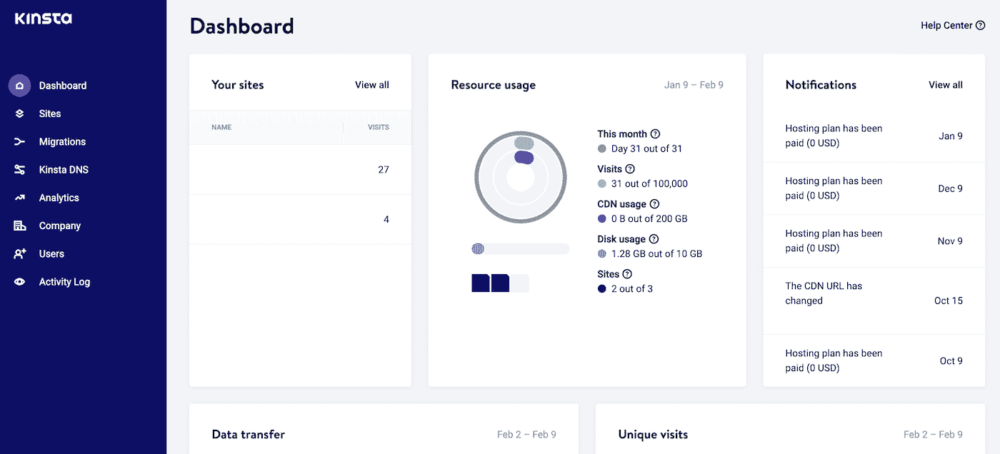

MyKinsta dashboard

在左侧菜单中，选择**站点**并点击相关网站。然后选择**备份>手动**:

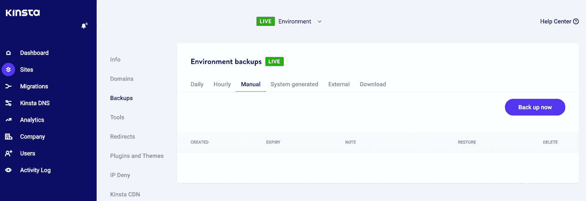

Click on “Sites then “Backup”

只需点击一下 **Back up now** 按钮，剩下的我们会处理。如果您遇到问题并希望[恢复您最近的备份](https://kinsta.com/blog/restore-wordpress-from-backup/)，请导航至**备份>手动**选项卡。在这里，MyKinsta 显示了所有备份的列表:

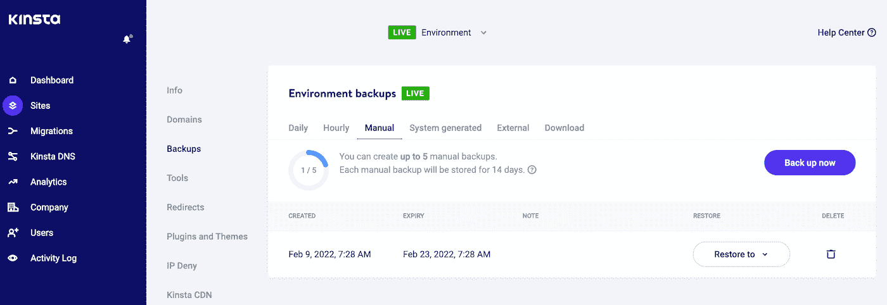

MyKinsta displays a list of all backups

要恢复您站点的早期版本，请点击其附带的**恢复到**按钮。您现在可以选择将此备份恢复到您的实时网站或临时网站。

### 第二步:将你的网站置于维护模式

更改网站的模板可能会导致意外的崩溃、错误或其他奇怪的行为。在应用了新的设计之后，你可能需要花一些时间来测试你的站点并进行调整。

如果访问者试图在您进行这些更改时访问您的网站，他们可能会影响他们的体验质量。这可能会导致你失去潜在的转换。

在应用一个新的元素或模板之前，你可能想让你的站点进入[维护模式](https://kinsta.com/blog/wordpress-maintenance-mode/)。这一步将防止访问者在您测试新设计时访问您的网站。

几个插件可以创建一个自定义的维护模式。然而， [WP 维护模式](https://wordpress.org/plugins/wp-maintenance-mode/)是一种流行的选择:

WP Maintenance Mode

这个插件有很多额外的功能，包括为你的维护启动画面添加倒计时。这个特性可以帮助你产生一个围绕你的网站重新设计和重新启动的嗡嗡声。

一旦你的网站进入维护模式，你就可以自由地尝试各种模板，测试它们在网站前端的表现。当你对结果满意时，你可以让你的网站脱离维护模式——用你的网站重新设计让访问者惊叹。

## 如何保存元素或模板(2 种方法)

作为世界上最受欢迎的页面生成器之一，Elementor 并不缺少现成的第三方模板。但是，有时您可能希望创建自己的模板。

使用模板可以帮助你[实现整个网站的设计一致性](https://kinsta.com/blog/web-design-best-practices/)。它还可以节省你的时间，主要是如果你在多个网站上使用相同的设计。

例如，WordPress 设计和开发机构可以从创建模板中受益，这些模板以他们经常应用于客户网站的核心元素为特色。

### 方法 1:将页面保存为 Elementor 模板

您可以将任何页面保存为 Elementor 模板。这可以帮助您建立一个标准的外观和感觉，准备在您的网站上部署。

例如，你可能[创建你网站的菜单](https://kinsta.com/blog/wordpress-custom-menu/)，加上页眉和[页脚](https://kinsta.com/blog/how-to-edit-footer-in-wordpress/)。然后，您可以将此页面模板应用到您的所有网页。

创建模板还意味着您不必为每个网页手动重新创建相同的元素。这对你的生产力来说是个好消息。

要将当前页面保存为 Elementor 模板，请在 Elementor 侧边栏底部找到绿色的**更新/发布**按钮。然后，单击该按钮附带的箭头图标:

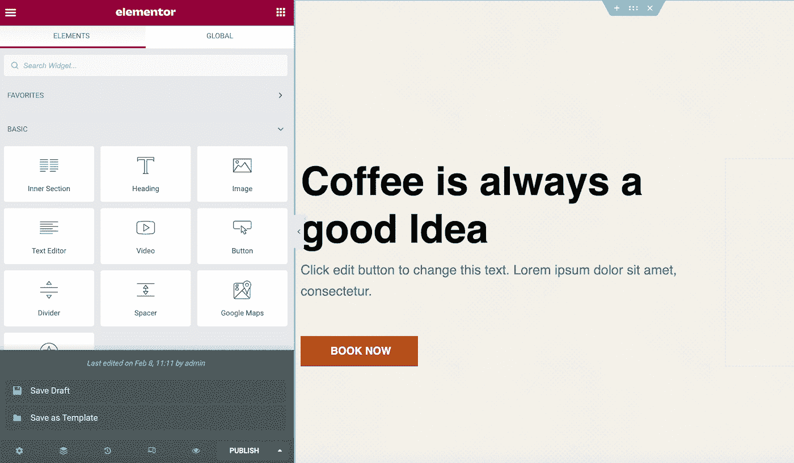

Save page as an Elementor template

您现在可以点击**另存为模板**。这将启动一个窗口，您可以在其中为该模板指定一个描述性名称:

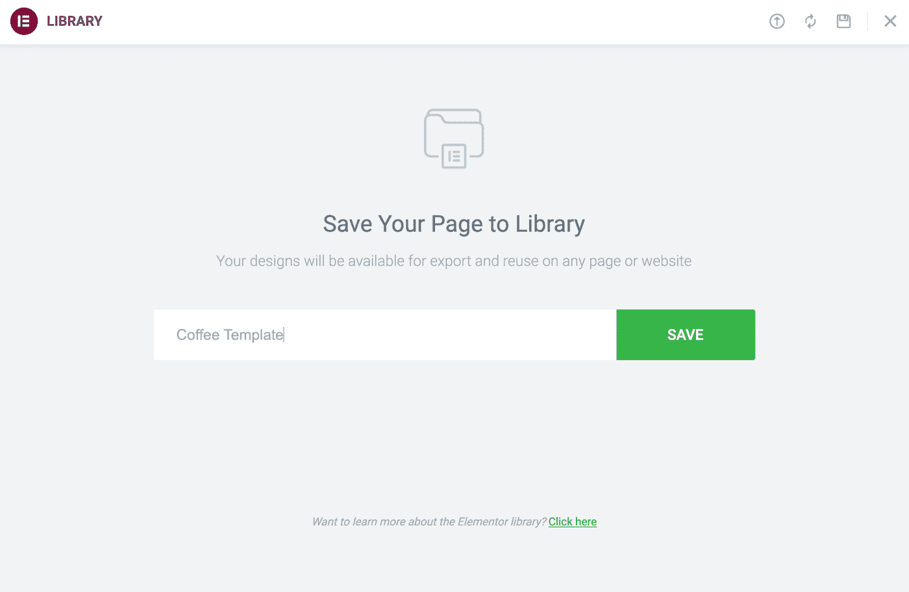

Name your page template

然后，点击**保存**。你现在可以通过启动 Elementor 库并选择**我的模板**选项卡来随时访问这个设计。

### 方法 2:将部分保存为 Elementor 模板

许多网站都有重复出现的元素。这些包括[销售线索生成](https://kinsta.com/blog/wordpress-lead-generation/)表格或描述你最畅销产品的文字。

通过制作一个节模板，您只需点击几下就可以将其添加到任何页面。您甚至可以为不同的内容类别创建节模板。

例如，您可以构建一个[行动号召(CTA)](https://kinsta.com/blog/conversion-rate-optimization-tips/) 模板。然后，每当您需要 CTA 时，您可以简单地导入这个模板并调整它的消息传递。

要创建一个模板，请按住 control 键单击有问题的**部分**。然后，选择**另存为模板**:

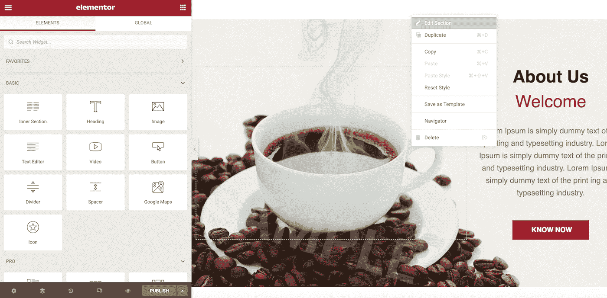

Save a section as a template

在出现的窗口中，为该模板指定一个描述性名称。然后，点击**保存**:

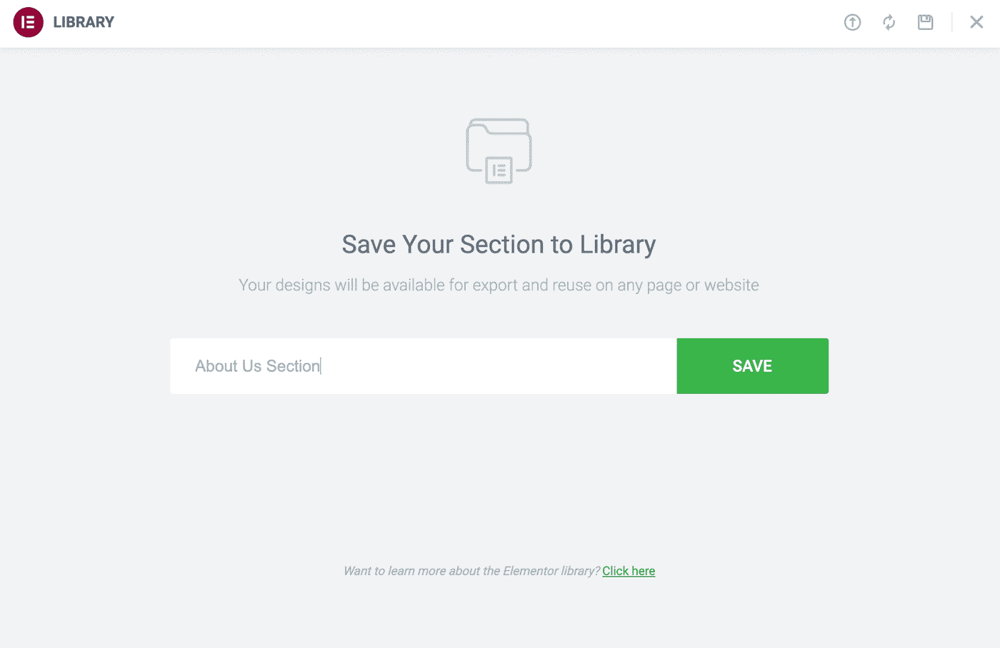

Give your section a name

要将这个模板应用到任何部分，只需启动 Elementor 模板库。您会在**我的模板**选项卡中找到该设计。

## 如何创建元素或模板

虽然您可以将任何正在进行的页面或部分保存为[元素或模板](https://kinsta.com/blog/elementor-templates/)，但有时您会明确地想要创建一个以供重用。在这种情况下，您可以将设计作为常规的 Elementor 网页开始，然后将其保存为模板。

但是，您也可以提前通知 Elementor 您正在创建一个模板。这种方法让你更灵活地为网站的不同区域创建模板。

例如，你可以为你的错误 404 页面设计一个模板，[搜索结果页面](https://kinsta.com/blog/wordpress-search/)，或者甚至创建一个弹出布局。此方法还允许您使用库中的任何模板作为新设计的基础。

要创建页面或节模板，请导航至**模板>保存的模板**。然后，点击**添加新的**。在下一个窗口中，打开**选择模板类型…** 下拉菜单:

Choose a template type

现在，您可以指定想要创建的模板种类。我们已经介绍了页面和节模板，但是此窗口为您提供了额外的选项。

选择后，给你的设计起一个描述性的名字，然后点击**创建模板**。这将启动 Elementor 库，您可以在其中使用预先存在的模板作为基础。或者，您可以退出此窗口，重新开始。

现在，您可以使用标准的 Elementor 编辑器来构建您的模板。当你准备好保存你的设计时，点击**发布**。这将启动**发布设置**框:

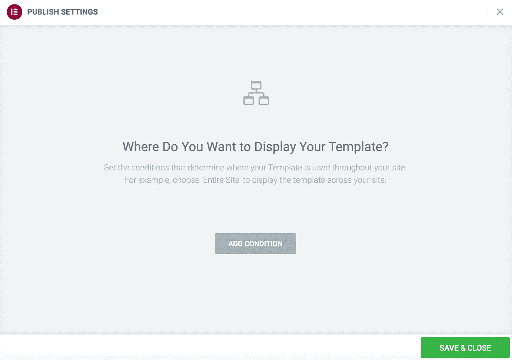

The Publish Settings box

在这里，您可以设置使用该模板的一些规则。例如，您可以点击**添加条件**，并指定该布局仅适用于单页。

## 如何导出元素或模板

你可以从 WordPress 仪表盘导出元素或模板。这种方法可以帮助你与同事分享设计，或者[将设计发送给客户](https://kinsta.com/blog/wp-feedback-wordpress-plugin/)进行审批。您甚至可以使用导出功能来创建 Elementor 设计的备份。

导出模板是跨多个域使用您的设计的一种简单方法。这种方法对于管理众多网站的 WordPress 设计和开发机构来说非常方便。如果你想将你的设计货币化，出口通常是与世界分享的第一步。

在 WordPress 仪表盘中导航到**模板>保存的模板**以导出设计。此选项卡显示保存到库中的所有模板:

View all saved templates

WordPress 还将这些模板分为**页面**和**部分**标签。只需找到您想要导出的模板，并将鼠标悬停在它上面:

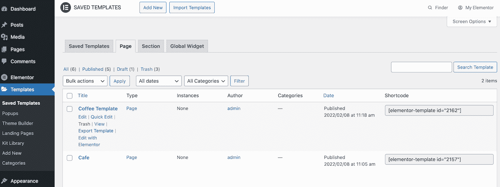

Choose between page and section templates

当**导出模板**链接出现时，点击它。Elementor 现在将下载这个模板作为一个 JSON 文件。

您还可以从 Elementor 库中导出模板。在该库中，打开**我的模板**选项卡。找到您想要导出的模板，并单击其附带的三点图标:

Export templates directly from the library

然后，点击**导出**。Elementor 现在将下载这个模板作为一个 JSON 文件。

## 如何导入元素或模板

有时，您可能希望将模板导入 Elementor。它可能是从不同网站导出的设计，也可能是从第三方购买的设计。

如果您有 JSON 或 ZIP 格式的模板，您可以将它上传到 Elementor 库。首先，导航至**模板>保存的模板**。在该屏幕顶部，点击**导入模板**:

Find and click the “Import Templates” button

然后，选择您的元素或导入模板，并点击**立即导入**。该模板现在将出现在您的库中。

要将这种设计应用到您的网站布局中，只需用 Elementor 编辑器打开有问题的页面或帖子。然后，点击由白色文件夹表示的**添加模板**图标:

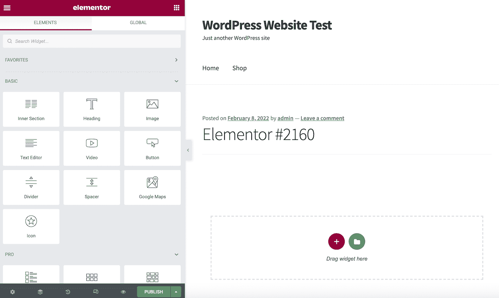

Find the “Add Template” button

在下一个窗口中，选择**我的模板**选项卡。在这里，您可以找到所有元素或导入的模板:

View all imported templates

要查看该设计应用于当前页面时的外观，请点击**预览**。如果你喜欢使用这个模板，选择它附带的**插入**链接。

## 注册订阅时事通讯

### 想知道我们是怎么让流量增长超过 1000%的吗？

加入 20，000 多名获得我们每周时事通讯和内部消息的人的行列吧！

[Subscribe Now](#newsletter)

## 如何导出和导入单个元素或页面

您可能希望在多个网站中重用同一页面。例如，如果你运营几个 WordPress 网站，你可以使用一个标准的[关于我们的页面](https://kinsta.com/blog/about-us-page/)。

与其手动重新创建此页面，不如将其保存为 Elementor 模板并导出。然后，您可以将该设计导入任何安装了 Elementor 的网站。

要将单个页面保存为模板，请单击 Elementor 的**发布/更新**按钮旁边的箭头图标。然后您可以选择**另存为模板**:

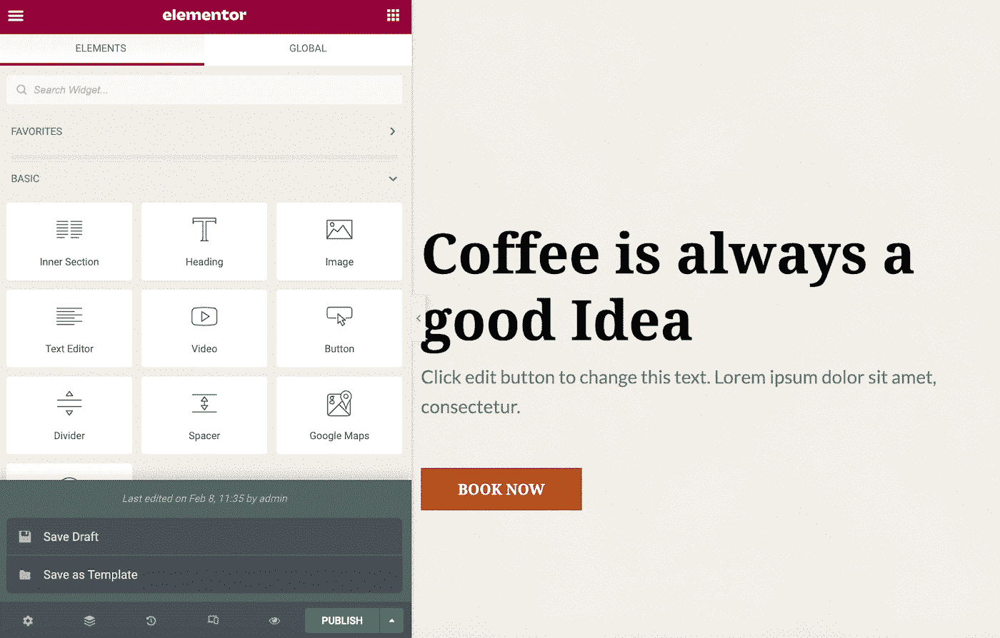

Save an individual page as a template

在随后的弹出窗口中，给出该模板的名称。然后，点击**保存**。

WordPress 模板库应该会自动打开。您可以找到刚刚创建的模板，然后单击它的三点图标。出现提示时，选择**导出**:

Locate any templates in the library

或者，你可以在你的 WordPress 仪表盘中导航到**模板>保存的模板**来导出这个单页模板。然后，将鼠标悬停在有问题的模板上，点击**导出**。

一旦单页模板安全地存储在您的本地计算机上，您就可以将其导入到另一个网站。只需切换到您的新网站，并导航到**模板>保存的模板**。

在该屏幕顶部，点击**导入模板**。您现在可以导入您的单页设计。

## 如何导出和导入整个 Elementor 网站(分 3 步)

虽然 Elementor 使得导入和导出单页模板变得很容易，但是您可能还需要[导出整个网站](https://kinsta.com/knowledgebase/export-wordpress-site/)。

例如，您可能想要创建一个包含所有标准网站页面的模板工具包，如联系页面和主页。然后，您可以使用这个工具包来形成您的基本网站。

让我们看看如何创建这个工具包。以下是如何通过三个简单的步骤导出您的整个 Elementor 网站！

### 步骤 1:启用 Elementor 导出工具包

Elementor 的导出工具包功能可以导出您的完整站点，包括其内容和设置。

如果您正在创建相关网站并希望保持相同的品牌，此功能会很有帮助。例如，您可以创建一个微型网站来宣传即将推出的产品。

在撰写本文时，Elementor 的导出工具包还处于试验阶段。你需要通过导航到**元素或>设置**来启用它。然后你可以点击**实验**选项卡:

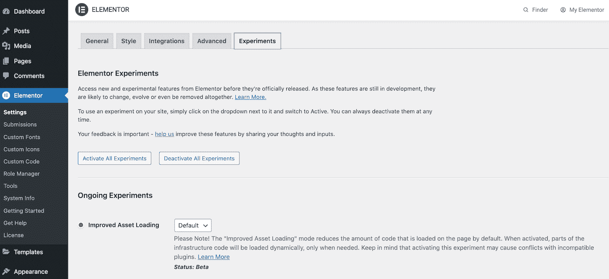

Click on the Elementor tab and find the Experiments tab

滚动到**导入导出模板套件**部分。然后，您可以打开相应的下拉菜单，选择**活动**:

Scroll to the “Import Export Template Kit” option

不要忘记滚动到这一页的底部，并点击**保存更改**。这个实验性的特性现在已经可以使用了。

### 步骤 2:导出整个 Elementor 网站

在你的 WordPress 仪表盘中，导航到**元素或者>工具**。现在点击**导入/导出工具包**:

Click on Import Export Kit

点击**开始导出**。出现提示时，请指定您希望下载的内容和数据。

例如，您可以选择仅导出模板。或者，您可以导出您的所有内容，包括页面、帖子和自定义帖子类型:

Struggling with downtime and WordPress problems? Kinsta is the hosting solution designed to save you time! [Check out our features](https://kinsta.com/features/)

Export any or all of the content you want

接下来，单击展开**套件信息**部分，并为您的文件指定一个描述性名称。您也可以输入可选的描述:

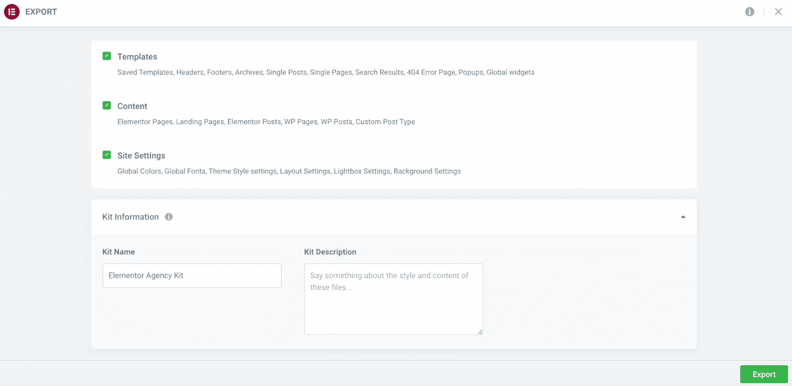

Give your file a descriptive name

当您对选择满意时，点击**导出**。Elementor 现在将创建您的工具包，并显示该文件中包含的所有内容的摘要:

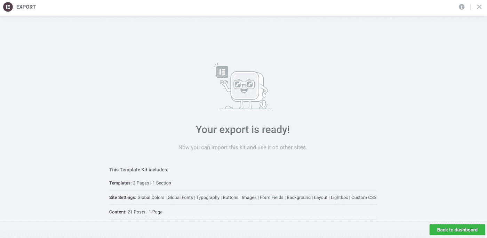

You get a display summary of the kit

Elementor 会自动将生成的工具包下载到您的计算机上。出现提示时，点击**返回仪表板**。

### 步骤 3:导入您的网站

现在，您可以将模板工具包导入任何安装了 Elementor 的网站。这将覆盖您的现有内容，因此我们建议您在继续之前创建一个完整备份。

一旦备份就绪，您需要在目标网站上启用 Elementor 实验。如前所述，导航至**元素或>设置>实验**。然后您可以选择**导入导出模板套件**部分并激活此功能。

接下来，导航到**模板>套件库**。点击**开始导入**。在随后的屏幕上，选择您在上一步中下载的文件:

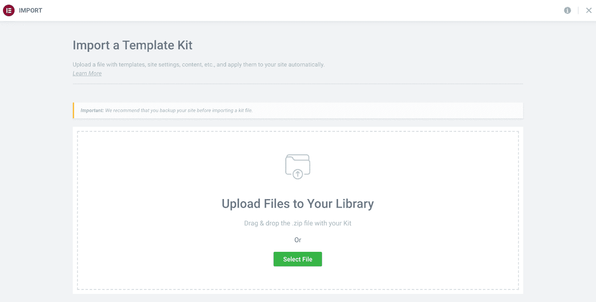

Import a Template Kit

如果您要将套件应用于预先存在的安装，Elementor 将显示与您正在导入的模板具有相同条件的任何模板。然后，您可以选择替换哪些模板，保留哪些模板。

做出选择后，点击下一个的**。Elementor 现在将导入您的站点工具包。**

## 如何修复 Elementor 的“无效文件”错误

有时，在尝试导入模板时，您可能会看到“无效文件”错误。这通常意味着您正在尝试导入使用早期版本的 Elementor 创建的模板。

要解决此错误，您需要暂时切换到 Elementor 或的早期版本。此更改可能会导致您的网站出现问题。

考虑到这一点，我们建议在继续之前创建完整备份。您可能还想考虑将您的站点置于维护模式。

当你准备好继续时，前往[元素或插件列表](https://wordpress.org/plugins/elementor/)。然后，选择**高级视图**:

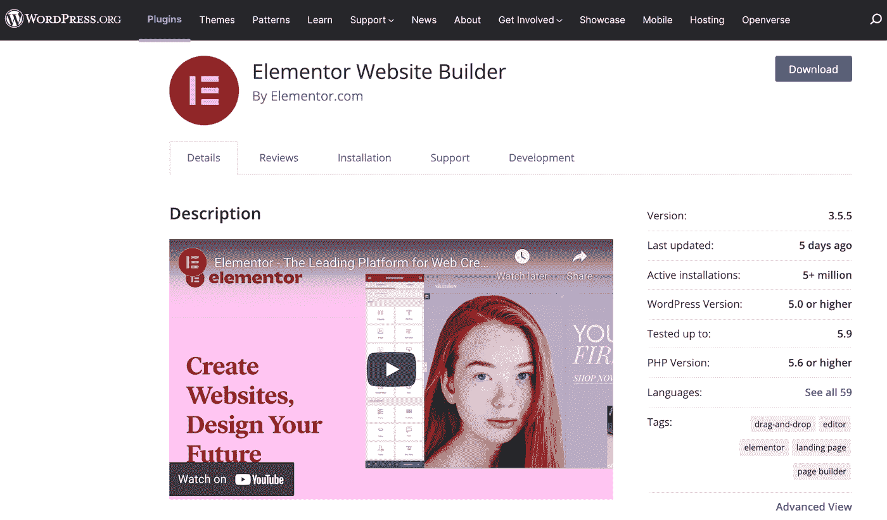

Click on the “Advanced View” option

在页面底部，使用下拉菜单选择 Elementor 的早期版本。为了获得最佳效果，我们建议下载 Elementor 1 的最新版本，即 **1.9.8** :

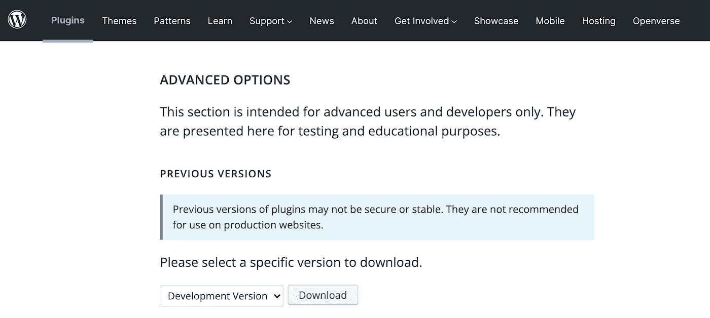

Download the latest version of Elementor

一旦你有了这个文件，你有几个选择。您可以停用并删除当前的元素或版本。然后，您可以上传并激活刚刚下载的软件。

或者，你可以使用[简单的主题和插件升级](https://wordpress.org/plugins/easy-theme-and-plugin-upgrades/)。激活此插件后，您可以上传旧的 Elementor 版本，而无需停用和删除最新版本。

上传旧版本的 Elementor 后，导航到**插件>已安装插件**。WordPress 应该已经自动切换到较早的软件版本:

View the new version of Elementor in the plugins section

现在，您应该能够顺利导入模板了。一旦导入完成，导航回**插件>已安装插件**，并恢复最新版本的 Elementor。该模板现在应该在您的库中，可以使用了。

## 用于导入和导出模板的前 3 个元素或插件

正如我们刚刚看到的，Elementor 有一个健壮的导入和导出系统。开箱即用，您可以使用此功能为单个部分、页面甚至整个网站创建模板。

但是，您可能希望扩展这个内置功能。考虑到这一点，这里有三个 Elementor 导入模板插件，承诺增强导入和导出过程！

### 1.快乐插件专业版

[Happy Addons Pro](https://happyaddons.com/) 增加了 20 多项新功能，扩展了标准的 Elementor 体验。其中包括几个可以集成到您的导入和导出工作流程中的功能:

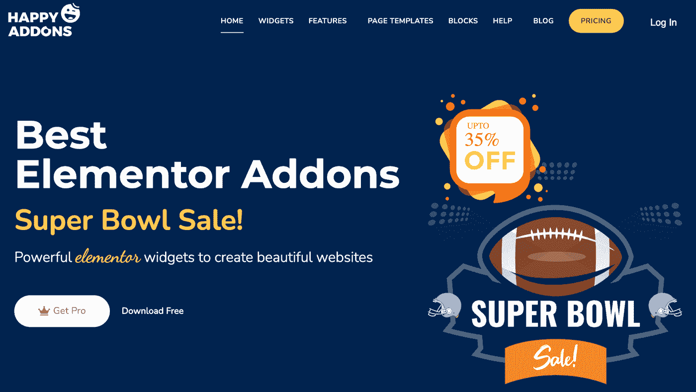

Happy Addons Pro

如果你正在与多个网站合作，你可能想使用 Happy Addons Pro 的跨域复制粘贴功能。它使你能够轻松地从一个网站复制内容，并粘贴到一个完全不同的领域。

如果你想重用任何快乐插件专业演示内容，你可以把它复制到你的元素或编辑器面板。此外，这个插件拥有一个定制的进口功能。它提供了您期望从内置元素或导入和导出系统中获得的所有功能。

特别是，你可以根据版块名称或者页面版块类别来搜索快乐插件模板。

**特性:**

*   从 70 多个[登陆页面模板](https://happyaddons.com/happy-templates/)中选择。
*   使用快乐复制功能复制任何页面或帖子。
*   从 HappyAddons Pro 的演示内容中轻松复制部分模板。
*   从任何网站复制一个部分，并将其粘贴到不同的域中。

**定价:** [年度许可证起价 33 美元](https://happyaddons.com/pricing/)。

### 2.元素的强大插件

Elementor 的强大插件附带了一系列预先设计好的模板套件。当您将这些工具包导入您的网站时，您将可以访问设计各种网站所需的所有页面。

Elementor 的强大插件为许多不同的行业提供模板工具包。这些包括动物福利、健身、接待、咨询，甚至跳伞业务:

Mighty Addons

这个插件还具有跨域复制粘贴功能。如果您管理多个网站，这可以是对传统的导入/导出元素或工作流的强大补充。特别是，这个特性使您能够在多个 Elementor 支持的网站上使用任何部分、行、列，甚至整个页面的内容。

**特性:**

*   轻松复制域之间的图像和视频。
*   使用各种现成的章节模板。
*   将该工具与 Pixabay 股票摄影服务集成。

**定价:**你可以下载 Elementor 插件的核心[强力插件。专业版也有售，T4 许可证起价 29 美元。](https://wordpress.org/plugins/mighty-addons/)

### 3.环境元素

Envato Elements 插件让你不用离开 WordPress 就可以浏览成千上万的页面和模板。找到完美的模板后，您可以轻松地将其导入您的网站:

Envato Elements

为了帮助你快速设计出专业外观的网站，Envato Elements 还提供了大量的模板工具包。此外，如果你使用库存照片，这个插件可以让你轻松访问超过一百万张免版税的图片。

**特性:**

*   多用途模板
*   灵活且完全可定制的内容
*   一键导入
*   与元素或用户界面无缝集成

**定价:**可以免费下载 [Envato Elements 插件](https://wordpress.org/plugins/envato-elements/)。但是，您需要订阅 Envato Elements 才能访问和使用模板内容。这是[，每月售价 16.50 美元](https://elements.envato.com/pricing)。

[Importing and exporting your Elmentor websites just got a whole lot easier 😌Click to Tweet](https://twitter.com/intent/tweet?url=https%3A%2F%2Fkinsta.com%2Fblog%2Felementor-import-template%2F&via=kinsta&text=Importing+and+exporting+your+Elmentor+websites+just+got+a+whole+lot+easier+%F0%9F%98%8C&hashtags=WebDev%2CElementor) ## 摘要

我们不会假装设计一个令人惊叹的网站很简单。幸运的是，有了 Elementor 的导出和导入模板功能，您不必从头开始每个项目。

通过利用现成的模板，您可以快速通过早期的 web 开发阶段。您还可以创建节和页面模板，以便在将来的项目中重用。如果你对一个网站感到特别自豪，Elementor 甚至可以导出你的整个网站。可能性是无限的！

创建 WordPress 网站时，你需要一个强大的主机。在 Kinsta，我们为您的所有 Elementor 需求提供一系列[性能优化的托管计划](https://kinsta.com/elementor-hosting/)。

* * *

让你所有的[应用程序](https://kinsta.com/application-hosting/)、[数据库](https://kinsta.com/database-hosting/)和 [WordPress 网站](https://kinsta.com/wordpress-hosting/)在线并在一个屋檐下。我们功能丰富的高性能云平台包括:

*   在 MyKinsta 仪表盘中轻松设置和管理
*   24/7 专家支持
*   最好的谷歌云平台硬件和网络，由 Kubernetes 提供最大的可扩展性
*   面向速度和安全性的企业级 Cloudflare 集成
*   全球受众覆盖全球多达 35 个数据中心和 275 多个 pop

在第一个月使用托管的[应用程序或托管](https://kinsta.com/application-hosting/)的[数据库，您可以享受 20 美元的优惠，亲自测试一下。探索我们的](https://kinsta.com/database-hosting/)[计划](https://kinsta.com/plans/)或[与销售人员交谈](https://kinsta.com/contact-us/)以找到最适合您的方式。