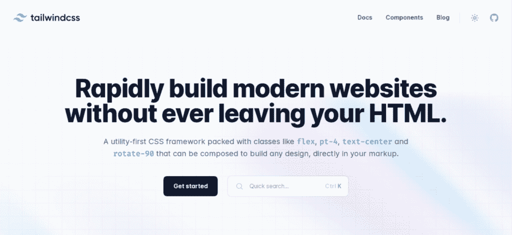
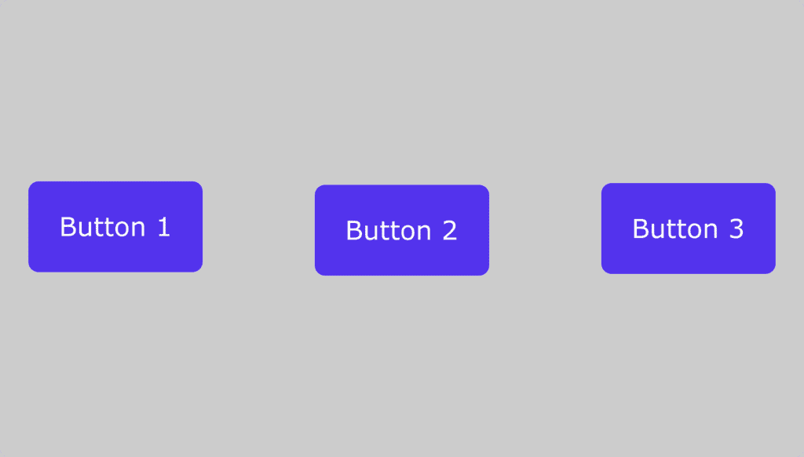
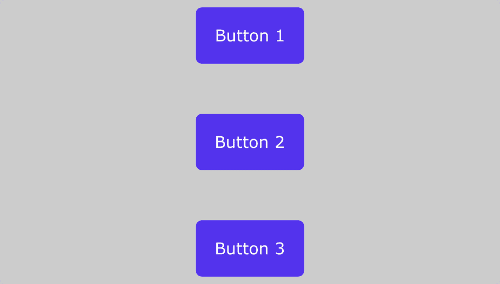
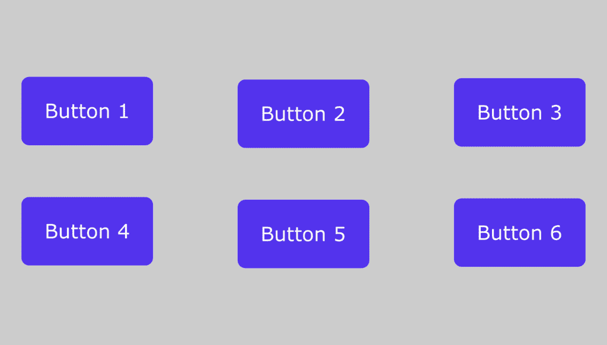
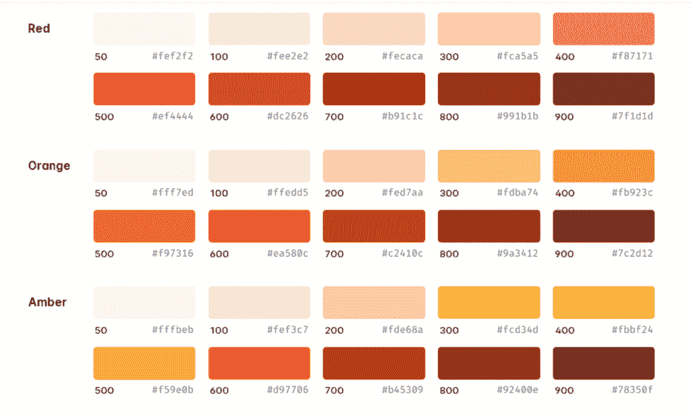

# 如何使用 Tailwind CSS 快速开发时尚网站

> 原文:# t0]https://kinta . com/blog/taiwind-CSS/

随着您作为开发人员的进步，您更有可能使用通过编写更少的代码来帮助您做更多事情的技术。像 Tailwind CSS 这样的可靠前端框架是实现这一目标的一种方式。

在本文中，我们将了解 Tailwind CSS——一个帮助构建和设计网页的 CSS 框架。我们将从解释如何在你的项目中安装和集成 Tailwind CSS 开始，看看一些实际的应用程序，以及你如何创建你的自定义风格和插件。

激动吗？我们开始吧！

 <kinsta-auto-toc heading="Table of Contents" exclude="last" list-style="arrow" selector="h2" count-number="-1">### 查看我们的视频指南[使用顺风 CSS 构建网站](https://www.youtube.com/watch?v=RoqrQ9lAqIo)

<kinsta-video src="https://www.youtube.com/watch?v=RoqrQ9lAqIo"></kinsta-video>

## 什么是顺风 CSS？



Tailwind CSS.


Tailwind CSS 是一个实用优先的 [CSS(层叠样式表)](https://kinsta.com/blog/wordpress-css/)框架，带有预定义的类，可以用来直接在标记中构建和设计网页。它让你以预定义类的形式在 HTML 中编写 CSS。

<link rel="stylesheet" href="https://kinsta.com/wp-content/themes/kinsta/dist/components/ctas/cta-mini.css?ver=2e932b8aba3918bfb818">


> 需要在这里大声喊出来。Kinsta 太神奇了，我用它做我的个人网站。支持是迅速和杰出的，他们的服务器是 WordPress 最快的。
> 
> <footer class="wp-block-kinsta-client-quote__footer">
> 
> 
> 
> <cite class="wp-block-kinsta-client-quote__cite">Phillip Stemann</cite></footer>

[View plans](https://kinsta.com/plans/)

我们将定义什么是框架，以及我们所说的“实用优先的 CSS”是什么意思，以帮助你更好地理解什么是顺风 CSS。

## 什么是框架？

作为一个通用的编程术语，[框架](https://kinsta.com/blog/javascript-libraries/#what-are-javascript-frameworks)是一种工具，它提供了可重用的现成组件，这些组件是根据现有工具的特性构建的。创建框架的总体目的是通过做更少的工作来提高开发速度。

既然我们已经确立了框架的含义，它应该可以帮助你理解 Tailwind CSS 是一个建立在 CSS 特性之上的工具。该框架的所有功能都来自于作为类组合的 CSS 样式。
<kinsta-advanced-cta language="en_US" type-int-post="114080" type-int-position="0"></kinsta-advanced-cta>

## 什么是实用优先的 CSS 框架？

当我们说实用优先的 CSS 时，我们指的是我们的标记(HTML) 中具有预定义功能的类[。这意味着您只需编写一个附加了预定义样式的类，这些样式将应用于元素。](https://kinsta.com/blog/html-best-practices/)

在使用普通 CSS(没有任何框架或库的 CSS)的情况下，您将首先为元素指定一个类名，然后将不同的属性和值附加到该类，这将依次对元素应用样式。

我们会给你看一个例子。这里，我们将创建一个圆角按钮和一个文本“点击我”这是按钮的外观:


Our button.


我们将首先使用普通 CSS 来完成这项工作，然后使用 Tailwind CSS 中可用的实用程序类。

### 使用普通 CSS

```
<button class="btn">Click me</button>
```

我们已经给了按钮标签类`btn`，它将使用外部样式表进行样式化。那就是:

```
.btn {
  background-color: #000;
  color: #fff;
  padding: 8px;
  border: none;
  border-radius: 4px;
}
```

### 带顺风 CSS

```
<button class="bg-black p-2 rounded">Click me</button>
```

这些都是实现与普通 CSS 示例相同的效果所必需的。因为我们使用的每个类名都已经有了一个预定义的样式，所以不需要创建外部样式表来编写样式。
<kinsta-advanced-cta language="en_US" type-int-post="114080" type-int-position="1"></kinsta-advanced-cta>

## 使用顺风 CSS 的先决条件

在使用 Tailwind CSS 之前，您应该考虑满足一些先决条件，以便毫无困难地使用框架的特性。以下是其中的几个例子:

*   对 HTML 及其结构和工作原理有很好的了解
*   CSS — [媒体查询](https://kinsta.com/blog/optimize-css/#use-media-query-rendering)、flexbox 和网格系统的坚实基础

### Tailwind CSS 可以用在哪里？

可以在前端 web 项目中使用 Tailwind CSS，包括类似 [React.js](https://kinsta.com/blog/javascript-libraries/#reactjs) 、 [Next.js](https://kinsta.com/knowledgebase/next-js/) 、 [Laravel](https://kinsta.com/knowledgebase/what-is-laravel/) 、Vite、Gatsby 等 JavaScript 框架。

### 顺风 CSS 的利与弊

以下是使用 Tailwind CSS 的一些优势:

1.  更快的开发过程
2.  帮助你练习你的 CSS，因为实用程序是相似的
3.  所有实用程序和组件都可以轻松定制
4.  生产文件的总体大小通常很小
5.  如果你已经知道 CSS，很容易学会
6.  良好的学习文档

使用顺风 CSS 的一些缺点包括:

1.  对于大型项目，您的标记可能看起来杂乱无章，因为所有样式都在 HTML 文件中。
2.  如果你不能很好地理解 CSS，学习起来并不容易。
3.  您被迫从头开始构建一切，包括您的输入元素。安装 Tailwind CSS 时，它会删除所有默认的 CSS 样式。
4.  如果你想尽量减少花在开发网站前端(T2)和主要关注后端(T4)逻辑(T5)上的时间，那么顺风 CSS 不是最好的选择。

### 何时使用顺风 CSS

Tailwind CSS 最适合用来通过编写更少的代码来加快开发过程。它附带了一个设计系统，有助于保持各种设计要求的一致性，如填充、间距等；有了这个，你就不必担心创建你的设计系统。

如果你想使用一个易于配置的框架，你也可以使用 Tailwind CSS，因为它不会强迫你一直以同样的方式使用组件(导航栏、按钮、[表单](https://kinsta.com/blog/wordpress-forms/)等等)；你可以选择你的组件应该是什么样子。但是如果你没有学习和练习过 CSS，就不要使用 Tailwind。

### Tailwind CSS 和其他 CSS 框架的异同

以下是一些相似之处:

1.  它们帮助您更快地完成工作。
2.  它们带有预定义的类。
3.  它们是建立在 CSS 规则之上的。
4.  有了 CSS 的工作知识，它们都很容易学习和使用。

现在让我们来看一些不同之处:

1.  Tailwind 不同于大多数框架，因为你必须创建你的组件。例如，Bootstrap 有导航栏、按钮等组件，但是使用 Tailwind，您必须自己构建所有这些组件。
2.  像 [Bootstrap](https://kinsta.com/blog/responsive-web-design/#bootstraps-responsive-breakpoints) 这样的一些框架不容易定制，所以你被迫使用他们的设计模式。在顺风中，你控制着一切。
3.  使用 Tailwind 需要对 CSS 有深入的了解。编写类名是不够的，因为您必须像编写普通 CSS 一样将它们组合起来，以达到相同的结果。在大多数其他框架中，您需要知道的是当您使用类名时，将构建什么组件。

 <kinsta-advanced-cta language="en_US" type-int-post="114080" type-int-position="2">## 如何开始使用 Tailwind CSS

在安装 Tailwind CSS 并将其集成到项目中之前，请确保:

1.  您已经在您的计算机上安装了 [Node.js，以便使用终端中的](https://kinsta.com/blog/how-to-install-node-js/)[节点包管理器(npm)](https://kinsta.com/knowledgebase/what-is-node-js/#what-is-npm) 。
2.  您的项目已经设置完毕，文件也已创建。

这是我们目前的项目结构:

```
-Tailwind-tutorial
    -public
        -index.html
        -styles.css
    -src
        -styles.css
```

接下来，为您的项目启动一个终端并运行以下命令:

```
 npm install -D tailwindcss
```

上面的命令将把 Tailwind CSS 框架作为一个依赖项安装。接下来，通过运行以下命令生成 tailwind.config.js 文件:

```
 npm install -D tailwindcss
```

创建时，tailwind.config.js 文件将为空，因此我们必须添加几行代码:

```
module.exports = {
  content: ["./src/**/*.{html,js}", "./public/*.html"],
  theme: {
    extend: {},
  },
  plugins: [],
};
```

内容数组中提供的文件路径将使 Tailwind 能够在构建期间清除/移除任何未使用的样式。

 ## 注册订阅时事通讯


### 想知道我们是怎么让流量增长超过 1000%的吗？

加入 20，000 多名获得我们每周时事通讯和内部消息的人的行列吧！

[Subscribe Now](#newsletter)

接下来要做的是将“@tailwind”指令添加到您的 CSS 文件中的 **src** 文件夹中——这是 tailwind 为您生成所有预定义实用程序样式的地方:

```
@tailwind base;
@tailwind components;
@tailwind utilities;
```

最后要做的是通过在终端中运行以下命令来启动构建过程:

```
 npx tailwindcss -i ./src/styles.css -o ./public/styles.css --watch
```

在上面的代码中，我们告诉 Tailwind，我们的输入文件是 src 文件夹中的样式表，我们使用的任何样式都必须构建到 public 文件夹中的输出文件中。允许 Tailwind 监视你的文件的自动构建过程的变化；省略它意味着每次我们想要构建代码并看到想要的输出时，我们都必须运行那个脚本。

[Want to do more while writing less code? 👀 A solid frontend framework is one way to accomplish that. Start with Tailwind CSS 👨‍💻Click to Tweet](https://twitter.com/intent/tweet?url=https%3A%2F%2Fkinsta.com%2Fblog%2Ftailwind-css%2F&via=kinsta&text=Want+to+do+more+while+writing+less+code%3F+%F0%9F%91%80+A+solid+frontend+framework+is+one+way+to+accomplish+that.+Start+with+Tailwind+CSS+%F0%9F%91%A8%E2%80%8D%F0%9F%92%BB&hashtags=CSS%2CWebDev)

### 使用顺风 CSS

现在我们已经为我们的项目安装并设置了 Tailwind CSS，让我们看一些例子来充分理解它的应用。

#### Flexbox 示例

要在 Tailwind CSS 中使用 [flex](https://kinsta.com/blog/responsive-web-design/) ，需要添加一个 flex 类，然后添加 flex 项的方向:

```
 <div class="flex flex-row">
      <button> Button 1 </button>
      <button> Button 2 </button>
      <button> Button 3 </button>
    </div>
```



Our three purple buttons.


使用`flex-row-reverse`将颠倒按钮出现的顺序。

将它们一层一层堆叠起来。这里有一个例子:

```
 <div class="flex flex-col">
      <button> Button 1 </button>
      <button> Button 2 </button>
      <button> Button 3 </button>
    </div>
```



Our three purple buttons.


就像前面的例子一样， **`flex-col-reverse`** 颠倒了顺序。

#### 网格示例

当在网格系统中指定列和行时，我们采用不同的方法，通过传递一个数字来确定元素将如何占用可用空间:

Struggling with downtime and WordPress problems? Kinsta is the hosting solution designed to save you time! [Check out our features](https://kinsta.com/features/)

```
<div class="grid grid-cols-3">
      <button> Button 1 </button>
      <button> Button 2 </button>
      <button> Button 3 </button>
      <button> Button 4 </button>
      <button> Button 5 </button>
      <button> Button 6 </button>
    </div>
```



Our six purple buttons.


#### 颜色；色彩；色调

顺风有很多预定义的颜色。每种颜色都有一组不同的变化，最亮的变化是 50，最暗的变化是 900。

这里有一张多种颜色的图片和它们的 HTML 十六进制代码来说明这一点



Customizing colors from Tailwind’s default palette. ([Image source)](https://tailwindcss.com/docs/customizing-colors#default-color-palette)


我们将给出一个例子，说明如何使用上面的红色为按钮元素提供背景色:

```
<button class="bg-red-50">Click me</button>
<button class="bg-red-100">Click me</button>
<button class="bg-red-200">Click me</button>
<button class="bg-red-300">Click me</button>
<button class="bg-red-400">Click me</button>
<button class="bg-red-500">Click me</button>
<button class="bg-red-600">Click me</button>
<button class="bg-red-700">Click me</button>
<button class="bg-red-800">Click me</button>
<button class="bg-red-900">Click me</button>
```

这个语法对于 Tailwind 中的所有颜色都是一样的，除了黑色和白色，它们的写法是一样的，只是没有使用数字:`bg-black`和`bg-white`。

要添加文本颜色，可以使用类`text-{color}`:

```
<p class="text-yellow-600">Hello World</p>
```

#### 填料

Tailwind 已经有了一个设计系统，可以帮助你在设计中保持一致的比例。您只需要知道应用每个实用程序的语法。

以下是为元素添加填充的实用程序:

*   `p`表示整个元素的填充。
*   `py`表示顶部填充和底部填充。
*   `px`表示左填充和右填充。
*   `pt`表示垫顶。
*   `pr`表示右填充。
*   `pb`表示底部填充。
*   `pl`表示左填充

要将它们应用到您的元素中，您必须使用 Tailwind 提供的适当数字——有点类似于上一节中表示颜色变化的数字。我们的意思是:

```
<button class="p-0">Click me</button>
<button class="pt-1">Click me</button>
<button class="pr-2">Click me</button>
<button class="pb-3">Click me</button>
<button class="pl-4">Click me</button>
```

#### 边缘

填充和边距的预定义实用程序非常相似。你必须用一个`m`代替`p`:

*   `m`
*   `my`
*   `mx`
*   `mt`
*   `mr`
*   `mb`
*   `ml`

## 如何创建一个顺风 CSS 插件

尽管 Tailwind CSS 已经为您构建了大量的实用程序和设计系统，但您仍有可能希望添加特定的功能来扩展 Tailwind 的用途。Tailwind CSS 允许我们通过创建一个插件来做到这一点。

让我们通过创建一个添加水绿色的插件和一个在 X 轴上将元素旋转 150°的旋转工具来动手做。我们将使用一点点 [JavaScript](https://kinsta.com/knowledgebase/what-is-javascript/) 在 **tailwind.config.js** 文件中创建这些实用程序。

```
const plugin = require("tailwindcss/plugin");

module.exports = {
  content: ["./src/**/*.{html,js}", "./public/*.html"],
  theme: {
    extend: {},
  },
  plugins: [
    plugin(function ({ addUtilities }) {
      const myUtilities = {
        ".bg-aqua": { background: "aqua" },
        ".rotate-150deg": {
          transform: "rotateX(150deg)",
        },
      };
      addUtilities(myUtilities);
    }),
  ],

};
```

现在，让我们来分析一下。我们做的第一件事是导入 Tailwind 的插件函数:

```
const plugin = require("tailwindcss/plugin");
```

然后我们继续在插件数组中创建插件:

```
 plugins: [
    plugin(function ({ addUtilities }) {
      const newUtilities = {
        ".bg-aqua": { background: "aqua" },
        ".rotate-150deg": {
          transform: "rotateX(150deg)",
        },
      };
      addUtilities(newUtilities);
    }),
  ],
```

制作插件后，您可能需要重新运行构建脚本。

现在插件已经准备好了，我们可以测试它们了:

```
<button class="bg-aqua rotate-150deg">Click me</button>
```

如果你做的一切都是正确的，你应该有一个浅绿色的按钮，文本在 X 轴上旋转了 150 度。

[Your secret weapon for building and designing web pages? 👀 Tailwind CSS 😌Click to Tweet](https://twitter.com/intent/tweet?url=https%3A%2F%2Fkinsta.com%2Fblog%2Ftailwind-css%2F&via=kinsta&text=Your+secret+weapon+for+building+and+designing+web+pages%3F+%F0%9F%91%80+Tailwind+CSS+%F0%9F%98%8C&hashtags=CSS%2CWebDev) <kinsta-advanced-cta language="en_US" type-int-post="114080" type-int-position="3">## 摘要

当提到加速你的工作流程时，框架是一个无价的选择。它们可以帮助您构建美观、专业的网页，同时保持设计的一致性。Tailwind CSS 提供了许多实用的 CSS 类来帮助[将你的 web 设计和开发提升到下一个层次](https://kinsta.com/blog/web-design-best-practices/)。

这篇文章告诉我们什么是 Tailwind CSS，是什么让它成为一个框架。然后，我们查看了安装过程，并看到了一些示例，展示了如何创建自定义插件来扩展现有功能。

如果你已经了解了这一点，那么你现在已经对顺风的工作原理有了一个基本而坚实的理解。为了更好地使用这样一个实用优先的框架，如果你还没有一个坚实的基础，你必须坚持练习并增加你的 CSS 知识。

过去你使用过 Tailwind CSS 或其他 CSS 框架吗？在评论区分享你的想法吧！

* * *

让你所有的[应用程序](https://kinsta.com/application-hosting/)、[数据库](https://kinsta.com/database-hosting/)和 [WordPress 网站](https://kinsta.com/wordpress-hosting/)在线并在一个屋檐下。我们功能丰富的高性能云平台包括:

*   在 MyKinsta 仪表盘中轻松设置和管理
*   24/7 专家支持
*   最好的谷歌云平台硬件和网络，由 Kubernetes 提供最大的可扩展性
*   面向速度和安全性的企业级 Cloudflare 集成
*   全球受众覆盖全球多达 35 个数据中心和 275 多个 pop

在第一个月使用托管的[应用程序或托管](https://kinsta.com/application-hosting/)的[数据库，您可以享受 20 美元的优惠，亲自测试一下。探索我们的](https://kinsta.com/database-hosting/)[计划](https://kinsta.com/plans/)或[与销售人员交谈](https://kinsta.com/contact-us/)以找到最适合您的方式。</kinsta-advanced-cta></kinsta-advanced-cta></kinsta-auto-toc>