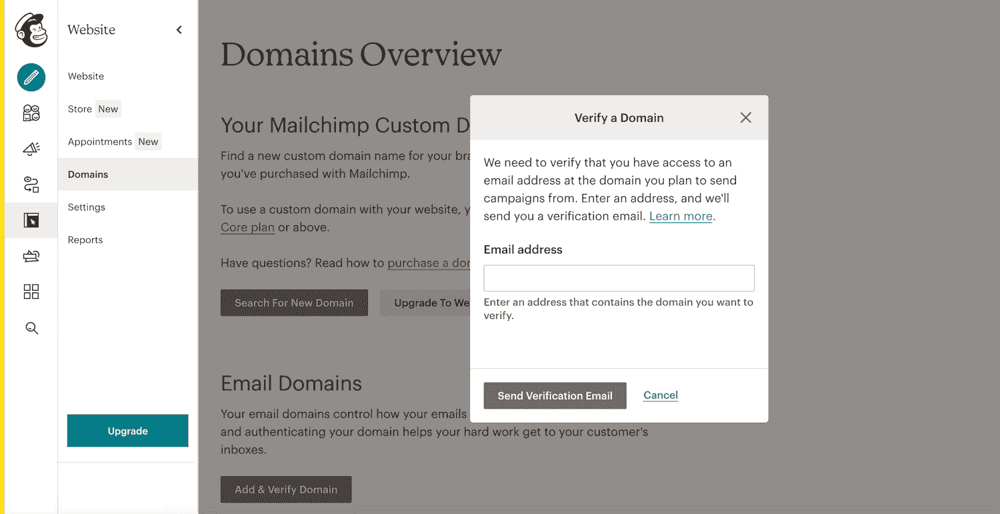
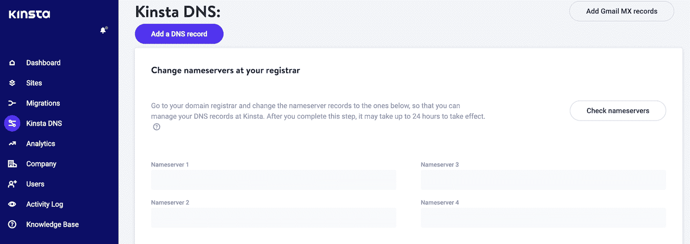
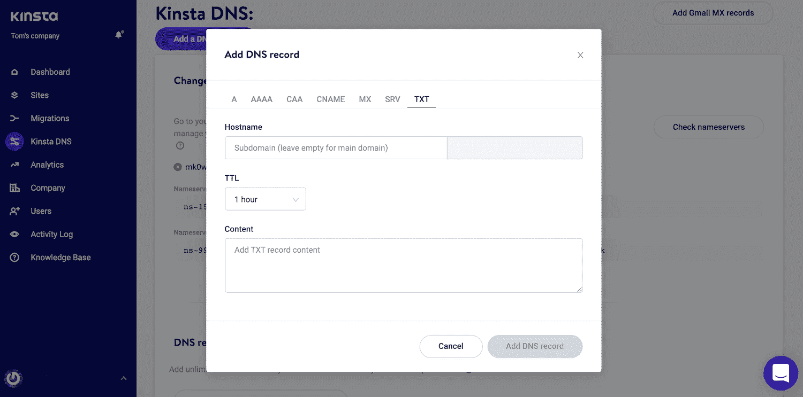
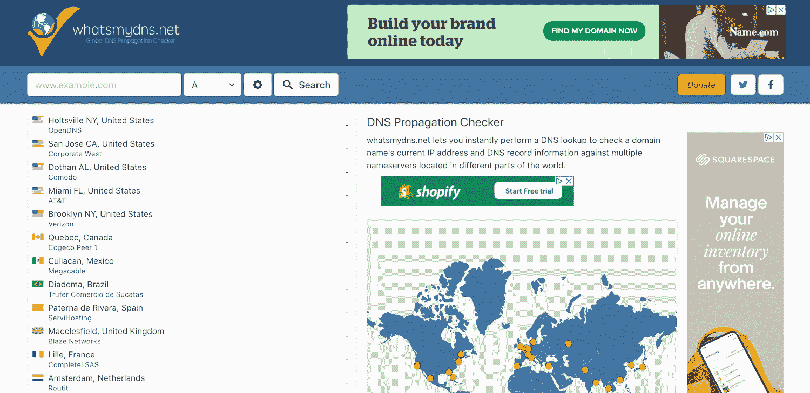
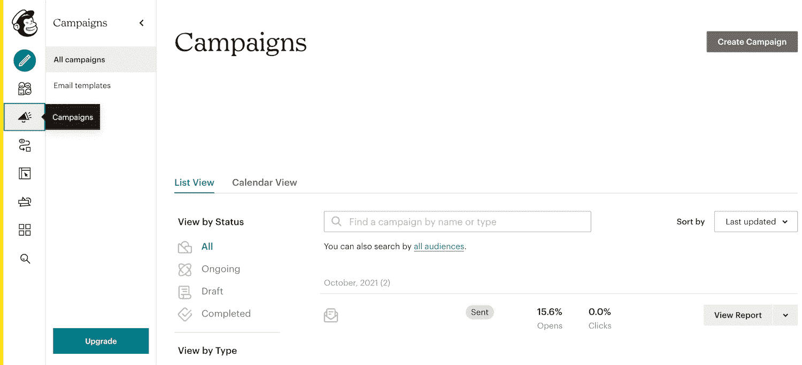
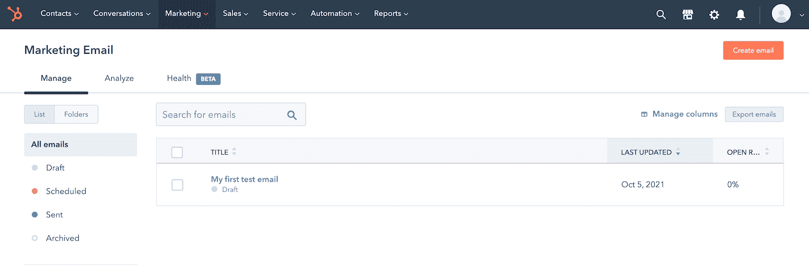

# 电子邮件认证——不要让你的电子邮件变成垃圾邮件

> 原文:[https://kinsta.com/blog/email-authentication/](https://kinsta.com/blog/email-authentication/)

作为一名营销人员，你可能会花几个小时甚至几天的时间来构思一封完美的电子邮件。然而，如果你的信息最终出现在垃圾邮件文件夹中，那么你最近的广告活动几乎肯定会泡汤。

幸运的是，有一种方法可以避开可怕的垃圾邮件文件夹黑洞。通过实施电子邮件认证，您可以向[互联网服务提供商(ISP)](https://kinsta.com/knowledgebase/what-is-isp/)证明您的营销电子邮件是合法的，应该在收件人的收件箱中占有一席之地。

这篇文章将讨论什么是电子邮件认证，为什么它是必要的，以及它是如何工作的。然后，我们将向您展示如何在三个最流行的电子邮件营销工具中实现它。

我们开始吧！

## 什么是电子邮件身份验证(及其工作原理)

没人喜欢垃圾邮件。ISP 一直在努力减少我们收件箱中收到的垃圾邮件数量。他们通过检查电子邮件的来源并验证它是来自合法的发件人还是潜在的垃圾邮件发送者来做到这一点。

这就是电子邮件认证的用武之地。它是一组方法，接收服务器可以使用这些方法来验证消息不是伪造的。

作为该检查的一部分，服务器将验证该消息是否来自在 **From** 字段中列出的人。通过这种方式，电子邮件身份验证可以防止电子邮件看似来自合法域，但却是由恶意第三方发送的欺骗和网络钓鱼欺诈。


> 需要在这里大声喊出来。Kinsta 太神奇了，我用它做我的个人网站。支持是迅速和杰出的，他们的服务器是 WordPress 最快的。
> 
> <footer class="wp-block-kinsta-client-quote__footer">
> 
> 
> 
> <cite class="wp-block-kinsta-client-quote__cite">Phillip Stemann</cite></footer>

[View plans](https://kinsta.com/plans/)

收件人服务器还将确定电子邮件在传输过程中是否被更改。这可以保护您的联系人免受[中间人攻击](https://www.internetsociety.org/resources/doc/2020/fact-sheet-machine-in-the-middle-attacks/)。

有多种方法可以实现电子邮件身份验证。每种方法都有自己的设置过程，并在身份验证方面有自己独特的见解。但是，您通常会建立规则来验证从您的域发送的电子邮件。然后，您将配置您的服务器和电子邮件基础设施来实施这些规则，然后在您的[域名系统(DNS)](https://kinsta.com/knowledgebase/what-is-dns/) 记录中为每个发送域发布这些规则。

接收电子邮件服务器在验证传入电子邮件时可以参考这些规则。如果您的邮件看起来是合法的，服务器会将它发送到收件人的收件箱。但是，如果您的邮件未通过此检查，它可能会被拒绝、隔离或直接发送到垃圾邮件。

### 为什么电子邮件身份验证很重要

对于收件人来说，电子邮件身份验证有一个明确的目的。它有助于保护个人免受垃圾邮件、网络钓鱼诈骗和其他恶意电子邮件的侵害。

没有认证，第三方可以很容易地改变电子邮件的来源，以绕过垃圾邮件过滤器。他们甚至可能复制你独特的品牌来欺骗你的客户，让他们相信这是合法的交流。

任何冒充您企业的攻击都是对客户信任的巨大威胁。因此，电子邮件认证是保护您的声誉和留住您的受众的重要工具。

认证增加了接收服务器信任你的邮件的机会。相比之下，如果你的邮件似乎来自未知或意想不到的域，它们很有可能会出现在[垃圾邮件文件夹](https://kinsta.com/blog/why-are-my-emails-going-to-spam/)中。

糟糕的[电子邮件投递率](https://kinsta.com/blog/email-deliverability-manager/)几乎不可避免地转化为你的[内容营销](https://kinsta.com/learn/content-marketing/)的糟糕投资回报率(ROI)。通过实施电子邮件认证，您应该会注意到对[您的电子邮件转换率](https://kinsta.com/blog/email-marketing-statistics/)的积极影响。

如今，许多企业使用第三方平台发送电子邮件，如 [Mailchimp、Constant Contact](https://kinsta.com/blog/constant-contact-vs-mailchimp/) 或[其他替代工具](https://kinsta.com/blog/mailchimp-alternatives/)。您可以使用这些平台创建自动化的营销活动并进行细分。


Mailchimp。


通过验证您的域和电子邮件，这些平台可以从您网站的域中代表您发送消息。例如，Mailchimp 将删除默认认证信息(通过**mcsv.net**或**代表 mcsv.net**)，该信息出现在你的活动的 **From** 字段旁边。这提高了你的品牌知名度，并可能鼓励你的联系人打开你的电子邮件。

你可能担心给你的邮件添加大量复杂的内容。然而，大多数认证信息是在消息头中传输的，所以它是不可见的。这意味着认证不应该影响你的电子邮件内容的[质量。
T3】](https://kinsta.com/blog/email-marketing-best-practices/)

## 5 种主要的电子邮件身份验证方法

电子邮件身份验证需要发送和接收服务器进行协调和合作。幸运的是，电子邮件认证标准确保所有电子邮件客户端和提供商使用相同的语言。在向您展示如何实现身份验证之前，让我们先来看看这些底层标准。

### 1.域名密钥识别邮件(DKIM)

[domain keys Identified Mail(DKIM)](http://www.dkim.org/)提供一个与私钥配对的唯一公钥。这个 DKIM 签名是添加到消息中的报头，并通过加密进行保护。

这样，DKIM 可以验证电子邮件是否来自合法的发件人。DKIM 签名还可以防止黑客在电子邮件作为中间机器攻击的一部分传输时篡改电子邮件。

以下是 Mailchimp 用于身份验证的 DKIM 记录示例:

```
CNAME record: k1._domainkey.yourdomain.com
```

值(解析为):dkim.mcsv.net

同时，这里有一个使用 TXT 记录的带有 [MailerLite](https://kinsta.com/blog/mailchimp-alternatives/#3-mailerlite) 的 DKIM 记录的例子:

```
TXT Name: ml._domainkey.yourdomain.com
TXT Value: k=rsa; p=MIGfMA0GCSqGSIb3DQEBAQUAA4GNADCBiQKBgQDdgIGns7EFVltvAkNNdbXD9KYSzAUNQky8POXwH6
```

通常，DKIM 签名对于接收者是不可见的，因为验证是在服务器级别上执行的。这意味着[添加 DKIM 记录](https://kinsta.com/help/dns/#dkim)可以提高你的投递率，而不会影响你的电子邮件质量。

### 2.发件人策略框架(SPF)

[发件人政策框架(SPF)](http://www.open-spf.org/) 是一种认证标准，用于验证您作为电子邮件发件人的身份。该策略将发送邮件服务器的 IP 地址与授权从该域发送邮件的 IP 地址列表进行比较。 [SPF 记录](https://kinsta.com/knowledgebase/spf-record/)被添加到发送者的 DNS 中。

每当服务器收到电子邮件，您的 ISP 将使用 SPF 记录来[检查](https://kinsta.com/tools/what-is-my-ip/)发件人的 IP 地址。假设该值与 SPF 记录相匹配，电子邮件将会成功发送。

如果您不提供 SPF 鉴定，收件人服务器可能会拒绝您的邮件，因为它们来自未经验证的发件人地址。以下是 Mailchimp 用来执行电子邮件身份验证的 SPF TXT 记录的示例:

```
v=spf1 include:servers.mcsv.net ?all
```

世界上一些最大的公司使用 SFP，包括谷歌、康卡斯特、Live.com 和 Cox.net 的威瑞森。

### 3\. Sender ID

由微软开发的[发件人 ID](https://docs.microsoft.com/en-us/Exchange/antispam-and-antimalware/antispam-protection/sender-id?redirectedfrom=MSDN&view=exchserver-2019) 经常与 SPF 混为一谈。发件人 ID 和 SPF 都根据域的注册所有者检查发件人的 IP 地址。然而，他们的方法略有不同。

发件人 ID 使用[声称负责地址(PRA)算法](https://datatracker.ietf.org/doc/html/rfc4407.txt)来检查消息中可见的发件人地址。让我们看一个发件人 ID 记录的例子:

```
v=spf1 include:servers.mcsv.net ?all spf2.0/pra include:servers.mcsv.net ?all
```

发件人 ID 主要由 Hotmail 和 Windows Live Mail 使用，这两种邮件已不存在。由于没有被广泛采用，微软已经删除了官方的发件人 ID 网站。

虽然很容易认为发件人 ID 已经过时，但它仍然在一些解决方案中使用，尤其是内部部署的 Microsoft Exchange 服务器。一些互联网服务提供商如康卡斯特和美国电话电报公司也使用发件人 ID。

### 4.域消息认证报告和一致性(DMARC)

[域消息认证报告和一致性](https://dmarc.org/) (DMARC)是一项用于处理未通过 SPF 或 DKIM 认证的电子邮件的策略。这使您能够更好地控制您的电子邮件认证系统，并帮助保护收件人免受网络钓鱼和欺骗攻击。

使用 DMARC，您可以告诉接收电子邮件的服务器，当它收到似乎来自您的域但没有通过 SPF 或 DKIM 鉴定要求的邮件时，它应该如何反应。下面是一个使用 TXT 记录的 DMARC 记录示例:

```
v=DMARC1;p=reject;pct=100;rua=mailto:yourdomain.com
```

您还可以使用 DMARC 向电子邮件服务器请求有关失败邮件和潜在域名欺骗的报告。这些报告可以帮助您识别与从您的域发送的邮件相关的任何身份验证问题和恶意活动。

### 5.用于信息识别的品牌指标(BIMI)

[用于消息识别的品牌标志(BIMI)](https://bimigroup.org/) 标准将您的品牌标志附加到您的认证电子邮件中。在幕后，BIMI 是一个文本记录存储在您的 DNS 记录，并包含您公司的标志位置。

电子邮件提供商将检索您的 BIMI 文本记录使用 DNS 查找每当它收到一封邮件。一旦提供商找到您的徽标，它会将此图形附加到收件人收件箱的电子邮件中。

这种简单的视觉验证有助于收件人发现您的邮件并验证其真实性。如果他们收到没有包含您的徽标的邮件，您的联系人会立即知道这是一封可疑邮件。

与我们探索的其他验证方法不同，身体质量指数是唯一一种为接收者提供视觉线索的方法。这也会导致更少的人错误地将你的邮件标记为垃圾邮件，这可以提高你的送达率。

典型的互联网用户每天会收到几十封甚至几百封电子邮件。通过在收件人的收件箱中显示您的徽标，BIMI 可以帮助您吸引收件人的注意力，并鼓励他们与您的电子邮件互动。

BIMI 也可以是营销你的品牌的一种方式，不管这个人是否选择与你的信息互动。即使此人从未打开您的电子邮件，他们仍会看到您的主题行、发件人地址和徽标。这是建立品牌认知度的好方法。

## 如何设置电子邮件认证

电子邮件身份验证听起来可能很复杂，但设置起来相对简单。即使您之前已经实施了身份验证，并且已经使用相同的[电子邮件营销工具](https://kinsta.com/blog/email-marketing-software/)有一段时间了，确保正确的记录在适当的位置并经过验证仍然是明智的。

如果您最近更换了 DNS 提供商，您将需要检查您的记录，因为这很容易影响您的电子邮件认证。我们的一个客户最近更换了 DNS 提供商，他们的[简讯](https://kinsta.com/blog/newsletter-examples/)被直接发送到垃圾邮件文件夹中，几乎一个月了，人们才意识到这一点。这是因为缺少身份验证记录。

## 注册订阅时事通讯


### 想知道我们是怎么让流量增长超过 1000%的吗？

加入 20，000 多名获得我们每周时事通讯和内部消息的人的行列吧！

[Subscribe Now](#newsletter)

由于这一失误，他们的打开率比上个月下降了 4.79%，点击率下降了 1.56%。这很好地说明了为什么你不能冒险把你的信息发送给垃圾邮件。

让我们确保这不会发生在你的邮件上。以下是如何为三个最流行的电子邮件平台设置认证。

### 1.Mailchimp

Mailchimp 是网络上最知名、最广泛使用的电子邮件营销工具之一。


默认情况下，Mailchimp 将 DKIM 认证应用于您的所有活动。然而，如果你使用自定义电子邮件域，设置自己的 DKIM 认证是明智的。Mailchimp 会在邮件标题中显示你的域名信息。这可以提高你的投递率，让你的沟通看起来更专业。它还与您的 DMARC 保持一致，使您能够使用 BIMI。

要验证您的域，您需要将 Mailchimp 中的信息复制/粘贴到您的域的 CNAME 记录中。如果您还没有，您还需要验证您的域。这使 Mailchimp 能够验证您是否有权从此地址发送电子邮件。

要验证您的域名，[请登录您的 Mailchimp 帐户](https://login.mailchimp.com/)。然后选择屏幕左侧出现的**网络**按钮。


登录 Mailchimp，选择“Web”按钮。


接下来，导航到**域>添加&验证域**。出现提示时，输入您想要验证的域名的电子邮件地址，并点击**发送验证邮件**。

如果你还没有一个专业的[电子邮件地址和一个自定义域名](https://kinsta.com/blog/professional-email-address/)，我们推荐[谷歌工作空间](https://kinsta.com/blog/google-workspace/)。




在 Mailchimp 中验证你的域名。


Mailchimp 将提供 DKIM 和 SPF DNS 记录。要完成您的域认证，您需要向您的 DNS 提供商或[域注册商](https://kinsta.com/blog/best-domain-registrar/)添加这些。

让我们看看如何使用 [Kinsta 的高级 DNS](https://kinsta.com/blog/premium-dns/) 来实现这一点。首先，[登录你的 MyKinsta 仪表盘](https://my.kinsta.com/login)，选择 [Kinsta DNS](https://kinsta.com/help/dns/) 。


选择 Kinsta DNS。


找到您想要与您的电子邮件平台关联的域名，然后点击其附带的**管理**链接。在右上角，点击**添加一条 DNS 记录**:




点击【添加 DNS 记录】按钮。


对于 DKIM 认证方法，选择 **CNAME** 选项卡。现在，您可以使用 Mailchimp 提供的值添加 CNAME 记录。


选择 CNAME 标签页。


在**主机名**字段中，输入以下内容:`k1._domainkey`。请注意，大多数 DNS 管理工具会自动追加域名，所以请注意不要输入 Mailchimp 提供的整个值。

在**指向**字段中，输入以下内容:`dkim.mcsv.net`。然后点击**添加 DNS 记录**。

您将使用 SPF 身份验证方法的 Mailchimp 值添加一个 **TXT** 记录。这意味着再次点击**添加 DNS** 记录并选择 **TXT** 。

Struggling with downtime and WordPress problems? Kinsta is the hosting solution designed to save you time! [Check out our features](https://kinsta.com/features/)




选择 TXT。


您可以将**主机名**字段留空。在**内容**字段中，输入以下内容:`v=spf1 include:servers.mcsv.net ?all`。

接下来，点击**添加 DNS 记录**。切换回 Mailchimp 仪表板，选择**认证域**。DNS 记录的传播需要一段时间，因此您可能需要耐心等待。您可以使用 [whatsmydns](https://www.whatsmydns.net/) 查看您的记录状态。


【whatsmydns.net】T2 首页。


一旦这些记录传播，您的电子邮件和域名将得到认证。此时，我们建议您将列表中的地址更改为**，使其与您的域名相对应。这有助于避免混淆，导致您的邮件被错误地标记为垃圾邮件。**

### 2.经常接触

恒定联系是一个流行的电子邮件营销应用程序，提供了一个极好的替代 Mailchimp 的 T2。该工具拥有广泛的移动优化模板和直观的编辑工具。

发起活动后，您可以使用 Constant Contact 的内置分析和报告工具实时跟踪活动。


不断接触。


所有来自经常联系的邮件都已经 DKIM 签名，应该通过 SPF 检查。但是，该公司建议启用持续联系认证功能。这使您可以注册为一个经常联系邮件域的授权发件人。

持续的联系认证可以强化你的品牌，使你的信息被接收者识别。这可以最大限度地减少将您的邮件标记为垃圾邮件的人数。

登录[持续联系仪表板](https://login.constantcontact.com/login/)并选择**我的账户**激活该功能。在**我的个人资料**部分，导航至**活动电子邮件认证设置>启用持续联系认证**。

现在，您可以输入您想要验证的电子邮件地址，包括免费的网络邮件地址，如来自 Gmail 和 Outlook 的地址。输入您的地址后，点击**保存**。请注意，为帐户提供身份验证可能需要 24 小时，因此您可能需要等待。

每当您发送电子邮件时，ISP 都会在电子邮件中看到您的发件人邮件头地址。然后，它将检查您发布的认证记录，并确认您是一个合法的发件人。

请注意，**发件人标题地址**将对收件人可见，尽管其外观可能因电子邮件客户端而异。但是，您的**回复地址**值保持不变，因此任何回复都将直接发送到您的电子邮件地址，而不是恒定联系服务器。

### 3.轮毂点

由广受欢迎的[客户关系管理(CRM)](https://kinsta.com/blog/wordpress-crm/#1-hubspot) 、 [HubSpot 的电子邮件营销工具](https://kinsta.com/blog/mailchimp-alternatives/#1-hubspot-email-marketing)提供了创建专业广告所需的一切。设计完您的电子邮件后，HubSpot 提供了 [A/B 测试](https://kinsta.com/blog/wordpress-ab-testing-tools/)和分析，您可以使用它们来优化您的活动并交付最佳结果。

如果您想使用 DKIM 电子邮件认证从您的域发送邮件，您可以将您的电子邮件发送域连接到 HubSpot。第一步是在你的 HubSpot 账户中验证你的域名。在 HubSpot 仪表盘中，点击主导航栏中的**设置**图标。


点击 HubSpot 仪表盘中的“设置”。


接下来，导航到**网站>域名&网址>连接域名**。在下一个对话框中，选择**邮件发送**，然后点击**连接**。您现在将被定向到域连接屏幕。

出现提示时，输入您要用于从此域发送的所有电子邮件的电子邮件地址。然后，点击下一个的**。**

如果您没有看到任何域设置，您可能没有权限查看 HubSpot 门户的这一部分。要纠正这种情况，请联系您的超级管理员，他会授予您必要的权限。

现在您已经创建了 DKIM 签名，您可以将其连接到您的 DNS 记录。Kinsta 客户可以登录 MyKinsta 仪表板，并从左侧菜单中选择 **Kinsta DNS** 。然后你可以找到有问题的域名，点击其附带的**管理**链接。

在右上角，点击**添加一条 DNS** 记录。接下来，选择 **TXT** 选项卡。您现在可以输入 HubSpot 提供的所有信息来验证您的发送域。


## 监控您的电子邮件认证健康状况

您的电子邮件认证大部分时间将在后台运行，不需要任何日常维护。然而，身份验证可能意味着你最近的活动是产生极高的点击率(CTR)还是以垃圾邮件告终。

鉴于风险如此之高，明智的做法是监控你的电子邮件认证的健康状况。这意味着密切关注你的营销指标。

跳出率的峰值或参与度的突然下降可能表明您的电子邮件身份验证实施存在问题。幸运的是，我们在本文中讨论的所有电子邮件营销平台都有内置的分析功能。

如果您使用 Mailchimp，您可以查看有关您最近的电子邮件活动的详细信息。首先，选择**活动**图标。




选择 Mailchimp 中的“活动”按钮。


然后，请找到您想要检查的电子邮件，并选择其附带的**查看报告**按钮。Mailchimp 现在将显示该活动的所有信息，包括跳出率和打开率。


点击 Mailchimp 中的【查看报告】按钮。


如果您使用持续联系，您的仪表盘会有一个[专用的“报告”选项卡](https://knowledgebase.constantcontact.com/articles/KnowledgeBase/5562-reporting-for-an-email-campaign?lang=en_US)。在这里，您可以查看特定时间段内的分析结果。

这使您能够检查您的活动是否经历了参与度的突然变化或跳出率的令人担忧的飙升。如果您发现一个问题，您可以通过探索不同的日期范围来查明该问题发生的确切时间。

如果你是 HubSpot 的粉丝，你可以通过登录 HubSpot 的仪表板，从任何电子邮件中查看性能指标。在这里，导航到**营销>电子邮件**。




导航至 HubSpot 中的营销，然后发送电子邮件。


在随后的屏幕上选择您想要检查的电子邮件，然后按**查看详细信息**。这将打开 **Performance** 选项卡，您可以在其中获得该电子邮件约定的高级概述。

[Looking for a way to side-step the dreaded black hole that is the spam folder? 📧 This post has everything you need ✅ ByClick to Tweet](https://twitter.com/intent/tweet?url=https%3A%2F%2Fkinsta.com%2Fblog%2Femail-authentication%2F&via=kinsta&text=Looking+for+a+way+to+side-step+the+dreaded+black+hole+that+is+the+spam+folder%3F+%F0%9F%93%A7+This+post+has+everything+you+need+%E2%9C%85+By&hashtags=EmailMarketing%2CMarketingTips)

## 摘要

电子邮件营销是建立品牌知名度的好方法，可以让你的联系人在销售漏斗中更进一步。然而，如果你不执行电子邮件认证，你精心策划的活动[可能会进入收件人的垃圾邮件文件夹](https://kinsta.com/blog/why-are-my-emails-going-to-spam/)。

让我们快速回顾一下五种主要的电子邮件身份验证方法:

1.  **域名密钥识别邮件(DKIM)** :此方法将加密签名添加到您的营销邮件的标题中。
2.  **发件人政策框架(SPF)** :一种技术标准，使您能够发布用于发送营销电子邮件的所有域名的 DNS 记录。
3.  发件人 ID(Sender ID):由微软倡导，如今只有少数精选技术使用这一标准来检测电子欺骗。
4.  **域消息认证报告和一致性(DMARC)** :这告诉服务器如果接收到声称来自您的域，但未通过 SPF 或 DKIM 认证的消息，该如何响应。
5.  **用于消息识别的品牌标志(BIMI)** :这种独特的方法将您的徽标添加到收件人收件箱中经过验证的消息中。

关于实施电子邮件认证，您有什么问题吗？请在下面的评论区告诉我们！

* * *

让你所有的[应用程序](https://kinsta.com/application-hosting/)、[数据库](https://kinsta.com/database-hosting/)和 [WordPress 网站](https://kinsta.com/wordpress-hosting/)在线并在一个屋檐下。我们功能丰富的高性能云平台包括:

*   在 MyKinsta 仪表盘中轻松设置和管理
*   24/7 专家支持
*   最好的谷歌云平台硬件和网络，由 Kubernetes 提供最大的可扩展性
*   面向速度和安全性的企业级 Cloudflare 集成
*   全球受众覆盖全球多达 35 个数据中心和 275 多个 pop

在第一个月使用托管的[应用程序或托管](https://kinsta.com/application-hosting/)的[数据库，您可以享受 20 美元的优惠，亲自测试一下。探索我们的](https://kinsta.com/database-hosting/)[计划](https://kinsta.com/plans/)或[与销售人员交谈](https://kinsta.com/contact-us/)以找到最适合您的方式。

