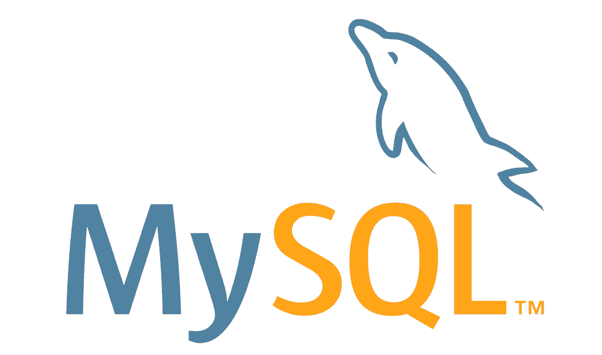
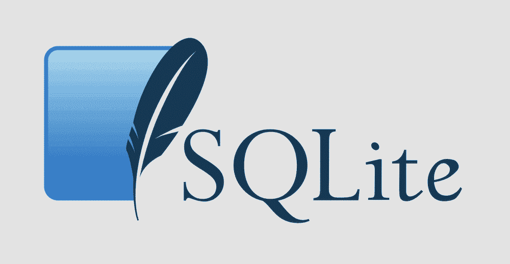
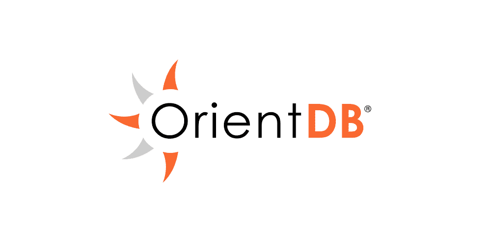
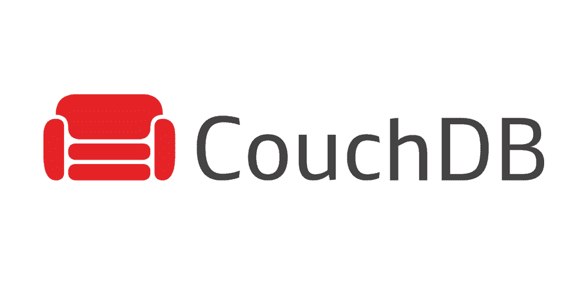

# 开源数据库软件中的佼佼者:十大精选

> 原文:[https://kinsta.com/blog/open-source-database/](https://kinsta.com/blog/open-source-database/)

现代的大多数应用程序和程序都需要存储数据的地方。对于 web 应用程序来说，数据库是一个至关重要的齿轮。

选择数据库时需要考虑的几个因素——一个主要方面是成本，但灵活性和托管提供商的支持也很重要。出于多种原因，开源数据库是您的最佳选择。

例如，开源数据库不会超出你的预算，也不会对你如何使用它有任何限制。像 WordPress 这样的内容管理系统一样，开源工具可以提供巨大的能力和功能。更好的是，一些最受欢迎(和支持)的数据库是开源解决方案。

让我们看看几个开源数据库软件，并总结出一些不同的“味道”。

 ### 查看我们的视频指南，了解[最佳开源数据库软件](https://www.youtube.com/watch?v=kKsNen0g1jA)


## 开源数据库软件介绍

数据库是应用程序的后端存储，例如，web 应用程序(这是我们将在本文中引用的主要应用程序类型)。数据库本身将位于您的服务器上，与其他后端元素一起，如您站点的核心文件、您使用的任何媒体和服务器配置文件。


一般来说，数据库是站点的一个端点。例如:

*   你网站的页面将使用 HTML 和 PHP 与服务器对话。
*   服务器将代表您访问数据库(一个无缝的过程)，拉或推数据，并将其返回到前端。
*   您的网站将根据数据库显示或更新其内容。

这是你的网站和服务器的一项基本技术。因此，您会希望尽可能地掌握数据库的灵活性和知识。

这就引出了您的第一个考虑:是选择开源数据库还是专有数据库。

关于系统的代码库和潜力，开源数据库将 100%提供给你。相比之下，一个完全封闭的专有解决方案不会提供同样的深度或灵活性，除非开发人员选择启用它。

一些数据库是在“资源可用”的基础上运行的，比如 [MongoDB](https://kinsta.com/knowledgebase/what-is-mongodb/) :


The MongoDB logo.


然而，对于一些开发人员来说，这是一个很好的中间地带。的确，有很多“ [NoSQL”数据库](https://www.mongodb.com/nosql-explained)的粉丝，但是这些粉丝在如何使用开源或闭源数据库方面仍然会遇到限制。另一方面，开源选项将更适合您的需求。

[Wondering which open source database is right for your projects? 🤔 See more in this guide ⬇️Click to Tweet](https://twitter.com/intent/tweet?url=https%3A%2F%2Fkinsta.com%2Fblog%2Fopen-source-database%2F&via=kinsta&text=Wondering+which+open+source+database+is+right+for+your+projects%3F+%F0%9F%A4%94+See+more+in+this+guide+%E2%AC%87%EF%B8%8F&hashtags=OpenSource%2CMySQL)

### 如何(以及在哪里)使用开源数据库

值得注意的是，许可证类型并不一定会限制您可以使用它的应用程序。尽管如此，开源数据库有一些不同的用例与许可非常吻合:

*   WordPress 的开源核心与开源数据库配合得很好，主要是因为没有限制。这意味着你可以创建一个强大的定制应用来满足你的需求，尤其是当你[使用 REST API](https://kinsta.com/blog/wordpress-rest-api/) 的时候。
*   **键值存储:**您会发现[键值存储](https://www.techopedia.com/definition/13645/key-value-pair-kvp)是一项资源密集型任务，有时需要专业开发人员的熟练技巧来优化。一个开放源代码的数据库解决方案将让开发者挖掘代码，并使这些调整达到完美。
*   **利基技术:**许多技术应用受益于其他开源工具，如数据库。[人工智能(AI)](https://kinsta.com/blog/chatbot/) 、图形和不同的利基可以与开源数据库一起工作，就像 WordPress 一样(没有限制)，并利用数据库本身的灵活性。
*   **数据科学:**数据科学是开源数据库工作良好的另一个领域。同样，这一领域的流行语言，如 Python 和 R，最适合 MySQL、MariaDB 和 MongoDB，但不太适合专有解决方案。
*   **数据存储:**开源数据库可能比私有数据库更安全(由于可见的代码库)，因此它也非常适合于注重隐私的数据存储。当您将数据库与其他注重隐私的解决方案相结合时，这一点会得到增强，从而形成一个非常安全的、可低成本扩展的设置。

贯穿所有这些用例的主题是，开源数据库提供的限制很少。因此，您可以利用数据库软件的强大功能，并根据您的需求进行调整。

这让我们明白了为什么使用开源数据库对你有好处。


## 为什么你想使用开源数据库

当然，数据库本身是任何 web 应用程序的重要组成部分。你会发现没有它也很难创造出有用的东西。然而，当选择开源数据库时，您可能看不到立竿见影的好处。

你会发现你使用开源数据库的原因和你选择像 WordPress 这样的[开源 CMS 是一样的。例如:](https://kinsta.com/blog/why-use-wordpress/)

*   您在数据库中保存的信息是您自己的，没有任何损害或限制。
*   你可以在数据库软件的基础上构建，就像 WordPress 一样。这为你的成就打开了几乎无限的可能性，并提供了令人兴奋的选择。
*   开源数据库是扩展和推动应用程序和业务的好方法，而不用担心许可或更高的购买成本。您可以专注于让数据库为您工作，而不是对抗许可。

在这一点上，您可能已经看到了开源数据库是如何超越专有甚至源代码可用的解决方案的有争议的赢家。考虑到这一点，让我们深入了解市场上的一些最佳选择。

## 开源数据库软件中的佼佼者:10 个例子

下面的列表包含了一些开源数据库，但并不详尽。将会有更多的选择，比我们在这里可以包括的更多，所以我们已经策划了我们的最佳选择。

我们的第一个条目可以说是开源数据库最突出的选择，所以让我们从这里开始。

### 1.关系型数据库

如果你花一分钟在数据库中查找应用程序，MySQL 会在许多列表中名列前茅。这里也是一样，因为很长一段时间以来，这是许多开发人员的默认选项。



The MySQL logo.


Oracle 将其开发为一个关系数据库管理系统(RDMS)。这意味着您将使用表来存储数据，并且那些存储的数据类型可以以某种方式链接起来。

MySQL 的核心是采用一个旧的(但流行的)专有数据库系统，保持大部分兼容性，并使结果开源。因为开发人员可以过渡到它而无需重新学习 MySQL，它已经成为应用程序开发的[主要部分几十年了。](https://kinsta.com/knowledgebase/mysql-community-server/)

许多数据库中的许多功能都是 MySQL 的镜像或衍生。例如，您将使用结构化查询语言(SQL)来处理数据库关系，并使用几乎任何编程语言来连接数据库本身。

使用 MySQL 不需要了解太多关于 SQL 的知识，学习曲线也不太陡。您可以从命令行使用数据库，MySQL 与您将使用的几乎所有操作系统(OS)都有很高的兼容性。

总的来说，MySQL 非常适合大多数用例，因为它是一个可靠、快速、可靠的万能工具。由于这一点以及多年来它相对于其他解决方案的定位，大多数主机将支持 MySQL 数据库。但是，也有一些缺点需要考虑:

*   虽然 MySQL 在大多数情况下是高效的，但对于大型数据库来说，它可能会比较慢。
*   此外，与其他(甚至是专有的)解决方案相比，它的调试工具还可以改进。
*   存在数据损坏的情况，尽管这不是一个严重的问题。

很难说出太多的缺点，因为总的来说，MySQL 是一个适合大多数应用程序的坚实可靠的数据库。然而，有些用户会考虑其他产品，原因我们将在下面讨论。

### 2.MariaDB

尽管 Oracle 目前拥有 MySQL，并且仍然以开源解决方案的形式提供它，但它并不像开源倡导者那样享有盛誉。收购发生时，其中一位创始人将 MySQL 拆分为 MariaDB:


The MariaDB logo.


这是我们在 Kinsta 支持的开源数据库，也是 DevKinsta 中的[选项:](https://kinsta.com/devkinsta/)


Choosing MariaDB within DevKinsta.


因为是 MySQL 的一个分支，[兼容性几乎是 1:1](https://kinsta.com/blog/mariadb-vs-mysql/) 。MariaDB 的开发人员也喜欢保持兼容性接近它的分叉。因此，您可以使用 MariaDB 作为 MySQL 的“替代”,几乎没有任何后果，并且毫不费力地迁移到 MySQL。

尽管 MariaDB 是 MySQL 的一个分支，但它仍在寻找自己的道路。您应该知道开源数据库的一些独特特性:

*   MariaDB 使用 Aria 存储引擎来处理复杂的 SQL 查询。这使得数据库的速度超过了 MySQL。
*   您可以对表列使用动态行，这有助于提高灵活性和适应性。
*   有一些你在 MySQL 中找不到的针对特定用例的专用存储引擎。例如，您可以实现分布式存储、分布式事务等等。

由于兼容性很好，你可以在任何使用 MySQL 的地方使用 MariaDB，而不会有太大的损失。因此，你可以把它看作是“所有应用的一切”，就像它的分叉一样。然而，值得注意的是，兼容性只是一种方式，所以你需要选择一方:MySQL 或 MariaDB。这个开源数据库需要忠诚！

### 3.一种数据库系统

如果你只知道 PHP 和 WordPress，你可能对 [PostgreSQL](https://kinsta.com/knowledgebase/what-is-postgresql/) 了解不多。然而，它是一个关系型的开源数据库，许多开发人员在数据科学、图形和人工智能行业使用它，因为它非常适合于 [Python 和 Ruby 应用](https://kinsta.com/blog/scripting-languages/)(尽管您也可以使用 PHP)。


The PostgreSQL logo.


[与 MySQL 强大的 denim](https://kinsta.com/blog/postgresql-vs-mysql/) 相比，PostgreSQL 更像是精美的丝绸，因为它是一个深思熟虑的开源数据库，提供了许多杀手级功能:

*   可以实现异步[复制](https://kinsta.com/blog/postgresql-replication/)。
*   有对 JSON 风格的文档存储、键值存储和 XML 的原生支持。
*   您可以对数据库进行全文搜索。
*   一些内置的数据类型对于某些应用程序来说是无价的，比如地理定位、数组和范围。

尽管如此，您还是要小心处理 PostgreSQL，因为它不像其他用于大量读取应用程序的解决方案那样熟练。首先，如果您必须定期从现有数据创建报告，PostgreSQLs 文档存储可能会受到如此大的数据集的影响。

 ## 注册订阅时事通讯


### 想知道我们是怎么让流量增长超过 1000%的吗？

加入 20，000 多名获得我们每周时事通讯和内部消息的人的行列吧！

[Subscribe Now](#newsletter)

然而，如果您希望在混合基础上包含 NoSQL 风格的功能，那么这种相同的文档存储模型是理想的。对键值和文档存储的本机支持是一个省时器，可以让您快速地进行项目。

### 4.雷迪斯

Redis 不同于这个列表中的其他开源数据库，因为几乎没有相同的应用程序使用它。


The Redis logo.


它是一个数据库，使您能够将数据结构化为键值对。您会发现这类似于 PHP 中的关联数组或 Python 中的字典——这是一种链接数据以便稍后快速引用的方式:

```
<?php
$type = array("Charmander"=>"fiery", "Squirtle"=>"soggy", "Snorlax"=>"sleepy");
echo "Snorlax is " . $type['Snorlax'] . " all the time.";
?>
```

“速度”在这里是至关重要的术语，因为 Redis 是缓存的首选[数据库。这有几个原因:](https://kinsta.com/blog/what-is-cache/)

*   Redis 是一个“内存”存储解决方案——完全在 RAM 中——这意味着读写速度快得惊人。
*   您可以在几分钟内学习 Redis 的基础知识，并立即开始存储对象。
*   您可以为字符串设置到期时间，这是缓存的一个重要组成部分。
*   一个新颖的[发布/订阅特性](https://blog.containerize.com/2021/03/05/introduction-to-redis-pubsub-and-how-does-it-work/)使用 Redis 作为发送方和接收方之间的消息缓冲。不是这些端点进行直接连接，而是发送方将发送到一个专用的 Redis“通道”，然后该通道将它移动到接收方(反之亦然)。

所有这些都意味着 Redis 非常适合分布式数据和实现缓存。对于更复杂的应用程序来说，它不是最好的，但这不在它的职权范围之内。相反，你可以将它与另一个数据库(如 MariaDB)一起使用，让它支持你的应用程序的其余部分。

### 5.SQLite

对于这个关系型开源数据库，关键卖点的线索就在名称中:SQLite 是一个小型的轻量级库，它提供了一个数据库引擎。



The SQLite logo.


你经常会在智能手机等较小的设备中找到它，因为它很轻。事实上，整个数据库由一个`.sqlite`文件组成，它可以存在于系统的任何地方。您不需要安装任何服务器软件或连接到其他服务来使用 SQLite。

尽管数据库是如此轻量级的工具，但您仍然可以拥有数百 TB 的数据库大小，最大行大小为千兆字节。即使文件这么大，SQLite 仍然很快。

您会发现使用 SQLite 作为数据库有很多很好的用例:

*   简单应用程序的开发人员会喜欢 SQLite，因为它是一个严肃、直接的解决方案。
*   对于没有(或不可能有)系统管理员或开发人员在场的物联网(IoT)应用程序来说，这非常好。
*   SQLite 可能适合低流量网站，因为这些需求将是直截了当的。
*   虽然我们在这里主要讨论 web 应用程序，但是桌面应用程序也可以使用 SQLite 来保持高性能。

考虑到 SQLite 的结构，它不太适合大流量的网站，因为性能不会达到最佳。更重要的是，这个轻量级开源数据库缺少一些可能很重要的特性。例如，不能用 MySQL 或 MariaDB 这样的客户端查询数据库。

### 6.Neo4j

这个列表中的大多数开源数据库都是关系型的。改变一下，Neo4j 是基于图形的。

涡轮增压您的网站，享受我们的资深 WordPress 团队的 24/7 支持。我们的谷歌云驱动的基础设施侧重于可伸缩性、性能和安全性。[查看我们的计划](https://kinsta.com/plans/?in-article-cta)


The Neo4j logo.


这对于你会发现的一些更现代的网络应用程序来说太棒了。Neo4j 几乎是实现基于图形的数据库的唯一解决方案(到目前为止)。

数据通常不会以有序的表格、行和列的形式出现。我们通过关系数据库来安排。然而，很难使用 SQL 为现代 web 应用程序(如社交网络)复制有机连接。它是非结构化的，与 SQL 完全相反。

正因为如此，Neo4j 是一个独一无二的数据库，几乎可以处理任何应用程序，它提供了许多好处:

*   将表格数据转换成图形并支持结果分析是非常棒的。
*   Neo4j 也是事务性应用的明星。
*   有一种专用的查询语言(Cypher)来帮助您获取数据并以最佳方式使用它。

但是，由于数据库的结构，性能可能是一个问题。例如，与其他解决方案的范围索引不同，您只能使用“散列索引”来对数据进行排序。这可能会消耗您的系统资源并影响性能。

但是，如果您想要实现基于图形的数据库，Neo4j 可以满足您的需求。这是一个顶级的开源数据库，只要你按照预期的方式使用它。

### 7.OrientDB

我们说过“几乎”没有其他基于图形的开源数据库，但这为其他人留下了一些空间。OrientDB 就是其中之一。尽管多年来它的所有权发生了变化，但它仍然是为您的 web 应用程序实现基于图形的数据库的一种很好的方式。



The OrientDB logo.


OrientDB 可以处理几种模型，比如对象、图形、文档和键值。即便如此，它仍被归类为 NoSQL 解决方案，并且与记录有直接联系，因此它的核心是一个基于图形的数据库。

OrientDB 的主要好处是它的灵活性和可伸缩性。与 Neo4j 非常相似，它速度很快，但在性能方面存在一些问题。然而，OrientDB 更加灵活，并且正在开发其他索引机制来帮助用户。

您会发现 OrientDB 在相同的应用范围内与 Neo4j 一样强大，例如，社交网络、银行和金融、交通管理等。

### 8.CouchDB

Apache——服务器类型——也开发 CouchDB。很像 SQLite，这是一个小型的、不引人注目的开源数据库，是无数项目的工厂解决方案。



The CouchDB website.


这个开源数据库的重点是可靠性。这个想法是数据位于多个分布式节点的集群中。这些节点中的一些将离线，它们将“保存”数据，直到它们再次在线。然后，所有数据都被传送到集群，并分发到网络中的其他节点。

为了进一步解释，设想一个包含移动设备上生成的数据的数据库。不能保证该设备将访问在线连接，因此数据将保留在那里，直到其“节点”再次在线。

因此，CouchDB 是一个久经沙场的可靠数据库，如果您需要离线容错，它应该是一个重要的考虑因素。

也就是说，CouchDB 最显著的优点也是缺点。它必须存储数据的冗余副本，这将增大文件大小。更重要的是，你会发现写的速度并不快，所以它不适合需要快速响应的用例。

然而，作为一个为可靠性而设计的离线优先开源数据库，CouchDB 是符合要求的应用程序的领跑者。

### 9.FirebirdSQL

FirebirdSQL 不像列表中的其他数据库那样出名，但是它可以在特定的场景中扮演重要的角色。


The FirebirdSQL logo.


您会发现 FirebirdSQL 具有几乎所有与其他基于 SQL 的数据库相同的特性和功能，并且它提供了与 MySQL 的完全兼容性。这可能是你找不到许多数据库支持者的原因——与其他平台有太多相似之处。但是，它可以在几个方面独立存在:

*   它占地面积小，在空间有限的地方非常方便。
*   您可以使用 FirebirdSQL 作为需要伸缩的桌面应用程序(如 LibreOffice)的数据库。
*   数据库是跨平台的，对硬件要求不高。当您需要运行大型数据库时，这使它成为一个可靠的解决方案。

还有 FirebirdSQL 的[高知名度用户](https://www.firebirdsql.org/file/documentation/papers_presentations/html/who-uses.html)，比如英国的 National Rail。尽管流行其他解决方案，FirebirdSQL 可以作为一个轻量级但功能强大的开源数据库用于您的项目。

### 10.BigchainDB

我们将让您猜测 BigchainDB 希望在哪些行业和应用程序中脱颖而出！这个开源解决方案采用分布式数据库，并融合了区块链技术来增强体验。


The BigchainDB logo.


与区块链的关键元素非常相似，BigchainDB 使用不变性、分散化和“多资产”来帮助您管理数据。

您可以基于丰富的权限设置、自定义资产等来自定义您的网络。数据库也可以在分散的设置下工作，尽管关注安全或隐私的应用程序提供了最好的用例。

例如，您会发现它是保护知识产权(IP)和验证用户凭证的一个很好的盟友。相比之下，您会发现 BigchainDB 并不适合更典型的应用程序，而且对于许多 web 应用程序来说可能确实有些大材小用。

很像 Neo4j 或者 OrientDB，如果你有严格的用例，需要 BigchainDB，你会很高兴。它可以为您关注隐私的 web 应用程序添加许多独特的方面，因此它可以与您的中央开源数据库一起工作，以增强您的供应。

[Wondering which open source database is right for your projects? 🤔 See more in this guide ⬇️Click to Tweet](https://twitter.com/intent/tweet?url=https%3A%2F%2Fkinsta.com%2Fblog%2Fopen-source-database%2F&via=kinsta&text=Wondering+which+open+source+database+is+right+for+your+projects%3F+%F0%9F%A4%94+See+more+in+this+guide+%E2%AC%87%EF%B8%8F&hashtags=OpenSource%2CMySQL)

## 摘要

如果你想创建一个任何类型的应用程序，一个数据库是必要的。Web 应用程序至少需要一个数据库，您可能需要几个数据库来包含您在各种用例中处理的所有数据。

虽然有许多不同许可类型的数据库，但在大多数情况下，开源数据库将是您的最佳选择。

与 WordPress 等开源解决方案非常相似，开源数据库将在核心层面上为您提供灵活性、可伸缩性和安全性。更好的是，诸如 MySQL、 [MariaDB、PostgreSQL](https://kinsta.com/blog/mariadb-vs-postgresql/) 和 Redis 之类的工具都是开源的、受欢迎的，并且受到许多 web 主机的支持。

在这个列表中，你有最喜欢的开源数据库吗？请在下面的评论区告诉我们为什么这是你的选择！

* * *

让你所有的[应用程序](https://kinsta.com/application-hosting/)、[数据库](https://kinsta.com/database-hosting/)和 [WordPress 网站](https://kinsta.com/wordpress-hosting/)在线并在一个屋檐下。我们功能丰富的高性能云平台包括:

*   在 MyKinsta 仪表盘中轻松设置和管理
*   24/7 专家支持
*   最好的谷歌云平台硬件和网络，由 Kubernetes 提供最大的可扩展性
*   面向速度和安全性的企业级 Cloudflare 集成
*   全球受众覆盖全球多达 35 个数据中心和 275 多个 pop

在第一个月使用托管的[应用程序或托管](https://kinsta.com/application-hosting/)的[数据库，您可以享受 20 美元的优惠，亲自测试一下。探索我们的](https://kinsta.com/database-hosting/)[计划](https://kinsta.com/plans/)或[与销售人员交谈](https://kinsta.com/contact-us/)以找到最适合您的方式。