# 如何将你的网站从 Joomla 迁移到 WordPress(9 个步骤)

> 原文:[https://kinsta.com/blog/migrate-joomla-to-wordpress/](https://kinsta.com/blog/migrate-joomla-to-wordpress/)

凭借一亿的下载量，很多人对 Joomla 平台感到满意。然而，在某些时候，你可能需要迁移到一个更强大、更灵活的系统，比如 WordPress。

幸运的是，从 Joomla 迁移到 WordPress 是可能的。事实上，使用正确的工具，[移动你的整个站点](https://kinsta.com/blog/migrate-wordpress-site/)可以是一种无压力的体验。

在这篇文章中，我们将探究你为什么想从 Joomla 升级到 WordPress。然后，我们将向您展示如何通过九个简单的步骤来规划和完成这一迁移。

我们开始吧！

T3】

### 查看我们的视频指南从 Joomla 迁移到 WordPress

## 为什么你想从 Joomla 迁移到 WordPress

Joomla 是一个[流行的内容管理系统(CMS)](https://kinsta.com/cms-market-share/) 。该 CMS 针对搜索引擎进行了优化，拥有 70 多个翻译包，并内置了对多语言内容管理的支持:

逐鹿！主页。

虽然 Joomla 确实有它的优势，但它没有 T2 的 WordPress 平台那么用户友好。特别是，Joomla 仪表板可能会因其菜单、子菜单和设置的数量而令人困惑:

逐浪仪表板。

此外，尽管 Joomla 确实有一些内容管理特性，但这些对于博客来说并不理想。例如，Joomla 没有博客文章的特定页面类型。如果你是一个博客写手，从 Joomla 迁移到 WordPress 几乎肯定会让你受益。

[准备好从 Joomla ➡️ WordPress 进行切换了吗？从这里开始😌 点击推文](https://twitter.com/intent/tweet?url=https%3A%2F%2Fbit.ly%2F3nBk1ia&via=kinsta&text=Ready+to+make+the+switch+from+Joomla+%E2%9E%A1%EF%B8%8F+WordPress%3F+Start+here+%F0%9F%98%8C&hashtags=Joomla%2CWordPress)

## 迁移到 WordPress 之前需要考虑的事情

在你从 Joomla 迁移到 WordPress 之前，你需要做一些事情。首先，你的新 WordPress 站点需要一个域名和主机。

你的 Joomla 网站可能已经有这些了。根据你的提供商，你可以在你的 WordPress 站点上重复使用这些资源。然而，为了获得最佳效果，我们建议[避免更便宜的虚拟主机](https://kinsta.com/blog/cheap-wordpress-hosting/)，而是投资于[管理的 WordPress 虚拟主机](https://kinsta.com/ebooks/wordpress/managed-wordpress-hosting/)。

托管 WordPress 主机提供商可以[为你完成大部分繁重的工作](https://kinsta.com/blog/managed-wordpress-hosting/)。他们甚至可以帮你安装 WordPress 软件——当你是这个平台的新手时，这是完美的选择。

一旦你开始运行，一个管理良好的提供商将处理你的网站的日常维护和优化。因为主机是 WordPress 的专家，所以它应该可以回答任何问题，解决你在这个新平台上遇到的任何问题。

即使你已经熟悉 WordPress，一个托管的合作伙伴也可以帮助减轻你的维护负担。这让你可以专注于更高价值的任务，比如发展你的新 WordPress 网站。

[专注于 WordPress](https://kinsta.com/kinsta-alternatives/) 的供应商也更有可能提供专门为该 CMS 设计的工具。

例如， [Kinsta APM](https://kinsta.com/apm-tool/) 是我们专门为 WordPress 开发的定制性能监控工具。它对于构建高性能、安全的网站非常有价值:

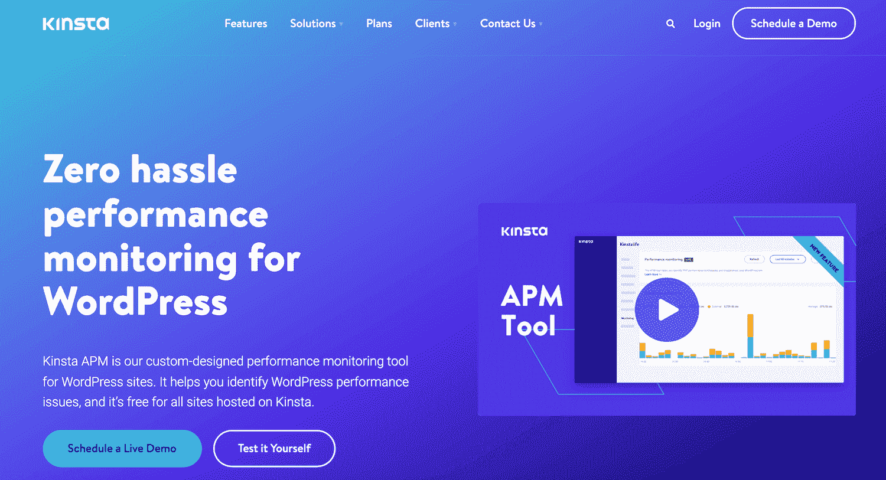

金斯塔 APM。

如果你已经有了一个托管账户，迁移到一个新的提供商并不复杂。在 Kinsta，我们从一长串流行的 web 主机中提供[免费迁移](https://kinsta.com/wordpress-migration/):

金斯塔提供免费移民。

我们将这些免费迁移包含在我们所有的托管计划中。请填写一份简单的表格，我们的专家团队会与您联系，帮助您安排搬家。

## 如何用 9 个步骤从 Joomla 迁移到 WordPress

WordPress 在 CMS 市场占有 60.8%的份额，这是它如此受欢迎的原因。如果你确信是时候升级了，以下是如何通过九个简单的步骤迁移到 WordPress 的方法！
T3】

### 步骤 1:设置 WordPress

众所周知，WordPress 易于安装。然而，你可以通过与托管的 WordPress 主机提供商合作，使安装过程更加简单。

如果你是 Kinsta 的客户，你可以通过登录你的 [MyKinsta 仪表板](https://my.kinsta.com/login)来设置 WordPress。然后，在左侧菜单中选择**站点**:

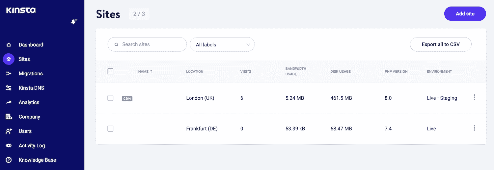

麦金塔仪表盘。

在右上角，点击**添加站点**。然后，选择**安装 WordPress** :

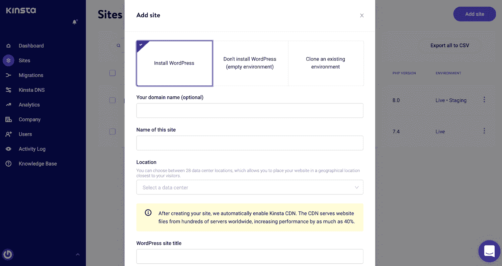

在 MyKinsta 中安装 WordPress。

这样做可以安装一个功能齐全的 WordPress 站点，供你立即使用。按照屏幕上的说明操作，几分钟后你就会有一个新的网站。

不幸的是，WordPress 本身不支持 Joomla 迁移。好消息是你可以通过使用一个[迁移插件](https://kinsta.com/blog/wordpress-migration-plugins/)来添加这个功能，比如 [FG Joomla to WordPress](https://wordpress.org/plugins/fg-joomla-to-wordpress/) 。

使用这个插件，你可以很容易地将 Joomla 网站的所有部分、类别、文章、媒体和标签迁移到 WordPress:

FG Joomla to WordPress。

登录你的 WordPress 仪表盘，导航到**插件>添加新的**来安装这个插件。你现在可以搜索 FG Joomla to WordPress 插件。当此项出现时，点击**安装>激活**。

### 步骤 2:备份你的 Joomla 站点

在迁移 Joomla 网站之前，最好创建一个备份。这样做可以确保如果您在迁移过程中遇到任何问题，您不会丢失所有的 Joomla 内容。

您可以使用 Akeeba 备份扩展来备份您的 Joomla 站点:

阿克巴备份。

安装完这个扩展后，从 Joomla 的左侧菜单中选择**主页仪表盘**。您的**通知**部分现在应该包含一个新的**最新备份**选项:

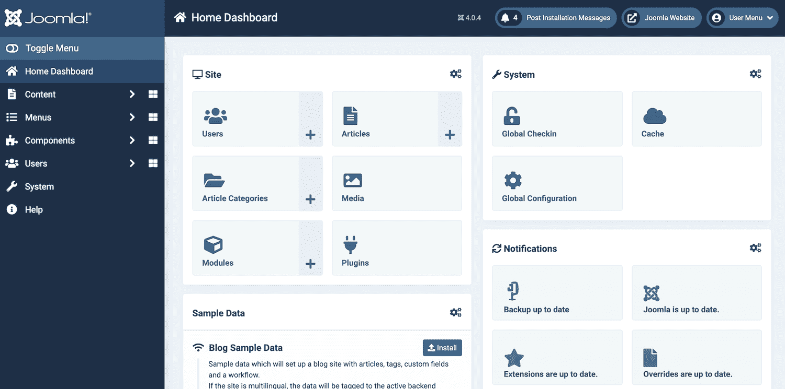

逐浪仪表板。

点击此通知。如果这是你第一次访问 Akeeba 备份设置，那么 Joomla 会要求你配置这个扩展。

Akeeba Backup 可以为您处理所有设置，因此在出现提示时选择**配置向导**:

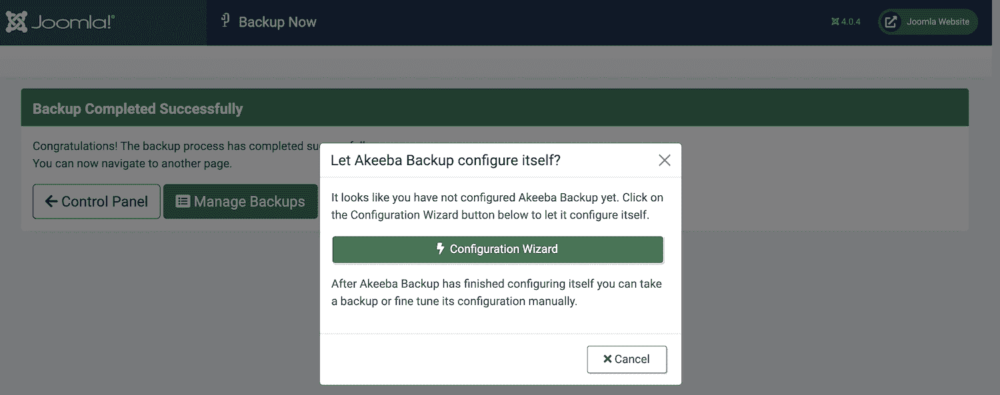

阿基巴备份配置。

配置向导现在将通过在您的服务器上运行一系列基准来确定您站点的最佳备份设置。测试完成后，点击**立即备份**:

标杆。

现在，您可以命名该备份并添加注释。当您对输入的信息感到满意时，点击**立即备份**:

点击立即备份选项。

现在已经配置了这个扩展，您可以随时创建备份。在 Joomla 仪表盘中导航至**组件> Akeeba 备份>立即备份**:

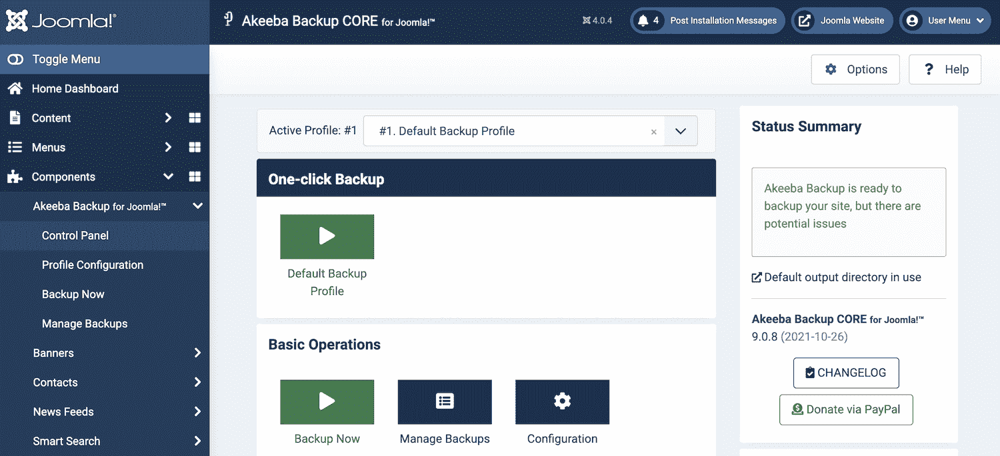

创建备份。

虽然这不像复制你的 Joomla 内容那样重要，但你可能想在继续之前备份你的 WordPress 网站。这将为您提供一张白纸，如果在迁移过程中出现问题，您可以恢复它。

Kinsta 客户可以通过登录他们的 MyKinsta 帐户按需创建备份。在这里，您可以选择有问题的站点，然后选择**备份**:

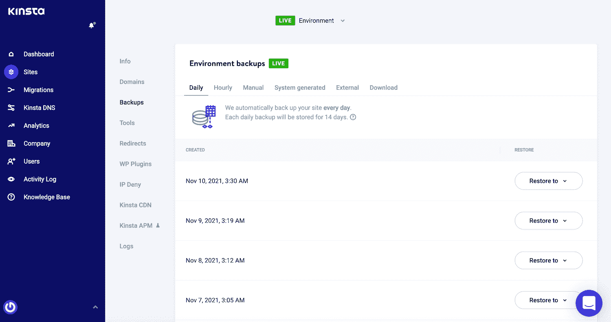

在 MyKinsta 创建一个备份。

然后，选择**手动**选项卡，接着是**现在备份**。这个程序将会为你的 WordPress 网站创建一个完整的备份。

### 步骤 3:迁移 Joomla 内容

在你的 WordPress 仪表盘中，导航到**工具>导入**。现在找到 **Joomla (FG)** 选项，点击其附带的 **Run Importer** 链接:

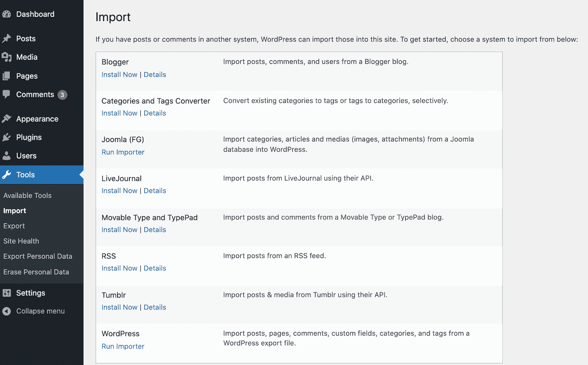

跑 Joomla FG。

随后的屏幕显示了站点底层数据库中的所有类别、帖子、页面、媒体和标签。即使是一个新的 WordPress 安装也可能包含一些内容，比如一个默认类别和一些示例网页:

导入 Joomla FG 设置页面。

大多数时候，您会希望将 Joomla 内容导入到一个空站点中。出于这个原因，我们建议使用**清空 WordPress content** 按钮来清除历史。

请注意，这样做会永久删除你的 WordPress 网站上的所有内容，并且没有机会恢复。如果你想保留这些类别、文章、页面、媒体或标签，你必须创建一个备份。

当你准备好继续时，选择**删除所有 WordPress 内容**。然后，点击**清空 WordPress 内容**。

几分钟后，插件将显示一条消息，确认它已成功清除您的站点:

清除所有 WordPress 内容。

您的帖子、页面、媒体和标签现在应该为零。WordPress 默认有一个**未分类的**类别。因此，你的**类别**积分将保持不变，即使删除了你所有的内容。

### 步骤 4:输入 Joomla 数据库参数

下一步是输入 Joomla 数据库参数。在一个新的标签，登录到您的 Joomla 帐户。在左侧菜单中，选择**系统**:

 ## 注册订阅时事通讯

### 想知道我们是怎么让流量增长超过 1000%的吗？

加入 20，000 多名获得我们每周时事通讯和内部消息的人的行列吧！

[Subscribe Now](#newsletter)

Joomla 数据库参数。

然后，点击**全局配置**。您现在可以选择**服务器**选项卡:

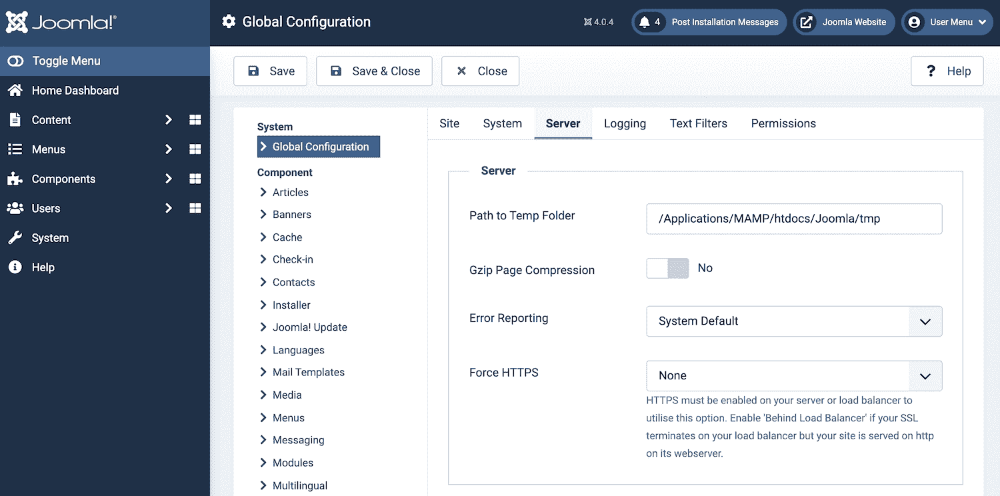

在全局配置选项卡中选择合适的服务器。

接下来，滚动到**数据库设置**。这个部分包含您的**主机、数据库用户名、数据库密码、数据库名称、**和**数据库表前缀**:

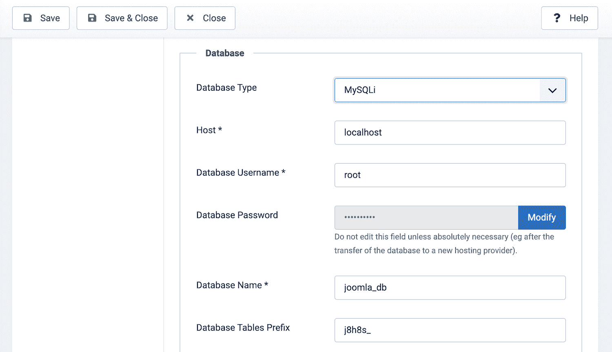

数据库设置。

这些值对于迁移你的数据是必不可少的，所以切换到你的 WordPress 仪表盘，滚动到 **Joomla 网站参数**部分。找到以下字段:**Joomla 直播网站的 URL**。在此字段中，输入您的 Joomla 网站的 URL，并选择通过 HTTP:

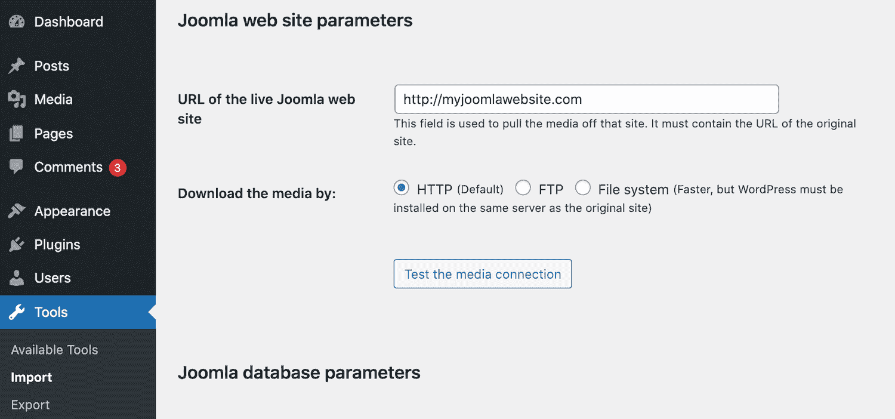

直播 Joomla 网站的网址。

现在，点击**测试媒体连接**。这样做将检查导入过程中的任何潜在问题。

假设您通过了测试，那么您需要提供关于 Joomla 数据库的所有信息。这意味着输入您的主机名、数据库名、用户名、密码和 Joomla 表前缀。

你可以从 Joomla 仪表板上复制每一条信息，并粘贴到 WordPress 的相应字段中:

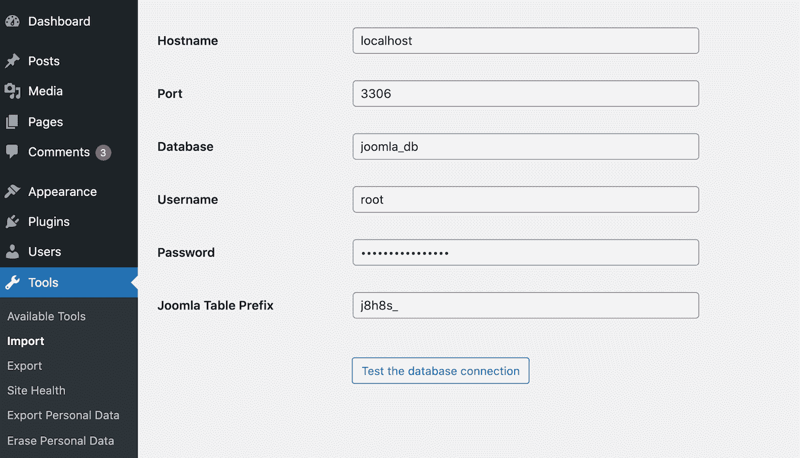

从 Joomla 仪表盘复制并粘贴信息。

除了您的数据库密码之外， **Joomla 全局配置**页面还显示您的数据库信息。如果您不记得这个密码，您可以使用 FileZilla 等[客户端，通过](https://filezilla-project.org/)[文件传输协议(FTP)](https://kinsta.com/blog/best-ftp-clients/) 连接到您的服务器。

然后，导航到你的 Joomla 网站的根文件夹。您将在您的**configuration.php**文件中找到数据库密码。

将这些数据库参数输入 WordPress 后，点击**测试数据库连接**。WordPress 现在将检查这些参数是否有效。如果连接成功，您就可以导入内容了。

### 步骤 5:导入 Joomla 内容

在你的 WordPress 仪表盘中，滚动到**行为**部分。它包含您将用于配置导入的所有设置:

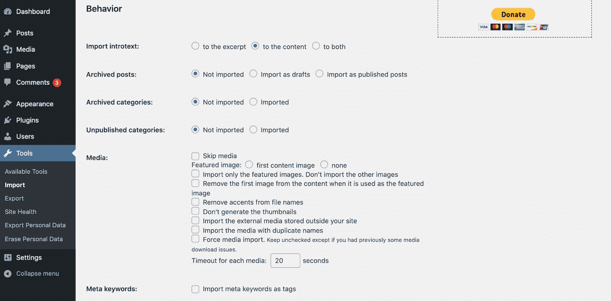

工具中的行为部分。

现在，您可以选择要迁移的内容。它包括存档的文章、媒体和元关键字。

您还可以配置如何处理您站点的媒体。例如，您可以选择仅导入特色图像。通过选择，您可以加快迁移过程。

此时，您还可以选择迁移 Joomla 站点的介绍文本。这一小段用整篇文章的预览来戏弄访问者。您可以选择将此内容作为摘录传输，将其与完整内容合并，或者两者都进行。

做出选择后，滚动到屏幕底部，点击**开始/恢复导入**按钮。该插件现在将从您的 Joomla 站点导入所有内容。一旦这个过程完成，FG Joomla to WordPress 会通知你。

您可能已经传输了您的内容，但是您的页面和帖子中的内部链接有可能不起作用。断裂的内部链接会严重损害访问者的体验。它们还会影响你网站的搜索引擎优化(SEO)。

当搜索机器人索引你的内容时，他们的抓取预算有限。你最不希望的就是把这宝贵的预算浪费在破网址上。幸运的是，迁移插件可以扫描断开的内部链接:

修改内部链接。

要执行该检查，点击**修改内部链接**按钮。FG Joomla 到 WordPress 现在将扫描你的网站的死网址。

需要一流的，快速的，安全的托管你的新 WordPress 网站？Kinsta 提供超快的服务器和来自 WordPress 专家的 24/7 世界级支持。[查看我们的计划](https://kinsta.com/plans/?in-article-cta)

### 第六步:选择一个新的主题

WordPress 预装了一个默认主题。但是，它可能不是最适合您迁移的 Joomla 内容的。你可以在一个新的标签页中访问你的站点，看看你的站点是如何使用默认的 WordPress 主题的。

或者，你可以通过导航到**帖子**或**页面**来查看特定的网页。然后，将鼠标悬停在相关网页上，选择**查看**:

查看帖子或页面。

如果你对默认的外观不满意，那么是时候安装一个新的主题了。当[选择一个 WordPress 主题](https://kinsta.com/blog/wordpress-free-vs-paid-themes/)时，有很多选择:

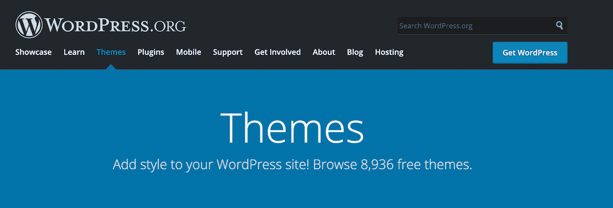

WordPress 主题。

要从[官方库](https://wordpress.org/themes/)安装一个主题，在你的 WordPress 仪表盘中导航到**外观>主题**。然后您可以选择**添加新的**并开始探索可用的选项:

安装新的 WordPress 主题。

当你找到一个吸引你眼球的主题时，将鼠标悬停在它上面，然后点击**预览**。这将显示应用了新主题的站点。

在挑选主题时，明智的做法是关注平均星级和评论，尤其是最近的反馈。主题可以有正的平均星级。然而，最近大量的负面评论可能表明最近的更新有问题:

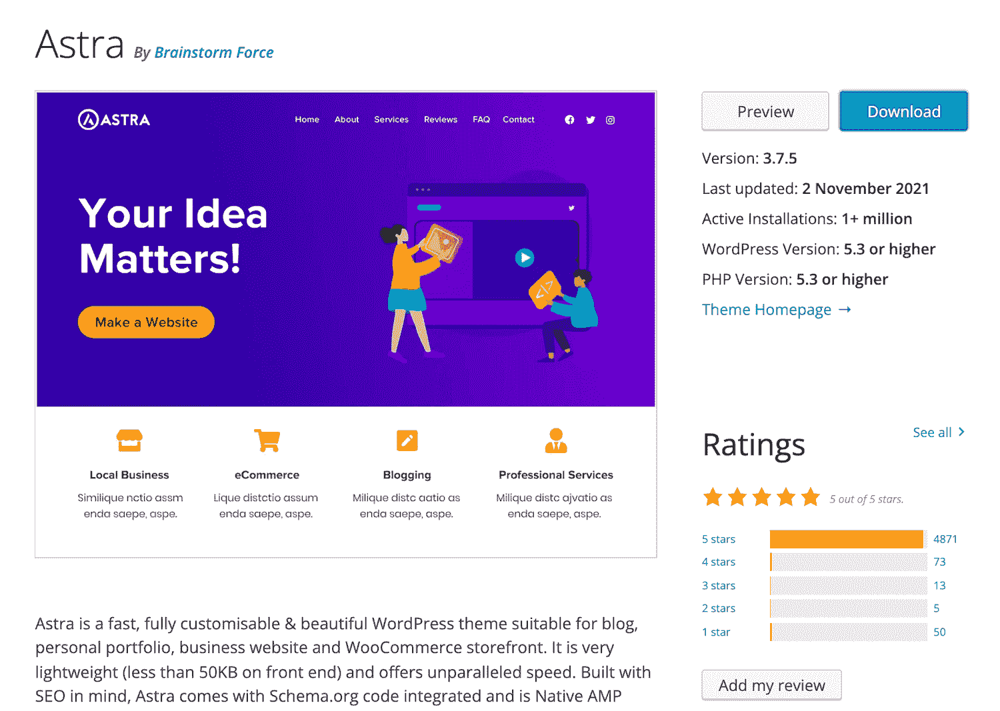

给刘文静的主题评论。

随着全球超过 30 亿智能手机用户，你的主题也应该是响应迅速且适合移动的 T2。这一质量对于在线商店至关重要，因为移动设备占了 2019 年所有电子商务流量的[65%。](https://www.salecycle.com/blog/stats-en-us/2019-ecommerce-year-in-review-infographic/)

当你找到你的完美主题时，选择**安装>激活**。您的迁移 Joomla 内容现在将使用这个新主题。

### 步骤 7:建立永久链接

永久链接是将用户和搜索引擎引向你的页面和文章的永久网址。顾名思义，这些链接应该保持不变。

虽然以后可以编辑永久链接，但这可能会导致链接断开。也可能会损害你的 SEO。因此，选择正确的永久链接结构对于建立一个新的 WordPress 网站是至关重要的。

WordPress 支持六种不同的永久链接结构。要查看您的选项，请导航至**设置>永久链接**:

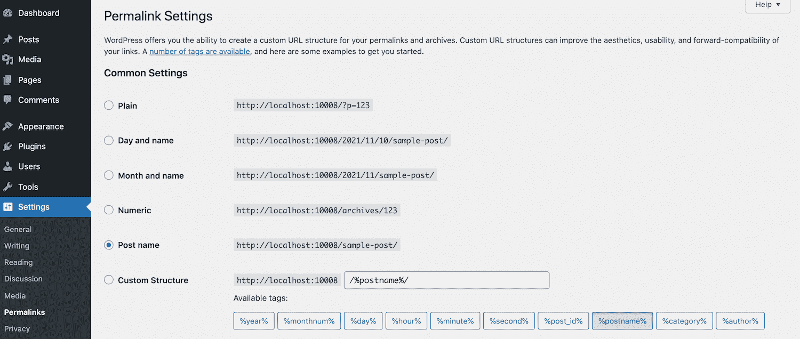

。

默认情况下，WordPress 使用**普通**结构。它包括一个基于 ID 的鼻涕虫，比如 mywebsite.com/?p=123 的**。然而，这种结构没有告诉搜索引擎或访问者任何关于页面的有用信息，这对 SEO 和用户体验来说是个坏消息。**

出于这个原因，我们建议切换到**帖子名称**永久链接结构。它将根据页面或文章的标题生成一个 URL slug。这种设置对访问者来说更好，可以提高搜索引擎优化。

要更改您的永久链接结构，请选择**帖子名称**按钮。然后，点击**保存修改**。

### 第八步:重新点你的域名

每个域名至少指向两个域名服务器。根据站点的设置，您可能需要将域名连接到主机服务器。这个过程被称为[重新注册你的域名](https://kinsta.com/knowledgebase/what-is-a-nameserver/)。

Kinsta 客户可以从 MyKinsta 仪表板重新点选他们的域名。在左侧菜单中，选择**网站**，然后选择您网站的名称。然后，点击**域名**:

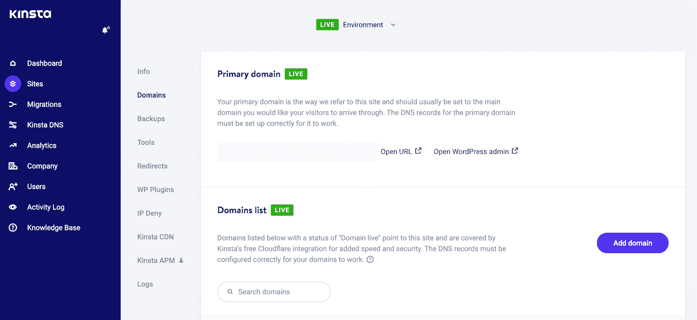

MyKinsta 中的域段。

接下来，点击**添加域名**。在随后的弹出窗口中，输入您的域名并选择**添加域名并继续**:

点击添加域名。

您现在需要验证您拥有该域。为此，您将向您的域的 DNS 添加两个 TXT 记录。

您的 DNS 提供商是您的域名服务器所指向的地方。它可能是您的域名注册商或其他 DNS 提供商。如果你使用的是 [Kinsta DNS](https://kinsta.com/knowledgebase/dns/) ，我们会自动添加这些 TXT 记录进行域名验证。

在 DNS 提供商的管理面板中，添加新的 TXT 记录。对于第一条 TXT 记录，在**主机名**字段使用 **_cf-custom-hostname** ，在**内容/文本**字段使用您的唯一 UUID 值。

对于第二条 TXT 记录，在**主机名**字段中使用 **@** 。对于**内容/文本**字段，使用您唯一的 UUID 值。

将这些 TXT 记录添加到您的 DNS 提供商后，切换回您的 **MyKinsta** 选项卡。然后，点击**确定，我已经在**验证域**模态窗口中完成了**。

根据您的提供商，TXT 记录可能需要 24 小时才能传播。一旦您成功验证了您的域名，切换回您的主机提供商的仪表板。在 MyKinsta 中，点击出现在自定义域旁边的**点域**按钮。

作为这个过程的一部分，您可能需要[将您的根和 www 域](https://kinsta.com/knowledgebase/add-domain/#how-to-point-your-domain-to-kinsta-noncloudflare-domain)指向 MyKinsta。为了确保您不会错过任何流量，您还可以添加对通配符域的支持。

### 第九步:成为 WordPress 专家

WordPress 被设计成一个直观和用户友好的平台。然而，当谈到掌握新技术时，你可能会受益于专家的建议。

幸运的是，有很多资源可以帮助你掌握 WordPress 的基础知识，甚至更多。首先，官方的 [WordPress Codex](https://codex.wordpress.org/Main_Page) 有一个深入的**学习使用 WordPress** 部分。这对第一次使用 WordPress 的用户来说是非常宝贵的:

【WordPress.org 抄本】T2 抄本。

还有一些[优质的 WordPress 课程](https://kinsta.com/blog/learn-wordpress/)。这些课程包含大量信息，可帮助您快速熟悉新平台。

或者，如果你喜欢更实际的方法，你可能想试试我们的[免费 DevKinsta 工具](https://kinsta.com/devkinsta/):

德夫金斯塔。

你可以使用这个工具快速简单地创建一个本地 WordPress 安装。这种设置非常适合在一个私密、安全的环境中试验该平台，而不会影响您的实时站点。

想让从 Joomla ➡️ WordPress 移动你的网站成为一种无压力的体验吗？✅继续读下去...

## 摘要

从一个[内容管理系统(CMS)](https://kinsta.com/blog/cms-software/) 转移到另一个可能是一个令人生畏的前景。幸运的是，使用正确的工具，你可以从 Joomla 迁移到 WordPress，而不必从头开始。

当你计划迁移时，一个好的迁移插件如 FG Joomla 到 WordPress 是必不可少的。我们也建议选择由[管理的 WordPress 提供商](https://kinsta.com/plans/)，比如 Kinsta。有了合适的主机，安装和配置 WordPress 软件就像是一件轻而易举的事情，这就少了一件需要担心的事情！

关于如何将你的网站从 Joomla 迁移到 WordPress，你有什么问题吗？请在下面的评论区告诉我们！

* * *

让你所有的[应用程序](https://kinsta.com/application-hosting/)、[数据库](https://kinsta.com/database-hosting/)和 [WordPress 网站](https://kinsta.com/wordpress-hosting/)在线并在一个屋檐下。我们功能丰富的高性能云平台包括:

*   在 MyKinsta 仪表盘中轻松设置和管理
*   24/7 专家支持
*   最好的谷歌云平台硬件和网络，由 Kubernetes 提供最大的可扩展性
*   面向速度和安全性的企业级 Cloudflare 集成
*   全球受众覆盖全球多达 35 个数据中心和 275 多个 pop

在第一个月使用托管的[应用程序或托管](https://kinsta.com/application-hosting/)的[数据库，您可以享受 20 美元的优惠，亲自测试一下。探索我们的](https://kinsta.com/database-hosting/)[计划](https://kinsta.com/plans/)或[与销售人员交谈](https://kinsta.com/contact-us/)以找到最适合您的方式。