# 你需要知道的关于 WordPress 图片尺寸的一切

> 原文:[https://kinsta.com/blog/wordpress-image-sizes/](https://kinsta.com/blog/wordpress-image-sizes/)

WordPress 图片尺寸比你想象的要复杂。理解图片尺寸在 WordPress 中是如何工作的，默认的图片尺寸是什么，以及如何定义自定义的图片尺寸来有效地管理你的网站是很重要的。

掌握这些知识将确保您在合适的位置拥有合适大小的合适类型的图像，这样您就可以充分利用您的[视觉内容策略](https://kinsta.com/blog/visual-content-strategy/)。

这些策略也将提高你的帖子的分享价值，这将转化为更多的可见性和流量。统计显示，读者在三天后只能记住 10%的文本内容，但是如果你在内容中加入视觉上吸引人的图片，这个数字会上升到 65%。

在这本内容丰富的指南中，你会学到你需要知道的关于 WordPress 图片尺寸的一切。

激动吗？我们走吧！

 <kinsta-auto-toc heading="Table of Contents" exclude="last" list-style="arrow" selector="h2" count-number="-1">### 更喜欢看[视频版](https://www.youtube.com/watch?v=k5gd8arv1LY)？

<kinsta-video src="https://www.youtube.com/watch?v=k5gd8arv1LY"></kinsta-video>

## WordPress 如何管理你上传的图片

将图片上传到 WordPress 非常简单，但是在 WordPress 后端处理图片的时候会发生很多事情。

<link rel="stylesheet" href="https://kinsta.com/wp-content/themes/kinsta/dist/components/ctas/cta-mini.css?ver=2e932b8aba3918bfb818">


当你上传图片时，WordPress 做的第一件事是创建三种不同尺寸的图片。这意味着你每上传一张照片，就会有四张照片:

*   极小的
*   中等
*   大的
*   原始大小

WordPress 创造了所有这些不同的尺寸，为每个访问者提供最合适的尺寸。您的网站将始终根据读者使用的设备向他们显示正确的图像，从而加快和增强他们的体验。

你总是可以手动编辑你的图像来提供这些额外的尺寸，但是在像 Photoshop 这样的工具中精确地做到这一点并不是一件容易的事情。这将涉及大量繁琐的工作，这也是 WordPress 为你省去麻烦的原因。

## 图片尺寸:需要记住的基本事项

在我们进入 WordPress 图片尺寸的更多技术方面之前，你应该知道一些关键的注意事项。

我们已经讨论了 WordPress 如何为你创建三个默认的图片尺寸，但是如果你需要一个不同于 WordPress 默认尺寸的尺寸呢？如果你想要更多的尺寸呢？

好消息！你可以很容易做到这一点。WordPress 允许你改变默认的图片尺寸，并添加你想要的尺寸。我们稍后会对此进行更详细的解释。

但在我们开始之前，您应该知道，要想让它如您所愿地工作，有一些特定的要求。

其中之一就是你应该[尝试上传你需要的最大尺寸](https://kinsta.com/blog/optimize-images-for-web/#the-benefits-of-formatting-your-images)的图片。虽然 WordPress 将为较小的设备缩小尺寸，但它将在图像需要最大化的地方使用全尺寸(原始尺寸)。

假设你上传的图片小于你在 WordPress 中定义的最大尺寸。在这种情况下，WordPress 不会正确地以最大尺寸显示特定的图片。另外，质量会明显下降。

也就是说，你还必须确保你上传的图片没有超过最大尺寸。WordPress 永远不会使用这样的图片，因为它们太大了，会占用你服务器上不必要的空间。

因此，你应该检查你上传的图片的大小，确保它是你上传到 WordPress 之前需要的最大尺寸，但不能超过这个尺寸。

## WordPress 在哪里以及如何存储你的图片？

就你的管理面板而言，WordPress 将你上传的图片[存储在媒体库](https://kinsta.com/blog/wordpress-media-library/)中。您可以通过将鼠标悬停在媒体选项上并单击库来查看您上传的所有图像。

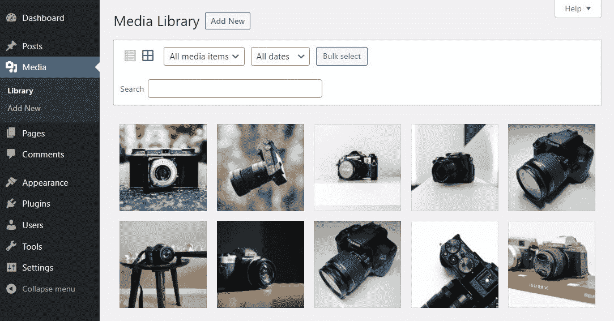

The WordPress Media Library.


你可以按媒体类型(图像、视频、音频等)对它们进行分类。)和日期。但是，请注意，如果您没有在**设置**中禁用此功能，您将只能按日期对图像进行排序。

右边还有一个搜索框，可以帮助你找到上传的图片。只需键入您在标题、说明或图片描述中使用的单词即可找到它。

您的图像存储在您网站的上传文件夹中( **wp-content/uploads/** )。要访问这个文件夹，你需要[使用 FTP/SFTP 客户端](https://kinsta.com/knowledgebase/how-to-use-sftp/)。你网站的上传文件夹中会有多个子目录，按上传日期存放你的图片(假设你在**设置**中打开了按日期排序的选项)。

您也可以[为您的媒体文件](https://kinsta.com/knowledgebase/bulk-upload-files-wordpress-media-library-ftp/)创建自定义文件夹，但我们建议您仅在认为自己是高级用户时才这样做。
T3】

## 默认的 WordPress 图片尺寸是多少？

当谈到 WordPress 和图片尺寸时，我们总是关注四种不同的尺寸，你的原始图片文件和 WordPress 默认创建的三种不同尺寸:

*   **缩略图尺寸:**150 像素(正方形)
*   **中等尺寸:**最大宽度和高度为 300 像素
*   **大尺寸:**最大宽度和高度 1024px
*   **全尺寸:**图像的原始尺寸

同样，正如我们前面提到的，如果你打算只使用这些默认的图像尺寸，你可以上传 1024 像素的图像。这将使你的图片即使在最大尺寸下也能正确显示，如果你的图片尺寸小于 WordPress 使用的最大尺寸(默认为 1024 像素)，这是不可能的。

## 理想的 WordPress 精选图片尺寸是多少？

WordPress 特色图片对读者参与度至关重要。很像一本书的封面，特色图片提供了内容的预览。

它们通常出现在 WordPress 文章中，但是也可以包含在页面和自定义文章类型中。由于特色图片最终可能会被搜索引擎和社交媒体网站显示，因此选择合适的尺寸至关重要。

虽然在这个问题上有不同的意见，但普遍的共识是理想的 WordPress 特色图片尺寸大约是 1200 × 630 像素。具有这些尺寸的图像应该适合你的网站，不管你的读者的屏幕大小如何。

同样值得注意的是，为了让你的页面有资格进入 [Google Discover](https://kinsta.com/blog/wordpress-seo/) feed(谷歌额外流量的巨大来源)，[谷歌强调](https://developers.google.com/search/docs/advanced/mobile/google-discover%/)你的 WordPress 特色图片尺寸必须至少 1200 像素宽。

但是这是默认的 WordPress 精选图片尺寸吗？

这可能会令人惊讶，但是 WordPress 实际上并不包括开箱即用的特色图片尺寸设置。相反，除非受到网站设计的限制，或者除非你选择 WordPress 的其他默认尺寸(如“中”或“大”)，否则特色图片将默认为其原始上传尺寸。

然而，[许多 WordPress 主题](https://kinsta.com/best-wordpress-themes/)——包括 [WordPress 的默认主题，二十个二十一个](https://kinsta.com/blog/twenty-twenty-one-theme/)——为特色图片设置他们自己的自定义图片尺寸，所以一定要先[检查你的主题设置](https://kinsta.com/knowledgebase/what-is-a-wordpress-theme/)。

## 理想的 WordPress 标题图片大小是多少？

与特色图片类似，标题图片可以让你的读者先睹为快，了解页面的主题和情绪。虽然它们不容易在搜索结果页面或社交媒体上被分享，但大小合适对你网站的速度和完整性仍然很重要。

因为标题图像通常依赖于网站的设计，所以它们的尺寸范围很广。没有“放之四海而皆准”的情况，所以在选择你的 WordPress 标题图片尺寸之前，最好考虑你的网站的设计和响应。

也就是说，主题开发者建议 WordPress 标题图片应该坚持 16:9 的比例，比如:

*   1920 × 1080 像素
*   1280 × 720 像素
*   1152 × 648 像素

和特色图片一样，WordPress 没有为标题图片设置默认大小。然而，你的主题可能会附带一个选项，通过主题的设置，在**外观**菜单下的[来定制页眉尺寸。](https://kinsta.com/knowledgebase/wordpress-admin/)

如果你选择的主题没有给你改变标题图片大小的选项，你仍然可以自己调整。我们将讨论下一步如何做。

## 如何更改默认图像尺寸(以及何时需要)

虽然默认的 WordPress 图片尺寸对大多数用户来说很好，但是一些用户可能有不同的要求。您可能喜欢略大一点的缩略图或小一点的大图片。

当你发现自己正在编辑你上传的大部分图片时，在 WordPress 中改变默认的图片尺寸是有意义的，因为 WordPress 的默认图片尺寸不适合你的使用情况。

在默认图像尺寸之上添加新的自定义图像尺寸之前，请注意，您将在您的[站点的数据库](https://kinsta.com/knowledgebase/wordpress-database/)上存储比您需要的更多的图像文件。这可能会导致您的网站性能问题，并消耗更多的空间比它需要的。

基于图片的网站也是如此，它们需要坚持特定的图片尺寸。摄影师、设计师和其他提供重磅图片的人喜欢在网站各处保持一致的尺寸以确保一致性。

类似地，一些[登陆页面](https://kinsta.com/blog/wordpress-landing-page-plugins/)也需要显示特定的图像尺寸，默认的 WordPress 图像尺寸可能不合适。一家[电子商务商店](https://kinsta.com/blog/ecommerce-hosting/)通常需要使用更大的缩略图，这样可以显示更多细节。

你可能有很多其他的原因想要改变默认的图像尺寸，但是你明白了。

WordPress 也理解这一点，这就是为什么它允许你改变这些默认值。
<kinsta-advanced-cta language="en_US" type-int-post="96280" type-int-position="2"></kinsta-advanced-cta>

### 步骤改变 **WordPress** **默认图片尺寸**

以下是[在 WordPress](https://kinsta.com/blog/regenerate-thumbnails/#3-resizing-images-in-the-media-settings) 中改变默认图片尺寸的一步一步的过程。

**步骤 1:** 将鼠标悬停在**设置**上，点击出现的**媒体**选项:

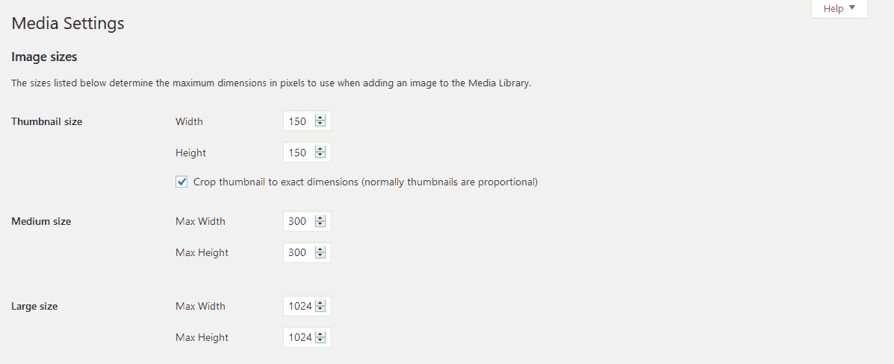

WordPress Media Settings for changing default image sizes.


**第二步:**通过编辑图片将尺寸更改为您想要的尺寸，如下所示:


Examples of updated image sizes in Media Settings.


**第三步:**点击底部的**保存修改**按钮。

现在，你上传的所有图片都是新的默认尺寸。

一些教程会建议你输入“0”作为默认的图像尺寸。然而，我们建议不要这样做，即使这可能有助于节省空间。

如果你将这些值更改为“0”，那么 WordPress 将在所有地点和所有设备上使用你的全尺寸(原始)图像，这将导致你的网站上带宽使用的巨大峰值。此外，这几乎肯定会降低显示许多这些图像的部分的页面加载时间。

## 如何给 WordPress 添加自定义图片尺寸

如果你需要把你过去的 WordPress 图片改变成新的尺寸，你可以使用几个很棒的插件，我们将在下面详细介绍。

对于倾向于使用许多不同类型图像的用户来说，拥有比 WordPress 提供的三种默认尺寸更大的图像尺寸可能是必要的。

默认的图像尺寸对于标准类型的图像来说可能已经足够了，但是对于像弹出图形、[窗口小部件](https://kinsta.com/blog/wordpress-widgets/)或者[滑动图片](https://kinsta.com/blog/wordpress-slider/)这样的东西，你可能需要更大的图像尺寸。

自定义图像尺寸可以让你灵活地改进你的 WordPress 网站的功能，并节省大量的时间来逐个调整你的图像。

现在我们已经建立了这个基线，让我们仔细看看在你的 WordPress 站点中添加这些自定义图片尺寸的过程。

你有两个选择。第一种是使用一个插件，只需点击几下就能为你处理一切。第二种方法是手动将所需的代码字符串添加到站点文件中。

让我们先来看看插件方法。

### 使用图像再生和选择裁剪添加自定义图像尺寸

[图像重新生成&选择裁剪](https://wordpress.org/plugins/image-regenerate-select-crop/)插件超越了[重新生成缩略图](https://kinsta.com/blog/regenerate-thumbnails/#how-to-regenerate-thumbnails-in-wordpress)(下面将进一步讨论)，允许更多的定制和功能。

除了允许您更改默认图像大小之外，它还允许您重新生成任何现有图像以匹配您的首选图像大小，设置图片的默认裁剪选项，以及重新生成缩略图。

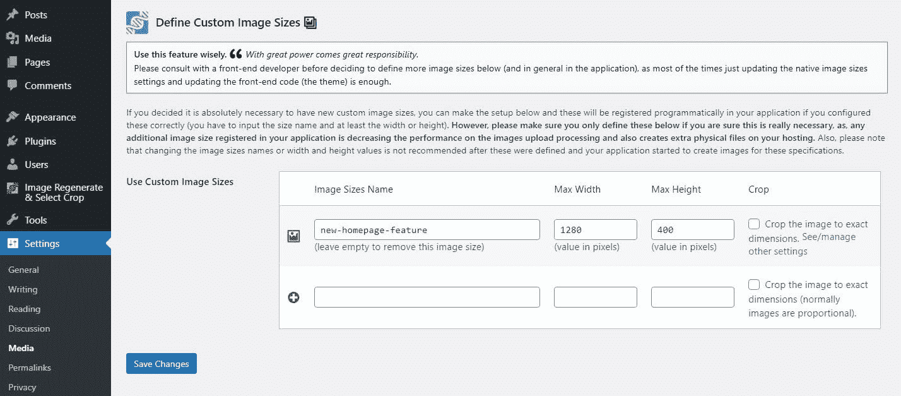

Custom image size options via the Image Regenerate & Select Crop plugin.


一旦安装并激活，你可以通过标准的设置>媒体页面创建任意多的新的自定义图片尺寸。

### 手动添加自定图像尺寸

虽然这是一个相对简单和容易的过程，但你应该做的第一件事是[为你的网站](https://kinsta.com/help/wordpress-backups/)创建一个备份，以防在做这些调整时出现问题。一旦备份过程完成，前往你的 WordPress 站点的管理面板。

 ## 注册订阅时事通讯


### 想知道我们是怎么让流量增长超过 1000%的吗？

加入 20，000 多名获得我们每周时事通讯和内部消息的人的行列吧！

[Subscribe Now](#newsletter)

在那里，将鼠标悬停在**外观**菜单选项上，选择**编辑器**(在某些情况下，它可能被命名为**主题编辑器**)。

接下来，找到**functions.php**文件，检查下面的代码是否已经存在(使用搜索功能快速定位)。如果它已经在那里，你不需要做任何事情。

如果不存在，您需要将该字符串添加到文件中:

```
add_theme_support( 'post-thumbnails' );
```

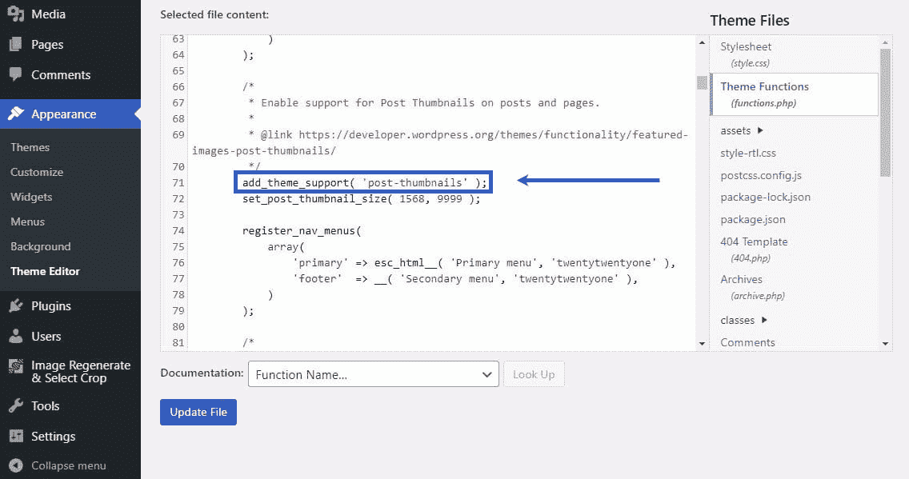

Adding the hook for custom image sizes to functions.php.


添加此代码后，点击底部的**更新文件**按钮，激活允许您创建自定义图像大小的功能。

现在是时候为您想要的特定自定义图像大小添加代码了。在你的**functions.php**文件中寻找“add_image_size”字符串，因为那是你需要进行编辑的地方:

```
add_image_size( 'my-custom-image-size', 800, 640 );
```

具体来说，您应该用您想要命名的新的自定义图像大小来更新单引号内的内容。我们建议保持它的简单和描述性(如“主-后图像”)。

在处理好名称之后，您需要声明图像大小本身。第一个数值是图像宽度，第二个是图像高度。

这里有一个截图，显示了我们添加到**functions.php**文件中的示例代码:

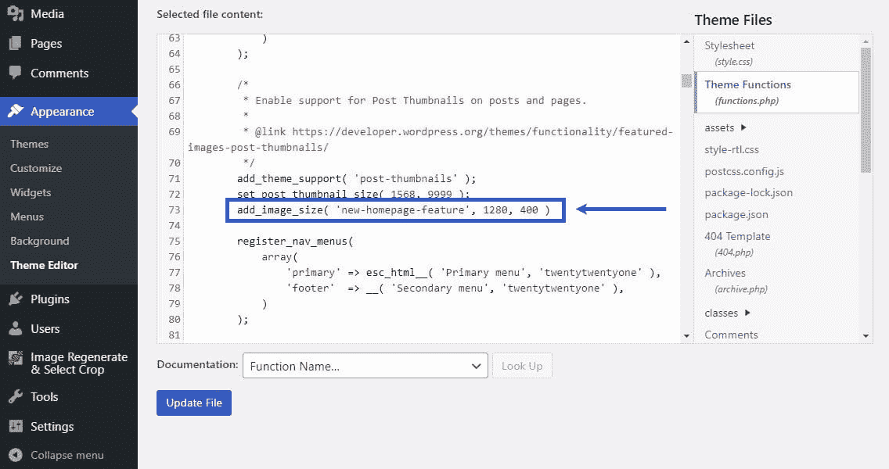

Adding custom image size dimensions to functions.php.


### 了解裁剪

当一幅图像在没有裁剪的情况下变小时，它只是原始图像的缩小版。但是，当它被“裁剪”或剪切时，被裁剪的部分会从完成的图像中移除。

这就像是把一张照片切下来。如果你用剪刀剪下一幅肖像的肩膀以下的部分，你就“裁剪”了那张照片。数码技术也是如此。

目的是减小图像的文件大小，因为裁剪不是正确的选择。您可能会删除想要保留的元素，同时保持文件的大尺寸。也就是说，对于必须完全符合特定尺寸的图像大小，如特色图像或个人资料图片，裁剪可能是有意义的。

对于像[特色图片](https://kinsta.com/blog/wordpress-featured-image-not-showing/)这样的东西来说，主体可能会变得太小。在没有裁剪的情况下，当调整大小时，它们仍然应该得到所需的曝光。因此，找出最适合您使用的不同类型图像的方法，并相应地设置裁剪功能。

添加自定义图像尺寸时，您可以让 WordPress 根据您设置的尺寸和原始尺寸自动裁剪图像。你需要在代码的末尾加上“真”。

同样，这是我们上面启用了裁剪功能的例子。

```
add_image_size( 'name-for-your-custom-image', 800, 640, true );
```

但是，如果您不想裁剪图像，您可以将“真”改为“假”，或者两者都不选。不放置它们中的任何一个都会使代码自动假定为“false”选项。这样，WordPress 就不会裁剪你的图片。

## 将自定图像大小添加到主题中

创建了所需的自定义图像尺寸后，还需要更新主题中的代码。这样做将使您的主题显示这些自定义图像大小，如您所愿。

如果你是编辑代码的初学者，请在执行此操作之前再次创建你的站点的备份。

现在，您需要在 post 循环中找到您的主题文件，并向其中添加以下代码:

```
the_post_thumbnail( 'your-specified-image-size' );
```

要找到这个文件，点击**外观**设置下的**主题编辑器**。在这里寻找 index.php 的**文件——这是包含你需要编辑的 post 循环的主题文件。**

找到它后，添加上面提到的代码，如下图所示:

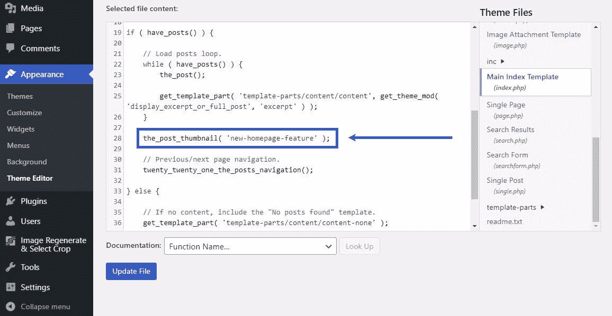

Adding the hook for custom image sizes to functions.php.


同样，如果你把“新主页功能”部分替换成你创建的自定义图片大小的名称，那就更好了。

厌倦了低于 1 级的 WordPress 托管支持而没有答案？试试我们世界一流的支持团队！[查看我们的计划](https://kinsta.com/plans/?in-article-cta)

添加此代码并更新文件后，您将在媒体库中看到自定义图像大小。上传一张新图片来试试吧。

## 更新旧缩略图

虽然创建和添加自定义图像大小感觉很好，但它留给你另一个开放的任务:你已经上传的所有旧图像怎么办？

不要担心这个——一些很棒的 WordPress 插件对这个任务来说非常方便！让我们看看他们如何帮助你照顾你的旧缩略图。

### 重新生成缩略图插件

[重新生成缩略图](https://kinsta.com/blog/regenerate-thumbnails/#how-to-regenerate-thumbnails-in-wordpress)允许您自动重新上传新尺寸的图像，包括您添加的任何自定义图像尺寸。

要安装它，将鼠标悬停在**插件**菜单选项上，点击**添加新的**。然后在搜索框中输入“重新生成缩略图”。

点击**立即安装**按钮，安装重新生成缩略图插件。

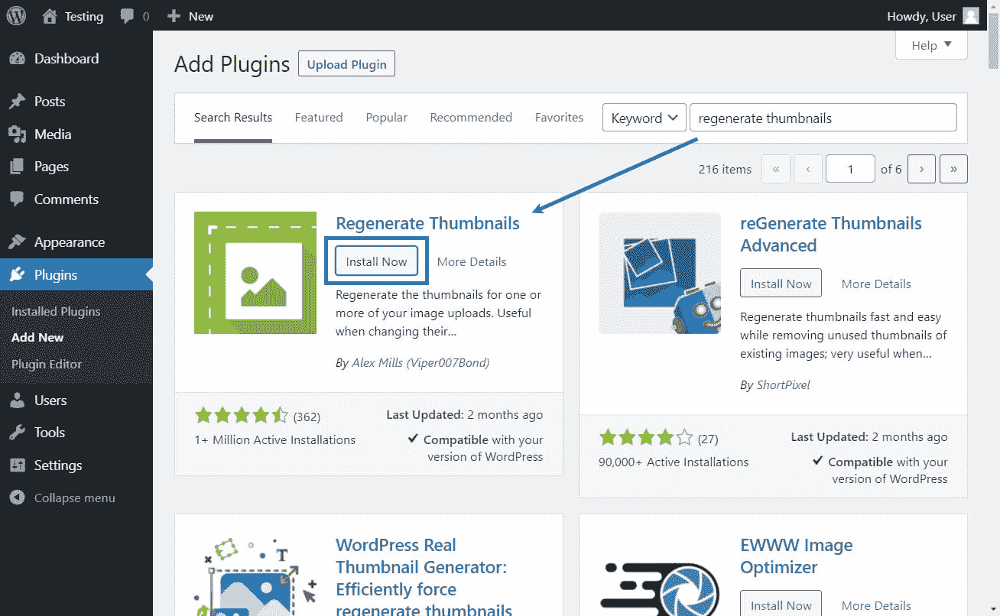

Installing the Regenerate Thumbnails plugin.


安装完成后，点击**激活**按钮开始使用。

接下来，将鼠标悬停在左侧的**工具**菜单上，点击**重新生成缩略图**:

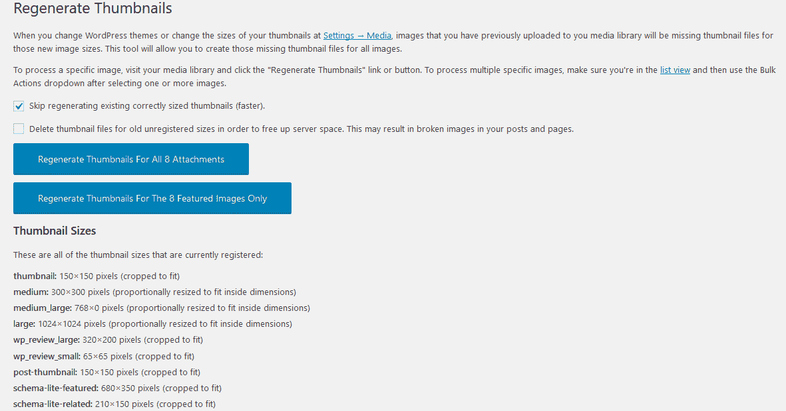

The settings page for the Regenerate Thumbnails plugin.


您可以点击**重新生成所有[#]附件的缩略图**，为所有旧图像生成新的图像尺寸。


### 信息

请小心勾选复选框，删除旧的未注册尺寸的缩略图文件，因为如果您的网站上仍然有您不再使用的旧尺寸的图像，您可能会在您的网站上结束破碎的图像。


正如你从上面的图像中看到的，重新生成缩略图还会列出你的网站上当前活动的所有图像大小。

您可能会发现一些您不知道的图像大小。通常，这些是由插件创建的，尤其是当它们是为了改善你的站点的外观、设计或功能时。

## 使用 WordPress 内置图片尺寸编辑器

正如我们之前强调的，您应该只创建您经常使用的自定义图像大小。对于你计划只在极少数情况下使用的图像尺寸，使用 WordPress 内置的图像尺寸编辑器手动编辑图像尺寸是有意义的。

我们将向您快速演示如何使用内置编辑器快速轻松地编辑图像尺寸。

首先，点击**媒体**菜单，进入媒体库。接下来，单击要调整大小的图像。

然后点击图像正下方的**编辑图像**按钮:

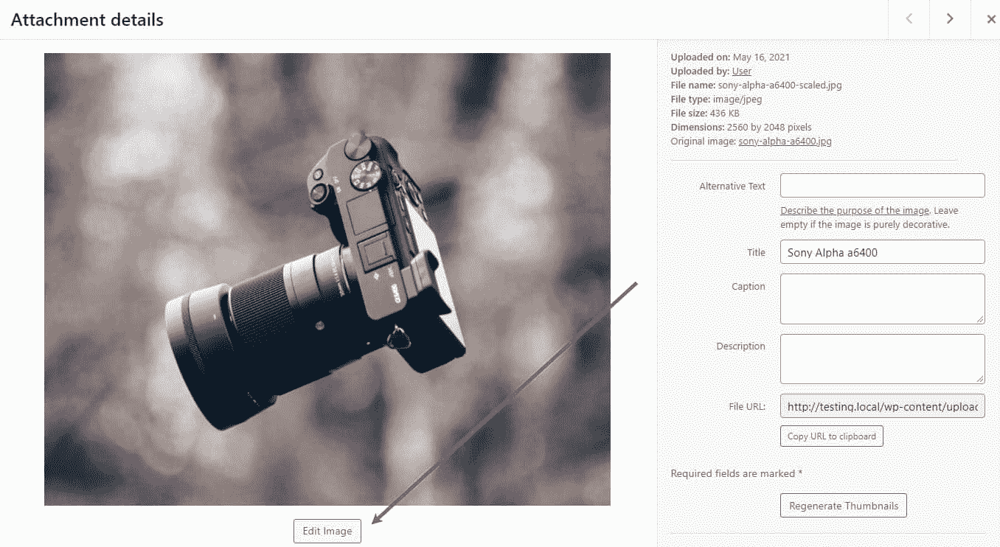

The Edit Image button.


您将看到当前的图像大小，并可以在这里进行调整。只需输入你想要的图像尺寸，然后点击**缩放**按钮，你就可以开始了。

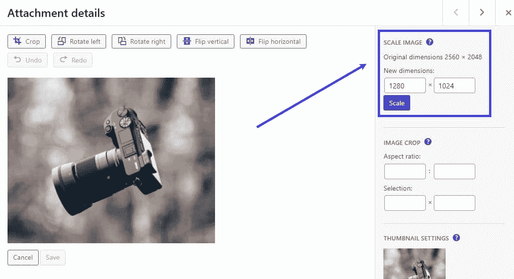

Editing the image dimensions.


当您点击**刻度**时，尺寸调整会自动保存。如果您出于任何原因不喜欢新的图像尺寸，您可以随时使用**恢复原始图像**选项(在图像尺寸字段的正下方)恢复到原始尺寸。

## 在 WordPress Gutenberg 中编辑图像

如果你使用的是古腾堡的图片，当你在创建文章的过程中添加图片时，你可以快速编辑图片的尺寸。

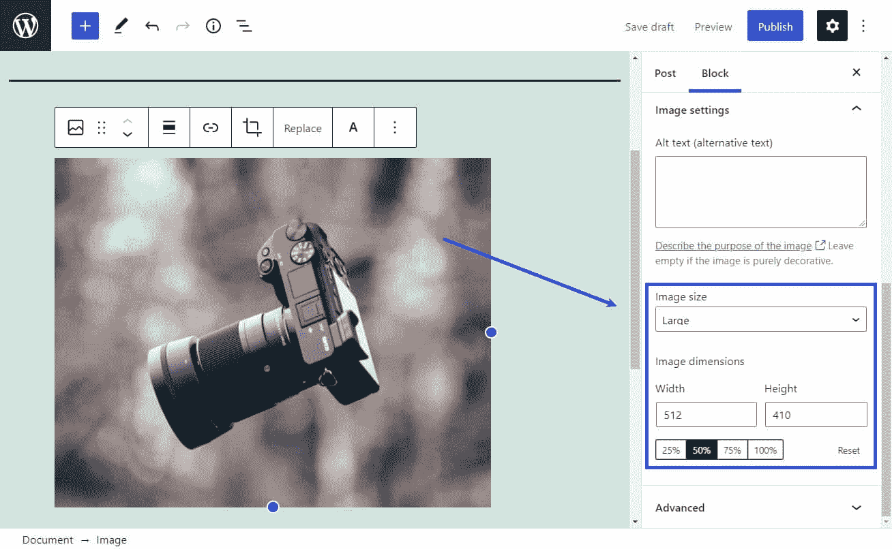

Changing the image size via Gutenberg.


正如你在上面的图片中看到的，当你在 Gutenberg 创建一个帖子时上传一个图片，你可以选择现有的图片大小或者在帖子选项中改变图片大小。

如果你已经将新的自定义图像尺寸添加到你的主题文件中，你会在**图像尺寸**下拉菜单中找到它们。

您还可以使用它正下方的字段来更改图像大小。你所需要做的就是在字段中输入想要的尺寸，图像会自动调整到你的新规格。

## 优化您的图像

如果没有提到图像优化，任何与图像相关的指南都是不完整的。虽然我们[已经非常详细地讨论了优化图像](https://kinsta.com/blog/optimize-images-for-web/),但是提到一些快速提示肯定不会有坏处。

毕竟，当您添加自定义图像尺寸时，您需要知道如何优化您的图像，以确保它们不会影响您的网站的性能或消耗更多的服务器资源。

也就是说，这里有一些快速的提示可以帮助你开始图像优化。

### 决定文件类型

只需为您的图像选择正确的文件类型，就可以显著减小它们的大小。虽然有许多不同类型的图像文件，但绝大多数都是 T2 JPEG 或 PNG T3。

当涉及彩色图像时，JPEG 轻而易举地胜出。此外，您可以进一步压缩 JPEG 文件以减小文件大小，而质量只会略有下降(如果您做得对)。

另一方面，PNG 通常成为绘图、文本、大多数截屏和图形的更好选择。

### 调整图像大小

调整图像大小是减小图像文件大小的一种快速简单的方法。作为一个经验法则，你应该确保你网站上的所有图片都是他们需要的大小。

如果你的网站的最大宽度是 1200 像素，那么在你的网站上放一张宽度超过 1200 像素的图片是没有意义的。

我们还提到了除非需要，否则不要创建新的自定义图像大小的重要性，所以也要记住这一点。

### 利用有损压缩

[有损压缩](https://kinsta.com/blog/lossy-compression/)是在使用其他方法优化图像后进一步减小文件大小的好方法。

这意味着删除一些图像数据，删除这些数据不会对图像质量产生太大影响，但有助于显著减小文件大小。

### 使用延迟加载

[惰性加载](https://kinsta.com/blog/wordpress-lazy-load/)帮助你在网站页面上优先加载图片。随着访问者滚动页面，它会及时加载图像。这意味着最顶端的图片会立即加载，但是文件夹下的所有图片只有在用户滚动过文件夹后才会加载。

还有更多，但你会在我们的[图像优化指南](https://kinsta.com/blog/optimize-images-for-web/)中找到，所以让我们直接跳到一些你可以使用的图像优化插件。

## WordPress 的图像编辑插件

使用这些插件的美妙之处在于，只需点击几下鼠标，你就可以执行高级的图像优化，而无需使用任何高级工具或代码。再者，这些插件大部分都是免费的，尤其是优化一定数量的图片或者使用一些基本的优化功能。

*   [Imagify](https://wordpress.org/plugins/imagify/) :令人印象深刻的定制压缩级别和其他图像优化功能
*   北海巨妖:有用的无损压缩插件，但前提是你要购买高级版本
*   [ShortPixel](https://wordpress.org/plugins/shortpixel-image-optimiser/) :支持[有损和无损压缩](https://kinsta.com/blog/lossy-vs-lossless)，可处理多种图像类型
*   [Optimole](https://wordpress.org/plugins/optimole-wp/) :对于 CDN 和惰性加载，这是优化图像的高效方法

[Statistics show that readers remember 55% more when you add visually appealing images to your content. Learn how to tackle WordPress image sizing and make your posts memorable.Click to Tweet](https://twitter.com/intent/tweet?url=https%3A%2F%2Fkinsta.com%2Fblog%2Fwordpress-image-sizes%2F&via=kinsta&text=Statistics+show+that+readers+remember+55%25+more+when+you+add+visually+appealing+images+to+your+content.+Learn+how+to+tackle+WordPress+image+sizing+and+make+your+posts+memorable.&hashtags=WPTips%2CWordPress)

## 摘要

现在你已经知道了 WordPress 图片尺寸的所有内容，以及如何获得 WordPress 提供的大部分功能和定制。既然你已经知道如何从里到外处理你的 WordPress 图片，你应该会发现优化你网站的性能和功能要容易得多。

你可以创建自定义的图片大小，或者直接通过你的主题代码或者使用一个插件来管理它们。记得在你计划更新图片的任何时候更新你的旧缩略图——这也是一个简单的任务，感谢我们上面列出的有用插件。

我们遗漏了什么吗？如果你对理解 WordPress 图片尺寸有困难，请在下面留下评论！

* * *

让你所有的[应用程序](https://kinsta.com/application-hosting/)、[数据库](https://kinsta.com/database-hosting/)和 [WordPress 网站](https://kinsta.com/wordpress-hosting/)在线并在一个屋檐下。我们功能丰富的高性能云平台包括:

*   在 MyKinsta 仪表盘中轻松设置和管理
*   24/7 专家支持
*   最好的谷歌云平台硬件和网络，由 Kubernetes 提供最大的可扩展性
*   面向速度和安全性的企业级 Cloudflare 集成
*   全球受众覆盖全球多达 35 个数据中心和 275 多个 pop

在第一个月使用托管的[应用程序或托管](https://kinsta.com/application-hosting/)的[数据库，您可以享受 20 美元的优惠，亲自测试一下。探索我们的](https://kinsta.com/database-hosting/)[计划](https://kinsta.com/plans/)或[与销售人员交谈](https://kinsta.com/contact-us/)以找到最适合您的方式。</kinsta-auto-toc>