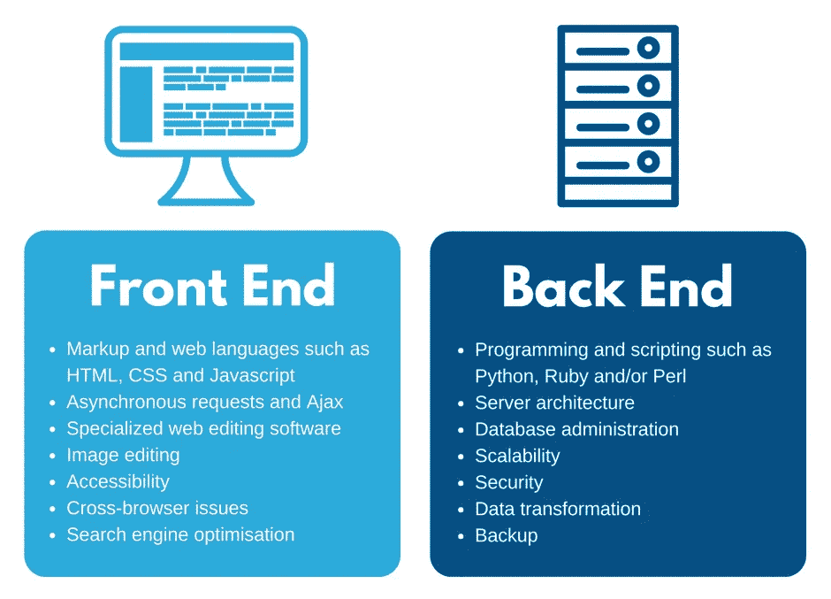
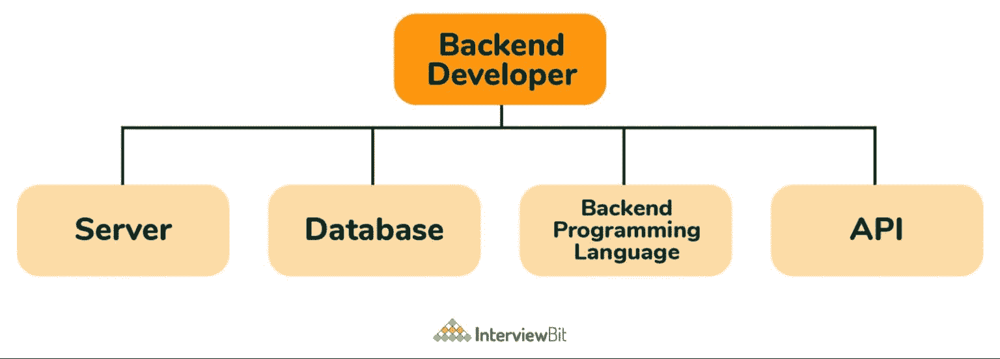
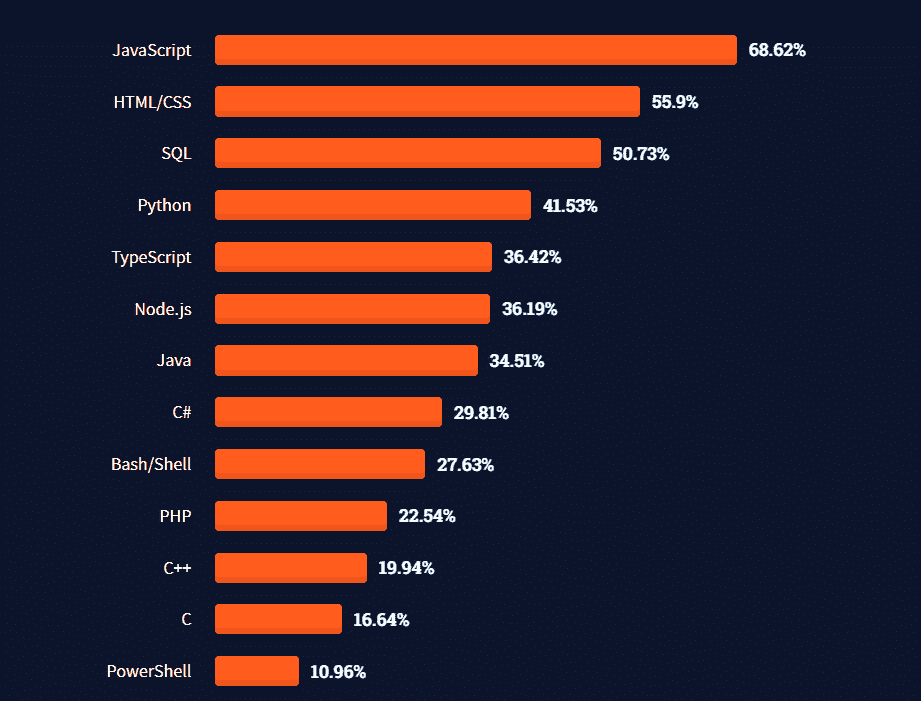
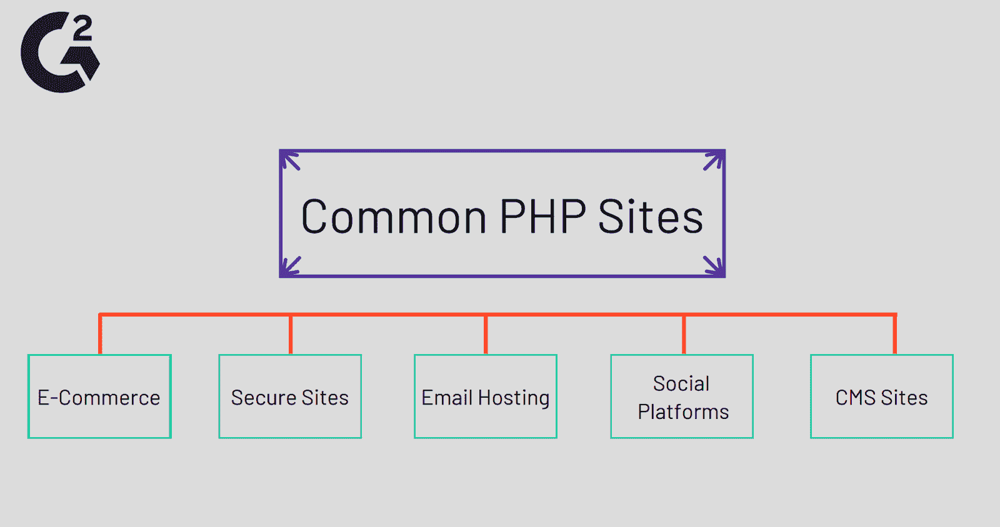
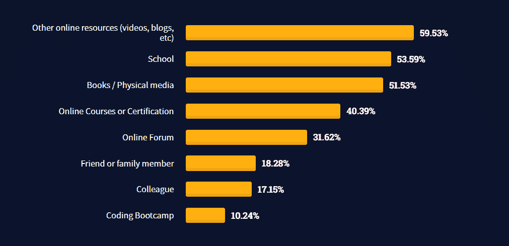
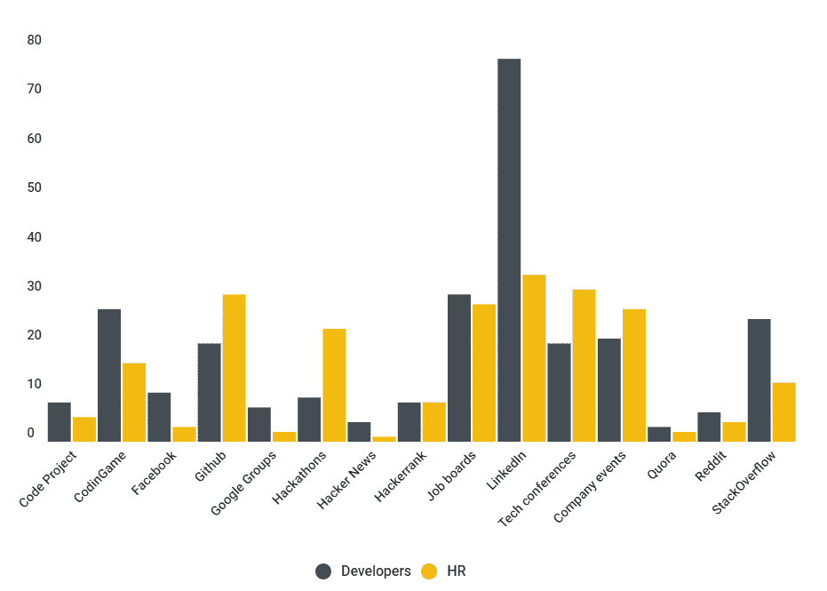

# 如何成为后端开发人员:需要学习的重要技能

> 原文:[https://kinsta.com/blog/backend-developer/](https://kinsta.com/blog/backend-developer/)

如今，网站和应用如此普遍，以至于人们很容易认为它们是理所当然的。但是隐藏在每一个网站设计或酷的新功能背后的是使其工作的代码和技术的结合。

负责这项幕后工作的人被称为后端开发人员。

如果这听起来像是你想要的工作，我们有好消息:[后端开发是一个高薪职业](https://kinsta.com/blog/backend-developer-salary/)有很好的就业前景。

但是如何开始呢？需要学习哪些技能？

本文介绍了后端开发，并让您知道如何开始开发。

### 查看我们的[视频指南](https://www.youtube.com/watch?v=sjek1mrSPHw)成为后端开发者

<kinsta-video src="https://www.youtube.com/watch?v=sjek1mrSPHw"></kinsta-video>

<kinsta-auto-toc heading="Table of Contents" exclude="last" list-style="arrow" selector="h2" count-number="-1">T3】

## 什么是后端开发者？

用户不直接访问应用程序或计算机系统的后端。

<link rel="stylesheet" href="https://kinsta.com/wp-content/themes/kinsta/dist/components/ctas/cta-mini.css?ver=2e932b8aba3918bfb818">

> 需要在这里大声喊出来。Kinsta 太神奇了，我用它做我的个人网站。支持是迅速和杰出的，他们的服务器是 WordPress 最快的。
> 
> <footer class="wp-block-kinsta-client-quote__footer">
> 
> 
> 
> <cite class="wp-block-kinsta-client-quote__cite">Phillip Stemann</cite></footer>

[View plans](https://kinsta.com/plans/)

像服务器、数据库和 API 这样的技术允许像用户界面这样的特性工作。

后端开发人员构建并维护该技术。用户可能甚至不知道后端开发人员的工作，但是没有它，网站或应用程序将无法运行。
<kinsta-advanced-cta language="en_US" type-int-post="110328" type-int-position="0"></kinsta-advanced-cta>

### 后端开发人员与前端开发人员

前端 web 开发人员处理网站中用户看到并与之交互的部分。这有时也被称为客户端或浏览器端开发。

后端(或服务器端)开发人员提供了支持这一点的基础设施。

虽然前端和后端开发人员经常一起工作，但他们拥有不同的编程语言和技能。

例如，前端 web 开发人员主要使用的语言是 HTML、CSS 和 JavaScript。在编码时，他们必须考虑用户体验。图像看起来怎么样？网站可以访问吗？它在所有主流浏览器上都运行良好吗？

后端开发人员使用编程和脚本语言，如 [Python](https://kinsta.com/blog/python-object-oriented-programming/) 、 [Ruby](https://kinsta.com/blog/best-programming-language-to-learn/#ruby) 和 [PHP](https://kinsta.com/blog/php-vs-angular/#php-vs-angular-frontend-vs-backend) 。他们关注的焦点是网站是否安全或者数据将如何管理。

前端和后端开发的区别。(**来源:** [弗朗西斯科·莱利](//francescolelli.info/software-engineering/front-end-development-back-end-development-and-full-stack-developers/%E2%80%9D) )

还有另一种开发者叫做[全栈开发者](https://kinsta.com/blog/full-stack-developers-salary/)。全栈意味着你同时做后端和前端开发。

这听起来好像知道 web 开发的所有方面比只局限于一个方面要好，但是许多工作都在寻找专家。

[Hidden behind every site design or cool new feature is a combination of code and technology, and the person responsible or that is a backend developer! 👩‍💻 Dive into this field with this guide ⬇️Click to Tweet](https://twitter.com/intent/tweet?url=https%3A%2F%2Fkinsta.com%2Fblog%2Fbackend-developer%2F&via=kinsta&text=Hidden+behind+every+site+design+or+cool+new+feature+is+a+combination+of+code+and+technology%2C+and+the+person+responsible+or+that+is+a+backend+developer%21+%F0%9F%91%A9%E2%80%8D%F0%9F%92%BB+Dive+into+this+field+with+this+guide+%E2%AC%87%EF%B8%8F&hashtags=TechJobs%2CWebDev)

## 后端开发人员是做什么的？

后端 web 开发人员在 web 应用程序后面的服务器、[数据库](https://kinsta.com/help/create-database-backup/)和 API 上工作。

工作描述不同于前端开发人员，但是这两个角色一起工作来创建功能性和用户友好的工作。

例如，前端开发人员在网站上创建了一个带有按钮的页面，客户可以单击该按钮来检索有关他们过去订单的数据。

后端开发人员将编写允许按钮从数据库获取正确数据的代码。这些数据被发送回前端，由前端开发人员决定如何显示给访问者。

后端开发人员在做什么？(来源: [InterviewBit](https://www.interviewbit.com/blog/backend-developer-skills/) )

 <kinsta-advanced-cta language="en_US" type-int-post="110328" type-int-position="1">### 后端开发人员职位描述

每个后端开发人员的工作都会有点不同。一般来说，后端开发人员会承担以下任务:

*   为网站和网络应用开发后端基础设施
*   维护现有后端
*   故障排除和修复错误
*   [管理托管环境](https://kinsta.com/wordpress-staging/)
*   质量保证测试
*   与前端开发人员合作，将数据高效地传输到客户端 web 应用程序
*   与客户和产品管理、市场营销、销售或客户服务等部门合作开发解决方案
*   更新关于架构、流程和系统的文档

## 为什么要成为后端开发者？

学习成为后端开发人员需要时间和承诺。你可能想知道这一切是否值得。

后端开发可能是一个有利可图和令人满意的职业领域。以下是几个原因。

### 对后端开发人员的需求

Web 开发是一个快速发展的领域。

在所有的网络开发专业中，预计未来十年的就业增长将达到 8%。这相当于每年约有 13，400 个职位空缺——比平均增长速度快得多。

### 后端开发人员工资

职位名称为“后端开发人员”的人的平均工资是[81161 美元](https://www.payscale.com/research/US/Job=Back_End_Developer%2F_Engineer/Salary)。

当然，随着经验的积累，你会赚更多的钱。例如，入门级后端开发人员的平均收入为 61，042 美元，而拥有五到九年经验的后端开发人员的平均收入为 95，000 美元。

拥有“高级后端开发人员”头衔的人的平均工资是 113，687 美元。

### 后端开发人员职业满意度

金钱和工作机会都很好，但是你想要一份你真正喜欢的工作。

好消息是大多数后端开发者对他们所做的很满意。

后端开发人员认为他们的职业满意度[高于平均水平](https://www.careerexplorer.com/careers/back-end-developer/satisfaction/)。

(如果您想知道，调查显示他们比前端开发人员稍微更满意，与全栈开发人员一样满意。)

## 后端开发技能和编程语言

每一份后端开发工作都需要稍微不同的技能。

下面列出的技能和[编程语言](https://kinsta.com/blog/best-programming-language-to-learn/)是后端开发人员需要的，会让你成为一个有竞争力的候选人。

对核心前端技能有一个基本的了解也是一个好主意，比如 HTML 的[和 CSS 的](https://kinsta.com/blog/html-vs-html5/)[的](https://kinsta.com/blog/wordpress-css/)。即使您不会将它们用于后端工作，您也需要足够的知识来与您的前端开发人员同事就它们进行交流。

去年职业开发者使用的编程语言。(**来源:**[stack overflow](//insights.stackoverflow.com/survey/2021#most-popular-technologies-language-prof%E2%80%9D))

### Java Script 语言

就受欢迎程度而言，[没有什么能打败 JavaScript](https://kinsta.com/knowledgebase/what-is-javascript/) 。

它是上面 StackOverflow 投票中最常用的编程语言，也是 GitHub 上最[受欢迎的语言](https://madnight.github.io/githut/#/pull_requests/2021/2)。

JavaScript 高居榜首的一个原因是它对前端和后端开发人员都有用。虽然它最常见的用途是作为浏览器呈现的脚本语言，但是 [NodeJS](https://kinsta.com/blog/node-js-developer-salary/) 运行时环境也允许 web 开发人员使用它进行后端开发。

也就是说，对于有抱负的后端开发人员来说，它不像前端开发人员那样重要。

如果你已经从前端工作中了解了 JavaScript，或者如果你想成为一名全栈开发人员，就从 JavaScript 开始吧。否则，对于初学者来说，优先考虑像 [Python](https://kinsta.com/blog/python-tutorials/) 和 [SQL](https://kinsta.com/blog/sql-injection/) 这样的技能更符合逻辑。
<kinsta-advanced-cta language="en_US" type-int-post="110328" type-int-position="2"></kinsta-advanced-cta>

### 计算机编程语言

Python 是每个后端开发者都应该知道的编程语言。它被 Instagram、Spotify 和 DropBox 等主要公司使用，其受欢迎程度持续上升。

目前，它是继 JavaScript 之后在 GitHub 上使用频率第二高的语言。

Python 有一个相对简单的语法，这使得它易于学习，也便于开发人员交流他们的代码。它支持多种编程风格，并提供清晰的数据可视化。

Python 有几个用于简化开发过程的框架。学习像 Django 或 CherryPy 这样的通用框架对于后端开发人员来说也是一项有用的技能。

### 结构化查询语言

标准查询语言(SQL)于 1979 年发布，并于 1986 年被美国国家标准协会视为行业标准语言。

今天，它看起来很笨拙，但对开发人员来说，它仍然是必不可少的。

SQL 的主要目的是与数据库接口。几乎每个网站都需要数据库管理，而 SQL 能够处理大量数据。使用 SQL 的数据库管理系统的例子有 [MySQL、MariaDB](https://kinsta.com/blog/mariadb-vs-mysql/) 、SQLite 和 PostgreSQL。

对于后端开发人员来说，熟悉其中的一些系统是很有用的。

像 MySQL 这样的开源平台提供对 SQL 数据库源代码的免费访问，可以帮助你学习语言。

### 红宝石

Ruby 是一种开源的解释脚本语言。它是为开发人员简单高效而创建的。它的语法很像普通英语，所以不难学。

 ## 注册订阅时事通讯

### 想知道我们是怎么让流量增长超过 1000%的吗？

加入 20，000 多名获得我们每周时事通讯和内部消息的人的行列吧！

[Subscribe Now](#newsletter)

它不像 Python 或 JavaScript 那样流行，但你会发现很多工作需要它。

当人们谈论 Ruby 时，他们有时指的是 Ruby on Rails。它们不是一回事，但它们是相关的。两者都是有用的后端开发技能。

Ruby on Rails 是一个用 Ruby 编程的开源 web 开发框架。它以促进快速开发而闻名，在全球超过 [350，000](https://medium.com/swlh/what-is-ruby-on-rails-used-for-tips-from-back-end-developers-85e12780d3cf) 个网站中使用。

### 服务器端编程语言（Professional Hypertext Preprocessor 的缩写）

大约 79%的网站使用超文本预处理器(PHP)作为他们的服务器端编程语言。最值得注意的是， [WordPress 使用 PHP](https://kinsta.com/php-market-share/) 。

常用 PHP 的站点，包括 CMS 站点和社交平台。(**来源:** [G2](https://www.g2.com/articles/what-is-php) )

PHP 已经让位于其他语言，尤其是 Python。事实上，人们一直在问，“[PHP 死了吗？](https://kinsta.com/blog/is-php-dead/)“至少十年了。

让我们澄清这一点；不是的。PHP 速度快、功能强大，在后端 web 开发中应用广泛。

### 。网

。NET(读作“点网”)是微软在 2002 年创建的一个软件开发框架。它包括各种编码语言、库和编辑器。的。对后端开发人员最有用的 NET 语言是 C#，它是当今使用最广泛的语言之一。

它被许多知名网站使用，如星巴克和 Match.com。

而。NET 不像 JavaScript 或 Python 那样重要，但作为后端开发人员，这是一项很好的技能。微软提供[教程](https://dotnet.microsoft.com/learn)让你入门。

### Java 语言(一种计算机语言，尤用于创建网站)

Java 听起来似乎与 JavaScript 密切相关，但事实并非如此。

Java 是一种通用编程语言，虽然它可以在浏览器上运行，但它主要用于后端开发。

Java 不像一些较新的语言那样容易学习，它的性能也不尽如人意。总的来说，它的受欢迎程度在下降。但是你仍然会看到它被用在很多网站上，并且会有后端开发工作需要它。

先别把 Java 排除在外。

### SOAP 和 REST APIs

API(应用程序编程接口)允许一个应用程序或服务访问另一个应用程序或服务中的资源。

例如，旅游预订网站使用 API 来汇总来自各种航空公司和酒店的信息。API 从航班或酒店提供商那里获取数据，并将其显示在旅游网站上。如果有人预订了航班，API 会向预订网站确认。

两种常见的 API 范例是 SOAP 和 REST。作为一名后端开发人员，了解这两者会很有帮助。

SOAP(简单对象访问协议)是一种基于标准的协议，最初由微软开发。它使用 XML 来发出请求和接收响应。

RESTful API 基于 REST(表述性状态转移)架构风格。与 SOAP 不同，REST 不需要[XML](https://kinsta.com/knowledgebase/wordpress-import-issues/)——您可以用适合您项目的语言获得输出。例如，它可以使用 CSV、JSON 或 RSS。

REST 比 SOAP 更快，许多开发人员发现它更容易使用。然而，SOAP 比 REST 具有更高的安全性，并且包括内置的重试逻辑，以在通信失败时进行补偿。

### NoSQL

我们上面提到很多开发人员不关心 SQL。

需要为你的 WordPress 站点提供超快的、可靠的、完全安全的托管服务吗？Kinsta 提供所有这些以及 WordPress 专家提供的 24/7 世界级支持。[查看我们的计划](https://kinsta.com/plans/?in-article-cta)

还有其他选择。NoSQL 指的是以关系表以外的方式存储信息的数据库。NoSQL 本身不是一种语言，而是一个不使用传统模型的数据库存储选项的集合。

最常用的 NoSQL 数据库包括:

*   MongoDB
*   卡桑德拉
*   亚马逊 DynamoDB
*   Apache HBase

虽然 NoSQL 数据库很有用，开发人员通常不喜欢使用 SQL，但 NoSQL 远没有 SQL 流行。

这是一项在简历上看起来不错的技能，但是你应该先学习 SQL。

### 内容管理系统

大多数网站使用[内容管理系统(CMS)](https://kinsta.com/knowledgebase/content-management-system/) 来创建、修改和管理内容。CMS 让网站所有者在他们自己的网站上工作，即使他们没有任何技术技能。

CMS 的四大核心功能。(**来源:** TechTarget)

作为后端开发人员，你知道如何创建一个没有内容管理系统的网站。但是你工作的许多网站都会有一个或者需要实现一个。后端开发人员经常被叫来添加新的 CMS 功能或调试现有的 CMS。

你甚至可以从头开始创建一个 CMS。但是大多数时候，您将使用现有的流行内容管理系统，包括:

*   WordPress
*   [Drupal](https://kinsta.com/blog/wordpress-vs-drupal/)
*   珠拉。
*   Magento
*   威克斯

至少为其中一个平台成为开发专家是值得的(提示:我们认为应该是 WordPress)。

### 版本控制系统

[版本控制系统](https://kinsta.com/blog/wordpress-version-control/)帮助你管理项目代码的变更。如果您在任何类型的团队中工作，您可能需要使用版本控制工具，如 Git 或 Apache Subversion。对于一些开发人员的工作来说，熟悉这些系统是必须的。

有几个原因说明版本控制是必不可少的。首先，如果出现问题，您可以使用版本控制系统恢复到代码的早期版本。

万一出错，这可以节省很多时间。您可以简单地将项目回滚到早期版本，而不是找出错误并手动纠正它。

每当多个用户在同一个项目上工作时，版本控制系统也是至关重要的。它们防止您最终得到应用程序的冲突版本。

Git 是最流行的版本控制管理系统。你可以通过[在你的电脑](https://kinsta.com/help/git/)上安装 g it 并在 GitHub.com[上创建账户](https://github.com/)来熟悉 Git。

### 解决问题的技巧

技能是雇主在求职者身上寻找的第一件事，但懂代码并不是一切。

后端开发人员必须是优秀的问题解决者。他们需要灵活，能够对出现的问题提出创造性的解决方案。

如果你在找一份后端开发的工作，你应该准备好和面试官谈论你在之前的网站开发工作中解决问题的次数。

### 通讯技能

典型的程序员花时间独自在电脑前工作——毫无疑问，这是工作的一大部分。

但是沟通也是大多数后端开发人员工作的一个重要方面。你可能会和一个开发团队一起工作。你可能需要吸收客户、产品经理或其他利益相关者的想法。

准备好和面试官谈论你成功合作一个项目或领导一个团队的经历。

## 如何成为后端开发者

在很大程度上，作为一名网络开发人员，成功的关键不是拥有合适的证书，而是学习合适的技能。

没有经过正式培训也有可能成为一名后端开发人员(尽管大多数人都受过一些培训)。但是你需要能够证明你知道如何编码。

成为后端开发人员的第一步是确保你拥有上面列出的技能。

### 后端开发培训

如今，有大量的在线资源可以教你如何编码。例如，请查看:

*   [代码学院](https://www.codecademy.com/)
*   [Coursera](https://www.coursera.org/)
*   [可汗学院](https://www.khanacademy.org/computing/computer-programming)
*   [艰难地学习 Python](https://learnpythonthehardway.org/)
*   [Udacity](https://www.udacity.com/)

现在自学是常态。当前 40.39%的专业 web 开发人员参加了在线编码课程，31.62%的人从在线论坛学习，59.53%的人使用了博客或视频等其他在线资源。

也就是说，大多数开发人员也接受过正规培训。80%的专业开发人员已经完成了某种形式的高等教育。

当前开发者在哪里学会了编码。(**来源:**[stack overflow](//insights.stackoverflow.com/survey/2021#experience-learn-code%E2%80%9D))

许多后端工作需要或更喜欢相关的学位，但不是所有的。如果你完全是自学的，你会让你的作品自己说话。在 GitHub 上放一两个个人项目，这样潜在的雇主就可以审查你的代码。

### 为后端开发人员寻找工作

LinkedIn 是开始寻找网络开发工作的好地方。

78% 的开发人员说这是他们寻找工作机会的首选。也是招聘人员使用最多的平台。

web 开发人员在哪里找工作。(**来源:** [CodeinGame](//www.codingame.com/work/blog/hr-news-trends/tech-recruitment-2021-trends-statistics/%E2%80%9D) )

随着像 Indeed 和 ZipRecruiter 这样的主要求职搜索引擎继续增长，一些针对网络开发人员的利基求职板不再受欢迎，但 StackOverflow 仍然是找到高质量开发工作的好地方。

人脉总是很重要。黑客马拉松和其他技术活动可以让你找到下一份后端开发工作。

[Want to become a backend developer? 👩‍💻 Read this first. ⬇️Click to Tweet](https://twitter.com/intent/tweet?url=https%3A%2F%2Fkinsta.com%2Fblog%2Fbackend-developer%2F&via=kinsta&text=Want+to+become+a+backend+developer%3F+%F0%9F%91%A9%E2%80%8D%F0%9F%92%BB+Read+this+first.+%E2%AC%87%EF%B8%8F&hashtags=NowHiring%2CDevJobs)

## 摘要

后端开发是一个有趣且快速发展的职业领域。有很多理由喜欢它。

只要人们需要网站，就需要优秀的网站开发者。你可以自学技能，报酬也不错。

开始成为后端开发人员的最好方法是学习一门编程或脚本语言。Python、JavaScript、SQL 和 PHP 都是你会在许多后端开发人员的招聘信息中看到的技能。

如果你想成为 WordPress 的后端开发者，PHP 是一个很好的起点。查看 2021 年学习 PHP 的 27 个最佳教程。

* * *

让你所有的[应用程序](https://kinsta.com/application-hosting/)、[数据库](https://kinsta.com/database-hosting/)和 [WordPress 网站](https://kinsta.com/wordpress-hosting/)在线并在一个屋檐下。我们功能丰富的高性能云平台包括:

*   在 MyKinsta 仪表盘中轻松设置和管理
*   24/7 专家支持
*   最好的谷歌云平台硬件和网络，由 Kubernetes 提供最大的可扩展性
*   面向速度和安全性的企业级 Cloudflare 集成
*   全球受众覆盖全球多达 35 个数据中心和 275 多个 pop

在第一个月使用托管的[应用程序或托管](https://kinsta.com/application-hosting/)的[数据库，您可以享受 20 美元的优惠，亲自测试一下。探索我们的](https://kinsta.com/database-hosting/)[计划](https://kinsta.com/plans/)或[与销售人员交谈](https://kinsta.com/contact-us/)以找到最适合您的方式。</kinsta-advanced-cta></kinsta-auto-toc>