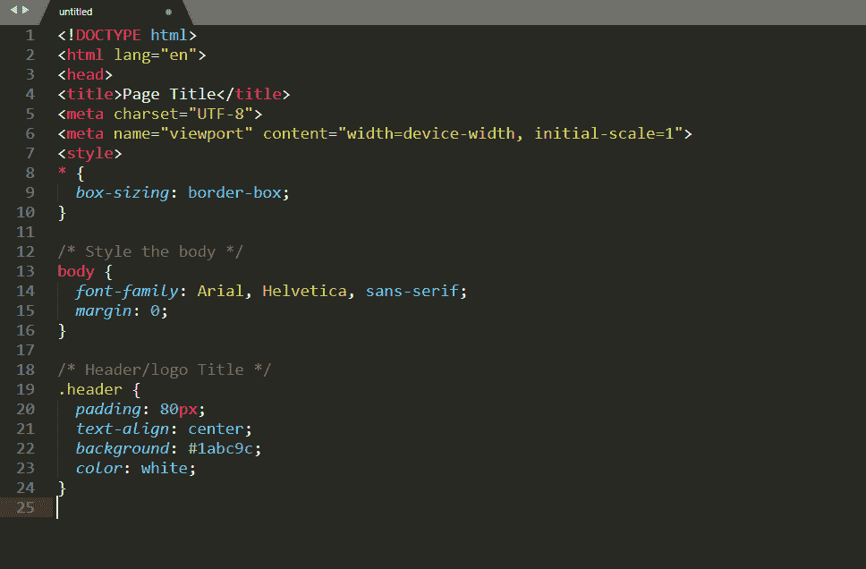
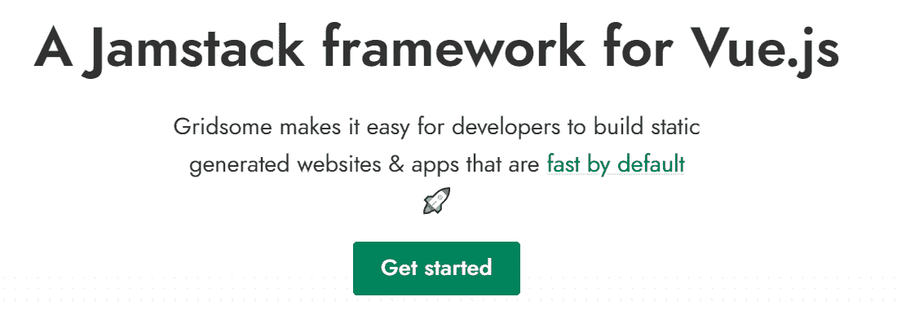
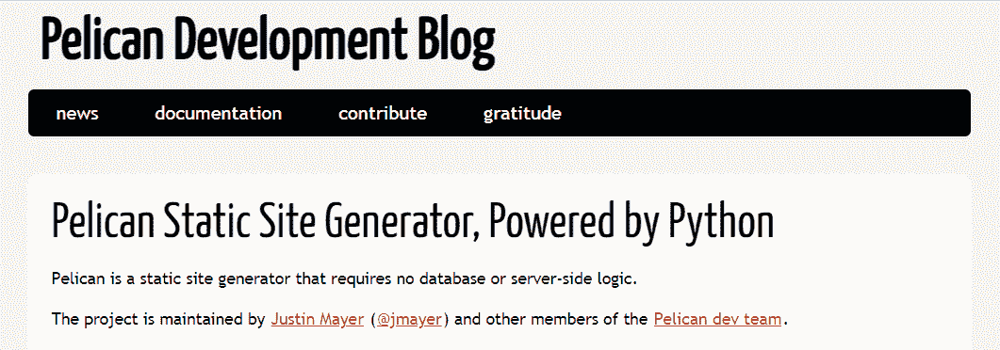

# 2022 年 5 大静态站点发电机(以及何时使用)

> 原文:[https://kinsta.com/blog/static-site-generator/](https://kinsta.com/blog/static-site-generator/)

许多网站页面是动态的。这意味着一个页面的内容会随着会话的不同而变化，这取决于谁在加载它，他们是登录还是注销，以及其他几个因素。

如果你的网站没有做到这一点，那么你就是在处理静态页面。

静态站点没有任何[动态内容](https://kinsta.com/knowledgebase/migrating-dynamic-wordpress-sites/)。在很多情况下，这可以转化为更快的加载时间和更好的网站整体性能。了解动态站点和页面的优缺点将有助于您决定何时使用它们是有意义的。

本文将介绍什么是静态站点生成器，以及何时应该使用它们。我们还将讨论静态站点的利与弊，并且我们将向您介绍目前您可以使用的五个顶级生成器。

我们开始吧！

## 什么是静态站点生成器？

从技术上来说，你不需要使用“生成器”或任何[内容管理系统(CMS)](https://kinsta.com/knowledgebase/content-management-system/) 来创建一个静态页面。如果你熟悉 [HTML 和 CSS](https://kinsta.com/knowledgebase/edit-wordpress-code/) ，你可以使用[你最喜欢的文本编辑器](https://kinsta.com/blog/best-text-editors/)毫不费力地创建一个页面:

文本编辑器中的一个 HTML 文档。

或者，你可以依靠 web 框架，如 [Bootstrap](https://getbootstrap.com/) 来访问高级的 [HTML](https://kinsta.com/blog/html-vs-html5/) 、 [CSS](https://kinsta.com/blog/wordpress-css/) 和 [JavaScript 库](https://kinsta.com/blog/javascript-libraries/)，你可以用它们来创建静态和动态网站:

自举主页。

静态站点生成器提供了第三种更简单的选择。它们通常包括各种各样的工具,可以轻松地创建网站、设计风格、创建内容、发布内容以及根据需要更新页面。

如果你对网站开发不熟悉，那么你可能需要像静态站点生成器这样的工具来帮助你实现你的愿景。

总的来说，大多数流行的生成器提供了广泛的功能，使您的工作更容易，包括:

*   对 Markdown 语言的支持:大多数生成器不包括[成熟的文本编辑器](https://kinsta.com/blog/wordpress-text-editor/)。相反，他们使用[降价语言](https://kinsta.com/blog/markdown-editor/)，有时甚至包括额外的定制降价语法。
*   **内置布局和模板选项:** [设计和 s](https://kinsta.com/blog/web-design-best-practices/) [设计一个网站](https://kinsta.com/blog/web-design-best-practices/)往往是最具挑战性的构建过程。这就是为什么生成器倾向于包含[内置模板和布局选项](https://kinsta.com/knowledgebase/what-is-a-wordpress-theme/)。
*   **支持多种类型的内容:**根据您使用的生成器，它应该支持各种类型的内容，比如博客文章、页面、[图库](https://kinsta.com/blog/wordpress-photo-gallery-plugins/)等等。
*   **内置搜索引擎优化功能:**没有合适的[搜索引擎优化(SEO)](https://kinsta.com/blog/what-does-seo-stand-for/) ，任何现代网站都不会成熟。如果你正在考虑——或者已经在使用——一个不提供 [SEO 特性](https://kinsta.com/blog/best-seo-plugins-for-wordpress/)或者附加组件的生成器，你最好换一个新工具。

需要注意的是，大多数静态网站生成器都假设你已经有了一个基本的网站开发背景。有些选项相对来说对初学者比较友好，但是它们仍然需要您熟悉一些概念，比如命令行、Markdown 语言等等。

## 为什么要使用静态站点生成器(利弊)

你可能会奇怪，既然有像 WordPress 这样的工具可用，为什么还会有人使用复杂的静态站点生成器。

这完全取决于具体情况的使用、个人偏好和性能。

在绝大多数情况下，静态网站的加载速度会比动态网站快得多。这是因为您的服务器必须处理的请求要少得多，而且不涉及数据库。每个访问者都会看到相同的页面，所有的数据都被嵌入到静态站点生成器输出的代码中。

一些开发者也更喜欢处理静态站点生成器，而不是打包了太多功能的复杂 CMS。站点生成器倾向于精简，在某些情况下，它们是高度模块化的。这意味着需要处理的臃肿问题更少，需要掌握的功能更少，尤其是如果您只对创建特定页面感兴趣的话。

## 静态网站与动态网站

当然，不是所有的网站都应该是静态的。那么，您如何知道什么时候这是满足您需求的正确方法呢？

以下是一些不一定需要动态的网站示例:

*   个人博客帖子
*   文档页面
*   [登陆页面](https://kinsta.com/blog/wordpress-landing-page-plugins/)
*   [投资组合页面](https://kinsta.com/blog/portfolio-website/)
*   宣传册网站

虽然静态网站的想法听起来可能有局限性，但是在页面上不引入任何动态元素的情况下，您可以做很多事情。

然而，任何网站[需要一个数据库](https://kinsta.com/knowledgebase/wordpress-database/)是不可能的。这意味着你不能使用静态网站生成器[来创建网上商店](https://kinsta.com/blog/woocommerce-tutorial/)，带有评论区的博客文章，带有用户注册的网站，等等。

如果你不需要动态功能，使用静态网站生成器将会给你带来比大多数即时可用的 CMS 更好的网站性能。

我们说“开箱即用”是因为你可以做很多事情来优化像 WordPress 这样的 CMS。根据我们的经验，一个[优化良好的 WordPress 网站](https://kinsta.com/learn/speed-up-wordpress/)可以和一个静态网站一样快(前提是你还拥有[出色的主机](https://kinsta.com/kinsta-alternatives/))。

如果你只是出于性能考虑而选择使用静态站点生成器，那么[考虑一些 CMS 选项](https://kinsta.com/cms-market-share/)可能是值得的。

另一方面，如果你确信你的网站不需要动态功能，剩下的就是找到合适的工具。

## 5 个最佳静态站点生成器

在我们讨论具体的静态站点生成器之前，值得一提的是，所有这些工具都是自托管的。要使用它们，你需要[找到一个主机提供商](https://kinsta.com/blog/managed-wordpress-hosting/)，他们可以为你设置它们或者给你命令行的访问权限。

考虑到这一点，让我们回顾一下 2022 年静态站点生成器的一些最佳选择。

### 1.吉基尔博士

杰基尔主页。

Jekyll 是最受欢迎的开源静态网站生成器之一——理由很充分。它是驱动 [GitHub Pages](https://pages.github.com/) 的软件，为静态网站提供免费托管。

本质上，Jekyll 是一个博客友好生成器。这个静态软件支持 Markdown，附带一个全面的分类系统，并支持[液体模板语言](https://shopify.github.io/liquid/)。

## 注册订阅时事通讯

### 想知道我们是怎么让流量增长超过 1000%的吗？

加入 20，000 多名获得我们每周时事通讯和内部消息的人的行列吧！

[Subscribe Now](#newsletter)

使用 Jekyll 的一些最受欢迎的网站包括 [Ruby on Rails](https://rubyonrails.org/) 、 [Sketch](https://www.sketch.com/) 和[面向开发者的 Spotify】。](https://developer.spotify.com/)

如果你想推出一个免费的静态网站，Jekyll 和 Github 页面可能是你的绝佳组合。

### 2.雨果

雨果主页。

Hugo 是一个开源的静态网站生成器，自称是一个“通用”框架。这是一种优雅的说法，你可以用 Hugo 来[建立广泛的网站](https://kinsta.com/blog/hugo-static-site/)，远远超出简单的博客和宣传册页面。

使用 Hugo，您可以以极快的速度生成页面，构建时间通常不到一秒。该软件使你能够在使用 [LiveReload](https://github.com/livereload/livereload-js) 时预览对页面的修改，并且它提供了强大的主题功能。

Hugo 使用模块化系统来帮助你建立静态网站。您有几个模块可供选择，包括内容、布局和数据。

一些使用 Hugo 的流行网站包括:Password 的文档页面、T2、Linode 的文档部分和 KeyCDN。

使用 Hugo，您可以在任何页面上组合多个模块，以获得您需要的确切功能。

### 3.网格体

grid some 静态站点生成器。

Gridsome 是一个强大的静态站点生成器。你可以用它来用现代工具创建页面，比如 [Vue.js](https://kinsta.com/blog/vue-js/) 和 [GraphQL](https://kinsta.com/blog/wordpress-revolution-with-graphql/) 。

您还可以使用 Gridsome 为 CMS 设置“head”。例如，您可以使用 Gridsome 生成静态页面，这些页面使用从 WordPress 中提取的数据，这是一个[“无头”CMS 设置](https://kinsta.com/blog/headless-wordpress/)。

无头设置的优点是，您可以获得使用静态页面的所有优点，同时还可以利用 CMS 的全部功能。换句话说，你可以用[访问数据库](https://kinsta.com/help/db-access/)，高级分类法，甚至是[成熟的文本编辑器](https://kinsta.com/blog/wordpress-tinymce-editor/)。

同样值得注意的是，Gridsome 提供了大量插件，您可以使用这些插件来扩展生成器的功能。如果有一个特性是框架没有提供的，那么很可能有一个插件可以实现它。

需要为你的 WordPress 站点提供超快的、可靠的、完全安全的托管服务吗？Kinsta 提供所有这些以及 WordPress 专家提供的 24/7 世界级支持。[查看我们的计划](https://kinsta.com/plans/?in-article-cta)

Gridsome 还是一个比较新的静态网站生成器。然而，已经使用这种软件的网站有两个很好的例子:智能城市博览会和 T2 格式。

正如你可能想象的那样，Gridsome 不像列表中的其他工具那样对初学者友好。你需要一些网络开发经验来充分利用这个软件。

如果你已经熟悉 Vue.js，Gridsome 是你可以使用的最好的静态站点生成器之一。

### 4.电梯，电梯

第十一个静止的地点发生器。

相对而言，Eleventy 是静态网站生成器领域的新手。这个特殊的软件依赖于 [JavaScript](https://kinsta.com/knowledgebase/what-is-javascript/) 和 [Node.js](https://kinsta.com/knowledgebase/what-is-node-js/) 。这意味着您需要对 JavaScript 语言有一定程度的了解才能有效地使用它。

如果你习惯使用 JavaScript，Eleventy 会奖励你一些静态站点生成器中最好的性能。

这个工具支持多种模板语言，但在其核心，Eleventy 依赖于 Liquid，这使它在这方面类似于 Jekyll。除了 Liquid，Eleventy 还可以为静态页面解析其他几种语言，包括 Markdown 和 JavaScript。

此外，随着像 Chrome 开发者 T1 和 T2 Netlify T3 这样的网站使用 Eleventy，它变得越来越受欢迎。

根据我们的经验，开始使用 Eleventy 可能有点困难，因为它的文档仍在编写中。然而，如果您正在寻找一个精益的静态站点生成器，这种努力是非常值得的。

### 5.鹈鹕

鹈鹕静止地点发电机。

[Pelican](https://blog.getpelican.com/) 是一个鲜为人知的静态网站生成器，是关于 Python 的[。如果您熟悉 Python，您可以使用该软件通过 Markdown 和 reStructuredText 创建静态页面。](https://kinsta.com/blog/python-object-oriented-programming/)

这个软件附带了一套你可以定制的主题，它包含了多语言支持。此外，Pelican 使您能够[从 WordPress](https://kinsta.com/knowledgebase/wordpress-export-users/) 、RSS 提要和其他几个第三方来源导入数据，这使得它成为一个无头设置的绝佳选择。

Pelican 提供了一组健壮的插件，您可以设置这些插件来扩展生成器的功能。总的来说，它是我们列表中最精简的静态站点生成器之一，但是如果你已经知道或者[想要学习 Python](https://kinsta.com/blog/python-tutorials/) ，它是一个极好的选择。
T3】

## 选择静态站点生成器时需要考虑什么

静态站点生成器的选择主要取决于三个因素。让我们来分解一下它们是什么:

1.  **生成器使用哪种语言:**一些静态站点生成器严重依赖 JavaScript 和其他库。根据您使用的生成器，您可能需要熟悉它的编程语言。
2.  易用性:如果你是一名经验丰富的 web 开发人员，你应该能够相对容易地使用任何静态站点生成器。然而，如果你正在做你的第一个项目，你会想要选择一个[初学者友好的](https://kinsta.com/blog/gatsby-wordpress/)发电机。
3.  它支持的内容类型:大多数流行的静态站点生成器将使你能够创建各种类型的页面。然而，其他人则专注于特定类型的内容，如博客文章。
4.  **现有的软件社区:**总的来说，我们建议您使用拥有成熟用户社区的工具。这样，您可以更轻松地解决问题并获得问题的答案。

我们在这里看到的大多数静态站点生成器都要求您至少对 web 开发基础有所了解。如果这听起来太多了，你最好使用像 WordPress 这样的用户友好的 CMS。

一个受管理的 WordPress 网站可以和一个静态网站一样快。此外，CMS 易于使用(即使您正在进行第一个项目)。

[Static sites don't have any dynamic content, which can mean faster loading times and better overall site performance. ⚡️ Learn more in this guide 👩‍💻Click to Tweet](https://twitter.com/intent/tweet?url=https%3A%2F%2Fkinsta.com%2Fblog%2Fstatic-site-generator%2F&via=kinsta&text=Static+sites+don%27t+have+any+dynamic+content%2C+which+can+mean+faster+loading+times+and+better+overall+site+performance.+%E2%9A%A1%EF%B8%8F+Learn+more+in+this+guide+%F0%9F%91%A9%E2%80%8D%F0%9F%92%BB&hashtags=SitePerformance%2CWordPress)

## 摘要

很多人认为静态网站是旧互联网的残余。然而，静态页面对任何网站都有好处，因为它们通常比动态页面表现更好。根据你选择的生成器，你甚至可以建立一个具有静态页面输出的无头 WordPress 网站。

如果你正在考虑使用静态站点生成器，以下是我们的五大建议:

1.  Jekyll **:** 一个博客友好的静态站点生成器，可以用于 Github 页面。
2.  **雨果** **:** 一种基于模块的静止现场发生器，具有极快的性能。
3.  **Gridsome** **:** 这个可伸缩的生成器使用 Vue.js 来帮助你创建静态页面。
4.  **十一** **:** 如果你是 JavaScript 和 [Node.js](https://kinsta.com/blog/node-js-apps/) 的粉丝，这个生成器是完美的。
5.  **Pelican** **:** 一个精简的基于 Python 的静态站点生成器。

你是否在考虑为你的下一个 web 项目尝试一个静态站点生成器？请在下面的评论区告诉我们吧！

* * *

让你所有的[应用程序](https://kinsta.com/application-hosting/)、[数据库](https://kinsta.com/database-hosting/)和 [WordPress 网站](https://kinsta.com/wordpress-hosting/)在线并在一个屋檐下。我们功能丰富的高性能云平台包括:

*   在 MyKinsta 仪表盘中轻松设置和管理
*   24/7 专家支持
*   最好的谷歌云平台硬件和网络，由 Kubernetes 提供最大的可扩展性
*   面向速度和安全性的企业级 Cloudflare 集成
*   全球受众覆盖全球多达 35 个数据中心和 275 多个 pop

在第一个月使用托管的[应用程序或托管](https://kinsta.com/application-hosting/)的[数据库，您可以享受 20 美元的优惠，亲自测试一下。探索我们的](https://kinsta.com/database-hosting/)[计划](https://kinsta.com/plans/)或[与销售人员交谈](https://kinsta.com/contact-us/)以找到最适合您的方式。