# 如何用 Hugo 建立一个超快的静态网站

> 原文:[https://kinsta.com/blog/hugo-static-site/](https://kinsta.com/blog/hugo-static-site/)

Hugo 是一个静态站点生成器(SSG)，用 go(又名 Golang)编写，这是一种高性能的编译编程语言，通常用于开发后端应用程序和服务。

今天，Hugo 能够在几秒钟内生成大多数网站(每页少于 1 毫秒)。这解释了为什么 Hugo 宣称自己是“世界上最快的网站建设框架”

在本文中，我们将了解 Hugo 的历史，是什么让它如此之快，以及如何开始构建自己的 Hugo 静态站点。

 ## 雨果是什么？又为什么受欢迎？

[](https://kinsta.com/wp-content/uploads/2021/10/hugo.png)

Hugo’s website homepage.


史蒂夫法兰克王国最初于 2013 年开发了 Hugo 静态站点发生器，比约恩埃里克彼得森于 2015 年接任该项目的首席开发者。Hugo 是一个开源项目，这意味着任何人都可以查看和改进它的代码。

作为一个静态站点生成器，Hugo 获取 Markdown 内容文件，通过主题模板运行它们，[生成 HTML 文件](https://kinsta.com/blog/wordpress-vs-static-html/),你可以很容易地在线部署这些文件——而且这一切都做得非常快。

到 2021 年，如果没有数百个静态发电机，也有几十个。每个静态站点生成器都有其吸引力。Jekyll 在 Ruby 开发人员中很受欢迎，虽然它没有其他选项快，但它是第一个被广泛采用的静态站点生成器。 [Gatsby](https://kinsta.com/blog/gatsby-wordpress/) 是另一个流行的 SSG，非常适合开发功能动态的静态可部署站点。


> 需要在这里大声喊出来。Kinsta 太神奇了，我用它做我的个人网站。支持是迅速和杰出的，他们的服务器是 WordPress 最快的。
> 
> <footer class="wp-block-kinsta-client-quote__footer">
> 
> 
> 
> <cite class="wp-block-kinsta-client-quote__cite">Phillip Stemann</cite></footer>

[View plans](https://kinsta.com/plans/)

那么，在这么多 SSG 中，是什么让 Hugo 脱颖而出呢？

[Hugo bills itself as 'the world's fastest framework for building websites' ⚡️ so if you're looking for a way to build a static site quickly, start here ⬇️Click to Tweet](https://twitter.com/intent/tweet?url=https%3A%2F%2Fkinsta.com%2Fblog%2Fhugo-static-site%2F&via=kinsta&text=Hugo+bills+itself+as+%27the+world%27s+fastest+framework+for+building+websites%27+%E2%9A%A1%EF%B8%8F+so+if+you%27re+looking+for+a+way+to+build+a+static+site+quickly%2C+start+here+%E2%AC%87%EF%B8%8F&hashtags=StaticSite%2CGolang)

### 雨果很快

就原始性能而言，Hugo 是世界上最好的静态站点生成器。与哲基尔相比，雨果被林业证明要快 35 倍。同样，Hugo 可以在 10 秒钟内完成一个 10，000 页的网站，而 Gatsby 要花半个多小时才能完成这个任务。Hugo 不仅在构建时间上是最快的 SSG，而且安装也很快。

Hugo 作为一个自包含的可执行文件发布，不像 Jekyll、Gatsby 和其他 SSG 需要安装依赖包管理器。这意味着您可以立即下载并使用 Hugo，而不必担心软件依赖性。

### Hugo 中的模板很容易

在 SSG 的行话中，“模板化”指的是在 HTML 页面中为动态内容插入添加占位符的过程。要访问页面的标题，可以使用`{{ .Title }}`变量。因此，在 Hugo HTML 模板中，常见的是将`{{ .Title }}`包装在 H1 标签中，如下所示:

```
<h1>{{ .Title }}</h1>
```

在构建时，Hugo 会自动获取内容文件中的标题，并将标题插入到两个`<h1>`标签之间。Hugo 有各种内置的模板变量，你甚至可以编写自定义函数在构建时处理数据。对于模板，Hugo 使用 go 内置的`html/template`和`text/template`库。这有助于减少应用程序膨胀，因为 Hugo 不需要为模板安装第三方库。

## 如何安装 Hugo

Hugo 以编译后的可执行文件的形式发布，这意味着您不必为了开始而下载和管理许多依赖项。它适用于 macOS、Windows 和 Linux。


### 重要的

下面的安装说明需要一个包管理器，它会为您下载 Hugo 可执行文件。如果您更喜欢从其源代码构建 Hugo，请参考[Hugo 官方文档](https://gohugo.io/getting-started/installing/#source)。


### 如何在 macOS 和 Linux 上安装 Hugo

macOS 和 Linux 的推荐安装方法需要 Homebrew，这是一个用于安装和更新应用程序的软件包管理器。如果您还没有安装 Homebrew，您可以在[终端](https://kinsta.com/blog/ssh-commands/)中运行下面的命令来安装它:

```
/bin/bash -c "$(curl -fsSL [https://raw.githubusercontent.com/Homebrew/install/HEAD/install.sh](https://raw.githubusercontent.com/Homebrew/install/HEAD/install.sh))"
```

安装完 Homebrew 后，运行下面的命令来安装 Hugo:

```
brew install hugo
```

### 如何在 Windows 上安装 Hugo

对于 Windows 用户，可以使用 Chocolatey 或 Scoop 软件包管理器安装 Hugo。由于安装 Chocolatey 和 Scoop 的说明比家酿复杂一些，我们建议参考他们的官方文档页面[这里](https://chocolatey.org/install)和[这里](https://scoop.sh/)。

安装 Chocolatey 或 Scoop 之后，您可以使用以下命令之一安装 Hugo(取决于您的软件包管理器):

```
choco install hugo-extended -confirm
```

```
scoop install hugo-extended
```

### 如何验证 Hugo 安装正确

要验证 Hugo 是否已正确安装，请运行以下命令:

```
hugo version
```

这个终端命令应该输出关于当前安装的 Hugo 版本的信息，如下所示:

```
hugo v0.85.0+extended darwin/arm64 BuildDate=unknown
```

## Hugo 命令和配置

在我们开始用 Hugo 创建静态站点之前，让我们先熟悉一下它的各种 [CLI](https://kinsta.com/blog/wp-cli/) 命令和配置文件参数。

### Hugo CLI 命令

*   `hugo check`–运行各种验证检查
*   `hugo config`–显示 Hugo 站点的配置
*   `hugo convert`–将内容转换成不同的格式
*   `hugo deploy`–将您的站点部署到云提供商
*   `hugo env`–显示 Hugo 版本和环境信息
*   `hugo gen`–提供对各种发电机的访问
*   `hugo help`–显示关于命令的信息
*   `hugo import`–允许您从其他位置导入站点
*   `hugo list`–显示各种内容类型的列表
*   `hugo mod`–提供对各种模块助手的访问
*   `hugo new`–让您为自己的网站创建新内容
*   `hugo server`–启动本地开发服务器
*   `hugo version`–显示当前 Hugo 版本

Hugo CLI 也有各种标志来指定一些命令的附加选项。要查看 Hugo 标志的完整列表(有很多)，我们建议使用`hugo help`命令显示所有可用标志的列表。

### Hugo 配置文件

Hugo 的配置文件支持三种格式:YAML、TOML 和 JSON。同样，Hugo 的配置文件是 **config.yml** 、 **config.toml** 或者 **config.json** ，你可以在 Hugo 项目的根目录下找到。

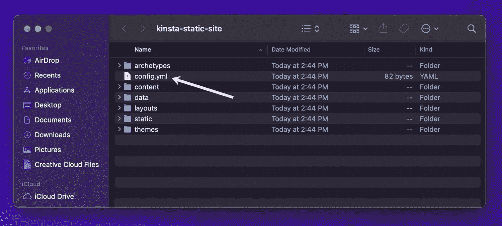

Hugo configuration file.


以下是 YAML 格式的典型 Hugo 配置文件:

```
DefaultContentLanguage: en

theme:

- kinsta-static-site

contentdir: content

layoutdir: layouts

publishdir: public

paginate: 5

title: Kinsta Static Site

description: "This is a static site generated with Hugo!"

permalinks:

post: :slug/

page: :slug/

tags: "tag/:slug/"

author: "author/:slug/"
```

如果你以前使用过 [WordPress 或者另一个 CMS](https://kinsta.com/blog/cms-software/) ，一些配置选项可能对你来说很熟悉。例如，`kinsta-static-site`是站点主题的名称，`Kinsta Static Site`是 SEO 元标题，`paginate`(每页的帖子数)是`5`。

Hugo 有几十个配置选项，你都可以在[Hugo 官方文档](https://gohugo.io/getting-started/configuration/)中探索。如果您在开发 Hugo 站点时需要进行任何全局配置更改，您可能需要编辑这个配置文件。

## 如何创建一个 Hugo 网站

既然我们已经学习了如何安装和使用 Hugo CLI 以及 Hugo 配置文件的基础知识，让我们创建一个新的 Hugo 站点。

要创建 Hugo 站点，请使用下面的命令(如果您愿意，可以随意将 **my-hugo-site** 更改为其他名称):

```
hugo new site my-hugo-site
```

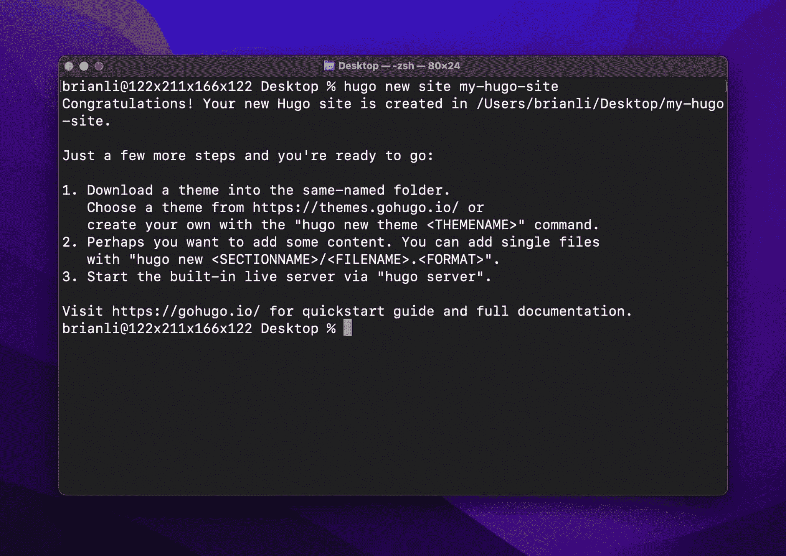

Create a new Hugo site.


接下来，导航到站点文件夹，您应该看到以下文件和文件夹: **config.toml** 文件、**原型**文件夹、**内容**文件夹、**布局**文件夹、**主题**文件夹、**数据**文件夹和**静态**文件夹。让我们快速浏览一下这些文件和文件夹是什么。

### Hugo 的 config.toml 文件

正如我们上面强调的，Hugo 的主配置文件包含了你的站点的全局设置。

### 雨果的原型文件夹

**原型**文件夹是存储 Markdown 格式的内容模板的地方。如果您的站点有多种内容格式，原型尤其有用。使用 Hugo 原型，您可以为站点上的每种内容类型创建一个模板。这使您可以用所有必要的配置设置预先填充生成的降价文件。

例如，如果您有一个用于显示播客剧集的[播客](https://kinsta.com/blog/what-is-a-podcast/)内容类型，您可以在`archetypes/podcast.md`中创建一个包含以下内容的新原型:

```
---

title: "{{ replace .Name "-" " " | title }}"

date: {{ .Date }}

description: ""

season:

episode:

draft: true

---
```

有了这个 podcast 原型，您就可以使用下面的命令来创建一个新帖子:

```
hugo new podcast/s1e6_interview-with-kinsta-ceo.md
```

现在，如果您打开新创建的帖子，您应该会看到:

```
---

title: "Interview with Kinsta CEO"

date: 2021-05-20T13:00:00+09:00

description: ""

Season: 1

episode: 6

draft: true

---
```

如果没有原型，您将不得不为您创建的每个新帖子手动指定前沿问题参数。虽然最初原型可能看起来复杂且不必要，但从长远来看，它们最终会为您节省大量时间。

### Hugo 的内容文件夹

**内容**文件夹是你实际发布内容的地方。Hugo 支持 [Markdown 和 HTML 格式](https://kinsta.com/blog/markdown-editor/)，Markdown 因其易用性而成为更受欢迎的选项。除了作为帖子的通用存储空间，您还可以使用**内容**文件夹来进一步组织帖子内容。

Hugo 将 **content** 文件夹中的每个顶级目录都视为一个内容节。Hugo 中的内容部分类似于 WordPress 中的[自定义帖子类型。例如，如果你的站点有帖子、页面和播客，你的内容文件夹将会有**帖子**、**页面**和**播客**目录，这些不同帖子类型的内容文件将存放在那里。](https://kinsta.com/blog/wordpress-custom-post-types/)

### Hugo 的布局文件夹

**布局**文件夹包含定义站点结构的 HTML 文件。在某些情况下，你可能会看到一个没有**布局**文件夹的 Hugo 站点，因为它不一定要在项目的根目录中，而是可以驻留在一个主题文件夹中。

与使用 PHP 进行模板化的 WordPress 主题类似，Hugo 模板由基本 HTML 和 Golang 内置的`html/template`和`text/template`库提供的额外动态模板组成。生成站点 HTML 标记所需的各种 HTML 模板文件都在**布局**文件夹中。

### Hugo 的主题文件夹

对于那些喜欢以更加独立的方式存储模板文件和资源的网站，Hugo 支持一个**主题**文件夹。Hugo 主题与 [WordPress 主题](https://kinsta.com/knowledgebase/what-is-a-wordpress-theme/)相似，它们存储在一个主题目录中，包含了主题运行所需的所有模板。

虽然一些 Hugo 用户喜欢将主题相关的文件保存在项目的根目录中，但是将这些文件存储在 **themes** 文件夹中可以更容易地管理和共享。

### 雨果数据文件夹

Hugo 的 **data** 文件夹是你存储补充数据(JSON、YAML 或 TOML 格式)的地方，这些数据是生成你的站点页面所需要的。数据文件有利于较大的数据集，这些数据集可能很难直接存储在内容或模板文件中。

例如，如果您想创建一个从 1960 年到 2020 年的美元通货膨胀率列表，大约需要 80 行来表示数据(一行代表一年)。您可以在 **data** 文件夹中创建数据，并用必要的信息填充它，而不是将这些数据直接放入内容或模板文件中。

### Hugo 静态文件夹

Hugo 的 **static** 文件夹是存储不需要任何额外处理的静态资产的地方。**静态**文件夹通常是 Hugo 用户存储图像、[字体](https://kinsta.com/blog/web-safe-fonts/)、DNS 验证文件等等的地方。当 Hugo 站点被生成并保存到一个文件夹中以便于部署时，**静态**文件夹中的所有文件都被原样复制。

如果你想知道为什么我们没有提到 JavaScript 或 CSS 文件，那是因为在网站开发过程中，它们通常是通过管道动态处理的。在 Hugo 中，JavaScript 和 CSS 文件通常存储在**主题**文件夹中，因为它们需要额外的处理。

## 如何向 Hugo 站点添加主题

下载并安装一个预制的主题是开始使用 Hugo 的好方法。Hugo 主题有各种形状和大小，其中许多可以在官方 Hugo 主题库中免费获得。让我们在 Hugo 网站上安装流行的海德主题。

首先，在“终端”中导航到项目的主题文件夹:

```
cd <hugo-project-directory>/themes/
```

接下来，使用 Git 将 Hyde 主题克隆到项目的 **themes** 目录中。

```
git clone https://github.com/spf13/hyde.git
```

接下来，将下面一行添加到您的 **config.toml** 文件中，以激活 Hyde 主题:

```
theme = "hyde"
```

至此，Hyde 主题已经安装并配置完毕。下一步是启动 Hugo 的内置开发 web 服务器，在您的 web 浏览器中查看站点。

## 如何预览 Hugo 网站

Hugo 附带了一个用于开发目的的集成网络服务器，这意味着你不需要安装像 Nginx 或 Apache 这样的第三方网络服务器就可以[在本地查看你的网站](https://kinsta.com/blog/install-wordpress-locally/)。

要启动 Hugo 的 web 服务器，请在项目的根目录下运行以下命令:

```
hugo server -D
```

然后 Hugo 会建立你网站的页面，并在`http://localhost:1313/`发布:


Hugo local development server.


如果你在你的网络浏览器中访问 [URL](https://kinsta.com/knowledgebase/what-is-a-url/) ，你应该会看到你的 Hugo 网站有海德主题:


Hugo site displaying with the Hyde theme.


默认情况下，Hugo 的本地开发服务器会观察变化并自动重建站点。由于 Hugo 的构建速度如此之快，您的网站更新可以近乎实时地看到——这在静态网站生成器世界中是很少见的。为了证明这一点，让我们在 Hugo 中创建我们的第一个帖子。

## 如何向 Hugo 网站添加内容

向 Hugo 网站添加内容与 WordPress 或 Ghost 等成熟的 CMS 非常不同。Hugo 没有内置的 CMS 层来管理你的内容。相反，你应该以你认为合适的方式来管理和组织事情。

换句话说，在 Hugo 中没有明确的“正确”方法来进行内容管理。在这一部分，我们将分享一种添加和管理内容的方法，但是随着您对 Hugo 越来越熟悉，您可以随意更改内容。

### Hugo 中的内容部分

在 Hugo 中，您可以随意使用的第一个内容组织工具是**内容**部分。Hugo 中的内容部分类似于 WordPress 中的[帖子类型——你不仅可以将其用作内容过滤器，还可以在创建自定义主题时将其用作标识符。](https://kinsta.com/blog/wordpress-custom-post-types/)

例如，如果您有一个 **blog** content section 文件夹，您可以使用它来存储您的所有博客文章，并呈现一个仅适用于博客文章的特定页面模板。

### 如何在 Hugo 中添加帖子

记住这一点，让我们为博客文章创建一个内容部分，并添加一些内容。在项目的**内容**文件夹中创建一个名为 **posts** 的新文件夹——这是内容部分。

让我们通过创建一个 **2021** 文件夹，在**帖子**文件夹中创建另一个组织层。此时，您的**内容**目录应该是这样的:

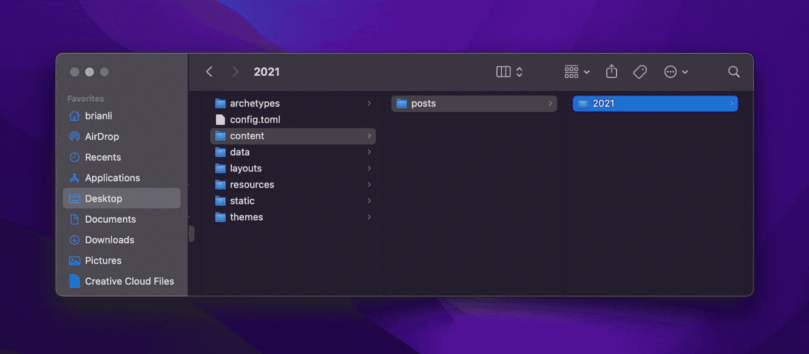

Hugo content directory.


现在，让我们创建我们的第一个帖子。正如我们前面讨论的，Hugo 支持 Markdown 和 HTML 内容文件。一般来说，最好坚持使用减价文件，因为它们更容易编写、格式化和阅读。

在 **content/posts/2021** 文件夹中，创建一个以`.md`(Markdown 文件扩展名)结尾的新文件。您可以随意命名该文件，但是推荐的 Hugo 内容文件命名语法是**YYYY-MM-DD-a-sample-post . MD**。

除了手动创建内容文件之外，您还可以使用 Hugo CLI 通过以下命令创建一个新的 post(确保从您的项目目录运行该命令):

```
hugo new posts/2021/2021-08-30-a-sample-post.md
```

请注意上面路径中的**内容**文件夹是如何丢失的。这是因为 Hugo 默认假设所有内容文件都将进入**内容**文件夹。

如果打开新创建的内容文件，应该会在文档顶部看到几行元数据，如下所示:

```
---

title: "2021 08 30 a Sample Post"

date: 2021-08-30T13:44:28+09:00

draft: true

---
```

这种在 YAML 格式化的元数据被称为“前端内容”使用 Hugo CLI 的一个显著优点是自动生成的前台内容。最重要的是帖子的唯一数据(帖子名称、数据、草稿状态、标签、类别等。)被存储。可以使用[原型](https://gohugo.io/content-management/archetypes/)在每个部分的基础上配置封面的默认格式。

现在让我们给帖子添加一些文本。写帖子的时候，一定要确保你的内容在前面，就像这样:

 ## 注册订阅时事通讯


### 想知道我们是怎么让流量增长超过 1000%的吗？

加入 20，000 多名获得我们每周时事通讯和内部消息的人的行列吧！

[Subscribe Now](#newsletter)

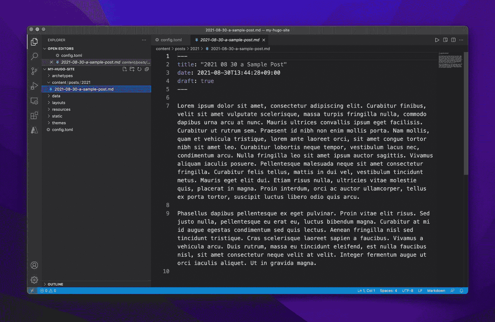

Blog post in Hugo.


一旦您保存了内容文件，您应该会看到 Hugo 在终端中重建了您的站点。在下面的截图中，你可以看到 Hugo 在 22 毫秒内重建了整个网站！

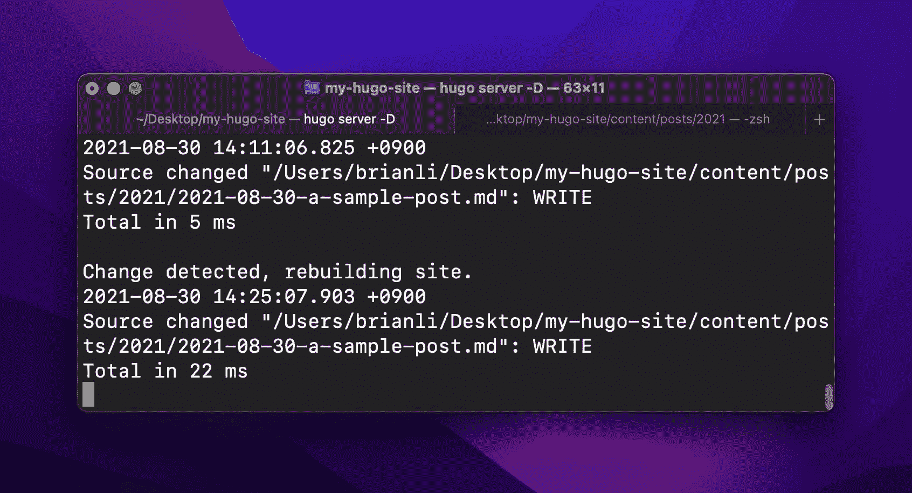

Hugo site rebuild.


如果你在浏览器中访问 Hugo 网站，你应该会看到新的帖子。

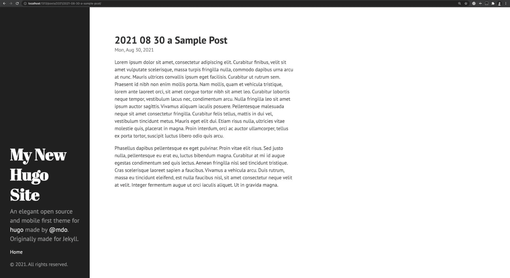

Hugo site with a post.


### 如何在 Hugo 中添加页面

现在我们已经在 Hugo 站点上添加了一篇文章，让我们添加一个页面。包括 WordPress 在内的大多数内容管理系统都区分帖子和页面。通常，一篇文章是一段有日期的内容，而一个页面由常青树或静态内容组成。

要创建一个页面，我们首先需要一个**页面**内容部分。为此，在 Hugo 的**内容**文件夹中创建一个名为**页面**的文件夹。然后，使用下面的命令向您的站点添加一个新的“关于”页面:

```
hugo new pages/about.md
```

请注意页面的命名约定与文章的不同之处。与文章不同，页面不依赖于特定的日期，所以没有必要在文件名中包含创建日期。

现在，让我们向“关于”页面添加一些文本:

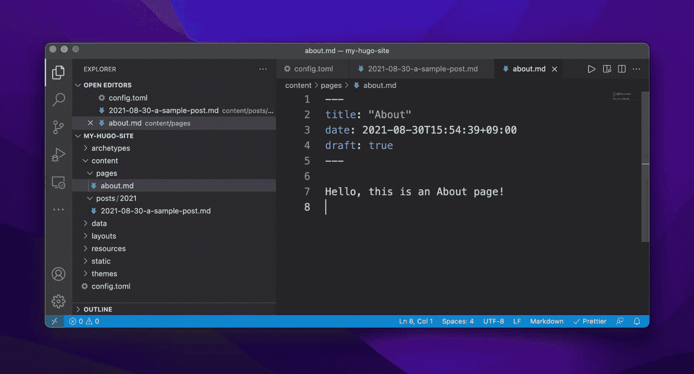

About page in Hugo.


此时，您应该会在 web 浏览器中看到“关于”页面:


About page in the web browser.


现在我们有了两个内容部分——文章和页面——让我们看看如何对站点进行一些定制，比如编辑标题和描述、将 About 页面添加到侧边栏菜单、更改永久链接的格式以及从文章提要中删除页面。

### 如何更改网站标题和描述

更改站点标题和描述的确切方法取决于您的站点配置和/或活动主题。在 Hyde 主题的情况下，可以在 Hugo 配置文件( **config.toml** )中更改站点标题和描述。

我们知道这一点是因为下面的主题代码呈现了侧栏:

```


<div class="container sidebar-sticky">

<div class="sidebar-about">

<a href="{{ .Site.BaseURL }}"><h1>{{ .Site.Title }}</h1></a>

<p class="lead">

{{ with .Site.Params.description }} {{.}} {{ else }}An elegant open source and mobile first theme for <a href="http://hugo.spf13.com">hugo</a> made by <a href="http://twitter.com/mdo">@mdo</a>. Originally made for Jekyll.{{end}}

</p>

</div>

<nav>

<ul class="sidebar-nav">

<li><a href="{{ .Site.BaseURL }}">Home</a> </li>

{{ range .Site.Menus.main -}}

<li><a href="{{.URL}}"> {{ .Name }} </a></li>

{{- end }}

</ul>

</nav>

<p>{{ with .Site.Params.copyright }}{{.}}{{ else }}© {{ now.Format "2006"}}. All rights reserved. {{end}}</p>

</div>


```

需要重点关注的两个部分是:

```
{{ .Site.Title }}
```

还有…

```
{{ with .Site.Params.description }} {{.}} {{ else }}An elegant open source and mobile first theme for <a href="http://hugo.spf13.com">hugo</a> made by <a href="http://twitter.com/mdo">@mdo</a>. Originally made for Jekyll.{{end}}
```

手柄`{{ }}`是 Hugo 模板引擎的一部分，允许在渲染页面中动态生成数据。例如，`{{ .Site.Title }}`指示 Hugo 检查 **config.toml** 文件，并获取映射到 **Title** 键的值。

由于 Hugo 的默认配置使用**我的新 Hugo 站点**作为站点标题，这就是侧边栏显示的内容。如果我们把 **config.toml** 中的站点标题改成别的，这个变化也会反映到前端。

让我们继续将 **config.toml** 中的标题参数从**我的新 Hugo 站点**更改为 **Kinsta 的 Hugo 站点**。

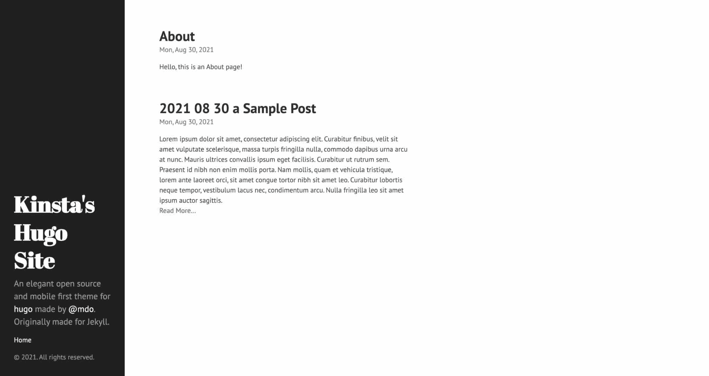

Changing the site title in Hugo.


转到站点描述，您可以看到 Hugo 的模板引擎支持条件逻辑。翻译成简单的英语，下面的代码指示 Hugo 检查 **config.toml** 文件中的**描述**键是否被赋予了**参数**值。如果没有，这里有一个默认的字符串来代替。

```
{{ with .Site.Params.description }} {{.}} {{ else }} An elegant open source and mobile first theme for <a href="http://hugo.spf13.com">hugo</a> made by <a href="http://twitter.com/mdo">@mdo</a>. Originally made for Jekyll.{{end}}
```

由于我们没有在 **config.toml** 文件中配置描述，Hugo 默认呈现“一个优雅的开源和移动优先的 Hugo 主题，由@mdo 制作。最初是为哲基尔制造的。”

现在让我们从以下位置更新我们的 **config.toml** 文件:

```
baseURL = "http://example.org/"

languageCode = "en-us"

title = "Kinsta's Hugo Site"

theme = "hyde"
```

收件人:

```
baseURL = "http://example.org/"

languageCode = "en-us"

title = "Kinsta's Hugo Site"

theme = "hyde"

[params]

description = "Kinsta is a premium managed WordPress hosting company."
```

不出所料，这些变化现在也可以在前端看到了:

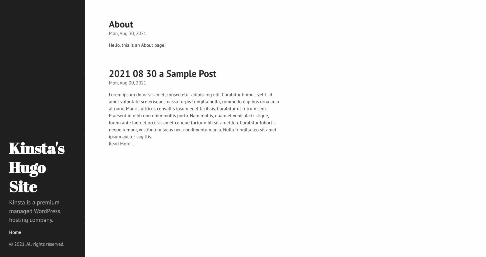

Change the Hugo site description.


### 如何从帖子摘要中删除页面

在大多数博客上，主页上的帖子提要只显示帖子是很常见的。默认情况下，Hyde 主题包括文章提要中的所有内容文件。要改变这种行为，您需要编辑**index.html**模板中的`range`函数，它将生成主页。

Hugo 的`range`函数遍历一组定义好的条目，然后用数据做*一些*的事情。默认情况下，海德主题的**index.html**模板覆盖 **.Site.RegularPages** 并在呈现 HTML 之前过滤掉永久链接、文章标题和文章摘要等数据。

由于`.Site.RegularPages`包含 Hugo 上的所有常规页面，包括帖子和页面，所以呈现了“About”页面。通过将`range`项更改为`.Site.RegularPages "Section" "posts"`，我们可以指示 Hugo 只过滤**帖子**部分中的常规页面——我们之前创建的**帖子**文件夹中的内容文件。

需要为你的 WordPress 站点提供超快的、可靠的、完全安全的托管服务吗？Kinsta 提供所有这些以及 WordPress 专家提供的 24/7 世界级支持。[查看我们的计划](https://kinsta.com/plans/?in-article-cta)

现在，让我们通过编辑以下模板来进行更改:

```
{{ define "main" -}}

<div class="posts">

{{- range .Site.RegularPages -}}

<article class="post">

<h1 class="post-title">

<a href="{{ .Permalink }}">{{ .Title }}</a>

</h1>

<time datetime="{{ .Date.Format "2006-01-02T15:04:05Z0700" }}" class="post-date">{{ .Date.Format "Mon, Jan 2, 2006" }}</time>

{{ .Summary }}

{{ if .Truncated }}

<div class="read-more-link">

<a href="{{ .RelPermalink }}">Read More…</a>

</div>

{{ end }}

</article>

{{- end }}

</div>

{{- end }}
```

对此:

```
{{ define "main" -}}

<div class="posts">

{{- range where .Site.RegularPages "Section" "posts" -}}

<article class="post">

<h1 class="post-title">

<a href="{{ .Permalink }}">{{ .Title }}</a>

</h1>

<time datetime="{{ .Date.Format "2006-01-02T15:04:05Z0700" }}" class="post-date">{{ .Date.Format "Mon, Jan 2, 2006" }}</time>

{{ .Summary }}

{{ if .Truncated }}

<div class="read-more-link">

<a href="{{ .RelPermalink }}">Read More…</a>

</div>

{{ end }}

</article>

{{- end }}

</div>

{{- end }}
```

做了这一更改后，主页将只显示类似这样的帖子:


Display posts only on the home page.


### 如何在雨果中使用分音

Hugo 最强大的模板特性之一是 partials——HTML 模板嵌入到另一个 HTML 模板中。分部允许跨不同模板文件重用代码，而无需管理每个文件中的代码。

例如，经常可以看到不同的页面部分(页眉、页脚等。)在它们单独的部分文件中，然后在主题的**baseof.html**模板文件中调用它们。

在阿南刻主题的**baseof.html**文件中，您可以在第 18 行看到一个片段的例子。

在这种情况下，`{{ partial "site-style.html" . }}`指示 Hugo 用 **/layouts/partials** 文件夹中的**site-style.html**替换第 18 行的内容。如果我们导航到**/partials/site-style . html**，我们会看到[后面的代码](https://github.com/theNewDynamic/gohugo-theme-ananke/blob/master/layouts/partials/site-style.html):

```
{{ with partialCached "func/style/GetMainCSS" "style/GetMainCSS" }}


{{ end }}

{{ range site.Params.custom_css }}

{{ with partialCached "func/style/GetResource" . . }}{{ else }}


{{ end }}

{{ end }}
```

通过将这些代码卸载到一个单独的文件中，**baseof.html**模板文件可以保持有序，易于阅读。虽然分部项不是必需的，特别是对于基本项目，但是对于具有更复杂功能的大型项目来说，它们是很方便的。

### 如何在 Hugo 中使用短代码

Hugo shortcodes 类似于 partials，因为它们允许跨各种页面重用代码。短代码是位于 **/layouts/shortcodes** 文件夹中的 HTML 文件。主要区别在于部分代码适用于 HTML 模板，而短代码适用于减价内容页面。

在 Hugo 中， [shortcodes](https://kinsta.com/blog/wordpress-shortcodes/) 允许你开发功能模块，你可以在整个网站的页面中使用，而不需要管理每个页面的代码变化。

如果你经营一个博客，很可能你需要浏览你文章的主体内容来更新当年的参考文献。根据你的站点上有多少帖子，这项任务可能需要很长时间！

通过在内容文件中使用 Hugo shortcode，您再也不用担心更新年份参考了！

让我们首先在**/layouts/short codes/current _ year . html**中创建一个短代码，内容如下:

```
{{ now.Format "2006" }}
```

可以使用以下语法将短代码嵌入到帖子中-``。在我们的例子中，我们可以像这样用``来调用`current_year.html`短代码:

```
---

title: "2021 08 30 a Sample Post"

date: 2021-08-30T13:44:28+09:00

draft: true

---

This post was created in the year .

Lorem ipsum dolor sit amet, consectetur adipiscing elit. Curabitur finibus, velit sit amet vulputate scelerisque, massa turpis fringilla nulla, commodo dapibus urna arcu at nunc. Mauris ultrices convallis ipsum eget facilisis. Curabitur ut rutrum sem. Praesent id nibh non enim mollis porta. Nam mollis, quam et vehicula tristique, lorem ante laoreet orci, sit amet congue tortor nibh sit amet leo. Curabitur lobortis neque tempor, vestibulum lacus nec, condimentum arcu. Nulla fringilla leo sit amet ipsum auctor sagittis. Vivamus aliquam iaculis posuere. Pellentesque malesuada neque sit amet consectetur fringilla. Curabitur felis tellus, mattis in dui vel, vestibulum tincidunt metus. Mauris eget elit dui. Etiam risus nulla, ultricies vitae molestie quis, placerat in magna. Proin interdum, orci ac auctor ullamcorper, tellus ex porta tortor, suscipit luctus libero odio quis arcu.

Phasellus dapibus pellentesque ex eget pulvinar. Proin vitae elit risus. Sed justo nulla, pellentesque eu erat eu, luctus bibendum magna. Curabitur at mi id augue egestas condimentum sed quis lectus. Aenean fringilla nisl sed tincidunt tristique. Cras scelerisque laoreet sapien a faucibus. Vivamus a vehicula arcu. Duis rutrum, massa eu tincidunt eleifend, est nulla faucibus nisl, sit amet consectetur neque velit at velit. Integer fermentum augue ut orci iaculis aliquet. Ut in gravida magna.
```

如果你在[网络浏览器](https://kinsta.com/browser-market-share/)中查看这篇文章，你会在文章的第一行看到当前年份，如下所示:

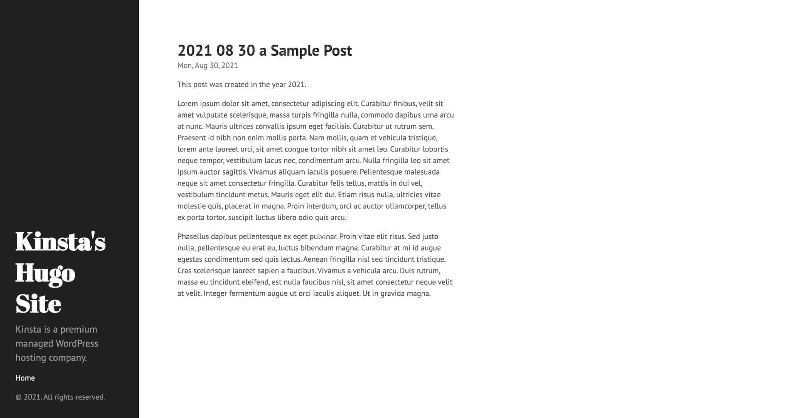

Use a Hugo shortcode to auto-generate the current year.


### 如何在 Hugo 中给帖子添加图片

与 WordPress 和其他成熟的内容管理系统不同，Hugo 不包括用于管理图像的拖放系统。因此，设计映像管理系统的任务被转移给了最终用户。

虽然 Hugo 没有标准化的方法来管理图片，但一个流行的方法是将图片存储在 T2/静态文件夹中，并使用短代码在帖子和页面中引用它们。让我们来看看如何在 Hugo 中进行基本的图像组织。

我们需要做的第一件事是为我们的图像库创建一个组织结构。虽然这听起来很复杂，但所需要的只是在 **/static** 文件夹中创建几个额外的目录。

让我们首先在**/静态**中创建一个**上传**文件夹。在**上传**文件夹中，创建一个名为 **2021** 的文件夹来存放 2021 年上传的所有图片。

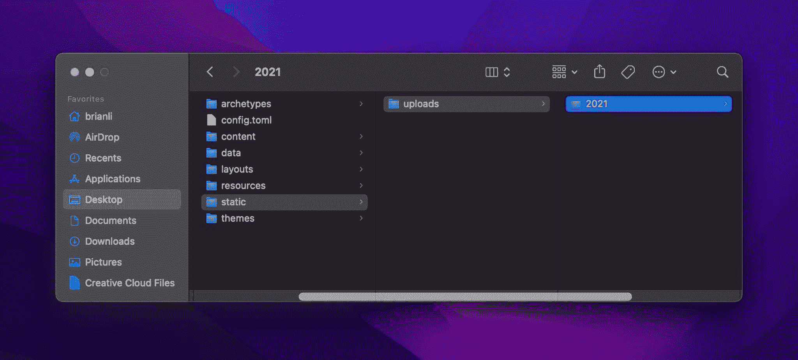

Image management in Hugo.


接下来，我们将两张图片(**blue1.jpg**和**blue2.jpg**)添加到 **2021** 文件夹中。

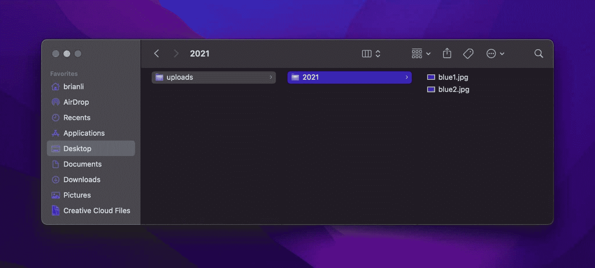

Adding images to the “2021” folder.


在 HTML 中，图像是使用``标签显示的。例如，要显示**blue1.jpg**，我们可以使用下面的 HTML:

```

```

虽然可以将这个 HTML 直接添加到 Markdown 内容文件中，但是最好创建一个短代码，可以用来显示 uploads 文件夹中的任何图像。这样，如果您需要更新`img`标签，您可以编辑 shortcode 模板，而无需编辑`img`标签的每个实例。

要创建短代码模板，请在**/layouts/short codes/img . html**处创建一个新文件，内容如下:

```
}
```

在短代码模板中，`{{ .Get "src" }}`和`{{ .Get "alt" }}`指示 Hugo 在调用短代码时获取`src<`和`alt<`参数的内容。

现在，如果您重新加载博客文章，您应该会看到这样的图像:


Image shortcode in Hugo.


## 如何部署 Hugo 站点

到目前为止，您已经学习了如何安装 Hugo、创建站点、添加主题、对配置文件进行基本编辑，以及使用部分代码和短代码扩展站点的功能。此时，您应该有一个可以在线部署的功能性站点。

因为 Hugo 是一个静态站点生成器，所以你可以在任何地方用 web 服务器部署它生成的 HTML、CSS 和 JS。由于为静态站点提供服务的技术要求非常低，所以您可以通过 Netlify、Vercel、Cloudflare Pages 等众多提供商免费托管它们。

以前，我们使用`hugo server -D`启动本地开发服务器来实时预览我们站点的变化。为了完整地生成站点，我们可以使用项目根目录中的`hugo`命令。站点生成完成后，您应该会在项目目录中看到一个新的 **public** 文件夹。在这个文件夹里，你会找到所有需要上传到服务器或云存储服务的文件，比如[亚马逊 S3](https://kinsta.com/knowledgebase/wordpress-amazon-s3/) 。

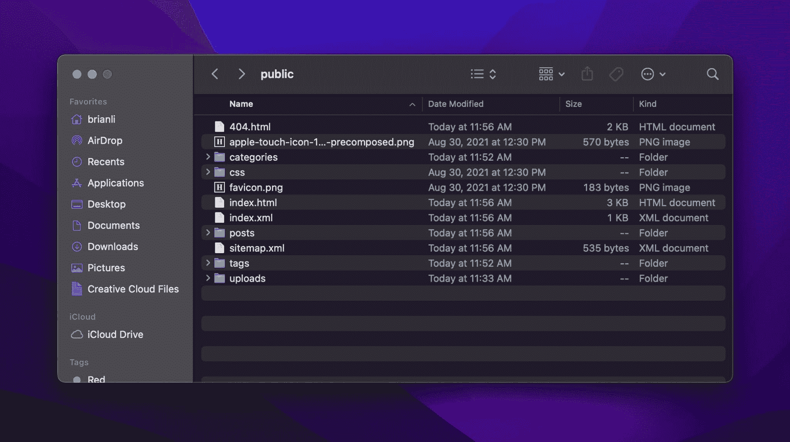

Generate your Hugo site locally.


在本地生成站点，然后手动上传到亚马逊 S3 或者运行 Nginx 的服务器，这是部署静态生成站点的一种方式。然而，它不是最有效的，因为它要求你每次修改时手动上传新文件。

相反，更好的选择是将您的 Hugo 项目文件夹链接到一个 [GitHub 存储库](https://kinsta.com/knowledgebase/what-is-github/)，并将 GitHub 存储库链接到一个像 Netlify 这样的自动化部署服务。通过这个设置，您可以编辑您的站点，将更改推送到 GitHub，并在 Netlify 上触发新的构建和部署，而无需任何手动干预。现在，让我们来看看如何做到这一切！

### 如何将你的 Hugo 项目上传到 GitHub

首先，您需要为您的项目创建一个 GitHub 存储库。为此，创建一个 GitHub 帐户(如果你还没有的话)并[下载官方 GitHub 桌面应用](https://desktop.github.com/)。安装 GitHub app 后，点击菜单栏中的**文件**，选择**新建库**。给这个存储库起一个您选择的名字，暂时保留其他选项的默认状态，然后点击 **Create Repository** 。

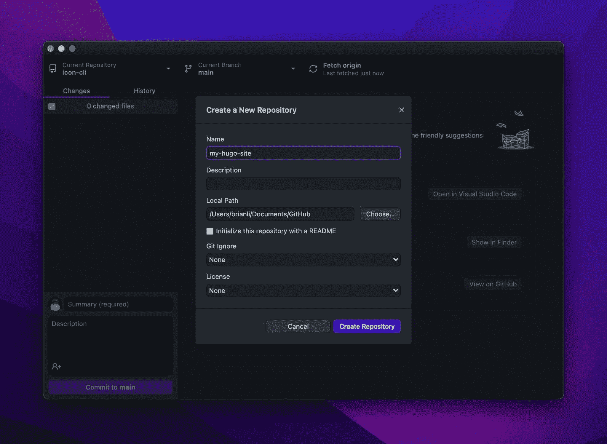

Create a GitHub repository.


默认情况下(在 macOS 上)，GitHub 应用程序在`/Users/username/Documents/GitHub`中创建新的存储库。因为我们将我们的存储库命名为 **my-hugo-site** ，所以我们的存储库可以在`/Users/brianli/Documents/GitHub/my-hugo-site`找到。

接下来，将原始项目文件夹中的所有文件移动到新的 GitHub repository 文件夹中。一定要删除 **public** 文件夹，因为我们不需要把那个文件夹上传到 GitHub。

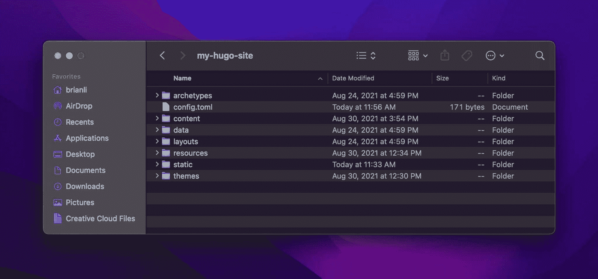

Copy project into GitHub repository folder.


如果您导航回 GitHub 应用程序，您现在应该会看到一个已更改文件的列表。要上传资源库到 GitHub，添加一个摘要，点击**提交到主**，点击右上角的**发布资源库**。

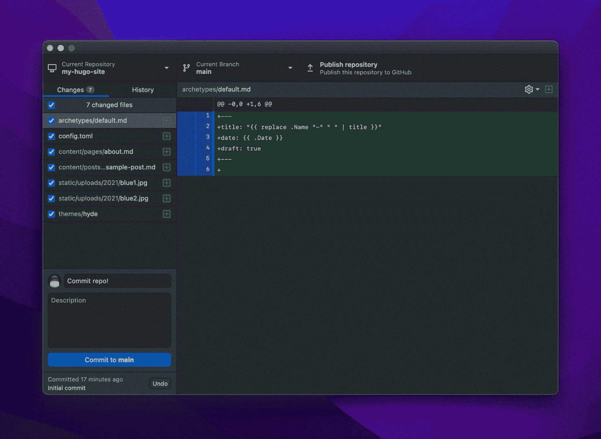

Commit the repo, and upload it to GitHub.


默认情况下,“保持此代码私有”选项处于选中状态。如果您希望您的代码是开源的，可以公开访问，请随意取消选中它。最后，再次点击**发布存储库**。

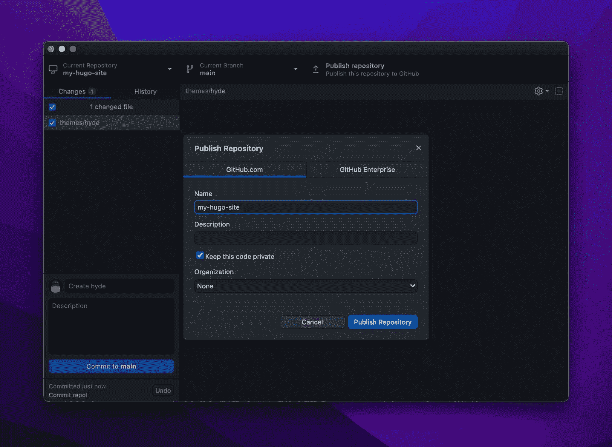

Publish your GitHub repository.


现在，如果你去 GitHub，你应该会看到你的库在线，就像这样:

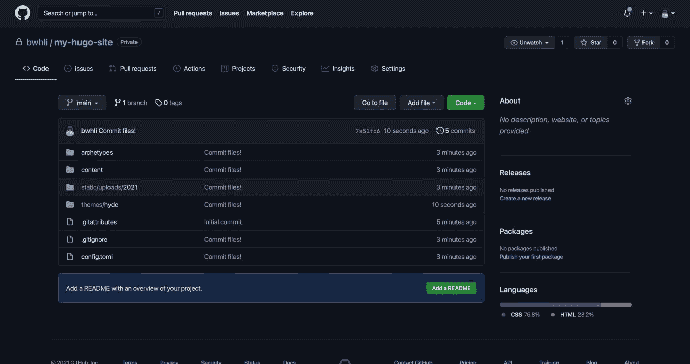

Hugo project repository on GitHub.


### 如何将 GitHub Repo 链接到 Netlify

如果您还没有 Netlify 帐户，请在此注册一个[。要将 GitHub 存储库链接到 Netlify，请在 Netlify 仪表板中单击**来自 Git 的新站点**。](https://app.netlify.com/signup/email)

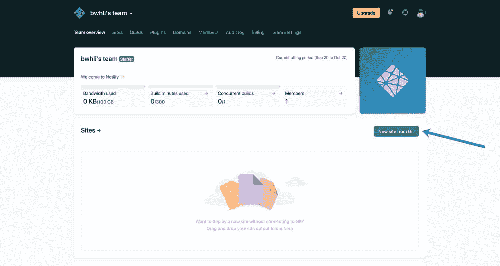

New site from Git on Netlify.


在**连续部署**下，选择 **GitHub** 选项。

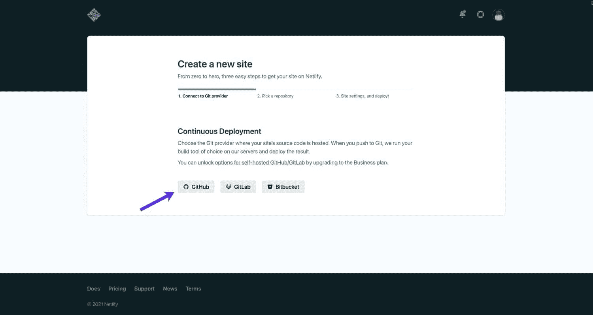

Select “GitHub” for continuous deployment.


接下来，使用搜索框找到您的 Hugo 项目存储库。


Find your Hugo project repository.


接下来，指定连续部署的设置。由于 Netlify 可以检测 Hugo 配置，因此默认设置应该可以很好地用于基本部署。

随着您对 Hugo 越来越熟悉，您可能会深入研究环境变量、定制构建命令等等。目前，将构建命令设置为`hugo`并将公共目录设置为`public`将允许您部署一个简单的 Hugo 站点。指定构建命令和公共目录后，点击**部署站点**。

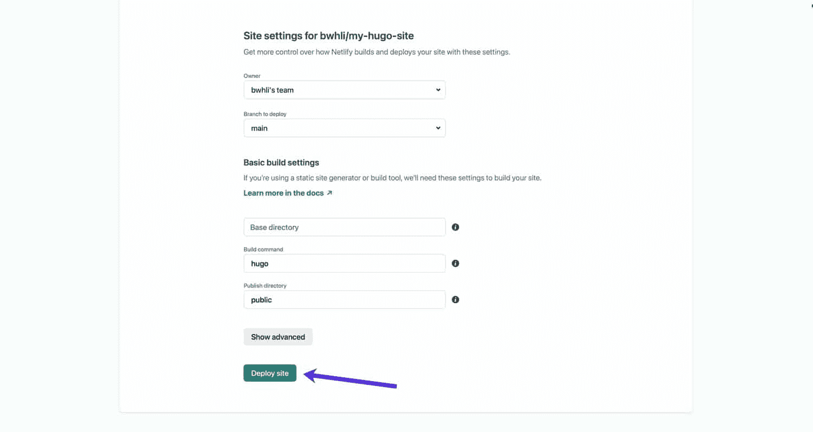

Deploy Hugo site on Netlify.


由于 Hugo 是一个如此快速的静态站点生成器，一个基本站点的部署应该只需要几秒钟。部署完成后，您将能够在 Netlify 仪表板中看到一个临时 URL。单击 URL 查看已部署的站点。

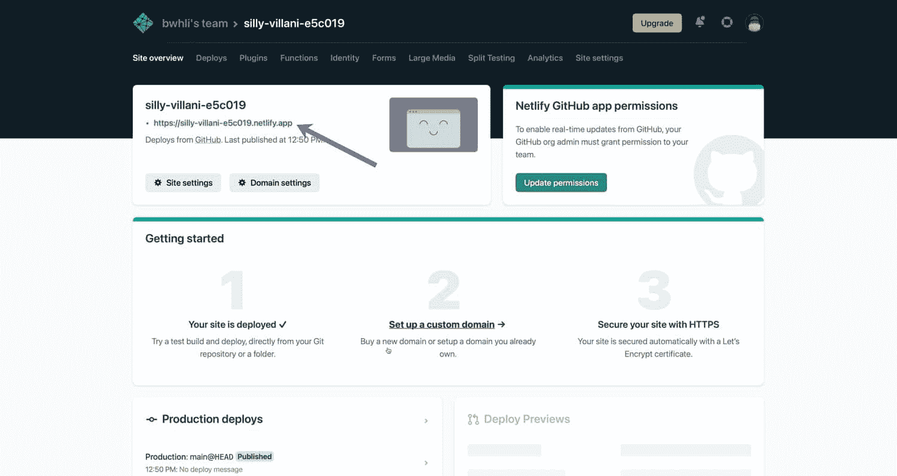

Netlify staging URL.


这是我们在 Netlify 上的 Hugo 网站。如您所见，它与我们的[本地环境](https://kinsta.com/knowledgebase/what-is-localhost/)中的站点完全相同:


Hugo site on Netlify.


此时，您可以为 Netlify 托管的站点设置自定义域和 SSL 证书。为此，我们建议参考[官方 Netlify 文档](https://docs.netlify.com/domains-https/custom-domains/)。

由于我们已经将 Netlify 链接到 GitHub，对 Hugo project GitHub repo 的新提交将自动触发 Netlify 上的新部署！

[Ready to build a static site in record time? ⏱ Start with Hugo ⚡️Click to Tweet](https://twitter.com/intent/tweet?url=https%3A%2F%2Fkinsta.com%2Fblog%2Fhugo-static-site%2F&via=kinsta&text=Ready+to+build+a+static+site+in+record+time%3F+%E2%8F%B1+Start+with+Hugo+%E2%9A%A1%EF%B8%8F&hashtags=StaticSite%2CGolang)

## 摘要

Hugo 是世界上最流行的静态站点生成器之一，这是有原因的。它不仅具有超快的构建处理能力，还具有强大的模板功能，支持部分代码和短代码。

在本教程中，您学习了如何配置 Hugo、创建新项目、添加内容文件、编辑主题文件以及部署一个完成的静态站点。我们建议浏览 Hugo 官方文档，了解更多关于 Hugo 及其更高级的特性，如自定义函数、front matter 和 CSS/JS build pack。

*你对 Hugo 和其他静态站点生成器有什么看法？请在下面的评论中告诉我们！*

* * *

让你所有的[应用程序](https://kinsta.com/application-hosting/)、[数据库](https://kinsta.com/database-hosting/)和 [WordPress 网站](https://kinsta.com/wordpress-hosting/)在线并在一个屋檐下。我们功能丰富的高性能云平台包括:

*   在 MyKinsta 仪表盘中轻松设置和管理
*   24/7 专家支持
*   最好的谷歌云平台硬件和网络，由 Kubernetes 提供最大的可扩展性
*   面向速度和安全性的企业级 Cloudflare 集成
*   全球受众覆盖全球多达 35 个数据中心和 275 多个 pop

在第一个月使用托管的[应用程序或托管](https://kinsta.com/application-hosting/)的[数据库，您可以享受 20 美元的优惠，亲自测试一下。探索我们的](https://kinsta.com/database-hosting/)[计划](https://kinsta.com/plans/)或[与销售人员交谈](https://kinsta.com/contact-us/)以找到最适合您的方式。