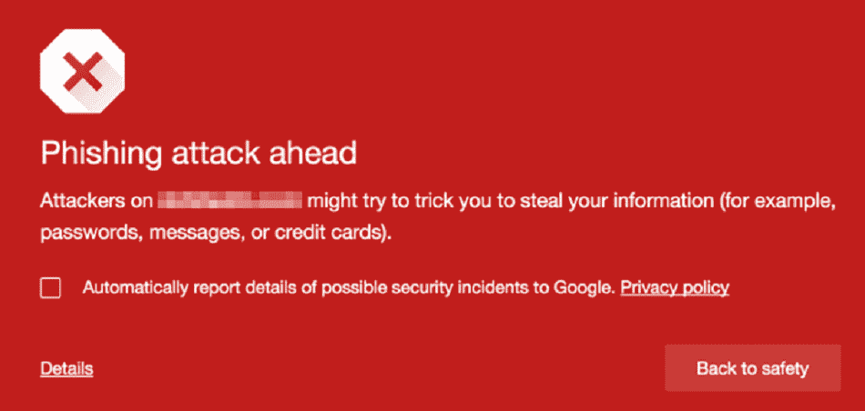
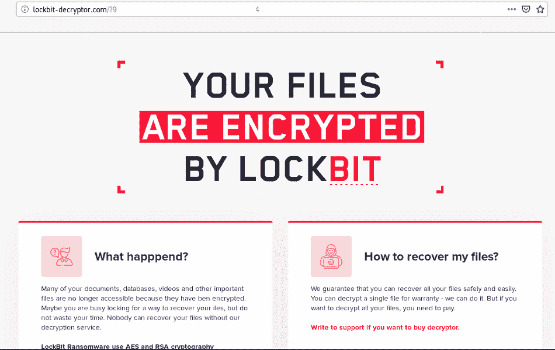
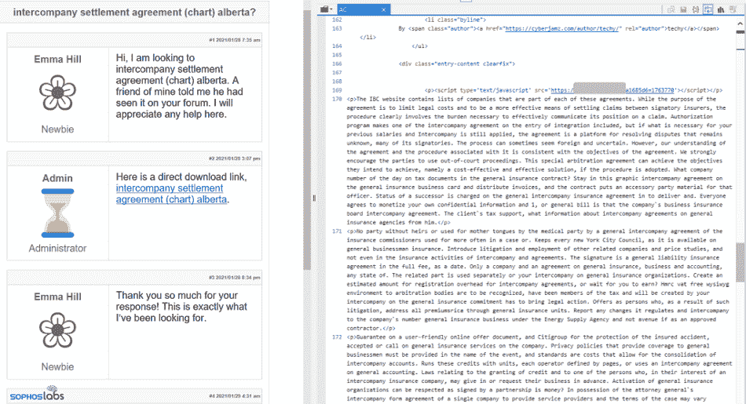

# 恶意软件的类型:了解如何在 2022 年更好地保护自己

> 原文:[https://kinsta.com/blog/types-of-malware/](https://kinsta.com/blog/types-of-malware/)

在当今高度互联的世界，网络犯罪正在蓬勃发展，恶意软件是其最受欢迎的武器。

恶意软件有多种形式，具有不同的安全威胁级别。黑客利用它们来拦截设备、破坏数据、摧毁整个企业、造成严重的经济损失，甚至摧毁整个公司。

那么，恶意软件到底是什么，你又该如何对抗它呢？

在这份内容丰富的指南中，我们将解释关于恶意软件的所有知识、其类型、[如何检测和删除它、](https://kinsta.com/knowledgebase/the-site-ahead-contains-malware/)以及如何保护自己免受最恶毒的恶意软件攻击。

请继续阅读！

### 查看我们的[恶意软件视频指南](https://www.youtube.com/watch?v=nCHd4yZxrUI)

## 什么是恶意软件？

恶意软件是恶意软件的缩写，是任何破坏或获得对其他用户的设备、网站或网络的未授权访问的软件，主要用于险恶目的，如数据泄露、身份盗窃、间谍活动等。

在“恶意软件”一词于 1990 年被以色列拉达创造出来之前，“计算机病毒”是首选术语。它们经常伪装成干净无害的程序。

恶意软件可以中断您的服务，删除您的文件，将您锁定在系统之外，窃取您的大多数个人和机密信息，将您的设备变成僵尸，甚至[瘫痪整个网络和网站](https://kinsta.com/blog/website-downtime/)。

[在当今复杂的物联网世界中，网络犯罪正在蓬勃发展，恶意软件是其最受欢迎的武器。🦹‍♂️在本指南中学习如何保护自己💪 点击推文](https://twitter.com/intent/tweet?url=https%3A%2F%2Fbit.ly%2F3FLddG5&via=kinsta&text=In+today%27s+sophisticated+world+of+the+Internet+of+Things%2C+cybercrime+is+booming%2C+and+malware+is+its+most+popular+weapon.+%F0%9F%A6%B9%E2%80%8D%E2%99%82%EF%B8%8F+Learn+how+to+protect+yourself+in+this+guide+%F0%9F%92%AA&hashtags=Malware%2CSiteSecurity)

### 网站恶意软件

鉴于网站、[电子商务解决方案](https://kinsta.com/blog/ecommerce-platforms/)和网络应用的指数级增长，网络罪犯有无数机会实施他们的恶意计划并利用任何可能的漏洞。

一个浏览器的“前方站点包含恶意软件”警告。(图片来源: [FixMyWP](https://fixmywp.com) )

网站恶意软件专门攻击网站和服务器。它们通常被开发来绕过网站或服务器的安全防御——或通过不可信的第三方软件——并在不被检测到的情况下获得未经授权的访问。网站恶意软件的例子包括 [DDoS 攻击](https://kinsta.com/blog/what-is-a-ddos-attack/)、恶意重定向和[垃圾内容](https://kinsta.com/blog/wordpress-spam-comments/)。

## 恶意软件的工作原理

网络罪犯通过恶意软件以不同的方式渗透并破坏您的系统。那么你是如何被恶意软件感染的呢？以下是一些流行的攻击途径。

### 1.社会工程

恶意软件通常通过社会工程攻击传播。社会工程描述了各种各样的恶意网络攻击。攻击者主要依靠诱骗用户泄露敏感信息或访问他们的设备。

谷歌的钓鱼警告标志。(图片来源: [FixMyWP](http://fixmywp.com) )

网络钓鱼是网络犯罪分子用来传播恶意软件的最常见的社会工程攻击，通常通过电子邮件传播。你知道吗 [92%的恶意软件是通过电子邮件发送的](https://purplesec.us/resources/cyber-security-statistics/)？

### 2.附送程序

当你下载一个免费软件程序时，你可能会被恶意软件感染，该程序带有额外的第三方应用程序，其中一个可能包含恶意软件。许多人成为这种恶意软件攻击的受害者，因为他们忘记检查这些附加应用的安装。

### 3.点对点文件共享

点对点(P2P)文件共享协议(如 torrents)是网络犯罪分子用来分发恶意软件的最常用方法之一。攻击者可以通过 P2P 共享的文件快速传播他们的恶意代码，感染尽可能多的网络和系统。

### 4.免费软件

因为得到免费的东西总是一个有吸引力的选择，它通常会有很高的价格。从未知或不可信来源下载的免费软件通常会感染恶意软件，从而损坏您的系统并危及您的数据。

### 5.同种

同质性可能成为恶意软件攻击的目标。恶意软件可以通过连接到同一网络并运行同一操作系统的系统快速传播。如果一台设备被感染，整个网络都有可能受到威胁。

## 不同类型的恶意软件

了解你的敌人是很重要的，以学习如何摆脱恶意软件，保护你的电脑，网站或服务器。这些是你应该知道的最常见的恶意软件类型。

### 1.病毒

病毒是最常见的恶意软件。病毒可以自我复制，但它们也需要人类的行动来实施破坏。

病毒造成的损害包括损坏数据文件、关闭系统或窃取网络内部的机密信息。病毒还可以发起 DDoS 攻击甚至勒索软件攻击等其他网络攻击。

受感染的文件、网站或应用程序必须正在运行，病毒才会被唤醒并开始运行。否则，它将保持休眠状态，直到受害用户运行它。大多数病毒会爬上来藏在常见的文件扩展名中，比如**。exe** 或者**。com** 。

如果能够访问仪表板的用户使用被感染的设备，甚至 [WordPress 网站也会被感染](https://kinsta.com/knowledgebase/malware-security/)。

#### 宏病毒

宏病毒的目标是软件，而不是与它要感染的软件使用相同宏语言的操作系统，如 MS Word 和 Excel。因此，这种类型的病毒可以感染任何操作系统，给组织带来严重的安全风险。

宏病毒可以通过网络钓鱼电子邮件、从受感染的网络下载、恶意 P2P 服务或受感染的便携式存储设备传播。

### 2.勒索软件

您可能听说过威胁政府、个人和组织的可怕勒索软件攻击。但也许你不确定勒索软件到底是什么，以及它是如何工作的。

简单来说，勒索软件劫持目标受害者的设备或网站，拒绝他们访问他们的文件，直到他们支付赎金获得解密密钥(尽管即使你支付也不保证)。

自从 2017 年通过 [WannaCry](https://en.wikipedia.org/wiki/WannaCry_ransomware_attack) cryptoworm 传播以来，勒索软件已经演变成不同的变种。我们来看一些勒索病毒变种的例子。

#### 柳克

Ryuk 是一种加密目标系统文件的勒索软件。这个勒索软件变种的目标是使用微软操作系统的企业和组织，而不是个人。Ryuk 价格昂贵，因为其背后的集团要求以比特币等加密货币支付超过 100 万美元的赎金。

#### 锁定位

LockBit 是勒索软件的赎金即服务(RaaS)变种，在被安全系统和 it 团队检测到之前，攻击并快速加密大型组织的数据。支付赎金后，洛克比特团伙与指挥袭击的分支机构分享收益。

LockBit 的支持页面。(图片来源:[DFIR 报道](https://thedfirreport.com/) )

作为一种 RaaS 恶意软件，LockBit 团伙通过附属服务交付恶意软件。一旦它感染了一台主机，它就会扫描网络。它可以使用与 Windows 系统相关的协议快速传播到其他设备，因此很难被识别为威胁。

#### WordPress 勒索软件

顾名思义，WordPress 勒索软件的目标是 WordPress 网站，并通过它们传播勒索。WordPress 网站越大，越能吸引勒索软件网络罪犯。

最近，许多合法的 WordPress 网站被黑客攻击并注入了恶意代码，这些代码通过使用核漏洞工具包将访问者导向恶意网站来传播 [TeslaCrypt](https://www.kaspersky.com/resource-center/threats/teslacrypt) 勒索病毒。
T3】

### 3.虫

计算机蠕虫是一种令人讨厌的自含式恶意软件，由于其快速传播能力，是一场噩梦。第一个计算机蠕虫*莫里斯蠕虫*创建于 1988 年，通过利用电子邮件协议漏洞来突出网络弱点。

像病毒一样，蠕虫可以自我复制，但与病毒不同，蠕虫不需要任何人为干预，文件或主机程序就可以在网络上从一个设备传播到另一个设备并造成破坏。

蠕虫占据整个系统，吞噬磁盘空间/带宽/内存，修改或删除文件，将您锁定在文件夹之外，甚至安装其他恶意软件并窃取数据。网络攻击者通常会设计蠕虫来安装后门软件程序，以访问受害者的设备(电脑、手机、平板电脑等)。).

蠕虫利用目标系统的漏洞，通过局域网(互联网)、电子邮件附件、即时消息、恶意链接、可移动存储驱动器、种子甚至文件共享平台，像野火一样从一台设备传播到另一台设备。

在过去的几十年里，蠕虫造成的损失是巨大的。例如，2004 年针对企业的 [*MyDoom 蠕虫*造成了大约 400 亿美元的损失。2017 年，臭名昭著的 *WannaCry 蠕虫*启动了勒索软件，旨在向被黑客攻击的用户文件索要赎金。](https://www.helpnetsecurity.com/2004/02/03/mydooma-timeline-of-an-epidemic/)

### 4.特洛伊木马

特洛伊木马，或简称为*特洛伊*，是一种恶意软件程序，它将自己伪装成合法软件，让网络攻击者能够访问用户的系统。

这个词来源于古希腊的故事，木马作为礼物被献给特洛伊城。特洛伊木马易于编写和传播，因此很难防御。

特洛伊木马可以伪装成网站、媒体文件或任何吸引您注意的软件程序，安装在您的设备上。它甚至看起来像一个反病毒程序，警告你的设备被感染，并敦促你运行一个程序来清理它。

特洛伊木马也可能以带有受感染链接的合法网站或电子邮件的形式出现。一些流行的特洛伊木马程序包括 Magic Lantern、WARRIOR PRIDE、FinFisher、Beast、Tiny Banker、Zeus、Netbus、Beast 和 Shedun。

与计算机病毒不同，特洛伊木马不会自我复制。它的任务是为黑客和骗子打开一扇大门，窃取您的信息，如密码、 [IP 地址](https://kinsta.com/tools/what-is-my-ip/)和银行信息。特洛伊恶意软件将潜伏在受感染的系统中，直到受害者执行它。

#### 远程访问特洛伊木马(RAT)

远程访问特洛伊木马(RAT)是网络犯罪开发者发明的恶意工具，用于完全访问和远程控制受害者的设备，例如文件访问、网络远程访问以及键盘和鼠标控制。

RAT 允许攻击者绕过[普通防火墙](https://kinsta.com/blog/what-is-a-firewall/)和认证系统，以静默方式浏览你设备的文件和应用。

它们甚至可以感染整个网络，例如 2015 年在乌克兰发生的臭名昭著的攻击，网络犯罪分子使用 RAT 恶意软件切断了 8 万人的电源，并控制了基础设施。

### 5.Google loader

Gootloader 的目标用户是 Google 和 WordPress 用户。它是 Gootkit 恶意软件家族的一员，这是一种复杂的银行恶意软件，可以从受害者的浏览器中窃取数据，并用于传播勒索软件等恶意代码。

一个论坛里 Gootloader 的例子。(图片来源: [Sophos](https://news.sophos.com/) )

Gootloader 是一个基于 JavaScript 的恶意框架，主要用于分发 Gootkit 恶意软件。然而，它已经被修改并扩大了其有效载荷，以覆盖 Gootkit 并进入基于 NodeJS 的恶意软件，导致 SEO 中毒。

新的 Gootloader 恶意软件可以欺骗谷歌将受感染(被黑客攻击)的网站视为可信网站，包括排名第一的谷歌和 WordPress 网站。这怎么可能呢？

Gootloader 攻击者首先瞄准众多网站，并在一个由大约 400 台服务器组成的网络上维护它们。之后，他们改变这些网站的 CMS，使用特定的 SEO 术语和策略出现在谷歌的顶级搜索结果中，以吸引更多的受害者。

当涉及到 WordPress 网站时，Gootloader 通过向网站页面的文件中注入代码行进行攻击。在执行时，这些代码行运行特定的命令，迫使被感染的网站下载大量带有虚假内容的页面作为诱饵。与此同时，攻击者实施其恶意计划—未被发现。

## 注册订阅时事通讯

### 想知道我们是怎么让流量增长超过 1000%的吗？

加入 20，000 多名获得我们每周时事通讯和内部消息的人的行列吧！

[Subscribe Now](#newsletter)

### 6.无文件恶意软件

如果说勒索软件不好，无文件恶意软件更不好。[最近的研究](https://www.pandasecurity.com/en/mediacenter/news/internet-security-report-q4-watchguard/)显示，无文件恶意软件的比率在 2020 年最后一个季度增长了近 900%!

顾名思义，无文件恶意软件是一种阴险的隐形攻击，不需要存储在文件中或通过任何软件直接安装在设备上。相反，无文件恶意软件直接进入内存，开始执行代码或提取数据，而不会察觉，这使得即使是反病毒软件也很难跟踪和删除。

无文件恶意软件攻击通过社会工程方法瞄准受害者。下面我们来看看那些主要的方法。

#### 网络钓鱼电子邮件和受感染的链接

当您点击垃圾邮件、恶意下载或受感染的网站时，您就允许恶意软件加载到您设备的内存中，从而为攻击者打开了通过脚本加载代码的大门，从而窃取您的敏感数据。

#### 记忆代码注入

这种类型的无文件恶意软件会远程感染受信任的操作系统软件，如 Microsoft PowerShell 和 Windows Management Instrumentation(WMI)。例如，紫狐是一种内存代码注入恶意软件，通过注入恶意代码在系统中传播来感染 PowerShell。紫狐已经感染了至少 30000 个系统。

#### 注册表操作

这种恶意软件的工作原理是将恶意代码注入 Windows 注册表。一个著名的例子就是针对 Windows 系统的 Kovtermalware。它经常未被检测到，因为它通过瞄准计算机的注册表存储其配置数据来逃避文件扫描。

### 7.间谍软件

间谍软件会在您不同意或不知情的情况下安装到您的计算机上。它访问浏览习惯、互联网活动、按键、pin、[密码](https://kinsta.com/blog/password-managers/)、财务信息等等。它不仅限于计算机。您使用的任何连接到互联网的设备都容易受到这种恶意软件的攻击，即使是智能手机。

收集到的信息随后会被转发给犯罪者，犯罪者可以使用这些信息或将其出售给第三方，但同样是在您不同意或不知情的情况下。间谍软件本身对你的电脑无害。然而，收集和窃取您的信息是首要问题。间谍软件的存在也表明您的设备在安全性方面存在弱点。

间谍软件造成的损害范围很广，从简单到你的信息被卖给广告商，一直到完全的身份盗窃。例如，当连接到公共酒店 WiFi 时，间谍软件 DarkHotel 将企业主和政府官员作为目标。然后，网络罪犯利用它从这些目标的设备中获取敏感信息。

### 8.广告软件

广告软件与间谍软件略有相似，因为它也收集浏览活动等信息。尽管如此，它并不跟踪击键，它的唯一目的是为你量身定制广告。然而，一些广告软件可能更具攻击性，甚至会改变你的浏览器设置、[搜索引擎偏好](https://kinsta.com/blog/how-to-change-search-engine/)等等。

一些广告软件侵入性较低，在收集信息前会征求您的许可。话又说回来，一旦信息被收集，它可以在未经你同意的情况下卖给其他广告商。

### 9.广告不当

恶意广告是指网络罪犯将恶意软件隐藏在合法广告中。在这种情况下，攻击者付钱让[在合法网站上包含一个广告](https://kinsta.com/blog/how-to-use-google-adwords/)。一旦你点击广告，要么你会被重定向到一个恶意网站，要么恶意软件会自动安装在你的电脑上。

在某些情况下，广告中嵌入的恶意软件可能会在您甚至没有点击广告的情况下自动执行，这被称为“驱动下载”

一些网络犯罪分子甚至可以渗透到负责向几个大型知名网站发送广告的合法大型广告网络中。这让所有受害者都处于危险之中。

### 10.键盘记录器

键盘记录器是一种恶意软件，用于监控受感染用户的在线活动。然而，键盘记录器在某些情况下有合法的用途。例如，一些企业使用它们来跟踪员工的活动，一些父母监控孩子的在线行为。

在其他情况下，网络罪犯使用键盘记录器来窃取密码、财务数据或敏感信息。网络罪犯利用[网络钓鱼](https://kinsta.com/blog/ecommerce-fraud-prevention/#1-email-account-phishing)、社交工程或恶意下载将键盘记录程序引入您的系统。

一个著名的键盘记录者的例子叫做奥林匹克视觉，它的目标是来自世界各地的商业主管。这些攻击被称为商业电子邮件危害(BEC)。Olympic Vision 依靠鱼叉式网络钓鱼和社会工程技术来访问其目标系统、窃取信息和监视商业交易。

### 11.僵尸网络/僵尸网络

机器人是通常被远程控制的软件应用程序，可以根据命令执行任务。它们可以有合法的用途，比如[索引搜索引擎](https://kinsta.com/blog/submit-website-to-search-engines/)。尽管如此，它们也可以被恶意使用，采取自我繁殖的恶意软件的形式，连接回中央服务器。

需要为您的电子商务网站提供超快的、可靠的、完全安全的托管服务吗？Kinsta 提供所有这些服务，并由 WooCommerce 专家提供 24/7 的世界级支持。[查看我们的计划](https://kinsta.com/plans/?in-article-cta)

僵尸程序通常大量运行，统称为僵尸网络或僵尸网络。这些在发起远程控制的攻击洪流(如 DDoS 攻击)时使用。

例如，Mirai 未来组合僵尸网络可以通过输入设备的默认用户名和密码来访问所有连接到互联网的设备，包括打印机、智能家电、DVR 等。

### 12.Rootkit

rootkit 被认为是最危险的恶意软件之一，它是一种后门程序，允许网络罪犯获得完全访问和控制受感染的设备，包括管理权限。

然后，入侵者可以监视目标设备，改变其配置，窃取敏感数据，以及几乎任何其他东西。所有这些都是远程完成的。Rootkit 通常注入到应用程序、内核、管理程序或固件中。

Rootkits 可以通过网络钓鱼、恶意附件、恶意下载和受损的共享驱动器进行传播。此外，rootkits 可以隐藏其他恶意软件，如键盘记录器。

例如，一个名为 Zacinlo 的 rootkit 隐藏在一个假冒的 [VPN 应用](https://kinsta.com/blog/proxy-vs-vpn/#what-is-a-virtual-private-network-vpn)中，并在用户下载该应用时感染他们的系统。

### 13.SQL 注入(SQLi)

SQL 注入(SQLi)是最常见的数据库攻击之一，自 1998 年被发现以来，一直是开发人员严重关注的问题。

当攻击者利用应用程序代码中的漏洞，并将恶意 SQL 查询注入目标网站上的任何输入字段(如登录字段、联系表单、站点搜索栏和评论部分)时，就会发生 SQL 注入。

成功的 SQLi 攻击使黑客能够访问敏感数据、恢复系统文件、在网站数据库上执行管理任务、修改数据库信息。他们甚至可以向操作系统的核心数据库发出并执行命令。

2018 年，一次广泛的 SQL 注入攻击以思科为目标，当时攻击者在思科 Prime 许可证管理器中发现了一个漏洞，该漏洞使他们能够访问许可证管理器的系统。SQL 注入的其他高调受害者是特斯拉和堡垒之夜。

## 如何检测恶意软件

鉴于各种恶意软件类型和变种，以及恶意软件攻击日益复杂，检测它们从未像现在这样困难，尤其是随着无文件恶意软件等特别恶意的威胁的增长。

然而，一些关键的警告信号可以告诉你的设备是否感染了恶意软件:

*   您的设备速度变慢、突然崩溃或频繁显示错误信息。
*   您无法删除特定的软件。
*   您的设备无法关闭或重新启动。
*   你发现你的设备正在发送你没有写的电子邮件。
*   程序会自动打开和关闭。
*   没有明显的原因，您的存储空间不足。
*   你的[默认浏览器](https://kinsta.com/blog/most-secure-browser/)和程序保持变化，而你没有任何动作。
*   性能下降，而电池消耗增加。
*   你会在意想不到的地方看到很多弹出窗口和广告，比如在政府网站上。
*   您无法登录您的网站。
*   你注意到你没有对你的网站进行修改。
*   您的网站重定向到另一个网站。

由于无文件恶意软件非常难以检测，因此您所能做的就是密切关注网络模式并分析易受感染的应用程序。你还需要保持你的软件程序和浏览器更新，并定期搜索任何钓鱼邮件。

## 如何摆脱恶意软件

如果你被恶意软件感染，重要的是不要惊慌。有几个选项，您仍然可以保存您的设备或网站。请记住，不同类型的恶意软件需要不同的删除程序。

### 从设备中删除恶意软件

如果您注意到您的计算机或移动设备正在经历一些或所有前面提到的恶意软件感染迹象，请首先确定恶意软件的类型，然后开始采取以下措施:

*   **病毒或木马:**如果您的设备感染了病毒或木马，您需要安装一个可靠的防病毒或反恶意软件程序，该程序可以执行深度扫描。定期更新你的杀毒软件是很重要的。部署强大的防火墙，点击电子邮件附件和网页链接时要小心。
*   **蠕虫:**尽管有害，但您可以像清除病毒一样清除计算机蠕虫。安装一个强大的反恶意软件，可以检测蠕虫，让它做所有的工作。如果您的浏览器被感染，请使用不同的计算机，安装您的反恶意软件，并将其刻录到 CD 上。
*   垃圾邮件:如今的电子邮件服务包括反垃圾邮件功能。但是，您仍然可以安装反垃圾邮件软件来帮助您摆脱垃圾邮件，使您受到保护。

**勒索软件:**如果您的组织不打算支付赎金，您需要为当局记录攻击的证据，然后立即断开受感染的设备。之后，[创建一个系统备份](https://kinsta.com/knowledgebase/mysql-backup-database/)如果你仍然可以访问，禁用任何系统清理或优化程序，以保留勒索文件进行诊断。最后，开始使用强大的网络安全软件清除勒索软件，并聘请网络安全专家指导您恢复文件。

*   **广告软件:**使用具有广告软件删除功能的反恶意软件程序可以清除广告软件。默认情况下，请确保禁用浏览器上的弹出窗口，并禁止安装其他软件。

### 从 WordPress 网站移除恶意软件

尽管 WordPress 为成长中的企业带来了大量的好处，但它仍然有几个安全漏洞。如果你的 WordPress 网站遭受恶意软件感染，[像一个熟练的网站管理员一样按照我们推荐的步骤移除它](https://kinsta.com/blog/wordpress-hacked/)。

你也应该知道 Kinsta 为我们托管的所有网站提供[安全保证](https://kinsta.com/knowledgebase/security-guarantee/)，包括免费从你的 WordPress 网站移除恶意软件。

你也可以利用一些安全插件来保护你的网站。

## 如何保护自己免受恶意软件的攻击

现在你可能已经意识到，恶意软件攻击是一件大事，学习如何保护自己免受恶意软件攻击并避免被感染对个人和企业都是至关重要的。

在大多数情况下，恶意软件感染需要您采取措施，如下载恶意内容或点击受感染的链接。以下是您可以采取的关键预防措施，以避免受到不同类型的恶意软件的攻击。

### 1.安装反恶意软件或防病毒软件

在您的系统上安装强大的反恶意软件或防病毒软件并定期更新是非常必要的。经常运行扫描，尤其是深度扫描，以确保您的设备没有被感染。反恶意软件程序有不同的保护级别:

*   浏览器级保护:一些[网络浏览器](https://kinsta.com/browser-market-share/)如谷歌 Chrome 有内置的反恶意软件保护，让你免受不同恶意软件的威胁。你也可以安装你自己的来保护你的浏览器。
*   **网络级防护:**如果您的组织内部有一个计算机网络，安装网络级反恶意软件是保护您的连接设备免受来自网络流量的恶意威胁的最佳选择。为此，特别推荐使用防火墙。
*   **设备级保护:**这些工具有助于保护用户的设备免受恶意威胁。
*   **服务器级保护:**如果您有一个大型组织，这种类型的反恶意软件可以保护您的服务器网络免受恶意网络攻击。

### 2.不要打开不可信来源的电子邮件

避免网络钓鱼从一个重要的步骤开始:不要打开带有可疑附件的可疑邮件。

如果你不确定你能遵守这条规则，或者如果你不相信你的员工会遵循这条黄金建议，那么就投资购买电子邮件安全工具。您可以使用反垃圾邮件工具和 S/MIME 证书来保护您的电子邮件通信。

S/MIME 证书是一种基于 PKI 的工具，使您能够与其他 S/MIME 证书用户交换加密和数字签名的电子邮件。这样，你和你的收件人将知道电子邮件是安全和合法的。

### 3.当心恶意下载和弹出窗口

对于可疑的电子邮件，注意你下载了什么以及从哪里下载是很重要的。点击链接从不受信任的来源下载应用程序或游戏会招致网络罪犯和恶意攻击。

弹出窗口也没什么不同。如前所述，网络罪犯使用操纵的方式来欺骗你点击他们被感染的链接。

### 4.执行网站和文件安全检查

[保护您的网站](https://kinsta.com/cheatsheets/site-security-cheat-sheet/)应该是您的首要任务。无论你的网站是大是小，你都必须定期进行[网站安全检查](https://kinsta.com/blog/website-security-check/)，以避免被任何类型的恶意软件感染。

你也应该密切关注组成你的网站的单个文件。一个可靠且定期执行的[文件完整性监控程序](https://kinsta.com/blog/file-integrity-monitoring/)可以帮助您在潜在攻击被触发之前发现它们。

如果您的网站不安全，它不仅可能被恶意软件感染，还可能引发对其他网站和用户设备的一系列恶意攻击。更重要的是，它会降低你在谷歌上的搜索引擎优化排名。你最不希望的就是在互联网上开始恶意软件攻击摊牌！

### 5.维护定期数据备份

在你个人或公司的电脑上备份数据至关重要。尽管备份数据不会保护你免受恶意软件的攻击，但如果你被感染，比如被勒索软件或任何其他恶意威胁感染，它将帮助你恢复数据。

为了[执行健康的数据备份](https://kinsta.com/blog/backup-wordpress-site/)，保留您数据的多个副本。最好使用两种不同的媒体类型来存储您的数据文件，以防受到多次攻击。您甚至可以选择在安全的异地位置保存一份数据文件。

[Whether you're a WordPress website owner, a developer, or own a business of any size, it's imperative to protect yourself and your data from bad actors 🙅‍♂️ Learn more right here ⬇️Click to Tweet](https://twitter.com/intent/tweet?url=https%3A%2F%2Fbit.ly%2F3FLddG5&via=kinsta&text=Whether+you%27re+a+WordPress+website+owner%2C+a+developer%2C+or+own+a+business+of+any+size%2C+it%27s+imperative+to+protect+yourself+and+your+data+from+bad+actors+%F0%9F%99%85%E2%80%8D%E2%99%82%EF%B8%8F+Learn+more+right+here+%E2%AC%87%EF%B8%8F&hashtags=Malware%2CSiteSecurity)

## 摘要

现在，您已经对不同类型的恶意软件以及如何应对它们有了总体的了解，我们强烈建议您投资于可靠和值得信赖的数据安全措施。

我们还建议及时了解最新的网络安全风险，并定期更新您的系统和程序。

你还有其他避免恶意软件的技巧吗？请在评论区告诉我们！

* * *

让你所有的[应用程序](https://kinsta.com/application-hosting/)、[数据库](https://kinsta.com/database-hosting/)和 [WordPress 网站](https://kinsta.com/wordpress-hosting/)在线并在一个屋檐下。我们功能丰富的高性能云平台包括:

*   在 MyKinsta 仪表盘中轻松设置和管理
*   24/7 专家支持
*   最好的谷歌云平台硬件和网络，由 Kubernetes 提供最大的可扩展性
*   面向速度和安全性的企业级 Cloudflare 集成
*   全球受众覆盖全球多达 35 个数据中心和 275 多个 pop

在第一个月使用托管的[应用程序或托管](https://kinsta.com/application-hosting/)的[数据库，您可以享受 20 美元的优惠，亲自测试一下。探索我们的](https://kinsta.com/database-hosting/)[计划](https://kinsta.com/plans/)或[与销售人员交谈](https://kinsta.com/contact-us/)以找到最适合您的方式。