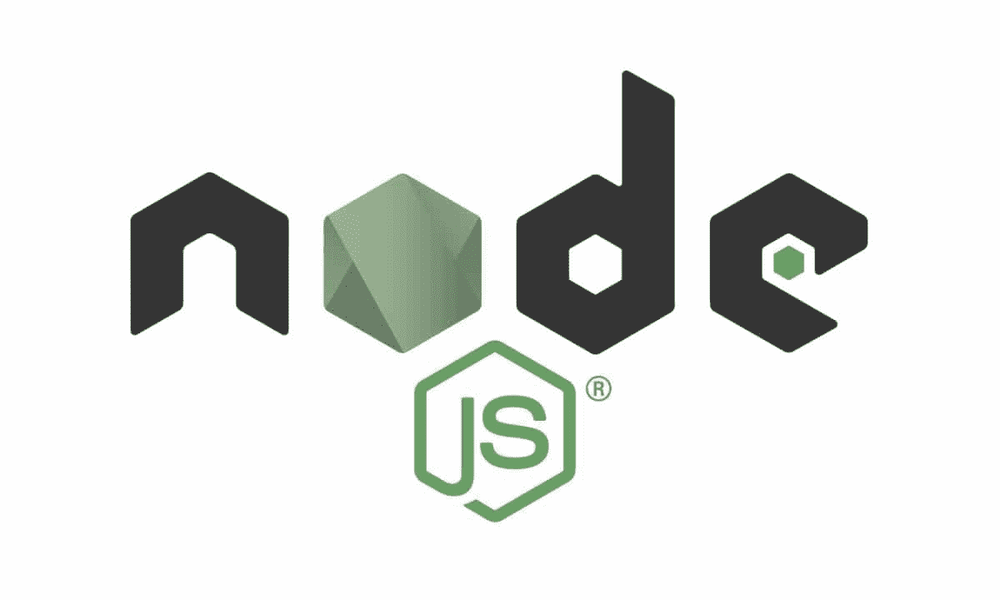
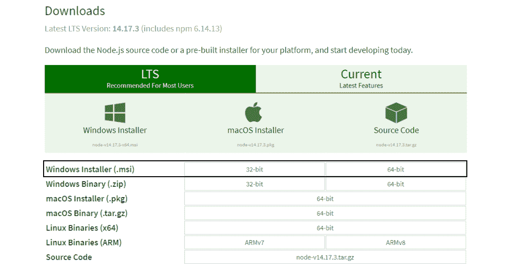
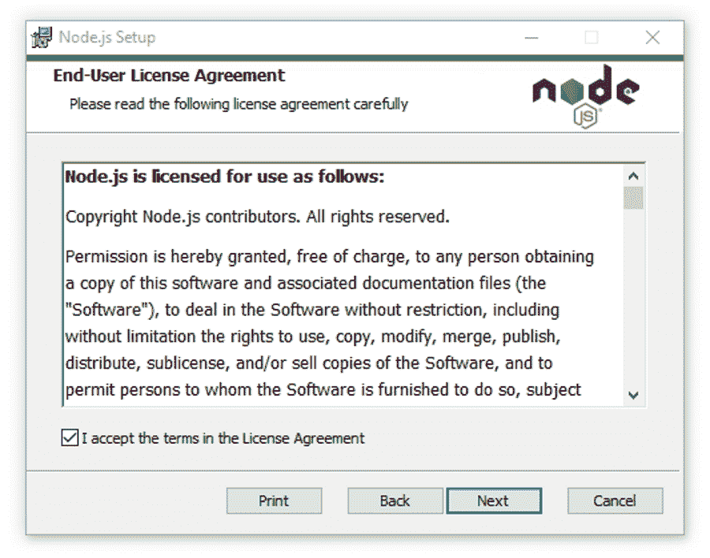
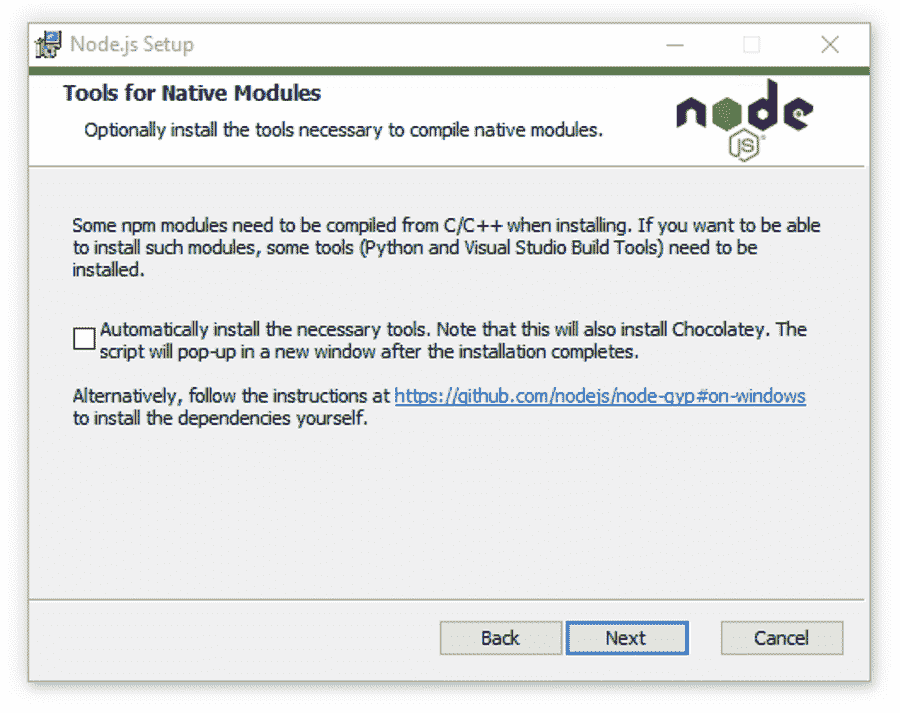
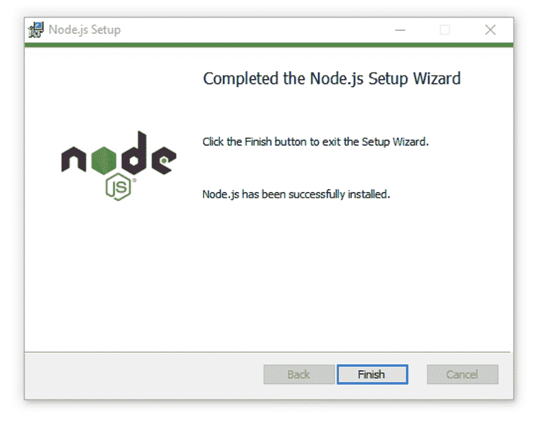
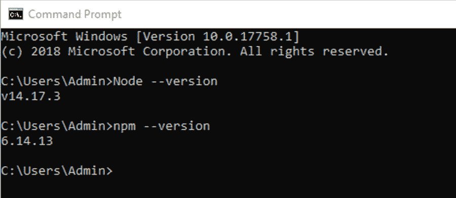
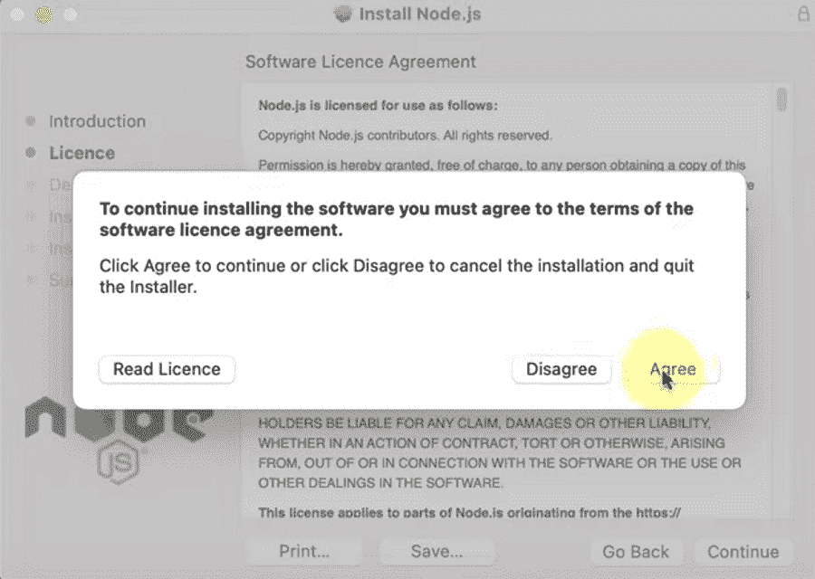
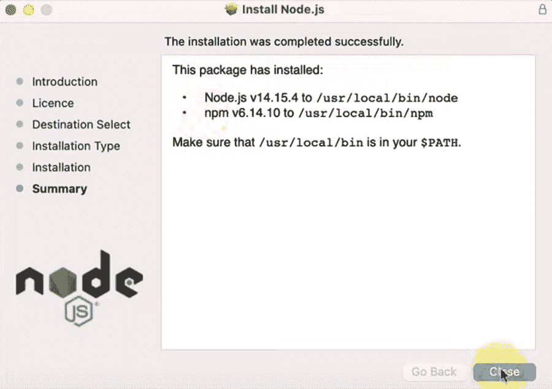
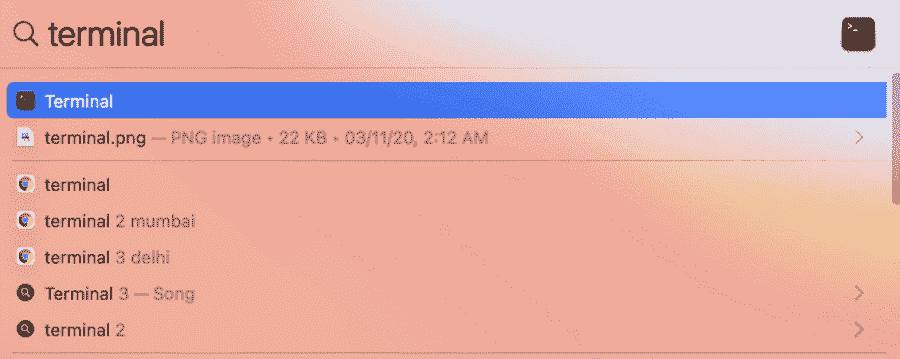

# 如何在 Windows、macOS 和 Linux 上安装 Node.js 和 npm

> 原文:[https://kinsta.com/blog/how-to-install-node-js/](https://kinsta.com/blog/how-to-install-node-js/)

Node.js 的出现是对全球努力在多种语言和框架之间进行交换以将代码扩展到可持续发展环境中的 JavaScript 开发人员的一种祝福。

使用 Node.js，您最终可以构建具有双向连接的 web 应用程序，其中服务器端和客户端都可以完全实时地通信和交换数据。事实上，Node.js 对于希望通过 WebSocket 推送实时 web 应用的开发人员来说是革命性的。

如果你的目标是将你的 web 开发技能提高到一个新的水平，并成为一名全栈 JavaScript 开发人员，Node.js 确实为你准备了一条通往这个热门词汇的道路！

在本文中，我们将演示在您的计算机上安装 Node.js 并开始您的 web 开发之旅的分步指南。

 <kinsta-auto-toc heading="Table of Contents" exclude="last" list-style="arrow" selector="h2" count-number="-1">## Node.js 是什么？



Node.js logo. (Image source: [Node.js](https://nodejs.org/en/about/resources/))


首先你要知道 Node.js 是*而不是*一种编程语言！

您可能已经意识到了这个事实，但对于该领域的新开发人员来说，这是值得重复的，他们可能会将 Node.js 误认为是一种独特的[编程语言](https://kinsta.com/blog/best-programming-language-to-learn/)。不是的！

<link rel="stylesheet" href="https://kinsta.com/wp-content/themes/kinsta/dist/components/ctas/cta-mini.css?ver=2e932b8aba3918bfb818">


[Node.js](https://kinsta.com/knowledgebase/what-is-node-js/) 是一个针对 [JavaScript 语言](https://kinsta.com/knowledgebase/what-is-javascript/)的开源运行时环境，它重塑了 JavaScript 的特性并升级了其功能。因此，您可以使用 JavaScript 进行前端和后端开发，仅使用 JavaScript 就可以实现全栈开发。

最初，Node.js 被设计为服务于实时性能的后推架构。但是从那时起，Node.js 已经成为事件驱动的非阻塞服务器的服务器端编程的一个重要元素。如今，大多数传统网站和 API 服务都依赖 Node.js。

在 Node.js 之前，如果您想在数据库上存储任何数据或者将您的程序连接到数据库，您需要服务器端语言的支持。这是因为 JavaScript 无法管理后端过程。因此，你不得不学习服务器端语言，如 [PHP](https://kinsta.com/blog/is-php-dead/) 、 [Python](https://kinsta.com/blog/python-tutorials/) 、Ruby 或 c#——或者寻求后端开发人员的帮助。

Node.js 环境使 JavaScript 能够直接使用数据库，并作为后端语言正常工作。因此，您最终可以只使用 JavaScript 和 Node.js 来构建和运行程序。

Node.js 使用 [V8 JavaScript 运行时引擎](https://en.wikipedia.org/wiki/V8_(JavaScript_engine))作为其根本动力，并且它采用了事件驱动的非阻塞 I/O 架构。所有这些共同构建了 Node.js，并有助于推动产品实现强大的性能。

## 谁用 Node.js？

根据 W3Techs 的数据，迄今为止，所有网站中有 1.4%使用 node . js——也就是说有超过 2200 万个网站。这些数字让您大致了解 Node.js 用户的数量。最重要的是，Node.js 已经被下载了超过 13 亿次！正如你所看到的，这些数据有力地说明了 Node.js 的市场规模。

从您的 IT 朋友到行业巨头，所有人都喜欢利用 Node.js。这是因为 Node.js 提高了开发人员的性能，加快了开发过程的速度。如今最明智的趋势之一是在任何地方使用 JavaScript，这将 Node.js 带入了舞台。

使用 Node.js 的顶级公司包括:

1.  国家航空与航天局
2.  [推特](https://kinsta.com/blog/twitter-marketing/)
3.  网飞
4.  [LinkedIn](https://kinsta.com/blog/linkedin-statistics/)
5.  [PayPal](https://kinsta.com/blog/stripe-vs-paypal/)
6.  特雷罗
7.  通过易趣网购买
8.  沃尔玛
9.  浏览器名
10.  中等

如果你研究这些公司，你可能会注意到他们经营不同的服务或产品。但是它们都有一个共同的关键因素:它们依赖 Node.js。事实上，使用 Node.js 可以解决大多数开发问题，无论您处于哪个行业。

## 使用 Node.js 的优势

为您的技术堆栈选择正确的编程平台与您想要投资的劳动力一样重要。当您寻找使用特定平台的优势时，应该考虑多个因素。学习曲线、[开发速度](https://kinsta.com/knowledgebase/wordpress-code-generator/)、社区和规模等因素会改变整体利益平衡。

以下是使用 Node.js 的主要优势:

*   简单语法
*   简单学习曲线
*   快速扩展的能力
*   开源且灵活
*   跨平台开发
*   单语言全栈开发
*   实时通信
*   庞大而活跃的社区

 <kinsta-advanced-cta language="en_US" type-int-post="103132" type-int-position="0">## Node.js 先决条件

在安装 Node.js 之前，您需要确保已经收集了所有必要的知识，并下载了所有必需的安装文件和元素。

首先，如果你对 JavaScript 及其语法有一个基本的了解，这将会有所帮助——这将使你更容易掌握 Node.js。

其次，对面向对象编程语言的基本理解将有助于你进行服务器端编码。

最后，不要急于深入学习，一步一步来。永远记住，只要你在进步，你就不会晚一天或少一美元。

### 系统需求

Node.js 的运行不需要复杂的硬件设置；这个时代的大部分电脑应该都是高效处理 Node.js 的。即使是像 BeagleBone 或 Arduino yúN 这样最微型的计算机也可以运行 Node.js。

尽管如此，这在很大程度上仍然取决于你在同一系统上运行的其他内存占用软件。但大多数情况下，你不应该担心，除非你的电脑是中生代的！

### LTS 版本与当前版本

Node.js 提供了两个不同的版本供您下载:LTS 版本和当前版本。

第一个是长期支持(LTS)，表示已经上市一段时间并附带所有强制支持的版本。因此，您可以访问大量信息和社区来获得关于此版本的更多帮助。

由于其可持续性和长达 18 个月的支持周期，向大多数用户推荐此 LTS 版本。由于它是一个稳定的版本，使用它来产生后端可以帮助您实现一个健壮的结果。

当前版本表示最新发布的 Node 版本，其中包含最近添加和更新的功能。但是这个版本背后的支持更少(大约八个月)并且可能会暴露[bug](https://kinsta.com/knowledgebase/disclose-security-vulnerability/)。因此，专家建议仅将该版本用于前端开发。

考虑到所有这些因素，如果你是一个喜欢无忧无虑生活的普通用户，那就选择 LTS 版本吧。另一方面，如果您是喜欢体验新技术的高级用户，您可以选择安装当前版本。

## 如何安装 Node.js 和 npm

每个操作系统都有不同的 Node.js 安装方法。每个操作系统的核心安装文件都不相同。然而，Node.js 的创建者已经为您提供了每个系统所需的文件。

在本文的下一部分，我们将讨论在 Windows、macOS 和 Linux 操作系统上安装 Node.js。

## 如何在 Windows 上安装 Node.js

按照本分步指南在 Windows 上安装 Node.js。

### 1.下载 Windows Installer

首先，你需要下载 [Windows Installer(。msi)](https://nodejs.org/en/download/) 文件来自官方 Node.js 网站。这个 MSI 安装程序数据库包含安装、更新或修改现有 Node.js 版本所必需的安装程序文件集合。

值得注意的是，安装程序中还包含了 [Node.js 包管理器(npm)](https://kinsta.com/knowledgebase/what-is-npm/) 。这意味着您不需要单独安装 npm。

下载时，根据您的操作系统选择正确的版本。例如，如果您使用的是 64 位操作系统，请下载 64 位版本，如果您使用的是 32 位版本，请下载 32 位版本:



Downloading the Node.js installer.


### 2.开始安装过程

一旦你打开并运行了**。msi** 文件，安装过程开始。但是在运行安装过程之前，您必须设置一些参数。

双击安装程序文件并运行它。安装程序将要求您接受 Node.js 许可协议。要继续，选中“我接受”框，然后点击下一个的**:**



Accepting the Node.js license agreement.


然后，选择你想要安装 Node.js 的目的地，如果你不想改变[目录](https://kinsta.com/blog/directory-website-wordpress/)，使用 Windows 默认位置，再次点击**下一步**按钮。


Selecting the Node.js installation folder.


下一个屏幕将显示自定义设置选项。如果您想要一个具有 Node.js 默认特性的标准安装，单击下一个按钮**。否则，您可以在点击**下一步**之前，从图标树中选择您的特定元素:**


“Custom Setup” options in the Node.js installer.


Node.js 为您提供了为本机模块安装工具的选项。如果您对这些感兴趣，请单击复选框标记您的偏好，或单击下一个的**继续使用默认设置:**



Tools for native modules in the Node.js installer.


### 3.在 Windows 上运行 Node.js 安装

最后，也是最简单的部分，点击**安装**按钮开始安装过程:


Beginning the Node.js installation.


系统将在几秒或几分钟内完成安装，并向您显示成功消息。点击**完成**按钮关闭 Node.js 安装程序。



Finishing the Node.js installation on Windows.


### 4.验证 Node.js 安装

这样安装过程就完成了。现在，您必须检查 Node.js 是否安装成功。

要验证安装并确认是否安装了正确的版本，[打开 PC 的命令提示符](https://www.lifewire.com/command-prompt-2625840)并输入以下命令:

```
Node --version
```

要检查 npm 版本，请运行以下命令:

```
npm --version
```



Verifying Node.js installation on Windows.


如果 Node.js 版本和 npm 安装正确，您将在 CMD 提示符下看到版本名称。
<kinsta-advanced-cta language="en_US" type-int-post="103132" type-int-position="1"></kinsta-advanced-cta>

## 如何在 macOS 上安装 Node.js

按照这些分步指南在 macOS 上安装 Node.js。

### 1.下载 macOS 安装程序

在 macOS 上安装 Node.js 的过程几乎与 Windows 相同。你所要做的就是下载 Mac 的安装文件。然后，一旦你启动它，安装程序将引导你完成剩下的部分。

首先，下载 [macOS 安装程序(。pkg)](https://nodejs.org/en/download/) 文件来自 [Node.js](https://nodejs.org/en/) 网站。只有 64 位版本，不用担心下载哪个。


Downloading the Node.js macOS installer.


### 2.开始在 macOS 上安装 Node.js

检查您的**下载**文件夹中的安装程序文件，并点击它开始安装过程。

Node.js 安装程序携带 Node.js 核心文件，因此，安装过程会从安装程序文件安装 Node.js 和 npm。因此，您不需要单独安装 npm。

然后，点击**继续**继续安装。


Node.js macOS installation properties.


您必须同意安装 Node.js 的使用条款。如果您想了解[许可协议](https://kinsta.com/partners/termageddon/)，请通读该条款，然后单击**同意**按钮继续。

 ## 注册订阅时事通讯


### 想知道我们是怎么让流量增长超过 1000%的吗？

加入 20，000 多名获得我们每周时事通讯和内部消息的人的行列吧！

[Subscribe Now](#newsletter)



Node.js macOS installation license agreement.


在此屏幕上，您需要选择安装位置。通常，操作系统会确定默认的安装位置。如果有其他要求，可以换位置。否则，保留默认位置。

### 3.在 macOS 上运行 Node.js 安装

到目前为止，您已经设置了在 macOS 上完全安装 Node.js 所需的所有参数。现在点击**安装**按钮来完成事情。


Selecting the Node.js installation location on macOS.


成功安装后，系统会向您显示一条确认消息。因为 npm 集成在 Node.js 安装程序中，所以通知也应该指出 npm 安装的证据。

最后，点击**关闭**按钮关闭对话框。



Closing the Node.js installer.


### 4.验证 macOS 上的 Node.js 安装

现在，您已经在 macOS 上成功安装了 Node.js。但是，您应该检查安装过程是否成功，以及 Node.js 和 npm 版本是否在 macOS 上正常工作。

要检查 Node.js 版本，需要打开你的 macOS 终端，点击 **Command + Space** 键，或者从搜索栏搜索终端。



Opening the macOS terminal.


要检查 Node.js 版本，请键入:

```
Node --version
```

要检查 npm 版本，请运行以下命令:

```
npm --version
```


Verifying Node.js installation on macOS.


如果 Node.js 和 npm 版本可见，则这两个版本都已正确安装并且运行良好。如果没有，您可能需要重新检查以找到错误或再次尝试安装过程。

## 如何在 Linux 上安装 Node.js

Linux 操作系统的工作方式与其他传统操作系统略有不同。这是因为 Linux 是开源的，为您提供了更多的自由、定制和高级功能。

如果您对[命令](https://kinsta.com/blog/how-to-use-ssh/)很熟悉，那么您应该对 Linux 很熟悉。在这里，我们将讨论在 Linux 操作系统上安装 Node.js 的最简单的方法。

### 1.为您的 Linux 发行版选择 Node.js 版本

Linux 操作系统有数百个不同的发行版，因为它提供了多样性。用户喜欢使用不同的发行版定制和利用不同版本的特定功能。

首先，从 [Node.js 的二进制发行版](https://github.com/nodesource/distributions/blob/master/README.md)页面找到您的特定发行版的安装说明。在本指南中，我们将使用 Ubuntu 进行说明。


Node.js Ubuntu installation instructions.


### 2.安装 Curl 命令行工具

在安装 Node.js 之前，确保您的系统上安装了 curl 命令行实用程序。如果没有，那么在您的终端上粘贴以下命令来安装 curl:

```
sudo apt install curl
```

它可能会询问您的系统密码，以验证安装的许可。一旦您输入了[密码](https://kinsta.com/blog/password-managers/)，系统将开始安装 curl。

需要为您的电子商务网站提供超快的、可靠的、完全安全的托管服务吗？Kinsta 提供所有这些服务，并由 WooCommerce 专家提供 24/7 的世界级支持。[查看我们的计划](https://kinsta.com/plans/?in-article-cta)


Installing “curl” on Ubuntu.


### 3.开始 Node.js 安装

您需要将 Node.js 安装命令复制并粘贴到您的终端中(在我们的例子中，我们可以从 Ubuntu 发行版页面获取它),以便系统可以开始 Node.js 安装。


### 信息

每个 Node.js 版本都有不同的安装命令。安装与您的 Linux 设置相匹配的 Node.js 版本。


例如，在这里，我们将安装 Node.js v14.x。这些是 Ubuntu 的安装命令:

```
curl -fsSL https://deb.nodesource.com/setup_14.x | sudo -E bash -
```

```
sudo apt-get install -y nodejs
```

因为您已经在终端上安装了 curl 命令行，所以您需要在您的[终端](https://kinsta.com/blog/wp-cli/)上复制并粘贴第一个命令(curl 命令)并运行它。


Beginning Node.js installation on Ubuntu.


curl 命令开始 Node.js 安装过程，更新您的系统，并下载在 Linux 操作系统上安装 Node.js 所需的所有 Node.js 库。


Node.js library installation.


现在，Node.js 的所有库和资源都已经下载到你的 PC 上了。通过最后一个命令，我们可以在您的计算机上完成 Node.js 和 npm 的安装。

将上述安装说明中的第二行命令复制并粘贴到您的 Linux 终端中:

```
sudo apt-get install -y nodejs
```


Installing Node.js on Ubuntu.


如果您做的一切都正确，Node.js 将正确地安装在您的 Linux 发行版上。现在输入**清除**命令来清除端子。

### 4.验证 Linux Ubuntu 发行版上的 Node.js 安装

因为已经安装了 Node.js，所以可以验证安装是否成功。为了确认安装，您需要在您的 Linux 终端上运行两个简单的 [Linux 命令](https://kinsta.com/blog/linux-commands/)。

要检查 Node.js 版本，请键入:

```
Node --version
```

要检查 npm 版本，请键入:

```
npm --version
```


Verifying Node.js installation on Ubuntu.


如果 Node.js 版本和 npm 安装正确，您将在 Linux 终端上看到 Node.js 和 npm 版本名称。它表明您已经在 Linux 发行版上成功安装了 Node.js 和 npm。

## 检查并更新 npm 版本

正如我们提到的，npm 是 Node.js 包管理器。它管理包的依赖关系。如果没有 npm，每次想要上传一个框架时，您都必须手动解包所有的 Node.js 包。但是 npm 解除了您的这一责任，并自动处理它。

定期更新 npm 也会更新您的本地包，[会改进您的项目中使用的代码](https://kinsta.com/blog/code-review-tools/)。但是，当 npm 自动安装您选择的 Node.js 版本时，它经常会错过最新的 npm 版本。在这种情况下，您可以检查您的 npm 版本，并通过一个简单的过程手动更新它。

检查和更新 npm 版本的过程在 Windows、macOS 和 Linux 之间非常相似——您将在每台机器上运行相同的命令。

### 在 Windows 中更新 npm

要检查 npm 版本，请运行以下命令:

```
npm -v
```

…或者:

```
npm --version
```

要更新 npm 版本，请运行以下命令:

```
npm install -g [[email protected]](/cdn-cgi/l/email-protection)
```

在 Windows 上的 CMD 提示符下运行此命令后，系统将在几秒钟内更新您的 npm 版本并安装附加软件包。最后，您可以重新检查版本，以确认 npm 版本的更新。


Updating npm on Windows.


### 在 macOS 上更新 npm

要在 macOS 上检查 npm 版本，请打开您的终端并运行以下命令:

```
npm -v
```

…或者:

```
npm --version
```


Checking npm version on macOS.


要更新 npm 版本，请在 macOS 终端中运行以下命令:

```
npm install -g [[email protected]](/cdn-cgi/l/email-protection)
```


Updating npm on macOS.


### 在 Linux 中更新 npm

要在 Linux 上更新 npm 版本，请在终端中键入以下命令:

```
sudo npm install -g n
```

…然后:

```
sudo n latest
```


Updating npm on Ubuntu.


[With Node.js, you can take your web dev skills to the next level 📈... so what are you waiting for? Get started with this guide 👇Click to Tweet](https://twitter.com/intent/tweet?url=https%3A%2F%2Fkinsta.com%2Fblog%2Fhow-to-install-node-js%2F&via=kinsta&text=With+Node.js%2C+you+can+take+your+web+dev+skills+to+the+next+level+%F0%9F%93%88...+so+what+are+you+waiting+for%3F+Get+started+with+this+guide+%F0%9F%91%87&hashtags=Nodejs%2CWebDev)

## 摘要

由于 Node.js 在前端和后端都很有用，所以它很快成为一个流行的编程环境。成千上万的活跃用户创建了一个巨大的社区，帮助新开发人员和他们的问题不被遗漏。

从本质上来说，Node.js 很容易上手，因为它非常简单，而且它创建高级应用程序的能力也非常出色。它还可以帮助你在短时间内成为一名全栈开发人员。这些特性使得 Node.js 成为下一代编程的必然选择。

关于在 Windows、macOS 或 Linux 上安装 Node.js，我们错过了什么有用的提示吗？请在评论区告诉我们！

* * *

让你所有的[应用程序](https://kinsta.com/application-hosting/)、[数据库](https://kinsta.com/database-hosting/)和 [WordPress 网站](https://kinsta.com/wordpress-hosting/)在线并在一个屋檐下。我们功能丰富的高性能云平台包括:

*   在 MyKinsta 仪表盘中轻松设置和管理
*   24/7 专家支持
*   最好的谷歌云平台硬件和网络，由 Kubernetes 提供最大的可扩展性
*   面向速度和安全性的企业级 Cloudflare 集成
*   全球受众覆盖全球多达 35 个数据中心和 275 多个 pop

在第一个月使用托管的[应用程序或托管](https://kinsta.com/application-hosting/)的[数据库，您可以享受 20 美元的优惠，亲自测试一下。探索我们的](https://kinsta.com/database-hosting/)[计划](https://kinsta.com/plans/)或[与销售人员交谈](https://kinsta.com/contact-us/)以找到最适合您的方式。</kinsta-advanced-cta></kinsta-auto-toc>