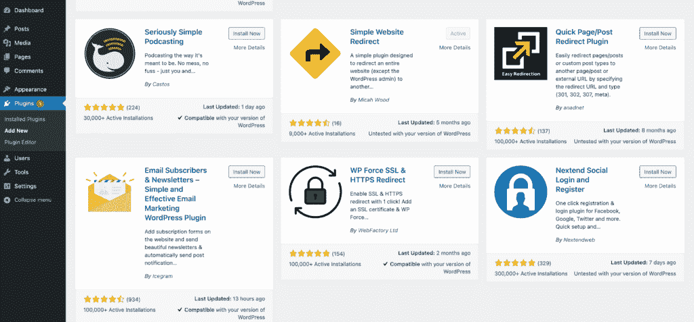
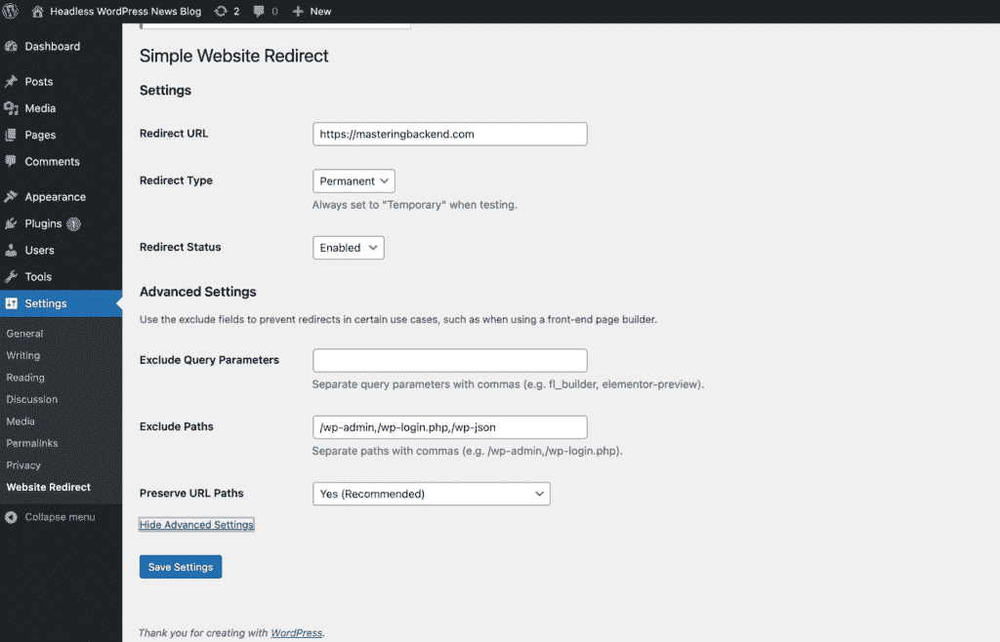
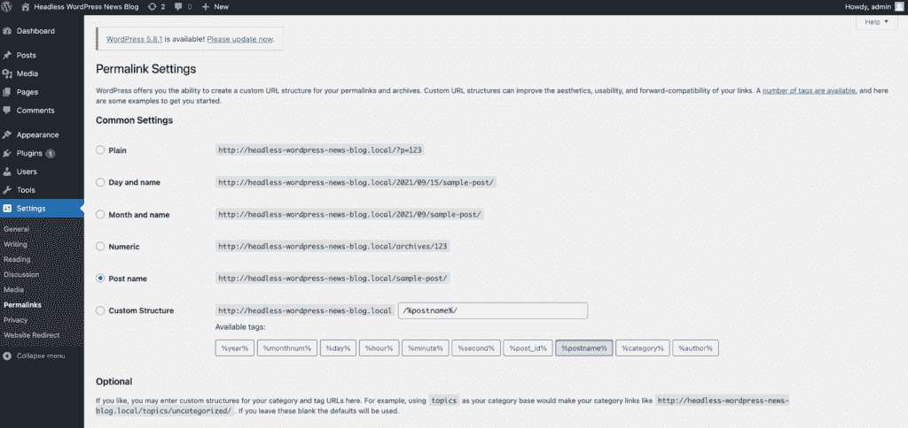

# 了解如何用 Vue.js 创建一个无头 WordPress 站点

> 原文:[https://kinsta.com/blog/headless-wordpress/](https://kinsta.com/blog/headless-wordpress/)

WordPress 已经成为开发者和非开发者快速建立和创建令人惊叹的网站的首选内容管理系统。

使用微服务架构，内容管理后端与前端分离，可以最大限度地控制两端这个分离问题是无头内容管理系统，包括无头 WordPress 解决方案，试图解决的问题。

使用无头方法，企业可以更精细地控制内容管理后端。他们还可以自由使用他们选择的任何前端，包括 React、 [Vue、Angular](https://kinsta.com/blog/angular-vs-vue/) 等。

本指南将详细探讨 headless WordPress，以及它到底是什么，何时以及为什么你应该考虑使用它。最后，我们将探索创建一个无头 WordPress 环境，用 [Vue.js](https://kinsta.com/blog/vue-js/) 构建前端，并使用 Kinsta 部署无头 WordPress。

 <kinsta-auto-toc heading="Table of Contents" exclude="last" list-style="arrow" selector="h2" count-number="-1">## 什么是无头 WordPress？

WordPress 是一个整体的应用程序，后端和前端紧密地联系在一起。后端是管理的起点，您可以在这里创建、编辑、添加和删除内容，包括更改外观配置。相反，前端负责向用户显示内容。

无头 WordPress 是用来描述分离 WordPress 的术语。后端(管理)部分与 [WordPress CMS](https://kinsta.com/knowledgebase/what-is-wordpress/) 的前端部分是分开的。您可以使用自己选择的任何前端框架，将前端作为独立的应用程序进行开发和管理。

[Ready to take a deep dive into headless WordPress, learn why you should consider using it, and how to deploy it on your sites? 🚀 Click here ⬇️Click to Tweet](https://twitter.com/intent/tweet?url=https%3A%2F%2Fkinsta.com%2Fblog%2Fheadless-wordpress%2F&via=kinsta&text=Ready+to+take+a+deep+dive+into+headless+WordPress%2C+learn+why+you+should+consider+using+it%2C+and+how+to+deploy+it+on+your+sites%3F+%F0%9F%9A%80+Click+here+%E2%AC%87%EF%B8%8F&hashtags=WordPress%2CVuejs) <kinsta-advanced-cta language="en_US" type-int-post="104261" type-int-position="0">## 无头 WordPress 的利与弊

接下来，我们将探讨无头 WordPress 的利与弊，让你更好地理解这个概念。

<link rel="stylesheet" href="https://kinsta.com/wp-content/themes/kinsta/dist/components/ctas/cta-mini.css?ver=2e932b8aba3918bfb818">


> 需要在这里大声喊出来。Kinsta 太神奇了，我用它做我的个人网站。支持是迅速和杰出的，他们的服务器是 WordPress 最快的。
> 
> <footer class="wp-block-kinsta-client-quote__footer">
> 
> 
> 
> <cite class="wp-block-kinsta-client-quote__cite">Phillip Stemann</cite></footer>

[View plans](https://kinsta.com/plans/)

### 赞成者

首先，我们将从探索优点开始。

#### 超快的性能

在这个应用程序超高速运行的时代，你的网站不应该花超过几秒的时间来加载和避免失去访问者。由于前端是从 WordPress 中分离出来的，并且可以使用现代前端工具以高性能和可伸缩性为目标进行开发，所以使用无头 WordPress 方法对网站的整体用户体验有很大的好处。

#### 粒度控制

选择无头架构可以让您更好地控制设计布局、内容呈现以及用户与应用程序前端的交互方式。它还允许从一个中心位置保护和访问您的后端内容。

#### 增强的可扩展性

扩展 WordPress 有时会很复杂，因为你不能完全控制 WordPress 的所有组件和代码，主要是如果你不是开发者的话。但是有了 WordPress 的解耦，孤立地缩放每个部分是毫不费力的，你可以很容易地检测出哪个部分需要缩放。

#### 更严格的安全措施

我们再怎么强调无头 WordPress 的安全优势也不为过，因为分离的 WordPress 对黑客和 DDoS 攻击有很高的安全优势。无头的 WordPress 方法使得黑客很难访问你敏感的后端数据，因为它与你的前端，即面向用户的网站是分开的。

#### 轻质设计

您将对前端设计的结构和布局有更多的控制权。此外，您可以更自由地在前端工作，并进行定制设计；感谢 REST API 调用，您将能够利用现代 web 工具并在前端部署它们。

#### 多渠道内容发布

由于 headless WordPress 使用一个基于 API 的系统将你的内容传送到前端，你可以在任何地方和任何平台上显示你的内容，包括桌面、网站、移动应用和触摸屏信息亭。还可以充分利用增强现实、虚拟现实和物联网设备来显示和呈现来自基于 API 的系统的内容。

### 坏处

我们将更深入地探讨 headless 的缺点，但是它的主要缺点是:

1.  当管理不同的网站实例时，分离后端和前端会给你带来额外的负担。
2.  它的实现成本很高，因为它需要团队中的额外成员和额外的资金来运行不同的实例。
3.  如果内容在所有平台上的呈现方式不一致，那么让内容在不同平台上可用会给用户带来不一致的体验。

 <kinsta-advanced-cta language="en_US" type-int-post="104261" type-int-position="1">## 当无头 WordPress 可能不是最好的选择时

由于 headless WordPress 是一个令人难以置信的创新，有很大的好处，当你决定是否应该使用它时，有一些事情你要记住。

1.  维护无头 WordPress 是非常昂贵的。您将维护一个网站的两个不同实例，从基础设施到多个开发者。
2.  Headless WordPress 不支持 WordPress 的所有功能。例如，当使用独立的前端时，伟大的 WordPress 功能，如所见即所得编辑器和实时预览，将无法工作。
3.  建立一个无头的 WordPress 花费更多。因此，永远记住它增加的成本。

## 谁应该使用无头 WordPress？

以下是你可能需要的最合适的情况:

1.  如果你的网站的[安全性是你最关心的，对你的公司来说是最重要的，你应该使用 headless WordPress。](https://kinsta.com/blog/wordpress-security/)
2.  接下来，如果你的网站不需要定期升级和更新，这将是一个很好的迹象，你需要使用无头设置。
3.  接下来，如果你想有一个 WordPress 主题不容易做到的定制设计，你想用一个独特的设计给你的网站前端增添情趣。那么，无头 WordPress 就是你的下一个选择。
4.  最后，如果你正在建立一个生命周期短的网站或演示网站，那么你可以尝试无头方法。

## 谁应该避免使用无头 WordPress

这里有几个使用 headless WordPress 不是一个好选择的例子:

1.  当你的网站仅仅依靠特定的插件和功能来控制你的应用程序的前端，你应该坚持使用 WordPress，除非插件提供基于 API 的选项来消费数据。
2.  假设你对你的网站编码不感兴趣，或者你的网站需要日常维护，由于你的预算低，你没有聘请专业人员进行日常维护。在这种情况下，WordPress 是一个适合你的选择。
3.  如果你不是一个经验丰富的开发者，想要独自创建和管理你的网站，你应该使用 WordPress。

## 如何让 WordPress 无头化(搭建一个 App)

这一节将探索用 headless WordPress 作为后端，Vue 3 作为面向用户的前端来构建和开发一个新闻博客。

### 用 Devkinsta 设置 Headless WordPress

我们将使用 [DevKinsta](https://kinsta.com/devkinsta/) 开发无头 WordPress，这是一个流行的 WordPress 本地开发环境，可以在您的本地机器上舒适地设计、开发和部署 WordPress 站点。

DevKinsta 永远是免费的，在用它开发和构建 WordPress 的过程中，它为你提供了极大的好处和便利。

 ## 注册订阅时事通讯


### 想知道我们是怎么让流量增长超过 1000%的吗？

加入 20，000 多名获得我们每周时事通讯和内部消息的人的行列吧！

[Subscribe Now](#newsletter)

你可以从[官网](https://kinsta.com/devkinsta/)下载并安装 DevKinsta，然后按照文档中的说明开始。

因为我们已经安装了 DevKinsta，我们将打开它并按照下面的步骤来设置我们的第一个无头 WordPress。

在 DevKinsta 仪表板上，使用 [Nginx](https://kinsta.com/knowledgebase/what-is-nginx/) 、 [MySQL](https://kinsta.com/knowledgebase/what-is-mysql/) 和任何可用的 WordPress 版本创建一个新的 WordPress 站点。此外，您可以导入一个现有的 WordPress 实例，或者从仪表板创建一个自定义的 WordPress 实例。

接下来，给你新创建的 WordPress 实例一个名称、管理员用户名和密码，然后点击 **Create** 并复制出详细信息，同时 DevKinsta 在你的本地机器上创建一个新的 WordPress 实例。

接下来，点击**打开站点**，在默认浏览器上打开你新创建的 WordPress 实例。

最后，您可以通过访问`http://headless-wordpress-news-blog.local/wp-admin`链接并输入您在创建新实例时输入的管理员登录凭证来登录管理仪表板。

请注意，我们已经用 URL `http://headless-wordpress-news-blog.local`在本地设置了我们的无头 WordPress，前端托管在本地`http://news-blog.local`，我们将在整个教程中使用它。

### 配置我们的无头 WordPress

接下来，在成功登录你的 WordPress 仪表盘后，你可以继续[安装你选择的任何插件](https://kinsta.com/knowledgebase/how-to-install-wordpress-plugins/)和配置。

在本教程中，我们将完全禁用主题，只通过安装简单的网站重定向插件来访问基于 WordPress REST API 的内容。

进入**插件>添加新的**，搜索[简单网站重定向](https://wordpress.org/plugins/simple-website-redirect/)，安装并激活:



WordPress plugin installation.


接下来，点击插件**设置**并输入你的基于前端的 URL(例如`http://news-blog.local`)，点击**高级设置选项**并将以下路径——`/wp-admin`、`/wp-login.php`和`/wp-json`——添加到排除路径部分。

最后，在**重定向状态**下拉菜单中选择**启用**来启用插件:



Simple Website Redirect plugin settings.


…就是这样！

另外，如果你默认访问`http://headless-wordpress-news-blog.local/wp-json`时没有启用你的 JSON API，你可以通过打开 **WordPress 设置**下的**永久链接**，选择**帖子名称**或者除了**普通**之外的任何一个你选择的来启用它:

需要一流的，快速的，安全的主机为您的新电子商务网站？Kinsta 提供超快的服务器和来自 WooCommerce 专家的 24/7 世界级支持。[查看我们的计划](https://kinsta.com/plans/?in-article-cta)



WordPress Permalink settings.


现在，当您访问您的`http://headless-wordpress-news-blog.local/wp-json`时，它应该会向您呈现如下 JSON 数据:

```
{
  "name": "Headless WordPress News Blog",
  "description": "Just another WordPress site",
  "url": "http://headless-wordpress-news-blog.local",
  "home": "http://headless-wordpress-news-blog.local",
  "gmt_offset": "0",
  "timezone_string": "",
  "namespaces": [
    "oembed/1.0",
    "wp/v2",
    "wp-site-health/v1"
  ],
  "authentication": [

  ],
  "routes": {
    "/": {
      "namespace": "",
      "methods": [
        "GET"
      ],
      "endpoints": [
        {
          "methods": [
            "GET"
          ],
          "args": {
            "context": {
              "default": "view",
              "required": false
            }
          }
        }
      ],
...
```

### 设置 Vue.js(前端)

我们将使用 Vite web 开发工具创建我们的 Vue 3 应用程序来连接 headless WordPress。可以阅读更多关于 [Vue 3](https://v3.vuejs.org/) 和 [Vite 开发工具](https://vitejs.dev/guide/#scaffolding-your-first-vite-project)的内容。

在这篇文章中，我们将建立一个新闻博客。该项目的所有后端内容管理将使用 Devkinsta 开发和托管我们的无头 WordPress。

键入这些简单的命令:

```
npm init @vitejs/app news-blog
cd news-blog
npm install
npm run dev
```

如果您的用户名中有空格问题，请尝试使用:

```
npx create-vite-app news-blog
```

注意，我们已经配置了我们的 Vue 3 应用程序来监听`http://news-blog.local`，但是您可以坚持使用默认的`http://localhost:3000`。

最后，用你选择的任何代码编辑器打开你的 Vue 3 代码库。我们将使用 [VSCode](https://code.visualstudio.com/) ，让我们用代码来弄脏我们的手。
T3】

### 消费 WordPress API

我们已经继续开发 Vue 应用程序的剩余部分，以节省您的阅读时间，但是您可以继续从我的 GitHub 中克隆库。

#### 显示应用程序发布组件

下面的代码片段显示了我们如何用我们的 Vue 实例实现 WordPress REST API，以显示来自 headless WordPress 的所有帖子:

```
<template>
  <section>
    <div class="padding-top">
      <div class="container inner-padding-top">
        <div class="row">
          <div class="col-md-12 col-sm-12-col-xs-12 text-center">
            <h2 class="lead-title text-uppercase">
              Latest Backend Dev. Articles
            </h2>
            <h3 class="article-subtitle">
              Latest Backend Dev. Articles curated daily by the community.
            </h3>
          </div>
        </div>
        <div class="row mb-1 mt-5">
          <post v-for="(post, i) in posts" :key="i" :post="post" />
        </div>
      </div>
    </div>
    <div class="col-md-12 col-sm-12-col-xs-12 text-center mb-5">
      <Button link="/posts" class="col p-3">More Articles</Button>
    </div>
  </section>
</template>

<script>
import { mapState } from 'vuex'
export default {
  computed: {
    ...mapState({
      posts: (state) => {
        return [...state.post.posts].slice(0, 22)
      },
    }),
  },
}
</script>
```

#### 显示单个帖子组件

代码片段显示了我们如何使用 WordPress REST API 和 headless WordPress 检索一篇文章，并在我们的 Vue 实例中显示它:

```
<template>
  <div class="card single">
    <div class="card-head pl-3 pr-3 pt-3">
      <h1 class="title">{{ post.title || '' }}</h1>
      <div class="d-flex">
        <div class="author d-flex pr-3 pb-4">
          <div class="profile mr-2"></div>
          <a :href="'/authors/' + post.author.slug" class="subtitle is-6">
            {{ post.author.name }}
          </a>
        </div>

        <div class="date_created">
          <small class="text-muted">
            <li class="fa fa-calendar"></li>
            <time
              :datetime="$moment(post.date).format('MMMM Do YYYY, h:mm:ss a')"
              >{{ $moment(post.date).format('MMMM Do YYYY') }}</time
            >
          </small>
        </div>
      </div>
    </div>
    <div class="block-image pl-3 pr-3 pt-2 mb-3">
      
    </div>

    <div class="tags absolute">
      <a
        v-for="category in post.categories"
        :key="category.id"
        :href="'/categories/' + category.slug"
        class="btn-tag"
      >
        {{ category.title }}
      </a>
    </div>
  </div>
</template>

<script>
import Vue from 'vue'

export default {
  name: 'SinglePost',
  props: {
    post: {
      type: [Object, Array],
      default: () => {},
    },
  },
}
</script>
```

下面是为后端内容对 headless WordPress API 进行 API 调用的商店:

```
export const actions = {
  async getPosts({ commit }, { page, count = 22 }) {
    try {
      const response = await fetch(
        `http://headless-wordpress-news-blog.local/wp-json/wp/v2/posts`
      )
      const data = await response.json()
      if (data) {
        commit('setPosts', data)
      }
      return data
    }
  },

 async getPost({ commit }, id) {
    try {
      const response = await fetch(
        `http://headless-wordpress-news-blog.local/wp-json/wp/v2/posts/${id}`
      )
      const data = await response.json()
      if (data) {
        commit('setPost', data)
      }
      return data
    }
  },
 }
```

### 用 Kinsta 部署 Headless WordPress

最后，使用 Kinsta 托管服务，DevKinsta 使得部署你的无头 WordPress 变得非常容易。

要将你的无头 WordPress 部署到 Kinsta，点击你的 DevKinsta 仪表板上的**按钮并使用你的登录凭证登录到 Kinsta。您可以创建一个新的[金士达账户](https://demo.kinsta.com/register?utm_campaign=mykinsta%20demo&utm_source=homepage&utm_medium=header%20link)来获取您的登录凭证。**

你可以学习[如何将变化推送到暂存环境](https://kinsta.com/knowledgebase/devkinsta/push-local-site-to-kinsta-staging/)中，以便只需点击一下鼠标就可以将你的无头 WordPress 部署到 Kinsta 主机服务中。

最后，您可以将 Vue.js 实例部署到您选择的任何云托管提供商。请确保相应地更新您的无头 WordPress 端点，以便在真实的生产环境中测试您的应用程序。

[Want to create a headless WordPress environment? 👀 This post has you covered 💪Click to Tweet](https://twitter.com/intent/tweet?url=https%3A%2F%2Fkinsta.com%2Fblog%2Fheadless-wordpress%2F&via=kinsta&text=Want+to+create+a+headless+WordPress+environment%3F+%F0%9F%91%80+This+post+has+you+covered+%F0%9F%92%AA&hashtags=WordPress%2CVuejs)

## 摘要

无头 WordPress 和它带来的好处还会持续一段时间。随着越来越多的开发者和网站所有者开始理解无头选项的好处，它的受欢迎程度只会继续增长。

在本指南中，我们向您介绍了无头 WordPress 的优点、优点和缺点，并向您展示了如何使用 DevKinsta 构建和部署您的第一个无头 WordPress。现在，你已经开始实现你的无头 WordPress 了。

对于部署一个无头的 WordPress 站点，你有什么建议？请在评论区分享！

* * *

让你所有的[应用程序](https://kinsta.com/application-hosting/)、[数据库](https://kinsta.com/database-hosting/)和 [WordPress 网站](https://kinsta.com/wordpress-hosting/)在线并在一个屋檐下。我们功能丰富的高性能云平台包括:

*   在 MyKinsta 仪表盘中轻松设置和管理
*   24/7 专家支持
*   最好的谷歌云平台硬件和网络，由 Kubernetes 提供最大的可扩展性
*   面向速度和安全性的企业级 Cloudflare 集成
*   全球受众覆盖全球多达 35 个数据中心和 275 多个 pop

在第一个月使用托管的[应用程序或托管](https://kinsta.com/application-hosting/)的[数据库，您可以享受 20 美元的优惠，亲自测试一下。探索我们的](https://kinsta.com/database-hosting/)[计划](https://kinsta.com/plans/)或[与销售人员交谈](https://kinsta.com/contact-us/)以找到最适合您的方式。</kinsta-advanced-cta></kinsta-advanced-cta></kinsta-auto-toc>