# Django 和 WordPress——哪个对你的网站更好？

> 原文:[https://kinsta.com/blog/django-vs-wordpress/](https://kinsta.com/blog/django-vs-wordpress/)

作为一名 web 开发人员，您的首要任务是在尽可能短的时间内构建、设计、优化和托管最好的网站。今天，我们想看看 Django 和 WordPress，看看哪个平台更符合你的需求。

你可能在为一个客户工作，或者试图[出售一个全新的网站](https://kinsta.com/blog/sell-website/)。然而，不管你在做什么，随着所有全新技术的出现，你可能会想:我选择什么来构建我的下一个大项目呢？

像大多数 web 开发技术一样，没有明确的答案。因此，你必须根据现场要求选择最好的工具组。

到本文结束时，你会清楚地理解 Django 和 WordPress 之间的主要相似和不同之处，以及选择哪一个来满足你的需求。

 ## 为什么要比较 Django 和 WordPress？

在开始比较之前，有必要了解这两种技术、它们的主要特性以及它们的用例。

### 姜戈是什么？


Django is a Python-based web framework.


Django 是一个健壮的后端网络框架，它包含了所有你需要的工具来构建一个动态网站，而不需要重新发明轮子。


### 信息

“后端”是指最终用户看不到的网站的一面，例如，认证、数据库设计和服务器交互。


这是一个开源项目，于 2005 年作为构建新闻网站的 Python 解决方案首次推出。Django 是 web 开发中使用最多的 Python 库，每月有近 700 万次下载。

要使用 Django，你必须了解编程的核心概念和强大的基础 [Python 面向对象编程(OOP)](https://kinsta.com/blog/python-object-oriented-programming/) 。因此，开始使用 Django 并不像用 WordPress 建立你的第一个站点那样容易。

#### Django 的主要特点

Django 的一些主要特点是:

1.  开源:这是一个免费的开源 web 框架。任何人都可以用它来构建 web 应用程序。
2.  **可扩展:**使用 Django，您可以获得 pip 包管理器的所有功能，因此您可以安装任何可用的 Django 应用程序或包(例如，您可以安装 Django REST 框架来构建[REST API](https://kinsta.com/blog/wordpress-rest-api/))。
3.  **包含电池:**包含构建复杂 web 应用程序所需的所有功能。从模型和迁移到视图和模板，您可以创建数据库模式，模拟用户交互，并设计漂亮的 UI。
4.  安全性: Django 是最安全的 web 框架之一。它为大多数常见的安全错误提供内置认证和解决方案，包括、CSRF 攻击和跨站点伪造。
5.  可伸缩性:尽管有些人认为 Django 不可伸缩，但事实远非如此。Django 是全球一些发展最快、访问量最大的网站的幕后推手。
6.  **快速开发:**开发者可以极其快速地从零开始构建应用。
7.  **不要重复自己(干巴巴的)方法:** Django 通过尽可能避免代码冗余来鼓励这种软件设计原则。

#### Django 的用途

Django 是不可思议的多才多艺，这意味着你可以构建几乎任何你能想象的网络应用。以下是该框架的一些常见用法:

*   构建后端 API
*   CRUD(创建、读取、更新和删除)操作——任何动态站点的基础
*   微服务
*   认证管理
*   可扩展和可重用的 web 应用
*   用 Django 构建自己的[内容管理系统](https://kinsta.com/knowledgebase/content-management-system/),或者使用已经存在的系统(例如，Django CMS)
*   几乎其他任何事情——唯一的限制是你的想象力和技能。

现在你知道了 Django 的一些主要特征，是时候跳到 WordPress 了。

[As a web developer your priority is to build, design, optimize, and host the best site you can, in the least possible amount of time 💪 So which platform is the right fit for your site? 🤔Click to Tweet](https://twitter.com/intent/tweet?url=https%3A%2F%2Fkinsta.com%2Fblog%2Fdjango-vs-wordpress%2F&via=kinsta&text=As+a+web+developer+your+priority+is+to+build%2C+design%2C+optimize%2C+and+host+the+best+site+you+can%2C+in+the+least+possible+amount+of+time+%F0%9F%92%AA+So+which+platform+is+the+right+fit+for+your+site%3F+%F0%9F%A4%94&hashtags=CMS%2CWordPress)

### 什么是 WordPress？

WordPress 是一个用 [PHP](https://kinsta.com/knowledgebase/what-is-php/) 编写的开源内容管理系统(CMS ),用于快速搭建各种网站。

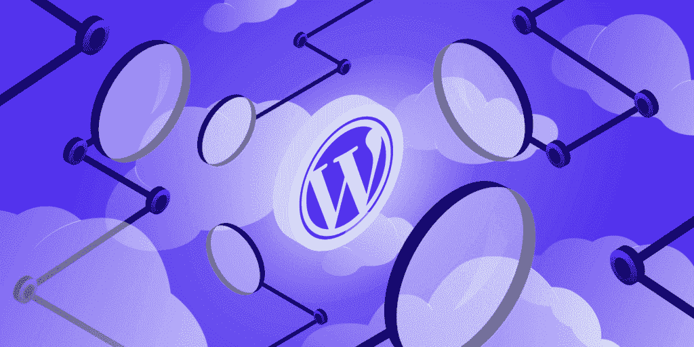

WordPress CMS.


### 信息

WordPress 是 2021 年最受欢迎的[CMS 平台。](https://kinsta.com/cms-market-share/#h-what-is-the-most-popular-cms-platform-in-2021)


WordPress 的历史令人着迷，但是总结一下，WordPress 从 2003 年就已经存在了，它最初是被设计用来建立博客的。

如今，它得到了无数贡献者和互联网上最大的社区之一的支持。因此，它成为了建立网站的首选。

#### WordPress 主要特征

WordPress 的一些关键特性包括:

1.  **免费开源:**和 Django 一样，WordPress 也是免费开源软件，这意味着每个人都可以贡献它的源代码。
2.  多功能性:虽然 WordPress 是一个 CMS，但是你可以用它建立几乎任何网站。
3.  巨大的市场份额:目前，WordPress 占据了 [40%的互联网份额](https://kinsta.com/wordpress-market-share/)。
4.  扩展性:WordPress 有一整套免费和付费的插件
5.  易于学习和维护:任何人都可以在几个小时内创建并开始管理他们的网站。你唯一需要[学习 WordPress](https://kinsta.com/learn/) 的是时间和资源。
6.  内置的 SEO 功能: WordPress 有内置的 SEO 工具，比如自动生成标题标签和[元描述](https://kinsta.com/blog/meta-description-wordpress/)。如果你需要更重的东西，你可以加入像 [Yoast SEO](https://kinsta.com/blog/yoast-seo/) 这样的外部插件。
7.  多个托管选项:您可以选择使用 WordPress.com 的[或自托管选项](https://kinsta.com/blog/wordpress-com-vs-wordpress-org/)。

#### WordPress 用法

WordPress 是一个内容管理系统，其主要目的是创建、管理和修改内容。也就是说，其大量的插件使其能够构建更多的功能，例如:

*   商业网站
*   [会员网站](https://kinsta.com/blog/wordpress-membership-plugins/)
*   [电子商务商店](https://kinsta.com/blog/woocommerce-tutorial/)
*   博客(WordPress 的最初目的)
*   [投资组合](https://kinsta.com/blog/portfolio-website/)
*   摘要
*   [论坛](https://kinsta.com/blog/wordpress-forum-plugins/)
*   非营利网站

## Django vs WordPress:一个深入的比较

我们已经看了 Django 和 WordPress 的主要特征。现在，是时候深入我们对这两者的比较了。

因为它们是不同的技术，有些方面似乎很难比较。但是，我们会为您提供决定最佳选择所需的重要信息。

### 后端 Web 框架与 CMS

Django 是一个后端框架，而 WordPress 是一个 CMS。正如你可能已经猜到的，它们是为了完成不同的任务。

web 框架是建立在编程语言[之上的一套工具，它让你从头开始构建 web 应用程序。像 Django 这样的大多数 web 框架不像 CMS 那样提供现成的内容管理工具；相反，您会收到一个 API 来定制您想要的任何东西。](https://kinsta.com/blog/best-programming-language-to-learn/)

与 CMS 相比， [web 框架](https://kinsta.com/blog/php-frameworks/)允许你创建更复杂和定制的特性，因为你可以用代码创建它们。有了 CMS，如果没有插件能满足你的需求，你创建定制功能的选择就更少了。

例如，其中一个 CMS 可能很难连接到第三方 API，或者管理高度复杂的身份验证系统。

下面是一个表格，比较了在构建网站时，web 框架和内容管理系统的功能。

| Web 框架 | 羧甲基淀粉钠 |
| --- | --- |
| 你需要知道如何编码来建立一个网站。 | 建网站不需要什么具体的知识。 |
| 用于构建具有复杂需求和定制功能的 web 应用程序。 | 用于构建没有复杂需求的网站，利用各种插件。 |
| 一个网站的开发可以持续几个星期到几个月，这取决于需求。 | 由于其内置工具，启动网站更容易、更省时。 |
| 如果你需要雇佣开发人员来建立一个网站，费用会很高。 | 除非你使用昂贵的插件，否则它比使用 web 框架便宜。 |
| 由于不受特定 CMS 架构的限制，它通常更具可扩展性。 | 扩展功能的唯一方法是使用插件或创建自己的插件。 |

### 学习曲线

从 Django vs WordPress 的实用主义角度来看，前者比后者更难学习和使用。这是因为你需要以前在以下方面的知识:

*   基本编程概念(变量、循环、函数)
*   Python 编程(Python[中的关键词，工作原理，语法)](https://kinsta.com/blog/python-tutorials/)
*   终端命令(Unix 或 Powershell)
*   Python 中的面向对象编程

除此之外，我们建议你在发布你的第一个现场网站之前先和 Django 玩玩。你可以跟随[Django 官方教程](https://docs.djangoproject.com/en/3.2/intro/tutorial01/)，指导你创建一个投票应用。

另外，如果你计划自己建立一个 Django 站点，你应该了解一些前端开发。对于你的第一个网站来说，基本的 HTML 和 CSS 就足够了。

另一方面，WordPress 有一个更友好的学习曲线，你可以在几天内创建你的第一个网站。这是因为你在使用 GUI(图形用户界面)而不是手工编码你的网站。

如果你想让你的网站快速运行，WordPress 是一个更好的选择。但是如果你有耐心并且想随时学习 web 开发，你可能会选择 Django。

无论你选择哪种技术，你都可以通过使用它赚到一大笔钱。WordPress 的开发者 T1 和 T2 的网页开发者 T3 在了解了 CMS 的来龙去脉后，都倾向于发展壮大。

### 谁在使用每一个？

让我们讨论一下 Django vs WordPress 技术在全球最赚钱的公司中的受欢迎程度。

#### Django 市场份额

根据 SimilarTech 的数据，有多达 92，000 个网站使用 Django 作为他们的主要框架。


Django usage stats. (Image Source: SimilarTech)


虽然 Django 网站的数量今年保持不变，但总流量却大幅增加。这是 Django 项目可以实现的可伸缩性的一个好迹象。


Django usage trend. (Image Source: [Wappalyzer](https://www.wappalyzer.com/))


然而，这些统计数据并没有反映全部现实。Django 的一个主要用途是微服务，这类任务不会出现在总体报告中。

#### 使用 Django 的站点

让我们看看使用 Django 的最受欢迎的网站。

##### 照片墙

你能相信世界上最常用的社交媒体之一最初是由 Django 项目发起的吗？

引用 [Instagram](https://kinsta.com/blog/instagram-stats/) 工程团队对 Instagram 的 Django 用法:

" *Instagram 目前拥有世界上最大的 Django web 框架部署，该框架完全用 Python 编写。*

##### 迪斯克斯

Disqus 是最常用的评论系统。它使用 Django 作为主要框架，每秒处理超过 45，000 个请求。

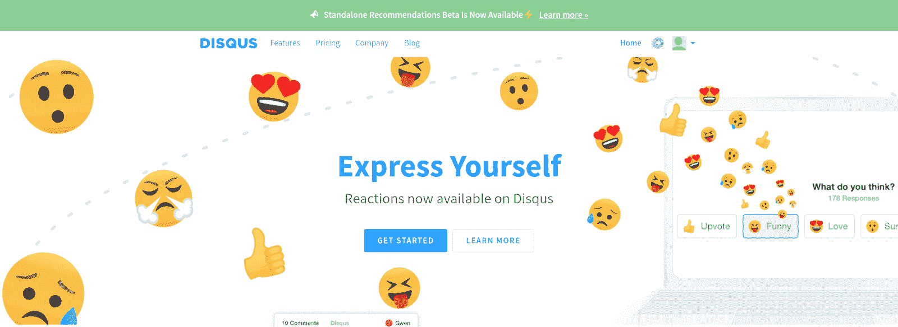

Disqus homepage.


##### 华盛顿邮报

你还记得 Django 最初被设计用来建立一个报纸网站吗？

现在，这仍然是真的。华盛顿邮报用它，洋葱和 PBS 也用它。

##### 国家航空与航天局

NASA 的官方网站是用 Django 构建的，它每月处理超过 200 万次浏览。

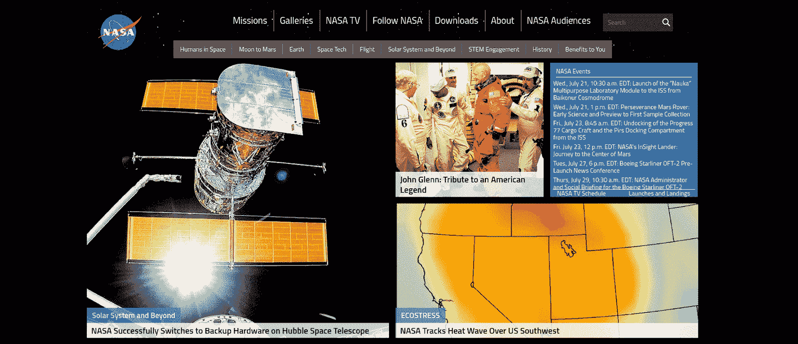

NASA’s homepage.


##### 更多网站

很多流行的网站都以某种方式使用 Django，我们不能不提到以下内容就结束这个列表:

*   Reddit
*   国家地理
*   Spotify
*   浏览器名
*   Eventbrite
*   DropBox
*   BitBucket

#### WordPress 市场份额

考虑到 WordPress 是世界上使用最多的 CMS，它运行大量的网站并不令人印象深刻。然而，令人震惊的是，WordPress 竟然占据了 40%的网络份额。

如果我们意识到每天有超过 500 个 WordPress 网站被创建，这个数字可能会增加。

#### 使用 WordPress 的网站

有了这么高的可用性，认为一些[访问量最大的网站使用 WordPress](https://kinsta.com/blog/wordpress-site-examples/) 是可行的。让我们看看其中的一些。

##### 微软博客

微软的官方博客使用 WordPress 来管理关于其产品和新闻的内容。

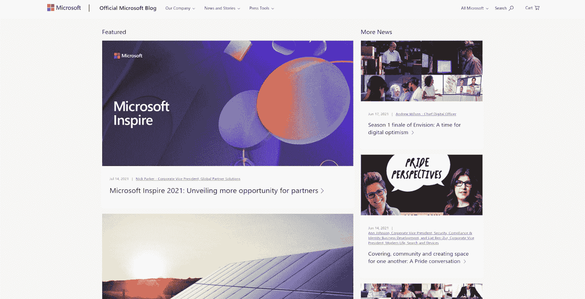

Microsoft’s blog homepage.


##### 滚石乐队

甚至你最喜欢的乐队也在使用 WordPress 来支持他们的网站！

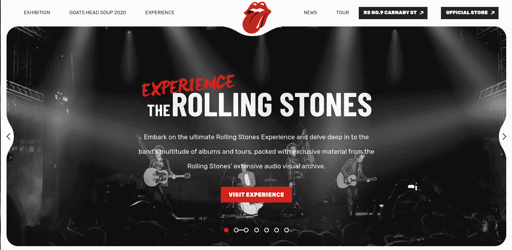

The Rolling Stones’ homepage.


##### 华特·迪士尼公司

WordPress 为华特·迪士尼公司的新闻网站提供支持。


Walt Disney homepage.


##### 更多网站

使用 WordPress 提及[更多著名网站:](https://kinsta.com/blog/wordpress-site-examples/)

*   TechCrunch
*   星球大战博客
*   瑞典官方网站
*   Rackspace 博客


### 信息

Protip:你可以用 [WhatCMS](https://whatcms.org/) 查看一个网站用的是什么 CMS。


### 外部工具

这两种技术都具有出色的可扩展性。

在 Django 这边，你可以访问所有的 [Python 包索引(PyPI)](https://pypi.org/) ，这意味着你可以完全免费地使用其他人制作的工具和应用。

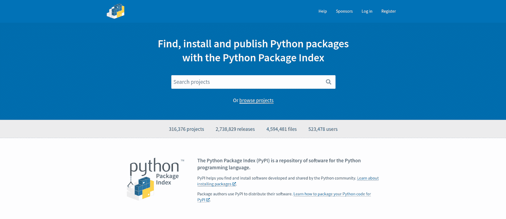

Python Package Index (PyPI)


Django 开发中一些最常用的第三方包是:

*   Django REST 框架:用 Django 构建 REST APIs 的最常用工具包
*   Django 扩展:一套用于 Django 开发者日常工作的工具
*   [whiten noise](http://whitenoise.evans.io/en/stable/django.html):管理 Python web 应用的静态文件服务
*   Django allauth :解决将第三方认证——如社交媒体认证——集成到您的项目中的问题

要更深入地了解你可以整合到你的项目中的 Django 应用，你可以参考 [Django 包](https://djangopackages.org/)。

另一方面，WordPress 拥有第三方插件和[开发套件](https://kinsta.com/devkinsta/)的整个市场。如果我们只计算在 WordPress.org 的[列出的免费插件，我们将有超过 58000 个选项。](https://wordpress.org/plugins/)

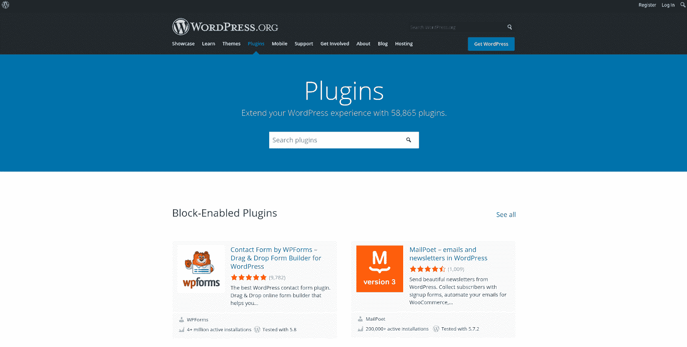

WordPress Plugins official repository page.


列举其中一些:

*   [Yoast SEO](https://kinsta.com/blog/yoast-seo/) :最常用的 SEO 插件
*   一个 WordPress 页面生成器插件
*   [忍者表单](https://wordpress.org/plugins/ninja-forms/):一个拖放式表单生成器
*   [WooCommerce:](https://kinsta.com/blog/woocommerce-tutorial/) 只需点击几下鼠标，就可以建立一个电子商务商店

要了解更多关于 WordPress 插件的信息，你可以查看我们根据它们的用途精心挑选的最佳插件列表。

### 文件结构

当构建对互联网有意义的东西时，web 项目的文件结构是需要注意的最重要(但经常被低估)的元素之一。

 ## 注册订阅时事通讯


### 想知道我们是怎么让流量增长超过 1000%的吗？

加入 20，000 多名获得我们每周时事通讯和内部消息的人的行列吧！

[Subscribe Now](#newsletter)

现在让我们比较 Django 和 WordPress 的文件结构。

#### Django 文件结构

Django 将其结构分为项目和应用。简单地说，项目是配置和应用程序的集合。一个应用程序是一个能够做一些事情的 web 应用程序，例如，一个博客应用程序、投票应用程序或认证过程。

一个项目可以包含多个应用程序，一个应用程序可以是多个项目的一部分。

要创建 Django 项目，请确保您已经安装了 Python，并在您的终端中运行以下命令:

```
pip install django
django-admin startproject myproject
tree myproject/
```

使用上面的命令，安装 Django，启动一个名为“myproject”的项目，并打印其文件结构:

```
myproject/
├── manage.py
└── myproject
├── asgi.py
├── __init__.py
├── settings.py
├── urls.py
└── wsgi.py
1 directory, 6 files
```

如果您选择使用适当的文件管理器来查看文件结构，您将看到如下内容:

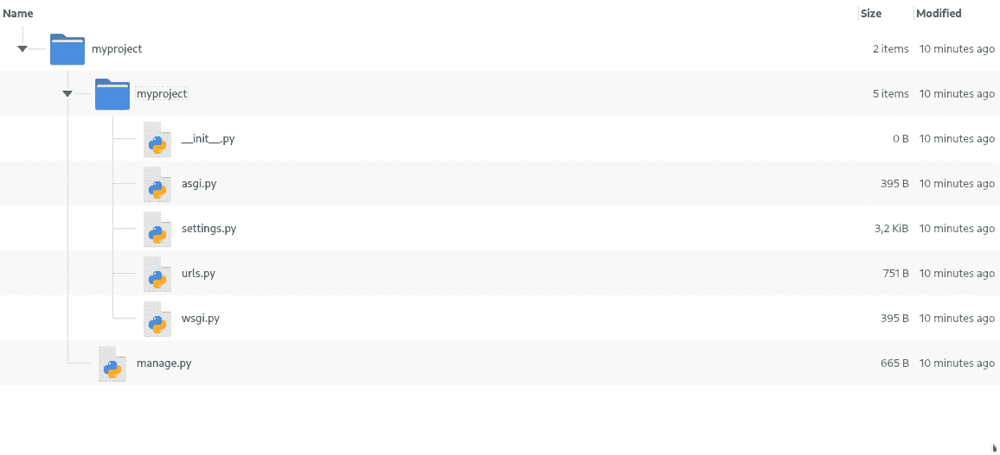

Django project file structure.


正如您可能意识到的，Django 有一个双文件夹结构，其中“根文件夹”有另一个同名的目录。该子文件夹包含项目的所有配置。

我们不会深入讨论 Django 项目中每个文件的用途，但是你可以在官方教程中查看它们。

现在，要创建一个 Django 应用程序，运行以下命令(确保您所在的目录包含 **manage.py** 文件):

```
cd myproject/
ls # check the manage.py file is there
python manage.py startapp myapp
```

这将创建一个名为 **myapp** 的 Django 应用程序。让我们看看新文件夹中有什么:

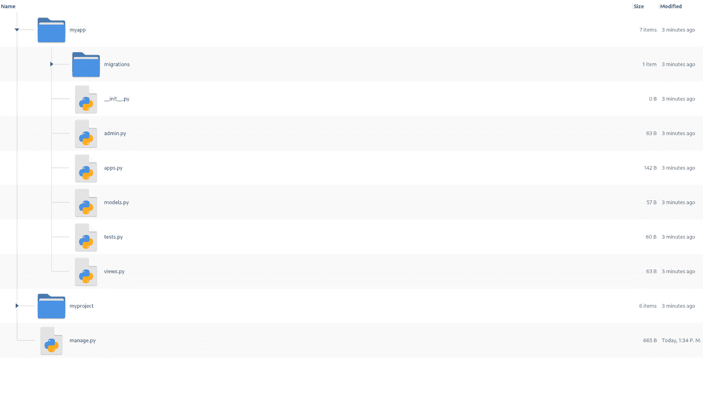

Updated Django app file structure.


正如你所看到的，应用程序和项目文件夹的结构是完全不同的。基本上，一个应用程序文件夹包含它自己的配置、一个模型注册(Django 设计数据库表的方式)、处理 web 请求和响应的视图以及一个 URL 调度程序。

这都是为了姜戈！接下来让我们来看看 WordPress 的文件结构。

#### WordPress 文件结构

如果你对 WordPress 和 Django 的文件结构比较感兴趣，那么你来对地方了。我们在本地安装[WordPress](https://kinsta.com/blog/install-wordpress-locally/)看看它的文件结构是什么样子。

进入 [WordPress 下载页面](https://wordpress.org/download/)并下载 ZIP 文件:

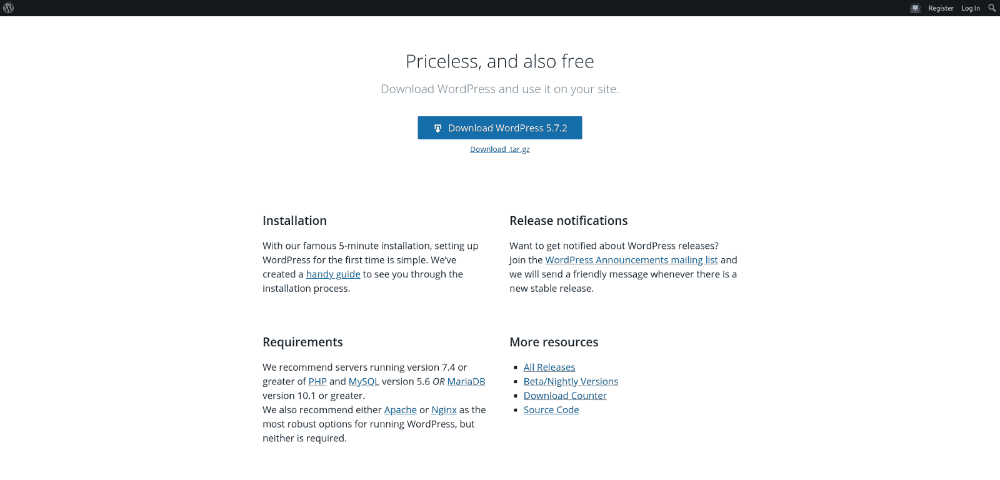

WordPress Download page.


使用图形文件管理器或您选择的其他工具提取 ZIP 文件夹:


Extracting zipped WordPress archive.


它会生成一个名为**的文件夹。打开此文件夹，查看其中包含的文件列表:**


A list of WordPress files and directories.


我们已经在我们的指南 [WordPress 文件](https://kinsta.com/knowledgebase/wordpress-files/)中对此进行了更全面的解释，但是正如你可能注意到的，在一个站点的 WordPress 文件结构中有许多 PHP 文件。这是因为 WordPress 本质上是用 PHP 构建的。

让我们看看文件结构会是什么样子，并将其与 Django 进行比较:


WordPress file structure.


看到一个 WordPress 站点的结构是如此的复杂，令人印象深刻。如果你仔细看看子文件夹 **wp-admin** 、 **wp-content** 和 **wp-includes** ，事情会变得更加复杂。

这种方法并不实用，因为大多数时候你不会去摆弄这些文件。然而，它证明了 CMS(这里是 WordPress)比像 Django 这样的 web 框架更加“紧凑”。

当然，有了 Django，你的文件结构可以无限增长，因为你可以创建任意多的应用程序，添加任意多的特性。像 Instagram 这样的应用程序包含超过 10，000 个微小的 Django 应用程序，但我们只是比较了这些技术的起点。

另一个区别是与这些文件结构的交互。在 Django 中，你必须使用终端(如果你从未使用过，这可能看起来很可怕)，而在 WordPress 中，很少需要终端。你可以看到，Django 和 WordPress 的文件结构是完全不同的。

### 模板系统

我们生活在动态网站的时代。大多数时候，你不想依赖[静态 HTML](https://kinsta.com/blog/wordpress-vs-static-html/) ，这也是为什么像 WordPress 或 Django 这样的现代技术都有动态显示数据的模板。

#### Django 模板语言

Django 有 [DTL](https://docs.djangoproject.com/en/3.2/ref/templates/language/) (Django 模板语言)，它由文本文件(HTML、XML、CSV)组成，这些文件使用特殊的语法将特定的逻辑绑定到用户体验中。

需要为您的电子商务网站提供超快的、可靠的、完全安全的托管服务吗？Kinsta 提供所有这些服务，并由 WooCommerce 专家提供 24/7 的世界级支持。[查看我们的计划](https://kinsta.com/plans/?in-article-cta)

例如，如果您想在不编辑站点的情况下让版权标志包含当前年份，那么您可以使用 Django 模板标签来反映用户查看页面的年份。

DTL 包括的一些功能有:

*   变量
*   环
*   动态标签
*   过滤
*   注释语法
*   模板继承
*   自动 HTML 转义(针对内联脚本的额外保护)

#### WordPress 模板层次结构

当然，WordPress 是一个避免使用静态 HTML 文件的动态平台。它还带有内置的模板系统。

这些模板是普通的 PHP 文件，一组结构化的模板产生一个 [WordPress 主题](https://kinsta.com/best-wordpress-themes/)。

Django 模板语言和 WordPress 模板的主要区别在于，Django 模板是用它们自己的语法编写的，这意味着你不是在编写一个 Python 文件，而是使用一个带有特殊组件的文本文件。另一方面，WordPress 模板是用纯 PHP 编写的。

我们已经做了一个关于 [WordPress 模板层次](https://kinsta.com/blog/wordpress-template-hierarchy/)的完整指南，所以不要忘记去看看！

### 证明文件

这两种技术都有一些互联网上最有效的文档。

Django 文档将从安装过程引导到该框架的更高级用法。您可以找到教程、主题指南、参考指南(Django 特性的技术概述)和操作指南。


Django documentation page.


在撰写本文时，Django 文档已被翻译成 10 种语言，还会有更多的语言。

在 WordPress 这边，你有 [WordPress codex](https://codex.wordpress.org/) ，它包括了你开始建立一个 WordPress 网站所需要的大部分东西。

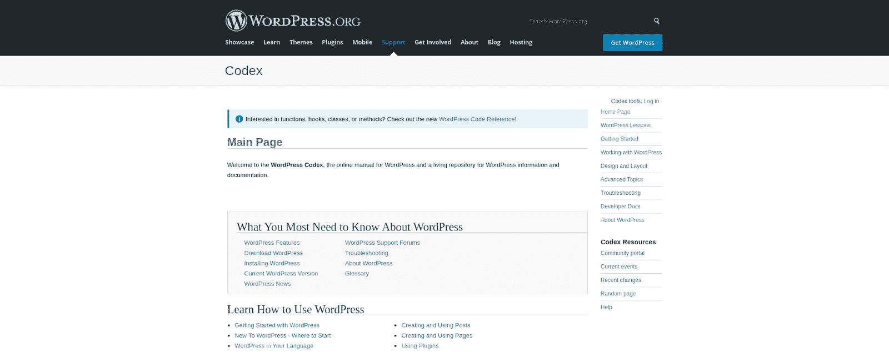

WordPress Codex page.


目前，WordPress codex 被翻译成 50 多种语言，这是有意义的，因为它拥有全球市场份额。

WordPress 还拥有大量的[开发者资源](https://developer.wordpress.org/),当你在进行一个项目时，这些资源可以帮助你。

### 社区

没有社区的支持，什么是伟大的技术？让我们来看看 Django 和 WordPress 的不同社区。

#### Django 社区

Django 有一个庞大的学习者和专业人士社区，他们会帮助你用这个框架解决问题。

Django 的社区页面是一个很好的起点，因为它包含了很多有价值的链接和资源。

在像 [Reddit](https://www.reddit.com/r/django/) 和 [Dev.to](https://dev.to/t/django) 这样的网站上还有额外的子社区。还值得一提的是 [StackOverflow 的 Django 标签](https://stackoverflow.com/questions/tagged/django)。

如果你想参加 Django 会议，可以去参加一年一度的 [DjangoCon](https://2021.djangocon.us/) 。不幸的是，它只在美国和欧洲可用，但是你可以找一个较小的当地会议，或者[自己组织一个](https://www.djangoproject.com/foundation/conferences/)。

最后但并非最不重要的是，非营利组织 [Django Girls](https://djangogirls.org/) 正在通过教她们如何使用 Django、Python、HTML 和 CSS 来赋予女性权利。

#### WordPress 社区

因为 WordPress 的大量使用，假设它有一个更大的社区是很正常的。

你可以在互联网上找到成百上千的 WordPress 团体和社区，但出于实用目的，我们将只提到最突出的。

WordPress 是世界范围内最著名的会议组织者。无论你在哪里，很可能你身边就有一个 WordCamp 会议。

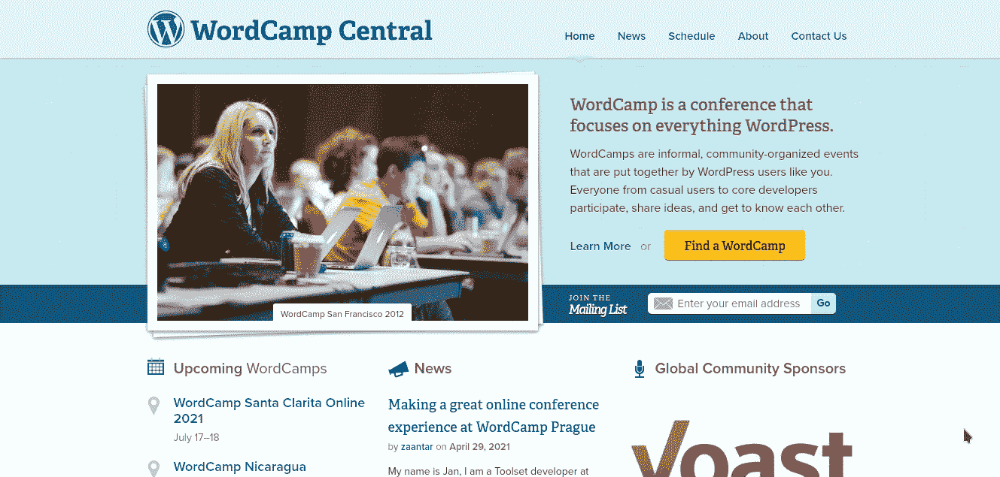

WordCamp homepage.


官方的 [Make WordPress 社区网站](https://make.wordpress.org/community/)也组织面对面和在线的社区聚会。他们甚至有一个[官方的休闲聊天](https://make.wordpress.org/chat/)来谈论贡献(代码、设计、文档等)。)到 WordPress 项目。

WordPress 社区的[开发者](https://dev.to/t/wordpress/top/infinity)有超过 1200 个帖子，StackOverflow 有一个[保留标签](https://stackoverflow.com/questions/tagged/wordpress)用于 WordPress 故障排除。

这些 WordPress 社区令人印象深刻的一点是，他们为所有 WordPress 用户创建免费插件和主题。这类似于 Django 通过 PyPI 提供的包。

总结一下，这两种技术都有一个很棒的社区，你不会费力去见人和谈论 Django 或 WordPress。也就是说，由于 WordPress 的流行，遍布全球的 WordPress 会议比 Django 还多。

### 托管选项

如果没人能访问，你为什么要建立一个网站？这就是为什么你需要有清晰的选择来部署和托管你的站点。

#### Django 托管

Django 有各种各样的主机选项，但是一般来说，您需要使用 WSGI 或 ASGI 进行部署的技能。另外要考虑的是，Django 本身不能处理静态文件(CSS、JS、images)，所以你需要一个单独的服务来管理它们。

您可以使用的一些选项有:

*   **专用现成的** [Pa](https://kinsta.com/blog/what-is-paas/) [aS](https://kinsta.com/blog/what-is-paas/) [(平台](https://kinsta.com/blog/what-is-paas/)[a](https://kinsta.com/blog/what-is-paas/)[s](https://kinsta.com/blog/what-is-paas/)[a](https://kinsta.com/blog/what-is-paas/)[Serv](https://kinsta.com/blog/what-is-paas/)[ice)](https://kinsta.com/blog/what-is-paas/):不用手工配置服务器。只需在项目中包含最少的配置，就可以开始了。
*   **直接安装在 Linux 服务器或虚拟机上:**您在 Linux 服务器或虚拟机(例如 AWS EC2)上管理依赖关系并配置 web 服务器软件，如 NGINX 或 [Apache](https://kinsta.com/knowledgebase/what-is-apache/) 。
*   **在 Linux 服务器上使用 Docker:**与前一个选项一样，您通过 Docker 管理所有依赖项和配置。
*   **在无服务器基础设施上部署:**现在，您可以使用定制后端(例如 AWS Lambda)部署 Django 无服务器。

Django 托管的一个缺点是成本——通常，你需要为运行的 Django 站点支付比 WordPress 实例更高的费用。

Django 旨在建立更强大的应用程序，在这些程序中，用户有高水平的互动，因此，比一般的 WordPress 网站有更多的 web 请求。

考虑到这一点，如果你预计每天的访问量少于 1000 次，并且你的 Django 应用程序得到了很好的优化，你可以预计每月支付 5 到 25 美元。

#### WordPress 主机

可以托管 WordPress 的选项多得令人不知所措。

任何安装了 PHP、 [MySQL](https://kinsta.com/knowledgebase/what-is-mysql/) 、HTTP 支持和 [Apache 或 NGINX](https://kinsta.com/blog/nginx-vs-apache/) 的 Linux 服务器都可以做到。

然而，你为什么要手动配置一个服务器来托管 WordPress ？这个 CMS 的主要目的是尽快推出任何类型的网站。

这就是为什么大多数时候，你会使用 WordPress 特有的主机——这只不过是为了满足所有 WordPress 需求而优化的主机——这样你就可以专注于重要的东西。

当提到 WordPress“专用”主机时，我们有两种选择:共享主机和托管主机。

我们已经就[托管与共享托管](https://kinsta.com/blog/managed-wordpress-hosting/#shared-hosting)做了一个完整的指南，但是让我们来回顾一下它们各自的含义:

*   共享主机:你的网站将与其他 WordPress 实例“共享”一台服务器，这通常意味着它的性能将会更差，同时还有潜在的无用支持和更多问题。然而，如果你刚刚开始，共享主机可能是一个不错的选择，因为它会便宜得多(每月 3-25 美元)。
*   托管:这就像是租房子而不是公寓。你将会得到一个为你的 WordPress 站点服务的专用服务器，以及更好的性能和高质量的支持。如果你是一个有经验的 WP 开发者[管理多个网站](https://kinsta.com/podcast/solo-developer-thousands-websites/)或者一个中等规模的企业，你应该选择托管，为此你每月要支付 25 到 150 美元。

### 类似

让我们回顾一下 Django 和 WordPress 之间的一些关键相似之处:

*   自由和开源软件
*   能够建立大多数类型的网站
*   多语言支持
*   由世界级组织使用
*   数量惊人的第三方工具
*   可扩展且灵活的文件结构
*   简单而强大的模板系统
*   大量文档
*   伟大的社区
*   几个托管选项

### 差异

虽然 Django 和 WordPress 之间有很多相似之处，但是在选择一种技术时，差异是关键。

| 姜戈 | WordPress |
| --- | --- |
| 后端 web 框架 | 内容管理系统 |
| 用 Python 写的 | 用 PHP 写的 |
| 支持多种数据库:PostgreSQL、MariaDB、MySQL、Oracle、SQLite 以及更多具有第三方后端的数据库 | 仅支持 MySQL 和 MariaDB |
| 始于 2005 年的报纸解决方案 | [于 2003 年作为博客平台](https://kinsta.com/learn/wordpress-history/#history-of-wordpress)成立 |
| 创建网站所需的 Python 和 Linux 知识 | 入门不需要编码技能，但了解基本的 HTML、CSS 和 PHP 会有所帮助 |
| 从头开始每个项目 | 利用现成的工具来管理内容 |
| 较低的市场份额 | 运行 40%的网络 |
| 需要更多的开发计划和时间(但仍然是快速开发框架) | 在短时间内建立网站 |
| 必须手工编写前端代码 | 提供一键安装的主题 |
| 默认情况下没有搜索引擎优化功能 | 内置的搜索引擎优化功能 |

## 您可以探索的其他 CMS 选项

Django 和 WordPress 都变得如此受欢迎，以至于基于这两个受欢迎的平台诞生了“儿童”CMS。这些是 Django vs WordPress 的分支版本，试图提供原始 CMS 所没有的东西。

### Django vs WordPress

作为一个 web 框架，Django 能够构建更多的 CMS。Django CMS 是一个基于 Django 之上的内容管理系统，面向开发者和内容编辑者。


Django CMS.


它是免费和开源的，有很好的文档，并且有一个不断增长的社区。

如果你需要一个 CMS 但是想保留 Django 的特性，Django CMS 是一个完美的选择。

### Wagtail CMS vs WordPress

Wagtail 是另一个建立在 Django 之上的 CMS。它有一个漂亮的界面，可以连接到你已经在开发的其他 Django 应用。

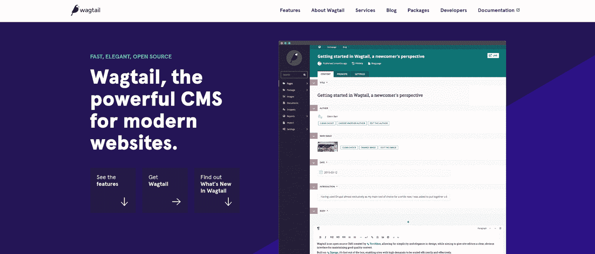

Wagtail CMS.


同样的故事:如果你想完全控制你的代码库，又不想失去 Django 的所有特性，Wagtail 可能可以满足你的需求。

[Django vs WordPress- which platform should you choose for your site? 💥Click to Tweet](https://twitter.com/intent/tweet?url=https%3A%2F%2Fkinsta.com%2Fblog%2Fdjango-vs-wordpress%2F&via=kinsta&text=Django+vs+WordPress-+which+platform+should+you+choose+for+your+site%3F+%F0%9F%92%A5&hashtags=CMS%2CWordPress)

## 摘要

Django 和 WordPress 已经成为能够构建任何类型网站的技术。这两种方法都不会错，但是在做决定之前，你应该考虑每种方法的优点和缺点。

Django 是您更好的选择，如果:

*   您的项目对定制特性或 API 连接有许多需求
*   你的项目侧重于用户互动(用户会主动使用你的网站，而不是被动地阅读它)
*   任务自动化是重中之重
*   你想在建立网站的同时提高你的编程技能
*   你想完全控制你的整个网站

在以下情况下，WordPress 可能更适合您的需求:

*   你需要一个个人网站、作品集或博客
*   你正在为当地企业开发一个简单的网站
*   时间是重中之重
*   你还不知道如何编码
*   你的网站没有复杂的许可系统( [WordPress 会很容易处理它](https://kinsta.com/blog/wordpress-user-roles/)
*   你想要现成的搜索引擎优化功能

在 Kinsta，我们显然是 WordPress 的粉丝，但是每个人的需求是不同的。

关于 Django vs WordPress，你还有什么问题吗？请在评论区告诉我们！

* * *

让你所有的[应用程序](https://kinsta.com/application-hosting/)、[数据库](https://kinsta.com/database-hosting/)和 [WordPress 网站](https://kinsta.com/wordpress-hosting/)在线并在一个屋檐下。我们功能丰富的高性能云平台包括:

*   在 MyKinsta 仪表盘中轻松设置和管理
*   24/7 专家支持
*   最好的谷歌云平台硬件和网络，由 Kubernetes 提供最大的可扩展性
*   面向速度和安全性的企业级 Cloudflare 集成
*   全球受众覆盖全球多达 35 个数据中心和 275 多个 pop

在第一个月使用托管的[应用程序或托管](https://kinsta.com/application-hosting/)的[数据库，您可以享受 20 美元的优惠，亲自测试一下。探索我们的](https://kinsta.com/database-hosting/)[计划](https://kinsta.com/plans/)或[与销售人员交谈](https://kinsta.com/contact-us/)以找到最适合您的方式。