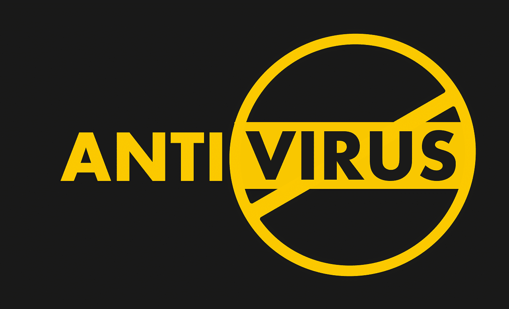
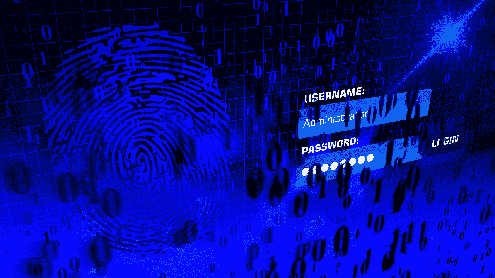

# 2022 年在家工作安全提示保护您的数据

> 原文:[https://kinsta.com/blog/work-from-home-security/](https://kinsta.com/blog/work-from-home-security/)

所以，你在家里很安全。但是你在家工作时安全吗？为了有效地保护您的数据安全，我们需要查看一些重要的家庭安全提示。

在家工作既平静又有趣。它已经存在了几十年，但自从当前的全球疫情开始以来，它的势头越来越大。

问题是，在家工作也会带来网络安全风险，尤其是对那些没有合适的 IT 基础设施的小企业来说。缺乏安全意识的员工会对他们自己和他们的雇主造成很大的伤害。

在金斯塔，我们从一开始就完全远离工作，并且[总是为那些寻求远程工作的人提供机会](https://kinsta.com/careers/)。

这就是为什么在这个全面的指南中，我们将帮助您了解在家工作时可能面临的最常见的网络安全风险。我们还将分享重要的家庭安全提示，帮助您在网上工作时保持安全。

继续读！

 <kinsta-auto-toc heading="Table of Contents" exclude="last" list-style="arrow" selector="h2" count-number="-1">## 6 在家工作的常见安全风险

在我们开始讨论在家工作时保持在线安全的技巧之前，让我们先来看看针对远程员工的常见网络攻击类型。
<kinsta-advanced-cta language="en_US" type-int-post="101755" type-int-position="3"></kinsta-advanced-cta>

<link rel="stylesheet" href="https://kinsta.com/wp-content/themes/kinsta/dist/components/ctas/cta-mini.css?ver=2e932b8aba3918bfb818">

> Kinsta 把我宠坏了，所以我现在要求每个供应商都提供这样的服务。我们还试图通过我们的 SaaS 工具支持达到这一水平。
> 
> <footer class="wp-block-kinsta-client-quote__footer">
> 
> 
> 
> <cite class="wp-block-kinsta-client-quote__cite">Suganthan Mohanadasan from @Suganthanmn</cite></footer>

[View plans](https://kinsta.com/plans/)

### 1.网络钓鱼诈骗

远程员工面临的最大网络威胁之一是[网络钓鱼攻击](https://kinsta.com/blog/ecommerce-fraud-prevention/)。尽管网络钓鱼诈骗起源于 20 世纪 90 年代中期，但时至今日仍然普遍存在，并且随着技术的进步变得更加复杂。

网络钓鱼是一种网络攻击，旨在窃取机密数据，如信用卡号、银行账户详情和登录凭据(如用户名、密码和个人身份号码)。网络钓鱼不仅会直接伤害您个人/员工，还会给您的组织/雇主带来安全风险。

那么，网络钓鱼是如何运作的呢？

攻击者伪装成受信任的实体，引诱目标受害者点击通常通过电子邮件或文本消息发送的恶意链接。当接收者打开被感染的链接时，他们会不知不觉地在自己的设备上安装[恶意软件甚至勒索软件](https://kinsta.com/knowledgebase/the-site-ahead-contains-malware/)。

虽然最常见的网络钓鱼欺诈是通过电子邮件进行的，但许多网络钓鱼者使用其他感染手段，包括短信(垃圾短信)、基于语音的欺诈(视像)、基于社交媒体的威胁，甚至通过 USB 闪存驱动器。

随着新冠肺炎病毒的传播，网络钓鱼者正在利用疫情，通过包含声称拥有该病毒重要信息的链接的电子邮件来实施网络攻击。

[所以，你在家很安全……但是在家工作时你安全吗？👀使用这些提示来锁定你的在线工作👨‍💻 点击推文](https://twitter.com/intent/tweet?url=https%3A%2F%2Fkinsta.com%2Fblog%2Fwork-from-home-security%2F&via=kinsta&text=So%2C+you%E2%80%99re+staying+safe+at+home%E2%80%A6+but+are+you+staying+safe+while+working+from+home%3F+%F0%9F%91%80+Use+these+tips+to+lock+down+your+online+work+%F0%9F%91%A8%E2%80%8D%F0%9F%92%BB&hashtags=CyberSecurity%2CWFH)

### 2.弱密码

脆弱的[密码](https://kinsta.com/blog/change-wordpress-password/)是另一个主要的安全风险，也是黑客对员工和公司，尤其是中小型企业造成破坏的入口。你相信攻击者只需要一个弱密码就能攻破整个网络吗？

尽管许多公司在网络安全方面进行投资，以应对安全威胁和数据泄露，但员工使用的弱密码使黑客很容易获得他们的个人电脑和商业数据。

《2020 年威瑞森数据泄露调查报告》显示，81%的数据泄露是由于使用弱密码造成的。这是一个巨大的百分比。

攻击者使用许多不同的方法来破解密码，例如凭据填充、字典攻击、暴力攻击和彩虹表攻击。让我们简要地介绍一下这些是什么。

#### 凭据填充

这是黑客使用的最常见的攻击之一，他们会针对目标网站登录自动运行被破坏的登录凭据的数据库列表。在这种攻击中，黑客依赖许多用户使用相同的密码和密码变体。

#### 字典攻击

这是一种密码猜测攻击，黑客使用密码中常见的常用词字典。在密码中使用真实单词或短语的个人很容易受到这种攻击。

#### 暴力攻击

这是另一种密码猜测攻击，黑客提交尽可能多的密码组合(字母、数字和符号)，直到最终破解密码。

#### 彩虹桌攻击

这种黑客攻击使用彩虹哈希表，其中包含用于加密密码和密码短语的值。这类似于字典攻击，但黑客使用的是表格，而不是单词列表。
<kinsta-advanced-cta language="en_US" type-int-post="101755" type-int-position="4"></kinsta-advanced-cta>

### 3.不安全的 WiFi 网络

虽然在家工作有其好处，但如果你连接到不安全的 WiFi 网络，如咖啡馆、餐馆、酒店、图书馆、共同工作空间或机场的公共 WiFi 网络，这可能会给你和你的雇主带来安全问题。

对于黑客和网络罪犯来说，公共 WiFi 网络就像一个迪斯尼乐园:它允许他们轻松地侵入设备，窃取您的个人数据和身份。

当你使用不安全的 WiFi 网络时，黑客使用一些流行的技术攻击你的电脑或智能手机。让我们讨论其中的几个。

#### 中间机器(MITM)攻击

这是一种窃听攻击，黑客可以拦截客户端(您的设备)和您连接的[服务器](https://kinsta.com/blog/nginx-vs-apache/)之间传输的数据。然后，攻击者有能力通过虚假网站或消息与您通信，窃取您的信息。公共 WiFi 网络是常见的目标，因为它们要么加密不良，要么根本没有加密。

#### 邪恶双生攻击

这是一种 MITM 网络攻击，黑客利用加密不良或未加密的 WiFi 网络(通常是公共 WiFi/热点)建立一个带有假(邪恶双胞胎)接入点的假 WiFi 网络。一旦你加入了这个虚假的网络，你就不知不觉地与黑客分享了你的所有信息。

### 4.在工作中使用个人设备

虽然一些组织为员工提供了远程工作设备，但大多数公司仍然允许员工使用他们的个人设备(例如笔记本电脑、台式机、平板电脑和智能手机)。结果呢？越来越多的安全和数据泄露事件。

当员工使用个人设备在家工作时，他们通常不会考虑到这些设备不是基于公司的 IT 基础架构，也不会共享相同的安全措施。这就是为什么个人设备更容易受到网络威胁的原因。

此外，使用个人设备在家工作的员工可以访问他们想访问的任何网站，安装任何应用程序或软件程序，否则雇主可能会出于安全原因阻止这些应用程序或软件程序，这使他们很容易成为恶意活动和黑客的目标。
T3】

### 5.恶意软件和病毒

恶意软件和病毒已经变得非常复杂，给企业和个人带来了严重的问题，尤其是在疫情的困难时期。糟糕的安全措施和鲁莽的员工行为导致了恶意软件和病毒的传播。

等等——恶意软件和病毒不是一回事吗？

答案是否定的。虽然病毒是一种恶意软件，但并不是所有的恶意软件都是病毒。

恶意软件是任何被创建来感染主机系统或其用户并对其造成损害的恶意软件的统称。恶意软件有不同的[类型，包括病毒、蠕虫、特洛伊木马、勒索软件、间谍软件和广告软件以及恶意软件。](https://kinsta.com/blog/types-of-malware/)

计算机病毒是一种恶意软件，它通过受感染的网站、应用程序、电子邮件、可移动存储设备和网络路由器来复制自身并尽可能广泛地传播到多种设备，就像生物病毒一样。计算机病毒的目的是在用户不知情的情况下造成尽可能多的伤害。它可以很容易地通过服务器传播并破坏网站。

### 6.未加密文件共享

如果您认为恶意软件、病毒和黑客是危险的，那么不安全的文件共享同样危险，对于远程工作来说甚至更危险。

远程员工可能会因不良做法而不经意地将关键业务数据置于风险之中。通过未加密的电子邮件共享文件使得黑客拦截这些电子邮件并窃取信息变得轻而易举。

使用便宜且安全性差的云文件共享，如个人[云存储](https://kinsta.com/blog/google-cloud-vs-aws/)驱动器，是另一个风险因素。此外，使用点对点(P2P)文件共享的员工对他们的公司构成了威胁，因为任何人都可以访问他们设备上的数据文件，包括黑客。

如果感染了恶意软件，闪存驱动器也会很危险，因为它们可以轻松绕过网络安全。如果员工将他们的系统设置为自动运行闪存驱动器，情况会变得更糟，这将允许恶意内容。

## 在家工作安全提示保护您的数据

以下是我们关于在家安全工作的最佳网络安全提示的综述。一定要先和你的雇主商量一下，以确定你们的想法是一致的。

<kinsta-auto-toc list-style="decimal" selector="h3" count-number="-1" sub-toc="true">T3】

### 1.投资好的安全软件

市场上有许多安全软件品牌可以帮助您抵御网络安全威胁。大多数这些软件应用程序可以同时保护您的设备免受各种不同类型的威胁。

杀毒标志。(图片来源: [Pixabay](https://pixabay.com/) )

如今，有许多针对不同类型攻击的软件，包括反病毒、反恶意软件、黑客企图拦截器和 [DDoS 防御](https://kinsta.com/blog/what-is-a-ddos-attack/)。一些程序是免费的，而另一些是付费的，根据它们提供的保护功能，价格从便宜(2 美元)到昂贵(120 美元)不等。

但是，随着网络威胁不断发展，变得越来越强大，可以绕过该软件，最好选择付费版本，因为它们通常更全面，包括更强大的安全功能，以打击恶意威胁。

请记住，可靠的安全软件和糟糕的安全软件的区别在于其更新的频率。换句话说，如果软件不断自我更新，这意味着每当计算机世界出现新的威胁时，它总是能够意识到。

### 2.将工作设备与个人设备分开

如果你在家工作，最好使用两个独立的设备，分别用于工作和个人用途。在这种情况下，如果一台设备受到不必要的威胁，另一台不会受到影响。

这不仅适用于您的计算机，还适用于任何连接到互联网、面临外部风险的设备。这包括您的电脑、移动设备、平板电脑等。它甚至适用于其他设备，如便携式存储单元。

如果您还没有单独的设备，那么我们强烈建议您进行更改。一些雇主为员工提供专用的工作设备，尤其是在当前的疫情时期。如果你是这种情况，那你就没有问题了。

我们建议的另一个重要步骤是，始终为你的重要工作文件保留单独的但不断更新的备份。在这种情况下，您可以仅仅为了这些备份而使用您的个人设备，当然，除非这些信息是高度机密的。

### 3.保持操作系统最新

大多数主流操作系统都有自己的防御工具[，如防火墙](https://kinsta.com/blog/what-is-a-firewall/)，以防止某些威胁影响您的设备。与安全软件一样，这些工具需要不断更新，以应对新引入的威胁。

这些工具随着操作系统的更新而更新。因此，强烈建议您始终保持所有设备上的操作系统处于最新状态。

大多数操作系统都提供了自动或手动更新的选项。我们建议您将它设置为自动选项，以便在更新可用时立即进行更新。

另一个重要的要点是确保你使用的操作系统是 100%可信的。与其他操作系统相比，这在 Microsoft Windows 中更为常见，因为有些人在安装 Windows 时没有正确的激活密钥，而激活密钥是保持所有内置安全工具正常工作所必需的。

### 4.保持软件最新

软件更新不仅限于您的操作系统，让您在设备上使用的所有软件和程序保持最新也至关重要，尤其是那些需要连接到互联网才能工作的程序。

这包括但不限于您的浏览器和通信程序( [Zoom](https://kinsta.com/blog/best-tools-for-freelancers/#49-zoom) 、 [Skype](https://kinsta.com/blog/best-tools-for-freelancers/#48-skype) 、Whatsapp Messenger 等)。).所有这些程序通常都有自己内置的安全措施，像任何安全软件一样，需要定期更新以应对任何新引入的威胁。

在您的工作设备上，只安装您工作实际需要的程序，并将所有其他程序(如游戏、流媒体应用程序等)保留在您的个人设备上，这一点也很重要。这与我们之前讨论过的“将工作设备与个人设备分开”的提示是一致的。

### 5.保护您的 WiFi 网络

今天，几乎每个家庭都使用无线互联网，或 WiFi，而不是有线以太网电缆。如您所知，连接到网络需要密码，该密码是您在设置路由器时创建的。此密码是决定您的家庭互联网网络是否安全的主要因素。

你的网络被入侵的最不具破坏性的结果是你的网速变慢，因为一些不需要的设备连接到它并使用它。然而，更严重的问题可能会发生，如其他方使用您的[网络](https://kinsta.com/blog/network-latency/)实施的网络犯罪，这些犯罪将会追踪到您。

 ## 注册订阅时事通讯

### 想知道我们是怎么让流量增长超过 1000%的吗？

加入 20，000 多名获得我们每周时事通讯和内部消息的人的行列吧！

[Subscribe Now](#newsletter)

如果你有一个爱管闲事的邻居，并且有一些技术技能，那么他们总是有可能猜出你的密码并侵入你的网络。这就是为什么有一个复杂的密码很重要，但不要复杂到你自己都忘记了。

这还没有结束。您还应该不时更改您的密码，以使其更加安全。最后，不要忘记定期安装您的固件更新，以保护您的网络免受任何新的漏洞。

如果你在公共网络上工作(咖啡厅、酒店等)。)，建议您选择保持设备在网络上不可见(连接到网络时检查您的共享选项)。

### 6.使用 VPN

一个[虚拟专用网络(VPN)](https://kinsta.com/blog/proxy-vs-vpn/) 最出名的是绕过在线地理定位来访问在世界上某些地方被屏蔽的流媒体网站。然而，VPN 也用于安全原因。例如，它们加密你的连接，保护你所有的浏览数据不被不必要的入侵者窃取。

VPN 是如何工作的。(图片来源: [Stream Telly](https://streamtelly.com/) )

当您连接到 VPN 时，您的数据不是通过互联网服务提供商(ISP)的服务器，而是通过 VPN 的公司服务器。在这个过程中，你的 [IP](https://kinsta.com/blog/static-vs-dynamic-ip/) 被更改，从而隐藏了你的真实在线身份。

如今市场上有许多 VPN 名称，它们或多或少都服务于相同的目的。但是，在为您选择合适的 VPN 时，有几个关键因素需要考虑。

首先，你必须确保你选择的 VPN 在你的国家确实有效，因为一些国家禁止使用 VPN。您可以在订阅之前咨询 VPN 的客户支持。

其他因素包括 VPN 支持的加密级别(L2TP、OpenVPN 等。)及其服务器的数量和位置。加密级别可以决定 VPN 是否足够安全。现在很多 VPN 都支持[多重加密级别](https://kinsta.com/blog/types-of-ssl-certificates/)，适合不同的情况。

VPN 服务器的数量和位置决定了你是否能找到离你的地理位置足够近的服务器，从而从更快的连接速度中获益。服务器越近，连接速度越快。

VPN 有几个安全特性。你可能会得到的一个有用的特性是终止开关。这样做的目的是在你的 VPN 连接意外中断的情况下，完全阻止你的互联网连接。这可以保护您的设备在连接断开时不会暴露。

其他 VPN 为不同的设备和操作系统(Windows、Mac、iOS、Android、Linux 等)提供浏览器扩展和应用程序。).在某些情况下，您甚至可以设置您的家庭路由器直接通过 VPN 连接，从而保护同时连接到网络的所有设备。

### 7.人身安全

在公司办公室工作时，保护您的设备免受盗窃不是您的责任。通常会有保安人员为你处理这些事情，尽管在某些情况下，你可能会被要求在离开前锁上办公室或电脑。

同样的概念在家里也适用，只是原因不同。在办公室，只有你和你精通技术的员工四处走动，但在家里，有孩子、宠物、亲戚，甚至朋友。我们并不是说你不能信任他们，或者他们会故意影响你的工作设备，但你仍然需要保护你的数据免受不必要的篡改。

这可以通过保留所有与工作相关的设备和物品(文档、文件等)来实现。)锁在一个单独的房间里——或者，当你不用它们的时候，把它们锁在一个安全的橱柜里或者任何只有你能接近的地方。

### 8.使用安全的浏览器和搜索引擎

我们已经知道[流行的浏览器](https://kinsta.com/browser-market-share/)和搜索引擎，如谷歌和必应，为了他们自己的广告目的收集你的数据。这关系到你的工作，因为你可能会处理敏感信息。

不要误解我们——我们并不是暗示这些搜索引擎不好！但是涉及到你的工作，安全总比后悔好。这就是为什么在你的日常生活中使用它们很好，但在工作时最好使用更私人的选择。

有几个替代搜索引擎服务于这个目的。最受欢迎的是 [DuckDuckGo](https://kinsta.com/blog/duckduckgo-privacy/) 。它不仅有一个收集极少数据的搜索引擎，而且有自己的移动设备浏览器，也有同样的隐私概念。

与大多数搜索引擎不同，DuckDuckGo 不会收集任何泄露您在线身份的信息。相反，它允许你在没有用户资料的情况下浏览互联网，这对避免个性化广告或搜索结果很有用。

### 9.备份您的数据

有几个因素会导致您丢失数据，这就是为什么保持独立但不断更新的备份是我们列表中最重要的提示之一。保存备份主要有两种方式:物理备份和[云备份](https://kinsta.com/help/wordpress-backups/)。

物理备份是更传统的方法，包括将数据备份保存在单独的硬盘上，或者更好的是保存在便携式硬盘上。更新备份的频率主要取决于您的工作量。换句话说，您做的工作越多，需要的备份就越频繁(例如，每日备份、每周备份等。).

与物理存储驱动器不同，[云存储](https://kinsta.com/blog/types-of-cloud-computing/#core-cloud-service-categories)基于远程服务器，您可以从世界上任何地方的任何设备访问这些服务器。您也可以与您的同事、员工或雇主共享此访问权限。此外，存储单元损坏并导致数据丢失的风险远低于随身携带的物理存储驱动器。

如今，有许多云存储服务可用，所有这些服务在容量可用性、功能和价格方面都各不相同。这些服务中最受欢迎的是 Google Drive、Dropbox、微软 OneDrive、苹果 iCloud Drive 和 IDrive。

我们的建议？投资一个高度安全的云存储解决方案来保护您的数据，并记住[在云上保护自己](https://kinsta.com/blog/cloud-security/)。

厌倦了低于 1 级的 WordPress 托管支持而没有答案？试试我们世界一流的支持团队！[查看我们的计划](https://kinsta.com/plans/?in-article-cta)

### 10.使用加密文件共享

今天所有主要的操作系统都带有内置的加密工具，允许你加密设备上的所有文件。但是，您必须自己启用它，因为这个工具在默认情况下是不激活的。更重要的是加密你和你的同事/雇员/雇主之间共享的文件。

这些文件可以被多方(与你共享它们的人)访问，因此他们面临暴露于[不必要的泄露](https://kinsta.com/blog/wordpress-hacked/)的风险。

我们并不是说加密你的文件将完全防止坏人得到你的数据，但它肯定会大大减少他们的机会。即使他们真的访问了这些信息，它们也会被加密，这将使它们很难被利用。

### 11.设置双因素身份验证

[双因素认证(2FA)](https://kinsta.com/help/two-factor-authentication/) 是一种相对较新的安全措施，许多服务都在求助于这种措施来进一步保护用户的账户。它需要额外的验证步骤来登录帐户或执行交易(如金融服务)。

例如，当你试图使用信用卡在线购物时，一些信用卡服务要求你输入一次性密码(OTP ),该密码会通过短信发送到你的手机上。要完成您的交易，您必须输入此代码以完成您的购买，作为一种安全验证。这有助于防止未经授权的交易。

类似的方法在很多情况下都会用到，比如当你忘记密码需要重新设置的时候。默认情况下，一些服务应用这种方法，而其他服务则提供使用或禁用这种方法的选项。

无论何时出现提示，强烈建议您同意使用 2FA 来进一步保护您的所有帐户。

### 12.使用强密码

无论是在手机还是电脑上，你都应该使用只有你自己能记住的高度不可预测的密码。它们不必很长，但必须尽可能复杂。正确的密码管理是家庭安全提示中最重要的工作之一。

A strong password contains multiple different character types. (Image source: [Pixabay](https://pixabay.com/))

这意味着它们至少应该包含数字和字母。您的密码应该包含大写字母、小写字母、数字和非字母数字字符(问号、和符号等)的组合。).

尽管我们建议您的所有帐户都使用高度复杂的密码，但您不应该过于复杂，以至于忘记了您设置的密码。

同样重要的是，避免对所有帐户使用同一个密码。如果多个密码太难记住，你可以使用一个[密码管理器](https://kinsta.com/blog/password-managers/)。

一个可靠的密码管理器可以帮助您为所有帐户设置强密码，并使您可以轻松地向任何站点提交登录凭据，而无需您自己记住密码。这些管理器还有助于定期更新您的密码。

密码管理器可用于个人或公司层面，帮助您的所有员工保护其帐户安全，并规避一名或多名员工通过应用弱密码导致数据泄露的风险。

### 13.小心钓鱼网站

这一条可能看起来很基本:不要点击可疑的链接。

听起来很简单，对吧？

嗯，比那要复杂一点。我们确信现在你不会被尼日利亚王子[诈骗邮件](https://kinsta.com/blog/email-authentication/)所迷惑，但是今天的网络钓鱼者变得更加狡猾。

在工作时，您应该只点击与工作相关且来源可靠的链接。如果一封邮件看起来有任何可疑之处，不要打开它。如果你对收到的东西感到好奇，比如一个声称包含重要新冠肺炎信息的链接，先向可靠来源核实(如世卫组织、CDC 等。).学会如何识别一个安全的网站也很重要。

如果你的工作需要研究和浏览不知名的网站，不要被那些网站上显示的不同广告所诱惑。只要坚持你的目标信息，离开网站。

### 14.锁定您的设备

这条建议适用于你的智能手机和电脑。当你不用它们的时候，一定要用密码把它们锁上。如今的一些手机除了密码之外，甚至还使用指纹识别来解锁。其他人使用模式、面部识别和其他几种方法。

当我们在办公室工作时，当我们不在场时，我们总是被要求锁定我们的办公室计算机，以防止未经授权的访问和我们的工作信息被泄露。

这也适用于在家时，但出于不同的原因。例如，当你不工作的时候，你不希望你的孩子访问你的电脑，扰乱你的工作。锁定设备时，请确保使用强密码。

### 15.使用多个电子邮件地址

就像工作和个人使用不同的设备一样，电子邮件地址也是如此。为您的工作和个人使用分别建立一个单独的电子邮件帐户是很重要的，这样可以避免任何一个帐户受到影响，如果另一个帐户以任何方式受到损害的话。

这也会让你看起来更专业，尤其是如果你是一名自由职业者，要和不同的客户打交道。实话实说吧。在生活中的某个时刻，我们都曾有过尴尬的个人电子邮件地址。这在社交媒体或学校使用时很有趣，但在工作环境中就不同了。

不一定只是一个工作用的账户，另一个个人用的账户。出于不同的目的，您可以拥有多个不同的账户。例如，你可以有一个工作账户，另一个财务账户(银行，转账等)。)，一个用于社交媒体，一个用于所有其他个人用途。

您使用的帐户越多，您就越安全。然而，请确保不要做得太过分，以至于忘记密码、电子邮件地址本身，或者弄不清哪个[电子邮件地址](https://kinsta.com/blog/professional-email-address/)是为了什么目的而设置的。

### 16.启用远程擦除

这项功能不仅适用于您的工作设备，也适用于您的个人设备。如今，大多数操作系统都附带了一项功能，使您能够远程擦除其整个存储。如果您的设备丢失或被盗，这对于防止您的所有数据落入他人之手非常有用。

在启用或使用此功能之前，请确保您已经在单独的设备或基于云的设备上更新了备份(如前所述)。如果您的设备丢失或被盗，并且启用了此功能，一旦设备打开并连接到互联网，您就可以从世界上任何地方的任何其他设备删除设备上的所有数据。

### 17.小心第三方应用程序

当然，并不是所有你在工作中使用的应用程序都是由你的公司开发的，你可能会依赖一些第三方应用程序。你不能总是确定这些应用或第三方服务提供商是否采取了与你相同的安全预防措施，因此强烈建议确保你使用的应用值得信赖。

了解这些应用程序是否安全的最好方法是在评论网站上查看它们的安全评级。这就像对潜在客户或商业伙伴进行背景调查一样。有许多知名网站专门从事这类评论。

### 18.启用访问控制

访问控制是数据安全的一个基本要素，对于远程工作尤为重要。这是一种保证员工确实是他们所说的那种人的方法。说到在家工作，逻辑访问控制应该是重中之重。

通过逻辑访问控制，我们指的是建立一个自动化系统，可以控制用户访问公司系统资源的能力，如网络、应用程序和[数据库](https://kinsta.com/blog/mysql-version/)。该系统可以自动识别、验证和授权试图访问它的用户。

通过虚拟限制对公司数据的访问，您可以保护您的业务，并将数据泄露等网络安全威胁降至最低。

### 19.关闭网络名称广播

在家里设置 WiFi 网络时，您可以选择让任何在设备上打开 WiFi 的人都可以看到网络名称，或者让它不可见，要连接，用户必须键入网络名称(关闭网络名称广播)。

如果心怀不轨的人看不到你的网络，他们就不会试图去黑它。入侵网络的第一步是能够看到这个网络。如果该功能被关闭，它被黑客攻击的风险就会大大降低。

### 20.员工的 IT 支持和网络安全培训

给聪明人一句话:不要跳过你公司的[网络安全培训](https://kinsta.com/blog/cloud-security/#a-look-at-the-top-10-cloud-security-certifications-in-2021)。这一点非常重要，尤其是如果你的公司已经转向在家远程办公。

如果公司想在困难时期保持业务运营，就不能忽视为员工提供有用的网络安全培训课程。作为一名员工，参加这些安全会议并遵守公司的网络安全政策以保护自己和公司免受任何有害的网络威胁是非常重要的。

[使用这些有用的提示，在家工作时保证数据的安全👨‍💻🔒](https://twitter.com/intent/tweet?url=https%3A%2F%2Fkinsta.com%2Fblog%2Fwork-from-home-security%2F&via=kinsta&text=Keep+your+data+safe+when+working+from+home+with+these+helpful+tips+%F0%9F%91%A8%E2%80%8D%F0%9F%92%BB%F0%9F%94%92&hashtags=CyberSecurity%2CWFH)

## 摘要

总而言之，组织和员工必须非常认真地对待在家工作的安全风险。

即使在家工作被证明是成功的、更高效的、更方便的，如果不采取适当的网络安全措施，它也可能变成员工和企业的真正噩梦。

但是，如果您遵循上面讨论的安全提示，您将享受到安全高效的远程工作体验。

关于在家工作时如何保护数据安全，您还有什么问题吗？我们在评论区讨论这个吧！

* * *

让你所有的[应用程序](https://kinsta.com/application-hosting/)、[数据库](https://kinsta.com/database-hosting/)和 [WordPress 网站](https://kinsta.com/wordpress-hosting/)在线并在一个屋檐下。我们功能丰富的高性能云平台包括:

*   在 MyKinsta 仪表盘中轻松设置和管理
*   24/7 专家支持
*   最好的谷歌云平台硬件和网络，由 Kubernetes 提供最大的可扩展性
*   面向速度和安全性的企业级 Cloudflare 集成
*   全球受众覆盖全球多达 35 个数据中心和 275 多个 pop

在第一个月使用托管的[应用程序或托管](https://kinsta.com/application-hosting/)的[数据库，您可以享受 20 美元的优惠，亲自测试一下。探索我们的](https://kinsta.com/database-hosting/)[计划](https://kinsta.com/plans/)或[与销售人员交谈](https://kinsta.com/contact-us/)以找到最适合您的方式。

</kinsta-auto-toc></kinsta-auto-toc>