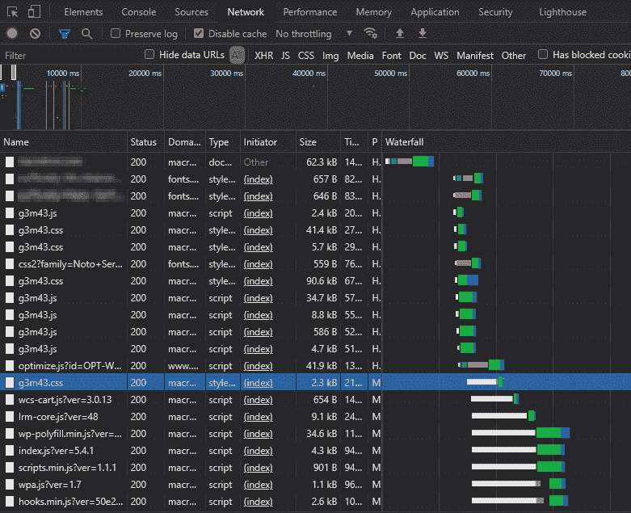
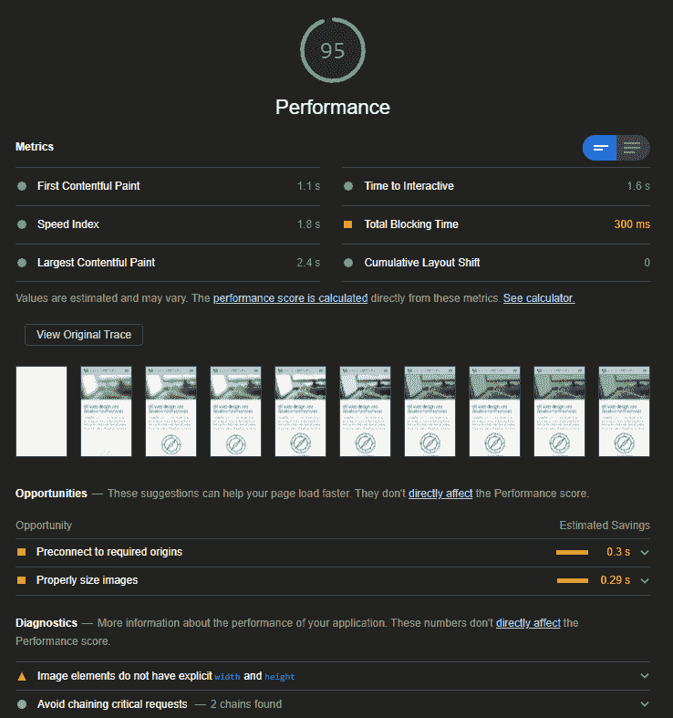
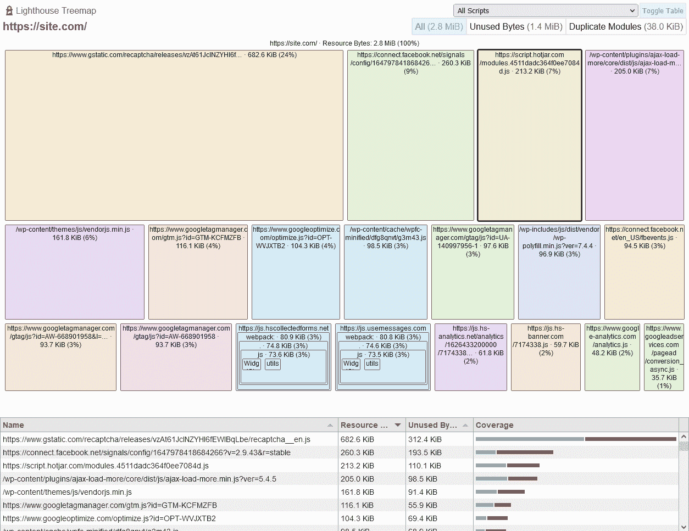
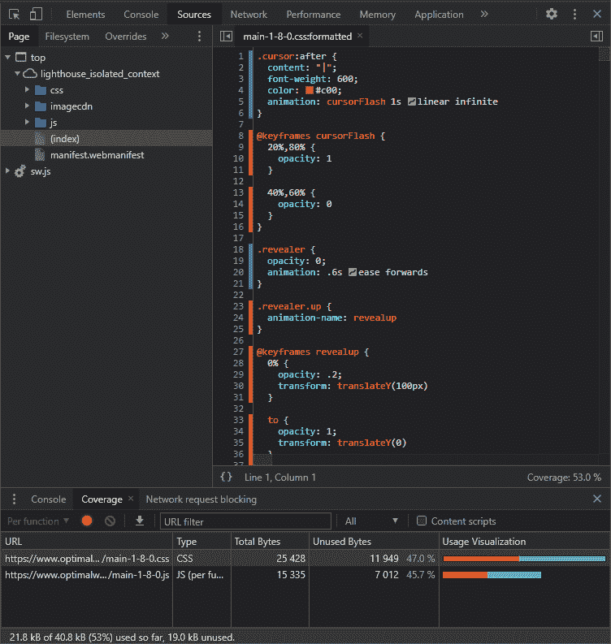
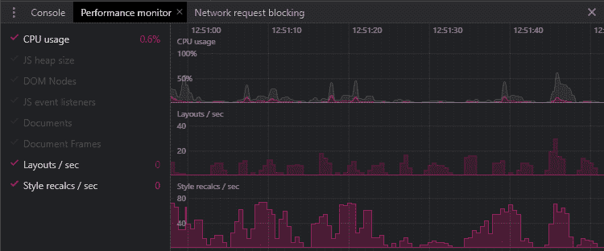
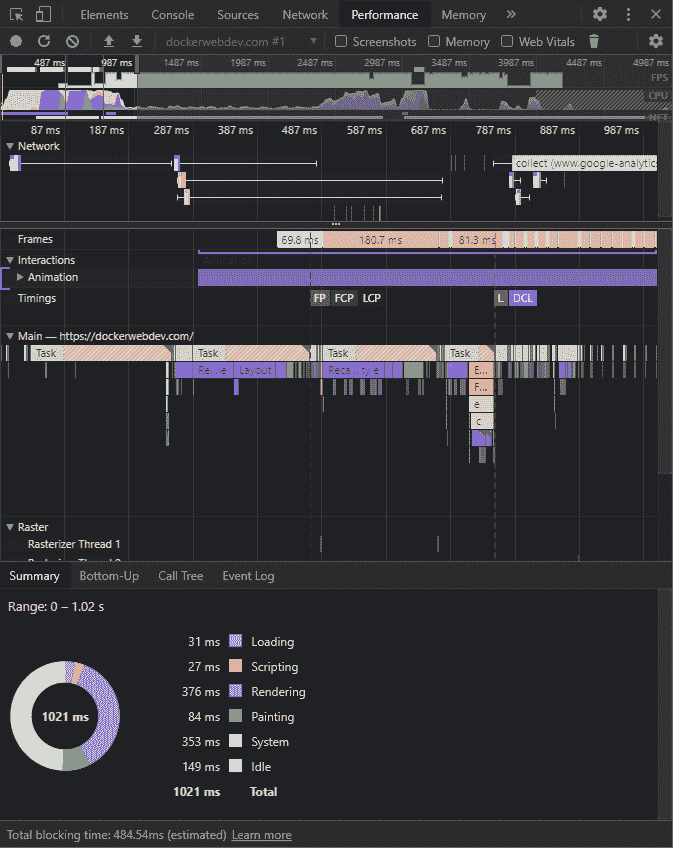

# 如何优化 CSS 以获得最佳网站性能

> 原文:[https://kinsta.com/blog/optimize-css/](https://kinsta.com/blog/optimize-css/)

即使在 2021 年，网络性能仍然是个问题。根据 HTTP Archive 的数据，一个普通的页面需要 [2 MB 的下载量](https://httparchive.org/reports/page-weight?start=latest)，发出超过 60 个 HTTP 请求，在移动设备上完全加载需要 [18 秒](https://httparchive.org/reports/loading-speed?start=latest)。样式表占 60 kB，分布在七个请求中，所以当试图解决性能问题时，它很少是首要任务。

然而，CSS 确实有影响，不管它看起来有多轻微。一旦你解决了你的 [JavaScript](https://kinsta.com/knowledgebase/what-is-javascript/) ，学习适当地优化 CSS 应该是下一个优先事项。

让我们开始吧！

 <kinsta-auto-toc heading="Table of Contents" exclude="last" list-style="arrow" selector="h2" count-number="-1">## CSS 如何影响页面性能

CSS 看起来很简单，但可能需要一些繁重的处理。

### CSS 是渲染阻塞的

当您的浏览器遇到一个`<link>`标签时，它会暂停其他浏览器的下载和处理，同时获取和解析 CSS 文件。

JavaScript 也可以[阻止浏览器呈现](https://kinsta.com/blog/eliminate-render-blocking-javascript-css/)，但是异步处理是可能的:

<link rel="stylesheet" href="https://kinsta.com/wp-content/themes/kinsta/dist/components/ctas/cta-mini.css?ver=2e932b8aba3918bfb818">


> 需要在这里大声喊出来。Kinsta 太神奇了，我用它做我的个人网站。支持是迅速和杰出的，他们的服务器是 WordPress 最快的。
> 
> <footer class="wp-block-kinsta-client-quote__footer">
> 
> 
> 
> <cite class="wp-block-kinsta-client-quote__cite">Phillip Stemann</cite></footer>

[View plans](https://kinsta.com/plans/)

1.  用于并行下载脚本的`async`属性，这些脚本在准备就绪后会立即运行。
2.  并行下载的`defer`属性，然后在 DOM 准备好的时候按顺序运行。
3.  加载 ES 模块的`type="module"`属性(其行为类似于`defer`)。

像图像这样的资产经常需要更多的带宽，但是[高效的格式是可用的](https://kinsta.com/blog/webp/)，并且它们可以[延迟加载](https://kinsta.com/blog/wordpress-lazy-load/) ( `loading="lazy"`属性)而不会阻塞浏览器渲染。

这些在 CSS 中都是不可能的。文件被缓存，所以后续的页面加载*应该*更快，但是呈现阻塞过程仍然存在。

[想提高自己网站的性能吗？🚀从 CSS 开始💥 点击推文](https://twitter.com/intent/tweet?url=https%3A%2F%2Fkinsta.com%2Fblog%2Foptimize-css%2F&via=kinsta&text=Want+to+improve+your+site%27s+performance%3F+%F0%9F%9A%80Start+with+CSS+%F0%9F%92%A5&hashtags=CSS%2CJavaScript)
<kinsta-advanced-cta language="en_US" type-int-post="102244" type-int-position="0"></kinsta-advanced-cta>

### 处理大型 CSS 文件需要时间

样式表越大，下载和处理 CSS 对象模型(CSSOM)所需的时间就越长，浏览器和 JavaScript APIs 可以用它来显示页面。尽管 CSS 样式表比大多数其他网站文件都小，但它们也不能幸免于“越小越好”的经验法则。

### CSS 文件增长

很难识别不再使用的样式，删除错误的样式会对网站造成严重破坏。开发人员通常选择最安全的“保留一切”方法。不再使用的[页面样式](https://kinsta.com/blog/the-package-could-not-be-installed/)、[组件](https://kinsta.com/blog/web-components/)和小部件继续存在于 CSS 中。结果呢？文件大小、复杂性和维护工作量呈指数级增长，使得开发人员越来越不愿意删除多余的代码。

### 样式表可以引用其他资源

CSS 可以使用@import 规则引用其他样式表。这些导入阻塞了当前样式表的处理，并在序列中加载进一步的 CSS 文件**。**

也可以引用其他资源，如字体和图像。浏览器将尝试优化下载，但当有疑问时，它会立即获取它们。内联的 base64 编码文件需要进一步处理。

### CSS 效果呈现

浏览器有三个[渲染阶段](https://kinsta.com/blog/critical-rendering-path/):

1.  **布局**(或**重排**)阶段计算每个元素的尺寸，以及它如何影响周围元素的大小或位置。
2.  **绘制**阶段将每个元素的可视部分绘制到单独的图层上:文本、颜色、图像、边框、阴影等。
3.  **composite** 根据堆叠上下文、定位、z 索引等，以正确的顺序将每个层绘制到页面上。

如果不小心的话，CSS 属性的改变和动画会导致所有三个阶段重新渲染。一些属性，如阴影和渐变，在计算上也比块颜色和边距更昂贵。
<kinsta-advanced-cta language="en_US" type-int-post="102244" type-int-position="1"></kinsta-advanced-cta>

## CSS 性能分析工具

承认你有 CSS 性能问题是恢复的第一步！找到并解决原因是另一回事。

以下工具和服务(不按任何顺序排列)可以帮助您识别代码中的样式瓶颈。

### 1.DevTools 网络面板

网络性能专家在开发工具和 T2 网络小组上花费了大量的时间。DevTools 是[大多数现代浏览器](https://kinsta.com/browser-market-share/)的原生版本，尽管在我们的例子中我们将使用 Google Chrome。

DevTools 可以从浏览器菜单打开，通常是在**更多工具** > **开发者工具**，或者通过键盘快捷键 **Ctrl | Cmd + Shift + I** 或 **F12** 。

切换到**网络**选项卡，确保选中**禁用缓存**，以防止缓存文件影响报告。您还可以更改限制选项来模拟较慢的移动网络。

刷新页面以查看下载和处理瀑布图:

[](https://kinsta.com/wp-content/uploads/2021/08/network-waterfall.png)

DevTools Network panel.


任何长棒线都值得关注，但你应该特别警惕长阻塞/停滞棒线(以白色显示)。在这个例子中，突出显示的行和所有后面的行不能开始下载，直到在 HTML 页面的顶部处理了呈现阻塞的 CSS 和 JavaScript 文件。

**过滤器**框允许您显示或隐藏特定资产:

*   `larger-than:*<S>*`:限制大于 *< S >* 的文件，以字节(10000)、千字节(1,000 kB)或兆字节(1 M)表示
*   `-larger-than:<S>`:限制小于 *< S >* 的文件
*   `-domain:*<.yourdomain.com>`:显示不是从您的主域加载的第三方请求。这些是慢速网站的主要原因。

一个具有优化 CSS 的高性能页面通常具有较少的并行加载的资产和较短的阻塞/停滞条。

### 2.网页测试

[WebPageTest](https://www.webpagetest.org/) 提供了类似的网络瀑布视图，以及许多其他性能图表:

[](https://kinsta.com/wp-content/uploads/2021/08/webpagetest.png)

WebPageTest.org asset waterfall.


该服务使用基于全球不同位置的设备，因此您可以评估现实世界的性能和 CSS 优化。

### 3.Chrome DevTools 灯塔面板

DevTools **Lighthouse** 面板在基于 Chromium 的浏览器中提供，如 Chrome、Edge、Brave、Opera 和 Vivaldi。您可以为移动和桌面设备生成性能、渐进式 Web 应用、最佳实践、可访问性和[搜索引擎优化](https://kinsta.com/blog/wordpress-seo/)报告。

[](https://kinsta.com/wp-content/uploads/2021/08/lighthouse-performance.png)

DevTools Lighthouse panel.


该工具提出改进建议，包括优化 CSS 的方法。并非所有的都是实际可行的，但是最有益的快速成功会被强调出来。
<kinsta-advanced-cta language="en_US" type-int-post="102244" type-int-position="2"></kinsta-advanced-cta>

### 4.谷歌页面速度洞察

[PageSpeed Insights](https://kinsta.com/blog/google-pagespeed-insights/) 是 Lighthouse 的网络版。它的功能较少，但可以在任何浏览器中使用，并提供一些替代的见解。

例如，一个树形图显示了最大的 JavaScript 资产和一个覆盖率度量，它指示了使用和未使用的代码比例:

[](https://kinsta.com/wp-content/uploads/2021/08/pagespeed-treemap.png)

Google PageSpeed Insights treemap.


CSS 不显示，但是 JavaScript 的数量会影响样式的效率。

类似的[网速测试工具](https://kinsta.com/blog/website-speed-test/#website-speed-test-tools)还有 [Pingdom 网速测试](https://tools.pingdom.com/)和 [GTmetrix](https://kinsta.com/blog/gtmetrix-speed-test/) 。

### 5.Chrome DevTools 覆盖面板

基于 Chromium 的浏览器中的 DevTools **Coverage** 面板有助于定位未使用的 CSS(和 JavaScript)代码。从 DevTools **更多工具**子菜单中选择**覆盖率**，然后刷新您的页面并浏览您的站点/应用:

[](https://kinsta.com/wp-content/uploads/2021/08/coverage.png)

DevTools Coverage Panel.


CSS 和 JavaScript 资产显示在**覆盖率**面板中，未使用代码的比例用红色表示。单击任意文件查看其源代码，未使用的代码在行号栏中以红色突出显示。

一些需要注意的事项:

*   如果你刷新或导航到一个新的页面，覆盖率指标就会重置，这在 WordPress 网站上是很典型的。如果您浏览的是加载内容而不刷新页面的单页面应用程序，那么未使用的代码量只会减少。
*   该工具只能说明到特定时间点为止使用的 CSS。它不能确定一个小部件是没有被查看过还是有多个 JavaScript 绑定的状态。

### 6.Chrome DevTools 实时性能监视器

基于 Chromium 的浏览器有一个实时性能监视器。同样，这可以从 DevTools **More tools** 菜单中获得。当您浏览页面、滚动和触发动画时，图表会更新:

[](https://kinsta.com/wp-content/uploads/2021/08/performance-monitor.png)

DevTools Real-Time Performance Monitor.


以下指标对于优化 CSS 性能特别重要(越低越好):

*   **CPU 使用率:**处理器使用率从 0%到 100%。
*   **布局/秒:**浏览器重新布局页面的速度。
*   **样式重新计算/秒:**浏览器必须重新计算样式的速率。

如果 CSS 由于外部因素而陷入困境，其他指标也可能有用(同样，值越低表示性能越好):

*   **JS 堆大小:**JavaScript 对象使用的总内存。
*   **DOM 节点:**[HTML](https://kinsta.com/blog/html-best-practices/)文档中元素的数量。
*   **JS 事件监听器:**注册的 JavaScript 事件监听器的数量。
*   **文档:**资源的数量，包括页面、CSS 文件、JavaScript 模块等。
*   **文档框架:**框架、iframes 和 JavaScript 工作脚本的数量。

### 7.DevTools 性能报告

DevTools **Performance** 面板允许您记录页面活动以供进一步分析，并帮助识别性能问题。生成的报告很复杂，许多开发人员避免使用它们，但是它们提供了有价值的信息。

性能面板的设置图标允许您设置各种选项，例如降低网络和 CPU 速度。您还可以禁用 JavaScript 示例，以便不记录详细的调用堆栈。

首先，单击圆形的**记录**图标，加载和/或使用您的页面，然后单击**停止**按钮查看报告:

[](https://kinsta.com/wp-content/uploads/2021/08/performance-report.png)

DevTools Performance Report.


几乎所有这些指标对 JavaScript 开发人员都有用，但是 CSS 优化问题可能在以下方面尤为明显:

*   **顶部红色条:**这表示帧速率显著下降，这可能会导致性能问题。这在页面加载开始时是正常的，但是过多的 CSS 动画也可能是一个问题。
*   **摘要图表:**高加载、渲染和绘制指标可能表明 CSS 问题。

## 间接 CSS 性能修复

以下修复不会直接解决 CSS 问题，但是它们可以帮助您以相对较少的努力解决一些性能问题。

### 使用一个好的主机

使用一个好的主机，让服务器在物理上离用户更近，会带来立竿见影的性能优势。托管计划各不相同，但主要有三种类型:

1.  共享托管:你的网站托管在一个物理服务器上，可能还有数百个其他网站。磁盘空间、RAM、CPU 时间和带宽是共享的。计划通常很便宜，但是性能和可用性会受到其他站点的影响。升级是可能的，但是你的站点通常会保持在相同的基础设施上。
2.  **专用托管:**您的网站托管在您拥有的一台或多台物理服务器上。硬件可以根据需要进行配置和升级。计划往往是昂贵的，硬件故障仍然是个问题。
3.  **云托管:** [云托管](https://kinsta.com/google-cloud-hosting/)将硬件基础设施抽象成一组可以按需访问的服务。您的站点可以跨一系列设备进行配置，从而简化升级。

云托管计划和价格相差很大。你可以考虑:

1.  [平台即服务(PaaS)](https://kinsta.com/blog/what-is-paas/) 选项，如虚拟网络服务器和数据库，或
2.  [软件即服务(SaaS)](https://kinsta.com/blog/saas-products/) 选项，提供[完全托管的应用，如 WordPress](https://kinsta.com/) 。

交换主机可以提高性能。它不太可能解决你的所有问题，但它是解决后端和带宽问题的一个经济高效的解决方案。

您还可以考虑使用[内容交付网络(CDN)](https://kinsta.com/blog/wordpress-cdn/) 或专业的图像和视频 CDN，将负载分布在地理上更靠近用户的多个位置。

### 利用浏览器和服务器效率特性

大约 10%的网站不激活 gzip(或更好的)压缩，这通常是默认的服务器选项。通过在传输前压缩文件，CSS 的大小减少了 60%或更多。它不会修复低效的 CSS，但代码会更快到达！

您还应该[激活 HTTP/2](https://kinsta.com/learn/what-is-http2/) (或者更好)，它以更小的二进制格式发送数据，压缩报头，并且可以在同一个 TCP 连接上发送多个文件。

最后，确保浏览器可以有效地缓存 CSS 和其他文件。这通常是在 HTTP 头中设置[过期](https://www.w3.org/Protocols/rfc2616/rfc2616-sec14.html#sec14.21)、[最后修改](https://www.w3.org/Protocols/rfc2616/rfc2616-sec14.html#sec14.29)和/或 [ETag 散列](https://en.wikipedia.org/wiki/HTTP_ETag)的问题。

### 优化您的 CMS

像 WordPress 这样的内容管理系统可以用主题和插件来扩展，为他们自己的 CSS 服务。在可能的情况下，你应该[加速你的 CMS](https://kinsta.com/ebooks/wordpress/speed-up-wordpress/) 以:

1.  移除未使用的插件。
2.  使用更简洁的主题
3.  启用[缓存](https://kinsta.com/blog/what-is-cache/)以防止过多的页面重新生成。

### 优化您的图像

图像不像 HTML、CSS 和 JavaScript 那样具有相同的处理和渲染开销，但是它们占据了页面权重和可用带宽的很大一部分。考虑:

1.  删除不必要的图像。
2.  调整大图像的大小——可能不超过它们在屏幕上显示的最大尺寸的 150%。
3.  使用[合适的图像格式](https://kinsta.com/blog/image-file-types/)——理想情况下是高度压缩的选项，如 [WebP](https://kinsta.com/blog/webp/) 或 AVIF，但对于徽标和图表可能是 [SVG](https://kinsta.com/blog/what-is-an-svg-file/) 。
4.  用 CSS 渐变或其他效果替换图像。
5.  向 HTML ``标签添加宽度和高度属性，或者使用新的 [CSS 纵横比属性](https://developer.mozilla.org/docs/Web/CSS/aspect-ratio)，以确保在图像下载之前在页面上保留适当的空间。

一个专业的图像 CDN 可以为你处理这些工作。想了解更多技巧，请查看我们的指南，了解如何为网络优化图像。

### 移除未使用的 CSS

最快的样式是那些你永远不需要加载或渲染的样式！尝试[删除/编辑任何你不再需要的 CSS 代码](https://kinsta.com/blog/wordpress-css/)，比如遗留页面、小部件或框架的代码。这在较大的网站上很难做到，而且并不总是清楚一套特定的风格是否是必要的。

以下工具在构建时分析 HTML 和 CSS 的使用情况，或者通过抓取 URL 来识别冗余代码。这并不总是足够的，因此可以设置额外的配置来确保允许列出 JavaScript 和用户交互触发的样式:

*   [UnCSS](https://github.com/uncss/uncss)
*   [未使用的 CSS](https://unused-css.com/)
*   清洗 CSS
*   [净化 CSS](https://github.com/purifycss/purifycss)

有一个更好的选择:将 CSS 分割成单独的文件，具有清晰的责任和相应的文档级别。移除不必要的样式变得相当容易。

## 优化 CSS 加载性能

并非所有的 CSS 都是同等加载的。不起眼的`<link>`标签有许多并不总是合乎逻辑的选项和怪癖。

### 优化 Web 字体的使用

[谷歌字体](https://kinsta.com/blog/best-google-fonts/)和类似的字体代工厂已经彻底改变了[网络字体](https://kinsta.com/blog/html-fonts/)，但是几行字体代码会占用数十万字节的带宽。

以下是我们的优化建议:

 ## 注册订阅时事通讯


### 想知道我们是怎么让流量增长超过 1000%的吗？

加入 20，000 多名获得我们每周时事通讯和内部消息的人的行列吧！

[Subscribe Now](#newsletter)

1.  **仅加载您需要的字体:**删除您不使用的字体，并检查是否需要新字体。
2.  **只加载你需要的粗细和样式:**大部分字体代工厂都可以限制下载某些字符集(比如只下载拉丁文)，粗细(粗细)，斜体(倾斜)。浏览器可以自动呈现缺失的样式，尽管结果可能很差。
3.  **限制所需字符:不常用的**字体可以限制为特定字符。例如，Open Sans 中的标题“CSS tutorial”可以通过向 Google fonts 查询字符串添加一个`&text=`参数来定义:`fonts.googleapis.com/css?family=Open+Sans&text=CStuorial`
4.  **考虑可变字体:**可变字体使用矢量插值定义了大量不同的样式、粗细和斜体。字体文件有点大，但是你只需要一个而不是几个。[递归字体](https://www.recursive.design/)展示了可变字体的灵活性。
5.  **从本地服务器加载字体:** [自托管字体](https://kinsta.com/blog/local-fonts/)比使用代工更高效。需要更少的 DNS 查找，你可以限制下载到 [WOFF2，所有现代浏览器都支持](https://caniuse.com/woff2)。老的浏览器(我看的是你 IE)可以回退到 OS 字体。
6.  考虑操作系统字体:500 kB 的网络字体可能看起来很棒，但如果你换成常用的 Helvetica 字体、Arial 字体、佐治亚字体或 Verdana 字体，会有人注意到吗？操作系统或[网页安全字体](https://kinsta.com/blog/web-safe-fonts/)是提升性能的简单方法。

### 使用合适的字体加载选项

下载和处理 Web 字体可能需要几秒钟时间。浏览器将会:

1.  **显示无样式文本的闪烁(FOUT):** 最初使用第一个可用的备用字体，但一旦 web 字体准备就绪，就会被替换。
2.  **显示不可见文本的闪烁(FOIT):** 在 web 字体准备好之前，不显示任何文本。这是现代浏览器的默认过程，通常会等待三秒钟再恢复到备用字体。

两者都不理想。CSS [font-display](https://developer.mozilla.org/docs/Web/CSS/@font-face/font-display) 属性和 Google Font & display =参数可以选择另一个选项:

*   **auto:** 浏览器的默认行为(通常是 FOIT)。
*   **封锁:**有效封锁。文字最多三秒钟不可见。没有字体交换，但文本可能需要一段时间才能出现。
*   **互换:**有效 FOUT。使用第一个回退，直到 web 字体可用。文本立即可读，但字体交换效果可能会不和谐。[字体样式匹配器](https://meowni.ca/font-style-matcher/)可用于定义类似大小的回退。
*   **退路:**福伊特和 FOUT 之间的妥协。文本在短时间内(通常为 100 毫秒)不可见，然后使用第一个回退，直到 web 字体可用。
*   **可选:**类似于回退，除了不发生字体交换。只有在初始阶段可用时，才会使用 web 字体。您的首页视图可能会显示备用字体，后续视图使用下载和缓存的 web 字体。

使用 swap、fallback 或 optional 可以提供明显的性能提升。

### 避免 CSS @import

[@import at-rule](https://developer.mozilla.org/docs/Web/CSS/@import) 允许 CSS 文件包含在其他文件中:

```
/* main.css */
@import url("reset.css");
@import url("grid.css");
@import url("widget.css");
```

这似乎是加载较小组件和字体的有效方法。不幸的是，每个@import 都是渲染阻塞的，每个文件都必须串行加载和解析。

HTML 中的多个`<link>`标签更有效，可以并行加载 CSS 文件:

```
<link rel="stylesheet" href="reset.css">
<link rel="stylesheet" href="grid.css">
<link rel="stylesheet" href="widget.css">
```

也就是说，最好…

### 连接和缩小 CSS

现代的构建工具、CSS 预处理器如 Sass 和 [WordPress 插件可以将所有部分合并成一个大的 CSS 文件](https://kinsta.com/knowledgebase/combine-external-css/)。然后删除不必要的空白、注释和字符，以将文件大小减至最小。

对于 HTTP/2 [和更高的](https://kinsta.com/blog/http3/)来说，多个文件不是什么性能问题，但是单个文件只需要一个头文件，可以更有效地进行 gzip 和缓存。

只有当您有一个或多个频繁更改的样式表时，单独的 CSS 文件才是实用的——可能每周都要更改几次。即使这样，大多数静态 CSS 代码仍然可以合并到一个文件中。

[Kinsta 客户](https://kinsta.com/plans/?plan=visits-business1&interval=month)可以在他们的 [MyKinsta 仪表板](https://kinsta.com/mykinsta/)中访问[代码缩小功能](https://kinsta.com/help/kinsta-cdn-code-minification)来帮助解决这个问题。该功能允许客户通过简单的点击实现 CSS 和 JavaScript 的自动缩小。这有助于提高网站的速度，而无需人工操作。

### 避免 Base64 编码

[工具可以将图像编码为 base64 字符串](https://jpillora.com/base64-encoder/)，您可以将其用作 HTML ``标签和 CSS 背景中的数据 URIs:

```
.background {
  background-image: url('data:image/jpg;base64,ABC123...');
}
```

这减少了 HTTP 请求的数量，但是损害了 CSS 的性能:

*   base64 字符串可以比等效的二进制字符串大 30%。
*   浏览器必须解码字符串才能使用图像，并且
*   改变一个图像像素会使整个 CSS 文件失效。

如果您使用非常小、不经常变化的图像，并且生成的字符串不比 URL 长很多，那么只考虑 base64 编码。

也就是说，您可以对可重用的 SVG 图标进行 UTF8 编码，例如

```
.svgbackground {
  background-image: url('data:image/svg+xml;utf8,<svg  viewBox="0 0 600 600"><circle cx="300" cy="300" r="150" stroke-width="3" stroke="#f00" fill="#ff0" /></svg>');
}
```

### 移除 CSS 黑客和 IE 回退

除非你很不幸，并且有很高比例的 Internet Explorer 用户，否则条件样式表和 hacks 可以从你的 CSS 中删除。在大多数情况下，IE 用户仍然会看到*一些*的东西，特别是如果你使用移动优先的设计，默认显示一个更简单的线性视图。结果可能并不漂亮，也不会像像素一样完美，但是考虑到所有用户的可访问性，你的开发预算还是花在这上面比较好。

### 预加载 CSS 文件

`<link>`标签提供了一个可选的[预加载属性](https://developer.mozilla.org/docs/Web/HTML/Preloading_content)，它可以立即开始下载，而不是等待 HTML 中的实际引用:

```
<!DOCTYPE html>
<html lang="en">
<head>
  <meta charset="UTF-8">
  <title>My page</title>
  <!-- preload styles -->
  <link rel="preload" href="/css/main.css" as="style" />
  <!-- lots more code -->
  <!-- load preloaded styles -->
  <link rel="stylesheet" href="/css/main.css" />
```

这在 WordPress 和其他 CMS 中尤其有益，插件可以在页面的更下方添加样式表。

### 使用关键的内联 CSS

分析工具可能会建议你“内联关键 CSS”或“减少渲染阻塞样式表”这通过以下方式提高了性能:

需要为您的电子商务网站提供超快的、可靠的、完全安全的托管服务吗？Kinsta 提供所有这些服务，并由 WooCommerce 专家提供 24/7 的世界级支持。[查看我们的计划](https://kinsta.com/plans/?in-article-cta)

1.  标识折叠上方元素使用的基本样式(页面加载时可见的样式)
2.  将关键的 CSS 内联到您的`<head>`中的`<style>`标签中
3.  异步加载剩余的 CSS 以避免呈现阻塞。这可以通过以浏览器给予较低优先级的“打印”样式加载样式表来实现。一旦页面加载完毕，JavaScript 就会将其切换到“所有”媒体样式(如果 JavaScript 不可用，则使用`<noscript>`来确保 CSS 正常工作):

```
<style>
/* critical styles */
body { font-family: sans-serif; color: #111; }
</style>
<!-- load remaining styles -->
<link rel="stylesheet" 
     href="/css/main.css"
    media="print" 
   onload="this.media='all'">
<noscript>
  <link rel="stylesheet" href="/css/main.css">
</noscript>
```

像[关键](https://github.com/addyosmani/critical)和[关键](https://github.com/filamentgroup/criticalCSS)这样的工具可以帮助提取视图中元素的样式。

该技术显著提高了性能并增加了审计分数。具有一致界面的网站或应用程序应该更容易实现，但在其他地方可能会更困难:

*   除了最简单的站点之外，构建工具对所有站点都是必不可少的。
*   每个设备上的“文件夹”都不同。
*   网站可能有不同的布局，需要不同的关键 CSS。
*   关键的 CSS 工具可能会与特定的框架、HTML 生成的客户端和动态内容发生冲突。
*   这种技术主要有利于第一页的加载。CSS 是为后续页面缓存的，所以额外的内联样式会增加页面权重。

### 使用媒体查询呈现

单个连接和缩小将使大多数网站受益，但需要大量较大屏幕样式的网站可以使用媒体查询来拆分 CSS 文件和加载:

```
<!-- core styles loaded on all devices -->
<link rel="stylesheet" href="core.css">
<!-- served to screens at least 40em wide -->
<link rel="stylesheet" media="(min-width: 40em)" href="40em.css">
<!-- served to screens at least 80em wide -->
<link rel="stylesheet" media="(min-width: 80em)" href="80em.css">
```

这个例子假设了移动优先的方法。移动设备加载 **core.css** ，但可能不需要下载或解析剩余的样式表。

### 使用渐进式渲染

渐进式呈现是一种为单独的页面或组件定义单独的样式表的技术。它可以使非常大的站点受益，这些站点的单个页面是由各种各样的组件构成的。

在 HTML 中引用组件之前，会立即加载每个 CSS 文件:

```
<head>
  <!-- core styles -->
  <link rel="stylesheet" href="core.css" />
</head>
<body>
  <!-- header -->
  <link rel="stylesheet" href="header.css" />
  <header>...</header>
  <!-- primary content -->
  <link rel="stylesheet" href="main.css" />
  <main>
    <!-- widget styling -->
    <link rel="stylesheet" href="widget.css" />
    <div class="mywidget>...</div>
  </main>
  <!-- footer -->
  <link rel="stylesheet" href="footer.css" />
  <footer>...</footer>
</body>
```

这在大多数浏览器中运行良好。(Safari 会显示一个空白页，直到所有的 CSS 都加载完毕，但它应该不会比一个大样式表差太多。)

采用 Web 组件还鼓励使用自定义元素呈现时加载的作用域样式。

## 优化 CSS 性能

CSS 技术和属性对浏览器、CPU、内存、带宽和其他资源造成了不同的压力。以下提示可以帮助您避免不必要的处理和缓慢的性能。

### 采用现代布局技术(网格和 Flexbox)

基于浮动的布局很难创建，使用大量属性，需要不断调整边距和填充，必须使用媒体查询来管理，并且会导致大量的浏览器处理。多年来，它们是唯一可行的布局方法，但现在已经没有必要了。使用以下任一方式:

*   [CSS Flexbox](https://kinsta.com/blog/responsive-web-design/#flexbox-layout) 用于一维布局，可以换行到下一行。它是菜单、图片库、卡片等的理想选择。
*   [CSS 网格](https://kinsta.com/blog/responsive-web-design/#size-layout-elements-with-percentages-or-create-a-css-grid-layout)用于具有显式行和列的二维布局。它非常适合页面布局。

两者都更易于开发，使用的代码更少，渲染速度更快，并且无需媒体查询即可适应任何屏幕尺寸。

非常老的浏览器不会识别现代的 flexbox 和 grid 属性，所以每个元素都变成了一个块。用一个简单的类似移动设备的线性布局显示它们:*没有必要用基于浮动的后退来模拟设计*。

### 用 CSS 渐变和效果替换图像

可能的话，选择 CSS 代码而不是图片。尝试使用渐变、边框、半径、阴影、滤镜、混合模式、蒙版、剪辑和伪元素效果来重用或替换现有图像。

CSS 效果使用相当少的带宽，更容易修改，并且通常可以制作动画。

### 避免过度使用昂贵的物业

你可能有简洁的声明性代码，但是有些 CSS 比其他的需要更多的处理。下列属性会触发绘制计算，如果过度使用，代价会很高:

*   `position: fixed`
*   `border-radius`
*   `box-shadow`
*   `text-shadow`
*   `opacity`
*   `transform`
*   `filter`
*   `backdrop-filter`
*   `background-blend-mode`

### 尽可能使用 CSS 过渡和动画

CSS 过渡和动画总是比 JavaScript 驱动的效果更平滑，JavaScript 驱动的效果修改类似的属性。它们不会在非常旧的浏览器上处理，但是，由于这些浏览器可能在功能较弱的设备上运行，这是最好的。

但是，避免过度动画。效果应该增强用户体验，而不会对性能产生负面影响或导致晕动病。检查[首选减速](https://developer.mozilla.org/docs/Web/CSS/@media/prefers-reduced-motion)媒体查询，并在必要时禁用动画。

### 避免动画属性触发重新布局

更改元素的尺寸(宽度、高度、填充、边框)或位置(上、下、左、右、边距)会导致整个页面在每个动画帧上重新布局。最有效的动画属性是:

*   **T2`opacity`**
*   **`filter`** :模糊、对比度、阴影和其他效果
*   **`transform`** :平移(移动)、缩放或旋转元素

浏览器可以使用硬件加速的 GPU 在自己的层中渲染这些效果，因此只有合成阶段受到影响。

如果您必须动画显示其他属性，可以通过使用 position: absolute 将元素从页面流中取出来提高性能。

### 注意复杂的选择器

浏览器可以快速解析最复杂的 CSS 选择器，但是简化它们可以减小文件大小并提高性能。当您在 CSS 预处理程序(如 Sass)中创建深度嵌套的结构时，通常会生成复杂的选择器。

### 指出哪些元素将会改变

[CSS 的 will-change 属性](https://developer.mozilla.org/docs/Web/CSS/will-change)允许你警告一个元素将如何被改变或动画化，这样浏览器可以提前进行优化:

```
.myelement {
  will-change: transform, opacity;
}
```

可以定义任意数量的逗号分隔值，但该属性只应作为修复已知性能问题的最后手段。您不应该将它应用于太多的元素，并确保给它足够的时间来初始化。

### 考虑 CSS 包容

Containment 是一个新的 CSS 特性，它允许你识别页面中孤立的子树，从而提高性能。浏览器可以通过呈现——或者*而不是*呈现——特定的 DOM 内容块来优化处理。

[包含属性](https://developer.mozilla.org/docs/Web/CSS/contain)接受空格分隔列表中的一个或多个以下值:

*   **`none`** :未应用遏制
*   **`layout`** :元素的布局独立于页面的其余部分，其内容不会影响其他元素
*   **`paint`** :元素的子元素不显示在其边界之外
*   **`size`** :无需检查子元素即可确定元素的大小——尺寸与内容无关

还有两个特殊值可用:

*   **`strict`** :应用所有包含规则(无除外)
*   **`content`** :应用布局和绘画


### 重要


一个页面有一个应用了`contain: strict;`的`<ul>`列表。如果您更改任何子`<li>`的内容，浏览器将不会重新计算该项目的大小或位置、列表中的其他项目或页面上的任何其他元素。 CSS 包容在大多数现代浏览器中得到支持。Safari 或更老的应用程序中没有支持，但在这些应用程序中可以安全地使用 containment，因为浏览器会简单地忽略该属性。

### 对保存数据头做出反应

[Save-Data](https://developer.mozilla.org/docs/Web/HTTP/Headers/Save-Data) 是一个 HTTP 请求头，表示用户已经请求了缩减的数据。在某些浏览器中，它可能被标记为“精简”或“加速”模式。

启用后，每个浏览器请求都会发送一个`Save-Data`头:

```
GET /main.css HTTP/1.0
Host: site.com
Save-Data: on
```

当检测到保存数据时，服务器可以做出相应的响应。就 CSS 而言，它可以发送更简单的类似手机的线性布局，使用操作系统字体，切换到块颜色，或者加载低分辨率的图像背景。

请注意，服务器应该在修改请求时返回以下标头，以确保当用户关闭 Lite/Turbo 模式时，不会缓存和重用最少的内容:

```
Vary: Accept-Encoding, Save-Data
```

客户端 JavaScript 也可以检测到该标头。当 Save-Data 为*而非*启用时，以下代码向`<html>`元素添加一个 bestUX 类:

```
if ('connection' in navigator && !navigator.connection.saveData) {
  document.documentElement.classList.add('bestUX');
}
```

样式表可以相应地做出反应，而无需任何服务器操作:

```
/* no hero image by default */
header {
  background-color: #abc;
  background-image: none;
}
/* hero image when no Save-Data */
.bestUX header {
  background-image: url("hero.jpg");
}
```

[prefers-reduced-data 媒体查询](https://developer.mozilla.org/docs/Web/CSS/@media/prefers-reduced-data)提供了一个仅支持 CSS 的选项作为替代，尽管在撰写本文时，任何浏览器都不支持:

```
/* no hero image by default */
header {
  background-color: #abc;
  background-image: none;
}
/* hero image when no Save-Data */
@media (prefers-reduced-data: no-preference) {
  header {
    background-image: url("hero.jpg");
  }
}
```

[已经通过 JavaScript 解决了性能问题？💪是时候看看你的网站的 CSS 了🚀](https://twitter.com/intent/tweet?url=https%3A%2F%2Fkinsta.com%2Fblog%2Foptimize-css%2F&via=kinsta&text=Already+tackled+performance+issues+via+JavaScript%3F+%F0%9F%92%AA+It%27s+time+to+take+a+look+at+your+site%27s+CSS+%F0%9F%9A%80&hashtags=JavaScript%2CCSS)

## 摘要

有许多优化 CSS 性能的选项，但是对于新项目，请考虑以下实践:

1.  **使用一种** [移动优先的方法](https://kinsta.com/blog/google-mobile-first-index/):首先编码最简单的移动布局，然后随着屏幕空间和浏览器功能集的增加添加增强功能。
2.  **将 CSS 拆分成具有可识别责任的独立文件:**CSS 预处理器或 [CMS 插件可以将 CSS 片段合并成一个文件](https://kinsta.com/knowledgebase/combine-external-css/)。
3.  **添加一个构建步骤:**工具可以自动 lint 编码、识别问题、连接、缩小、减少图像大小等等。自动化让生活变得更简单，你也不太可能忘记优化步骤。
4.  文档化你的样式表:一个包含文档化例子的风格指南将使你的代码更容易理解和维护。您将能够毫不费力地识别并删除旧的 CSS。

最后，[学 CSS](https://kinsta.com/blog/best-programming-language-to-learn/#html-and-css) ！您知道的越多，您需要编写的代码就越少，您的 web 应用程序就会变得越快。不管你使用哪种平台和框架，它都会让你成为一个更好的开发者。

*你还有什么优化 CSS 性能的技巧？请在评论区分享！*

* * *

让你所有的[应用程序](https://kinsta.com/application-hosting/)、[数据库](https://kinsta.com/database-hosting/)和 [WordPress 网站](https://kinsta.com/wordpress-hosting/)在线并在一个屋檐下。我们功能丰富的高性能云平台包括:

*   在 MyKinsta 仪表盘中轻松设置和管理
*   24/7 专家支持
*   最好的谷歌云平台硬件和网络，由 Kubernetes 提供最大的可扩展性
*   面向速度和安全性的企业级 Cloudflare 集成
*   全球受众覆盖全球多达 35 个数据中心和 275 多个 pop

在第一个月使用托管的[应用程序或托管](https://kinsta.com/application-hosting/)的[数据库，您可以享受 20 美元的优惠，亲自测试一下。探索我们的](https://kinsta.com/database-hosting/)[计划](https://kinsta.com/plans/)或[与销售人员交谈](https://kinsta.com/contact-us/)以找到最适合您的方式。</kinsta-auto-toc>