# 创建和定制 WordPress 菜单的深度指南

> 原文:[https://kinsta.com/blog/wordpress-custom-menu/](https://kinsta.com/blog/wordpress-custom-menu/)

一个 WordPress 网站如果没有菜单和子菜单就没有意义了。从 WordPress 内部定制你喜欢的菜单也很简单。因此，你的 WordPress 菜单是一个“前线”工具，可以获得较高的搜索排名，让访问者留在网站上。

WordPress 的专用屏幕掩盖了你的菜单有多复杂。你也可以在你的网站上的几个位置显示菜单。如果你有编码技能，你可以用几乎无限的可能性定制你的 WordPress 菜单。

在这篇文章中，我们将会给你一个创建 WordPress 菜单的深入指导。我们还将向您展示如何利用该功能，并以几种不同的方式增强它。

 ### 查看我们的视频指南来创建和定制一个 WordPress 菜单


## WordPress 菜单的剖析

对于外行来说，WordPress 菜单通常是链接的集合([包括下拉菜单](https://kinsta.com/knowledgebase/wordpress-dropdown-menu/))。这是一个简单明了的功能，只是你网站主干中的一块“脊椎骨”。


An example of a WordPress menu.


我们将在下一节更详细地介绍你在网站上看到菜单的地方。现在，要知道它们可以放在你想放的任何地方。您可能只有几个预先选择的选项(基于小部件区域)。不过，从技术角度来说，菜单可以放在任何地方。


当然，WordPress 菜单对于浏览网站是至关重要的。如果你有一个清晰明确的导航菜单，这将有助于用户浏览你的网站，并降低你的跳出率。

它们还有另一个用途:你的菜单帮助你的搜索引擎优化(SEO)。为 SEO 优化一个 WordPress 菜单更多的是关于删除什么，而不是放入什么。首先，你可以去掉一些元素——比如标签云——并保持链接数量少。

虽然谷歌允许你在一个页面上添加多达 250 个链接，但保持你的“[链接值](https://kinsta.com/blog/how-to-drive-traffic-to-your-website/#46-boost-authority-with-internal-links)高是至关重要的。因此，从长远来看，减少外部链接的数量对你有好处。

[A WordPress website wouldn’t be much without its menus and submenus ✨ Learn how to create your own here 👇Click to Tweet](https://twitter.com/intent/tweet?url=https%3A%2F%2Fkinsta.com%2Fblog%2Fwordpress-custom-menu%2F&via=kinsta&text=A+WordPress+website+wouldn%E2%80%99t+be+much+without+its+menus+and+submenus+%E2%9C%A8+Learn+how+to+create+your+own+here+%F0%9F%91%87&hashtags=WordPressTips%2CWebDesign)

## 不同类型的 WordPress 菜单结构

正如你可能已经理解的，根据你的应用程序的需要，你可以选择不同的 WordPress 菜单结构。

例如，标题菜单是最常见的，因为它们处理[主站点导航](https://kinsta.com/blog/website-navigation/)。你也会经常在主导航上方看到较小的菜单，因为这是社交媒体图标、搜索栏等的绝佳位置。

[Kinsta partner SAU/CAL](https://kinsta.com/agency-directory/saucal/) 的网站有一个“飞入”菜单，其中包括导航和社交链接:


A fly-in display showing two menus.


这个菜单显示了 WordPress 菜单有比浏览网站更多的使用案例。使用 WordPress 的内置功能(稍后会有更多介绍)，你可以为几乎任何你需要的东西创建一个菜单。

和页眉导航一样受欢迎的是页脚。您将经常使用这个区域为向下滚动的用户重复您的主要导航。此外，它还是为您的产品和服务提供更多基于上下文的链接的绝佳场所:


The Kinsta footer menu.


如果站点使用，您还会在边栏中看到菜单:

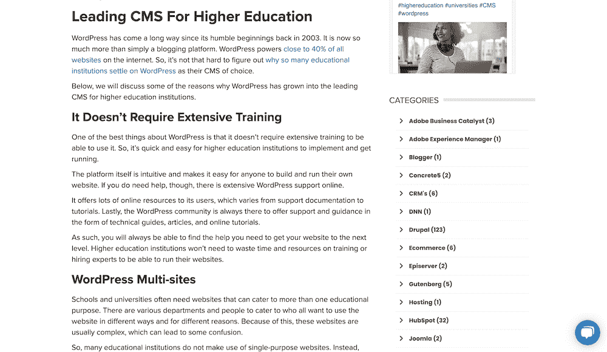

An example of sidebar navigation.


虽然在很多情况下你不会在这里看到主导航，但它是一个传统的社交链接、博客文章存档等等的地方。

## 如何创建自定义的 WordPress 菜单(3 种方法)

不管你的专业水平如何，创建一个 WordPress 菜单是一个严肃的过程。完成这项工作有三种主要方式:使用 WordPress 的内置功能；安装一个合适的插件或者用代码弄脏你的手。

接下来，我们将向你展示如何使用这三种方法创建一个 WordPress 菜单。

### 1.使用 WordPress 的内置功能来创建你的菜单

WordPress 有内置的工具来帮助你创建菜单。WordPress admin 中的一个专用屏幕除了最新用户外，其他人都很熟悉。

[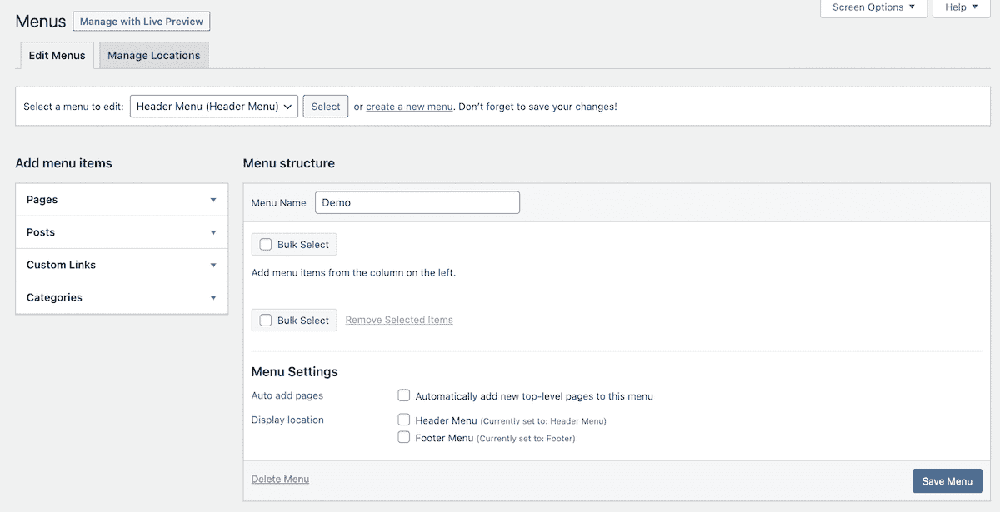](https://kinsta.com/wp-content/uploads/2021/09/The-WordPress-Menu-Screen.png)

The WordPress menu screen.


当然，使用本地功能来创建你的 WordPress 菜单有很多好处。首先，你和你的网站完全兼容。此外，您可以使用熟悉的界面和本地工具来构建您的菜单。

要到达那里，请前往 WordPress 中的**外观>菜单**页面:


The WordPress Menus link.


这个屏幕分成几个不同的部分。在顶部，您可以找到选择当前菜单或创建新菜单的选项:


The menu selection dropdown.


如果您决定建立一个新菜单，给它一个名称，并查看**菜单设置**部分:

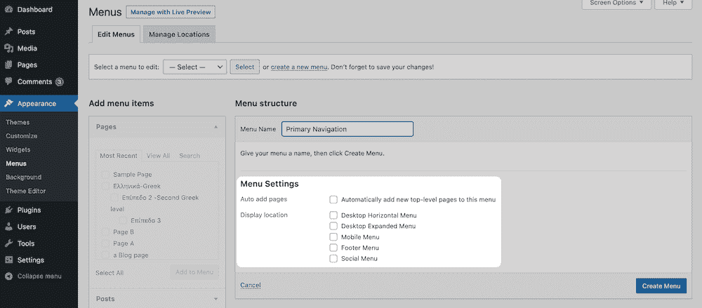

The “Menu Settings” section.


这里有许多复选框，但您需要做出两个主要决定:

*   自动将顶层页面添加到菜单中。这里的“顶层”指的是你在 WordPress 中创建的不是其他页面的子页面的页面。例如，一篇博客文章不是顶级页面，因为在许多情况下它会有一个父归档页面(例如**/博客**)。另一方面，联系页面通常是顶级的，因为它通常没有父页面。
*   **菜单位置。**每个主题都有自己的菜单位置。除非你改变你的主题的核心文件，否则主题开发者已经硬编码了这些菜单位置。有些主题可能允许您通过它们的设置来自定义它们。

准备好之后，点击**创建菜单**按钮。屏幕将刷新，并显示您在新菜单中。接下来，看看屏幕的左侧:


The menu items accordion menu.


这个屏幕列出了你的站点上所有的文章、页面、分类和其他可链接的资源。通过选中左边的复选框，然后点击**添加到菜单**按钮，您就可以创建您的菜单。

这会将它们移动到**菜单**屏幕的中间部分:

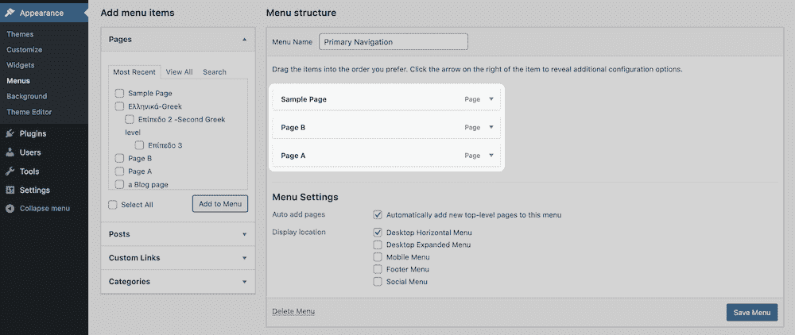

Dragging and dropping items in the Menu structure section.


在这里，您可以将菜单项拖放到适当的位置。如果单击每个项目旁边的展开箭头，还可以为菜单项设置标签或删除标签:

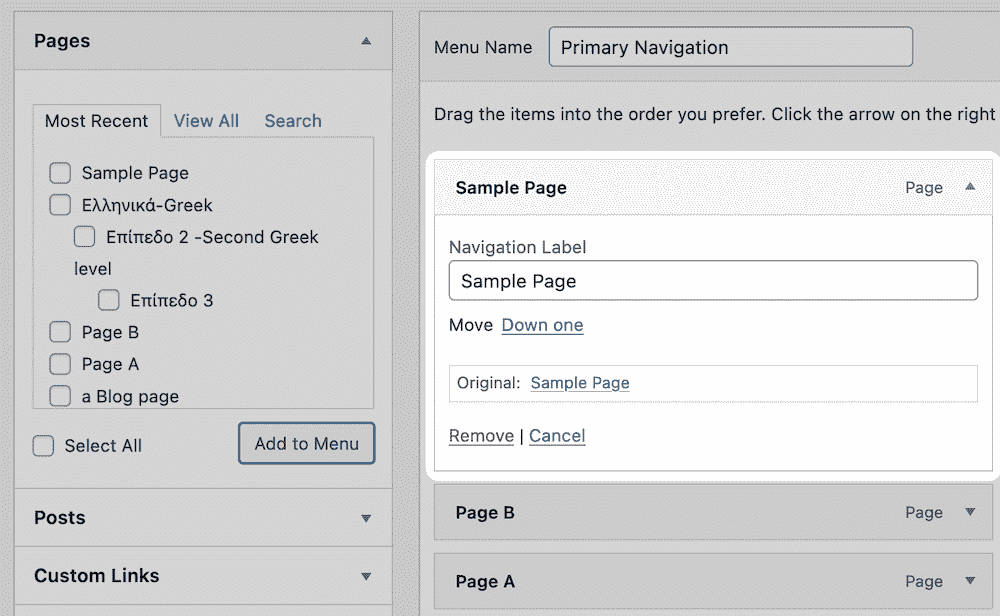

Expanding a menu item.


一旦你点击**保存菜单**，你就可以开始了。如果你展开屏幕顶部的屏幕选项菜单，你可以用你的 WordPress 菜单做更多的事情:


The Screen Options panel.


**屏幕元素**组让你在左侧边栏显示菜单元框。相比之下，**显示高级菜单属性**组显示列表项的链接目标、描述和 CSS 类。

**菜单**屏幕还有一个方面值得注意。**自定义链接**框让你设置一个你选择的链接，而不是你网站上预先定义的页面:


The Custom Links meta box.


这个选项是你添加社交媒体链接到你的 WordPress 菜单的方式。该平台将根据您选择的网站为您拉出正确的图标，让您有机会为您选择的网站展示良好的徽标。

### 2.使用插件创建你的自定义 WordPress 菜单

给 WordPress 添加功能的直接解决方案是通过[插件](https://kinsta.com/blog/wordpress-project-management-plugins/)。前一部分已经解释了为什么 WordPress 的本地选项几乎是你所需要的，但是插件可以扩展这个功能。

有一个问题是，你是否需要一个专门的(和额外的)插件来创建一个 WordPress 菜单，尽管这样做有很多好的理由。对于初学者来说，你经常会创建一个基于默认设置下无法访问的样式的菜单。具体的响应式设计，“巨型菜单”等等都可以通过插件获得。

此外，您可以使用专用编辑器构建菜单，并在许多情况下从预设模板中进行选择。再加上广泛的定制选项，你就有了一个“无代码”的解决方案，它将为你的站点提供一个 WordPress 菜单。

例如， [Max Mega Menu](https://wordpress.org/plugins/megamenu/) 插件对你所能实现的并不感到惊讶:


The Max Mega Menu plugin.


一旦安装了[并激活了](https://kinsta.com/knowledgebase/how-to-install-wordpress-plugins/)，你会在 WordPress 中发现一个新的**大菜单**面板:

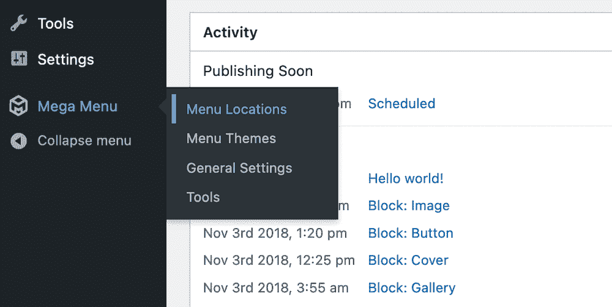

The Menu Locations link within WordPress.


如果您查看**菜单位置**屏幕，您会注意到您可以进行更多定制:

 ## 注册订阅时事通讯


### 想知道我们是怎么让流量增长超过 1000%的吗？

加入 20，000 多名获得我们每周时事通讯和内部消息的人的行列吧！

[Subscribe Now](#newsletter)

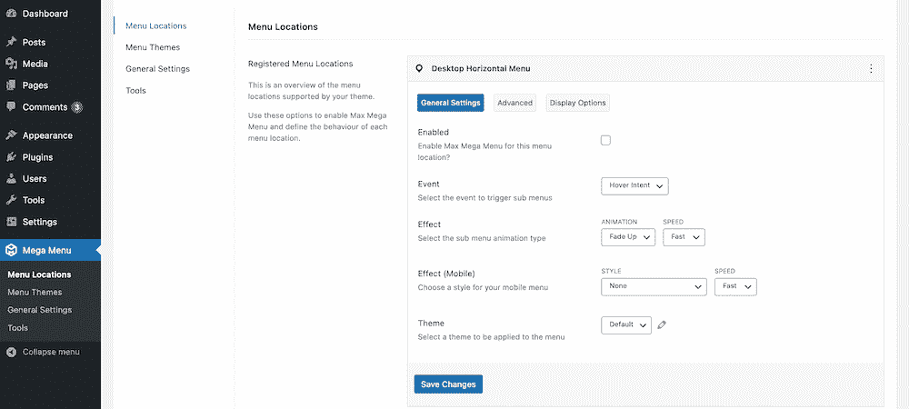

The Menu Locations screen for Max Mega Menu.


您还可以应用菜单主题，并使用与市场上一些最好的页面生成器相似的范围来编辑它们:


The Menu Themes screen in Max Mega Menu.


虽然我们会重复自己的话，但我们还可以挖掘更多的东西。我们鼓励你查看我们之前在 [WordPress 菜单插件](https://kinsta.com/blog/wordpress-menu-plugins/)上的帖子。我们将详细介绍如何为你选择合适的插件以及如何使用它。

### 3.编写代码来创建你的自定义 WordPress 菜单

编写你自己的 WordPress 菜单是实现勇敢者目标的可靠方法(或者如果你是一个开发人员，正在创建一个新的 WordPress 主题)。当然，您不会每天打开代码编辑器来添加菜单。为此，你将使用原生的 WordPress 工具(或者一个插件)。

也就是说，如果你想开发主题，学习如何编写 WordPress 菜单是一个至关重要的要求。成功有[四个部分](https://developer.wordpress.org/themes/functionality/navigation-menus/):

*   注册您的菜单。
*   在前端显示 WordPress 菜单。
*   显示菜单或菜单项中的附加内容。
*   定义回调。

我们假设你很擅长使用[代码编辑器](https://kinsta.com/blog/best-text-editors/)，你有一个[开发环境](https://kinsta.com/feature-updates/local-wordpress-development/)，并且你的[技能很强](https://kinsta.com/knowledgebase/edit-wordpress-code/)。如果你还没有主题，你可以使用 WordPress 的默认选项或者从我们最快的 WordPress 主题列表中选择一个。

当你准备好了，你会想要打开主题的**functions.php**文件。注意，这不同于一般的同名 WordPress 文件。在这里，你需要注册你的菜单。换句话说，你必须告诉 WordPress 在**外观>菜单**页面上显示什么。为此，使用 [register_nav_menus()](https://developer.wordpress.org/reference/functions/register_nav_menus/) 函数:

```
function register_my_menus() {
  register_nav_menus(
    array(
      'header' => __( 'Header Menu' ),
      'other' => __( 'Other Menu' )
     )
   );
 }
 add_action( 'init', 'register_my_menus' ); 
```

这段代码告诉 WordPress 中的**管理位置**选项卡显示两个菜单:**标题菜单**和**其他菜单**:

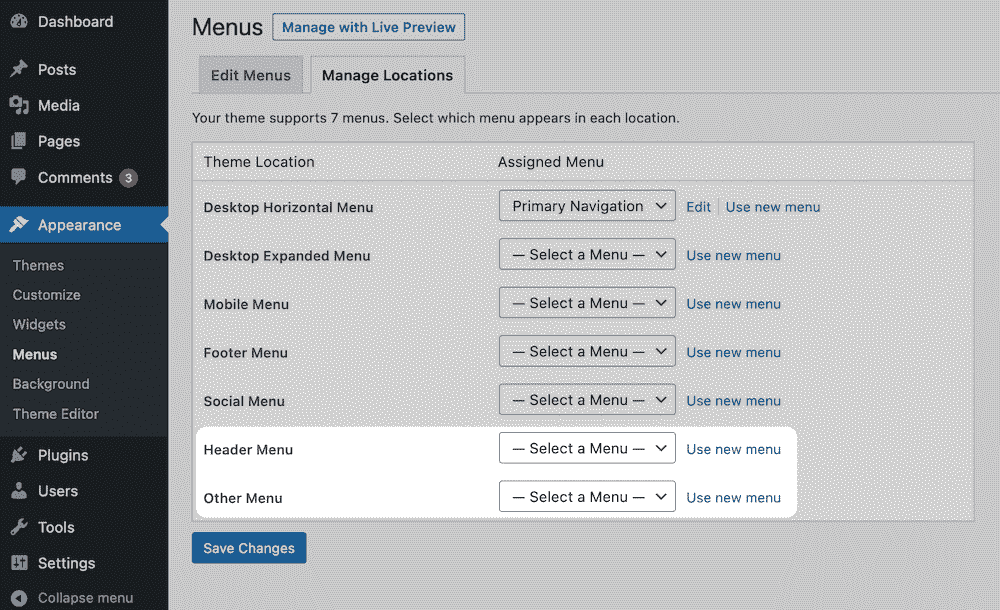

Registering menus in WordPress.


接下来，你必须使用 [wp_nav_menu()](https://developer.wordpress.org/reference/functions/wp_nav_menu/) 函数显示你的菜单。您将把它添加到与您想要显示菜单的位置相对应的模板文件中。在我们的例子中，我们使用头部，所以我们将把下面的代码添加到主题的 header.php 文件中:

```
wp_nav_menu( array( 'theme_location' => 'header' ) ); 
```

这段代码可能和其他菜单一起被包装在一个`if`语句中，所以你会想要遵循你找到的约定。

在这一点上，你可以像使用其他菜单一样使用 WordPress 中的菜单。但是，您可能也想考虑在菜单项中添加额外的内容。例如，您可以扩展已定义的数组，以包含将在输出中呈现的 HTML 标记:

```
wp_nav_menu(
  array(
    'menu' => 'primary',
    'link_before' => '',
    'link_after' => '',
  )
); 
```

您在这里的最后一项任务是定义回调。默认情况下，当没有找到指定的菜单时，WordPress 会显示一个填充菜单。或者，当没有选择自定义菜单时，WordPress 会显示一个页面菜单。如果这不是您想要的操作，您可以为`theme-location`参数设置一个不同的参数，并添加一个`fallback_cb`参数:

```
wp_nav_menu(
  array(
    'menu' => 'primary',
    // do not fall back to first non-empty menu
    'theme_location' => '__no_such_location',
    // do not fall back to wp_page_menu()
    'fallback_cb' => false
  )
); 
```

一旦你理解了如何创建一个 WordPress 菜单，你就可以开始增强它的功能。我们将在最后一节中为 WordPress 创建一个自定义菜单元框。

你的 WordPress 菜单是一个“前线”工具，可以获得很高的搜索排名，让访问者留在网站上。👀通过本指南了解如何增强您的功能👇

## 如何增强你的 WordPress 菜单

因为本节是高级的，所以在继续之前，我们将做一些假设:

需要为您的电子商务网站提供超快的、可靠的、完全安全的托管服务吗？Kinsta 提供所有这些服务，并由 WooCommerce 专家提供 24/7 的世界级支持。[查看我们的计划](https://kinsta.com/plans/?in-article-cta)

*   你知道如何使用 PHP 创建一个 WordPress 菜单。
*   您的 PHP 技能足够好，可以学习一些高级主题。
*   你知道如何注册和初始化一个 WordPress 插件。

这超出了本文的范围，但是您可以使用 [WordPress 插件样板文件生成器](https://wppb.me/)来创建一个新的标准化插件模板。

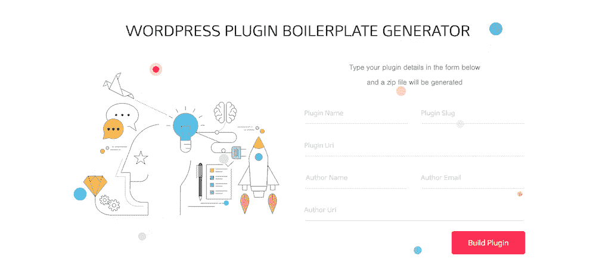

The WordPress Plugin Boilerplate Generator.


当你准备好了，创建你的插件并上传到 WordPress:


A new plugin installed within WordPress.


接下来，导航到插件的文件夹并打开主文件。在这里，添加以下代码:

```
/**
 * Add menu meta box
 *
 * @param object $object The meta box object
 * @link https://developer.wordpress.org/reference/functions/add_meta_box/
 */
function custom_add_menu_meta_box( $object ) {
    add_meta_box( 'custom-menu-metabox', __( 'Authors' ), 'custom_menu_meta_box', 'nav-menus', 'side', 'default' );
    return $object;
}
add_filter( 'nav_menu_meta_box_object', 'custom_add_menu_meta_box', 10, 1); 
```

函数将在 WordPress admin 中注册一个元框。在官方文档中，您可能需要引用一些参数。我们还使用了[nav _ menu _ meta _ box _ object()](https://developer.wordpress.org/reference/hooks/nav_menu_meta_box_object/)过滤器，因为在**nav-menus.php**文件中没有要挂钩的动作。该语句确定函数是否为对象类型添加菜单项的元框。当过滤器运行时，`add_meta_box`注册自定义元框。

#### 定义回调函数

接下来，我们可以定义一个回调函数来为元框生成 HTML 内容:

```
/**
 * Displays a metabox for an author menu item.
 *
 * @global int|string $nav_menu_selected_id (id, name or slug) of the currently-selected menu
 */
function custom_menu_meta_box(){
    global $nav_menu_selected_id;
    $walker = new Walker_Nav_Menu_Checklist();
    ...
} 
```

全局变量记住了当前的菜单 ID，而`$walker`存储了一个`Walker_Nav_Menu_Checklist`对象的新实例。这将构建菜单项的 HTML 列表。

从这里开始，我们必须确定自定义元框中的活动选项卡。为此，我们设置了`$current_tab`的值，在前面代码块中设置的省略号内工作。

我们在这里使用了两个选项卡，但是您可以根据需要添加任意多个:

```
$current_tab = 'all';
if ( isset( $_REQUEST['authorarchive-tab'] ) && 'admins' == $_REQUEST['authorarchive-tab'] ) {
    $current_tab = 'admins';
} elseif ( isset( $_REQUEST['authorarchive-tab'] ) && 'all' == $_REQUEST['authorarchive-tab'] ) {
    $current_tab = 'all';
} 
```

下面一行将获得所有具有写权限的用户，并向`$authors`对象添加许多属性:

```
$authors = get_users( array( 'orderby' => 'nicename', 'order' => 'ASC', 'who' => 'authors' ) );
$admins = array();

/* set values to required item properties */
foreach ( $authors as &$author ) {
    $author->classes = array();
    $author->type = 'custom';
    $author->object_id = $author->nickname;
    $author->title = $author->nickname . ' - ' . implode(', ', $author->roles);
    $author->object = 'custom';
    $author->url = get_author_posts_url( $author->ID ); 
    $author->attr_title = $author->displayname;
    if( $author->has_cap( 'edit_users' ) ){
        $admins[] = $author;
    }
}
$removed_args = array( 'action', 'customlink-tab', 'edit-menu-item', 'menu-item', 'page-tab', '_wpnonce' );
?> 
```

这里，`get_users`返回由指定参数选择的`$user`对象的数组。`who`参数将强制 WordPress 在数据库中查询拥有写权限的用户。

另外，`$admins`数组将存储作者数组，而`$removed_args`将存储要删除的查询变量列表。

现在可以打印元框标记了。为此，让我们构建标签和链接。

```
<div id="authorarchive" class="categorydiv">
	<ul id="authorarchive-tabs" class="authorarchive-tabs add-menu-item-tabs">
		<li <?php echo ( 'all' == $current_tab ? ' class="tabs"' : '' ); ?>>
			<a class="nav-tab-link" data-type="tabs-panel-authorarchive-all" href="<?php if ( $nav_menu_selected_id ) echo esc_url( add_query_arg( 'authorarchive-tab', 'all', remove_query_arg( $removed_args ) ) ); ?>#tabs-panel-authorarchive-all">
				<?php _e( 'View All' ); ?>
			</a>
		</li>

		<li <?php echo ( 'admins' == $current_tab ? ' class="tabs"' : '' ); ?>>
			<a class="nav-tab-link" data-type="tabs-panel-authorarchive-admins" href="<?php if ( $nav_menu_selected_id ) echo esc_url( add_query_arg( 'authorarchive-tab', 'admins', remove_query_arg( $removed_args ) ) ); ?>#tabs-panel-authorarchive-admins">
				<?php _e( 'Admins' ); ?>
			</a>
		</li>
	</ul>
```

记住给元框元素分配正确的类名、id 和数据属性；否则，菜单不会按预期工作。

`add_query_arg`和`remove_query_arg`函数为`authorarchive-tabs`变量设置特定于选项卡的值，并删除不必要的变量。

此时，我们有了一个包含已定义选项卡的元框:

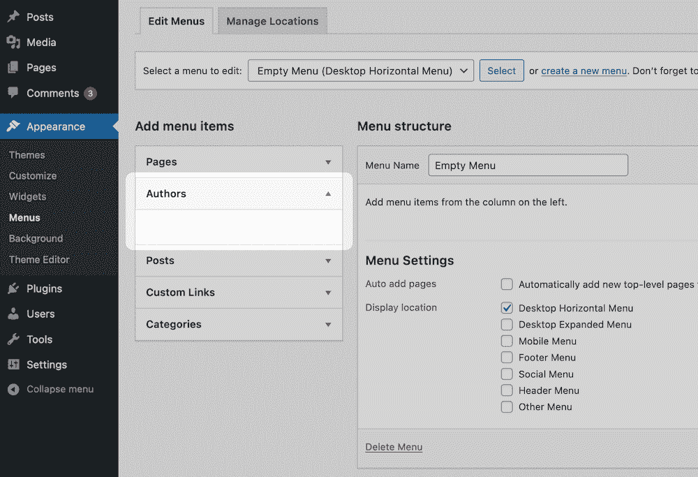

Unpopulated tabs within the Authors’ meta box.


我们的下一步是构建标签的 HTML 内容。

#### 为元框标签构建 HTML 内容

您需要在`custom_menu_meta_box()`函数中遵循上一节中的代码。要构建内容，请在您在上一节中编写的`<div>`标记中使用以下内容:

```
<div id="tabs-panel-authorarchive-all" class="tabs-panel tabs-panel-view-all <?php echo ( 'all' == $current_tab ? 'tabs-panel-active' : 'tabs-panel-inactive' ); ?>">
	<ul id="authorarchive-checklist-all" class="categorychecklist form-no-clear">
	<?php
		echo walk_nav_menu_tree( array_map('wp_setup_nav_menu_item', $authors), 0, (object) array( 'walker' => $walker) );
	?>
	</ul>
</div>

<div id="tabs-panel-authorarchive-admins" class="tabs-panel tabs-panel-view-admins <?php echo ( 'admins' == $current_tab ? 'tabs-panel-active' : 'tabs-panel-inactive' ); ?>">
	<ul id="authorarchive-checklist-admins" class="categorychecklist form-no-clear">
	<?php
		echo walk_nav_menu_tree( array_map('wp_setup_nav_menu_item', $admins), 0, (object) array( 'walker' => $walker) );
	?>
	</ul>
</div>
```

简而言之，每个选项卡都包含一个复选框列表。 [walk_nav_menu_tree()](https://developer.wordpress.org/reference/functions/walk_nav_menu_tree/) 函数使用三个参数打印列表:`$items`、`$depth`和`$r`——都是必需的。

`$items`数组存储管理员用户的数组。`array_map()`函数将 [wp_setup_nav_menu_item()](https://developer.wordpress.org/reference/functions/walk_nav_menu_tree/) 函数应用于`$admins`，并将菜单项属性添加到数组元素中。

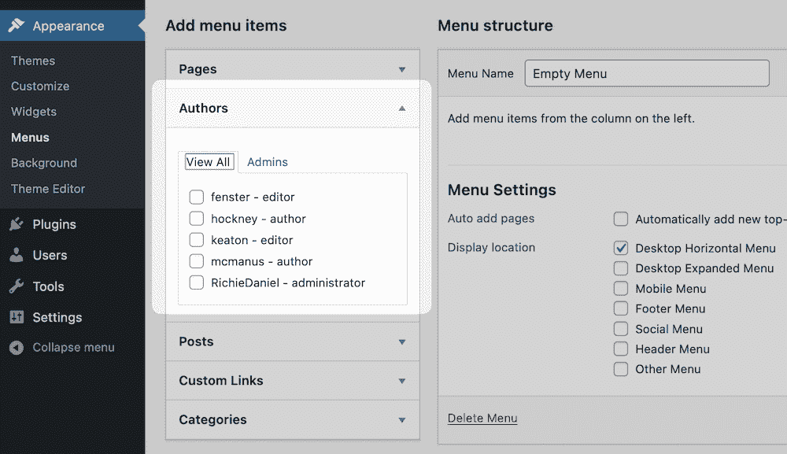

The Author’s meta box, populated with users.


从这里，我们可以添加最后的润色。

#### 添加提交按钮

大部分自定义元框已经完成，尽管我们仍然需要添加一个**提交**按钮和一个处理“微调”图标。

这里有一小段代码，可以直接放在前一个代码块之后:

```
<p class="button-controls wp-clearfix">
	<span class="list-controls">
		<a href="<?php echo esc_url( add_query_arg( array( 'authorarchive-tab' => 'all', 'selectall' => 1, ), remove_query_arg( $removed_args ) )); ?>#authorarchive" class="select-all"><?php _e('Select All'); ?></a>
	</span>
	<span class="add-to-menu">
		<input type="submit"<?php wp_nav_menu_disabled_check( $nav_menu_selected_id ); ?> class="button-secondary submit-add-to-menu right" value="<?php esc_attr_e('Add to Menu'); ?>" name="add-authorarchive-menu-item" id="submit-authorarchive" />
		<span class="spinner"></span>
	</span>
</p>

</div>
<?php
}
```


The finished Authors meta box within WordPress.


有了这些知识，你几乎可以在菜单中添加任何功能！注意，GitHub 上还有一个插件的[公共要点](https://gist.github.com/carlodaniele/5202b29d11fce21af01f2c2cb00b6d61)，可以免费下载。

## 摘要

WordPress 菜单是你网站的一个重要方面。正因为如此，该平台提供了一个强大的本地面板，可以让你定制网站上的每一个菜单。但是，它不会默认提供你需要的一切。

几个屏幕选项帮助你[添加 CSS 标签](https://kinsta.com/blog/wordpress-css/)等等。此外，安装一个插件将让你把你的原生菜单变成巨大的菜单，并与增强的功能一起工作，使你的菜单更加灵敏(在其他方面)。编码也是一种可能，尽管对一个初学编码的人来说，这是一项具有挑战性的任务，但是你可以在一个下午的时间内完成。

你想定制你的 WordPress 菜单吗？如果是，你打算用什么方法？在下面的评论区分享你的想法和观点吧！

* * *

让你所有的[应用程序](https://kinsta.com/application-hosting/)、[数据库](https://kinsta.com/database-hosting/)和 [WordPress 网站](https://kinsta.com/wordpress-hosting/)在线并在一个屋檐下。我们功能丰富的高性能云平台包括:

*   在 MyKinsta 仪表盘中轻松设置和管理
*   24/7 专家支持
*   最好的谷歌云平台硬件和网络，由 Kubernetes 提供最大的可扩展性
*   面向速度和安全性的企业级 Cloudflare 集成
*   全球受众覆盖全球多达 35 个数据中心和 275 多个 pop

在第一个月使用托管的[应用程序或托管](https://kinsta.com/application-hosting/)的[数据库，您可以享受 20 美元的优惠，亲自测试一下。探索我们的](https://kinsta.com/database-hosting/)[计划](https://kinsta.com/plans/)或[与销售人员交谈](https://kinsta.com/contact-us/)以找到最适合您的方式。