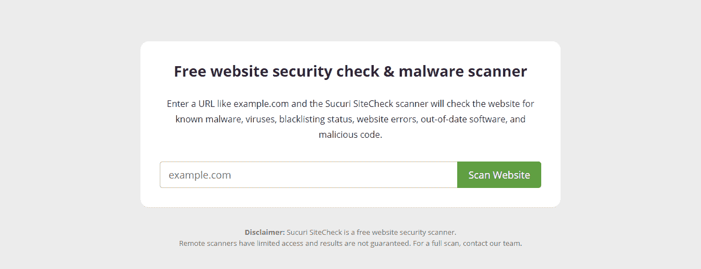
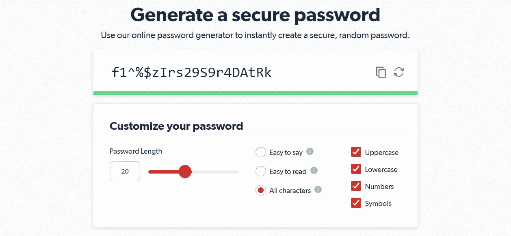
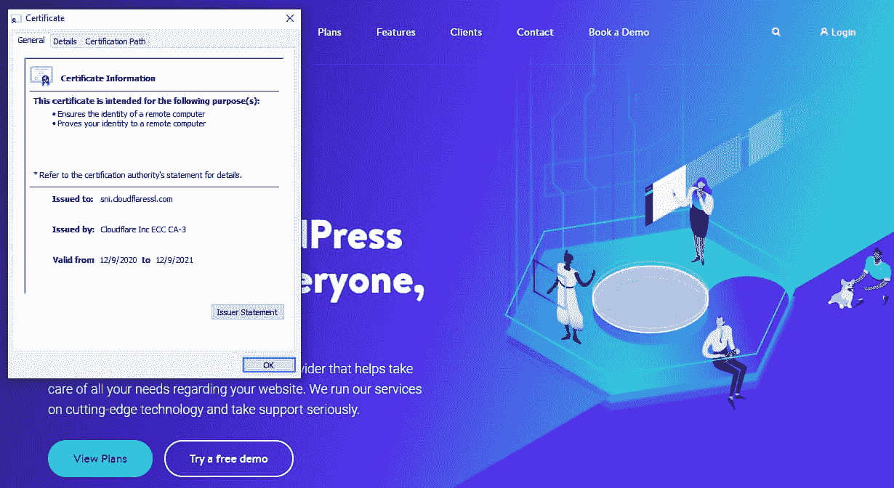
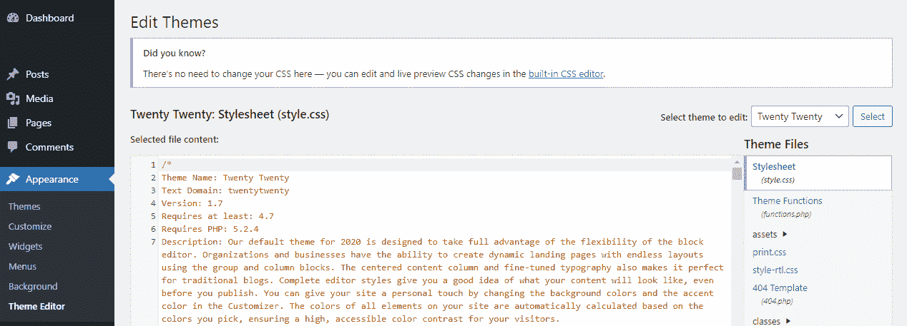
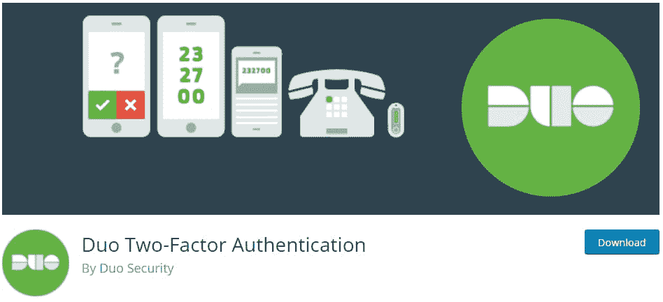

# 网站安全检查:保护您的网站免受恶意软件和垃圾邮件的侵害

> 原文:[https://kinsta.com/blog/website-security-check/](https://kinsta.com/blog/website-security-check/)

安全性已经成为 web 开发人员和网站所有者非常关心的问题，这并不奇怪。随着互联网的普及并成为新的交流、研究和购物方式，网站安全检查对于阻止恶意软件和垃圾邮件的传播至关重要。

无论你经营的是一个小小的个人博客还是一个巨大的跨国网上商店，被黑的威胁总是存在的。有些人会破坏你的网站并嵌入恶意软件，试图窃取你或你的客户的数据，并删除你服务器上的重要内容。你需要保护你自己和你的敏感信息。

让我们来看看你的网站现在到底有多安全。我们还将提供一些提示，来消除恶意软件作者利用的那些唾手可得的果实。WordPress 开箱后是安全的，但要完全修补它还需要一点工作。

### 查看我们的[视频指南](https://www.youtube.com/watch?v=ENvlIBxo9Es)来执行网站安全检查

<kinsta-video src="https://www.youtube.com/watch?v=ENvlIBxo9Es"></kinsta-video>

 <kinsta-auto-toc heading="Table of Contents" exclude="last" list-style="arrow" selector="h2" count-number="-1">## 网站安全检查:为什么很重要？

你可能会认为你的网站很小，不重要，没有人会去关注它。或者，也许你以前从来没有考虑过安全问题，认为这没什么大不了的。

这就是为什么在 2013 年，超过 70%的 WordPress 安装容易受到攻击。这些攻击中的许多是由于[过时的软件](https://sucuri.net/reports/2019-hacked-website-report/)——因为大多数人要么不知道足够多，要么不关心足够多来保护他们的网站，这导致了大规模的[黑客攻击 WordPress 安装](https://kinsta.com/blog/wordpress-hacked/)。

<link rel="stylesheet" href="https://kinsta.com/wp-content/themes/kinsta/dist/components/ctas/cta-mini.css?ver=2e932b8aba3918bfb818">


> 需要在这里大声喊出来。Kinsta 太神奇了，我用它做我的个人网站。支持是迅速和杰出的，他们的服务器是 WordPress 最快的。
> 
> <footer class="wp-block-kinsta-client-quote__footer">
> 
> 
> 
> <cite class="wp-block-kinsta-client-quote__cite">Phillip Stemann</cite></footer>

[View plans](https://kinsta.com/plans/)


Outdated vs Updated CMS in 2019.


那么，如果你的网站遭遇不必要的入侵，会发生什么呢？这不仅仅是一个简单的烦恼，通过更改密码就可以轻松解决。

*   你的网站可能会有[代码注入其中](https://kinsta.com/blog/sql-injection/)，导致访问者感染恶意软件，这可能极难定位和删除。
*   你的关键页面可能会被涂污，空白，或塞满了非法网站的链接。
*   这可能会导致博客帖子和页面等内容被删除。
*   属于您、您的用户或您的客户的敏感信息(如登录信息或信用卡信息)可能会被窃取并在网上出售。
*   攻击可能会蔓延到您服务器上的其他网站。
*   如果谷歌在你的网站上检测到任何恶意软件，它将阻止其访问并将其从搜索结果中删除，破坏你的搜索引擎优化(SEO)努力。
*   管理员帐户的用户名和密码可能会被更改，阻止您访问您的后端。

如果你[经营一家电子商务商店](https://kinsta.com/blog/ecommerce-platforms/)，被黑的网站可能是一笔大买卖。

虽然你可能会说你的网站不够重要，但并不是所有的攻击都是有针对性的。许多 WordPress 攻击都是自动进行的——一个机器人会探测你网站的漏洞，并在没有人工干预的情况下发起攻击。

这就是为什么你需要[采取措施来保护你的网站](https://kinsta.com/cheatsheets/site-security-cheat-sheet/)，无论如何。
T3】

### WordPress 为什么会被黑？

黑客攻击很普遍，但是黑客用来侵入您的站点的最常见的漏洞是什么？

你可能会想象进入一个网站是一个具有挑战性的过程，需要几天或几周的工作和大量关于计算机、编码和服务器的知识。这种情况对于试图突破一个大型的、受到良好保护的网站的防御是真实的，但是对于小型的 WordPress 域来说，情况就大不相同了。

绝大多数对 WordPress 的攻击之所以成功，是因为人们使用了容易猜到的密码，并且没有更新他们的主题和插件。黑客利用自动化程序闯入大多数此类网站。

密码破解是最简单的黑客形式，但它如此普遍是因为它有效。许多人将他们的 WordPress 登录设置为默认的“admin”，省去了一半的猜测，然后使用一个简单的、可猜测的密码。

当失败时，黑客将利用流行插件或 WordPress 过时版本中的常见漏洞。这就是为什么保持一切更新是如此重要。

有很多更复杂的方法可以侵入一个网站。尽管如此，大多数 WordPress 攻击利用了不安全的密码和过时的软件，这使得进入网站变得非常容易。

## 如何执行网站安全检查

保护网站安全的第一步:确定网站的安全程度。您的后端是否有任何明显的漏洞需要您立即修补，或者您现在可以进行任何简单的修复？

### 使用在线工具

一个快速简单的方法来检查您的网站的恶意软件和漏洞是使用在线扫描仪。这些远程扫描您的网站，并确定常见问题。它超级方便，因为它不需要任何软件或插件，只需要几秒钟。

网上有几十种扫描仪可供选择，我们将在下面的工具部分列出一些其他的，但现在，让我们挑选一种易于使用的流行扫描仪: [Sucuri SiteCheck](https://sitecheck.sucuri.net/) 。



Sucuri SiteCheck.


这个工具是一个很好的选择，因为你可以安装 Sucuri 插件并修复它检测到的任何问题。

一旦你扫描了你的网站，Sucuri 会对照黑名单进行检查，寻找明显的问题，如注入的垃圾邮件或过时的软件，并简单地扫描任何它可以访问的恶意软件代码。它还提供了一些建议，以加强您的网站对攻击。


Scanning a website with the Sucuri plugin.


像这样的工具是检测隐藏的恶意软件和其他问题的绝佳切入点。

### 用 WordPress 插件扫描你的网站

虽然在线扫描仪已经足够好了，但安装一个插件更好，它能够深入挖掘代码的根源，找出漏洞或难以检测的恶意软件。

我们已经提到了苏库里作为一个选项。还有两个更受欢迎的安全插件: [All in One WP 安全&防火墙](https://wordpress.org/plugins/all-in-one-wp-security-and-firewall/)，以及资源库上下载量最多的 [Wordfence 安全](https://wordpress.org/plugins/wordfence/)。

一旦你安装了你选择的插件，它可能会指示你立即运行扫描。与远程扫描仪相比，这些插件的优势在于它们可以删除恶意软件并自动进行更改。
<kinsta-advanced-cta language="en_US" type-int-post="100335" type-int-position="1"></kinsta-advanced-cta>

### 寻找奇怪的变化

如果您怀疑或知道您的站点已经感染了恶意软件，确定来源有时会很困难。以下是您可能会注意到的一些无法解释的变化，以及通常会吸引黑客的文件:

*   突然链接到不是你自己添加的陌生网站
*   您没有创建的新文章和页面，或者现有页面的内容突然发生变化
*   您没有对设置进行更改
*   您没有添加的新用户，尤其是具有高级权限的用户
*   您没有安装的插件或主题
*   恶意软件通常会将恶意代码注入到您的文件中。检查插件和主题文件、 **wp-content/uploads** 文件夹、位于错误目录的 WordPress 核心文件、【wp-config.php】和**。htaccess** 。你应该[备份你的网站](https://kinsta.com/blog/backup-wordpress-site/)并且在做任何敏感的改变之前理解代码。

如果你用 FTP 连接到你的站点，你可以通过最近修改的文件来查找不应该在那里的代码。

如果您的站点定期感染恶意软件，而您在文件中找不到任何原因，则问题可能出在您的服务器或服务器上的另一个站点。

### 确保一切都是最新的

正如我们已经提到的，过时的软件是 WordPress 中最常见的感染媒介。如果只有一件事可以让你的网站安全，那就是[保持 WordPress 更新](https://kinsta.com/blog/wordpress-version/)。

检查你网站上所有软件状态的最简单的方法是去**仪表板** > **更新**，如果你的核心、主题或插件过期了，它会提醒你。


WordPress updates


自从 5.5 版本以来，WordPress 现在执行自动更新，没有什么是过时的，除非你有一个过时的 WordPress 版本。如果没有，您可以从该屏幕更新所有内容。

如果你知道有 WordPress 的新版本，但它没有出现，点击**当前版本**下面的**再次检查**按钮。

您也可以查看您的**插件** > **已安装插件**或**外观** > **主题**页面进行更新。


### 重要的

让 PHP 保持最新是很重要的，尤其是如果你使用的是 7.3 以前的版本，因为它会带来很大的安全漏洞。


### 安全帐户和密码

您的主帐户上的弱密码使任何人都可以很容易地用暴力程序闯入您的站点，给予他们管理员访问权限和更改任何内容的能力。

虽然复杂的密码可能很难记住，使登录变得不太方便，但如果不得不从黑客攻击中恢复您的网站，那就更不方便了。使用更安全的密码绝对是值得的，即使你必须把它写下来。

您的密码应该混合使用大小写字母、数字和符号。最好不要基于字典上的单词或个人的、可猜测的信息，如你的地址或家庭成员的名字。

在最好的情况下，您的密码将是一长串杂乱的随机字符。我们强烈建议您使用[密码管理器](https://kinsta.com/blog/password-managers/)。使用像 [1Password](https://1password.com/password-generator/) 或 [LastPass](https://kinsta.com/blog/dashlane-vs-lastpass/) 这样的网站来生成一个安全的、不可访问的密码。



Generating a secure password with LastPass.


你可以进入**用户** > **所有用户**或者直接进入**用户** > **个人资料**，在 WordPress 中[更新你的密码](https://kinsta.com/blog/change-wordpress-password/)和电子邮件。向下滚动，在**联系信息下找到**邮箱**，在**账户管理**下找到**和**新密码**。

 ## 注册订阅时事通讯


### 想知道我们是怎么让流量增长超过 1000%的吗？

加入 20，000 多名获得我们每周时事通讯和内部消息的人的行列吧！

[Subscribe Now](#newsletter)


Setting a new password in WordPress


当你在**用户**页面时，看看你所有的用户，确保没有你不认识的人或者没有不适当的权限。您应该立即删除任何具有管理员权限的未识别用户。

我们还鼓励您查看关于限制用户权限的指南，这样只有您的帐户才能更改您网站上的敏感文件。

### 检查您的 SSL 证书

如果你的 SSL 证书已经过期，你通常会立刻知道；像谷歌 Chrome 这样的浏览器会对过期的证书发出警告，阻止用户访问你的网站。如果你不确定或者已经得到这个错误，检查你的 SSL 证书，看看它是否是最新的，以及你是否正在使用最新版本的 SSL/TLS[。](https://kinsta.com/knowledgebase/tls-vs-ssl/)

当您访问网站时，您会在大多数浏览器的地址栏中看到一个锁图标。如果您的证书已过期，此锁可能是红色的或有一条斜线穿过。

点按锁图标，然后再次点按以查看证书信息，包括其到期日期。



Checking the SSL certificate of a website.


您还可以使用一个 [SSL 证书检查器](https://www.digicert.com/help/)来扫描您的站点，以确保您的证书没有过期，并且您的 SSL 协议中没有漏洞。

### 常见漏洞

许多 WordPress 网站充斥着微小的攻击媒介，看似无害，却能提供比你想要分享的更多的信息。

在你的前端有一个[可见的 WordPress 版本](https://kinsta.com/knowledgebase/check-wordpress-version/)可以准确地告诉黑客你的网站上存在哪些漏洞。尤其是如果你使用的是 WordPress 的过时版本，你可能想要隐藏这些信息。

你会注意到**下的文件编辑器** > **主题编辑器**和**插件** > **插件编辑器**在你的后端。



Adding code to the Theme Editor


虽然这些工具非常方便，但它也让任何入侵你的网站的人有机会破坏一些东西，所以你可能想把它们关掉。您可以通过将此功能添加到**wp-config.php**来实现:

```
define( 'DISALLOW_FILE_EDIT', true );
```

SQL 注入是闯入站点的一种常见方式。如果您有任何表单或其他用户输入，请限制使用特殊字符，并且只允许上传安全、常见的文件类型。

最后，为了增加一层保护，你可以用[密码保护文件目录](https://kinsta.com/blog/password-protect-wordpress-site/#directory)。
T3】

## 如何保护您的网站:提示和工具

如果你的网站有恶意软件，一个好的安全插件应该可以清除它。我们已经涵盖了上面几个您想要检查的漏洞。

需要一个给你带来竞争优势的托管解决方案吗？Kinsta 为您提供了令人难以置信的速度、一流的安全性和自动伸缩功能。[查看我们的计划](https://kinsta.com/plans/?in-article-cta)

### 查看我们的[视频指南](https://www.youtube.com/watch?v=dorMYOZfugM)来保护您的网站

<kinsta-video src="https://www.youtube.com/watch?v=dorMYOZfugM"></kinsta-video>

我们还有一些其他的快速提示来保护您的网站，并在感染发生之前防止感染。你可以在几分钟内应用这些技巧，所以即使你不熟悉 WordPress 和 web security，它们也应该很容易设置。

### 选择安全的主机

当黑客试图进入你的网站时，他们通常会转向服务器寻找漏洞。有很多便宜的主机，但他们并不总是投资于最安全的服务器。

共享主机可能是传染的媒介。如果一个网站感染了恶意软件，它可能会传播到服务器上的每个站点。所以你可能最终会得到一个充满病毒和 SEO 垃圾邮件的网站，这甚至不是你的错。

这就是为什么做你的研究并选择一个关心安全和投资 T2 安全服务器的主机是至关重要的。你仍然需要把工作放进去以保护你的网站，但是在服务器层面，你的数据是安全的。

### 打开两步身份验证(2FA)

[两步认证](https://kinsta.com/blog/wordpress-two-factor-authentication/)(也称为双因素认证或 2FA)增加了另一个登录步骤。除了用户名和密码，你或任何伪装成你的人还需要另一条信息:一个独特的附加代码。

它可能是发送到你的[手机](https://kinsta.com/blog/how-to-know-if-your-phone-is-hacked/)上的一个数字代码，可以通过暴力手段使你的 WordPress 账户几乎无法破解。或者，它可能需要电子邮件验证或一条只有你知道的信息。

虽然没有内置的方法来启用双因素认证，但许多插件都为 WordPress 添加了这一功能。

Kinsta 向所有客户提供[双因素认证](https://kinsta.com/help/two-factor-authentication/)。如果你不是 Kinsta 的用户，我们之前提到的 [Wordfence](https://wordpress.org/plugins/wordfence/) 安全插件内置了 2FA。你也可以尝试其他网站安全工具，如用于电子邮件代码的[双因素插件](https://wordpress.org/plugins/two-factor/)或通过应用程序设置双因素电话认证的 [Duo](https://wordpress.org/plugins/duo-wordpress/) 。



Duo Two-Factor Authentication plugin


### 每天做备份

备份你的网站并不能防止有人试图闯入，但是如果真的发生了什么，有一个备份将是无价的。这可能意味着丢失几周甚至几年的工作和简单地恢复到黑客攻击前的备份之间的差别。

如果您使用的是 Kinsta，我们将为您提供存储两周的[每日自动备份](https://kinsta.com/help/wordpress-backups/)(对于使用 [Kinsta 代理合作伙伴计划](https://kinsta.com/wordpress-hosting-agencies/)的用户，存储时间为 30 天)。此外，您可以每周创建五个手动备份和一个可下载的备份，并且有可选的插件来每小时备份或导出到云。

像 [UpdraftPlus](https://wordpress.org/plugins/updraftplus/) 这样的插件也有帮助。最好选择每天至少备份一次的服务，以最大限度地减少数据丢失。

### 使用 Web 应用程序防火墙

一个[网络应用防火墙](https://kinsta.com/blog/what-is-a-firewall/)，或 WAF，使用严格的规则来过滤进入的流量，阻止列出已知与黑客攻击或 DDoS 攻击有关的 IP。它防止许多攻击到达您的服务器。

虽然你可以在服务器层面应用 WAFs，但最简单的方法是购买基于云的服务，比如由 [Cloudflare](https://www.cloudflare.com/) 或 [Sucuri](https://kinsta.com/blog/sucuri-firewall/) 提供的服务。

### 通过 SSH 或 SFTP 连接

有时你需要用 FTP 连接到你的站点来添加或修改文件。用 [SFTP 总比用 FTP](https://kinsta.com/knowledgebase/ftp-vs-sftp/) 好；区别很简单:SFTP 是安全的，而 FTP 不是。

使用 FTP，您的数据不会被加密。如果有人设法拦截你和你的服务器之间的连接，他们可以看到从你的 FTP 登录凭证到你上传的任何文件。永远和 SFTP 保持联系。

你也可以考虑使用 SSH 访问，它允许你连接到一个命令提示符并更直接地管理你的站点。它安全可靠，可以远程处理简单的任务。[如果你遇到困难，我们的宋承宪指南](https://kinsta.com/blog/how-to-use-ssh/)可以帮你。

### 防止 DDoS 攻击

[DDoS 攻击](https://kinsta.com/blog/what-is-a-ddos-attack/)通过向您的服务器发送成千上万的虚假请求，阻止潜在的读者或客户访问您的网站，使您的网站慢如蜗牛。以下是一些在它们发生之前阻止它们的建议:

*   当 DDoS 攻击袭击时，为[准备好计划。当您需要提醒您的 web 主机并阻止攻击时，您不希望惊慌失措。](https://kinsta.com/blog/ddos-attack/)
*   使用能够检测虚假流量的 web 应用程序防火墙。
*   使用专门定制的反 DDoS 软件。
*   [停用 xmlrpc.php](https://kinsta.com/blog/xmlrpc-php/)以阻止第三方应用程序使用您的服务器。
*   [对一般用户禁用 REST API](https://wordpress.org/plugins/disable-json-api/) 。

### 防止暴力攻击

暴力攻击可能类似于 DDoS 攻击，但目标是猜测您的管理员密码并闯入网站，而不是让您的服务器停机。也就是说，这些也会降低你网站的速度。

*   同样，WAF 可以过滤掉 bot 流量和明显暴力企图。
*   对您的管理员帐户使用两步验证。
*   建立一个[活动日志](https://wordpress.org/plugins/aryo-activity-log/)并留意未授权的登录尝试。
*   [更改登录页面 URL](https://kinsta.com/blog/wordpress-login-url/) 并限制登录尝试次数。
*   [密码保护您的登录页面](https://wordpress.org/support/article/brute-force-attacks/#password-protect-wp-login-php)。
*   使用一个长的随机生成的密码，并每年更换一次。

## 你需要了解的网站安全工具

除了我们已经提到的，这里还有一些在线安全工具可以帮助你锁定你的网站:

*   [intrusor . io](https://www.intruder.io/):扫描最新漏洞。
*   [SSL 服务器测试](https://www.ssllabs.com/ssltest/):分析您的 SSL 证书并识别弱点的开发工具。
*   HTML 净化器:过滤掉恶意代码/XSS，如果您有需要清理的受感染代码，这非常有用。
*   Mozilla Observatory :清除代码中常见漏洞的可行建议。
*   sqlmap :识别 SQL 代码漏洞的渗透测试工具。
*   [Detectify](https://detectify.com/) :在道德黑客的帮助下扫描你的网络应用。
*   WPScan :基于 CLI 的 WordPress 扫描仪。
*   SonarQube :编写符合标准的无安全漏洞的代码。

## 网站安全清单

你的网站安全吗？确保您已经勾选了清单上的几乎所有内容:

*   您使用的是安全、高质量的托管环境吗？
*   你有没有用插件或在线扫描仪扫描你的网站来检查病毒？
*   您安装了活动日志吗？您是否在监控它的异常变化？
*   您和任何拥有高级权限的用户是否使用安全密码和双因素身份验证？所有的邮件都是正确的吗？
*   WordPress，它的主题和插件，以及 PHP 等底层系统是最新的吗？
*   您的 SSL 证书是安全的和最新的吗？
*   您是否检查过无法解释的内容更改、删除或添加，或者您没有在网页、设置或文件中添加的链接？
*   您的登录页面是否受到密码和[有限登录尝试](https://wordpress.org/plugins/limit-login-attempts-reloaded/)的保护？
*   你检查过没有添加的新用户吗？
*   表单、评论框和其他用户输入来源是否受到保护？(不允许使用特殊字符，并将文件上传限制为已知的文件类型。)
*   有没有禁用**xmlrpc.php**和 REST API 来防止 DDoS 攻击？
*   你是否在仪表盘中禁用了主题和插件编辑？
*   您是否有每日备份服务？
*   您是否设置了 web 应用程序防火墙？

## 摘要

网站安全不是一件小事，所以如果你还没有掌握它，现在是时候把它放在首位了。被黑客攻击不仅仅是令人烦恼——它可能导致搜索引擎优化受损、毁灭性的数据丢失、失去用户信任，以及恶意软件一次又一次地卷土重来。

你不需要成为一个经验丰富的开发人员采取一些额外的步骤来保护你的网站。这要从适当的网站安全检查开始。甚至像选择一个更好的密码或切换到一个更安全的主机这样简单的事情也能带来不同。

*需要更多安全提示吗？了解 [19 种保护网站安全的更多方法](https://kinsta.com/blog/wordpress-security/)。欢迎在下面的评论中分享你的建议！*

* * *

让你所有的[应用程序](https://kinsta.com/application-hosting/)、[数据库](https://kinsta.com/database-hosting/)和 [WordPress 网站](https://kinsta.com/wordpress-hosting/)在线并在一个屋檐下。我们功能丰富的高性能云平台包括:

*   在 MyKinsta 仪表盘中轻松设置和管理
*   24/7 专家支持
*   最好的谷歌云平台硬件和网络，由 Kubernetes 提供最大的可扩展性
*   面向速度和安全性的企业级 Cloudflare 集成
*   全球受众覆盖全球多达 35 个数据中心和 275 多个 pop

在第一个月使用托管的[应用程序或托管](https://kinsta.com/application-hosting/)的[数据库，您可以享受 20 美元的优惠，亲自测试一下。探索我们的](https://kinsta.com/database-hosting/)[计划](https://kinsta.com/plans/)或[与销售人员交谈](https://kinsta.com/contact-us/)以找到最适合您的方式。</kinsta-auto-toc>