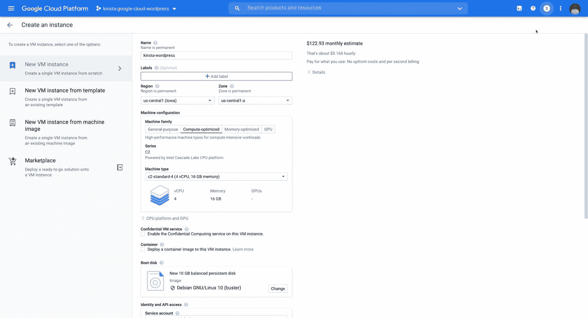
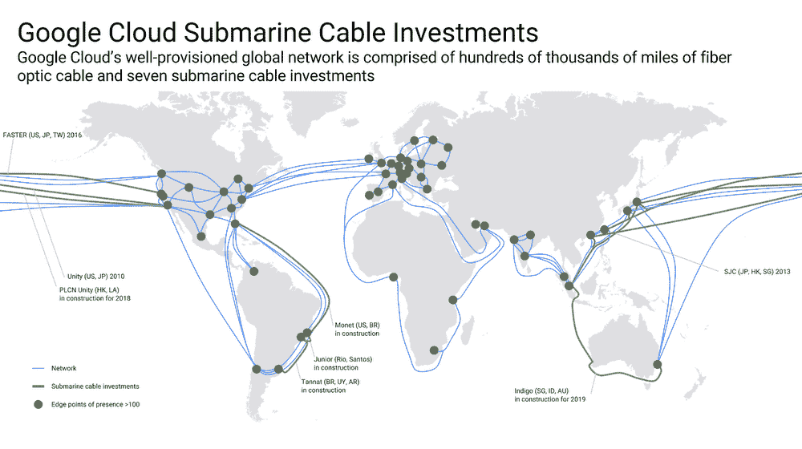
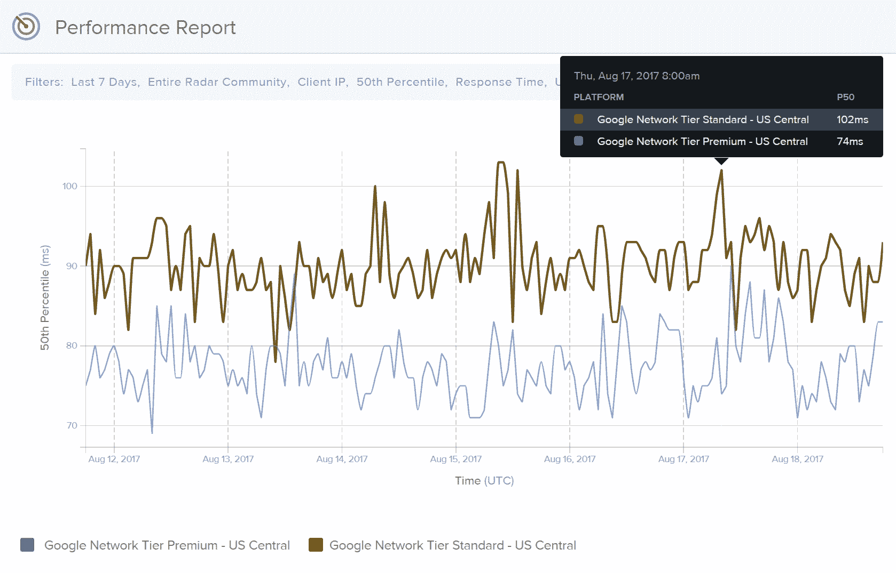
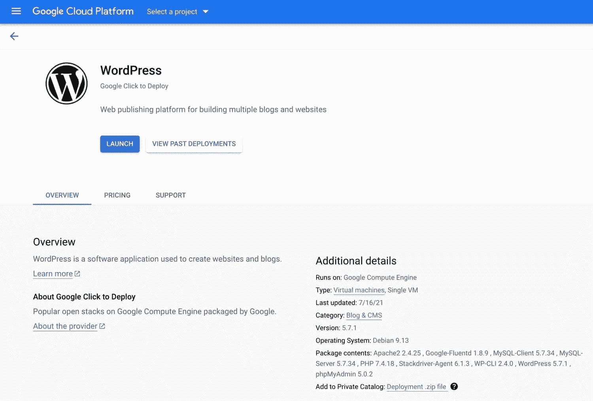

# 如何在谷歌云平台上托管 WordPress

> 原文:[https://kinsta.com/blog/wordpress-on-google-cloud/](https://kinsta.com/blog/wordpress-on-google-cloud/)

与亚马逊网络服务和微软 Azure 一起，谷歌云平台(GCP)是世界上最受欢迎的云计算服务提供商之一。

GCP 提供广泛的云产品，从“计算引擎”虚拟机到托管的 Kubernetes 集群，再到高级 DNS 和 CDN 服务。在这篇文章中，我们将看看一些 GCP 最受欢迎的产品，它们可以部署高性能的 WordPress 站点。

在 Kinsta，我们的托管基础设施由[谷歌云平台](https://kinsta.com/blog/google-cloud-hosting/)提供支持。几年前，在测试了各种顶级云提供商之后，我们转向了 GCP。对我们来说，谷歌云提供了性能、安全性和功能集的最佳组合。

由于 Kinsta 是一个[应用程序](https://kinsta.com/application-hosting/)、[数据库](https://kinsta.com/database-hosting/)和[管理的 WordPress 主机](https://kinsta.com/blog/managed-wordpress-hosting/)，我们处理所有服务器端软件更新和管理，因此客户可以专注于使用我们定制的 [MyKinsta 仪表板](https://kinsta.com/mykinsta/)管理他们的网站。

快进到 2022 年， **Kinsta 上托管的所有网站都由 GCP 最快的计算引擎虚拟机及其超快速高级层网络**提供支持。

不知道那是什么意思？让我们仔细看看谷歌云计算引擎！

 ## 什么是谷歌云平台计算引擎？

计算引擎是谷歌云的虚拟机(VM)产品。在 2022 年，虚拟机通常是“服务器”的同义词换句话说，如果你听到有人说他们必须为他们的项目建立一个服务器，这通常意味着他们正在建立一个虚拟机。

> Kinsta 把我宠坏了，所以我现在要求每个供应商都提供这样的服务。我们还试图通过我们的 SaaS 工具支持达到这一水平。
> 
> <footer class="wp-block-kinsta-client-quote__footer">
> 
> 
> 
> <cite class="wp-block-kinsta-client-quote__cite">Suganthan Mohanadasan from @Suganthanmn</cite></footer>

[View plans](https://kinsta.com/plans/)

### 什么是计算引擎虚拟机？

虚拟机分配计算资源，包括 CPU 内核、RAM、 [SSD](https://kinsta.com/blog/what-is-ssd/) 或机械磁盘存储，以及网络连接。虚拟机源自物理机，代表底层物理机的一部分资源。

例如，一台拥有 128 个 CPU 内核、128 GB RAM 和 1tb SSD 存储的物理机可以分成 4 个虚拟机，每个虚拟机拥有 32 个 CPU 内核、32 GB RAM 和 250 GB SSD 存储。

在实践中，来自谷歌云平台等顶级提供商的虚拟机提供了传统物理机无法比拟的灵活可扩展性。

为了证明这一点，想象一下如果你的 WordPress 站点允许人们在餐馆预订。

在这一周，该网站没有收到太多的流量。周五晚上，交通流量增加，并持续到周末。如果您的站点托管在物理服务器上，您将不得不处理静态和不可扩展的资源(例如，16 个 CPU 内核、32 GB RAM、500 GB SSD 存储)。这意味着你的机器只在周五到周日有效率，而在周一到周四效率就没那么高了。

另一方面，计算引擎虚拟机允许您在一周内分配最低水平的资源(例如，4 个 CPU 内核、16 GB RAM、500 GB SSD 存储)，并增加您的计算资源以应对周末流量激增带来的流量增加。在周末激增之后，您可以缩减到初始配置。由于 Google Cloud 提供了强大的开发者 API，扩展过程甚至可以自动化！

### 计算机引擎机器系列

在我们深入研究如何使用 Compute Engine 来托管一个 WordPress 站点之前，让我们回顾一下 Compute Engine 中可用的各种机器家族。

#### E2 虚拟机

E2 虚拟机专为低成本的日常计算场景而设计。它们非常适合托管小型网站和应用、微服务以及开发环境。虽然谷歌没有明确说明这一点，但许多人认为 E2 机器家族是老化的 N1 机器家族的更快更便宜的替代品。

E2 虚拟机利用英特尔和 AMD 的 x86 CPUs，但与其他机器家族的虚拟机不同，它们不允许您选择特定一代的芯片。相反，E2 虚拟机使用专有的“资源负载平衡”技术，根据可用性动态分配 CPU。这意味着 E2 虚拟机可以由各种英特尔(Skylake、Broadwell 和 Haswell)和 AMD EPYC 罗马芯片提供支持。

由于 Google 的负载平衡技术，包括自定义 CPU 调度程序和性能感知 CPU 迁移，E2 虚拟机可以保持一致的性能水平，尽管支持虚拟机的物理硬件各不相同。

#### N1 虚拟机

与 E2 虚拟机家族一样，N1 虚拟机也是成本较低的通用虚拟机，可满足日常计算需求。但是，它们使用较旧的英特尔处理器，性价比低于 E2 虚拟机。因此，除非您有特定的理由选择 N1 虚拟机，否则 E2 虚拟机可以以更低的价格实现相同级别的性能。

#### N2 虚拟机

N2 虚拟机是 N1 和 E2 虚拟机的更高性能替代产品。与 N1 和 E2 机器不同，N2 虚拟机配备了更新的英特尔 Cascade Lake CPUs，根据谷歌的说法，与较低层虚拟机相比，以相同的价格提供了 20%的性能。对于内存密集型使用情形，可以为 N2 虚拟机的每个 CPU 多配置 25%的内存。

#### N2D 虚拟机

N2D 虚拟机类似于 N2 虚拟机，但抛弃了英特尔 CPU，转而支持 AMD 芯片。与 N2 虚拟机相比，N2D 虚拟机可以多配置 144 个 CPU 和 256 GB RAM。因此，如果您正在寻找一台支持非常高的 CPU 内核数量和内存限制的高性能通用机器，N2D 虚拟机是一个可靠的选择。

#### C2 虚拟机

C2 虚拟机是高性能的“计算优化”机器。 **C2 虚拟机配备了高端英特尔至强处理器，支持持续 3.8 GHz 的时钟速度。**相比之下，E2、N2 和 N2D 使用的是低端英特尔 CPU，无法支持 3.8 GHz。C2 虚拟机专为 CPU 密集型应用而设计，如电子设计自动化、游戏、某些科学建模和单线程应用。

**在金斯塔，** [**我们使用 C2 虚拟机**](https://kinsta.com/blog/fastest-wordpress-hosting/) **为所有支持位置的托管堆栈供电。由于 WordPress 是单线程应用程序(每个 PHP 工作线程只能使用一个 CPU 线程)，未缓存请求的站点性能严重依赖于 CPU 的时钟速度。事实上，在将我们的基础架构从 N1 虚拟机迁移到 C2 虚拟机后，我们看到 Kinsta 上托管的站点的性能提升了 200%**。****

 **#### M1/M2 虚拟机

M1 和 M2 虚拟机非常适合内存密集型工作负载，如大型内存(非持久)数据库、业务仓储、数据分析应用程序等。M1 虚拟机提供高达 4 TB 的内存，而 M2 虚拟机可以配置高达 12 TB 的内存。

#### A2 台虚拟机

A2 虚拟机是 GCP 计算引擎系列中的最新机器。与 M1 和 M2 虚拟机一样，A2 虚拟机也是为特定工作负载而设计的。A2 VMs 可以配备多达 16 个高性能 NVIDIA Ampere A100 张量核心 GPU，旨在开发和训练机器学习和深度学习模型。

### 计算引擎虚拟机配置

在计算引擎虚拟机设置过程中，您可以选择虚拟机区域和规格(机器系列、CPU 和 RAM)。你也可以指定一个操作系统(Debian，Ubuntu，Windows Server 等。)并连接辅助本地和永久磁盘存储设备。

Compute Engine VM configuration.

要托管一个 WordPress 站点，你可能需要附加一个本地 SSD 作为 Redis 缓存和多个持久 SSD 来存储 WordPress 数据库和安装文件。

除了基本的虚拟机配置选项，计算引擎还允许您指定 API 访问的高级选项服务帐户、用于限制进出特定端口的流量的基于 IP 的[防火墙规则](https://kinsta.com/blog/what-is-a-firewall/)、SSH 密钥等等。

部署计算引擎虚拟机后，您将可以访问由谷歌高性能硬件和网络支持的计算资源。然而，重要的是要记住，即使谷歌的基础设施在硬件层面上是安全的，在软件和应用层面上的安全管理也取决于你。

实际上，这意味着要安全地使用计算引擎，你需要有一些 DevOps 和 sysadmin 技能来安装软件更新，配置各种与 WordPress 相关的软件包，如 [PHP](https://kinsta.com/blog/php-workers/) 、 [Nginx](https://kinsta.com/knowledgebase/what-is-nginx/) 和 [Redis](https://kinsta.com/help/redis-cache/) ，调整防火墙规则以应对安全漏洞，设置 [cron 作业](https://kinsta.com/knowledgebase/wordpress-cron-job/)以自动化数据库优化，等等。

虽然拥有世界级的计算基础设施绝对是令人惊奇的，但是在今天的网络安全环境中管理你自己的 WordPress 托管基础设施可能是棘手的。因此，除非你有理由和资源在 GCP 上管理你自己的 WordPress 基础设施，否则我们建议使用支持谷歌云平台的托管 WordPress 主机。

## 什么是云 DNS？

除了 AWS Route53 和 Cloudflare DNS，GCP 云 DNS 是另一项广受好评的[优质 DNS 服务](https://kinsta.com/blog/premium-dns/)。就速度、延迟和可用性而言，云 DNS 通常被评为性能最佳的 DNS 服务之一。

根据对不同提供商的几十种 DNS 服务进行排名的网站 [DNSPerf](https://www.dnsperf.com/) ，云 DNS 的正常运行时间为 99.2%，平均查询时间为 51 毫秒。虽然云 DNS 比 Cloudflare DNS (12.61 毫秒)和 [AWS Route53](https://kinsta.com/blog/premium-dns/) (31.37 毫秒)慢，但它仍被认为是解决 DNS 查询的快速可靠的选择。

如果你正在谷歌云平台上构建你的 WordPress 托管基础设施，你将需要一个 DNS 服务来[解析域名查询](https://kinsta.com/knowledgebase/what-is-dns/)到你的服务器的 IP 地址。如果你是 GCP 的用户，云 DNS 是一个可靠的选择。但是，如果您的使用案例允许您混合搭配提供商，Cloudflare 和 Route53 是替代的 DNS 解决方案，其性能比云 DNS 稍好。

## 关于云 CDN 你需要了解什么？

2022 年，任何 WordPress 网站或网络应用程序都需要一个[内容交付网络(CDN)](https://kinsta.com/blog/wordpress-cdn/) 。如今，一个网站接收来自世界各地的流量是很常见的，所以将静态资产如 CSS 和 JS 文件、字体和图像卸载到离你的访问者更近的[数据中心](https://kinsta.com/knowledgebase/google-cloud-data-center-locations/)是至关重要的。

Google Cloud CDN 是一个高级 CDN，它利用 Anycast IPs、HTTP/2 和 [QUIC](https://kinsta.com/blog/http3/#quic-http3) 等技术向网站访问者提供静态资产的高速交付。云 CDN 与 GCP 的 HTTPS 负载平衡器产品相集成，这意味着您的站点可以配置一个任播 IP 地址，同时为来自全球 GCP 数据中心的静态资产提供服务。

云 CDN 网络由全球 130 多个 pop 组成( [Kinsta CDN](https://kinsta.com/help/kinsta-cdn/) 由 Cloudflare 提供支持，支持 200 多个 pop)。由于谷歌与全球互联网服务提供商的关系，云 CDN 可以在大多数地方通过单一网络中继向用户提供静态资产。此外，云 CDN 流量被[自动加密](https://kinsta.com/knowledgebase/how-ssl-works/)，并通过谷歌的专用光纤网络传输，这使其免受源和用户之间额外和不必要的网络跳跃。

对于高级用户，云 CDN 还兼容其他 GCP 产品，如云存储(对象存储)和 Stackdriver(监控)。它能够缓存高达 5tb 大小的文件，甚至支持临时许可访问资产的签名 URL。

如果你正在 Google 云平台上部署一个 WordPress 站点，Cloud CDN 是一个很好的 CDN 解决方案，可以快速有效地将静态资产交付给访问者。

## GCP 互联网的优势是什么？

当考虑影响[站点性能](https://kinsta.com/ebooks/wordpress/speed-up-wordpress/)的各种因素时，往往容易忽视高质量网络的重要性。

想象一下，如果你正试图从你家开车去当地的超市。即使你有一辆超快的车，到达超市的时间很可能是由交通、路况、停车标志和交通灯等因素决定的。

考虑到这一点，通过找到一条停车标志和红绿灯最少的交通流量少的路线来优化驾驶，将有助于你充分利用你的超快的车。

同样的概念也适用于主机，这也是很多网络主机公司不谈论的话题。

假设你的网站位于旧金山，你吸引了来自世界各地的访问者。来自纽约、瑞典、台湾和开普敦的访问者将通过不同的网络电缆到达您的网站，其中许多电缆位于海底。服务器处理完请求后，响应必须通过网络电缆返回给访问者。

就像从你家到当地超市有不同的路线一样，互联网流量从一个地方到另一个地方也有不同的网线。作为现实世界中的道路，一些互联网交通路线比其他路线更新、更快、更可靠、更不拥挤。

在过去的二十年里，谷歌一直在建设世界上最大的私人互联网网络之一。2017 年，谷歌估计其网络提供了“所有互联网流量的 [25-30%。”事实上，谷歌目前拥有全球超过 63，000 英里海底网络电缆的所有权。](https://cloud.google.com/blog/products/networking/introducing-network-service-tiers-your-cloud-network-your-way)

谷歌通过其[“高级层”网络](https://kinsta.com/blog/google-cloud-network/#google-premium-tier-network)向谷歌云平台客户提供其高性能专用网络。这是我们在 Kinsta 上托管的所有网站使用的网络。GCP 还提供速度较慢、可靠性较低的网络层，称为“标准层”网络。

### GCP 标准层网络

根据谷歌的说法，标准层网络“提供与其他主要公共云相当的网络质量，而价格低于我们的高级层。”

与谷歌不同的是，许多其他云提供商如数字海洋和 T2 没有强大的私有全球网络来路由互联网流量。相反，它们主要通过公共互联网上的互联网服务提供商(ISP)网络来路由流量。

通过开放互联网路由的流量通常会针对成本进行优化，这意味着它在到达目的地之前可能会经过几次额外的“跳跃”。

 ## 注册订阅时事通讯

### 想知道我们是怎么让流量增长超过 1000%的吗？

加入 20，000 多名获得我们每周时事通讯和内部消息的人的行列吧！

[Subscribe Now](#newsletter)

回到我们现实世界的交通类比，您可以将标准层网络视为本地道路，将高级层网络视为高速公路。通过使用当地的道路，或标准层网络，你很可能不得不处理更多的停止由于交通灯，道路建设等。

假设您的站点托管在 GCP 的弗吉尼亚州数据中心，并使用标准层网络。如果你收到来自英国伦敦的用户的访问，弗吉尼亚和伦敦之间的流量路由将由 ISP 而不是谷歌来处理。

从访问者的角度来看，这意味着对您网站的请求在到达您在弗吉尼亚的服务器之前可能会被路由到不同的地方。相反，来自服务器的响应在被路由到英国伦敦之前，可能需要传输到不同的位置。

最终，这些额外的跳跃导致[额外的延迟](https://kinsta.com/blog/network-latency/)，损害了从用户体验到商业收入的一切。

### GCP 顶级网络

[谷歌云平台的高级层网络](https://kinsta.com/blog/google-cloud-network/)在性能、可靠性和可用性方面比标准层网络更上一层楼。

高级网络尽可能多地利用谷歌的私有网络。使用高级层网络时，由于流量路由不再针对成本进行优化，因此源和目的地之间的跳数会减少。相反，高级层针对速度和性能进行了优化。

Google subsea cable investments.

谷歌的顶级网络由全球超过 100 个存在点(pop)组成，其中许多通过私有海底电缆连接。截至 2022 年，谷歌已经投资了 18 个海底电缆安装项目(超过 63，000 英里)，其中 6 个完全归其所有。谷歌附属海底电缆横跨全球，连接北美、南美、亚洲、欧洲和非洲的重要地点。

谷歌最近的海底电缆投资包括 [Firmina](https://cloud.google.com/blog/products/infrastructure/announcing-the-firmina-subsea-cable) (美国东海岸到阿根廷) [Echo](https://cloud.google.com/blog/products/infrastructure/introducing-the-echo-subsea-cable) (加州到新加波和印尼)[格蕾丝·赫柏](https://cloud.google.com/blog/products/infrastructure/announcing-googles-grace-hopper-subsea-cable-system)(纽约州到西班牙和英国)。

举一个上面的例子(在弗吉尼亚和伦敦之间路由流量)，通过高级网络路由允许流量通过谷歌的跨大西洋海底电缆传输。因此，流量将通过谷歌的专用网络从弗吉尼亚直接路由到伦敦，而不是通过多个公共互联网服务提供商。一旦流量到达谷歌在伦敦的数据中心，就会被访问者的 ISP 接收并提供相应的服务。

### GCP 标准层网络与高级层网络

GCP 的高级层网络比标准层网络更快、更可靠。[根据 Cedexis](https://portal.cedexis.com/ui/reports/share/1t703mtt6f6o) 在谷歌委托的一项负载平衡测试中，标准层网络可以维持 3，223 kbps 的流量，而高级层网络可以维持 5，401 kbps 的流量，相差 1.7 倍。在[Cedexis](https://portal.cedexis.com/ui/reports/share/1t703mtt36xs)进行的另一项测试中，他们发现 GCP 的高级层网络提供了 30%的低延迟。

GCP Standard Tier vs. Premium Tier latency.

就[定价](https://cloud.google.com/network-tiers/pricing)而言，高级层网络至少比标准层贵 24–33 %(高级层在所有 [Kinsta 计划](https://kinsta.com/plans/)中均可获得，无需额外费用)。高级层网络为需要完全优化的主机栈的 WordPress 站点或 web 应用程序提供了最好的性能。

## 为什么要在 Google Cloud 上安装 WordPress？

现在，我们已经介绍了各种谷歌云平台产品，这些产品可以组合在一起为 WordPress 站点创建一个高性能的托管基础设施，让我们更深入地讨论一下为什么[谷歌云平台是托管各种形状和大小的 WordPress 站点](https://kinsta.com/google-cloud-wordpress/)的一个如此好的解决方案。

### WordPress 网站是动态的

不同于静态网站，WordPress 网站本质上是动态的。静态网站依赖于预先构建的 HTML、CSS 和 JS 文件，这些文件可以直接部署到 CDN。当访问者请求静态站点上的页面时，HTML 内容不是实时构建的。这意味着静态网站不需要在后台运行强大的服务器来构建页面。

另一方面，WordPress 网站上的未缓存页面*需要实时创建。此外，像 [WordPress 管理仪表板](https://kinsta.com/knowledgebase/wordpress-admin/)、 [cron jobs](https://kinsta.com/help/how-to-write-a-cron-job/) 和[备份插件](https://kinsta.com/blog/wordpress-backup-plugins/)这样的后端进程都需要计算资源来使用或运行。因此，WordPress 站点的性能高度依赖于主机服务器的计算资源(CPU 和 RAM)。*

### WordPress 不是为多芯设计的

既然我们已经知道 WordPress 站点依赖于后台的主动服务器，那么让我们来看看 WordPress 的一些计算限制。如今，计算机配备多个 CPU 内核，应用程序使用多个内核协同完成一项任务是很常见的。例如，像 Adobe Photoshop 这样的照片编辑应用程序可以使用多个 CPU 内核来加快图像处理速度。

WordPress 的工作方式略有不同。当访问者的请求到达你的 web 服务器(通常是 [Nginx 或 Apache](https://kinsta.com/blog/nginx-vs-apache/) )时，它被处理并传递给 PHP-FPM 的子进程，PHP 的 FastCGI 进程管理器帮助管理 PHP 代码的执行。一旦请求被传递给子进程，通常被称为“ [PHP 工作器](https://kinsta.com/blog/php-workers/)，它就用服务器的计算资源执行代码。

RAM 和 SSD 速度是重要的性能因素，但它们很少成为高流量 WordPress 网站的瓶颈。相反，CPU 性能通常是影响 WordPress 性能最大的因素。

需要一个给你带来竞争优势的托管解决方案吗？Kinsta 为您提供了令人难以置信的速度、一流的安全性和自动伸缩功能。[查看我们的计划](https://kinsta.com/plans/?in-article-cta)

影响 CPU 性能的因素有很多，其中时钟频率是最重要的。CPU 的时钟频率决定了它每秒可以执行多少条指令。一般来说，**时钟速度更高的 CPU 可以在更短的时间内处理更多的数据**。

由于 WordPress 不能利用多个 CPU 核心来处理一个请求，使用高时钟频率的 CPU 可以在更短的时间内处理更多的请求。这就是为什么谷歌云平台是托管 WordPress 网站的绝佳选择。

除了使用 2.0 至 2.8 GHz 之间较低时钟频率的 CPU 的通用 E2、N1、N2 和 N2D 机器，[谷歌云平台还提供 C2“计算优化”机器](https://kinsta.com/blog/fastest-wordpress-hosting/#how-kinsta-uses-google-cloud-platform)，这些机器配备了能够以 3.8 GHz 运行的高端英特尔至强 CPU。千兆赫(GHz)是一个表示“每秒 109 个 CPU 周期”的度量单位，因此时钟速度可以进行线性比较。换句话说，4 GHz 的 CPU 比 2 GHz 的 CPU 快一倍。

考虑到这一点，很容易理解为什么 C2 VMs 和 WordPress 是天造地设的一对。WordPress 因快速的 CPU 而繁荣，C2 虚拟机拥有一些消费者可用的最快的 CPU。**在我们的基础设施从 N1 机器切换到 C2 机器后，我们看到 Kinsta** 上托管的站点的 [**性能提升了 200%，这一数字与时钟速度从 2.0 GHz 跃升至 3.8 GHz 相符。**](https://kinsta.com/blog/boosting-wordpress-performance/)

### 更高的延迟，更高的跳出率

2022 年，普通互联网用户每天都会受到博客帖子、视频、广告和社交媒体帖子的轰炸。作为网站所有者，确保您的网站在各种设备上尽可能快地加载是很重要的，因为用户不会等待缓慢的网站加载。

根据 Layer0 的数据，页面加载时间低于一秒的电子商务网站的转化率会提高 15-30%。换句话说，如果你不能几乎立即向访问者展示内容，你很可能会看到[跳出率](https://kinsta.com/blog/how-to-reduce-bounce-rate/)的增加和流量的下降。

如果[速度](https://kinsta.com/cheatsheets/site-speed-cheat-sheet/)是游戏的名字，那么在谷歌云平台这样的优质云上托管 WordPress 是完全有意义的。GCP 不仅拥有市场上速度最快的虚拟机，而且还提供所有相关的基础架构组件，以确保您的站点尽快加载。

GCP 的云 CDN 让您可以将静态资产卸载到全球的数据中心。同时，他们的高级层网络优化了流量路由，使您比依赖公共 ISP 处理所有流量路由的网站更有优势。

### 强大的开发人员 API

Google Cloud Platform 为云架构师、系统管理员、DevOps 工程师等提供了强大而全面的开发人员 API。如果你计划在谷歌云平台上托管一个 WordPress 站点，我们建议你熟悉一下[谷歌云 API](https://cloud.google.com/apis)和[谷歌云 SDK](https://cloud.google.com/docs) 来简化任务，让你的生活更轻松。

例如，您可以使用 Google Cloud API 来自动扩展您的实例，以响应您的流量监控软件。同样，您可以使用 Google Cloud SDK 中包含的`gcloud`工具来配置防火墙规则，为您的计算引擎虚拟机提供和附加额外的固态硬盘，设置云 CDN 区域，等等。

## 如何在谷歌云平台上托管一个 WordPress 站点

在 Google 云平台上托管 WordPress 站点有多种方法，每种方法都有自己的一套妥协和挑战。此外，由于 GCP 在很大程度上是一个非托管服务，了解系统管理以安全的方式部署 WordPress 站点是很重要的(或者选择一个托管服务提供商，比如 Kinsta，它可以为你做这件事)。

如果你喜欢 DIY 的方法，这里有一个你需要注意的关键方面的概述。因此，虽然我们不会一步一步地介绍如何在 Google Cloud 上托管 WordPress 站点，但是我们会为您提供一个总体概述，您可以使用它来开始。

### 在 GCP 计算引擎上托管 WordPress

在 Google 云平台上自托管 WordPress 最简单的方法是使用计算引擎 VM。这里是你需要遵循的一般步骤，来建立并运行一个 WordPress 站点。

1.  在 GCP 仪表板中部署计算引擎虚拟机。如果你只是在开发环境中测试 Google Cloud 上的 WordPress，即使一个 E2 系列的 VM 有 2 个 CPU 和 4 GB 的 RAM 也足够了。在 VM 部署过程中，您需要选择一个 Linux 发行版，连接存储磁盘，[配置 SSH 密钥](https://kinsta.com/blog/how-to-use-ssh/)，分配一个外部 IP 地址，并根据需要配置其他可选设置。
2.  在 VM 准备好之后，[通过 SSH](https://kinsta.com/help/connect-to-ssh/) 登录到它，并安装和配置 WordPress 所有必要的软件。这包括类似 Nginx 或 Apache 的 web 服务器、PHP、MySQL 等等。为了在服务器级别上增加保护，还建议安装像 fail2ban 和 ufw 这样的安全软件。
3.  接下来，您需要安装和配置 WordPress 核心软件，以便与您的 web 服务器和 PHP 设置一起工作。
4.  最后，设置各种脚本来自动化与 WordPress 安装相关的管理任务是一个好的实践。例如，您可以创建一个脚本来在崩溃时自动重启 PHP、MySQL 和其他软件包。还建议设置启动脚本，以确保在服务器因停机或软件更新而重新启动时，您的站点仍然可用。

除了这四个基本步骤，在 Google 云平台上还有无数种方法来调整和优化你的 WordPress 安装。为了让事情变得更简单，谷歌确实为 WordPress 提供了一个[一键式部署解决方案](https://console.cloud.google.com/marketplace/product/click-to-deploy-images/wordpress)，它自动提供一个运行 Debian Linux 的计算引擎 VM，并为一个基本的 WordPress 站点安装所有必要的软件包——[Apache](https://kinsta.com/knowledgebase/what-is-apache/)、 [MySQL](https://kinsta.com/knowledgebase/what-is-mysql/) 、PHP、WordPress、 [WP-CLI](https://kinsta.com/blog/wp-cli/) 、 [phpMyAdmin](https://kinsta.com/help/wordpress-phpmyadmin/) 等。

Deploy WordPress on Google Cloud Platform.

虽然谷歌云的一键式 WordPress 部署可以帮助你快速启动，但你仍然需要相当数量的[系统管理员印章](https://kinsta.com/blog/sysadmin/)来管理服务器安全地向前移动。

## Kinsta 是谷歌云推荐的主机

金斯塔的主机基础设施是由 GCP 最好的。对于我们的计算资源，我们在所有受支持的位置使用 C2 计算优化的虚拟机。

[不像其他主机](https://kinsta.com/blog/fastest-wordpress-hosting/#hosting-providers-powered-by-google-cloud-platform)只在昂贵的计划中提供 C2 虚拟机(或者根本不提供)，我们让谷歌云的最快服务器在[所有计划中可用，从初学者到企业](https://kinsta.com/plans/)以及更远。在网络方面，我们使用 GCP 更昂贵的高级网络进行流量路由，以最大限度地减少延迟和提高可靠性。

虽然我们不依赖云 DNS 和云 CDN 的各自功能，但我们仍然为所有 Kinsta 客户提供顶级 DNS 和 CDN 服务**而不收取额外费用**。

Kinsta DNS 由 Amazon Route53 提供支持，根据 DNSPerf 的基准测试，它比 GCP 的云 DNS 快近两倍。对于内容交付， [Kinsta CDN 由 Cloudflare 广泛的全球网络](https://kinsta.com/feature-updates/kinsta-cdn-cloudflare/)提供支持，该网络比 Cloud CDN 的网络更大。

最重要的是，如果你在 Kinsta 上运行，你将完全不用担心管理运行 WordPress 的谷歌云基础设施的各个部分。我们所有的计算引擎虚拟机都配置为尽可能保证客户数据的安全，这意味着我们有各种防火墙、软件和端口配置以及自定义用户权限。

我们还跟踪 Linux、PHP、MySQL、Nginx 等软件版本，以确保尽快更新和修补关键漏洞。

### MyKinsta——为 WordPress 定制的仪表板

即使你设法在谷歌云平台上建立了你的 WordPress 托管基础设施，谷歌也不会提供任何工具来管理你的 WordPress 站点。

一种选择是购买一个 [cPanel](https://kinsta.com/knowledgebase/what-is-cpanel/) 许可，并在您的服务器上安装 cPanel 仪表板。然而，这并不能回避 cPanel 是专门为管理 WordPress 站点而构建的这一事实。

我们开发了定制的 [MyKinsta dashboard](https://kinsta.com/knowledgebase/what-is-cpanel/) 来部署和管理 WordPress 站点。它配备了 WordPress 特有的工具，像 [Kinsta APM](https://kinsta.com/apm-tool/) 来监控应用程序的性能，还有一个开关来启用 WordPress 调试模式。

以下是您可能会在 MyKinsta 中看到的一些其他特性和工具:

*   只需点击几下鼠标就能创建一个新的 WordPress 站点。
*   [详细分析](https://kinsta.com/help/mykinsta-analytics/)显示资源使用、PHP 和 MySQL 性能、缓存比率等。
*   使用 [Kinsta DNS](https://kinsta.com/help/add-dns/) 进行内置 DNS 管理。
*   与团队成员协作的许可[多用户管理](https://kinsta.com/blog/manage-users-hosting-account/)。
*   数据库[搜索并替换](https://kinsta.com/knowledgebase/wordpress-search-and-replace/)工具。
*   支持 [IP 地理定位](https://kinsta.com/help/ip-geolocation/)和 ionCube 加载器。
*   与 DevKinsta WordPress [本地开发工具](https://kinsta.com/devkinsta/)完全兼容。
*   还有更多，更多，更多…

要亲自体验 MyKinsta，请点击这里查看我们的[免费演示](https://demo.kinsta.com/register)！

### 24/7 高级 WordPress 支持

在谷歌云平台上自托管时，你不会得到的一件事是对 WordPress 特定问题的 24/7/365 支持。GCP 提供各种级别的支持，从免费到每月 500 多美元不等，但其支持范围主要集中在与基础架构相关的问题上。

由于 Kinsta 是一个应用程序、数据库和托管 WordPress 主机，我们的客户支持方法是不同的。我们的支持团队完全由具备调试最具挑战性的 WordPress 问题的知识和工具的专家组成。

此外，我们没有分层支持，这意味着您将始终与能够解决手头问题的合格工程师保持联系。我们的团队通过实时聊天提供 24/7 的服务，平均响应时间不到两分钟，我们会立即帮您解决问题！

## 摘要

谷歌云平台应该是你测试高性能 WordPress 主机的云提供商名单的第一名。凭借其广泛的顶级云基础设施、C2 计算优化虚拟机和高速网络，GCP 拥有部署闪电般快速的 WordPress 网站所需的所有服务。

虽然谷歌云平台提供了构建高性能 WordPress 网站的所有构件，但将这些构件组装在一起可能是一项极其耗时且具有挑战性的任务——尤其是如果你没有高级系统管理员技能的话。

这就是金斯塔的用武之地！

在设计我们整个[托管的 WordPress 托管基础设施](https://kinsta.com/blog/managed-wordpress-hosting/)时，我们策划了谷歌云平台(C2 虚拟机和高级层网络)的最佳部分。与对 C2 虚拟机收取更多费用的其他主机不同，我们让谷歌最快的服务器和网络在所有计划中可用，而无需额外费用。

此外，您永远不必担心 Kinsta 上的基础架构维护和安全性，因为所有这些都由我们的专业系统管理员和 DevOps 工程师处理。这意味着你可以花时间做你最擅长的事情——拓展你的业务和受众。

如果你觉得这些听起来不错，点击[这里](https://kinsta.com/plans/)了解更多关于在 Google Cloud 上使用 Kinsta 托管计划托管 WordPress 的信息！

* * *

让你所有的[应用程序](https://kinsta.com/application-hosting/)、[数据库](https://kinsta.com/database-hosting/)和 [WordPress 网站](https://kinsta.com/wordpress-hosting/)在线并在一个屋檐下。我们功能丰富的高性能云平台包括:

*   在 MyKinsta 仪表盘中轻松设置和管理
*   24/7 专家支持
*   最好的谷歌云平台硬件和网络，由 Kubernetes 提供最大的可扩展性
*   面向速度和安全性的企业级 Cloudflare 集成
*   全球受众覆盖全球多达 35 个数据中心和 275 多个 pop

在第一个月使用托管的[应用程序或托管](https://kinsta.com/application-hosting/)的[数据库，您可以享受 20 美元的优惠，亲自测试一下。探索我们的](https://kinsta.com/database-hosting/)[计划](https://kinsta.com/plans/)或[与销售人员交谈](https://kinsta.com/contact-us/)以找到最适合您的方式。**