# 什么是缓存？学习这种常见而复杂的技术

> 原文:[https://kinsta.com/blog/what-is-cache/](https://kinsta.com/blog/what-is-cache/)

在网络上获取信息需要处理能力和时间。数据需要从一台服务器传输到另一台服务器。使用缓存减少了时间和资源的使用。

回答什么是缓存取决于上下文。总的来说，缓存是保存和快速调用常用数据的一种方式。管理你的缓存，尤其是在使用 WordPress 的时候，可能是一个流畅、快速运行的网站和一个令人沮丧的缓慢网站的区别。

本帖将回答“什么是缓存？”并提供一些关于如何管理自己的见解。

 <kinsta-auto-toc heading="Table of Contents" exclude="last" list-style="arrow" selector="h2" count-number="-1">## 什么是缓存？

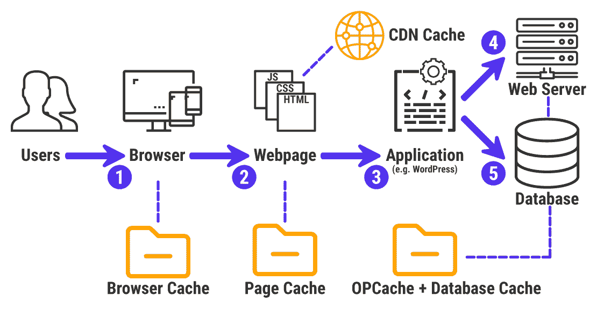

How web caching works.

缓存获取由应用程序处理的数据，并将其存储以备后用。它不一定要在浏览器*本身*中，但是你会发现网站和[它们的底层技术大量使用缓存](https://kinsta.com/blog/wordpress-cache/)。“缓存”一词指的是存储和重新调用保存的数据的过程。

缓存通常包括两个要素:

*   缓存软件本身运行这个过程，并在各种其他元素之间穿梭。
*   随机存取存储器(RAM)和“内存中”引擎。它们存储通过缓存技术传递的数据。

这些要素必须是高质量和协作的。运行缓慢的 RAM 无法足够快地调用数据，因此软件无法有效地使用这些数据。

<link rel="stylesheet" href="https://kinsta.com/wp-content/themes/kinsta/dist/components/ctas/cta-mini.css?ver=2e932b8aba3918bfb818">

> 需要在这里大声喊出来。Kinsta 太神奇了，我用它做我的个人网站。支持是迅速和杰出的，他们的服务器是 WordPress 最快的。
> 
> <footer class="wp-block-kinsta-client-quote__footer">
> 
> 
> 
> <cite class="wp-block-kinsta-client-quote__cite">Phillip Stemann</cite></footer>

[View plans](https://kinsta.com/plans/)

考虑到页面文件的大小，缓存对于大多数 web 应用程序来说几乎是必需的。在某些情况下，可靠的实现可以为您节省宝贵的时间。一个评论网站加载速度快的用户间接称赞了网站服务器核心的缓存软件。

接下来我们将对此进行更详细的讨论。

[在网络上获取信息需要处理能力和时间😅幸运的是，使用缓存减少了这种情况，可以帮助您的站点运行得更快💪在这里了解更多⬇️ 点击推文](https://twitter.com/intent/tweet?url=https%3A%2F%2Fkinsta.com%2Fblog%2Fwhat-is-cache%2F&via=kinsta&text=Getting+information+around+the+web+takes+processing+power+and+time+%F0%9F%98%85+Luckily%2C+using+caching+cuts+down+on+this+and+can+help+your+site+run+faster+%F0%9F%92%AA+Learn+more+here+%E2%AC%87%EF%B8%8F&hashtags=WordPress%2CCaching)
<kinsta-advanced-cta language="en_US" type-int-post="97060" type-int-position="0"></kinsta-advanced-cta>

## 缓存如何帮助您优化网站

计算机技术在不断发展。换句话说，内存、硬盘空间和其他此类计算机处理元素的大小正在快速增长。我们的个人电脑使用 64 KB 内存的日子已经一去不复返了；现在，在 tap 上看到千兆字节(GB)的 RAM 是很典型的。一些更新的苹果 MacBooks 甚至可以安装 64 GB 的内存。

由于现代网络开发和相关技术对现场代码的需求，网站也变得越来越重要。它不仅要求最终用户具有更高的处理能力，还需要更强大的服务器和技术来适应。如果没有内存(和缓存)，加载速度会慢如蜗牛。

因此，搜索引擎优化(SEO)早就认识到页面速度是网站排名的首要因素。虽然确切的细节还不清楚，但是搜索引擎结果页(SERPs)中网站排名的因素包括参考[网站速度](https://kinsta.com/learn/speed-up-wordpress/)。

It’s just as well that Kinsta’s home page file size is lean and mean.

虽然排名指标不会像你想象的那样使用网站速度作为直接衡量标准——有太多的因素在起作用，以至于它本身不能作为一个可靠的指标——但许多其他方面都会考虑到它。例如，你网站的 HTML 代码质量和谷歌浏览器的加载时间也会产生影响。

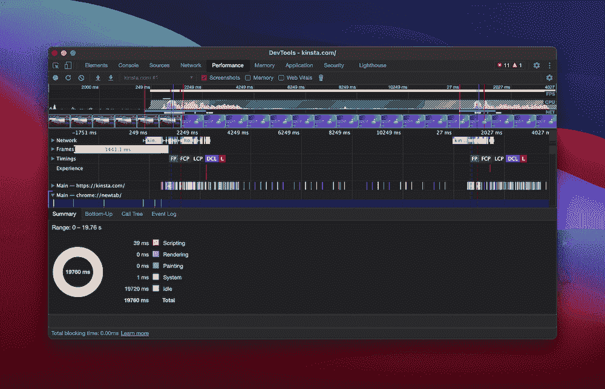

Kinsta’s recorded page loading speed from within Brave’s DevTools.

关于用户体验(UX)，一个长期的标准是用户会在仅仅等待[两秒钟](https://kinsta.com/blog/ttfb/)后就放弃一个页面。这带来了几个问题:

*   你的谷歌排名优化——包括[跳出率](https://kinsta.com/blog/how-to-reduce-bounce-rate/)——需要准确无误；否则，你的搜索引擎优化的努力是死在水中。
*   更快的网站加载速度将有助于控制你的跳出率。
*   网站的 UX 是网站最重要的元素之一。

缓存可以通过减少页面加载时间在所有这些方面提供帮助。更重要的是，你的网站所使用的资源会更少，从而产生更大的影响。

总的来说，一个能够快速加载最相关和最新信息的网站会比其他网站表现得更好。

接下来，我们将看看缓存可能遇到的一些问题。

### 缓存有时会导致问题

当然，缓存并不总是花里胡哨的。主要关心的是实现一个工作得太好的缓存。对于许多小型站点(或者至少是非企业或网络)来说，大规模的频繁缓存周期是不必要的。它可以看到你的服务器浪费资源缓存页面没有改变。

另一方面，缓存不足(或缓存方式不当)的策略和实现可能会让您看到一个过时的页面。这个问题有时会发生在 WordPress 网站上。但是，有[个小窍门和小技巧](https://kinsta.com/blog/wordpress-changes-not-showing/)可以克服。

当然，提供旧的缓存版本的页面会导致问题。考虑一个需要定期更新信息的疫情资源网站。现在考虑浏览器缓存不足或不存在会如何影响页面。

好消息是，设置缓存来减轻这些缺点的影响是很简单的。我们稍后会讨论这个问题。
<kinsta-advanced-cta language="en_US" type-int-post="97060" type-int-position="1"></kinsta-advanced-cta>

## 使用缓存的网站技术

我们已经注意到了高速缓存是如何以几种不同的方式贯穿整个计算的。然而，在本文中，我们关注的是[非 CPU 缓存](https://www.pcmag.com/encyclopedia/term/cache)。如果你回头看看苹果 MacBook 的规格，你会注意到处理芯片中通常有几兆字节(MB)的缓存:

Apple MacBook specs, showing a built-in cache.

这种缓存也适用于移动设备。

但是我们正在考虑使用一定容量的服务器进行缓存。这里是我们正在谈论的一些不同的技术:

*   **浏览器。谈到技术，你首先会想到的是**T2 浏览器缓存。它将常规请求存储在缓存中，以便在下一次调用时更快地加载。
*   **设备。**虽然 CPU 本身超出了本文的范围，但设备上的浏览器和应用程序通常会使用存储和 RAM 来缓存数据。
*   **应用。**是的，这些应用程序还可以有一个缓存来存储常用数据。同样，这将使用非 CPU 的设备上存储来缓存数据。
*   **服务器。**缓存的另一个日常用途。一些来回传送的服务器数据可以被存储和调用，以便更快地执行和处理。这方面的一个例子是 [Redis 缓存](https://kinsta.com/help/redis-cache/)。
*   **域名服务器(DNS)缓存。**专注于缓存的应用。这里涉及的机器除了缓存数据之外什么也不做，所以当 [DNS 缓存](https://kinsta.com/knowledgebase/flush-dns/)确保平稳运行时，前端服务器可以传送数据。

在我们继续之前，有必要指出一些与缓存相关的技术。例如，您可能认为存储 cookies 类似于缓存网页。在很多方面，这是真的。例如，cookies 在被浏览器触发后存储在您的计算机上。这里的区别在于, [cookies 存储了关于你](https://kinsta.com/blog/wordpress-cookies-php-sessions/)和你的使用的信息，而不是页面状态。

一个[内容交付网络(CDN)](https://kinsta.com/blog/wordpress-cdn/) 代表着更加模糊的水域，因为它做的事情与纸上缓存一样。CDN 将整个网站存储为一组静态文件，而不是直接与网站一起工作。因此，虽然它表面上有缓存的标志，但它是一种不同的存储和交付网站的方式，这些网站仍然需要缓存才能快速运行。

像 Cloudflare 这样的 cdn 可以兼顾这两个方面(甚至更多)，这就是为什么 [Kinsta 选择了它们](https://kinsta.com/cloudflare-integration/)来使我们的客户端站点更快、更安全。
T3】

## WordPress 如何处理缓存

尽管我们热爱 WordPress，但它并不是最快的平台。如果你在你的网站上使用 WordPress，你需要[使用缓存](https://kinsta.com/blog/wordpress-clear-cache/#whats-caching)来帮助提供快速的体验。你的站点速度是你、你的主机和你选择的缓存插件共同努力的结果。

如果你是 Kinsta 的客户，你不需要任何类型的缓存插件。我们在软件和服务器级别自动提供四种不同类型的缓存:

*   [对象缓存](https://kinsta.com/blog/wordpress-cache/#object-cache)。
*   [页面缓存](https://kinsta.com/blog/wordpress-cache/#page-cache)。
*   [字节码缓存](https://kinsta.com/blog/wordpress-cache/#bytecode-cache)。
*   [CDN 缓存](https://kinsta.com/blog/wordpress-cache/#cdn-cache)。

我们将覆盖您的所有基地，并确保您的网站是优化的速度。然而，对于其他主机的用户来说，一个专用的 WordPress 缓存插件可能是一个很好的补充。

WordPress 缓存插件领域有很多解决方案，必须做出选择可能会让人不知所措。让我们来看看一些我们最喜欢的选项。

### 重要的

我们已经实现了不同类型的服务器级缓存，这比任何一个 PHP 插件都要好。因此，这里列出的一些插件与 Kinsta 主机不兼容。查看 [本节](https://kinsta.com/knowledgebase/banned-plugins/#caching-plugins) 了解更多信息和 [本完整列表](https://kinsta.com/knowledgebase/banned-plugins/#complete-list-plugins) 。

### WP 超级缓存

最直接的选择就是选择 Automattic 的 [WP 超级缓存](https://wordpress.org/plugins/wp-super-cache/):

The WP Super Cache plugin.

它被认为是“官方的”WordPress 缓存插件。它提供静态的 HTML 文件来代替动态的 PHP 文件(这是几乎所有访问者都会看到的，而且不会损失任何功能)。

更重要的是，该插件包括“预加载”、“垃圾收集”(删除不再需要的缓存项)、CDN 和面向开发人员的 REST API 端点。这是缓存插件的一个坚实的切入点，可能是你所需要的一切。

### W3 总缓存

[W3 Total Cache](https://wordpress.org/plugins/w3-total-cache/) 在许多用户的安装列表上已经存在很长时间了:

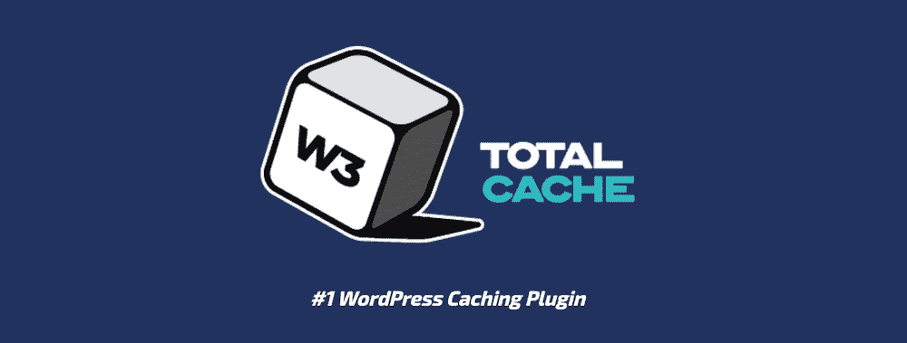

The W3 Total Cache plugin.

它被宣传为“web 性能优化(WPO)”框架，并声称对 Web 主机的选择是不可知的。它包含了许多特性和功能，但它因对新用户的吸引力而臭名昭著。W3 Total Cache 有很多特性，但是你需要时间来优化使用它。

也有一些简单的缓存插件，在一些用户看来，它们比领先的竞争者表现得更好。比如 [WP 最快缓存](https://wordpress.org/plugins/wp-fastest-cache/)和 [LiteSpeed 缓存](https://wordpress.org/plugins/litespeed-cache/)都是好评如潮，仪表盘简单。

### WP 火箭

说到高级插件，WP 火箭独占鳌头:

The WP Rocket plugin.

这是一个高性能的插件，也很容易使用。它应用了一系列最佳实践，拥有超过 150 万用户。WP Rocket[也兼容](https://kinsta.com/blog/wp-rocket/)大多数 WordPress 产品和服务，包括 Kinsta。

 ## 注册订阅时事通讯

### 想知道我们是怎么让流量增长超过 1000%的吗？

加入 20，000 多名获得我们每周时事通讯和内部消息的人的行列吧！

[Subscribe Now](#newsletter)

## 如何安装缓存插件

至于安装缓存插件，过程很简单，和其他任何 WordPress 插件一样。缓存将在激活时启用，通常会有一个专门的面板来处理插件如何缓存您的站点。例如，您可以在**设置> WP 超级缓存**面板中找到 WP 超级缓存的选项:

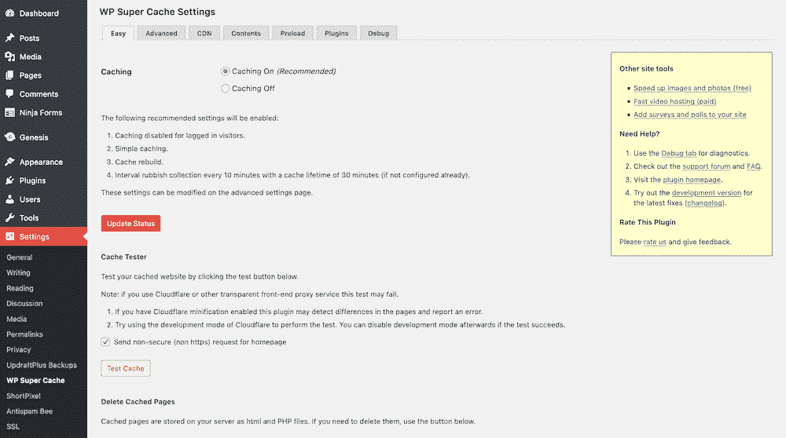

WP Super Cache’s settings.

您的特定插件将根据其复杂性和目标有不同的设置。WP 超级缓存这样的解决方案是骗人的。表面上看起来很简单，但是正如高级部分所显示的，有很多地方需要修改:

The WP Super Cache Advanced settings.

我们的建议是，如果你不确定一个特定的设置能做什么，就坚持简单的选项。大多数缓存插件都有针对不同缓存设置的快速设置选项。比如 WP 超级缓存使用**简单**或者**专家**缓存:

WP Super Cache’s delivery methods.

主要区别在于**专家**模式使用 [Apache 的](https://kinsta.com/knowledgebase/what-is-apache/) mod_rewrite 选项来提供缓存文件。不过，对于一个不知道文件如何被缓存的内部工作原理的用户来说，**简单的**交付方法是可以接受的。

## 如何清除您的缓存

一个更常见的需求是知道如何清除你的缓存。正如您所料，根据您的设备或浏览器，有几种方法可以做到这一点。我们将带您了解各种方法，从您的桌面浏览器开始。

### 清除浏览器的缓存

到目前为止，最终用户与缓存最常见的关系是在浏览器中。如果出现问题，清除浏览器缓存是一种可靠的方法，可以让一切恢复正常。因此，这是一种经常出现的方法，就像关闭和重新打开一样。

每个浏览器都有一个专用的首选项屏幕，让您可以不同程度地访问缓存。例如，你可以在**偏好设置**窗格的**隐私>隐私**标签下找到 [Safari 的缓存](https://www.apple.com/safari/):

Safari’s Privacy tab.

相比之下， [Firefox](https://www.mozilla.org/en-US/firefox/new/) 在其**首选项**的**隐私&安全**部分拥有一套全面的功能，这与其作为一个注重隐私的浏览器的定位相符:

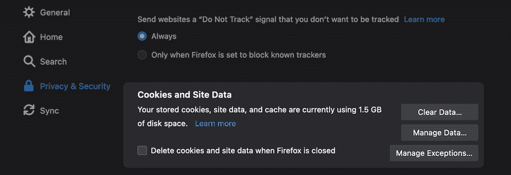

Firefox’ Privacy & Security preferences.

对于大多数基于 Chromium 的浏览器来说，比如 T2 谷歌 Chrome、T4 勇者和其他浏览器，缓存都在同一个地方。以 Brave 为例，它在**首选项**的**附加设置**中，在**隐私和安全**部分下:

Brave’s Privacy and security section.

相比之下，Chrome 将选项放在设置的前面和中间:

Google Chrome’s Privacy and security settings.

说到[微软 Edge](https://kinsta.com/blog/most-secure-browser/#4-edge) ，缓存在**设置**的**隐私、搜索和服务**部分，在**清除浏览数据**下:

厌倦了低于 1 级的 WordPress 托管支持而没有答案？试试我们世界一流的支持团队！[查看我们的计划](https://kinsta.com/plans/?in-article-cta)

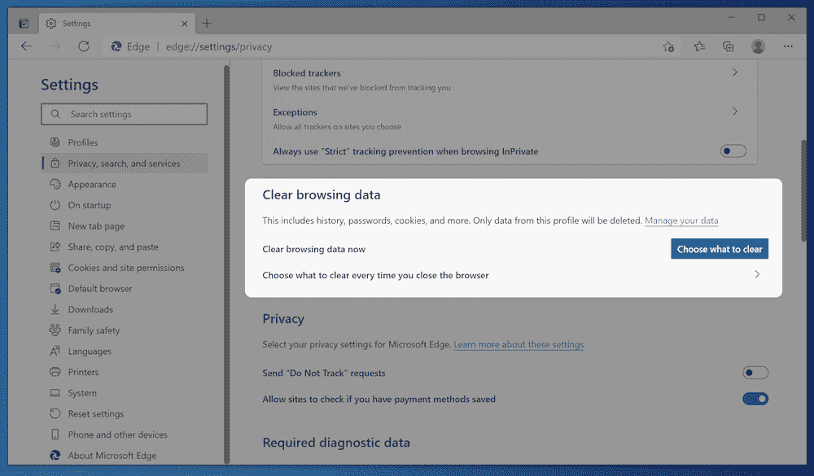

Microsoft Edge caching options.

好消息是，清除缓存通常只需点击一次，然后等待浏览器完成它的工作。大多数浏览器会让您选择想要从缓存中清除的数据，因此，如果您有特定的需求，这当然会增加您的“点击次数”。

### 清除设备缓存

你的智能手机和电脑也有一个缓存，因为它们也需要存储数据，以便随时调用。正如您所料，每个操作系统和平台都有不同的处理方式。例如，在 Mac 上的[，你将前往 macOS 中的**~/库/缓存/** 位置:](https://www.switchingtomac.com/tutorials/how-to-clear-cache-on-a-mac/)

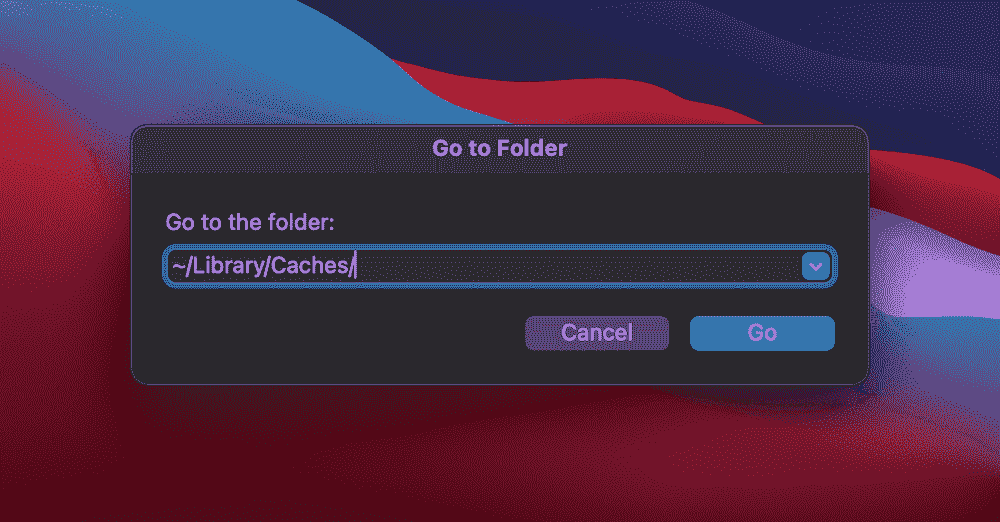

The Finder’s Go window showing the location of the Mac cache.

在这里，您会注意到缓存是一个文件集合，您可以将它拖到垃圾箱中:

The macOS Caches folder.

至于 Windows 10，在整个操作系统中有几个不同的缓存。我们有点操之过急，但是要清除 DNS 缓存，您需要以管理员身份运行命令提示符:

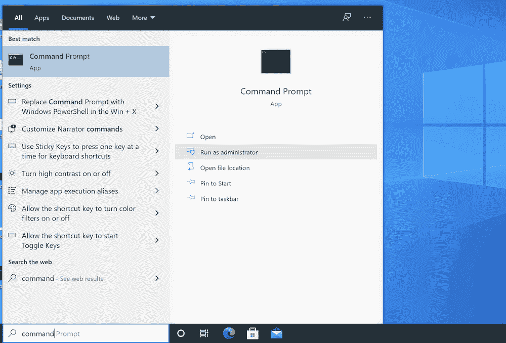

The Windows Command Prompt.

从这里进入`ipconfig/flushDNS`。一旦运行它，Windows 将刷新 DNS 缓存:

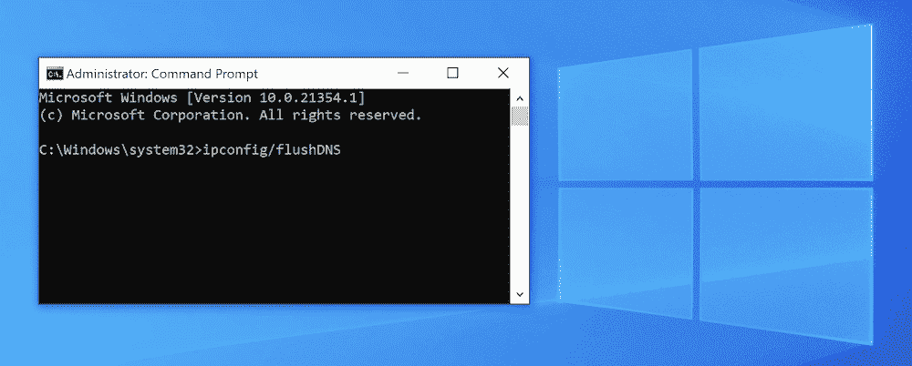

Flushing the cache in Windows.

您还会发现 Linux 发行版使用终端和命令行来[清除系统缓存](https://linuxconfig.org/clear-cache-on-linux):

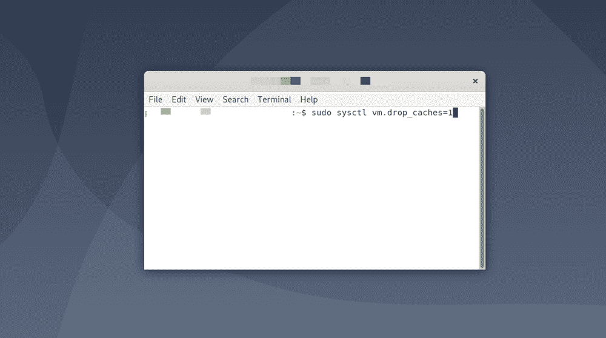

Flushing the cache in Debian.

移动设备通常不像台式机那样需要清理中央缓存。因此，你必须一点一点地完成这项工作。苹果 iOS 是这里最“分散”的设备，尽管[安卓做得更好](https://techviral.net/clear-android-cache/)。

### 清除 DNS 缓存

我们已经谈到了服务器和 DNS 缓存，特别是关于清除 Windows 10 DNS 缓存，但我们没有谈到为其他平台清除它。

对于不知道，DNS 缓存存储所有最近尝试连接到互联网，特别是其域名。换句话说，它是计算机用来确定如何连接到互联网的 DNS 查找列表。

它不同于设备上的其他缓存，但可能会有一些交叉。在开始清除 DNS 缓存之前，您应该做好三件事情:

*   对您的计算机或设备的管理员访问权限。
*   访问终端、命令提示符或命令行。
*   [使用命令行界面(CLI)的必要技能](https://kinsta.com/blog/how-to-use-ssh/)，尽管您不一定需要知道要使用的确切命令。

当然，说到最后一点，我们是来帮忙的。我们已经在 Kinsta 博客的其他地方[介绍了基于每个设备清除 DNS 缓存](https://kinsta.com/knowledgebase/flush-dns/#how-to-flush-your-dns-cache-on-mac-windows-linux-and-chrome)。我们建议您查看那篇文章，了解有趣的细节。

### 清除 WordPress 缓存

说到 WordPress，有几个地方你可以去清理缓存。平台本身没有缓存。相反，有两个接触点需要考虑:

*   你的主机提供商的选项，有时可以在 WordPress 中找到。
*   你的专用缓存插件。

根据你对主机的选择，你可以在你的控制面板中选择，或者在 WordPress 中安装的插件中选择(专用于你的主机的服务器端缓存)，或者两者都有。我们将进一步详细讨论这一点。

此外，你通常会有一个专门的第三方插件来帮助缓存你的网站，你会在相关的设置或首选项屏幕中找到清除它的选项。

你如何访问这个将取决于你的插件(接下来我们将介绍一些选项)。例如，WP 超级缓存在工具栏和**设置> WP 超级缓存**页面上都显示选项:

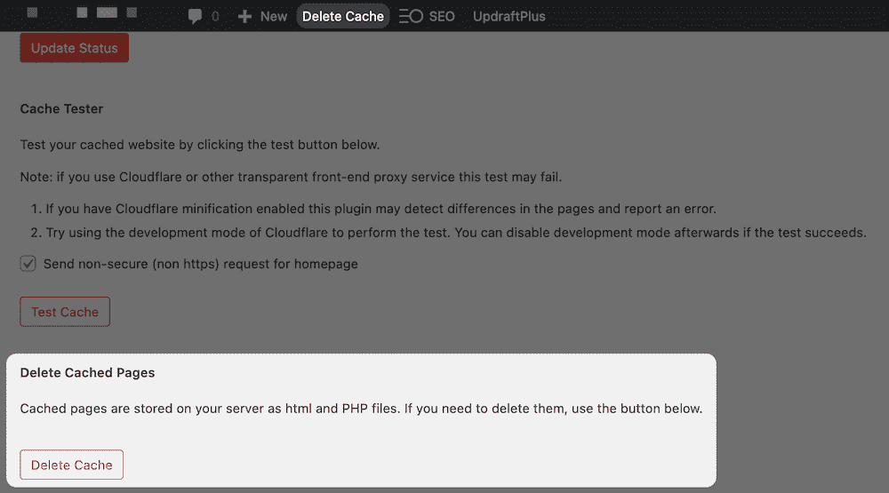

The Delete Cache button in WordPress, using WP Super Cache.

对于 W3 总缓存，你可以在 WordPress 顶部的工具栏中找到你需要的选项:

The options to purge the cache in W3 Total Cache.

对于大多数插件来说，清除缓存的选项在工具栏中(或者被标记)。至于你的主机，你通常会在两个地方找到清除缓存的选项:WordPress 仪表盘(如果有插件的话)和你的主机控制面板。

一些主机通过插件给 WordPress 管理员添加特定的选项来帮助 WordPress 用户。在大多数情况下，这些插件的行为类似于第三方缓存插件。不过，最好的方法(换句话说，你知道会起作用的方法)是打开你的主机控制面板，寻找你的缓存选项。

例如，在 [MyKinsta](https://my.kinsta.com/login) 中，你可以从**站点**屏幕导航到你的站点，然后前往**工具**标签。在这里，您将看到**站点缓存**选项:

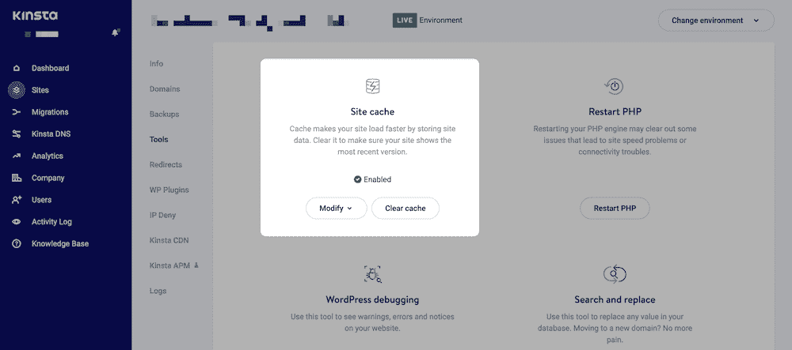

Kinsta’s Site cache option.

单击选项将清除服务器端的缓存，让您无所事事。你现在可以自由地回去运行你的网站，而我们可以继续为它服务。

[是时候回到最基本的问题了:什么是缓存，你如何管理你的缓存？🤷‍♀️在此了解更多⬇️ 点击推文](https://twitter.com/intent/tweet?url=https%3A%2F%2Fkinsta.com%2Fblog%2Fwhat-is-cache%2F&via=kinsta&text=It%27s+time+to+go+back+to+the+basics%3A+what+is+cache%2C+and+how+can+you+manage+yours%3F+%F0%9F%A4%B7%E2%80%8D%E2%99%80%EF%B8%8F+Learn+more+here+%E2%AC%87%EF%B8%8F&hashtags=WordPress%2CCaching)

## 摘要

网站需要快速运行。最有效的方法是通过缓存。这是一种存储经常在服务器之间拉取和推送的数据的方式。一旦保存，浏览器可以在一瞬间调用它，使你的网站加载速度更快，并保持你在搜索引擎优化的权利。

一个可靠的主机将会有服务器端的缓存，并尽一切可能确保你的站点最大限度地利用它。更重要的是，一个好的插件会让你的网站运行得更快，并确保缓存对你网站的各个方面都有帮助。

Kinsta 客户可以享受我们内置的[边缘缓存](https://kinsta.com/feature-updates/edge-caching/)功能。作为我们 Cloudflare 集成的一部分，Edge Caching 会将您的 Kinsta 站点/页面缓存保存到 Cloudflare 全球网络的任何一个 **275+** 数据中心。

边缘缓存免费包含在所有 Kinsta 计划中，不需要单独的插件，并且平均减少了超过 50%的时间！

对于最终用户来说，缓存是一项简单的技术。对于那些深入挖掘的人来说，这是值得花大量时间去做的事情，因为你的表现依赖于此。

*您是否利用缓存，如果是，您的首选“堆栈”是什么？请在下面的评论区和我们分享你的想法和观点！*

* * *

让你所有的[应用程序](https://kinsta.com/application-hosting/)、[数据库](https://kinsta.com/database-hosting/)和 [WordPress 网站](https://kinsta.com/wordpress-hosting/)在线并在一个屋檐下。我们功能丰富的高性能云平台包括:

*   在 MyKinsta 仪表盘中轻松设置和管理
*   24/7 专家支持
*   最好的谷歌云平台硬件和网络，由 Kubernetes 提供最大的可扩展性
*   面向速度和安全性的企业级 Cloudflare 集成
*   全球受众覆盖全球多达 35 个数据中心和 275 多个 pop

在第一个月使用托管的[应用程序或托管](https://kinsta.com/application-hosting/)的[数据库，您可以享受 20 美元的优惠，亲自测试一下。探索我们的](https://kinsta.com/database-hosting/)[计划](https://kinsta.com/plans/)或[与销售人员交谈](https://kinsta.com/contact-us/)以找到最适合您的方式。</kinsta-auto-toc>