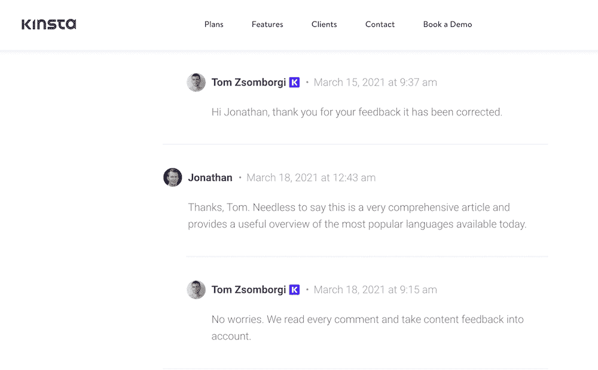
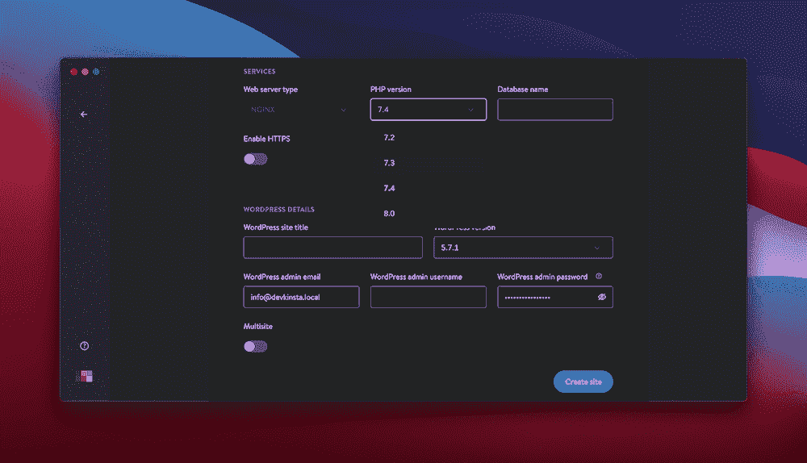
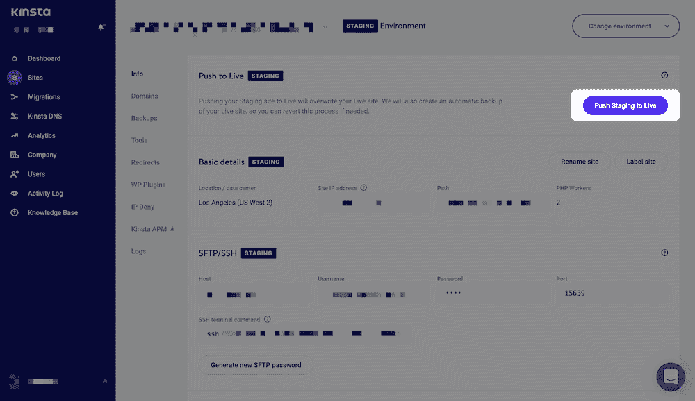
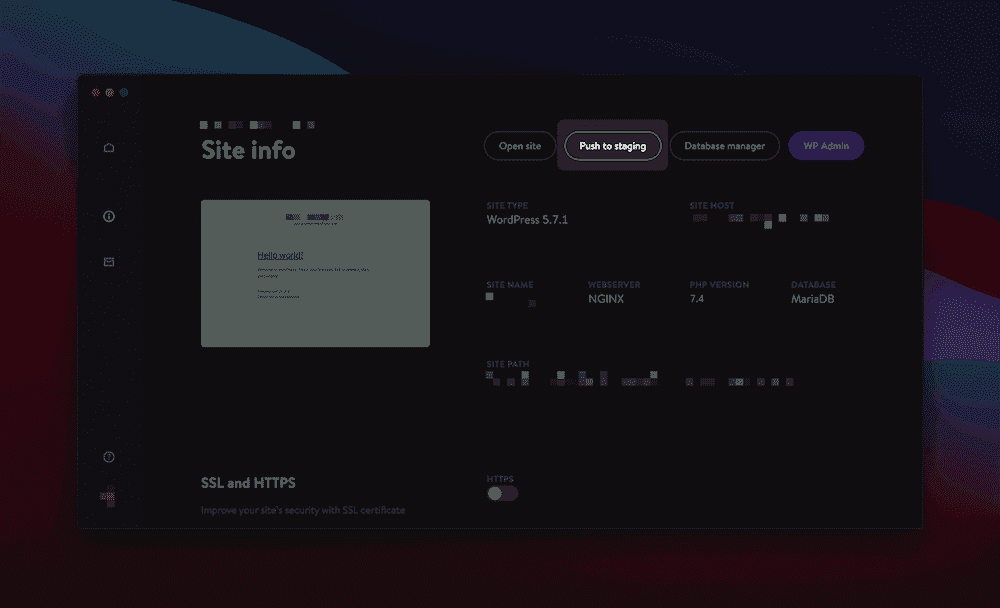
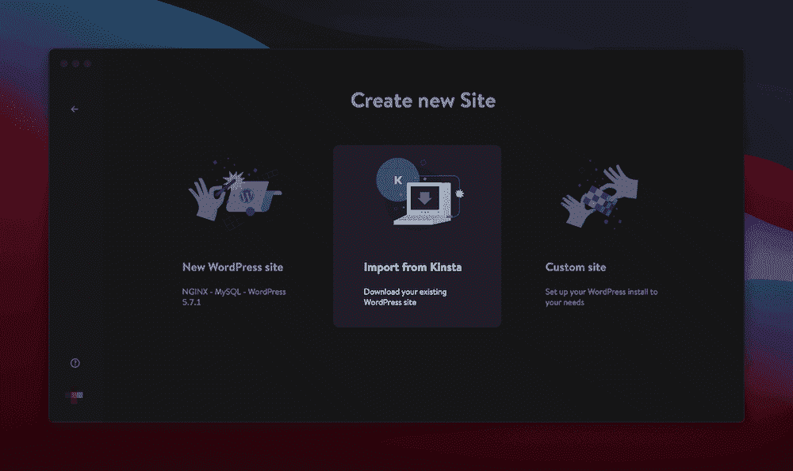
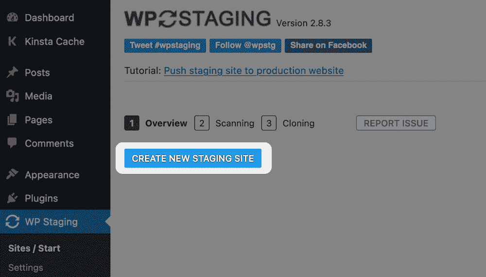
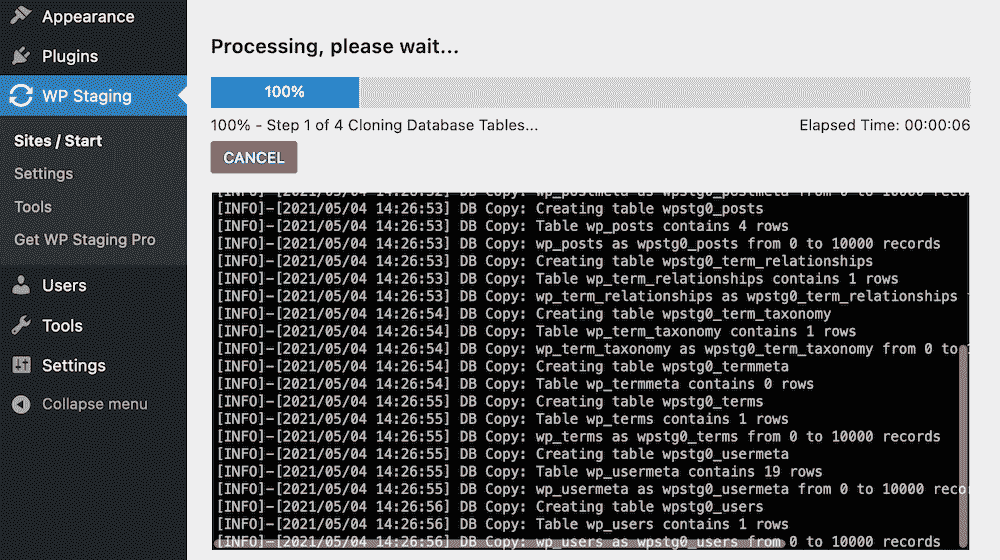
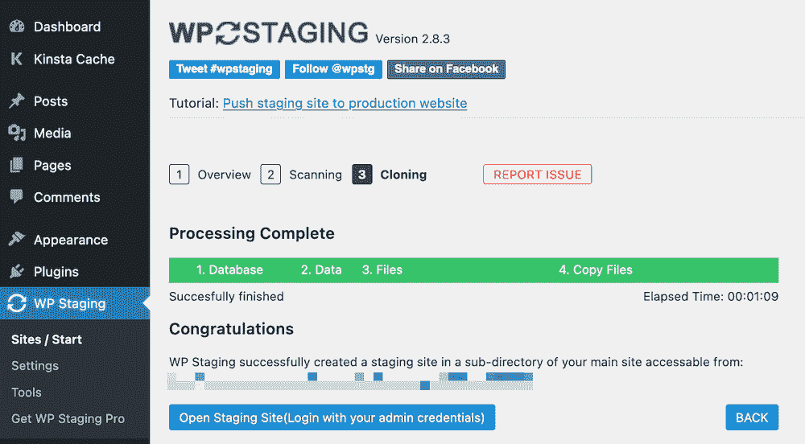
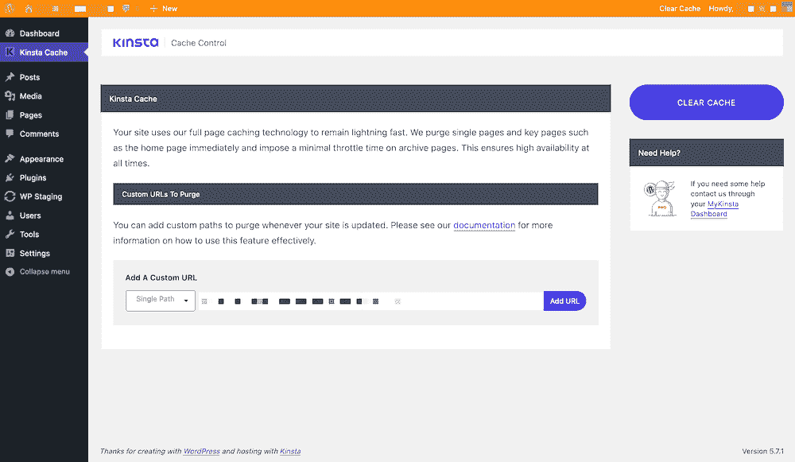

# 快速建立 WordPress 临时站点的 3 个简单方法

> 原文:[https://kinsta.com/blog/wordpress-staging-site/](https://kinsta.com/blog/wordpress-staging-site/)

尽管 YouTube 看起来很简单，但网络开发从头到尾都充满挑战。为了最大限度地减少您的实时网站上的问题，提前测试任何更改是一个好主意。建立一个 WordPress 暂存站点是一个很好的方法。

临时站点允许您将普通的和潜在的破坏站点的任务转移到站点的副本中。实时网站将保持在线，不会出错。与此同时，你可以做任何你需要做的事情，当你准备好了的时候，就把这些变化发布出去。

这篇文章将探索 [WordPress staging](https://kinsta.com/wordpress-staging/) 和一些简单的方法来设置它。

激动吗？开始吧！

 ### 查看我们的[视频指南](https://www.youtube.com/watch?v=e0ASELoC2II)来建立一个 WordPress 临时站点

## 什么是 WordPress 暂存站点？

临时站点是对公众不可见的真实站点的精确副本。它很像一个聚会或活动的集结地——它给你一种方法，让你在一个低压力的环境中按照自己的意愿建立你的网站。从那里，你可以把这些元素移植到现场，通常只需点击几下鼠标。

> Kinsta 把我宠坏了，所以我现在要求每个供应商都提供这样的服务。我们还试图通过我们的 SaaS 工具支持达到这一水平。
> 
> <footer class="wp-block-kinsta-client-quote__footer">
> 
> 
> 
> <cite class="wp-block-kinsta-client-quote__cite">Suganthan Mohanadasan from @Suganthanmn</cite></footer>

[View plans](https://kinsta.com/plans/)

在一个网站上，当你有合适的工具时，移植过程是简单的。许多虚拟主机给了你一个简单的方法来准备你的站点并再次把改变推回来。

您可能已经使用了本地开发环境，并且有一些相似之处。首先，它们都是你的实时网站的副本。然而，从那以后，他们就分道扬镳了。通常情况下，中转站点在拉取和推送内容方面更加灵活。它还可以让您处理需要实时服务器的交互式站点元素。

接下来我们将更多地讨论这些元素。

[在你的网站上线之前，如果没有对所做的改动进行测试，那将会导致灾难😬在本指南中了解如何避免最后一刻的错误👇 点击推文](https://twitter.com/intent/tweet?url=https%3A%2F%2Fkinsta.com%2Fblog%2Fwordpress-staging-site%2F&via=kinsta&text=Failing+to+test+changes+on+your+site+before+pushing+it+live+is+a+recipe+for+disaster+%F0%9F%98%AC+Learn+how+to+avoid+last-minute+errors+in+this+guide+%F0%9F%91%87&hashtags=WordPress%2CWebDev)

## 为什么要建立一个 WordPress 暂存站点？

即使您使用本地开发环境，我们也建议您使用一个临时站点。这样做有很多原因。首先，我们已经解释了如何在不影响网站的情况下处理特定的网站元素。

staging 的一个重要问题和要点是在不接触其他动态内容的情况下带来站点的特定元素。

例如，考虑[站点评论](https://kinsta.com/blog/wordpress-spam-comments/)。

A website’s comments section.

注释代表基于时间的动态内容，您不希望这些内容“冻结”如果你这么做了，从你发布到推送的这段时间里，你的直播网站上的活动就会消失。

此外，您的中间站点可以作为服务器配置的测试平台。一个优秀的[本地开发环境](https://kinsta.com/blog/install-wordpress-locally/)通常可以模拟一个服务器设置。

DevKinsta’s server settings.

然而，没有什么可以替代实时服务器本身。一个临时站点可以向你展示你的站点是如何反应的，并且在它影响到你的访问者之前，如果你需要的话，给你一个改变的机会。

这与使用 WordPress 暂存站点的其他一些相关的好理由联系在一起:

*   你可以在远离公众的地方测试新功能。这个功能对你的流量数据、[、跳出率](https://kinsta.com/blog/how-to-reduce-bounce-rate/)和一般分析至关重要。在更基本的层面上，你可以更新 WordPress 的核心、主题和插件，同时修复任何出现的问题。
*   使用暂存环境时，您的实时站点不会停机。同样，保持高正常运行时间不仅对您的服务器有好处，对您的指标也有好处。

所有这些好处的连锁效应是，总体上你将使用更少的潜在资源。这也有助于让您的开发人员满意！接下来我们会更多地讨论一个集结地是如何帮助营造气氛的。

### 使用临时站点进行开发的重要性

首先，我们要给你一些建议。如果你是一个网站所有者，想要在没有专业人士帮助的情况下工作，我们会要求你重新考虑。至少，考虑一下让第三方参与到你的网站的外观和运行中来。

与开发人员合作会在几个方面帮助你。一个很大的原因是因为你可以使用他们经过试验和测试的方法，毫不费力地从你的大脑中获取一个网站。

开发人员通常会有一些他们过程中的关键点，其中一些您可能没有考虑到:

*   通常会有一个[繁重的计划阶段](https://kinsta.com/blog/portfolio-website/)，而不是简单地在现场即兴发挥。
*   软件堆栈至关重要，因为它决定了您可以访问的功能。它会影响到您站点的性能和可伸缩性。
*   将会有一个修改和修复错误的阶段，这可能会很乏味，但对保持你的网站的高质量是至关重要的。

中转站点是流程中每个步骤的重要组成部分。第一个方面是让你的网站进入运行阶段，进行一些“压力测试”知道这一点会给你迎接未来挑战的空间。

此外，开发人员可以将方面移植到其他软件选择中。例如，你可以用普通的 [JavaScript](https://kinsta.com/blog/php-vs-javascript/) 替换 [jQuery](https://kinsta.com/blog/javascript-libraries/#jquery) ，或者你可以测试[切换到反应](https://kinsta.com/blog/javascript-libraries/#reactjs)。Staging 为开发人员提供了一种在真实环境中测试可能性的方法。

Bug 修复和布局优化也是临时站点的重要用途。开发人员可以将网站的版本推给你，并修复任何明显的问题，而你可以对可能被忽视的方面进行评论。

本地开发环境在不使用任何服务器资源的情况下深入研究站点的具体细节。临时站点是本地站点和实时站点之间的关键点。它也给你在别处得不到的洞察力。

### 何时使用临时站点

鉴于我们到目前为止所说的，在开发你的站点时，staging 是你大部分时间想要使用的东西就不足为奇了。将你的实时网站升级应该成为一种习惯，这样你就永远不会改变你的实时网站。

即便如此，在一些特定的情况下，你会想要利用一个[WordPress staging environment](https://kinsta.com/help/staging-environment/):

*   简单的更新，如[主题](https://kinsta.com/blog/how-to-update-wordpress-theme/)、插件和 [WordPress 的核心](https://kinsta.com/blog/wordpress-version/)，如果出现任何破坏网站的问题，应该首先在试运行阶段进行。
*   插件和主题的安装应该在试运行阶段完成，这样你就可以测试功能和特性而不会影响到实时用户。更重要的是，它给了你时间和空间，让你在将改变公之于众之前摆弄细节。
*   如果您有重大的基于代码的更改，它们应该总是首先应用到临时站点。正如我们所提到的，一个临时站点在你的实时站点和本地环境之间扮演着“中间人”的角色，为你和你的活跃访问者消除困惑和压力。

值得指出的是，你可以直接在你的站点上更新主题、插件和 WordPress 本身。但是，我们不推荐。如果你打算更新已知的“古怪的”插件或者安装一个主要的 WordPress 版本，升级你的站点也是加倍重要的。

注意并小心维护你网站的稳定性是最重要的。总的来说，在你的工作可能会影响或迷惑用户的任何时候，你都要准备好你的网站。

### 使用临时站点时需要考虑什么

在大多数情况下，决定使用 WordPress 暂存站点并不是一个冲动的决定，不管你的主机上是否有直接可用的暂存选项。

如果你问自己很多关于你计划如何使用你的中转站点的问题，这将会有所帮助。以下是几个例子:

*   您能在临时站点上使用实时站点的所有功能吗？
*   你能在保持其他方面不变(例如网站评论)的同时，将特定的元素推向市场吗？
*   您能否将这些特定的元素带到您的本地环境中，并在远离您的服务器的地方工作？

这些是每个网站所有者应该问自己的普遍问题。这可能是你有一些与你的设置相关的问题。当然，你应该优先考虑找到这些问题的答案。WordPress 博客作者克里斯·马乐有一篇关于如何决定适合你的方法的很棒的文章和教程。

你可能也有关于使用中转网站的特殊问题。例如:

*   电子商务网站:你能在你的中转网站上使用[的整个结账流程](https://kinsta.com/blog/woocommerce-checkout/)吗？这个因素对于决定用户如何浏览你的网站至关重要。
*   **插件和主题:**Jetpack 等插件[在分期网站上是如何工作的？顺便说一句，特别是 Jetpack，在本地环境中功能有限，因为它需要服务器访问。](https://kinsta.com/knowledgebase/wordpress-jetpack/)
*   **视频和流媒体:**您在您的暂存站点上获得了完整的功能吗？您如何确定您在暂存站点上看到的视频是否代表您的直播站点？

正如我们所提到的，这些问题将针对您的环境、站点和需求。因此，这是与开发人员合作的另一个好理由，至少在计划阶段是这样。他们可以把他们的经验带到你的项目中，在知道你需要答案之前问一些这样的问题。

## 如何建立一个 WordPress 暂存站点(3 种方式)

在接下来的章节中，我们将使用一些不同的方法来设置一个 WordPress 暂存站点。我们从最容易到最难排序，但是定义很松散。

你可能比其他人更倾向于某个特定的解决方案。随意跳来跳去，看看你喜欢的方法。

### 1.使用您的 Web 主机建立一个临时站点

我们的第一个方法是不是所有的网站主机都会提供。专用的暂存功能通常是高质量 WordPress 主机的领域，因为他们知道暂存站点的价值。例如， [Kinsta 提供了多个高级暂存环境](https://kinsta.com/help/premium-staging-environments/)，可以添加到每个帐户上。事实上，Kinsta 有 42，070 个正在使用的中转站点！稍后我们将更详细地展示这一点。

如果主机提供内置暂存，通常有两个要素:

*   正如我们所提到的，自动化登台很受欢迎，因为这是登台您的实时站点的最快方式。
*   WordPress 暂存站点将驻留在您的主域的一个子域上。我们将在整篇文章中以不同的方式讨论这一点。

如果你是 Kinsta 的客户，我们已经在知识库中详细讨论了 WordPress staging。参考那篇文章来浏览如何做到这一点的细节。也就是说，有必要概括一下整个过程:

 ## 注册订阅时事通讯

### 想知道我们是怎么让流量增长超过 1000%的吗？

加入 20，000 多名获得我们每周时事通讯和内部消息的人的行列吧！

[Subscribe Now](#newsletter)

1.  从 MyKinsta 的列表中选择您的站点。
2.  将环境从“实时”更改为“暂存”
3.  点击按钮实现你的 WordPress 暂存站点。
4.  等待 15 分钟，让临时站点进行填充。

您的登台环境将拥有自己的子域，并将继承您的[安全套接字层(SSL)](https://kinsta.com/knowledgebase/how-ssl-works/) 设置。

您甚至可以[将站点备份](https://kinsta.com/help/restore-wordpress-backup-staging/)恢复到暂存状态，并从 MyKinsta 仪表板上[推送您的暂存站点 live](https://kinsta.com/help/push-staging-live/) :

The Push to Live option within Kinsta.

我们认为我们的暂存功能[是首屈一指的](https://kinsta.com/knowledgebase/technical-questions/#multisite-staging)。即便如此，DevKinsta 还是给三层蛋糕加上了糖衣，我们接下来会讨论这一点。

#### DevKinsta 如何帮助您创建中转站点

MyKinsta dashboard 拥有创建和管理您的实时网站所需的几乎所有特性和功能。如果您喜欢在本地环境中工作，可以使用 DevKinsta。

[DevKinsta](https://kinsta.com/devkinsta/) 是我们面向所有 web 开发人员和网站所有者的本地开发环境，尽管它为 [Kinsta 客户提供了特定的功能](https://kinsta.com/feature-updates/local-wordpress-development/):

The DevKinsta app.

这是一个全功能(免费)的应用程序，帮助你用最少的点击次数创建新的 WordPress 网站。此外，它的包装盒中有很多东西可以帮助您为真正的服务器做好准备。我们已经在 Kinsta 博客的其他地方讨论过这个问题，但是有一个设置我们想多关注一点——[Push to staging](https://kinsta.com/knowledgebase/devkinsta/push-local-site-to-kinsta-staging/)选项:

DevKinsta’s “Push to staging” button.

此功能允许您选择一个目标站点，并将您的本地站点转移到您的登台环境。这也意味着您可以在整个开发过程中完全融入 Kinsta 生态系统。

该过程的第一步是在 DevKinsta 中从 Kinsta 导入您的站点:

The Import from Kinsta option within DevKinsta.

一旦你的站点托管在 DevKinsta 中，你就可以慢慢地做出你需要的改变。从那里，你可以点击**按钮，然后把它发送回你的主机服务器。当你准备好将你的网站发布到世界上时，MyKinsta 仪表板中的**按钮将完成这项工作。****

### 2.安装一个插件来帮助你创建一个 WordPress 暂存站点

我们提到一些主机不允许你创建一个 WordPress 暂存站点。当然，如果这适用于您，我们建议您更换提供商，但是如果您不能，仍然有方法创建一个临时环境。

考虑到 WordPress 的插件生态系统很强大，分期插件的存在也就不足为奇了。不知道的是，一个升级插件给了你和主机几乎同等的功能，但是是从你的 WordPress 仪表盘上处理的。也就是说，值得注意的是，staging 插件和 Duplicator 等其他站点复制插件[还是有一些区别的。](https://kinsta.com/help/migrate-wordpress-duplicator-plugin/)

需要为你的 WordPress 网站提供超快的、可靠的、完全安全的托管服务吗？Kinsta 提供所有这些，内置的所有计划的免费分期，以及来自 WordPress 专家的 24/7 世界级支持。[查看我们的计划](https://kinsta.com/plans/?in-article-cta)

对于初学者来说，复印机不是用来登台的。这是一个克隆网站的强大插件，但它没有一个分阶段环境所拥有的*伪*版本控制。

我们已经看到网站复制插件被推荐为创建临时网站的理想方式。我们不推荐！使用像 Duplicator 这样的插件是否等同于 DevKinsta 这样的专用本地开发工具是有争议的。

相反，有更强大的解决方案，如 [WP Stagecoach](https://wpstagecoach.com/) 和[WP stage](https://wp-staging.com/):

The WP Staging website.

使用 WP Staging 这样的解决方案有很多好处:

*   你可以快速克隆你的网站。
*   一切都发生在一个熟悉的仪表板上。
*   您可以排除特定的数据库表和文件夹。
*   您可以选择实时推送哪些文件和表格。

使用一个插件的整个过程会感觉很熟悉。关于 WP 升级，你将会以通常的方式在你的站点上安装插件。请注意，有一个功能有限的[免费版](https://wordpress.org/plugins/wp-staging/)和一个功能齐全的[高级版](https://wp-staging.com/#pricing)。

一旦插件出现在你的站点上，你将进入 **WP 暂存>站点/开始**页面，点击**创建新暂存站点**按钮:

Creating a new staging site with WP Staging.

点击此按钮将进入**扫描**部分。除了输入临时站点的名称之外，这里有三个部分需要考虑:

*   **数据库表:**这是所有数据库表的列表，您可以选择想要存放的表。
*   **文件:**你可以选择要复制到这里的文件夹，以及任何你想复制的额外目录。
*   **高级设置/ Pro:** 这里有大量的设置。例如，您可以将暂存站点复制到一个单独的数据库、一个自定义目录，还可以“符号链接”您的生产站点的上载。

单击“继续”后，您将开始克隆和转移过程:

The WP Staging plugin’s cloning procedure.

当插件完成时，您将看到在您的临时站点上工作所需的详细信息:

The WP Staging Completion screen.

当您访问您的临时站点时，工具栏将会是亮橙色的，以防您做出不可思议的事情:

A WP Staging site.

从这里，您可以将您的更改推回到生产中，并从 WordPress 仪表板管理您的临时站点。

### 3.创建一个手动的 WordPress 暂存站点

我们设置 WordPress 暂存站点的最后一个方法是最难的，也不太实用。除了最极端和特殊的使用情况，我们很难推荐它。

创建一个手动的 WordPress 暂存站点就像它听起来的那样:你将构建所有你需要的组件，并且部署你的站点，大部分都不需要自动化。这种方法有一些严重的缺点:

*   手动方法意味着更有可能在您的工作流程中出现错误。
*   没有办法在安装之间同步站点数据。
*   您不能在两次安装之间推送选定的数据、表格或文件。

换句话说，你正在创建一个插件的[手动版本](https://kinsta.com/blog/migrate-wordpress-site/)，比如 Duplicator。即便如此，如果你把这种方法用在你的优势上，你也能看到一些好处。

例如，您可以建立一个临时站点来测试小范围的特性和功能(比如 WordPress 核心更新)。一旦您对它在您的临时站点上的工作感到满意，您就可以将更改应用到您的实时站点。

当然，你在重复你需要做的工作，这是这个过程中的另一个缺点。

尽管如此，您的情况和需求将决定手动暂存站点是否适合您。如果是这样，您将需要以下内容:

*   让你[创建子域](https://kinsta.com/help/add-domain/)的主机提供商。
*   管理员访问您的主机后端。
*   [SQL 语言](https://kinsta.com/knowledgebase/what-is-mysql/)的工作知识(不像其他语言那么重要)。

一旦你做好了这些，确保你已经对你的站点进行了一次完整的备份。创建一个手动的 WordPress 暂存站点充满了危险，如果最坏的情况发生，你会感谢你的备份。

设置手动临时站点需要七个常规步骤:

1.  在你的网站主机的控制面板中创建一个新的子域。
2.  为您的临时站点设置一个专用的[安全文件传输协议(SFTP)帐户](https://kinsta.com/knowledgebase/how-to-use-sftp/)。
3.  上传你的 WordPress 文件到暂存服务器。最好的办法是[安装一个新版 WordPress](https://kinsta.com/knowledgebase/manually-install-wordpress/) ，然后上传你的**主题**、**插件**、**上传**文件夹。
4.  从实时网站导出数据库。
5.  在您的托管控制面板中为您的临时站点创建一个新的数据库。
6.  使用 SQL 管理器(如 Adminer)将数据库导入临时服务器。
7.  更新**wp-config.php**以反映您的集结地。

你如何实现这些方面取决于你和你的主人。尽管涉及到复杂性，每种方法都在初学者的范围之内。也就是说，花在实施上的时间可能不值得浪费。

#### 部署您的手动临时站点

当然，如果你建立了一个手动的 WordPress 暂存站点，你也必须自己部署。托管通常有一个简单的自动化方法，在这种情况下不可用。

如果你是一个精通 PHP 和 SQL 的后端开发人员，你也许能够实现自动部署，尽管我们打赌这不是你的情况。因此，我们建议复制您在临时站点上所做的更改，而不是尝试“部署”它们。

[T2】💡PSA:在发布之前，总是使用一个临时站点来测试你的站点变化。本指南包含了您入门所需的一切💪](https://twitter.com/intent/tweet?url=https%3A%2F%2Fkinsta.com%2Fblog%2Fwordpress-staging-site%2F&via=kinsta&text=%F0%9F%92%A1+PSA%3A+Always+use+a+staging+site+to+test+your+site+changes+before+pushing+it+live.+This+guide+has+everything+you+need+to+get+started+%F0%9F%92%AA&hashtags=WordPress%2CWebDev)

## 摘要

舞台不仅仅是为了婚礼和派对！你的网站也可以受益于分期付款。当你需要处理潜在的破坏站点的问题时，WordPress 暂存站点是一个非常有价值的工具。此外，开发人员可以更容易地帮助您实现任何功能，因为临时站点将远离任何活动元素。

在这篇文章中，我们讨论了通过几种不同的方法来建立一个 WordPress 暂存站点。虽然您可以创建一个手动暂存站点，但这是一个潜在的管理噩梦。像 [WP Staging](https://wp-staging.com/) 这样的插件很好，但是基于主机的 Staging 环境为你提供了大量的集成。在你的工作流程中添加一个本地解决方案[，比如 DevKinsta](https://kinsta.com/devkinsta/) ，在你的新网站上线之前，给你一个从本地过渡到试运行的好方法。

你知道 WordPress 暂存站点的价值吗？如果不知道，你会在未来实现它吗？请在下面的评论区和我们分享你的想法和观点！

* * *

让你所有的[应用程序](https://kinsta.com/application-hosting/)、[数据库](https://kinsta.com/database-hosting/)和 [WordPress 网站](https://kinsta.com/wordpress-hosting/)在线并在一个屋檐下。我们功能丰富的高性能云平台包括:

*   在 MyKinsta 仪表盘中轻松设置和管理
*   24/7 专家支持
*   最好的谷歌云平台硬件和网络，由 Kubernetes 提供最大的可扩展性
*   面向速度和安全性的企业级 Cloudflare 集成
*   全球受众覆盖全球多达 35 个数据中心和 275 多个 pop

在第一个月使用托管的[应用程序或托管](https://kinsta.com/application-hosting/)的[数据库，您可以享受 20 美元的优惠，亲自测试一下。探索我们的](https://kinsta.com/database-hosting/)[计划](https://kinsta.com/plans/)或[与销售人员交谈](https://kinsta.com/contact-us/)以找到最适合您的方式。