# 谷歌网站验证:用搜索控制台验证网站的 9 种方法

> 原文:[https://kinsta.com/blog/google-site-verification/](https://kinsta.com/blog/google-site-verification/)

您想将您的网站添加到[谷歌搜索控制台](https://kinsta.com/blog/google-search-console/)吗？在谷歌允许你添加你的网站，查看它的分析，或者[提交它的网站地图](https://kinsta.com/blog/wordpress-sitemap/)之前，它会要求你验证你的网站所有权。

本质上，谷歌网站验证是关于证明你拥有该网站。因此，在通过谷歌工具管理你的网站之前，你需要完成谷歌搜索控制台的验证过程。

值得庆幸的是，这个过程非常简单，有很多种方法可以用谷歌搜索控制台来验证你的网站。这篇文章将涵盖九种不同的谷歌站点验证方法，包括手动验证和 WordPress 插件验证。

我们开始吧！

 ## 谷歌网站验证的 5 种手动方法

这些手动谷歌网站验证方法适用于所有网站，包括 [WordPress 网站](https://kinsta.com/knowledgebase/what-is-wordpress/)。

要开始，请访问您的谷歌搜索控制台仪表板。在这里，您可以打开左侧的属性列表，然后单击**添加属性**来验证新网站:

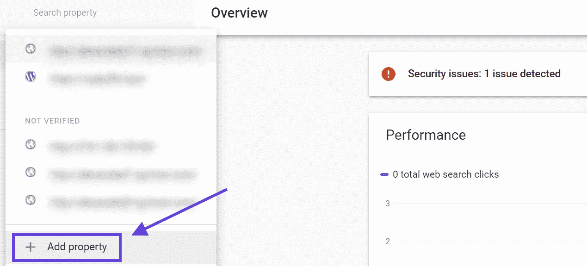

向谷歌搜索控制台添加属性。

搜索控制台将要求您选择一个属性类型。您可以输入域或 URL 前缀。如果您输入域名，您将能够通过 DNS 验证您的网站[。URL 前缀方法允许您在四种验证方法中进行选择:](https://kinsta.com/knowledgebase/what-is-dns/)

> Kinsta 把我宠坏了，所以我现在要求每个供应商都提供这样的服务。我们还试图通过我们的 SaaS 工具支持达到这一水平。
> 
> <footer class="wp-block-kinsta-client-quote__footer">
> 
> 
> 
> <cite class="wp-block-kinsta-client-quote__cite">Suganthan Mohanadasan from @Suganthanmn</cite></footer>

[View plans](https://kinsta.com/plans/)

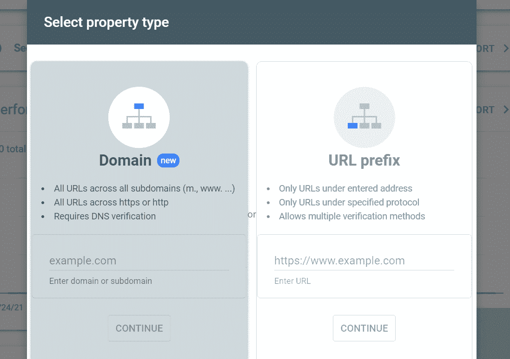

在搜索控制台中选择一个属性类型。

当涉及到站点验证时，这两种方法都可以很好地工作。然而，我们推荐使用 **URL 前缀**的方法，因为它给了你更多的选择。

下一节将探讨四种验证方法，您可以使用这些方法来选择 **URL 前缀**属性类型。最后，我们将向您展示如何通过 DNS 验证您的网站(T2 域名 T3 选项)。在**网址前缀**下输入你的[网站的网址](https://kinsta.com/knowledgebase/what-is-a-url/)，点击**继续**。

### 1.HTML 验证文件

用这种方法，你需要上传一个 HTML 文件到你网站的根目录。这很简单，但缺点是你需要访问你的服务器来上传文件，或者通过 [FTP/SFTP 客户端](https://kinsta.com/blog/best-ftp-clients/)或者类似 [cPanel 文件管理器](https://kinsta.com/knowledgebase/what-is-cpanel/)的东西。

#### 步骤 1:下载验证文件

将您的站点添加到 Google 搜索控制台后，您应该会在**推荐的验证方法**选项卡中看到一个下载 HTML 验证文件的选项:

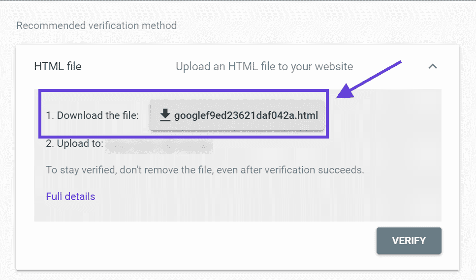

从谷歌搜索控制台下载验证文件。

点击**旁边的按钮，下载文件**。把这个文件保存在你记得的地方，你马上就会用到它。

#### 第二步:通过 SFTP 上传文件

接下来，你需要通过 FTP/SFTP 连接到你的网站[。这里是](https://kinsta.com/knowledgebase/ftp-vs-sftp/)[如何在金斯塔](https://kinsta.com/knowledgebase/how-to-use-sftp/)使用 SFTP 的说明。

一旦你成功连接，将你从谷歌下载的文件上传到你网站的根文件夹(这个文件夹包含了 **wp-content** 文件夹、【wp-config.php】T2 等等)。)在 Kinsta，这个文件夹被命名为 **public** 。

上传文件后，它应该看起来像这样:

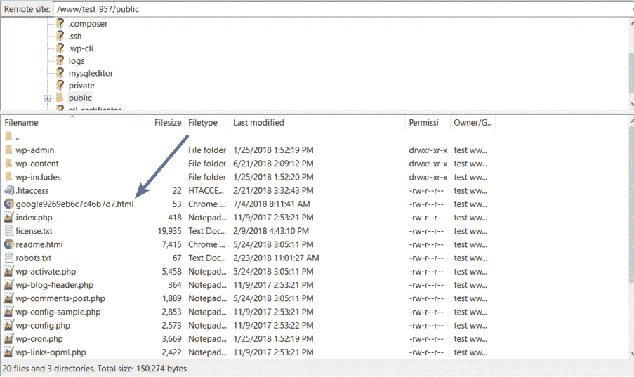

通过 FTP/SFTP 上传验证文件。

一旦文件在你的站点的根文件夹中，返回谷歌搜索控制台。是时候验证你的财产了。

#### 第三步:点击谷歌搜索控制台中的验证按钮

一旦你将文件上传到你的网站，回到谷歌搜索控制台，点击**验证**按钮完成该过程。Google 搜索控制台将在您的服务器上找到该文件，并验证您是否拥有该网站。

你可以用同样的方法用谷歌搜索控制台验证 [Kinsta 内容交付网络(CDN)](https://kinsta.com/help/kinsta-cdn/#verify-cdn-google-search-console) 。在谷歌搜索控制台上验证您的 CDN 将使搜索引擎能够抓取和索引您的图像。

### 2.HTML 标签

使用 HTML 标签方法，你需要添加一个简单的 meta 标签到你站点的 **< head >** 部分。如果你正在使用 WordPress，你可以这样做:

*   将标签直接添加到子主题的 header.php 文件中
*   使用一个插件将它插入到标题中

我们将向您展示如何使用插件方法做到这一点，但是只要您使用子主题(如果您不使用子主题，您将在每次更新您的主题时丢失您的 Google 站点验证)，直接将其添加到您的主题中也是可以的。

#### 步骤 1:复制元标签

要找到 meta 标签，可以去 Google 搜索控制台界面的**其他验证方法**部分:

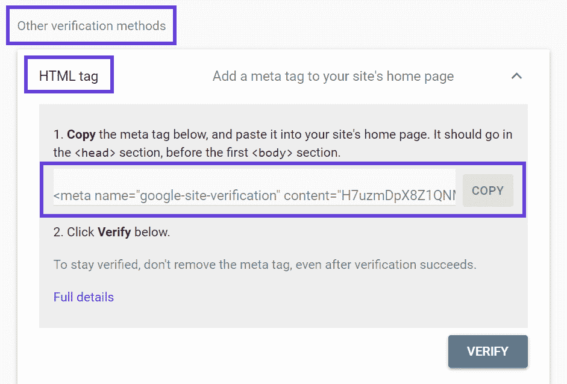

HTML meta 标签。

使用**复制**按钮复制框中的 meta 标签。现在，让我们把它添加到你的 WordPress 网站上。

#### 步骤 2:使用插入页眉和页脚添加 Meta 标记

接下来，你可以在你的网站上安装免费的[插入页眉和页脚](https://kinsta.com/knowledgebase/add-code-wordpress-header-footer/#how-to-add-code-to-wordpress-header-and-footer-with-a-plugin)插件。导航到**设置** > **插入页眉和页脚**并将 meta 标签粘贴到页眉框中的**脚本中:**

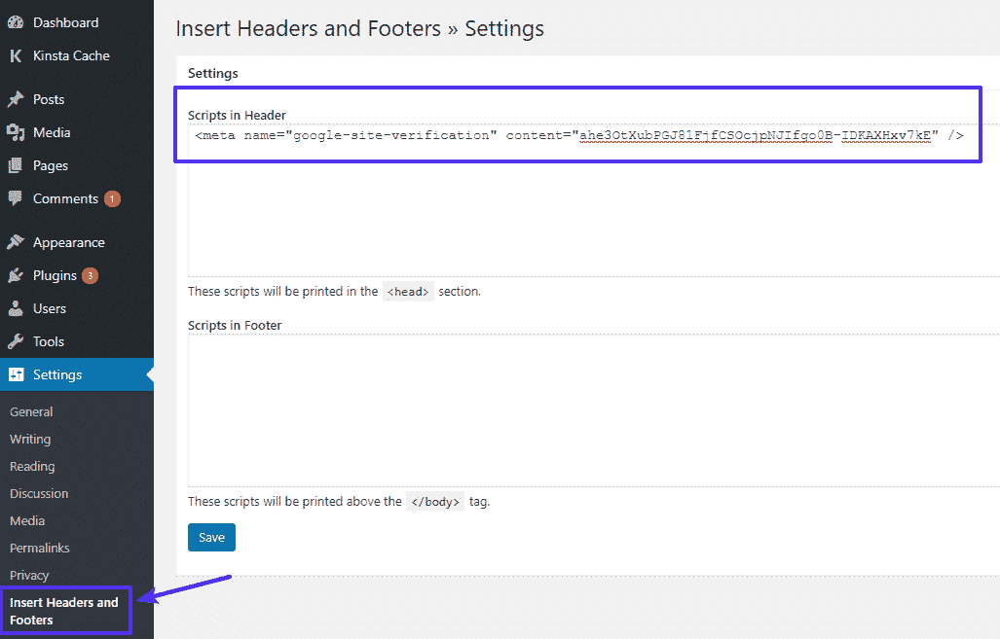

添加 HTML meta 标签来插入页眉页脚插件。

点击**保存**保存对你的网站页眉的修改，就这样。你也可以[手动添加 meta 标签](https://kinsta.com/knowledgebase/add-code-wordpress-header-footer/)，但是如果你不习惯编辑 WordPress 核心文件，我们推荐插件方式。

要完成该过程，请返回到 Google 搜索控制台界面，并单击**验证**按钮。如果你把代码添加到你的网站，谷歌搜索控制台将能够识别它。

### 3.谷歌分析

如果你已经在你的网站上安装了[谷歌分析](https://kinsta.com/blog/google-analytics-wordpress/#2-manually-connect-google-analytics-and-wordpress-with-code)异步跟踪代码[，你可以使用谷歌分析轻松验证你的网站。这个过程可以归结为两个简单的步骤:](https://kinsta.com/blog/google-analytics-wordpress/)

1.  选择**下的**谷歌分析**其他验证方法**。
2.  点击**验证**。

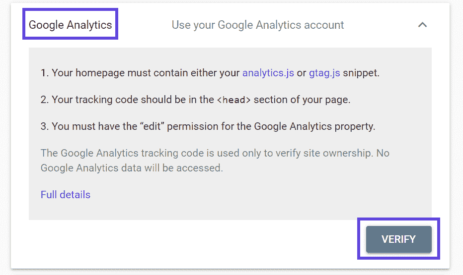

谷歌分析账户验证屏幕。

如果你使用插件将谷歌分析添加到 WordPress，跟踪代码应该在你的主页上。这意味着你可以继续使用这个方法。

### 4.谷歌标签管理器

就像谷歌分析一样，如果你已经在使用[谷歌标签管理器](https://kinsta.com/blog/google-analytics-wordpress/#3-integrate-google-analytics-and-wordpress-with-google-tag-manager)，你只需点击一下就可以验证你的网站。您需要在您的站点上激活 Google Tag Manager 容器片段。

同样，不需要深入或复杂的过程。你需要做的就是:

1.  在**其他验证方法**下选择**谷歌标签管理器**。
2.  点击**验证**。

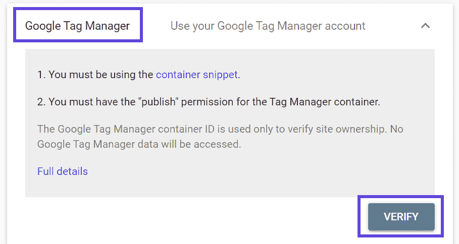

屏幕验证您的 Google Tag Manager 账户。

如果你正在使用谷歌标签管理器，这种方法可以让你立即在搜索控制台上验证你的网站。

 ## 注册订阅时事通讯

### 想知道我们是怎么让流量增长超过 1000%的吗？

加入 20，000 多名获得我们每周时事通讯和内部消息的人的行列吧！

[Subscribe Now](#newsletter)

### 5.DNS 验证

如果你想使用**域**方法验证你的网站，你需要添加一个 TXT 记录到你的域名的 DNS 配置中。验证窗口如下所示:

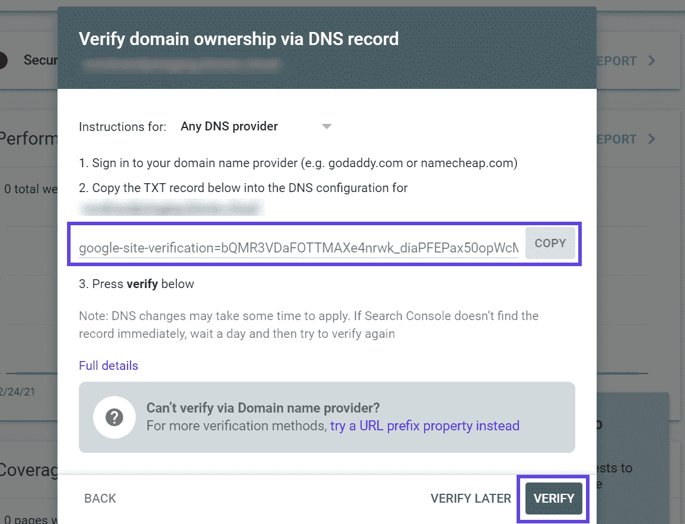

谷歌 DNS 验证模态

如果您使用的是 Kinsta DNS，您可以直接从您的 [MyKinsta dashboard](https://kinsta.com/mykinsta/) 添加该 TXT 记录。

首先，点击 **Kinsta DNS** 选项。然后，选择**管理**您想要使用谷歌搜索控制台验证的网站:

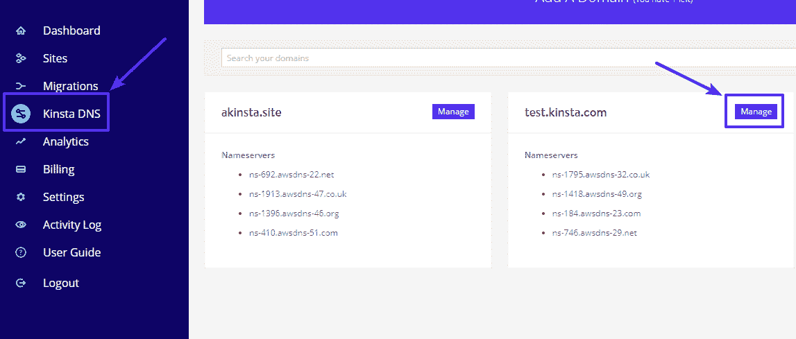

my Kinsta 仪表盘中的 Kinsta DNS 选项。

接下来，你可以点击**添加 DNS 记录**，选择**类型**下的 **TXT** 选项。在**内容**下添加您的 Google 搜索控制台 TXT 记录:

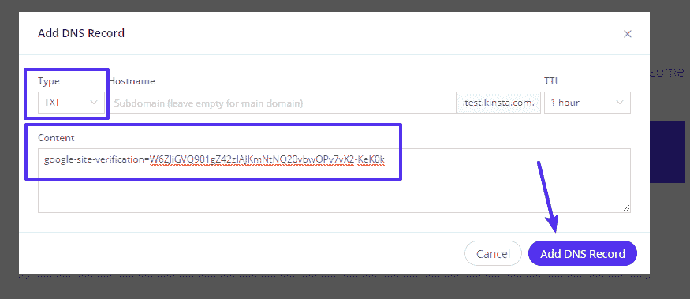

在 Kinsta 添加 TXT 记录。

请记住，这个过程将根据您使用的域提供商而有所不同。如果您想将您的域名转移到 Kinsta，以便使用我们的 DNS 进行管理，您可以[遵循这些说明](https://kinsta.com/help/add-domain/)。
T3】

## 4 个 WordPress 插件帮助谷歌网站验证

如果你正在使用一个 [WordPress SEO 插件](https://kinsta.com/blog/best-seo-plugins-for-wordpress/)，很有可能你选择的插件提供了一个简单的工具来帮助谷歌网站验证。我们将向您展示如何使用三个流行的 WordPress SEO 工具和一个直接来自 Google 的插件来完成这项工作。

### 6.Yoast SEO

要使用 [Yoast SEO](https://kinsta.com/blog/best-seo-plugins-for-wordpress/#yoast-seo) 完成谷歌搜索控制台验证过程，你可以在你的 WordPress 仪表盘中进入 **SEO** > **General** 并选择**网站管理员工具**标签。

接下来，找到 **Google 验证码**字段，添加可以从 Google 搜索控制台获得的代码:

Google site 验证中的 Yoast SEO。

要找到您的谷歌搜索控制台验证码，您可以遵循以下三个步骤:

1.  导航至谷歌搜索控制台界面中的**其他验证方法**部分。
2.  选择 **HTML 标签**选项。
3.  复制整个标签。Yoast SEO 会自动去掉多余的细节，只留下代码。

哪里可以找到谷歌验证码。

现在您可以将代码添加到您的 Yoast SEO 设置页面，并保存对它的更改。返回谷歌搜索控制台的 **HTML 标签**标签，点击**验证**按钮。

你的网站速度是在 Google SERPs 上排名靠前的另一个关键因素？优化和增压你的网站吧。[免费试用 kin sta](https://hubs.ly/H0pklC_0)！

### 7.SEOPress

要用[SEO press](https://kinsta.com/blog/best-seo-plugins-for-wordpress/#seopress)插件在谷歌搜索控制台中验证你的站点，请到你的 WordPress 仪表板中的 **SEOPress >高级**部分。在这里，向下滚动找到**谷歌搜索验证**条目。

SEOPress simplifies the Google site verification process.

你需要在这里输入你的谷歌网站验证 HTML 元标签。看起来大概是这样的。添加您的站点验证元标签并保存更改。

我们已经在上面的 **HTML 标签**部分讨论了如何为你的网站(或者谷歌称之为“属性”)获取这个 meta 标签。

现在，插件会自动将这个 HTML 标签添加到你的站点的所有页面中。

最后，点击谷歌搜索控制台中 **HTML 标签**部分下的**验证**按钮。

### 8.排名数学搜索引擎优化

如果你使用的是 [Rank Math SEO](https://kinsta.com/blog/best-seo-plugins-for-wordpress/#rank-math) 插件，你可以在谷歌搜索控制台中通过进入仪表盘中的 **Rank Math** > **常规设置** > **网站管理员工具**来验证你的网站。在这里，您将看到一个字段，显示为 **Google 搜索控制台**，这是您的搜索控制台验证码所在的位置:

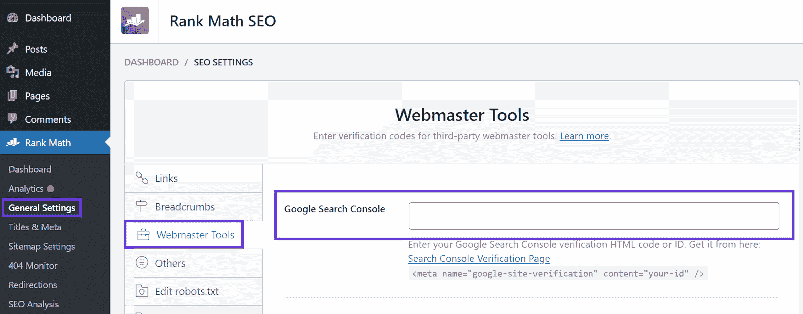

添加搜索控制台验证码到排名数学。

要找到验证码，你可以按照其他 WordPress SEO 插件的说明进行。导航到谷歌搜索控制台界面的**其他验证方法**部分，然后选择 **HTML 标签**选项。复制整个标签后，Rank Math 会自动识别验证码。

接下来，返回谷歌搜索控制台，点击 **HTML 标签下的**验证**按钮。**搜索控制台现在应该可以识别您的网站了。

### 9.谷歌网站工具包

谷歌插件提供的[站点工具包让你只需点击几下就能把你的 WordPress 网站和谷歌服务连接起来。是官方插件，可以免费使用。](https://wordpress.org/plugins/google-site-kit/)

安装并激活插件后，导航至仪表板中的**站点套件** > **仪表板**，并选择**使用谷歌**登录选项:

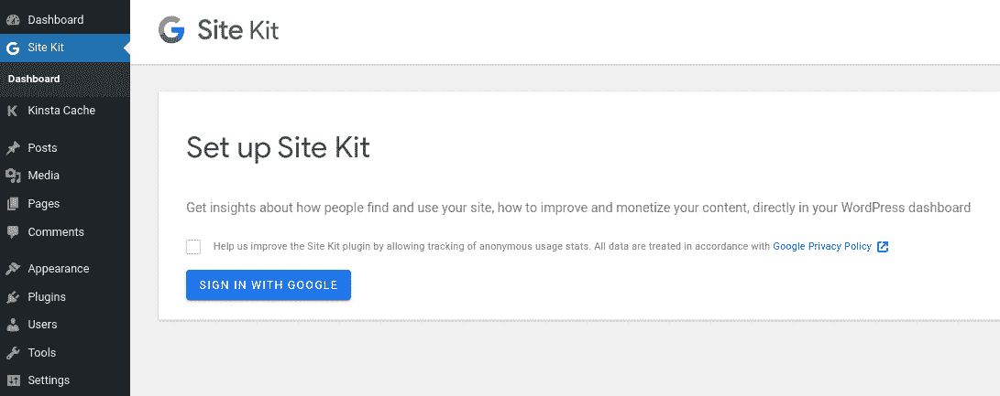

通过 Site Kit 插件登录 Google。

谷歌将提示您验证网站所有权，并将其与搜索控制台连接。要继续，请再次点击**使用谷歌**登录:

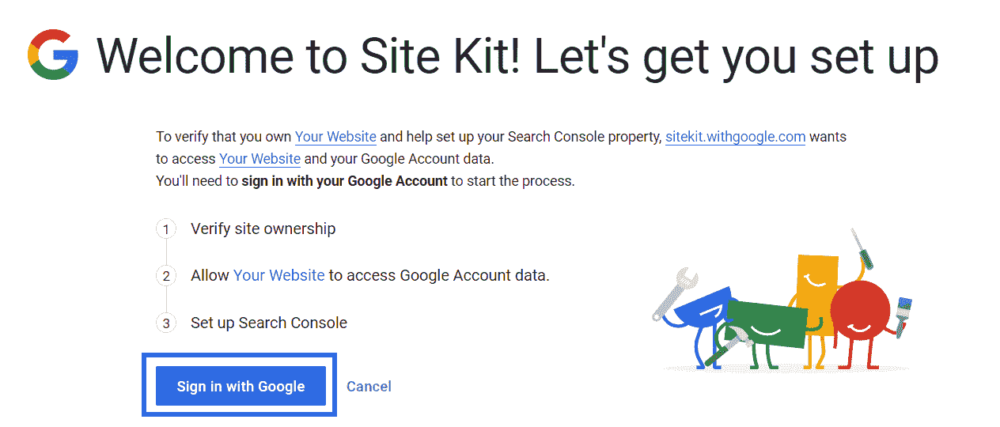

站点工具包设置向导。

如果你有[个谷歌账户](https://kinsta.com/blog/multiple-gmail-accounts/)，你可以选择你想使用哪个搜索控制台账户连接到你的网站。Google 将要求您确认您对 Site Kit 能够访问以下类型的数据感到满意:

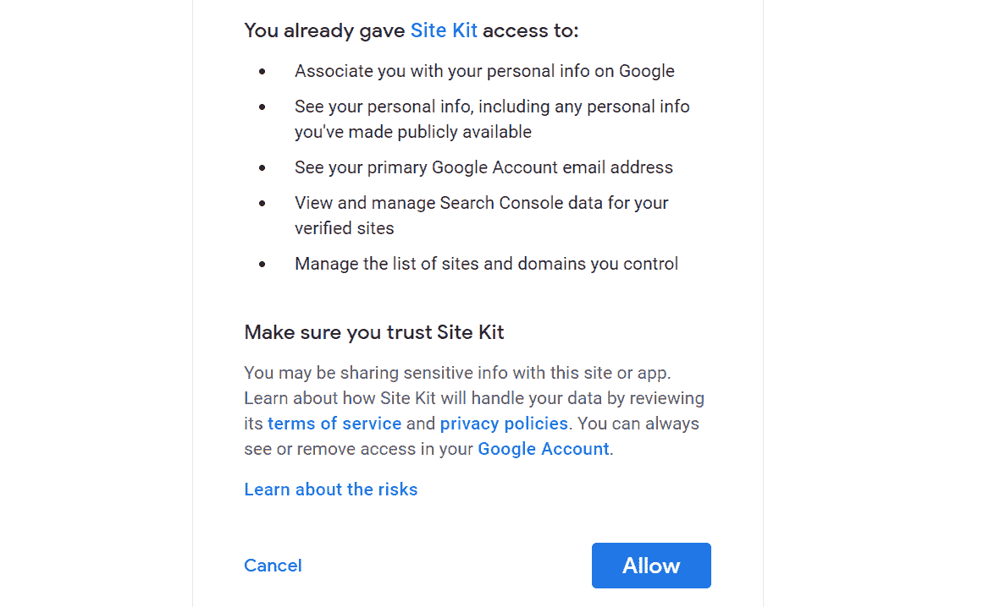

站点工具包的权限概述。

点击**允许**后，Site Kit 会要求你确认 Google 搜索控制台的站点所有权。Site Kit 通过在你的网站上添加一些 HTML 代码来做到这一点。你所要做的就是选择**继续:**

启用 Site Kit 验证您拥有自己的网站。

接下来，Site Kit 会询问您是否允许访问您的 Google 帐户数据，并将其显示在您的仪表盘上。再次点击**允许**按钮。然后，您会看到一条成功消息，告诉您您的网站已在 Google 搜索控制台上通过验证:

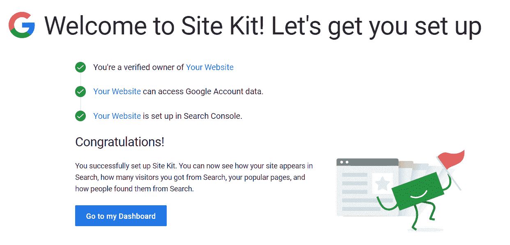

出现现场工具包设置成功消息。

当你回到 WordPress 的 Site Kit 仪表板时，你会看到它连接到了 Google 搜索控制台。一个新的**站点工具包** > **搜索控制台**标签将出现在你的[仪表盘](https://kinsta.com/knowledgebase/wordpress-admin/)中，让你可以从你的网站内部访问数据。

## 你应该使用哪种方法？

将网站添加到谷歌搜索控制台只需几秒钟。但是，如果您验证了您拥有该网站，这将会有所帮助，因为根据您选择的验证方法，复杂性会有所不同。

如果你正在使用谷歌分析或标签管理器，你的网站上已经有一些谷歌代码了。谷歌搜索控制台应该识别代码并验证您的网站，而无需您添加任何其他内容。或者，您可以添加一个 HTML 文件，包含一个标签，或者使用 DNS 验证(如果您不想向站点添加更多代码，这是最好的方法)。

最后，如果你使用的是一个 [WordPress SEO 插件](https://kinsta.com/blog/best-seo-plugins-for-wordpress/)，最受欢迎的选项包括谷歌搜索控制台验证功能。这些将帮助您验证您的网站。你所要做的就是输入一个验证码。

[Ready to take on the Google Search Console verification process? 👀 Start here ⬇️Click to Tweet](https://twitter.com/intent/tweet?url=https%3A%2F%2Fkinsta.com%2Fblog%2Fgoogle-site-verification%2F&via=kinsta&text=Ready+to+take+on+the+Google+Search+Console+verification+process%3F+%F0%9F%91%80+Start+here+%E2%AC%87%EF%B8%8F&hashtags=WordPress%2CGoogleSearch)

## 摘要

恭喜你！现在你知道了开始谷歌站点验证所需要的一切。

请记住，谷歌将定期检查您的网站的验证。无论你选择哪种方法，重要的是要保留该方法——在确认后你不能删除它。

现在是时候开始[扩大你的网站流量](https://kinsta.com/blog/how-to-drive-traffic-to-your-website/)了。

关于 Google 搜索控制台验证流程，您还有其他问题吗？请留下您的评论，我们会尽力帮助您！

* * *

让你所有的[应用程序](https://kinsta.com/application-hosting/)、[数据库](https://kinsta.com/database-hosting/)和 [WordPress 网站](https://kinsta.com/wordpress-hosting/)在线并在一个屋檐下。我们功能丰富的高性能云平台包括:

*   在 MyKinsta 仪表盘中轻松设置和管理
*   24/7 专家支持
*   最好的谷歌云平台硬件和网络，由 Kubernetes 提供最大的可扩展性
*   面向速度和安全性的企业级 Cloudflare 集成
*   全球受众覆盖全球多达 35 个数据中心和 275 多个 pop

在第一个月使用托管的[应用程序或托管](https://kinsta.com/application-hosting/)的[数据库，您可以享受 20 美元的优惠，亲自测试一下。探索我们的](https://kinsta.com/database-hosting/)[计划](https://kinsta.com/plans/)或[与销售人员交谈](https://kinsta.com/contact-us/)以找到最适合您的方式。

