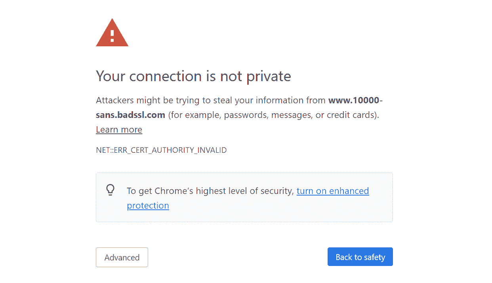
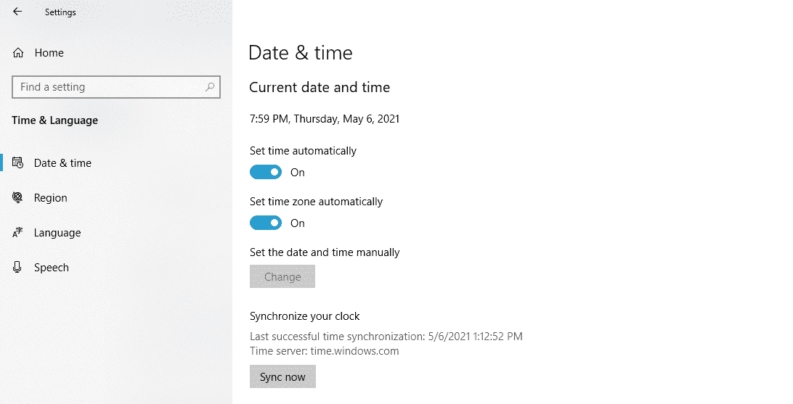
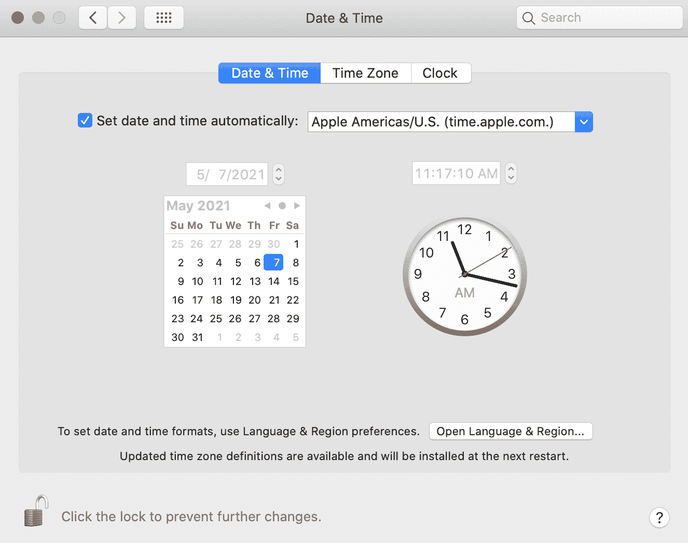
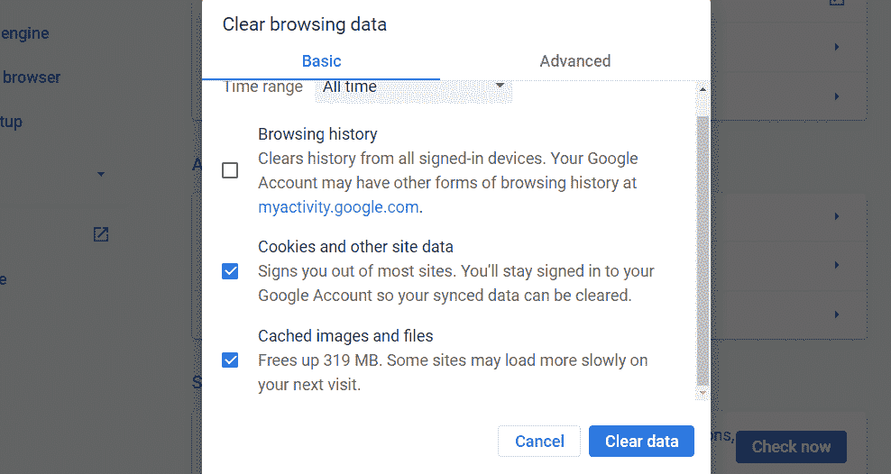
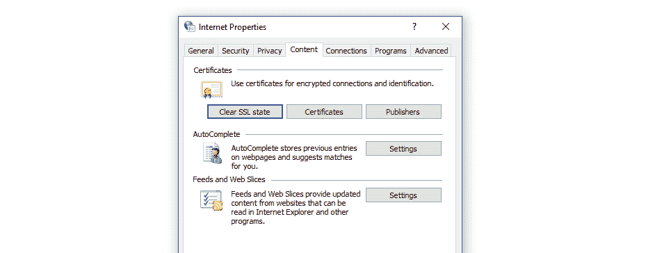
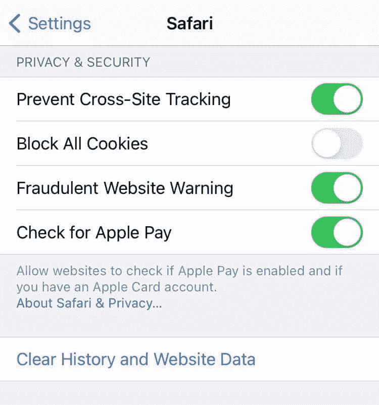
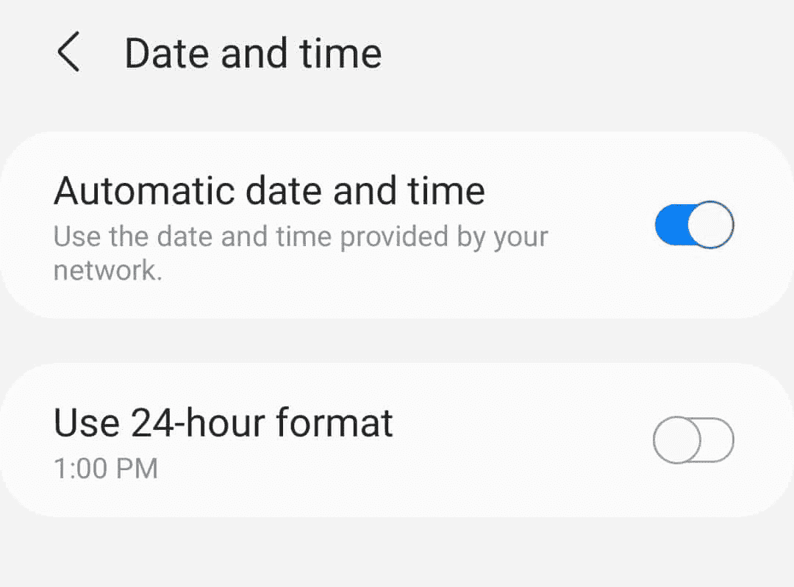

# 在各种浏览器和平台上修复 SSL 连接错误的 8 种方法

> 原文:[https://kinsta.com/blog/ssl-connection-error/](https://kinsta.com/blog/ssl-connection-error/)

为您的网站获取[安全套接字层(SSL)](https://kinsta.com/knowledgebase/how-ssl-works/) 证书并进行设置从未如此简单。但是你仍然会遇到 SSL 连接错误，即使在[正确安装了你的证书](https://kinsta.com/help/how-to-install-ssl-certificate/)并强制流量通过 HTTPS 之后。在许多情况下，这些错误信息会把用户吓跑。

了解导致 SSL 错误的原因将有助于防止它们出现在您的网站上。根据你看到的信息和你使用的浏览器或操作系统，你也会知道遇到这种情况时该怎么做。

在本文中，我们将探索什么是 SSL 连接错误及其主要原因。我们还将讨论它们最常见的类型，以及如何对它们进行故障排除。

我们开始吧！

### 查看我们的[视频指南](https://www.youtube.com/watch?v=3M8N1LI5DZA)来修复 SSL 连接错误

## 什么是 SSL 连接错误？

An SSL connection error in Firefox.

在浏览网页时，您可能会遇到几种类型的 SSL 连接错误。其中一些错误是由于服务器端的问题，而另一些是由于本地配置问题。

> Kinsta 把我宠坏了，所以我现在要求每个供应商都提供这样的服务。我们还试图通过我们的 SaaS 工具支持达到这一水平。
> 
> <footer class="wp-block-kinsta-client-quote__footer">
> 
> 
> 
> <cite class="wp-block-kinsta-client-quote__cite">Suganthan Mohanadasan from @Suganthanmn</cite></footer>

[View plans](https://kinsta.com/plans/)

概括地说，SSL 连接错误会阻止您通过[安全超文本传输协议(HTTPS)](https://kinsta.com/blog/http-to-https/) 安全地浏览网站。您的浏览器可能允许您继续连接，但在大多数情况下，它会告诉您这样做的风险由您自己承担。如果没有有效的 SSL 证书，恶意方可以拦截您与您试图查看的网站交换的任何数据。

您可能遇到的一些最常见的 SSL 连接错误包括:

*   [NET:ERR _ CERT _ AUTHORITY _ INVALID](https://kinsta.com/knowledgebase/neterr-cert-authority-invalid/)
*   [NET::ERR _ CERT _ COMMON _ NAME _ INVALID](https://kinsta.com/knowledgebase/net-err_cert_common_name_invalid/)
*   [NET::ERR_CERT_REVOKED](https://kinsta.com/knowledgebase/net-err_cert_revoked/)
*   [SSL 握手失败](https://kinsta.com/knowledgebase/ssl-handshake-failed/)
*   [错误 _ SSL _ 过时 _ 版本](https://kinsta.com/knowledgebase/err_ssl_obsolete_version/)
*   [错误 _ SLL _ 协议 _ 错误](https://kinsta.com/knowledgebase/err_ssl_protocol_error/)

每种类型的 SSL 连接错误都指向不同的原因。当您遇到这样的问题时，您的浏览器会显示一条特定的消息，告诉您为什么会看到它:

需要注意的是，不同浏览器的错误信息可能会有所不同。上面的图片来自 Firefox，而下面的图片是当我们使用 Chrome 打开同一个网站时弹出的:

An SSL connection error in Chrome.

如前所述，并非所有的 SSL 连接错误都源于您的服务器配置问题。您的网站可以拥有完全有效的 SSL 证书，但用户在访问它时仍可能遇到错误。

在接下来的几节中，我们将向您展示当您试图访问一个网站时遇到 SSL 连接问题时应该怎么做。

[It’s never been easier to obtain an SSL certificate for your website and set it up... but errors can still occur. 😅 Learn how to fix them with this guide ⬇️Click to Tweet](https://twitter.com/intent/tweet?url=https%3A%2F%2Fkinsta.com%2Fblog%2Fssl-connection-error%2F&via=kinsta&text=It%E2%80%99s+never+been+easier+to+obtain+an+SSL+certificate+for+your+website+and+set+it+up...+but+errors+can+still+occur.+%F0%9F%98%85+Learn+how+to+fix+them+with+this+guide+%E2%AC%87%EF%B8%8F&hashtags=SSL%2CSiteSecurity)

## 如何修复 SSL 连接错误(8 种方法)

如果你不负责一个网站，那么在修复服务器端 SSL 连接错误时，你几乎无能为力。但是，由于本地设备或浏览器配置的问题，可能会出现一些问题。

我们将向您展示如何使用各种浏览器、移动操作系统和社交媒体平台来修复导致 SSL 连接错误的本地问题。

让我们开始修理吧！

### 1.如何修复谷歌 Chrome 中的 SSL 连接错误

如果你在 Google Chrome 中遇到 SSL 连接错误，有几个快速修复方法可以实现。

首先，确保你运行的是最新版本的 Chrome。你可以从浏览器本身更新 Chrome [，或者你可以从](https://support.google.com/chrome/answer/95414?co=GENIE.Platform%3DDesktop)[谷歌 Chrome 的网站](https://www.google.com/chrome/update/)下载并安装最新版本。

接下来，检查系统的时间和日期是否同步。如果您的设备时间不正确，您可能会在整个 web 上遇到 SSL 连接问题，因为一些 SSL 证书依赖内部系统时钟进行验证。您计算机上不正确的时间或日期会导致错误，因为您的浏览器无法[验证这些证书](https://kinsta.com/knowledgebase/ssl-check/)。

在 Windows 上，您可以通过打开**设置**菜单并选择**时间&语言**选项来固定时间和日期:

访问窗口的‘时间&语言’设置。

在下一个屏幕上，确保**自动设置时间**和**自动设置时区**选项都已启用。或者，您可以手动选择您的时区，并启用**手动设置日期和时间**选项:

在 Windows 中同步时间。

如果你在 macOS 上使用 Chrome，点击屏幕左上角的苹果图标打开**系统偏好**菜单。选择**日期&时间**选项，启用**自动设置日期和时间**设置:

MAC OS 的“日期&时间”设置。

一旦你确定了日期和时间，尝试访问 Chrome 中显示 SSL 连接错误的网站。如果问题仍然存在，继续[清除你的 Chrome 缓存和 cookies](https://kinsta.com/knowledgebase/how-to-clear-browser-cache/#how-to-clear-browser-cache-for-google-chrome) 。为此，打开**设置**菜单，点击**清除浏览数据**。

将弹出一个窗口，允许您选择要清除的数据。如果您正在使用**基本**设置，选择 **Cookies 和其他站点数据**和**缓存图像和文件**，然后点击**清除数据**按钮:

清除 Chrome 中的缓存和 cookies。

您可以尝试的另一个修复方法是清除操作系统中的 SSL 板。要在 Windows 中执行此操作，请打开开始菜单并搜索**互联网选项。**点击出现的结果，会弹出一个**互联网属性**窗口。跳转到**内容**，点击**清除 SSL 状态:**

清除 Windows 中的 SSL 石板。

清除 SSL 名单将删除本地存储在您的计算机上的所有证书。下次重新加载网站时，如果出现 SSL 连接错误，浏览器将尝试重新验证其证书，这样做可能会清除错误。

如果您使用的是 macOS，那么清除 SSL 协议的工作方式会有所不同。打开**实用程序**菜单，进入**钥匙串访问**。在左侧菜单中选择**钥匙链**下的**系统**选项，您将看到系统本地存储的所有 SSL 证书的概述:

访问 macOS 的 SSL 协议。

您可以单独选择证书并手动删除它们。如果您发现了您尝试访问的网站的证书，请先删除该证书，然后检查 SSL 连接错误是否仍然存在。

## 注册订阅时事通讯

### 想知道我们是怎么让流量增长超过 1000%的吗？

加入 20，000 多名获得我们每周时事通讯和内部消息的人的行列吧！

[Subscribe Now](#newsletter)

在这个阶段，如果其他都失败了，暂时禁用你的杀毒软件和[防火墙](https://kinsta.com/blog/what-is-a-firewall/)。我们建议将此作为最后手段，因为在大多数情况下，您的防病毒软件不会导致 SSL 连接问题。

如果您尝试了每一种修复方法，但都不起作用，您可以认为 SSL 连接问题出在服务器上。

### 2.如何修复 Firefox 中的 SSL 连接错误

在 Firefox 中修复 SSL 连接[错误的工作方式与其他浏览器基本相同。您可以按照上一节中的说明来实现以下修复:](https://kinsta.com/blog/ssl_error_no_cypher_overlap/)

1.  检查系统的日期和时间，并进行调整。
2.  清除您的本地 SSL 记录。

如果这两种解决方案都不起作用，那么是时候[清空你的 Firefox cookies 和缓存](https://kinsta.com/knowledgebase/how-to-clear-browser-cache/#firefox)了。为此，进入**选项**菜单，跳转到**隐私&安全**标签。然后点击 **Cookies 和站点数据**下的**清除数据**按钮:

在火狐清理站点数据。

再次尝试访问出现 SSL 连接错误的网站。如果你的浏览器无法建立连接，检查是否有新版本的火狐浏览器可以更新。

### 3.如何修复 Safari 中的 SSL 连接错误

到目前为止，我们已经对跨操作系统的 SSL 连接错误进行了多次修复。如果你使用的是 Safari，首先按照谷歌浏览器[部分给出的相同说明进行操作:](#1-how-to-fix-the-ssl-connection-error-in-google-chrome)

1.  检查系统的日期和时间，并进行调整。
2.  在 macOS 中清除您的本地 SSL 板。

如果 SSL 连接错误仍然存在，您可以继续操作，[清除您的 Safari cookies 和缓存](https://kinsta.com/knowledgebase/how-to-clear-browser-cache/#how-to-clear-cache-for-safari)。如果您使用的是 iMac、Macbook、iPhone 或 iPad，具体说明如下:

1.  打开 Safari **设置**菜单。
2.  点击**清除历史记录**。

解决这个问题后，尝试访问之前给你一个 SSL 连接错误的网站。这个错误现在应该消失了，除非您正在处理服务器端的配置问题。

### 4.如何修复 iPhones 和 iPads 上的 SSL 连接错误

在 iPhone 或 iPad 上修复 SSL 连接错误的过程与在 macOS 上的相同。首先，您需要检查设备的日期和时间是否同步。要访问移动设备的日期和时间设置:

Kinsta 的所有托管计划都包括来自资深 WordPress 开发者和工程师的 24/7 支持。与支持我们的财富 500 强客户的专家聊天，并[检查我们的计划](https://kinsta.com/plans/)！

1.  打开**设置** app，选择**常规** > **日期&时间**。
2.  检查**自动设置**选项是否启用。如果不是，就打开它。
3.  手动检查您的设备是否使用了正确的时区。

更新日期和时间设置后，您可以进入[清除浏览器的 cookies 和缓存](https://kinsta.com/knowledgebase/how-to-clear-browser-cache/)。为此，打开**设置** app，选择 **Safari** > **清除历史和网站数据**:

清除 iOS 上的 Safari 浏览数据。

如果你已经在你的 iOS 设备上安装了不同的浏览器，这个过程应该是相似的。

不幸的是，最新版本的 iOS 已经删除了在 iPhone 或 iPad 上清除 SSL 记录的选项，所以这不是一个可行的解决方案。如果上面的修复都不起作用，您可以假设问题出在服务器端。

### 5.如何修复 Android 上的 SSL 连接错误

修复 Android 上的 SSL 连接错误相对简单。首先，继续检查您的时间和日期设置，看看它们是否准确。

打开**设置** app，点击**综合管理** > **日期时间**。然后检查**自动日期和时间**设置是否启用:

更新 Android 中的日期和时间设置。

值得注意的是，像 iOS 一样，Android 不包括清除 SSL 记录或删除单个证书的选项。要修复 SSL 连接错误，你可以做的就是清除你的 Chrome 浏览数据。为此:

1.  打开 Chrome 浏览器并访问其**设置**菜单。
2.  转到**隐私和安全**。
3.  点击**清除浏览数据**。
4.  选择浏览器的 **Cookies 和站点数据**和**缓存图像和文件**选项，然后点击**清除数据。**

清除 Chrome 网站数据后，检查 SSL 连接错误是否仍然存在。如果是的话，很可能是服务器端的配置问题。

### 6.如何修复脸书上的 SSL 连接错误

如果您在[脸书](https://kinsta.com/blog/facebook-statistics/)上遇到 SSL 连接错误，您可以确定这不是服务器端的问题。这意味着您正在处理一个本地配置问题。以下是您应该实施的修复:

1.  调整您的本地时间和日期设置。
2.  清除浏览器的缓存和 cookies。
3.  清除操作系统的 SSL 名单或删除脸书的任何本地证书。

你可以在本文的 [Google Chrome](#1-how-to-fix-the-ssl-connection-error-in-google-chrome) 部分找到关于在 Windows 和 macOS 上调整日期和时间设置的说明。我们也有关于为 Chrome、Firefox 和 Safari 清除浏览器 cookies 和缓存的说明。

### 7.如何修复 Gmail 上的 SSL 连接错误

使用移动应用程序访问 Gmail 时，您不会遇到 SSL 连接错误。但是，如果您使用 Chrome、Firefox 或 Safari 访问 Gmail 的网络服务，SSL 错误可能会弹出。在这种情况下，您应该:

1.  调整您的本地时间和日期设置(查看上面的 [Google Chrome](#1-how-to-fix-the-ssl-connection-error-in-google-chrome) 部分获取说明)。
2.  清除浏览器的缓存和 cookies。
3.  清除操作系统的 SSL 名单或删除 Gmail 的任何本地证书。

如果其他一切都失败了，你可以使用移动应用程序访问 Gmail，同时尝试暂时禁用防火墙或将浏览器更新到最新版本。

### 8.如何修复 YouTube 上的 SSL 连接错误

YouTube 上的 SSL 连接错误可能是由于您的操作系统或浏览器中的本地配置错误造成的。如果您在 YouTube 中遇到 SSL 错误:

1.  调整您的本地时间和日期设置(查看上面的 [Google Chrome](#1-how-to-fix-the-ssl-connection-error-in-google-chrome) 部分获取说明)。
2.  清除浏览器的缓存和 cookies。
3.  清除操作系统的 SSL 名单或从 YouTube 中删除任何本地证书。

在这篇文章的前面，我们提供了为 Chrome、Firefox 和 Safari 清除浏览器缓存和 cookies 的说明。同样，您可以通过查看前面几节中的 Chrome 和 Safari 说明，找到如何清除 SSL 记录的分步指南。

[Don't let SSL errors bring you down 🙅‍♂️ Learn how to quickly troubleshoot them right here ✅Click to Tweet](https://twitter.com/intent/tweet?url=https%3A%2F%2Fkinsta.com%2Fblog%2Fssl-connection-error%2F&via=kinsta&text=Don%27t+let+SSL+errors+bring+you+down+%F0%9F%99%85%E2%80%8D%E2%99%82%EF%B8%8F+Learn+how+to+quickly+troubleshoot+them+right+here+%E2%9C%85&hashtags=SSL%2CSiteSecurity)

## 摘要

SSL 连接错误有很多种形式和大小。如果你正在处理一个服务器端的错误，除了等待网站的所有者来修复它或者继续一个不安全的连接之外，你通常无能为力。

也就是说，您可以尝试几种可能解决此问题的本地配置修复，包括:

1.  调整您的时间和日期设置。
2.  清除浏览器的 cookies 和缓存。
3.  清除操作系统的 SSL 记录。

如果您的网站仍然面临 SSL 连接错误，请在下面留下评论。Kinsta 客户也可以联系我们的支持团队来修复任何 SSL 错误。

* * *

让你所有的[应用程序](https://kinsta.com/application-hosting/)、[数据库](https://kinsta.com/database-hosting/)和 [WordPress 网站](https://kinsta.com/wordpress-hosting/)在线并在一个屋檐下。我们功能丰富的高性能云平台包括:

*   在 MyKinsta 仪表盘中轻松设置和管理
*   24/7 专家支持
*   最好的谷歌云平台硬件和网络，由 Kubernetes 提供最大的可扩展性
*   面向速度和安全性的企业级 Cloudflare 集成
*   全球受众覆盖全球多达 35 个数据中心和 275 多个 pop

在第一个月使用托管的[应用程序或托管](https://kinsta.com/application-hosting/)的[数据库，您可以享受 20 美元的优惠，亲自测试一下。探索我们的](https://kinsta.com/database-hosting/)[计划](https://kinsta.com/plans/)或[与销售人员交谈](https://kinsta.com/contact-us/)以找到最适合您的方式。