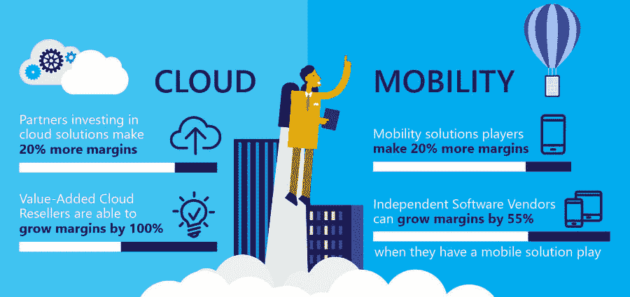
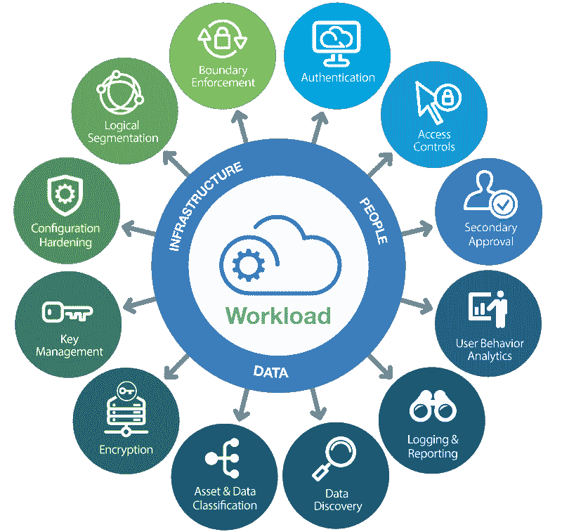
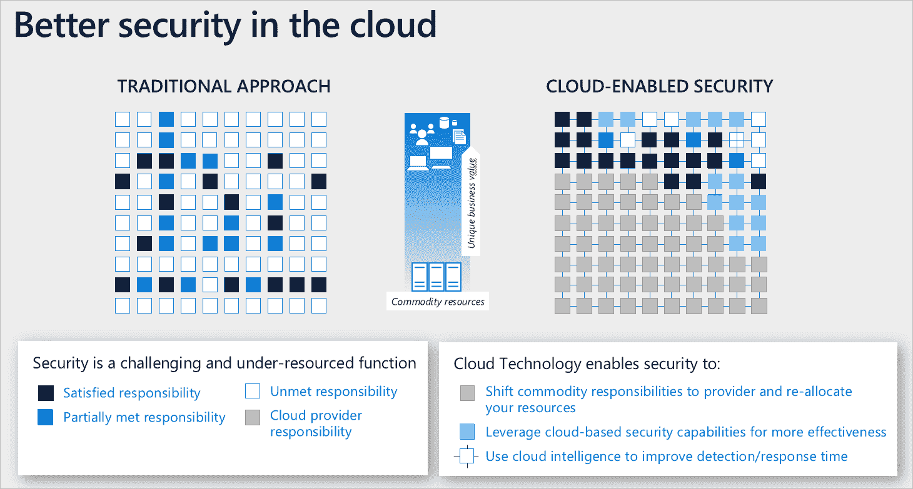

# 2022 年云计算的 11 大优势

> 原文:[https://kinsta.com/blog/benefits-of-cloud-computing/](https://kinsta.com/blog/benefits-of-cloud-computing/)

当考虑迁移到云时，您的目标将是改善您的状况。根据您独特的需求，您可以利用云计算的各种优势。

无论您是在处理新的部署还是现有服务的迁移，您都希望您的云设置比在内部部署时更好。要做到这一点，你首先需要了解[云计算技术](https://kinsta.com/blog/cloud-market-share/)的更广泛的好处，以及它们如何应用于你的业务。

在这种情况下，大多数人都从高层次来理解云计算的好处。但是，当你放眼全局时，并不总是很容易将你的业务如何实现这些高层次的好处联系起来。如果不了解隐藏在表面之下的一些复杂性，您就不会充分认识到这些解决方案可以为您的组织带来的实际价值。

在本指南中，我们超越了许多人通常采用的典型方法。我们旨在让您更清晰、更完整地了解云的优势。我们超越了大的图景，所以当我们关注每个云的好处时，我们将更深入地挖掘，以帮助您理解结合起来使它们成为现实的底层特性和功能。

因此，请加入我们的探索，帮助您更好地了解 2022 年云计算的优势。

 <kinsta-auto-toc heading="Table of Contents" exclude="last" list-style="arrow" selector="h2" count-number="-1">## 云计算:节约成本

将服务迁移到[云](https://kinsta.com/blog/types-of-cloud-computing/)允许您用资本支出换取可变成本。您无需在可能不需要的服务器硬件和软件上进行大量投资，而是在消耗计算资源时付费，并且只为消耗的资源付费。

通过正确的方法，云计算可以成为部署、管理和升级您的 IT 基础架构的最经济高效的方法。

<link rel="stylesheet" href="https://kinsta.com/wp-content/themes/kinsta/dist/components/ctas/cta-mini.css?ver=2e932b8aba3918bfb818">

云计算的本质就是为了节约成本而设计的。灵活的定价模式、对计算资源消耗的控制以及相关管理成本的消除正是云计算相对于内部部署实现真正成本节约的方式。

让我们更深入地了解一些允许云提供成本节约优势的基本机制。

[It's no longer a question of why move to cloud computing... but rather, why not? ☁ Learn more in this thorough guide 👇Click to Tweet](https://twitter.com/intent/tweet?url=https%3A%2F%2Fbit.ly%2F33DkYvX&via=kinsta&text=It%27s+no+longer+a+question+of+why+move+to+cloud+computing...+but+rather%2C+why+not%3F+%E2%98%81+Learn+more+in+this+thorough+guide+%F0%9F%91%87&hashtags=CloudComputing%2CGoogleCloud)

### 规模经济

云计算让你实现比你自己实际能实现的更低的可变成本。

随着数十万客户的使用量汇总，领先的云提供商可以实现巨大的规模经济，这使他们能够传递低成本、现收现付定价模式的优势。

它创造了负担得起的尖端技术，包括机器人技术、机器学习和量子计算。在云服务模式之外，您将永远负担不起这些技术，因为部署和维护这些先进技术的硬件、软件和相关成本的总和是天文数字。

对于小型企业来说，云也是一个游戏规则的改变者。它创造了公平的竞争环境，为以前只有大型企业才能获得的技术打开了大门。

### 现收现付

云定价模式为您提供了控制技术消耗成本的灵活性。

您可以在需要时添加或删除云服务，根据需求扩展您的资源，无论是季节性还是员工的工作时间，同时避免与内部部署相关的部署、管理和升级成本。

内部部署要求您承担拥有硬件和软件的资本成本。无论你是否使用这项技术，你都必须支付相关的管理和维护费用。

因此，与内部部署相比，云现收现付模式使您能够实现实际成本节约，更不用说无风险试用技术的能力，而没有相关的技术和部署成本。

### 自动缩放

您的服务器硬件及其提供的计算资源是构建技术基础设施的平台。它通常构成了你的成本基础的大部分。

在云中，自动扩展功能使您能够控制计算资源的消耗和相关成本。您可以根据需求的变化自动添加或删除资源，优化计算资源的利用率和成本效益，因此您只需根据需要付费。

在内部部署计算资源是一项固定成本。您购买您认为需要的服务器硬件，并承担管理和维护该计算资源的费用，无论您是否使用它。

在这里，很容易看到如何通过云计算节省资金。您可以与所有主要提供商一起探索云的成本节约优势:

*   [阿里巴巴自动缩放](https://www.alibabacloud.com/product/auto-scaling)
*   [Azure 自动缩放](https://azure.microsoft.com/en-us/features/autoscale/)
*   [AWS 自动缩放](https://aws.amazon.com/autoscaling/)
*   [谷歌计算引擎自动缩放](https://cloud.google.com/compute/docs/autoscaler)

### 临时虚拟机实例

云技术如何显著节约成本的一个明显例子是临时虚拟机(VM)实例。

这些虚拟机可以在云提供商未使用的容量上运行。它们是不可预测的，因为提供商可能在任何时候重新分配他们的资源。由于其不一致的可用性，临时实例以高折扣价格提供，通常比标准的现收现付价格便宜 80–90%。

如果您经常运行可能被中断的低优先级工作负载，临时虚拟机是理想的解决方案。与标准云虚拟机成本相比，它们不仅可以显著节省成本，还可以节省您购买、部署和维护专门针对这些工作负载类型的服务器的成本和麻烦。

所有四家领先的云提供商都提供临时虚拟机实例:

*   [阿里云 ECS 可抢占实例](https://www.alibabacloud.com/help/doc-detail/52088.htm#title-7au-kxu-xo5)
*   [亚马逊 EC2 现货实例](https://aws.amazon.com/ec2/spot/) —高达 90%的折扣
*   [Azure Spot 虚拟机](https://azure.microsoft.com/en-us/pricing/spot/) —高达 90%的折扣
*   [谷歌云可抢占的虚拟机](https://cloud.google.com/preemptible-vms) —高达 80%的折扣

### 自由层

如果您只需要有限的资源，云提供商提供的免费层选项允许您免费使用这项技术。

在领先的云提供商中，这些免费层选项包括短期试用、12 个月免费和永远免费。每一个都可以让您访问 100 多种云产品，涵盖人工智能、计算、数据库、开发、网络、存储等领域。

如果您的需求足够小，您可以运行云部署，通过它您永远不会产生成本。这种节约成本的机制怎么样？

此外，免费层选项使您能够试用一些技术，如果您在本地部署，这些技术将会产生很高的成本。

您可以探索所有四大领先云提供商的免费层选项带来的成本节约:

*   [阿里云免费试用](https://www.alibabacloud.com/campaign/free-trial)
*   [Azure 免费账户](https://azure.microsoft.com/en-us/free/)
*   [AWS 自由层](https://aws.amazon.com/free/)
*   [GCP 自由层](https://cloud.google.com/free)

## 云计算:移动优势

云计算移动性为您的同事提供了随时随地在任何设备上工作的能力，前提是他们有互联网连接。这一优势从未如此重要。

微软移动-云概述及战略。([来源](https://news.microsoft.com/apac/2015/07/13/microsoft-commissioned-study-shows-that-cloud-mobility-are-driving-more-profitable-business-models-for-asia-pacifics-it-ecosystem/) )

### 在家工作

在过去的 12 个月里，疫情冠状病毒引发了一场大规模的文化变迁，人们开始转向远程工作。世界各地的公司都关闭了他们的办公室，员工现在在家工作，很多是无限期的。

云计算通过为在家工作的员工提供直接从家中快速、安全和稳定地访问企业应用程序和数据，提供了虚拟工作站的优势。您可以为地理位置分散的员工提供与在办公室时相同的技术访问，因此您的员工在家也能像在办公室一样高效工作。

员工也将受益于这种选择的灵活性，使他们能够[优化他们的家庭办公体验](https://kinsta.com/webinars/working-from-home/)并保持更好的工作生活平衡。

### 移动工作

利用云计算提供的随时随地的可访问性，您可以支持移动办公人员。无论是出差在外的销售人员、长途通勤者，还是不在办公室的紧急情况，用户都可以在旅途中工作。

移动员工可以随时了解最新的企业数据，即使他们相隔千里，也可以与同事协作。

## 云计算:安全优势

[云安全](https://kinsta.com/blog/cloud-security/)对于所有组织和[他们的客户站点](https://kinsta.com/ebooks/wordpress/how-to-secure-wordpress-site/)都至关重要。在将您的关键系统和敏感数据迁移到云计算解决方案时，您并不是唯一担心安全性的人。当文件、程序和其他数据不再安全地存放在现场时，您如何知道它们受到了保护？

事实上，云技术带来了无数的安全增强和相关的好处。RapidScale research 发现 [94%的企业报告在转向云后安全性有所提高](http://www.slideshare.net/rapidscale/cloud-computing-stats-security-and-recovery)。让我们来看看是如何做到的。

保障云工作负载安全的模式。([来源](https://www.hytrust.com/cloudspf/) )

### 自动软件更新

在迁移到 [IaaS 和 SaaS](https://kinsta.com/blog/what-is-iaas/) 的过程中，您释放了自动软件更新的安全优势。在大多数情况下，云提供商有责任处理其平台的安全更新和漏洞修补。

这意味着您的技术团队不必担心持续跟踪和升级软件以防止漏洞，也不会耗尽资源。将服务转移到云平台还消除了员工忽略更新的可能性，这种情况有时会发生在本地安装的软件上。

### 尖端工具

在迁移到云的过程中，您将受益于对一套先进安全工具的更多访问，从而增强您的安全状况。

这些安全工具可作为云服务在您的云提供商的现有安全基础设施上使用。因此，他们从深度整合中受益。下面是您可以从中受益的云安全服务的几个例子。

#### DDoS 保护

云服务自动检测和缓解 [DDoS 攻击](https://kinsta.com/blog/what-is-a-ddos-attack/)。允许您维护您的云服务并防范不可预见的 DDoS 攻击成本，如增加的资源消耗。

#### 防火墙

云提供商通过最先进的[防火墙](https://kinsta.com/blog/what-is-a-firewall/)来保护他们的平台，从而提供基本的保护。除此之外，还有几种常见的云防火墙服务可用:

*   **管理控制台** —配置和管理云部署中防火墙规则的中央工具
*   **Web 应用防火墙** —一种保护您的 Web 应用免受常见攻击的服务
*   **虚拟专用网防火墙—** 一种托管服务，可在您基于云的 VPN 中部署防火墙保护

#### 身份访问管理控制台

大多数提供商将提供一个中央控制台，通过它您可以管理和保护身份，控制谁可以访问什么以及每个身份可以在您的所有云服务中做什么。

#### 单点登录

通过单点登录管理和控制对跨您的云和内部部署的多个帐户和应用程序的访问。它为员工带来了更高的工作效率和易用性。

### 默认加密

加密是保护数据的一项重要措施。通过对数据进行编码，在没有解密密钥的情况下几乎不可能解密，即使数据被截取或提取，也能确保数据的保密性和安全性。

默认情况下，云带来了加密的好处。随着领先提供商使用 256 位 AES 加密数据，它可以提供最强大的加密算法之一。

云提供商通常会以两种形式提供数据加密:

*   **静态加密** —保护存储在云中的数据
*   **传输中的加密** —在数据移入或移出云时保护您的数据

### 分担责任

云计算的一个重要优势是，安全成为一项共同责任，让您能够克服长期存在的信息安全挑战。

您的内部解决方案可能会因未履行职责和有限的安全投资资源而遭受损失。随着您的注意力分散到无数的需求上，攻击者可以开始利用所有层的漏洞的环境可能会发生变化。

借助支持云的部署，您可以在基础设施层面利用提供商内置的弹性和保护来解决这些未满足的责任。通过将日常安全责任转移给云提供商，您可以将注意力集中在其他地方，以提高您的安全覆盖率。

在云中分担责任，解决未满足的安全挑战。([来源](https://docs.microsoft.com/en-us/azure/security/fundamentals/shared-responsibility) )

## 云计算:高灵活性

云计算的核心优势之一是灵活性。由于底层基础设施和资源已经可用，云技术使您能够通过点击一个按钮来添加或删除资源。

您正在创造通过内部部署无法获得的优势，在内部部署中，您必须考虑部署新服务的复杂、耗时且昂贵的流程。

云技术的灵活性释放了几个关键功能和控制的优势。

### 业务扩张

如果你是一家初创企业或正在扩张的组织，云的灵活性让你只需点击几下鼠标，就可以在世界任何地方建立一个新的虚拟办公室。它使您摆脱了内部解决方案所带来的成本和时间限制。同样，你也可以自由关闭那些财务负担过重的资源。

### 资源控制

在云中部署服务可以让您灵活地控制自己的资源。只需点击一个按钮，您就可以添加或删除云资源来满足现有需求，自动化工具提供了一个额外的层来优化资源消耗。这种类型的资源控制有助于您提高成本效率，同时为最终用户保持最佳的服务交付。

 ## 注册订阅时事通讯

### 想知道我们是怎么让流量增长超过 1000%的吗？

加入 20，000 多名获得我们每周时事通讯和内部消息的人的行列吧！

[Subscribe Now](#newsletter)

资源控制的另一个方面是定价模型的灵活性。云提供商提供按需付费和保留实例定价模式，让您能够灵活控制如何消费和支付云资源。您将决定是否通过预付来解锁折扣，访问内置选项来自动升级到最新技术，或者在此期间坚持使用一种技术。

### 测试新技术

在内部测试一项新技术既不实际也不经济。借助云，您可以灵活地激活新的技术服务，并在数小时内启动和运行。由于云提供商提供免费试用和现收现付定价，您可以不受财务限制地测试这些新技术。

### 随时随地工作

云技术的移动性——我们在其他地方对此进行了更详细的介绍——为您的员工提供了随时随地工作的灵活性。它使他们能够通过任何设备安全地访问公司应用程序和数据，只要他们有互联网连接。

## 云计算:提高速度

云计算的速度有多种形式，释放出一系列不同的优势和机会。在本节中，我们将探索速度在云计算中发挥作用的方式。

### 部署速度

在云中部署新资源就像点击几下鼠标一样简单。借助按需提供的服务，您可以将团队访问此类资源的时间从数周缩短到几分钟，更不用说消除技术团队的额外工作量了。

净收益是您的组织的敏捷性显著提高。您可以最大限度地减少进行实验和开发新应用程序所需的时间和成本。

### 加工速率

云中可用的几乎无限的计算资源让您能够享受卓越的处理速度带来的好处。在内部需要数小时才能处理的复杂工作负载在几分钟内即可完成。网站加载速度会更快；视频渲染速度更快。应用范围很广。

在处理数据时，卓越的处理速度也很珍贵。将云近乎无限的计算资源用于大数据和机器学习等服务，可以让您以比传统分析更快的速度从数据中获得深刻的见解。允许你

### 潜伏

Azure、AWS、T2、谷歌云和阿里巴巴运营全球网络，以最小的延迟在本地提供应用服务。

虽然在本地部署服务可以提供最低的延迟，但一旦你走向国际，云将永远是更好的。全球云提供商的庞大网络让您能够为员工和客户提供对您的应用和数据的低延迟访问，带来改进和一致的 UX，摆脱地理位置对内部解决方案的限制。

## 云计算:更好的协作

如果你的企业有两个或更多的团队成员，协作应该是重中之重。利用您团队的综合专业知识可以增加创新和改进工作负载输出。基于云的协作的好处数不胜数，对任何团队来说都是至关重要的。

### 随时随地协作

我们在其他地方提到的云的移动性优势与协作配合得很好。云让您可以通过任何接入互联网的设备随时随地访问公司文档和数据。

这意味着团队可以更频繁、更高效地协作，无论他们是在家、在办公室还是跨时区工作。它有助于提高参与度，促进经常感到孤立的远程工作人员的融入。

### 实时更新

云有助于提供数据的一致性，实现无压力的协作。对基于云的文件、文档和数据的更改会实时自动同步，这意味着您的团队始终使用单一来源的最新版本。

它可以防止创建不一致的重复文档，并确保员工不用等待访问文档。所有的修订都被记录下来，因此您可以跟踪谁修改了什么，并在出现错误时回滚到以前的版本。

### 大型文件访问

这可能看起来微不足道，但是发送、接收和访问重要文件会限制工作效率。令人沮丧的是，大多数电子邮件服务提供商不允许你发送超过 25 MB 的文件，基于云的协作的好处很快就显现出来了。

将文档放在云中意味着不需要发送文件，将您的团队从接收文档和安排分发所涉及的时间延迟中解放出来。它也更安全:机密信息不会被意外发送给错误的人或下载到有安全漏洞的设备上。

## 云计算:高效的灾难恢复

无论是恶意意图、自然灾害、人为错误、软件错误还是硬件故障，it 灾难的威胁都会在所有企业的脑海中浮现，[包括 Kinsta](https://kinsta.com/help/disaster-recovery/) 。无法访问关键系统和数据，即使是很短的一段时间，也会产生重大影响，导致生产效率下降和声誉受损，从而对收入产生负面影响。

将您的灾难恢复迁移到基于云的模式会带来灾难响应方面的显著优势。

需要一个给你带来竞争优势的托管解决方案吗？Kinsta 为您提供了令人难以置信的速度、一流的安全性和可扩展的基础架构。[查看我们的计划](https://kinsta.com/plans/?in-article-cta)

### 更快的恢复时间

可能无法预测或预防灾难，但您可以实施流程来加快恢复。云中的数据恢复和部署速度更快，使您能够更快地恢复工作效率和正常工作运营，从而加快各种紧急情况下的恢复速度。

RapidScale 的数据显示，[与非云用户相比，云用户声称在四小时内完成灾难恢复的比例高出一倍以上。](https://www.slideshare.net/rapidscale/cloud-computing-stats-security-and-recovery)

### 没有单点故障

在本地部署服务和存储数据会产生单点故障。你冒着一场灾难毁掉整个公司的风险。云带来了一个具有无数故障转移场景的全球网络，大大减少了停机的机会。

### 地点不限

有了云，整个世界都变成了你的恢复站点。无论办公室停电还是被烧毁，云的移动可访问性意味着该技术可以伴随您在任何地方的任何设备上使用，因此它始终可用。

### 防止数据丢失

一旦您迁移到云，您的数据就不再存储在本地设备上。取而代之的是，文档和数据库存放在云中，有一系列的备份，你所做的任何更改都会得到实时更新。在本地硬件上存储数据时，您已经消除了许多数据丢失的风险—火灾、盗窃、简单的硬件故障。

## 云计算:可持续性优势

当我们谈论可持续发展时，我们指的是减少您组织的碳足迹，同时采用环保的技术方法。鉴于当前的环境状况，组织有责任投资于带来真正可持续性的解决方案。

选择基于云的技术方法可以让您的企业获得云计算的可持续发展优势。

### 100%可再生能源

[亚马逊](https://sustainability.aboutamazon.com/environment/the-cloud?energyType=true#section-nav-id-0)、[谷歌](https://cloud.google.com/sustainability/region-carbon)、[微软](https://azure.microsoft.com/en-us/global-infrastructure/sustainability/)都在积极投资绿色能源的发展。每个公司都致力于朝着清洁能源的未来前进，在未来，他们的能源消耗 100%来自绿色能源。

通过选择这些供应商之一，您将采用更环保的能源技术。

### 碳效率

通过迁移到领先的云平台，您将显著减少碳足迹。结合绿色能源、更高的服务器利用率和其他实践，云提供商允许您以比内部解决方案低得多的碳足迹执行相同的任务。

来自[亚马逊](https://sustainability.aboutamazon.com/carbon_reduction_aws.pdf)和[微软](https://www.microsoft.com/download/details.aspx?id=56950)的研究估计，与本地同等物相比，云的碳足迹减少了 88 %- 98%。

## 云计算:可靠的支持

在使用任何技术时，您最终都会遇到缺乏故障诊断知识的问题。云计算的最大好处之一是当这种情况发生时，支持的可用性。增强这种云优势的是，大多数支持渠道都是免费的。所以，让我们更深入地探讨一下。

### 自助服务支持

您可以通过免费的自助服务支持渠道解决大量的云问题(也就是说，如果您有时间和意愿自己寻找解决方案)。

#### 证明文件

云提供商因其广泛的技术文档库而闻名。它们允许您零成本地构建、配置、部署、管理和排除所有可用技术的故障。

以下是领先提供商提供的文档链接，可帮助您了解这些资源的规模:

*   [亚马逊网络服务文档](https://docs.aws.amazon.com/)
*   [阿里云文档中心](https://www.alibabacloud.com/help)
*   [谷歌云文档](https://cloud.google.com/docs)
*   [微软 Azure 文档](https://docs.microsoft.com/en-us/azure/)

#### 团体

除了文档，每个云平台都提供了一个支持蓬勃发展的在线社区的中心。他们是成千上万独立的云专家和爱好者的家园，公开分享和汇集他们的综合知识和专业技能。

访问这个社区时，您可以自由地连接和利用这个庞大的免费支持资源，这是一个不断增长的博客、活动、教程和论坛生态系统，涵盖了所有可以想象的主题和技术。

您可以在下面探索这些宝贵的支持社区:

*   [亚马逊网络服务开发者社区](https://aws.amazon.com/developer/community/)
*   [阿里云社区](https://www.alibabacloud.com/blog)
*   [谷歌云社区](https://cloud.google.com/community)
*   [微软 Azure 社区支持](https://azure.microsoft.com/en-us/support/community/)

### 支持计划

您并不总是有能力管理您的云部署并对其进行故障排除。最终，您可能会遇到这样的情况:您需要专家的即时支持来保持您的组织正常运行。

为了应对这种可能性，每个云提供商都提供基本云支持计划的选择，以及一系列[付费高级计划](https://kinsta.com/blog/google-cloud-network/)。随着您通过高级计划进行扩展，您可以升级您的支持级别，以包括:

*   最佳实践检查
*   其他沟通渠道—电话、电子邮件、实时聊天、视频电话会议
*   全天候可用性
*   对于关键业务中断，15 分钟内发布响应时间
*   支持 API
*   培训资源—在线和面对面
*   联系技术客户经理

此外，您还可以定制您的支持计划，灵活定制支持以满足您的个人需求，这一点至关重要，因为官方支持计划的费用从每月 30 美元到每月 15，000 美元不等。

您可以查看以下链接，了解领先云提供商提供的支持计划:

*   [亚马逊网络服务支持计划](https://aws.amazon.com/premiumsupport/plans/)
*   [阿里云支持计划](https://www.alibabacloud.com/support/serviceplan)
*   [谷歌云支持计划](https://cloud.google.com/support)
*   [微软 Azure 支持计划](https://azure.microsoft.com/en-us/support/plans/)

## 云计算:更轻松的合规性

就技术而言，法规遵从性是政府和行业应用的法规和要求的上升趋势。

无论您是在高度管制的行业中运营，还是在特定的地理位置中运营，或者两者兼而有之，技术合规性都是一个令人望而生畏的挑战，不管您是否希望合规。

理解合规的要素。([来源](https://medium.com/@nutanix/real-time-cloud-security-compliance-7e051c66882a) )

云提供了按需技术解决方案，已经满足了一些最苛刻的法规遵从性要求。其中包括 [CSA STAR](https://cloudsecurityalliance.org/star/) ， [GDPR](https://kinsta.com/blog/wordpress-gdpr-compliance/) ， [HIPPA](https://www.hhs.gov/hipaa/for-professionals/privacy/laws-regulations/index.html) ， [PCI-DSS](https://kinsta.com/knowledgebase/pci-compliant-hosting/) ，以及一系列 [ISO 标准](https://www.iso.org/standards.html)。迁移到云部署消除了遵守合规性标准所需的时间、专业知识和财务资源，否则您可能无法达到这些标准。

每个平台提供商都为其云解决方案提供全面的合规计划。他们都竞相提供比竞争对手更多的认证、法律、行业特定法规、安全和隐私框架的合规性。

查看以下链接，了解领先的云提供商提供的合规性计划:

*   [AWS 合规性](https://aws.amazon.com/compliance/)
*   [阿里云合规](https://www.alibabacloud.com/trust-center)
*   [谷歌云合规性](https://cloud.google.com/security/compliance)
*   [微软 Azure 合规性](https://azure.microsoft.com/en-us/overview/trusted-cloud/compliance/)

## 云计算:竞争优势

迁移到云可以让你获得超越竞争对手所需的竞争优势。根据一项版本研究， [77%的企业认为云技术给了他们竞争优势](http://www.verizonenterprise.com/enterprise-cloud-report/)。

获得这种好处没有单一的途径。这是通过无数种方式实现的，通过创造性地利用云的固有属性来实现。以下是云如何为您带来竞争优势的几个例子:

*   **解放您的团队，专注于创新** —迁移到云将管理底层基础设施的责任转移给了您的提供商。这样，您的 IT 团队就可以专注于创新项目，从而提升您的业务前景。
*   **始终使用最新技术** —云的灵活按需特性意味着您可以在市场上采用尖端技术。没有部署延迟或内部部署中产生的财务要求。
*   **成为更加敏捷的企业** —云技术使您能够在一个新的地区开展业务，尝试新技术，并轻松快速地添加或删除服务。这种灵活性使您能够跟上市场变化的步伐，并在竞争对手之前利用新出现的机会。
*   **公平竞争** —通过云实现的规模经济使先进技术变得更容易获得；财大气粗不再是释放上述技术优势的必要条件。较小的组织现在有机会在大舞台上获得优势。

## 云计算:可操作的见解

数字时代已经将“知识就是力量”的格言转变为“数据就是金钱”。

今天，我们产生的数字数据比以往任何时候都多，目前的估计表明，2021 年每天会产生 [2.5 万亿字节的新数据。隐藏在您的数据中的是无价的、可操作的信息，只等着被识别和采取行动。](https://www.the-next-tech.com/blockchain-technology/how-much-data-is-produced-every-day-2019)

大数据分析的可视化。([来源](https://usabilitygeek.com/big-data-small-insight/) )

通过云技术，您可以更深入地了解与客户交易、业务流程和技术利用相关的数据，帮助您将数据转化为金钱。

云计算的经济性和灵活性使您能够访问机器学习、人工智能和大数据分析等服务。这些服务可以让您以新的方式分析和洞察数据，从而从以前无法访问的数据(尤其是非结构化数据)中创造价值。

许多基于云的解决方案还带有内置分析功能，为您提供整个部署中数据的集成视图。无论是用户行为、资源消耗还是任何其他类型的数据，您都可以轻松创建跟踪机制和定制报告来分析公司范围内的信息。通过这些洞察，您可以提高效率、改善安全性、自动化资源管理，并制定任何行动计划来实现公司目标。

[Confused by cloud computing? 🤷‍♂️ Learn how each of the benefits the cloud brings can directly impact your business in this guide ☁Click to Tweet](https://twitter.com/intent/tweet?url=https%3A%2F%2Fbit.ly%2F33DkYvX&via=kinsta&text=Confused+by+cloud+computing%3F+%F0%9F%A4%B7%E2%80%8D%E2%99%82%EF%B8%8F+Learn+how+each+of+the+benefits+the+cloud+brings+can+directly+impact+your+business+in+this+guide+%E2%98%81&hashtags=CloudComputing%2CAWS)

## 摘要

如果你已经做到了这一步，你现在可以知道云计算的好处是不可否认的，而且影响深远。通过向云迁移，您可以为您业务的几乎每个领域带来实实在在的改进。

我们已经概述了使这些优势成为现实的底层特性、功能和机制，并且讨论了其中一些优势是如何与生俱来的，而其他优势则需要您的积极参与才能得到认可。希望您现在已经对云的核心优势有了深入的了解。

通过这一新发现的理解，您现在有了一个更好的机会来实现云计算为您的组织带来的好处。

* * *

让你所有的[应用程序](https://kinsta.com/application-hosting/)、[数据库](https://kinsta.com/database-hosting/)和 [WordPress 网站](https://kinsta.com/wordpress-hosting/)在线并在一个屋檐下。我们功能丰富的高性能云平台包括:

*   在 MyKinsta 仪表盘中轻松设置和管理
*   24/7 专家支持
*   最好的谷歌云平台硬件和网络，由 Kubernetes 提供最大的可扩展性
*   面向速度和安全性的企业级 Cloudflare 集成
*   全球受众覆盖全球多达 35 个数据中心和 275 多个 pop

在第一个月使用托管的[应用程序或托管](https://kinsta.com/application-hosting/)的[数据库，您可以享受 20 美元的优惠，亲自测试一下。探索我们的](https://kinsta.com/database-hosting/)[计划](https://kinsta.com/plans/)或[与销售人员交谈](https://kinsta.com/contact-us/)以找到最适合您的方式。</kinsta-auto-toc>