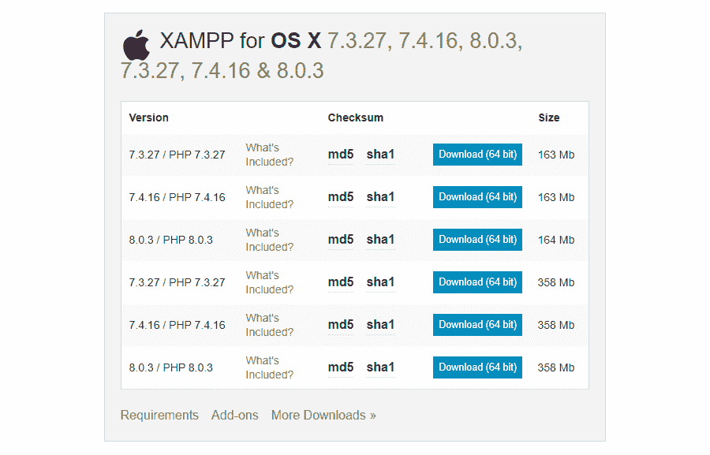
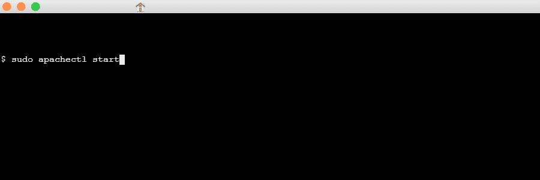
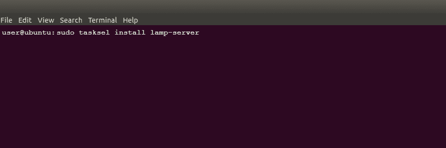
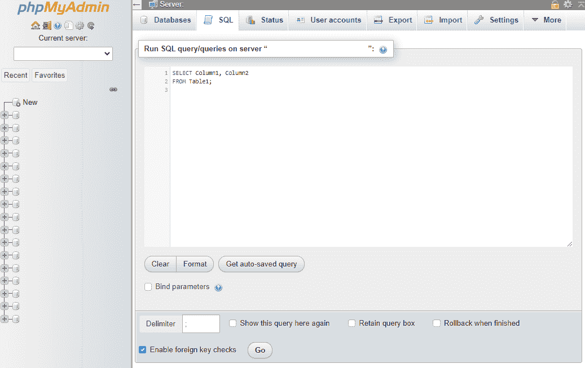
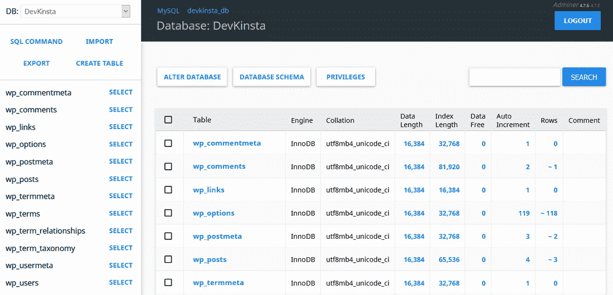

# 如何在任何操作系统上安装 phpMyAdmin

> 原文:[https://kinsta.com/blog/install-phpmyadmin/](https://kinsta.com/blog/install-phpmyadmin/)

管理数据库是运行网站的一个复杂但必要的部分。幸运的是，像 phpMyAdmin 这样的软件的存在使得这个过程变得更加容易。这种流行的管理工具似乎很难学习，但是一旦掌握了窍门，访问和修改数据库将变得轻而易举。

最困难的部分是知道如何安装 phpMyAdmin 并在您的 web 服务器上设置它。如果你有麻烦，你肯定不是唯一一个。

在本文中，我们将逐步向您展示如何在所有主流操作系统上安装 phpMyAdmin，以及如何从那里配置它。

我们走吧！

 <kinsta-auto-toc heading="Table of Contents" exclude="last" list-style="arrow" selector="h2" count-number="-1">### 更喜欢看[视频版](https://www.youtube.com/watch?v=PxAwg6AYvCg)？

<kinsta-video src="https://www.youtube.com/watch?v=PxAwg6AYvCg"></kinsta-video>

## **phpMyAdmin 是什么？**

每个网站背后都是一个数据库。该数据库允许您存储从用户帐户信息到您在站点上发表的帖子的数据。虽然有许多数据库服务，但 MySQL 是最受欢迎的。最有可能的是，这是你的网站正在使用的。 [MariaDB](https://kinsta.com/blog/mariadb-vs-mysql/) 是一个常见的替代品。

<link rel="stylesheet" href="https://kinsta.com/wp-content/themes/kinsta/dist/components/ctas/cta-mini.css?ver=2e932b8aba3918bfb818">


> Kinsta 把我宠坏了，所以我现在要求每个供应商都提供这样的服务。我们还试图通过我们的 SaaS 工具支持达到这一水平。
> 
> <footer class="wp-block-kinsta-client-quote__footer">
> 
> 
> 
> <cite class="wp-block-kinsta-client-quote__cite">Suganthan Mohanadasan from @Suganthanmn</cite></footer>

[View plans](https://kinsta.com/plans/)

直接与 MySQL 交互可能会很复杂和令人困惑，尤其是如果您是网站管理新手的话。但是[与你的数据库](https://kinsta.com/knowledgebase/wordpress-database/)互动通常是网站维护的必要部分。

phpMyAdmin 的创建是为了给 MySQL 带来一个基于浏览器的可视化界面，并使其更容易与您的数据库一起工作。由于它的流行，许多虚拟主机服务包括 phpMyAdmin，[包括 Kinsta](https://kinsta.com/help/db-access/) 。

[Managing a database can be complicated 😅 phpMyAdmin exists to make the process much easier ✅ Learn how to install and configure it right here.Click to Tweet](https://twitter.com/intent/tweet?url=https%3A%2F%2Fkinsta.com%2Fblog%2Finstall-phpmyadmin%2F&via=kinsta&text=Managing+a+database+can+be+complicated+%F0%9F%98%85+phpMyAdmin+exists+to+make+the+process+much+easier+%E2%9C%85+Learn+how+to+install+and+configure+it+right+here.&hashtags=PHP%2CWPTips)

### **为什么需要 phpMyAdmin？**

如果没有像 phpMyAdmin 这样的工具，访问数据库的唯一选择就是命令行。这意味着你没有可视界面——只有一个文本提示，你可以在那里输入命令。这样做可能会令人困惑，甚至可能导致意外破坏您的网站。

phpMyAdmin 是免费和开源的。广泛的网络主机支持它，你甚至可以自己安装它，而不用支付一分钱。安装后，从可视化界面执行数据库命令会更加直观。

还在观望吗？您可以自己尝试 phpMyAdmin，看看它是否是您想要使用的数据库管理器。一旦您对它进行了测试并决定您会喜欢它，您就可以在您的服务器上安装该工具。
T3】

## **phpMyAdmin 需求**

幸运的是，安装 phpMyAdmin 的要求相对简单。如果您有任何类型的 web 服务器，您应该几乎肯定能够让它运行起来。以下是详细的要求:

*   任何类型的网络服务器
*   MySQL 或 MariaDB 5.5 或更新版本
*   一个支持 Javascript、cookies 和 Bootstrap 4.5 的 web 浏览器(用于访问 phpMyAdmin)
*   PHP 7.2.5 或更新版本
*   额外的 PHP 需求:会话和 SPL 扩展、hash、ctype 和 JSON 支持。其他扩展如 mbstring 可以提高性能或增加额外的次要功能(完整列表见[需求页面](https://docs.phpmyadmin.net/en/latest/require.html))。


phpMyAdmin system requirements.


在您尝试安装 phpMyAdmin 之前，请记住许多 web 主机已经安装了它。金斯塔就在其中；如果你想访问数据库管理器，登录你的 Kinsta 账户，然后进入**信息**选项卡，寻找**数据库访问**。

在安装 phpMyAdmin 之前，检查您的 web 主机的文档，确保他们还没有安装它。

## **逐步安装 phpMyAdmin**

一旦您确认您的服务器支持 phpMyAdmin，就该开始安装它了。Web 服务器有各种各样的操作系统，所以我们包含了所有最流行的操作系统，包括 Windows、Mac 和 Linux 的多个发行版。

至此，下面是安装 phpMyAdmin 的逐步说明。

### **如何在 Windows 10 上安装 phpMyAdmin**

如需求所述，您需要一个带有 PHP 的 web 服务器和一个数据库来使用 phpMyAdmin。虽然您无疑可以手动下载 Apache、PHP 和 MySQL，但是有一个更简单的方法可以让服务器在 Windows 计算机上运行。

WAMP(Windows、Apache、MySQL 和 PHP)是一款免费软件，可以让你轻松创建一个具备所有必备条件的服务器。如果更适合你的需要，你也可以尝试一下 T2 XAMPP 的 Windows T3(Apache，MariaDB，PHP 和 Perl)。


WAMPserver’s homepage.


一旦你下载了其中一个，就只需要[安装它](https://make.wordpress.org/core/handbook/tutorials/installing-a-local-server/wampserver/)并完成安装过程。

假设你用 WAMP 或 XAMPP。这两个都是 phpMyAdmin 自带的！在你的浏览器中，导航到`http://localhost/phpMyAdmin`**，你应该会看到登录屏幕，确认你已经正确安装了所有的东西。**

 **### **如何在 Mac 上安装 phpMyAdmin**

在 Mac 上使用 phpMyAdmin 有点不同。所有的先决条件都是一样的。但是由于 macOS 同时附带了 Apache 和 PHP，所以您不需要下载它们。

有了 Mac，你有两个选择:你可以像使用其他操作系统一样使用 XAMPP，或者手动安装。



XAMPP OSX download list.


[下载 OS X 版 XAMPP](https://www.apachefriends.org/download.html)，打开它，放入你的应用程序文件夹。

从`/Applications/XAMPP/manager-osx.app`打开 XAMPP 控件，启动你的 Apache 和 MySQL 服务器。如果您随后访问`http://localhost`，您应该会发现一切工作正常，并且您的 phpMyAdmin 登录在“工具”部分下。

如果您想手动安装 phpMyAdmin，这个过程很简单。既然已经有了 Apache 和 PHP，那么只需要[下载 MySQL](https://dev.mysql.com/downloads/mysql/) 即可。确保从下拉列表中选择 macOS。下载并安装该文件，按照说明操作，并记录给你的任何用户名和密码。

然后，您可以打开“系统偏好设置”并启动 MySQL 来启动服务器。您也可以通过在终端中运行以下命令来启动 Apache:

```
sudo apachectl start
```



Command to start Apache in Mac Terminal.


这样，剩下的就是安装 [phpMyAdmin](https://www.phpmyadmin.net/downloads/) 。将文件夹重命名为“phpMyAdmin ”,并将其移动到/Library/WebServer/Documents/。通过在浏览器中访问 http://localhost/phpMyAdmin，检查以确保它安装正确。

如果你已经安装了 [Homebrew](https://brew.sh/) ，另一个选项是输入命令: [brew install phpMyAdmin](https://formulae.brew.sh/formula/phpmyadmin) 。

### **如何在 Ubuntu 上安装 phpMyAdmin**

作为最流行和最容易使用的 Linux 发行版之一，Ubuntu 是您的服务器的一个好选择。

虽然总是可以手动安装 Apache 和 MySQL，但是 Linux 有自己的标准服务器软件“堆栈”，称为 LAMP (Linux、Apache、MySQL 和 PHP)。不像 WAMP 和 XAMPP，phpMyAdmin 没有附带这个，所以您需要手动安装它。幸运的是，Ubuntu 允许你通过命令行完成所有的安装。

首先，检查 [tasksel](https://help.ubuntu.com/community/Tasksel) 是否启用。Ubuntu 的服务器版本应该已经安装了，但是如果你有一个桌面版本，你可以用这个命令来启用它:

```
sudo apt-get install tasksel
```

之后，您可以使用 tasksel 安装 LAMP 服务器，命令如下:

```
sudo tasksel install lamp-server
```



Installing LAMP Server via command line in Ubuntu.


现在，您可以安装 phpMyAdmin:

```
sudo apt install phpMyAdmin
```

这样，您就有了在计算机上运行服务器所需的所有文件。

### **如何在 CentOS 7 上安装 phpMyAdmin**

在 CentOS 7 上安装 phpMyAdmin 与其他发行版非常相似，但是命令略有不同，因为这个操作系统使用 Yum 而不是典型的 apt 命令。

也没有一个简单的 LAMP 栈可以一次性安装您需要的所有服务器组件，所以您需要手动下载 Apache、MySQL 和 PHP。幸运的是，这些可以通过命令行轻松获得。

首先，让我们使用命令行下载一个 LAMP 堆栈，从 Apache 开始:

```
sudo yum install httpd.service
```

要启动 Apache 服务器并确保它在引导时运行，请使用以下命令:

```
sudo systemctl start httpd.service
sudo systemctl enable httpd.service
```

现在是安装数据库的时候了。CentOS 7 默认安装 MariaDB。它也完全兼容 phpMyAdmin，所以使用起来很安全。虽然可以下载 MySQL，但这是一个复杂得多的过程。我们用 MariaDB:
sudo yum 安装 MariaDB-服务器 Maria db

现在我们可以运行它并使它在引导时启动:

```
sudo systemctl start mariadb
sudo systemctl enable mariadb.service
```

要完成 MariaDB 的安装并确保其安全，请使用以下命令运行安全安装设置。

```
sudo mysql_secure_installation
```

最后，我们可以用附加的 MySQL 包安装 PHP。

```
sudo yum install php php-mysql
```

您还需要重启 Apache 服务器，这样它就可以和 PHP 一起正常工作了。

```
sudo systemctl restart httpd.service
```

这样，您就有了所需的 LAMP 堆栈，最终可以开始下载 phpMyAdmin 了。因为它不在 Yum 存储库中，所以您需要使用以下命令安装 EPEL 存储库:

 ## 注册订阅时事通讯


### 想知道我们是怎么让流量增长超过 1000%的吗？

加入 20，000 多名获得我们每周时事通讯和内部消息的人的行列吧！

[Subscribe Now](#newsletter)

```
sudo yum install epel-release
```

并安装 phpMyAdmin。

```
sudo yum install phpMyAdmin
```

在 CentOS 7 上还需要几个步骤，但是现在您应该已经准备好一台服务器来进行配置了。

### **如何在 Debian 上安装 phpMyAdmin**

与 CentOS 7 非常相似，您需要使用命令行手动安装 LAMP 堆栈。首先，让我们用下面的命令获取 Apache:

```
sudo apt install apache2
```

接下来，我们将安装 MariaDB。与 CentOS 7 一样，这个 Linux 发行版与 MariaDB 配合得更好，我们建议您使用那个版本。

```
sudo apt install mariadb-server
```

和 CentOS 7 一样，您应该运行安全安装来添加数据库密码，并确保一切都是安全的。

```
sudo mysql_secure_installation
```

最后，我们可以安装 PHP 和一些你的服务器需要的额外的包。

```
sudo apt install php php-mysql libapache2-mod-php
```

最后，我们可以安装 phpMyAdmin。

```
sudo apt install phpMyAdmin
```

## **如何访问 phpMyAdmin**

一旦正确安装了 phpMyAdmin，访问它和登录在任何操作系统上都是一样的。

你需要你的网络服务器的地址，然后在它的末尾加上`/phpMyAdmin/`。如果您刚刚在计算机上设置了一个服务器，地址很可能只是“localhost”，因此请访问此链接:

```
http://localhost/phpMyAdmin
```

它也可能是一个 IP，或者甚至是一个命名的地址，如果这是一个你已经在网上运行的服务器的话。如果不确定，可以在 Apache 或 MySQL 配置文件中找到地址。

一旦你进入登录界面，你需要一个用户名和密码。如果这是全新安装，用户名可能是“root”，您可以将密码留空。如果这不起作用，密码可能是“密码”


phpMyAdmin login screen.


如果您无法登录，请检查 phpMyAdmin 或 MySQL 配置文件以找到您的登录信息。您可能还在安装过程中更改了登录信息。

如果 Linux 用户在访问页面或登录时遇到问题，他们应该尝试下面的 [Linux 命令](https://kinsta.com/blog/linux-commands/):

需要一个给你带来竞争优势的托管解决方案吗？Kinsta 为您提供了令人难以置信的速度、最先进的安全性、现代化的仪表盘和自动缩放功能。查看我们的计划！

```
sudo dpkg-reconfigure phpMyAdmin
```

最后，您应该注意，如果您使用的是预装 phpMyAdmin 的 web 主机，如 Kinsta，您通常可以在您的主机仪表板中找到登录信息和链接。在这种情况下，您不需要在服务器上手动安装 phpMyAdmin。

## **配置 phpMyAdmin**

安装好数据库管理器并准备在您的系统上运行后，您应该知道如何[配置 phpMyAdmin](https://docs.phpmyadmin.net/en/latest/config.html) 。像任何服务器软件一样，你肯定想对设置做大量的修改。

未配置的 phpMyAdmin 也可能带来潜在的安全风险。您需要采取一些额外的步骤来锁定您的系统。

如果您需要恢复数据库的备份，您可以使用 phpMyAdmin 导入一个新的 SQL 文件。在对数据库或其设置进行任何重大修改之前，总是要进行频繁的备份，尤其是当您不只是在测试服务器上工作时。

### **如何运行 SQL 查询**

现在 phpMyAdmin 已经可以工作了，您应该知道如何做它应该做的事情:运行 SQL 查询。

您可以在主页上运行查询(这将应用于整个网站)，也可以在特定的数据库或表格中运行查询。点击屏幕顶部的 **SQL** 选项卡，键入您的命令，然后按 **Go** 。



Running a SQL query in phpMyAdmin.


以下是常见 SQL 查询的列表:

*   **Select:** 最重要的标签，用在几乎每个查询的开头。
*   **创建表格:**创建新的表格。
*   **更改表格:**添加新列。
*   **插入:**添加新行。
*   **删除:**删除列。
*   **更新:**编辑表格中的值。
*   **Sum():** 将所有值相加。
*   **Avg():** 对值进行平均。
*   **Count():** 统计填充的列数。
*   **Round():** 将值舍入到您设置的整数。
*   **Max():** 返回最大值。
*   **Min():** 返回最小值。
*   **Between:** 选择特定范围内的列。
*   **分组依据:**根据数据对表格进行分组。
*   **排序依据:**按照一定的方式对结果进行排序。

当然，还有更多的命令需要学习，但这只是开始的一部分。

### **如何更改默认的 phpMyAdmin URL**

将 phpMyAdmin 访问链接保留为默认设置(`http://website.com/phpMyAdmin`)可能会带来安全风险。

如果你让这个页面容易被找到，黑客将能够访问它，并试图暴力破解你的用户名和密码。如果您将凭证留在默认的“root”和“password”上，情况会更糟

但是，通过将 URL 更改为只有您知道的内容，您可以使未知用户更难访问该页面并试图猜测密码。

在文本编辑器中打开 **phpMyAdmin.conf** ，你可以在 Windows/WAMP 的`C:\wamp\alias`、XAMPP 的`xampp\apache\conf\extra`、Linux 的`/etc/httpd/conf.d`或 Mac 的`/usr/conf/extra`下找到。

你应该看到这一行:

```
Alias /phpMyAdmin /usr/share/phpMyAdmin
```

将`/phpMyAdmin`路径更改为您选择的新地址。例如:

```
Alias /exampleURL /usr/share/phpMyAdmin
```

现在，您可以通过访问您设置的自定义地址(`http://website.com/exampleURL`)来访问 phpMyAdmin 的这个唯一的 URL。

### **如何设置 NGINX 认证网关**

另一个选择是用认证网关建立第二层安全。将 phpMyAdmin 登录页面移动到一个秘密位置后，您可以用密码保护这个页面，使攻击者更不可能通过。

NGINX 服务器上的 Linux 用户可以在命令行中运行以下命令来[创建认证网关](https://www.digitalocean.com/community/tutorials/how-to-install-and-secure-phpmyadmin-with-nginx-on-ubuntu-16-04)(这在 [Apache 服务器](https://www.digitalocean.com/community/tutorials/how-to-install-and-secure-phpmyadmin-with-apache-on-a-centos-7-server)上也是可能的)。

首先创建一个加密的密码(将“example”改为您喜欢的任何名称)并记下结果:

```
openssl passwd example
```

在 NGINX 的文件夹中创建一个配置文件，并为其命名:

```
sudo nano /etc/nginx/examplename
```

像这样在这个文件中输入用户名和密码，注意不要用冒号:

```
exampleusername:examplepassword
```

现在打开 NGINX 配置文件。

```
sudo nano /etc/nginx/sites-available/default
```

在“server”块中，我们将通过粘贴以下代码来添加网关(确保更改值)。

```
location /example {
  auth_basic "Login";
  auth_basic_user_file /etc/nginx/examplename;
```

第一个`/example`应该是您将 phpMyAdmin URL 设置为的值，您可以将`auth_basic`变量名调整为您想要的值，最后一个`/examplename`应该是您之前创建的密码文件的名称。

现在登录时，在看到 phpMyAdmin 登录之前，应该要求您输入您设置的凭证。

## adminer:phpMyAdmin 的一个更简单的替代方案

Adminer 是一个免费的开源数据库管理工具，类似于 phpMyAdmin。以前称为 phpMinAdmin，Adminer 被明确设计为 phpMyAdmin 的更简单、[更好的替代方案。](https://kinsta.com/blog/adminer/#adminer-vs-phpmyadmin)

在任何 web 服务器上部署都很容易。只需上传一个轻量级的 PHP 文件。


Exploring a WordPress database with Adminer.


甚至连 Kinsta 的免费本地开发工具套件 DevKinsta 也使用 Adminer 来运行其数据库管理器。它支持许多强大的数据库管理功能，例如轻松的数据库切换、查看和编辑表格、操作数据库值、导入和导出数据库、运行 SQL 查询等等。



Adminer powers DevKinsta’s database manager.


你可以在我们专门的 [Adminer 文章](https://kinsta.com/blog/adminer/)中了解更多关于 Adminer、它的特性以及如何使用它。

[Need a little help installing & configuring this popular administration tool? ⬇️ This guide has you covered ✅Click to Tweet](https://twitter.com/intent/tweet?url=https%3A%2F%2Fkinsta.com%2Fblog%2Finstall-phpmyadmin%2F&via=kinsta&text=Need+a+little+help+installing+%26amp%3B+configuring+this+popular+administration+tool%3F+%E2%AC%87%EF%B8%8F+This+guide+has+you+covered+%E2%9C%85&hashtags=PHP%2CWordPress)

## **总结**

您第一次使用 phpMyAdmin 可能会感到害怕。但是一旦你知道如何安装和配置它，访问你的数据库就像登录 WordPress 一样简单。

Windows、Mac 和 Linux 用户都可以使用这个非常有用的数据库管理器。只要你有一个安装了 PHP 的 web 服务器，如果你按照我们的说明去做，让它运行起来应该很简单。记住要正确地配置它并确保它是安全的，这样你就不会再有修改数据库的麻烦了。

* * *

让你所有的[应用程序](https://kinsta.com/application-hosting/)、[数据库](https://kinsta.com/database-hosting/)和 [WordPress 网站](https://kinsta.com/wordpress-hosting/)在线并在一个屋檐下。我们功能丰富的高性能云平台包括:

*   在 MyKinsta 仪表盘中轻松设置和管理
*   24/7 专家支持
*   最好的谷歌云平台硬件和网络，由 Kubernetes 提供最大的可扩展性
*   面向速度和安全性的企业级 Cloudflare 集成
*   全球受众覆盖全球多达 35 个数据中心和 275 多个 pop

在第一个月使用托管的[应用程序或托管](https://kinsta.com/application-hosting/)的[数据库，您可以享受 20 美元的优惠，亲自测试一下。探索我们的](https://kinsta.com/database-hosting/)[计划](https://kinsta.com/plans/)或[与销售人员交谈](https://kinsta.com/contact-us/)以找到最适合您的方式。**</kinsta-auto-toc>