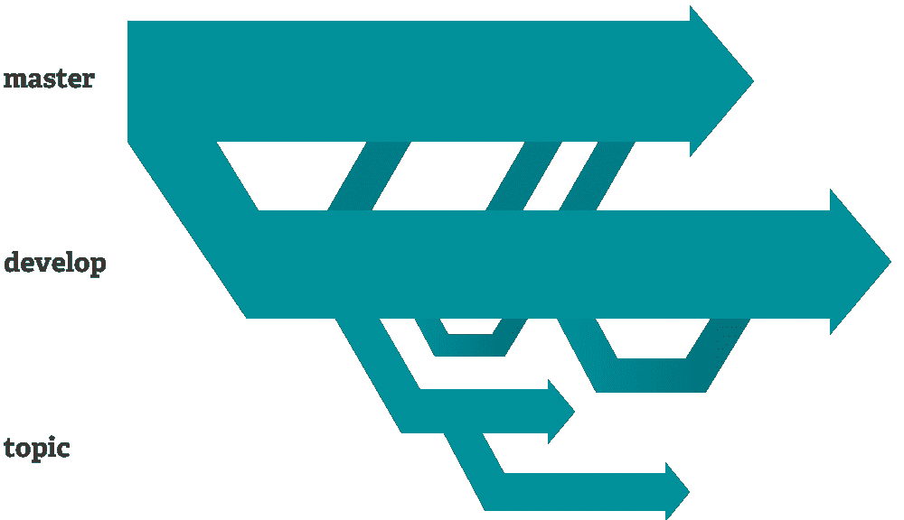
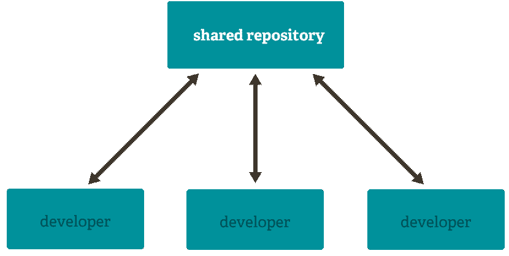
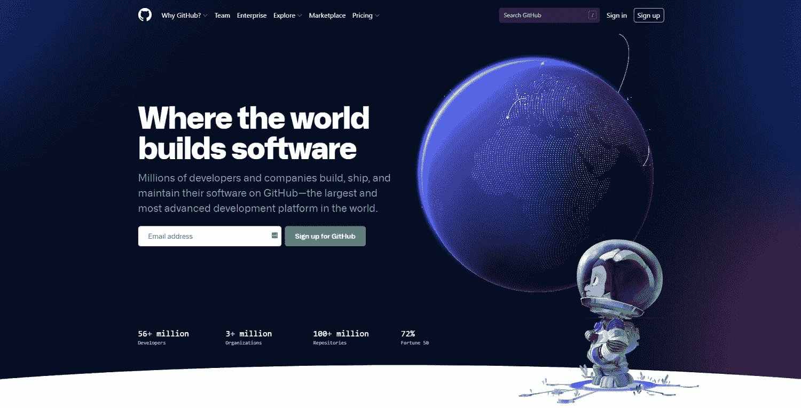
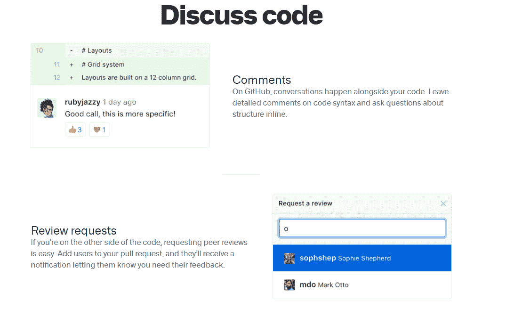
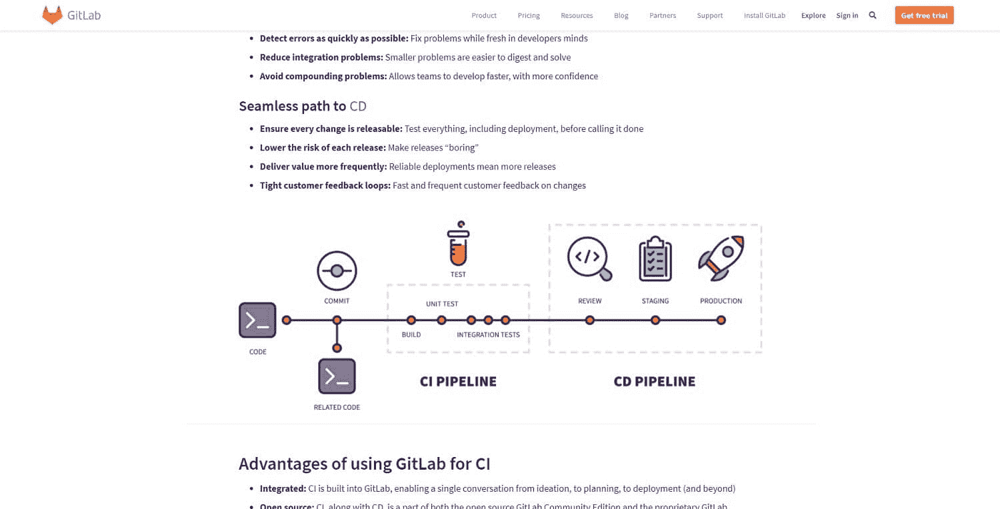
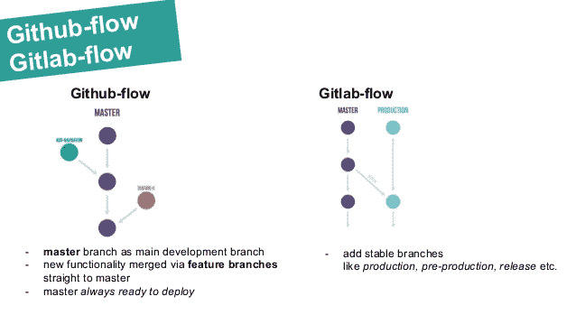
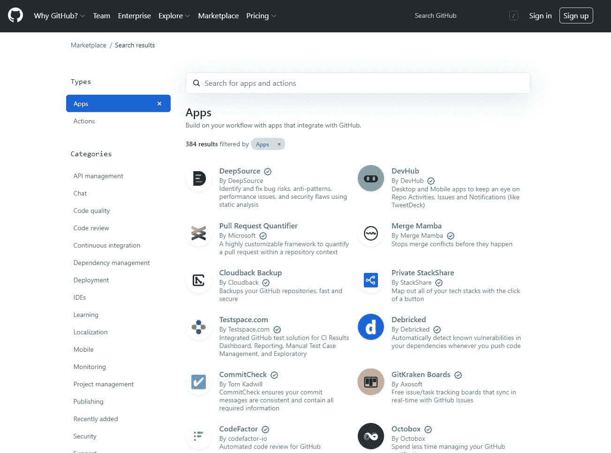
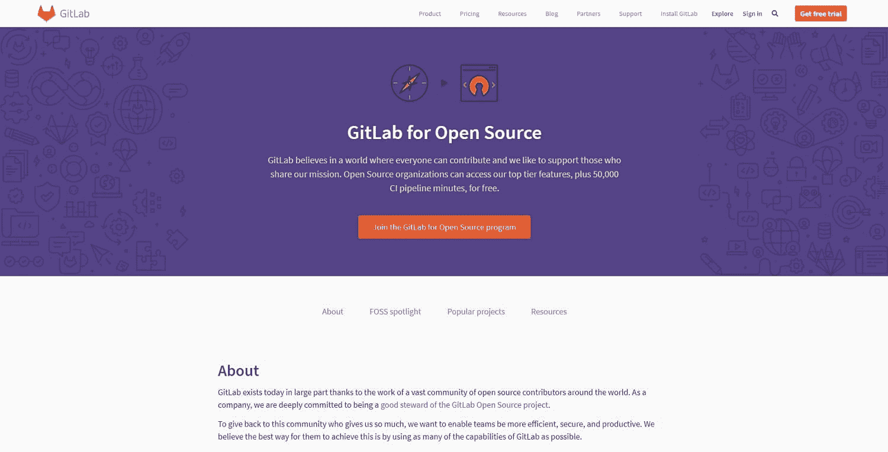
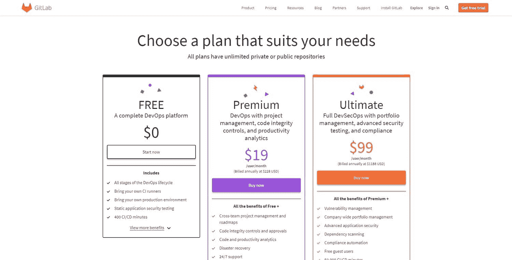
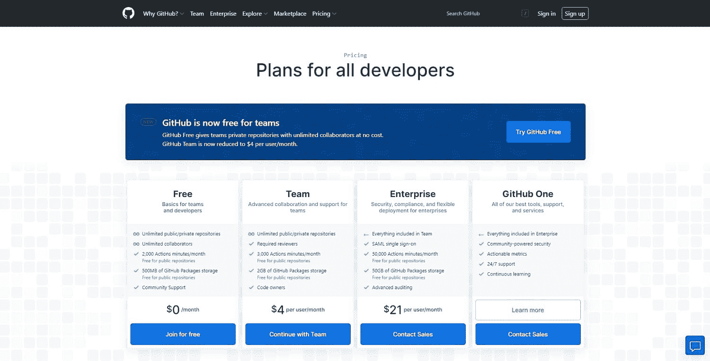

# GitLab 与 GitHub:探索它们的主要区别和相似之处

> 原文:[https://kinsta.com/blog/gitlab-vs-github/](https://kinsta.com/blog/gitlab-vs-github/)

说到 GitLab vs GitHub，2022 年你的团队最好的开发平台是什么？哪种解决方案最适合您的使用情形？

这些是我们在今天的帖子中要回答的关键问题。

GitLab 和 GitHub 都是专注于分布式版本控制的开源 Git 系统的开发平台。多达 87.2%的被调查开发人员依赖 Git 进行版本控制、协作和更顺畅的部署。

Git 已经成为初创公司、企业甚至政府职位的开发人员的基础工具。也可以[在 Kinsta](https://kinsta.com/help/git/) 使用 Git。

这就是为什么为您的团队选择正确的工具如此重要。

让我们深入探讨一下 GitLab 和 GitHub 的区别，各自的优缺点，你应该选择哪个。

 <kinsta-auto-toc heading="Table of Contents" exclude="last" list-style="arrow" selector="h2" count-number="-1">## Git 和基于云的 Git 库的基础知识

如果你是一个完全的初学者，不熟悉 Git，在选择正确的选项之前，你应该学习一些基础知识。但是如果您是一个有经验的 Git 用户，可以跳过这一部分。

<link rel="stylesheet" href="https://kinsta.com/wp-content/themes/kinsta/dist/components/ctas/cta-mini.css?ver=2e932b8aba3918bfb818">

Git 是一个开源的[版本控制系统(VCS)](https://kinsta.com/blog/wordpress-version-control/) ，可以让你保存软件项目的“快照”。它会记录你对任何程序所做的所有更改。

它与传统版本控制的不同之处在于，您可以在软件的不同分支版本上工作，并同时管理它们。

然后，当您最终确定一个更好的变体时，您可以通过将它们与一个临时分支和活动版本合并来测试它们。

Git 树枝([来源](https://git-scm.com/about/distributed) )

只有使用 Git，您才能有同时处理不同版本的自由。对于任何想要进行基于特性的开发的团队来说，这都是必备的。

使用 Git，所有这些都在本地计算机上进行。但是您也可以手动请求和授予其他开发人员访问权限——例如，通过局域网。

Git 共享库([来源](https://git-scm.com/about/distributed) )

大多数公司在与大型远程或分布式团队合作时，都会转向基于云的解决方案。进入 GitLab 和 GitHub。

他们为存储库提供无限制的基于云的存储。来自世界各地的开发人员可以轻松地协作编写代码。他们无需设置虚拟局域网或手动共享存储库就可以做到这一点。

但是像 GitHub 和 GitLab 这样的基于云的 Git 库超越了基本的 Git 功能。它们还包括项目管理、协作和部署工具，以帮助改进开发工作流程。

我们的 [Git vs GitHub](https://kinsta.com/knowledgebase/git-vs-github/) 帖子更详细地解释了这些方面。或者你可以看下面的视频:

 <kinsta-video src="https://www.youtube.com/watch?v=21Gl97tkbHU">现在，让我们看看 GitLab 和 GitHub 是如何相互竞争的。

[💥GitLab vs. GitHub💥哪个适合你和你的团队？👩‍💻 点击推文](https://twitter.com/intent/tweet?url=https%3A%2F%2Fkinsta.com%2Fblog%2Fgitlab-vs-github%2F&via=kinsta&text=%F0%9F%92%A5+GitLab+vs.+GitHub+%F0%9F%92%A5+Which+one+is+right+for+you+and+your+team%3F+%F0%9F%91%A9%E2%80%8D%F0%9F%92%BB&hashtags=WebDev%2CGitLab)
<kinsta-advanced-cta language="en_US" type-int-post="91405" type-int-position="0"></kinsta-advanced-cta>

## GitLab vs GitHub:基础知识

让我们从基础开始，快速探索每个平台和每个公司带来的东西。

### GitLab 是什么？

GitLab 主页

GitLab 是一个基于云的 Git 和 DevOps 平台，帮助开发人员监控、测试和部署他们的代码。

一个云 Git 仓库曾经是 GitLab 的主要卖点。但是这个平台已经超越了它简单的起源。今天，GitLab 提供了许多 [DevOps](https://kinsta.com/blog/wordpress-devops/) 特性，比如持续集成、安全性，甚至应用部署工具。

GitLab 最初是作为 GitHub 的一个自托管开源替代方案。它现在还提供基于云的免费和付费 SaaS 计划。

它也给你必要的[项目管理工具](https://kinsta.com/blog/wordpress-project-management-plugins/)来监控你的团队成员。它不仅仅是软件源代码的版本控制系统。

### 什么是 GitHub？

GitHub 主页

GitHub 是最初的基于云的 Git 平台之一，允许开发者托管和监控他们的代码变更。它也已经发展成为一个成熟的开发平台。

但它不像 GitLab 那样是一个“现成的”包，而是选择给开发者通过 GitHub 市场免费实现应用和集成的选项。

重点是利用活跃的 GitHub 社区，让他们贡献他们所缺少的功能。

### GitLab 和 GitHub 是同一家公司吗？

不，这两种在线服务是由完全不同的公司提供的。GitLab Inc .是一家完全远程的私有公司，拥有 1，303 名员工。

GitHub 是微软的子公司，总部位于旧金山，在全球拥有 1600 多名员工。

尽管这是一个常见的问题，也是一个误解，但这两家公司除了是竞争对手之外，完全没有关系。这就好比认为可口可乐和百事可乐是同一家公司。

### 微软也拥有 GitLab 吗？

不，微软没有 git lab——只有 GitHub。

GitLab 是一家私人公司，由几家风险投资者和风险投资基金持有少数股权。特别是，高盛和 Iconiq Capital 是 GitLab 的重要投资者。

GitLab 过去将其服务托管在微软 Azure T1 上，但在 T4 微软收购 GitHub T5 后转移到了 T2 谷歌云平台 T3 上。

## GitLab 与 GitHub:相似之处

好的，现在我们知道尽管提供——乍一看——非常相似的服务，这些公司是 100%不相关的。

接下来，让我们看看名字和主页的表层之外的一些更具体的相似之处。我们将从深入研究这些特性开始。

### GitLab vs GitHub:功能分解

就整体的高级功能而言，这两种服务之间几乎没有什么区别。GitLab 提供的大部分东西，GitHub 菜单上也有，反之亦然。

| **功能** | **GitLab** | **GitHub** |
| 饭桶 | -好的 | -好的 |
| 自托管版本 | -好的 | (带有企业计划) |
| 持续集成和交付 | -好的 | (使用第三方应用程序) |
| 基于 Wiki 的文档 | -好的 | -好的 |
| 预览代码更改 | -好的 | -好的 |
| 问题跟踪器 | -好的 | -好的 |
| [代码审查](https://kinsta.com/blog/code-review-tools/) | -好的 | -好的 |
| 多重问题受托人 | (付费计划) | (免费计划中唯一的公共存储库) |
| 项目管理委员会 | -好的 | -好的 |
| 团队讨论 | -好的 | -好的 |
| 时间跟踪 | -好的 | (带应用程序) |
| 安全性和合规性工具 | -好的 | -好的 |
| 负载性能测试 | (付费计划) | (带应用程序) |
| 浏览器性能测试 | (付费计划) | (带应用程序) |
| 迭代和冲刺计划(包括燃尽图) | (付费计划) | (带应用程序) |
| 问题相关性 | (付费计划) | -好的 |

不存在一个提供商提供支持而另一个提供商不提供支持的重要领域。区别在于如何访问这些功能。

很多情况下你需要使用一个 app 或者第三方集成 GitHub。您可以获得相同的结果—特性—但是您需要通过一些额外的障碍才能实现。稍后我们将更详细地介绍这种差异，因为我们会指出服务的不同之处。

让我们超越特性列表，看看这两者是如何与 Git 相匹配的。

### 版本控制和 Git 功能

Git 功能和基本命令在两个平台之间基本保持不变:

*   **分支**:用分支命令创建一条独立的开发线。它可以代表一个次要的特性，一个开发版本，或者一个主要的分支。
*   Fork 是代码库的个人副本，任何开发人员都可以使用和试验，即使他们不是贡献者。然后，您可以发送请求，将这个分支中的更改与另一个分支进行合并。
*   **Pull**:Pull 请求(或者 GitLab 中的 merge 请求)是向编辑过的分支提交建议的代码变更。一旦被接受，它会自动将代码变更集成到相关的分支中。一个[高级开发人员](https://kinsta.com/blog/web-developer-salary/)或 QA 团队将在将任何变更整合到主分支之前对其进行测试。
*   **Merge** : GitLab 对 pull 请求的称呼。

除了将 pull 请求重命名为 merge——这可能更直观——基本的 Git 功能没有什么不同。

但是当涉及到使用这些特性的推荐工作流时，它们是非常不同的。GitLab 和 GitHub 对理想的编码工作流程有不同的看法，我们将在下一节中讨论这些差异。

版本控制系统和 Git 是这些工具必须提供的核心，但是这些天来它们仅仅成为了一个完整服务的基础。

这两个平台都提供了广泛的协作、代码审查和项目管理工具。

### 协作、代码和项目管理

两个平台都包括内置的协作和[代码审查工具](https://kinsta.com/blog/code-review-tools/)。这是两个免费版本中包含的基本套件的一部分。

例如，您可以实时查看和讨论拉(或合并)请求，进行更改，并获得代码差异的完整的可视化概述。

GitHub 代码审查工具

这些工具突出显示了所有的变更，并使审查代码的人变得容易。它可以帮助你及早发现错误，减少致命错误或安全漏洞的机会。

虽然上面的截图突出了 GitHub，但 GitLab 提供了同样强大的代码协作和审查工具。

这两个平台还包括基本的项目管理工具。

例如，在 GitLab 中，您可以创建问题之间的逻辑层次结构，添加任务列表和描述，并将不同的开发人员分配到不同的分支。

GitLab 项目管理工具

它还让您的经理能够访问进度图表，如燃尽图和其他可视化工具。

在 GitHub 中，您还可以将问题、请求和注释归类到特定的项目中。除此之外，您还可以设置和跟踪里程碑，并使用各种图表和报告来衡量生产力。

GitHub marketplace 上还提供了 500 多个项目管理应用和集成。

### github pages vs GitLab pages-github pages-git hub 页面 vs gitlab 页面

GitHub 和 GitLab 都提供免费的静态网页，上面有关于你的软件项目和库的信息。

 ## 注册订阅时事通讯

### 想知道我们是怎么让流量增长超过 1000%的吗？

加入 20，000 多名获得我们每周时事通讯和内部消息的人的行列吧！

[Subscribe Now](#newsletter)

任一平台上的开发人员都可以轻松地派生出项目，开始进行更改和试验。

【github pages】

GitHub 提供了一个基本的设置教程，包括一些基本的主题来帮助你创建你的站点。

GitHub 和 GitLab 都没有提供动态的服务器端处理，这是 PHP 或 ASP 文件所需要的。只能发布 HTML、CSS 之类的静态网站内容。

虽然这意味着你不能将你的 WordPress 站点直接转移到 GitHub 或 GitLab，但是如果你有正确的设置，你*仍然可以在 WordPress 中拥有[版本控制。有了 Kinsta，您可以使用 SSH 直接从 Git 存储库中提取。](https://kinsta.com/blog/wordpress-version-control/)*

### 无限存储库的免费计划

这两种服务都提供免费的计划和无限的存储库(公共的和私有的)。他们还在其免费选项中限制对高级管理、安全性和合规性功能的访问。

后面这些特性在任何企业优先列表中都很重要，但是小团队和自由职业者不会错过它们。

综合考虑，这两个选项非常相似。当然，这可能对你选择哪一个没有太大帮助。

所以让我们再深入一点，探索这些 Git 平台之间的一些差异。
<kinsta-advanced-cta language="en_US" type-int-post="91405" type-int-position="1"></kinsta-advanced-cta>

## GitLab 与 GitHub:主要区别

正如你可能从他们的名字中猜到的，GitLab 和 GitHub 有更多的共同点。

但这并不意味着他们没有差异。本节将介绍这两个平台之间的主要差异。

### 连续累计

用户体验最显著的不同是 GitLab 对 CI(持续集成)和 DevOps 工作流的专注。

GitLab CI 工具让您能够自动构建、暂存和部署代码，而无需依赖手动更新或笨重的定制集成。

GitLab for CI

如果您已经使用了托管的 Kubernetes 等 PaaS 解决方案，GitLab 集成将允许您自动部署、准备、测试和扩展您的应用。

只在 GitLab 中工作，您的开发团队可以专注于每天多次实时推送小更新，而不是将它们批量发布到大版本中。

实现这一点的关键之一是自动化测试工具，它可以自动扫描代码以发现潜在的安全风险。

虽然您可以使用 GitHub 设置 CI/CD 工作流，但您需要使用第三方 CI 工具，如 TravisCI 或 CircleCI。你没有与 GitHub 库直接交互的 CI 特性平台。

### GitHub 流与 GitLab 流

虽然底层的 Git 技术和特性实际上是相同的，但是推荐的工作流并不相同。差远了。

GitHub 强调速度，GitLab 强调可靠性。这就是两个云存储平台之间的区别。

GitHub 流量 vs GitLab 流量([来源](https://www.slideshare.net/BartoszKosarzycki/gitflow-workflow-and-pullrequests) )

GitHub 提倡一种[快速的、聚焦于特性的开发](https://kinsta.com/feature-updates/local-wordpress-development/)方法来**合并**(包括)新的**分支**与主分支。这个工作流程非常适合小型敏捷团队和项目。

与宕机和 WordPress 问题做斗争？Kinsta 是为节省您的时间而设计的托管解决方案[查看我们的功能](https://kinsta.com/features/)

主分支随时准备部署，确保在出现问题时您可以快速恢复现状。几秒钟就可以回滚到之前的版本。

在 GitLab 工作流程中，你在主流程之外创建多个稳定的分支，通常至少是生产和预生产。这意味着一个多步骤的测试过程，其中对合并请求的单次代码审查是不够的。

它会减缓较小团队的开发过程，直到一个新的特性在产品中投入使用。但是如果你有一个专门的 QA 团队，这是一种让你在新特性上自由地随机和团队合作的方式，而不用担心测试每一分钟的代码变化。

一些人认为这使得 GitLab 成为更注重安全性的 Git 平台，但 GitHub 也支持相同的工作流。只是官方不推荐而已。

### 完整平台与市场

GitLab 采取了一种完整的打包平台的方法，而不是让每个人都可以选择用不同的应用程序来构建自己的平台。

这并不意味着它完全没有集成。GitLab 支持与 Asana、吉拉、[微软团队、Slack](https://kinsta.com/blog/microsoft-teams-vs-slack/) 、Gmail 以及 30 多个其他应用和平台的集成。

但是，虽然你有选择，但它们比你使用 GitHub 要有限得多。GitHub 目前在其市场上有 374 个免费应用，还有许多付费选项。

GitHub 市场

但是你必须记住，通过这些第三方集成，GitHub 提供了 GitLab 的一些开箱即用的功能。

例如，GitLab 默认提供持续集成、时间跟踪和备份。然而，使用 GitHub，你需要一个应用程序来实现这个功能，比如免费的 CI 应用程序 Jenkins。

*GitHub Actions* 自动化使 CI/CD 在没有第三方工具的情况下成为可能，但你不会有同样的监督级别。

**注意:**即使 GitHub app 免费，第三方服务还是要花钱的。

### 私有服务器的自托管安装

GitLab 一开始是一个自托管的开源平台。也就是说，您仍然可以选择在虚拟机上托管 GitLab 的私有版本。

你可以通过免费的 GitLab 计划来实现，而 GitHub 只提供 GitHub 企业计划。

### 开放源码

GitLab 为使用开源软件的组织或小型团队提供免费的企业计划功能和高达 50，000 CI 分钟。

GitLab for 开源

GitLab 本身是开源软件，自托管版本，任何人都可以免费使用。

这并不是说 GitHub 不是开源代码的好选择，因为它确实为大多数开发者提供了即时访问。GitHub 还鼓励他们每周五为开源做出贡献，定期扩大可用公共资源的数量。

GitHub 的开发团队也为开源项目做出贡献——特别是 Git LFS 和其他与 Git 相关的项目。

### 付费计划和定价:GitHub Enterprise vs git lab Ultimate

虽然两个免费计划都提供无限量的公共和私人存储库，但付费计划的价格标签有明显的差异。

GitLab 的收费计划起价为每个用户/月 **$19** 。它让经理能够访问项目管理和代码完整性控制。

GitLab 定价

T4】

同样，GitHub 的付费计划也关注高级协作工具(针对私有存储库)，以及安全性和合规性特性。

但是这两个平台在定价上有明显的不同。

GitHub 团队计划起价为每个用户/月 **$4** 。

GitHub 定价

GitLab Ultimate 会让你花费 99 美元/月，而 GitHub Enterprise 则是 21 美元/月。

GitLab 将其免费计划定位为 GitHub 团队计划的竞争对手，将其高级计划定位为企业计划的对手。

但在安全和合规工具方面，你需要最昂贵的 GitLab 计划来镜像 GitHub 的功能。

## GitLab vs GitHub:哪个是最好的选择？

不幸的是，像生活中的大多数事情一样，这里没有明确的“每个人的最佳选择”。这取决于您的团队、更大的组织、目标和独特的用例。

在开箱即用的功能和自托管方面，GitLab 脱颖而出。但是 GitHub 作为市场领导者处于一个独特的位置。它有更多的集成和应用程序。

*   **对于自托管私有存储库**，GitLab 是更好的选择。您无需支付任何月订阅费即可开始使用。
*   这两个选项对于**开源项目**来说都很棒，GitLab 提供免费的高级功能，GitHub 提供对大量活跃的开源开发者的访问。
*   对于商业项目，GitHub 提供了一个非常便宜的企业计划。
*   如果你正在寻找进入 **DevOps** 的机会，GitLab 是一个更周到也可能更便宜的选择。(可以免费上手，不依赖其他付费服务。)

这也取决于你的团队已经使用和掌握了什么工具。如果 GitLab 没有提供与您经常使用的工具的集成，但 GitHub 提供了，这将使它成为您显而易见的选择。

由于 GitHub 提供的集成比 GitLab 多 300 多个，这不是一个牵强的场景。

### 为什么 GitHub 比 GitLab 更受欢迎？

GitHub 比 GitLab 更受欢迎的一个主要原因是 GitHub 领先了一步。它于 2008 年推出，而 GitLab 作为开源项目始于 2011 年。

但是，凭借内置的持续集成功能，以及私有的自托管服务器的免费选项，GitLab 开始迎头赶上。根据一项调查，GitLab [从 2018-19 年获得了 4.6%的市场份额](https://thenewstack.io/i-dont-git-it-tracking-the-source-collaboration-market/)，而 GitHub 下降了 0.4%。

但即便如此，在最新的 Stack Overflow 开发者调查中，82.8%的受访者表示使用 GitHub，只有 37%的人表示使用 GitLab。

代码协作工具用法([来源](https://insights.stackoverflow.com/survey/2020) )

虽然 GitHub 仍然是新开发人员的默认选择，但随着 GitLab 发展成为具有独特功能和优势的专业平台，这种情况正在慢慢改变。

[87.2%的开发者依赖 Git 进行版本控制、协作和更流畅的部署。👩‍💻确保您的团队在本指南的帮助下使用正确的工具✅ 点击推文](https://twitter.com/intent/tweet?url=https%3A%2F%2Fkinsta.com%2Fblog%2Fgitlab-vs-github%2F&via=kinsta&text=87.2%25+of+developers+rely+on+Git+for+version+control%2C+collaboration%2C+and+smoother+deployment.+%F0%9F%91%A9%E2%80%8D%F0%9F%92%BB+Make+sure+your+team+is+using+the+right+tool+with+help+from+this+guide+%E2%9C%85&hashtags=WebDev%2CGitHub)

## 摘要

作为 2022 年的开发者，你不能忽视 Git 这样的工具或 GitHub 和 GitLab 这样的主要云存储库提供商。

绝大多数开发人员、团队和公司使用这些工具来确保每一段代码在投入使用之前都经过仔细的审查，并且没有人的贡献会消失。

虽然从表面上看，这两种工具之间的区别似乎很小，但主要区别是:GitLab 提供了一个全面的 DevOps 平台。相比之下，GitHub 通过其应用程序市场提供深度可扩展性。

* * *

让你所有的[应用程序](https://kinsta.com/application-hosting/)、[数据库](https://kinsta.com/database-hosting/)和 [WordPress 网站](https://kinsta.com/wordpress-hosting/)在线并在一个屋檐下。我们功能丰富的高性能云平台包括:

*   在 MyKinsta 仪表盘中轻松设置和管理
*   24/7 专家支持
*   最好的谷歌云平台硬件和网络，由 Kubernetes 提供最大的可扩展性
*   面向速度和安全性的企业级 Cloudflare 集成
*   全球受众覆盖全球多达 35 个数据中心和 275 多个 pop

在第一个月使用托管的[应用程序或托管](https://kinsta.com/application-hosting/)的[数据库，您可以享受 20 美元的优惠，亲自测试一下。探索我们的](https://kinsta.com/database-hosting/)[计划](https://kinsta.com/plans/)或[与销售人员交谈](https://kinsta.com/contact-us/)以找到最适合您的方式。</kinsta-video></kinsta-auto-toc>