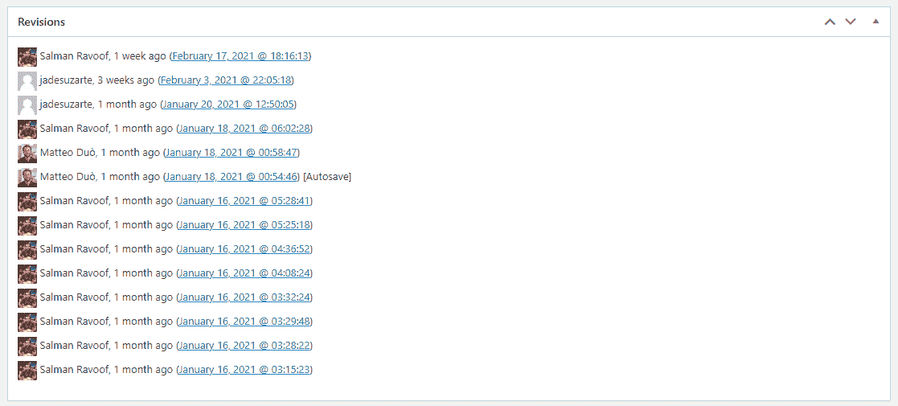
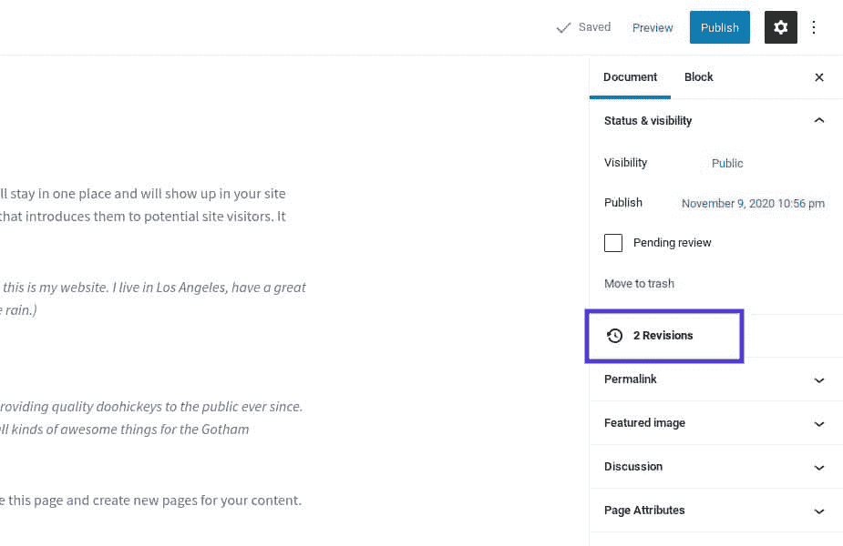
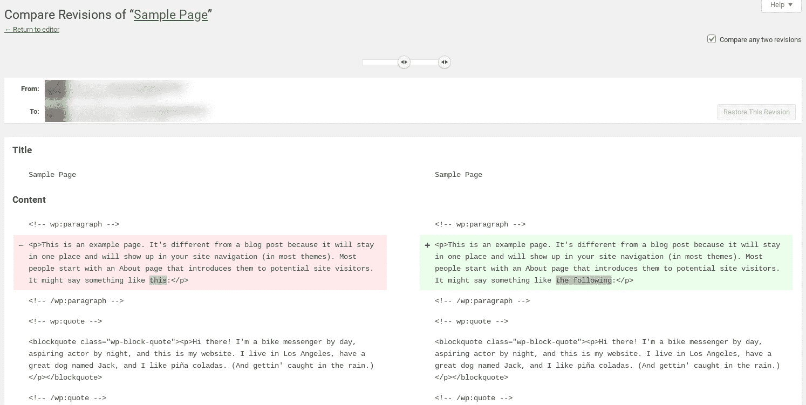
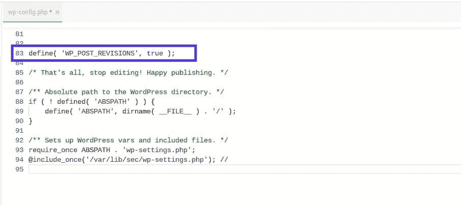
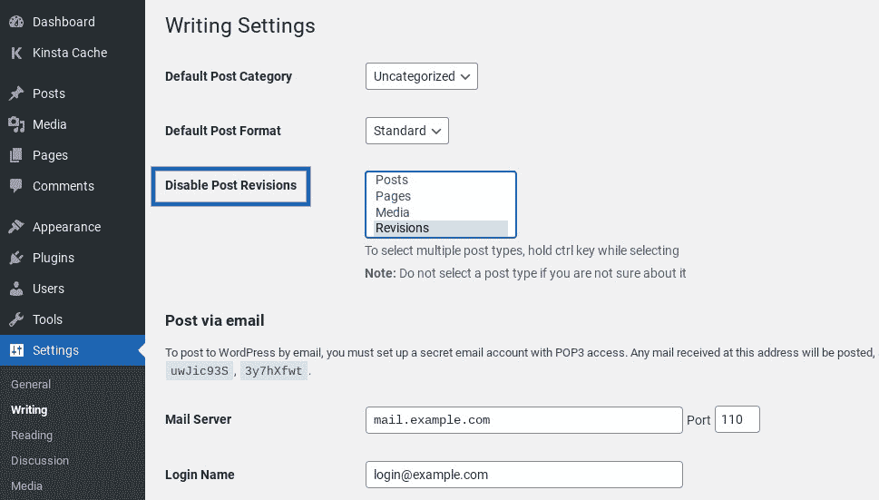
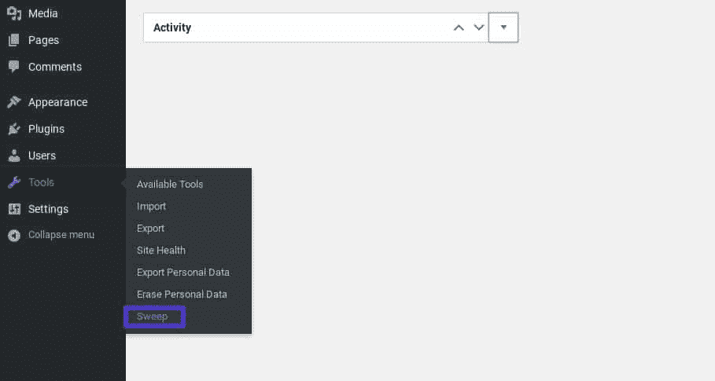
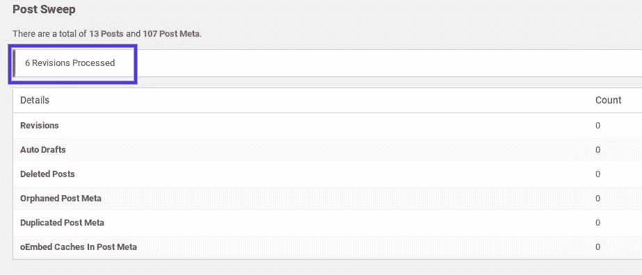
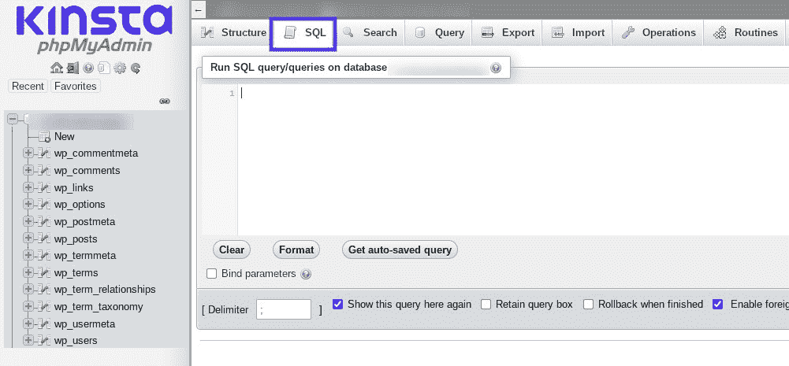

# 如何在你的网站上使用和优化它们

> 原文:[https://kinsta.com/blog/wordpress-revisions/](https://kinsta.com/blog/wordpress-revisions/)

每当你保存草稿或更新已经发布的 WordPress 页面或帖子时，[内容管理系统(CMS)](https://kinsta.com/knowledgebase/content-management-system/) 会自动创建一个修订。启用后，此功能可以防止您丢失重要的工作。不幸的是，随着时间的推移，WordPress 的修改会占用不必要的存储空间，最终[损害你网站的性能](https://kinsta.com/learn/speed-up-wordpress/)。

幸运的是，你可以使用一些方法来最小化这些存储的修订对你的站点的负面影响。例如，除了删除、禁用或限制它们之外，您还可以优化修订数据库。

在本指南中，我们将向您介绍 WordPress 修订版，并解释在哪里可以找到它们。然后，我们将带您了解如何使用修订版，并防止它们对您的网站产生负面影响。

我们开始吧！

 ### 查看[视频版本:](https://www.youtube.com/watch?v=lO7vBJ_Pz1U)


[修改:有助于保障重要工作的安全；当它们占用不必要的存储空间并影响性能时，会很烦人😅在这里了解如何防止他们对你的网站产生负面影响👇 点击推文](https://twitter.com/intent/tweet?url=https%3A%2F%2Fkinsta.com%2Fblog%2Fwordpress-revisions%2F&via=kinsta&text=Revisions%3A+helpful+for+keeping+important+work+safe%3B+annoying+when+they+take+up+unnecessary+storage+space+and+hurt+performance+%F0%9F%98%85+Learn+how+to+keep+them+from+negatively+impacting+your+site+here+%F0%9F%91%87&hashtags=WebPerf%2CWordPress)

## WordPress 版本介绍

WordPress 修订版会自动记录你在网站上对页面或帖子所做的任何更改。默认情况下，每 60 秒就会创建一个新的页面副本，每次点击**保存草稿**、**发布**或**更新**按钮时也会创建一个新的页面副本。




List of WordPress revisions of a post


WordPress 版本对任何网站所有者都有帮助。它们作为[备份](https://kinsta.com/blog/restore-wordpress-from-backup/)在发生意外中断时，例如意外关闭浏览器标签或停电时，您可以恢复它们。

它们还使您能够恢复到旧版本的内容。例如，您可能了解到[一个帖子不如以前执行](https://kinsta.com/blog/wordpress-seo/#43-conduct-regular-seo-audits)那么好，并且您想要回滚一些最近的更改。

当你有一个团队在你的网站内容上工作时，修改也是非常有用的。除了让你查看文章/页面的编辑内容，WordPress 的修订功能还会记录这些修改的用户名和时间戳。这可以增加透明度，使编辑工作的协作更加容易。
T3】

## WordPress 版本的问题是

如果你管理不当，WordPress 修订版会带来严重的问题。本质上，你在网站上添加的页面和帖子越多，就会产生越多的修改。

如果您有一个大型网站或经常进行更改，这可能会很快导致不必要的数据库膨胀。这是因为每次创建一个修订，就会在 [WordPress 数据库的](https://kinsta.com/knowledgebase/wordpress-database/) `wp_post`表中增加一行，其`post_type`值为`revision`。

你的数据库越大，它占用的存储空间就越多。不幸的是，这会降低你网站的速度，导致更长的加载时间，阻碍你网站的[用户体验](https://kinsta.com/blog/web-design-best-practices/)和[搜索引擎优化(SEO)](https://kinsta.com/blog/wordpress-seo/) 。

因此，学习如何控制 WordPress 中的修订对你有利是很重要的。无论您想要完全删除修订、禁用或限制它们，还是优化您的修订数据库，您都有许多选择。

## 在哪里可以找到 WordPress 的修订版

在讨论在 WordPress 中使用和更改修订设置的不同方式之前，首先了解在哪里可以找到它们是很重要的。在文章或页面的[编辑器屏幕](https://kinsta.com/blog/gutenberg-wordpress-editor/)上，进入右侧菜单，点击**文档**标签。

如果启用了修订，并且进行了更改，您将在**状态&可见性**部分看到修订的数量。



The WordPress revisions tool


点击此处访问**修订**页面，在这里您可以查看所有保存的编辑并并排比较任意两个修订。你会看到两列:左边显示文章或页面的前一个版本，右边显示你选择的版本。



The WordPress Revisions page


您可以使用修订滑块浏览各个[恢复](https://kinsta.com/blog/restore-wordpress-from-backup/)点。该系统突出显示添加(加号和绿色)或删除(减号和红色)的内容。

如果您想保留现有版本并返回编辑器屏幕而不做任何更改，只需点击文章标题或屏幕顶部的**返回编辑器**链接即可。
T3】

## 如何恢复到 WordPress 的旧版本

有时你可能想要[撤销在 WordPress](https://kinsta.com/knowledgebase/how-to-undo-changes-in-wordpress/) 中所做的更改。当这种情况发生时，WordPress 的修订版让这一切变得快速而简单。

默认情况下，WordPress 会按顺序显示文章或页面的修改。但是，如果您想查看或比较非连续变更，您可以通过选择屏幕顶部的**比较任意两个修订**选项来完成:


The option to compare WordPress revisions


然后选择要与之比较的版本。当您完成查看和比较修订版后，您可以通过点击**恢复此版本**来恢复旧版本。


Reverting to an old revision in WordPress


请注意，如果您单击此按钮，它将自动恢复您正在比较的版本，即显示在修订屏幕右侧栏中的版本。

## 如何启用 WordPress 修订版

通常情况下，WordPress 修订版是默认启用的。然而，根据你的主机提供商或安装 WordPress 的过程，这个功能可能会被禁用。也有可能是您或您团队中的其他人在某个时候禁用了它。

不管是哪种情况，如果你想在 WordPress 中启用修订，你可以通过编辑你站点根目录中的 [`wp-config.php`](https://kinsta.com/blog/wp-config-php/) 文件来手动完成。你可以通过[安全文件传输协议(SFTP)客户端](https://kinsta.com/knowledgebase/how-to-use-sftp/)来做到这一点。如果你不是 Kinsta 用户，而你的主机使用 cPanel，你可以使用它的**文件管理器**工具。

找到并打开文件后，搜索以下代码行:

```
define('WP_POST_REVISIONS', false);
```

将`false`值更改为`true`。

如果没有这样的行，在上面写着`“ABSPATH”`和`“/* That's all, stop editing! Happy publishing. */”`的地方添加以下内容:

```
define('WP_POST_REVISIONS', true);
```



Enabling WordPress revisions manually


不要忘记保存文件。

现在，当你重新登录到 WordPress 时，你应该看到修订功能被激活了。为了确保它启动并运行，打开任何页面或帖子的编辑器，并检查**文档**选项卡下的**修订**选项。


## 如何禁用 WordPress 修订版

相反，你可能想完全禁用 WordPress 中的修订。请记住，您也可以保持启用此功能，并限制或删除修订以最小化它们在数据库中占用的空间。我们将在下一节讨论如何做到这一点。

但是，如果您发现这个功能没有任何用途，您可以完全关闭它。为此，使用我们上面讨论的相同方法，编辑您站点的`wp-config.php`文件。唯一的区别是该值应该设置为`false`而不是`true`。

如果你不喜欢编辑你的`wp-config.php`文件，你也可以在 WordPress 中使用轻量级插件禁用修订，比如[禁用发布修订](https://wordpress.org/plugins/disable-post-revision/)。在你安装并激活这个工具后，你可以在你的 WordPress 仪表盘中进入**设置>写**来访问它:



The Disable Post Revisions WordPress plugin settings


选择要禁用修订的文章类型，然后保存更改。就是这样！

## 如何优化 WordPress 中的修订数据库

运行网站的时间越长，存储在数据库中的修订就越多。如果你花了几年时间更新和编辑你的内容，你自然会积累很多修改。

 ## 注册订阅时事通讯


### 想知道我们是怎么让流量增长超过 1000%的吗？

加入 20，000 多名获得我们每周时事通讯和内部消息的人的行列吧！

[Subscribe Now](#newsletter)

例如，如果你有一个旧的网站，在最老的或者频繁更新的页面上有超过 100 个修订版是很常见的。假设你的网站上有 800 个页面和帖子。如果其中每一个都有 100 个修订，那么在您的数据库中就有超过 80，000 个条目。这也是网上商店普遍存在的问题。

这种积累可能发生得很快，而且发生在幕后。幸运的是，除了完全禁用修订，还有一些方法可以用来优化你的 WordPress 修订。其中包括:

*   删除 WordPress 修订版
*   限制 WordPress 版本

在接下来的几节中，我们将带您了解如何手动和使用插件来执行这些任务。

如果你在一个新的网站上工作，你可以跳到下一节限制 WordPress 版本，因为你不会有任何现有的要删除。然而，如果你有一个已经建立并运行了一段时间的网站，清理你的修改以删除任何未使用或过时的内容是值得的。

## 如何删除 WordPress 修订版

你可以使用两种方法从你的站点中删除修订:手动或者通过插件。我们推荐使用插件，因为它更快，而且不需要你修改你的站点文件。

但是，如果您是开发人员并且想要更高级的方法，您也可以手动删除修订。我们将在下面讨论这两种方法。

### 如何使用插件删除 WordPress 版本

如果你想用插件删除你在 WordPress 的修改，有几个选项可供选择。


### 信息

对于 Kinsta 用户来说，值得注意的是一些流行的性能优化插件在[我们的禁用插件列表](https://kinsta.com/knowledgebase/banned-plugins/)中。它们被禁止进入我们的平台，因为它们会给我们的服务器级性能优化和安全特性带来问题。


我们推荐使用 [WP-Sweep](https://wordpress.org/plugins/wp-sweep/) 。


The WP-Sweep WordPress plugin


WP-Sweep 是一个免费的、易于使用的工具，它可以让你快速简单地清理数据库中的旧版本。要安装它，在你的 WordPress 仪表盘中导航到**插件>添加新的**。搜索插件，然后选择**立即安装**和**激活**:


Activate the WP-Sweep WordPress plugin


接下来，导航到**工具>扫描**:



Finding the WP-Sweep plugin settings in WordPress


在这个屏幕上，您将看到一个修订列表和存在的总金额。如果您点击**详细信息**，您可以访问将受到影响的帖子列表。


The WP-Sweep plugin screen


一旦您查看了这些信息并确定不会删除任何重要信息，请点击**扫描**按钮。对列表上的每一项重复这个过程。当您“浏览”您的修订时，一个对话框将显示正在处理的修订数量。

厌倦了慢热的主持人？Kinsta 的设计考虑了速度和性能。[查看我们的计划](https://kinsta.com/plans/?in-article-cta)



WordPress revisions processed using the WP-Sweep plugin


请注意，由于[性能](https://kinsta.com/blog/debugging-wordpress-performance/)的原因，这个插件一次只显示 500 个项目。如果您有一个较旧的站点，您可以预期会列出比我们的示例更多的修订，因为我们在这个演示中使用了一个测试站点。

### 如何手动删除 WordPress 修订版

你也可以手动删除 WordPress 版本。有两种方法可以做到这一点:借助插件，或者[直接从数据库](https://kinsta.com/help/db-access/)中删除条目。我们建议只有当你是一个开发者并且想避免安装另一个插件时才使用第二种方法。

对于第一种方法，下载并激活免费的[简单修订删除](https://wordpress.org/plugins/simple-revisions-delete/)插件。它没有管理或设置页面。要使用它，请访问页面/帖子编辑器，你会在每个修订旁边找到一个**删除**链接。


Using the ‘Simple Revisions Delete’ plugin


现在，您可以验证并手动删除不需要的修订。对你的修改进行微观管理是一个很好的解决方案。

如果您喜欢第二种更高级的方法，那么您可以通过访问 [phpMyAdmin](https://kinsta.com/help/wordpress-phpmyadmin/) 并运行 SQL 查询来继续。使用这种方法一定要小心。WordPress 知识库论坛上有许多[糟糕的代码片段](https://wordpress.org/support/topic/deleting-post-revisions-do-not-use-the-abc-join-code-you-see-everywhere/)。他们中的一些人可能会删除你网站上的重要内容。或者更糟的是，他们会让你的网站完全瘫痪。

要通过查询安全地删除 WordPress 中的文章修订，请登录到您的 phpMyAdmin 帐户，从左侧面板中选择您的 WordPress 数据库，然后点击 **SQL** 选项卡。



The SQL tab in phpMyAdmin


然后你可以输入一个命令在你的 WordPress 数据库上运行。在命令框中，输入以下内容:

```
DELETE FROM wp_posts WHERE post_type=”revision”;
```

你需要把`wp_`替换成你使用的 WordPress 数据库前缀。然后点击 **Go** 运行命令。您在数据库中的任何修订都将被删除。

如果你是 WordPress 开发者，你可能喜欢的另一个选择是用 WP-CLI 删除你的文章修改。以下是您可以使用的 WP-CLI 命令的示例:

```
$ wp post delete $(wp post list --post_type='revision' --format=ids)
```

你可以在 WP-CLI 文档中阅读更多关于 [`wp post delete`命令](https://wp-cli.org/commands/post/delete/)的内容。

请记住，从数据库中删除旧版本不会阻止 WordPress 为将来的页面和帖子创建旧版本。因此，限制已保存修订的数量是一个明智的想法，这样它们就不会失去控制。

## 如何在 WordPress 中限制修订

通过限制你允许的 WordPress 版本数量，你可以最小化清理数据库的频率。和删除 WordPress 修订版一样，你可以手动或者使用插件来完成。

### 如何使用插件限制 WordPress 版本

如果你喜欢使用插件来限制 WordPress 的版本，你可以使用免费的 [WP 版本控制](https://wordpress.org/plugins/wp-revisions-control/)插件。这个插件使你能够限制 WordPress 版本的数量或者完全禁用它们。

一旦它在你的网站上安装并激活，你可以通过导航到**设置>在你的[管理仪表板](https://kinsta.com/knowledgebase/wordpress-admin/)中写**，然后点击标签来限制文章的修改:


WP Revisions Control settings


接下来，设置每种文章类型的修订数量。如果你有任何自定义的文章类型，你也可以在这里看到它。

您可以设置的修订次数没有限制。另一方面，将其设置为`0`将完全禁用该文章类型的修订。完成后，点击屏幕底部的**保存更改**按钮，就可以开始了。

### 如何手动限制 WordPress 中的修订

要手动设置 WordPress 中允许的修订限制，你可以编辑你的`wp-config.php`文件中的代码。正如我们前面提到的，根据你的主机，你可以通过 cPanel 和文件管理器或者一个 [SFTP 客户端](https://kinsta.com/blog/best-ftp-clients/)来完成这个任务。

打开您的`wp-config.php`文件后，添加以下代码行:

```
define('WP_POST_REVISIONS', 3);
```

我们已经使用了`3`作为上面的示例值，但是你可以改变这个数字来反映你希望你的数据库在每页或每篇文章中存储多少修订。完成后请保存文件，并将其重新上传到服务器。

[Keep your content safe... without sacrificing valuable storage space and site performance. 🚀 Learn more in this guide to WordPress revisions👇Click to Tweet](https://twitter.com/intent/tweet?url=https%3A%2F%2Fkinsta.com%2Fblog%2Fwordpress-revisions%2F&via=kinsta&text=Keep+your+content+safe...+without+sacrificing+valuable+storage+space+and+site+performance.+%F0%9F%9A%80+Learn+more+in+this+guide+to+WordPress+revisions%F0%9F%91%87&hashtags=WordPress%2CWPTips)

## 摘要

WordPress 修订版是一个有用的功能，可以防止你丢失工作。它们使得恢复旧版本的页面和文章变得更加容易。然而，当您有一个大型或完善的站点时，修订会很快积累起来，并给数据库增加不必要的膨胀。因此，它们最终可能会损害你网站的性能。

有很多种方法可以改变你的站点处理修订的方式，这样它们就不会对你的站点产生负面影响。这包括:

1.  通过编辑您站点的`wp-config.php`文件来禁用修订功能。
2.  通过插件手动删除单个修订，如简单修订删除。或者通过 phpMyAdmin 或 WP-CLI 直接从数据库中批量删除修订，或者使用 [WP-Sweep](https://kinsta.com/blog/wordpress-database-plugin/#10-wpsweep) 之类的插件。
3.  通过编辑你的`wp-config.php`文件，或者使用免费插件，比如 [WP 版本控制](https://wordpress.org/plugins/wp-revisions-control/)，来限制 WordPress 的版本。

一个网站的性能取决于它的数据库。今天就开始优化吧！

关于使用和优化 WordPress 修订版，你有什么问题吗？请在下面的评论区告诉我们！

* * *

让你所有的[应用程序](https://kinsta.com/application-hosting/)、[数据库](https://kinsta.com/database-hosting/)和 [WordPress 网站](https://kinsta.com/wordpress-hosting/)在线并在一个屋檐下。我们功能丰富的高性能云平台包括:

*   在 MyKinsta 仪表盘中轻松设置和管理
*   24/7 专家支持
*   最好的谷歌云平台硬件和网络，由 Kubernetes 提供最大的可扩展性
*   面向速度和安全性的企业级 Cloudflare 集成
*   全球受众覆盖全球多达 35 个数据中心和 275 多个 pop

在第一个月使用托管的[应用程序或托管](https://kinsta.com/application-hosting/)的[数据库，您可以享受 20 美元的优惠，亲自测试一下。探索我们的](https://kinsta.com/database-hosting/)[计划](https://kinsta.com/plans/)或[与销售人员交谈](https://kinsta.com/contact-us/)以找到最适合您的方式。