# 如何使用 Adminer 通过一个 PHP 文件轻松管理数据库

> 原文:[https://kinsta.com/blog/adminer/](https://kinsta.com/blog/adminer/)

管理 MySQL 数据库是职业 WordPress 开发者的基本要求之一。Adminer 极大地简化了这项任务。

每个 WordPress 站点都需要一个数据库来运行——WordPress 在这个数据库中存储了所有站点的关键数据。虽然 phpMyAdmin 多年来一直是 MySQL/MariaDB 的主要数据库管理工具，但 Adminer 是一个很好的替代工具。它加载了大量有用的特性和更漂亮的用户界面，所有这些都包含在一个轻量级的 PHP 文件中，可以快速部署到您的服务器上。

在本文中，您将了解 Adminer，它比 phpMyAdmin 提供的许多好处，以及如何使用它来管理数据库。我们还将探索 [DevKinsta](https://kinsta.com/devkinsta) 如何在[本地开发环境](https://kinsta.com/blog/install-wordpress-locally/)中使用 Adminer 来简化 WordPress 数据库管理。

我们开始工作吧！

[Want to make managing MySQL databases much simpler? Enter, Adminer. ✅ Learn more about its benefits (and why it's a better choice than phpMyAdmin) right here👇Click to Tweet](https://twitter.com/intent/tweet?url=https%3A%2F%2Fkinsta.com%2Fblog%2Fadminer%2F&via=kinsta&text=Want+to+make+managing+MySQL+databases+much+simpler%3F+Enter%2C+Adminer.+%E2%9C%85+Learn+more+about+its+benefits+%28and+why+it%27s+a+better+choice+than+phpMyAdmin%29+right+here%F0%9F%91%87&hashtags=Adminer%2CMySQL)

## 什么是 Adminer？

Adminer(以前的 phpMinAdmin)是一个基于 PHP 的免费开源数据库管理工具。在您的服务器上部署非常简单。要使用它，你所要做的就是上传它的单个 PHP 文件，将你的浏览器指向它，然后登录。


Adminer login page


与 [phpMyAdmin](https://kinsta.com/help/wordpress-phpmyadmin/) 只支持管理 **MySQL** 和 **MariaDB** 数据库不同，Adminer 还支持管理其他数据库，如 [**PostgreSQL**](https://kinsta.com/knowledgebase/what-is-postgresql/) 、 **SQLite** 、 **MS SQL** 、 **Oracle** 、 **SimpleDB** 、 **Elasticsearch** 、 [**它也有 43 种语言版本。**](https://kinsta.com/knowledgebase/what-is-mongodb/)

Adminer 提供了一个易于使用的界面、对许多 MySQL 特性的更好支持、更出色的性能和更高的安全性。

现在我们来探讨一下如何安装 Adminer。


## 如何使用 Adminer

但是在您开始安装它之前，这里有一些让 Adminer 在您的服务器上工作的基本要求:

*   [安装 PHP](https://kinsta.com/blog/install-php/) 5、7 或 [8](https://kinsta.com/blog/php-8/)
*   数据库驱动程序(如 MySQL、PostgreSQL 等。)

差不多就是这样！

从他们的官方网站下载 Adminer 的[最新版本。你也可以在那里找到 MySQL 和英语版本的 Adminer。如果你正在管理一个 MySQL 或者 MariaDB 数据库(比如一个 WordPress 站点)，你可以得到这些更简单的变体。](https://www.adminer.org/)


Downloading Adminer’s latest version


或者，如果您使用的是[终端](https://kinsta.com/blog/ssh-commands/)，您可以使用 **curl** 命令将它直接下载到您的目录中。

```
curl -o https://github.com/vrana/adminer/releases/download/v4.7.8/adminer-4.7.8.php
```

Adminer **4.7.8** 是最新的稳定版本。它增加了对刚刚发布的 [PHP 8.0](https://kinsta.com/blog/php-8/) 的支持。如果有新版本可用，您可以在上述代码的下载 URL 中更改 Adminer 的版本号。

一旦下载完毕，就可以放置这个**。php** 文件，比如它的根文件夹。然而，最好将所有第三方工具放在一个单独的目录中(例如，**供应商**，**资产**等)。).

您现在已经在服务器上安装了 Adminer。它的即插即用设计意味着 Adminer 几乎可以在任何服务器上工作。

### 如何访问管理员

要访问它，你需要做的就是通过你的浏览器访问它的链接。

例如，如果你把它放在你网站的根目录下，那么你可以通过访问**https://your-website.com/adminer-4.7.8.php**来访问它。如果你没有域名设置，你也可以通过你的[服务器的 IP 地址](https://kinsta.com/help/ipv4-address/)或者[本地主机](https://kinsta.com/knowledgebase/what-is-localhost/)环境来访问。

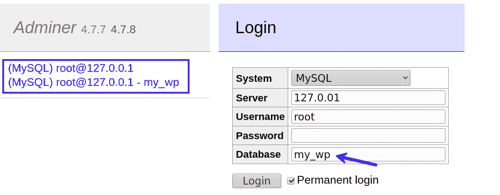

Logging into Adminer with or without a database name


从这里，您可以登录到服务器上安装的任何数据库。您也可以将数据库字段留空。Adminer 将在下一个屏幕上显示所有数据库的列表。

勾选**永久登录**选项将保存您的登录详细信息，以便您稍后可以通过边上的链接轻松重新访问该会话。

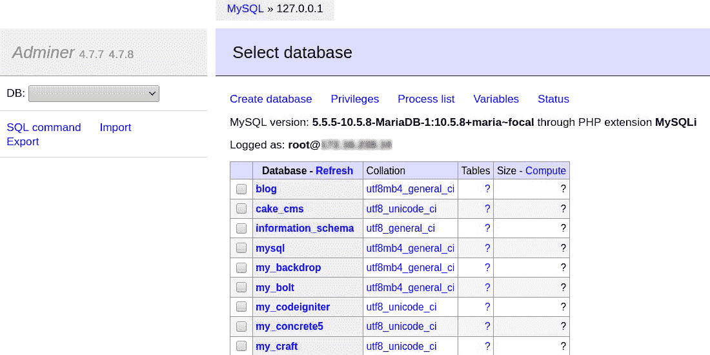

Adminer lists all the databases if you don’t specify one


 ## 管理员功能

Adminer 包含许多特性，使数据库管理更加轻松。是时候深入了解它们了。

 ### 连接到数据库服务器

如前所述，您可以[连接到服务器管理员支持的任何数据库](https://kinsta.com/help/db-access/)。对于 MySQL 数据库服务器，默认用户名是 **root，**，默认密码是一个空字符串。您还可以通过这里选择一个现有的数据库进行管理。


Exploring a WordPress database with Adminer


### 创建新的数据库

您可以点击**创建数据库**链接来创建一个新的 MySQL 数据库。输入数据库名称并选择其排序规则类型。对于 WordPress 数据库，推荐的校对类型是 **utf8mb4_unicode_ci** 。


Creating a new database in Adminer


创建数据库后，您可以更改它的各个方面，如数据库的名称、模式、用户和表。

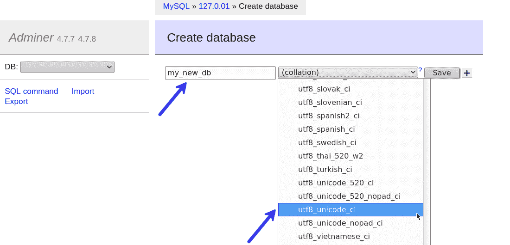

Set the database name and collation type to create a database


现在，您已经创建了一个新的 MySQL 数据库。下一页将向您展示用表、列等填充它的更多选项。


Find the new database listed in the dropdown menu and title


### 更改数据库名称和排序规则类型

单击 **Alter database** 链接将允许您更改其名称和排序规则类型。如果你刚刚创建了一个数据库，并犯了一个错别字，这将非常方便。


Edit databases easily with Adminer’s ‘Alter database’ option


例如，我将数据库的排序规则类型从 **utf8_unicode_ci** 改为 **utf8mb4_unicode_ci** 。


Altering a database in Adminer


**注意:**如果您的数据库已经被任何应用程序使用，请确保您在此所做的更改也反映在您的应用程序代码中。

### 探索数据库模式

数据库模式是指定义所有数据库元素如何相关的逻辑配置。在 MySQL 中，[模式](https://dev.mysql.com/doc/refman/8.0/en/system-schema.html)与数据库同义。所以，它们指的是同一个东西。

然而，在 PostgreSQL 和 Oracle 等其他数据库中，模式指的是表的集合。它只是数据库的一部分。

WordPress 使用 MySQL 作为它的数据库。因此，它的模式本质上是包含列的表。Adminer 甚至可以让您随意移动模式框和使用它们。

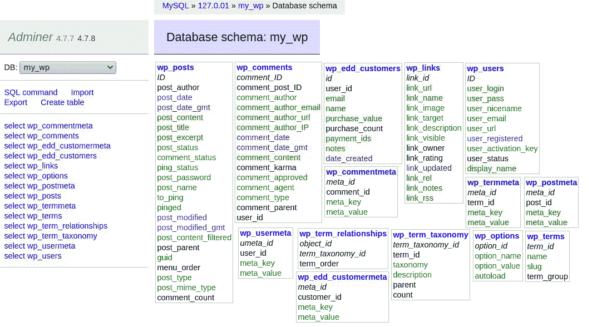

Exploring the WordPress database schema in Adminer


这是学习典型 WordPress 数据库结构的一个很好的方法。

### 检查表格数据和结构

点击任何一个表都会显示更多的细节。默认情况下，Adminer 将引导您进入表的**显示结构**选项卡。在这里，您可以找到关于表的列的信息，比如它们的名称、类型和索引。

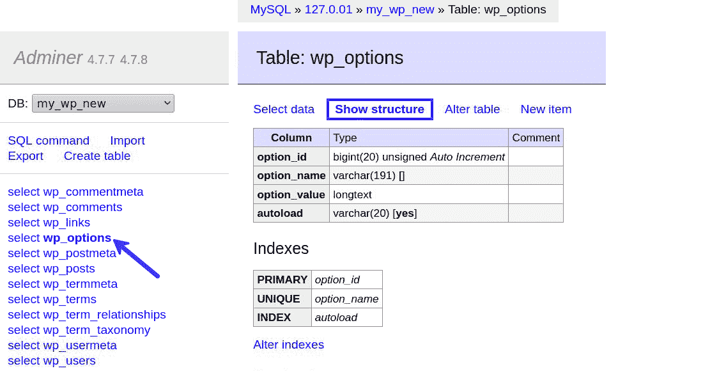

Clicking on a table will show you to its ‘Structure’


如果您的数据库表有任何相关的外键或触发器，它们也会列在最底部。

上面的例子显示了关于 [wp_options](https://kinsta.com/knowledgebase/wp-options-autoloaded-data/) 表的细节。这是 WordPress 存储所有重要设置的地方。接下来，您可以转到**选择数据**选项卡，查看存储在该表中的所有值。


View all the table data listed column-wise


正如您所看到的，这里的[用户界面](https://kinsta.com/careers/product-designer/)比 phpMyAdmin 中的界面更容易阅读。

### 更改表格和列设置

点击顶部的**更改表格**链接，更改表格和列设置。

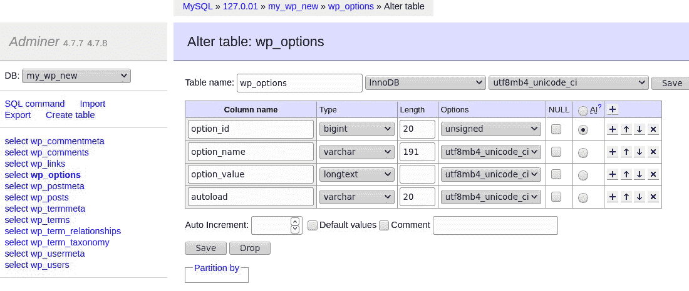

Alter database tables and columns easily through Adminer


对于该表，您可以更改其名称、引擎和排序规则类型。在底部，您还可以找到设置表的默认值以开始自动递增的选项，以及是否可以用默认值和注释设置其列。

对于列，您可以更改它们的名称、类型、长度和排序规则类型。

您也可以通过点击 **+** 和 **x** 按钮来添加或删除列。**下拉**按钮将完全删除数据库表，所以要小心使用。

一旦你做了更改，不要忘记点击**保存**按钮。

### 插入新记录并更新现有记录

点击**新项目**链接进入**插入:<表名>** 标签。

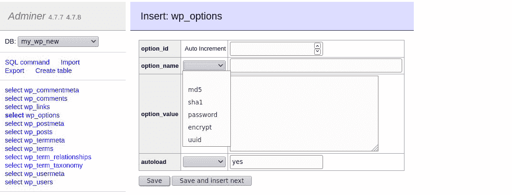

Inserting a new record in your database table’s columns


在这里，您可以向表格中添加一个新行。Adminer 列出了列名及其类型，以便您可以快速输入。您还可以对您输入的值运行哈希函数来自动加密它们。如果数据是敏感的，比如密码，那就非常有用。例如， [WordPress 使用 MD5 算法将其密码](https://kinsta.com/blog/change-wordpress-password/#how-to-change-or-reset-wordpress-passwords-from-phpmyadmin)存储在数据库中。

编辑现有记录也很简单。例如，如果你想改变你站点的描述，你可以在你的 **wp_options** 表中编辑 **blogdescription** 选项的值。

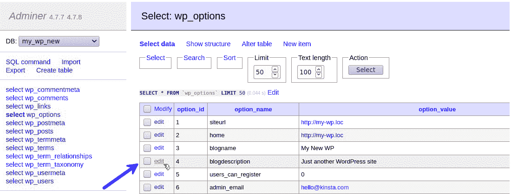

Editing an existing database record in Adminer


接下来，在 **option_value** 字段中输入您的新博客描述，并单击**保存**按钮以使您的更改生效。

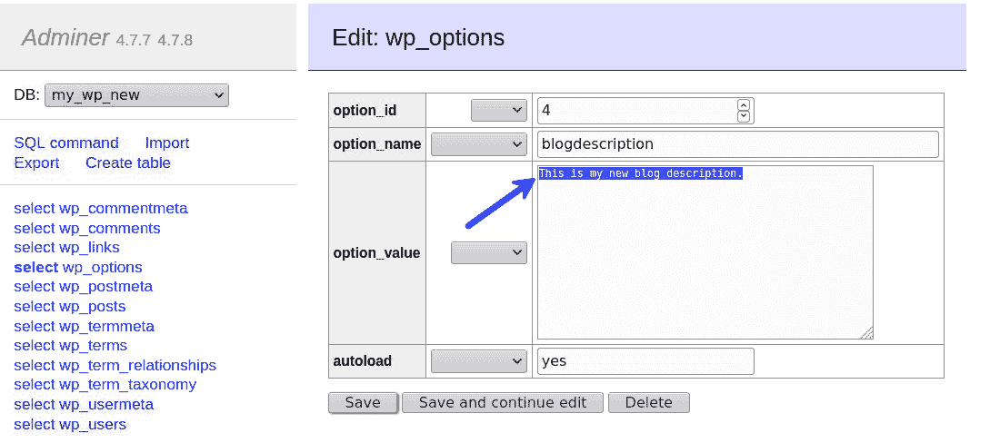

Changing a WordPress site’s description through Adminer


### 在所有表中搜索数据

Adminer 允许您一次在数据库的所有表中搜索任何数据。它会显示最有可能保存这个值的表。

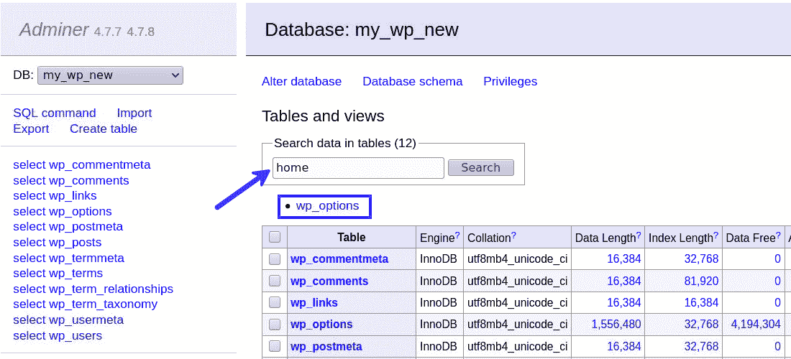

Searching for a term inside a database in Adminer


当我搜索术语 **home** 时，Adminer 调出了 **wp_options** 表作为最有可能的候选项。点击它向我显示了 Adminer 在数据库中找到它的确切的列和行。

点击搜索结果下面列出的表格，将会显示更多的详细信息。从这里，您可以[在该表中执行更细粒度的搜索](https://kinsta.com/knowledgebase/wordpress-search-and-replace/)。

 ## 注册订阅时事通讯


### 想知道我们是怎么让流量增长超过 1000%的吗？

加入 20，000 多名获得我们每周时事通讯和内部消息的人的行列吧！

[Subscribe Now](#newsletter)


Search deeply within the table suggested


例如，我可以编辑**主页**选项名称的值，并更改我的网站主页[的 URL](https://kinsta.com/knowledgebase/what-is-a-url/) 。

### 截断、删除、移动和复制表

Adminer 允许您直接从数据库的仪表板对表执行许多操作。


Execute SQL operations on tables easily


通过选择表并单击下面的按钮，可以对表执行许多 SQL 查询。

例如，如果你想[删除](https://kinsta.com/blog/wordpress-disable-comments/)你网站上的所有[评论，你可以选择 **wp_comments** 表，点击**截断**按钮。它将清空表中的所有行，但仍会保留现有的列结构。点击**删除**按钮将删除整个表格。](https://kinsta.com/blog/wordpress-comments/)

从这里，您还可以**将**或**复制**该表到另一个数据库。有了**覆盖**选项，这是一种快速而肮脏的方式将站点数据如帖子和评论从一个站点转移到另一个站点。

### 创建表、视图、例程和事件

您可以使用 Adminer 创建新的表、视图、例程和事件。


Creating a new table is simple with Adminer


**Create table** 特性允许您定义表的完整模式，包括它的列和嵌套值。

超级用户可以使用 Adminer 的其他高级特性来定义 MySQL 视图、过程、函数和事件。

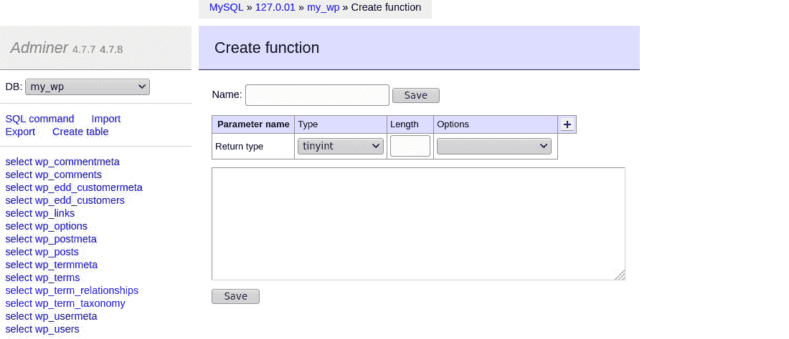

Create many other SQL features easily with Adminer


### 导入或导出数据库

Adminer 让您可以轻松导入 MySQL 数据库。你需要做的就是上传备份的**。sql** or。sql.gz**(推荐)文件并执行。这种方法是恢复 MySQL 数据库的简单方法[。](https://kinsta.com/knowledgebase/how-to-restore-mysql-database-using-phpmyadmin/)**

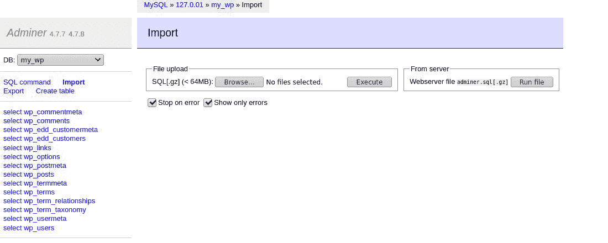

Importing a MySQL database in Adminer


同样，[使用 Adminer 备份现有数据库](https://kinsta.com/knowledgebase/mysql-backup-database/)也非常简单。点击**导出**链接，然后选择输出类型、格式等导出选项，以及其他数据库设置。您也可以选择要导出的表格。

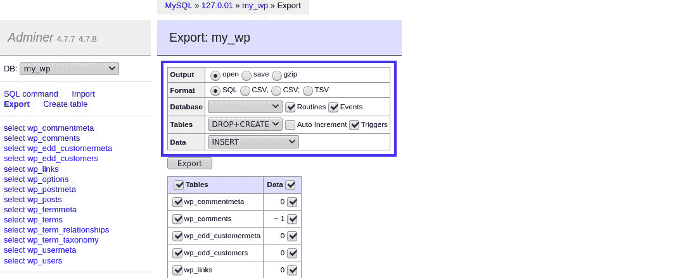

Exporting a database in Adminer


默认情况下，Adminer 支持用**打开**、**保存**或 **GZIP** 输出导出数据库，用 **SQL** 、 **CSV** 、**CSV；**或 **TSV** 格式。但是，您可以使用 Adminer 插件毫不费力地扩展这个功能。我将在本文后面介绍它们。

### 执行 SQL 查询

您不必使用 Adminer 处理笨重的用户界面来运行 SQL 查询。只需访问 **SQL 命令**屏幕，执行您想要的任何查询。

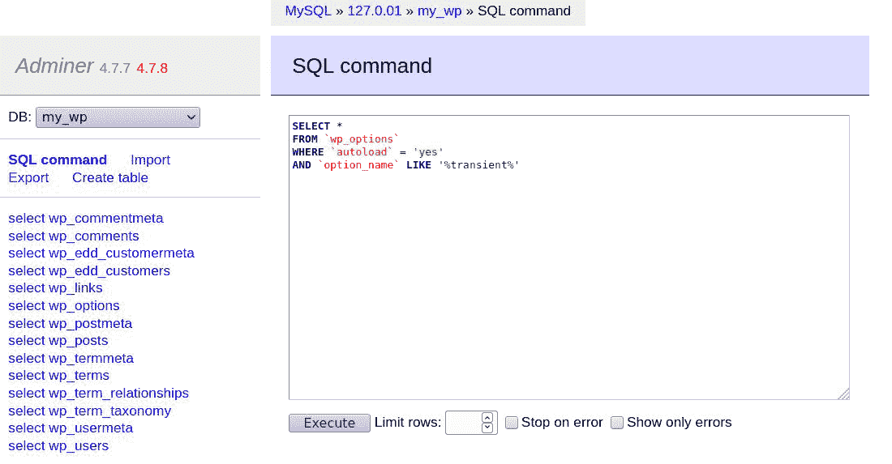

Run SQL queries in Adminer’s SQL command


注意语法突出显示。Adminer 甚至将突出显示的 SQL 关键字链接到它们的官方文档。

在执行查询之前，您可以限制它的行数，设置它在遇到错误时停止运行，并且只显示错误的输出。

### 显示和创建权限(用户)

您可以使用 Adminer 为您的数据库创建具有自定义权限的新用户。在大多数情况下这是不必要的，但是如果你想创建一个新用户，你可以选择快速创建。


The ‘Privileges’ menu link in Adminer


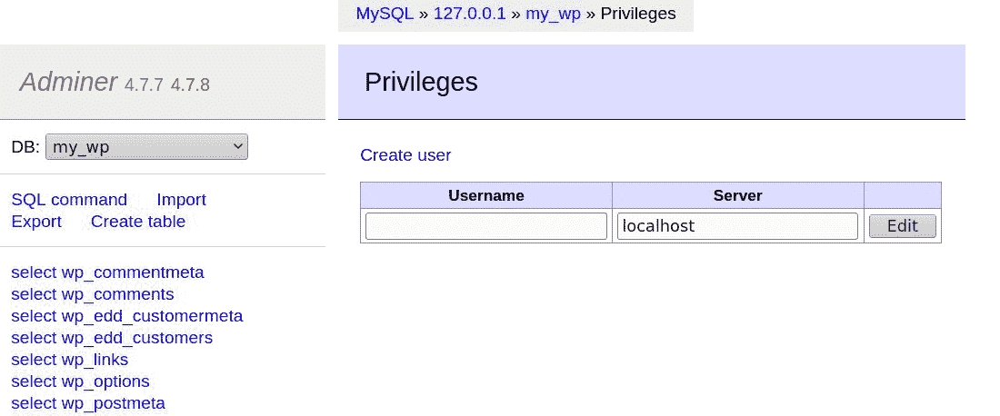

Creating a database user in Adminer


### 丰富的定制选项

您可以使用默认的 **Adminer** 类，用您的定制代码扩展或覆盖 Adminer 的默认特性。为此，您需要定义一个 **adminer_object** 函数，为 adminer 类返回自定义值。

想马上用 Adminer？DevKinsta 在其免费的本地开发工具套件中使用 Adminer。使用 DevKinsta，您可以在几分钟内构建、测试和部署 WordPress 站点。现在就试试 DevKinsta 吧！

例如，如果您想要自定义显示在页面标题和标题中的名称，您可以使用以下代码:

```
<?php
function adminer_object() {  
    class AdminerExtender extends Adminer {function name() {
        // your custom name for title & heading
        return 'Adminer for Kinsta';
        }
    }
    return new AdminerExtender;
}
include './adminer-4.7.8.php';
```

现在，您可以在 header 部分看到我们设置的自定义名称(“Adminer for Kinsta”)。

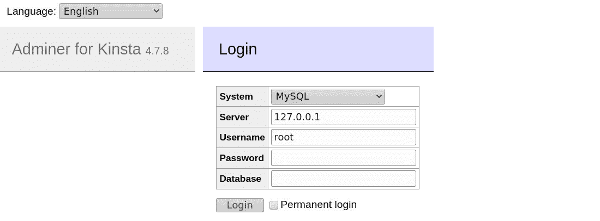

Customizing Adminer’s header with its extensions API


使用 Adminer 的扩展，您可以做很多更酷的事情。你可以在他们的 API 参考页面上了解更多关于 Adminer 的扩展。

## 管理员插件

Adminer 插件是现成的扩展，可以用来轻松扩展 Adminer 的默认功能。

例如，如果您想以 XML 格式导出您的数据库，您可以安装 Adminer [dump-xml](https://raw.github.com/vrana/adminer/master/plugins/dump-xml.php) 插件。同样，如果您想将您的数据库导出为 ZIP 压缩文件，您可以插入 [dump-zip](https://raw.github.com/vrana/adminer/master/plugins/dump-zip.php) 扩展名。

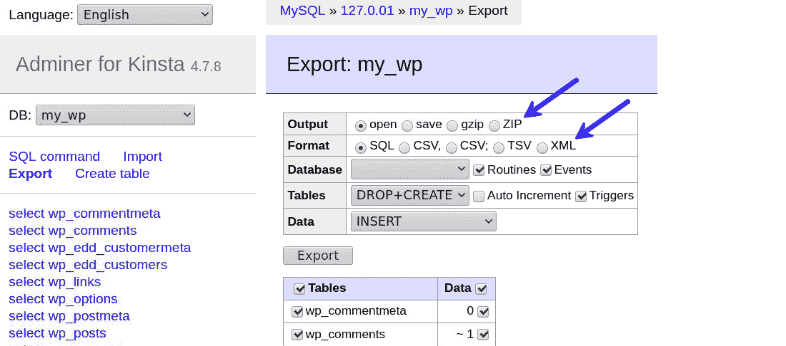

Extending Adminer’s default output options with plugins


官网列出了[一些最流行的 Adminer 插件](https://www.adminer.org/en/plugins/)。您还可以在那里找到关于如何设置和使用 Adminer 插件的信息。

## 管理员主题

Adminer 最酷的特性之一是其[主题化](https://kinsta.com/best-wordpress-themes/)功能。官网列出了一些现成的设计，你可以马上使用。

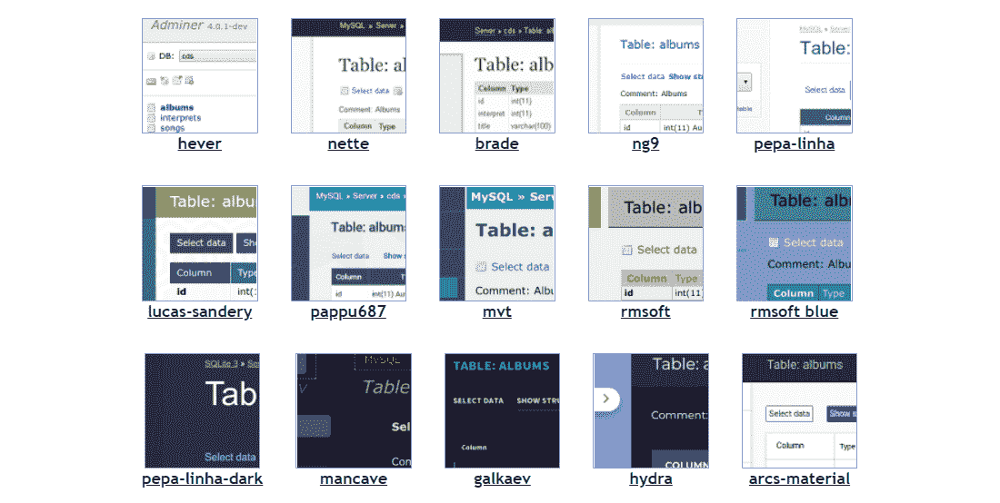

Plug in an Adminer theme to change its looks


要使用 Adminer 主题，你需要将主题的 **adminer.css** 文件放在 adminer.php 所在的**目录下。**

就这么简单。

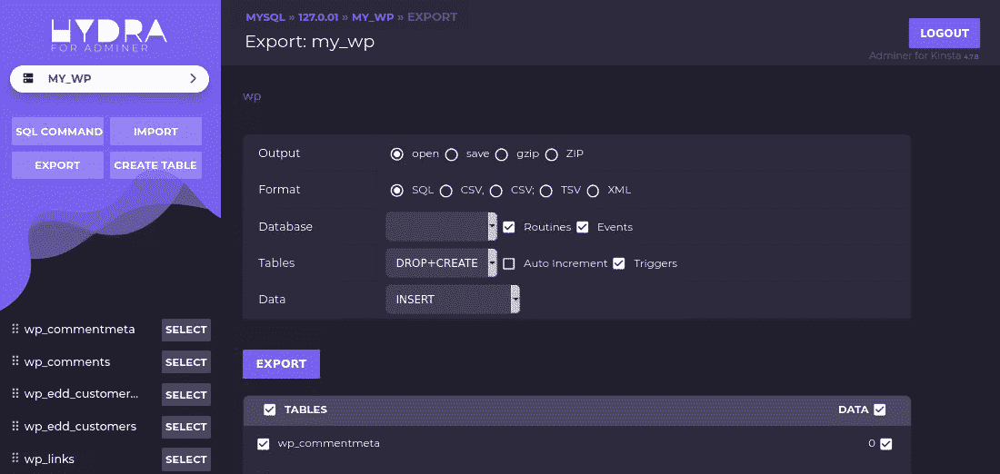

Redesign Adminer completely with its themes


上面的例子是 Adminer 网站上列出的[九头蛇](https://raw.githubusercontent.com/Niyko/Hydra-Dark-Theme-for-Adminer/master/adminer.css)主题。这是管理员基于[材质设计的](https://kinsta.com/blog/wordpress-custom-dashboard/#aquila-admin-theme)黑暗主题。

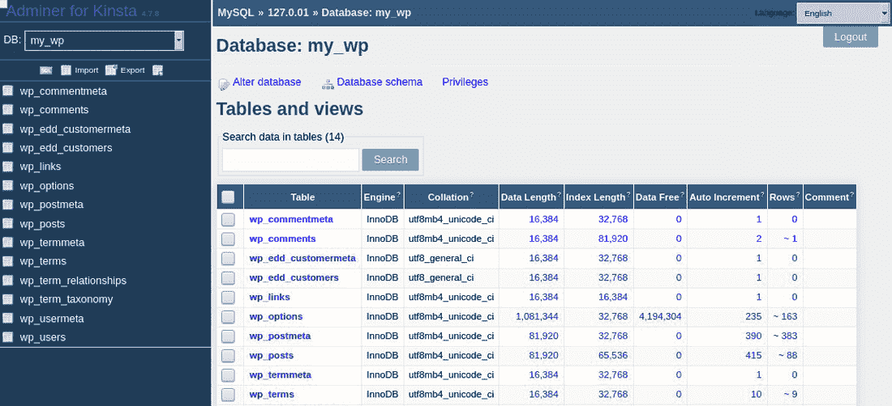

Another Adminer theme (mvt) in action


其他一些好的管理员主题的例子有[管理员引导式设计](https://github.com/natanfelles/adminer-bootstrap-like)和[由 pematon 开发的管理员主题](https://github.com/pematon/adminer-theme)。使用上面的任何一个主题作为模板，你可以通过修改 CSS 文件来定制它们。


## Adminer vs phpMyAdmin

既然我们已经探索了 Adminer 的许多特性，现在是时候看看 Adminer 如何与行业领导者 [phpMyAdmin](https://kinsta.com/help/wordpress-phpmyadmin/) 进行比较了。下面简要回顾一下它们在各个方面的表现:

### Adminer 与 phpMyAdmin:功能比较

phpMyAdmin 只支持 MySQL 数据库，而 Adminer 支持很多其他数据库。Adminer 也有 MySQL 独有的版本。

与 Adminer 相比，在 phpMyAdmin 中编辑和创建表是一件苦差事。使用 Adminer 可以轻松地批量选择数据并一次编辑它们。你会发现 phpMyAdmin 在这方面有所欠缺。

你也可以看看 [Adminer 编辑器](https://www.adminer.org/en/editor/)，一个专注于编辑数据库的 Adminer 的变种。它一次只能处理一个数据库，您需要将它连接到另一个数据库才能使它工作。

phpMyAdmin 在一些领域表现出色。例如，它比 Adminer 支持更多的语言和导出格式。其庞大的用户群确保了如果你遇到任何问题，有一个繁荣的社区愿意帮助你。

### Adminer vs phpMyAdmin:安全性

根据 Adminer 团队的说法，“*安全性是 Adminer 开发的第一要务。*“例如，Adminer 在后台不设置密码的情况下阻止对数据库的访问。它还对连接尝试进行速率限制，以防止暴力或 [SQL 注入](https://kinsta.com/blog/sql-injection/)攻击。

Adminer 的即插即用设计还意味着，当不再需要它时，您可以将其从服务器上快速删除。如果以后想再用，可以赶紧上传回去。您不能用 phpMyAdmin 做同样的事情。

通过使用 Adminer 的 [login-ssl](https://raw.github.com/vrana/adminer/master/plugins/login-ssl.php) 插件，您可以使用 ssl 连接到您的 MySQL 数据库服务器。Adminer 的仪表板还会提示您是否有新版本可用，因此您可以确保您始终使用最新版本。

### Adminer 与 phpMyAdmin:性能

根据 Juraj Hajdúch 的独立测试，Adminer 比 phpMyAdmin 平均快**28%**。虽然他们早在 2009 年就发布了这些结果，当时 Adminer 还处于起步阶段，但它是唯一可用的独立性能测试。

因为 Adminer 只包含一个轻量级文件，所以您甚至可以将它部署在资源最有限的服务器上。

### Adminer 与 phpMyAdmin:用户体验

与 phpMyAdmin 不同，使用 Adminer 从一开始就是轻而易举的事情。您不必涉足任何配置或设置。它只是工作。

Adminer 还提供了一个更好、更友好的用户界面。使用 Adminer 定制表、列及其值非常简单。导入数据库或[进行备份](https://kinsta.com/knowledgebase/mysql-backup-database/)也是如此。

此外，Adminer 插件和主题允许您定制其功能和界面，以满足您的需求。从用户体验的角度来看，这使得 Adminer 成为了明显的赢家。

### Adminer 与 phpMyAdmin:文件大小

Adminer 是一个紧凑的数据库管理工具。它至少比 phpMyAdmin 小 28 倍，尽管它比 phpMyAdmin 支持更多的数据库类型。

Adminer 的最新全功能版本(4.7.8)只有区区 **478 KB** ，而 phpMyAdmin 的最新版本(5.0.4)是 **13.7 MB** (另外，这是一个用于启动的压缩文件)。当你考虑 Adminer 的纯 MySQL 版本( **354 KB** )时，文件大小的差异就更加明显了。

## 如何在 WordPress 中使用 Adminer

在 WordPress 中使用 Adminer 没有特别的方法。它适用于所有的 MySQL 数据库。下载它的 PHP 文件，把它放在你的服务器上的任何地方，并从你的浏览器访问它。登录 Adminer 后，你可以用它来浏览你的 WordPress 站点的数据库。

我建议您在使用完 Adminer 文件后将其从服务器上删除。将它长时间留在服务器上无人管理可能会使您的数据库暴露于漏洞之下。

有一个名为 ari-adminer 的 WordPress 插件，可以让你直接从你的 WordPress 仪表盘访问 adminer。然而，**因为一个严重的安全问题，它已经关闭并且不再提供下载**将近两年了。

在 WordPress 中使用 Adminer 的第二个最佳方式是使用 [DevKinsta](https://kinsta.com/devkinsta) 。

## DevKinsta 和 Adminer:简单的 WordPress 数据库管理

Kinsta 的免费本地开发工具套件 DevKinsta 在后台使用 Adminer 来驱动其数据库管理器。

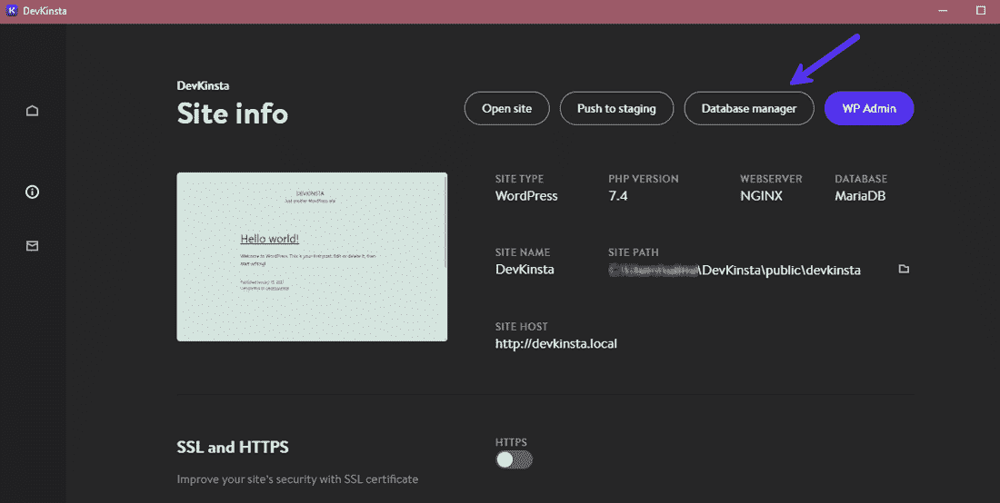

Accessing DevKinsta’s database manager


单击 DevKinsta 仪表板中的**数据库管理器**按钮来访问 Adminer。


DevKinsta’s database manager is a prettier Adminer


DevKinsta 的数据库管理器支持本文前面讨论的所有 Adminer 特性。您可以使用它在不同的数据库之间切换、查看和编辑表、操作数据库值、导入和导出数据库、运行 SQL 查询等等。

如果您正在用 DevKinsta 在本地设置多个站点，那么您可以从 Adminer 的仪表板在它们的数据库之间切换。只需从左上角的下拉菜单中选择您想要使用的数据库。

您可以[访问 DevKinsta 文档](https://kinsta.com/knowledgebase/devkinsta/database-manager/)以获得关于其数据库管理器的更多信息。

[Meet Adminer, the database management tool that is about to make your life much simpler ⬆️Click to Tweet](https://twitter.com/intent/tweet?url=https%3A%2F%2Fkinsta.com%2Fblog%2Fadminer%2F&via=kinsta&text=Meet+Adminer%2C+the+database+management+tool+that+is+about+to+make+your+life+much+simpler+%E2%AC%86%EF%B8%8F&hashtags=Adminer%2CDevKinsta)

## 摘要

Adminer 是 phpMyAdmin 的最佳替代品之一。它不仅占地面积更小，而且操作起来也更快捷。它正处于缓慢而持续的发展中。Adminer 的最新版本增加了对 [PHP 8 环境](https://kinsta.com/feature-updates/php-8/)的支持，使其面向未来。

如果你想尝试 Adminer，你可以用 DevKinsta 创建一个[本地 WordPress 站点，然后开始用 Adminer 探索它的数据库。](https://kinsta.com/devkinsta)

现在轮到你了:你对 Adminer 有什么体验？关于使用 Adminer 或 DevKinsta 管理数据库，您有任何问题吗？如果有，请在评论区分享。

* * *

让你所有的[应用程序](https://kinsta.com/application-hosting/)、[数据库](https://kinsta.com/database-hosting/)和 [WordPress 网站](https://kinsta.com/wordpress-hosting/)在线并在一个屋檐下。我们功能丰富的高性能云平台包括:

*   在 MyKinsta 仪表盘中轻松设置和管理
*   24/7 专家支持
*   最好的谷歌云平台硬件和网络，由 Kubernetes 提供最大的可扩展性
*   面向速度和安全性的企业级 Cloudflare 集成
*   全球受众覆盖全球多达 35 个数据中心和 275 多个 pop

在第一个月使用托管的[应用程序或托管](https://kinsta.com/application-hosting/)的[数据库，您可以享受 20 美元的优惠，亲自测试一下。探索我们的](https://kinsta.com/database-hosting/)[计划](https://kinsta.com/plans/)或[与销售人员交谈](https://kinsta.com/contact-us/)以找到最适合您的方式。