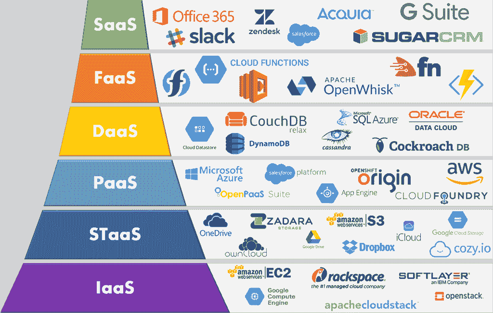
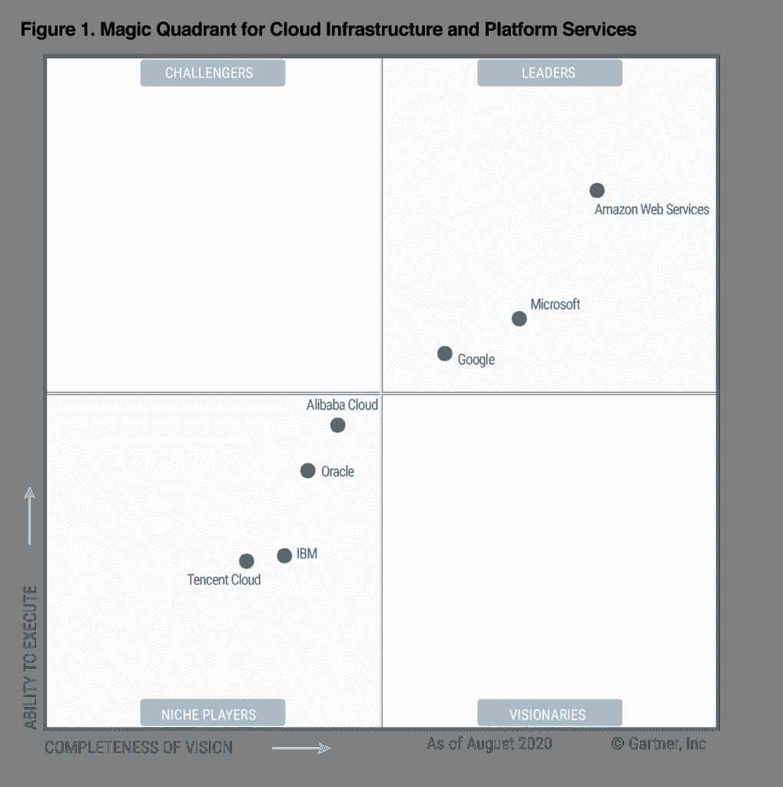
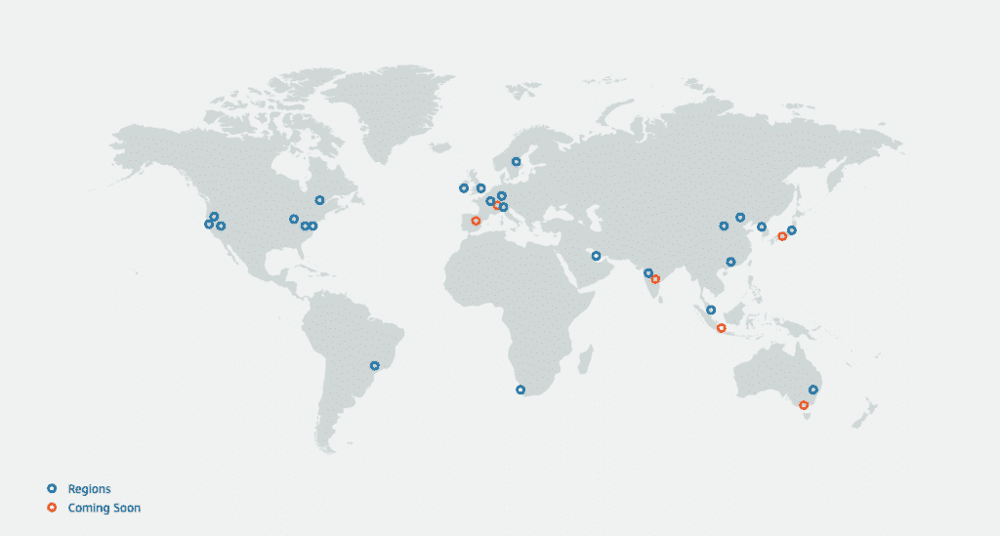
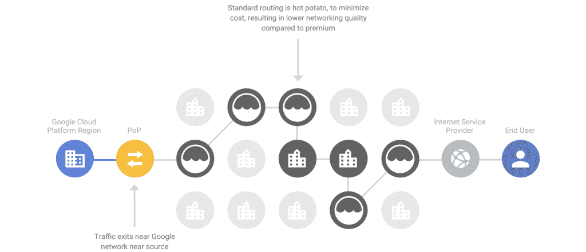
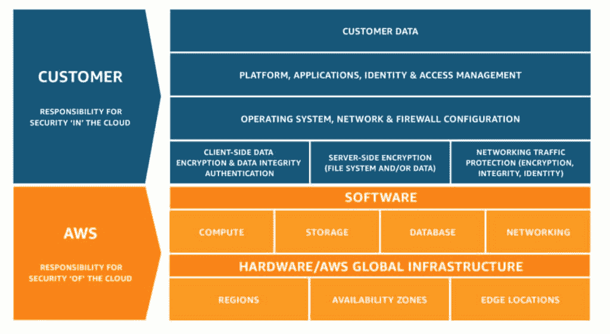

# 2022 年谷歌云 vs AWS(对比巨头)

> 原文:[https://kinsta.com/blog/google-cloud-vs-aws/](https://kinsta.com/blog/google-cloud-vs-aws/)

各公司继续向云计算迈进。无论是使用单独的云服务，还是将您的整个基础架构迁移到新的云生态系统，您并不是唯一一个寻求云技术附加优势的人。

从可伸缩性、安全性和灵活性的提高到成本和环境影响的降低，有大量的理由迁移到云。当然，转型不像以前那么容易了。

自诞生以来，云生态系统已经成为一个复杂的、不断扩展的无数提供商、技术、产品和服务。当您试图将这些垂直领域的不同组合拼凑在一起时，您的选择可能会很快攀升到 1000 个。选择太多很快就会变得明显。

Cloud Computing Companies and Services (Image source: [imelgrat.me](https://imelgrat.me/wp-content/uploads/2018/06/Cloud-Delivery-Models.png))

像任何行业一样，少数公司脱颖而出成为市场领导者。当我们想到云计算提供商时，有三个名字名列榜首:谷歌云平台、亚马逊网络服务和微软 Azure。

今天，我们将比较两个云巨头，谷歌云平台和亚马逊网络服务。我们将深入了解每个提供商的产品和服务。寻求增加清晰度并简化比较这两家云提供商的流程，以便做出明智的决策。

虽然我们在金斯塔独家使用[谷歌云平台](https://kinsta.com/blog/google-cloud-hosting/)，但我们将为您提供不带偏见的观点。这两个平台都提供了广泛的好处，但是哪一个适合您最终将取决于您公司自己的独特需求。

 [🥊谷歌云平台与亚马逊网络服务🥊。请继续阅读，深入了解这两个行业巨头🚀 点击推文](https://twitter.com/intent/tweet?url=https%3A%2F%2Fkinsta.com%2Fblog%2Fgoogle-cloud-vs-aws%2F&via=kinsta&text=%F0%9F%A5%8A+Google+Cloud+Platform+vs.+Amazon+Web+Services+%F0%9F%A5%8A+.+Read+on+to+dive+deep+into+these+two+industry+giants+%F0%9F%9A%80&hashtags=GoogleCloud%2CAWS)

> 需要在这里大声喊出来。Kinsta 太神奇了，我用它做我的个人网站。支持是迅速和杰出的，他们的服务器是 WordPress 最快的。
> 
> <footer class="wp-block-kinsta-client-quote__footer">
> 
> 
> 
> <cite class="wp-block-kinsta-client-quote__cite">Phillip Stemann</cite></footer>

[View plans](https://kinsta.com/plans/)

## 为什么谷歌云和亚马逊网络服务

如果你打算使用云服务，你无疑会发现谷歌云、亚马逊网络服务和 T2 微软 Azure。今天，我们将重点比较其中的两个，特别是[谷歌云](https://kinsta.com/aws-market-share/)与 [AWS](https://kinsta.com/aws-market-share/) 。

这些云巨头在技术领域家喻户晓。两家公司都在各自的行业占据了超过十年的主导地位。作为世界领先的公司，他们一丝不苟地追求创新和卓越。每一家都拥有丰富的技术行业专业知识，几乎无法与之竞争。

凭借各自的技术基础，他们开发出行业领先的云计算平台并不奇怪。2020 年 9 月，Gartner 再次将 Google 和 AWS 列为其[基础设施即服务(IaaS)魔力象限](https://www.gartner.com/en/documents/3989743/magic-quadrant-for-cloud-infrastructure-and-platform-ser)的领导者。

对于亚马逊来说，这是 AWS 连续第 10 年在 Gartner 的云基础设施即服务魔力象限( [IaaS](https://kinsta.com/blog/what-is-iaas/) )中占据领导者象限的右上角。在执行能力方面获得最高排名，在愿景的完整性方面获得最高排名。

2020 Magic Quadrant for Cloud Infrastructure as a Service, Worldwide (Image source: [Gartner](https://www.gartner.com/en/documents/3989743/magic-quadrant-for-cloud-infrastructure-and-platform-ser))

### 谷歌云和 AWS 继续主导行业

自 2008 年 IaaS 解决方案开始获得牵引力以来，谷歌云和 AWS 一直主导着云计算领域。

2020 年 8 月，Gartner 的一份[报告指出，谷歌和亚马逊都属于占 IaaS 市场 80%份额的 5 家公共云基础设施提供商。随着两家公司加倍努力巩固其在市场中的立足点，这一趋势只会持续下去。](https://www.gartner.com/en/newsroom/press-releases/2019-07-29-gartner-says-worldwide-iaas-public-cloud-services-market-grew-31point3-percent-in-2018)

尽管全球疫情阻碍了主要经济体的发展，但 Gartner 预测 2020 年全球公共云收入将增长 6.3%。在远程工作爆炸式增长的推动下，我们可以合理地期待在云领域的比较结果。特别是该报告概述了桌面即服务(DaaS)市场 94%的增长。在这种背景下，你可以期待谷歌和亚马逊继续扩张。

虽然它们都是从 IaaS 领域开始的，但现在你可以求助于[谷歌云](https://www.gartner.com/en/newsroom/press-releases/2020-07-23-gartner-forecasts-worldwide-public-cloud-revenue-to-grow-6point3-percent-in-2020)和 [AWS](https://aws.amazon.com/products/) 来获得跨越 IaaS、SaaS 和 [PaaS](https://kinsta.com/blog/what-is-paas/) 的数百种解决方案。两家公司都在不断创新，并向其不断扩大的名册中添加新的云服务产品。

#### 2020 年谷歌云平台收入

[Alphabet 的第四季度和 2019 财年业绩](https://abc.xyz/investor/static/pdf/2019Q4_alphabet_earnings_release.pdf)显示，该公司继续保持强劲增长，整体收入同比增长 18%。虽然谷歌云贡献的收入缺乏透明度，但该公司报告了超过 100%的惊人增长，截至年底，该公司的年运营率为 100 亿美元。

2020 年，冠状病毒疫情的到来导致谷歌云的母公司 Alphabet 自 2004 年上市以来首次出现季度收入下降。在这种可怕的背景下，谷歌云事实上逆势而上，似乎只是加速了增长。

在 Q1，由于 Google Meet，Google Cloud 取得了重大进展，当时他们的视频会议工具成为远程员工的热门。 [Q1](https://abc.xyz/investor/static/pdf/2020Q1_alphabet_earnings_release.pdf) 、 [Q2](https://abc.xyz/investor/static/pdf/2020Q2_alphabet_earnings_release.pdf) 和 [Q3](https://ir.aboutamazon.com/news-release/news-release-details/2020/Amazon.com-Announces-Third-Quarter-Results/default.aspx) 的收入发布声明显示了谷歌云平台收入持续同比增长的模式。随着我们迈向 2020 年底，谷歌云收入预计将增长到超过 130 亿美元的年增长率，预计 2019 年将增长 30%。

#### 2020 年亚马逊网络服务收入

2019 年，[亚马逊第四季度财报](https://ir.aboutamazon.com/news-release/news-release-details/2020/Amazoncom-Announces-Fourth-Quarter-Sales-up-21-to-874-Billion/default.aspx)报告 AWS 销售收入近 100 亿美元。使该组织的年收入超过 400 亿美元。

随着 2020 年疫情冠状病毒的出现，AWS 增长明显放缓。随着 [Q1](https://ir.aboutamazon.com/news-release/news-release-details/2020/Amazoncom-Announces-First-Quarter) 、 [Q2](https://ir.aboutamazon.com/news-release/news-release-details/2020/Amazon.com-Announces-Second-Quarter-Results) 和 [Q3](https://ir.aboutamazon.com/news-release/news-release-details/2020/Amazon.com-Announces-Third-Quarter-Results/default.aspx) 收益发布报告显示，各季度的同比增长率下降并稳定在 30%以下。与前三年 40-50%的增长率相比，这是一个明显的下降。

这很难说是一个悲观的场景，AWS 现在的年收入为 430 亿美元，预计第四季度结束后这个数字还会增加。例外可能是，如果你是亚马逊的股东，尤其是在[杰夫·贝索斯告诉亚马逊股东“坐下”](https://www.zdnet.com/article/jeff-bezos-tells-amazon-shareowners-take-a-seat-as-covid-19-eats-into-profits/)之后，而他们在新冠肺炎的回应侵蚀了运营利润。
T3】

## 谷歌云和亚马逊网络服务功能比较

比较谷歌云和 AWS 平台并不是一件简单的事情。他们庞大且不断扩展的云服务现在包括数百种可供选择的产品。更复杂的是，供应商经常对比较产品使用不同的命名约定。所以，为了避免迷失在细节中，需要一定程度的知识和理解。

为了简化任务，[谷歌云平台](https://cloud.google.com/products/)和[亚马逊网络服务平台](https://aws.amazon.com/products/)都将他们的产品归入相同的类别标题下。加快流程以节省您的时间，我们已经完成了比较业务关键型类别中最常用服务的繁重工作。

在这一节中，我们将探索结合起来创建典型云部署的产品，包括计算、网络、安全和存储。在 Kinsta，我们拥有利用这些服务交付市场领先的托管解决方案的第一手经验。

我们还涵盖了围绕这些服务的关键考虑事项。服务支持、平台稳定性、定价和计费结构。

## 计算特征

在比较 Google Cloud 和 Amazon Web Services 的计算能力时，我们将重点关注虚拟机(VM)。

这些计算机系统仿真提供了物理计算机的功能，并运行几乎任何您能想到的工作负载。它们是您云环境的基础，选择适合您业务需求的虚拟机设置至关重要。

两家云提供商都对虚拟机采用了类似的方法，尽管它们对各自的产品使用不同的命名约定。

[计算引擎](https://cloud.google.com/compute)是谷歌云平台上的服务提供，而亚马逊网络服务被命名为[亚马逊弹性计算云](https://aws.amazon.com/ec2)(亚马逊 EC2)。每个提供商也使用不同的术语和概念。

令人欣慰的是，谷歌已经将亚马逊 EC2 的术语和概念映射到计算引擎的术语和概念上——你可以在下表中看到:

| **功能** | **亚马逊 EC2** | **计算引擎** |
| 虚拟计算机 | 例子 | 例子 |
| 机器图像 | 亚马逊机器图像 | 图像 |
| 临时虚拟机 | 定点实例 | 可抢占的虚拟机 |
| 防火墙 | 安全组 | 计算引擎防火墙规则 |
| 自动实例缩放 | 自动缩放 | 计算引擎自动缩放器 |
| 本地附加磁盘 | 短暂的圆盘 | 本地 SSD |
| VM import | 支持的格式:原始、OVA、VMDK 和 VHD | 支持的格式:原始、OVA、VMDK 和 VHD |
| 部署地点 | 带状的 | 带状的 |

将 Amazon EC2 的高级术语映射到 Google 计算引擎(表来源: [Google](https://cloud.google.com/docs/compare/aws/compute) )

### 虚拟机功能

在计算引擎 Amazon EC2 上部署[虚拟机实例时，这两种服务都提供了许多紧密一致的功能，包括:](https://kinsta.com/blog/fastest-wordpress-hosting/#google-cloud-platform-and-virtual-machines)

*   使用存储的磁盘映像创建实例的能力
*   启动和终止实例的按需功能
*   实例的无限制管理
*   标记实例的能力
*   可以安装在您的实例上的各种可用操作系统

#### 虚拟机访问

当涉及到访问您的虚拟机时，Compute Engine 和 Amazon EC2 之间采用的方法有许多关键差异。

如果您希望[终端访问 Amazon EC2](https://docs.aws.amazon.com/AWSEC2/latest/UserGuide/ec2-key-pairs.htmlhttps://docs.aws.amazon.com/AWSEC2/latest/UserGuide/ec2-key-pairs.html) 中的一个实例，您需要包含自己的 SSH 密钥。

计算引擎为终端访问提供了更灵活的方法。允许您在需要时创建 SSH 密钥，即使该实例已经在运行。由于 Compute Engine 的基于浏览器的 SSH 终端可以通过 [Google Cloud Console](https://console.cloud.google.com/) 获得，因此您也不需要将这些密钥存储在本地机器上。
T3】

#### 虚拟机实例类型

在部署虚拟机时，计算引擎和 Amazon EC2 都通过一系列预定义的实例提供了简单性。这些实例整合了虚拟 CPU、RAM 和网络的特定配置。

谷歌和亚马逊都提供 100 多种不同配置的虚拟机。每一种都提供了灵活性，允许您自定义配置，以便扩展虚拟机资源来满足您业务的独特需求。

您可以通过将 CPU 和可用 RAM 的数量增加到极高的规格来实现这一点。

提供商最大限度地提供以下内容:

*   Google 计算引擎虚拟机可扩展至 416 个虚拟 CPU 和 11，776 GB 内存
*   Amazon EC2 虚拟机可扩展至 448 个虚拟 CPU 和 24，576 GB 内存

在各种虚拟机类型中，这两个平台使用的分类基本相同。尽管在某些类别中，一个提供商可能提供一种机器类型，而另一个则不提供。

根据您的业务需求，您可以从多种机器类型中进行选择，包括共享核心、通用、内存优化、计算优化、存储优化、GPU 和高性能类别。

为了向您提供 Amazon EC2 和 Compute Engine 之间的最佳虚拟机比较，我们编制了下表，其中列出了这两种服务的最新机器类型。

| **机器类型** | **亚马逊 EC2** | **计算引擎** |
| 共享核心 | 不适用的 | f1-微型–G1-小型
E2-微型–E2-中型 |
| 通用 | a1 .中–a1 . metal
t4g . nano–t4g . 2x large
T3 . nano–t 3.2 x large
t3a . nano–t3a . 2x large
T2 . nano–t 2.2 x large
m6g . medium–m6gd . metal
M5 . large–m5d . metal
m5a . large–m5ad . 24x large
m5n . large
M4 . large–m 4.16 x large | E2-标准-2–E2-标准-32
E2-high mem-2–E2-high mem-16
E2-high CPU-2–E1-high CPU-32
n1-标准-1-96
n1-high mem-2–n1-high mem-96
n1-high CPU-2–n1 |
| 内存优化 | r6g . medium–r6gd . metal
r5 . large–r5d . metal
r5a . large–r5ad . 24x large
r5n . large–r5dn . 24x large
R4 . large–r 4.16 x large
x1e . XL large–x1e.32 x large
x 1.16 x large–x 1.32 x large
u-6tb 1 . metal-u24tb 1 . metal
z1s . large–z1d metal | m1-ultra mem-40-m1-ultra mem-0[m1-megamam-96]t1-m2-ultra mem-208-m2-ultra mem-416 |
| 计算优化 | c6g . medium–c6gd . metal
C5 . large–c5d . metal
c5a . large–c5ad . 24x large
c5n . large–c5n . metal
C4 . large–c 4.8 xlarge | c2 标准 4–C2 标准 60 |
| 存储优化 | i3 . large–i3 . metal
i3en . large–i3en . metal
D2 . x large–d 2.8 x large
h 1.2 x large–h 1.16 x large | 不适用的 |
| 国家政治保卫局。参见 OGPU | p4d . 24 x large
p 3.2 x large–p3db . 24 x large
p2 . x large–p 2.16 x large
in f1 . x large–in 1.24 x large
g4dn . x large–g4dn . metal
g3s . x large–g 3.16 x large
f 1.2 x large–f 1.16 x large | 英伟达特斯拉 T4–英伟达特斯拉 K80
英伟达特斯拉 T4 虚拟工作站–英伟达特斯拉 P100 虚拟工作站 |
| 高性能 | 不适用的 | 不适用的 |
| 自定义虚拟机资源配置 | 是 | 是 |

#### 虚拟机映像

要加速虚拟机部署，您可以使用机器映像。

这些通常配置为包括操作系统和所需的支持 web 服务器和数据库软件。Compute Engine 和 Amazon EC2 都使用机器映像来创建新实例。除了标准配置之外，它们都允许您使用第三方供应商发布的图像或为私人使用而创建的自定义图像。

这两个平台非常相似，您可以在 Amazon EC2 和 Compute Engine 上使用相同的工作流来创建图像。

当谈到图像存储时，他们采取了稍微不同的方法。在 Google Cloud 上，图片用 Compute Engine 存储，而亚马逊 EC2 将其图片存储在不同的服务中——[亚马逊简单存储服务](https://aws.amazon.com/s3/) (S3)或[亚马逊弹性块商店](https://aws.amazon.com/ebs/) (EBS)。

与 Compute engine 相比，Amazon EC2 提供的独特优势是能够访问现成图像的社区存储库，并且能够公开您自己的图像(如果这是一项要求)。

另一方面，计算引擎提供了全球可用机器映像的优势。而亚马逊机器图像是地理锁定的，这意味着它们仅在特定区域可用。

#### 虚拟机的自动实例扩展

云最强大的优势之一是能够扩展您的工作负载资源以满足需求。这是双向的，在高峰时期增加资源以保持性能，而在平静时期减少资源以限制浪费和控制支出。这个过程被广泛称为自动缩放。

Compute Engine 和 Amazon EC2 都支持并实现类似的自动缩放，允许您根据用户定义的策略创建和删除资源。

Amazon EC2 自动扩展组中的实例，每个实例都是从定义的启动配置中创建的。实例的创建或删除基于三个选择的扩展计划之一

*   手动–手动指示自动放大或缩小
*   计划–您可以配置特定的时间范围来自动扩展资源
*   动态——您可以根据 [Amazon CloudWatch](https://aws.amazon.com/cloudwatch/) 指标或[Amazon Simple Queue Service](https://aws.amazon.com/sqs/)(SQS)队列创建策略来扩展您的实例。

计算引擎扩展托管实例组中的实例。每个实例组都是从实例模板创建的，资源根据自动缩放策略进行缩放。与 Amazon EC2 不同，Compute Engine 的自动缩放器只支持动态缩放。

#### 临时虚拟机实例

如果您想利用云计算的力量，但预算有限，那么探索临时实例是值得的。在分配给其他进程的空闲资源周期上运行的虚拟机。

临时实例偶尔可用，因此最好用于以下作业:

*   可以被中断而不会丢失工作
*   不需要在设定的时间框架内完成，通常是低优先级工作负载
*   不需要更高的计算能力，比如渲染视频

Amazon EC2 和 Compute engine 都提供了临时实例的版本。尽管它们使用不同的定价模式和命名约定，但当它们的临时虚拟机:

*   在运行时是完全可控的
*   以与按需实例相同的性能级别运行
*   受限于机器类型和机器映像的子集，而不是按需实例

亚马逊 EC2 临时虚拟机被称为[点实例](https://aws.amazon.com/ec2/spot/)。它们有两种格式:

*   未定义的 Spot 实例–您购买一个未定义时间段的 Spot 实例，支付实例运行期间的有效价格。这种类型的实例可以以高达标准按需定价 90%的折扣价提供。您可以通过 [Spot Instance Advisor](https://aws.amazon.com/ec2/spot/bid-advisor/) 检查和比较当前现货价格和即期汇率。
*   预定义持续时间的点实例—您提前购买一段时间。最长 6 小时，每小时一次。通过提前计划，您只能获得 30-50%的折扣。

计算引擎临时虚拟机被命名为[可抢占虚拟机](https://cloud.google.com/preemptible-vms)。它们比 Amazon EC2 的同类产品可用的时间更长，在自动终止之前可以运行长达 24 小时(如果不回收的话)。他们的定价结构是固定的，与同等虚拟机实例的按需费率相比，折扣率高达 80%。

## 网络功能

亚马逊网络服务和谷歌云各自开发了强大的全球云基础设施。他们庞大的网络由遍布全球的数百个互联数据中心组成。

每个提供商都开发了一流的云网络，旨在实现高容错性、无数冗余场景和低延迟水平。每个都提供网络服务，能够为虚拟机、其他云服务和内部服务器提供高速连接。

在这一部分中，我们将仔细比较 Google 和 Amazon 提供的网络产品和服务。

| **产品** | **亚马逊网络服务** | **谷歌云平台** |
| 加拿大 | 亚马逊云锋 | 云 CDN |
| 专用互连 | AWS 直接连接 | 云互联 |
| 域名服务器(Domain Name Server) | AWS 路线 53 | 云 DNS |
| 负载平衡 | 弹性负载平衡 | 云负载平衡 |
| 虚拟网络 | 亚马逊虚拟私有云 | 谷歌虚拟私有云 |
| 层 | 不适用的 | 网络服务等级 |

### 位置

两家提供商都在继续快速扩张各自的基础设施，开发或规划未来的新数据中心位置。当比较网络可用性的位置号码时，它看起来太近而不能呼叫。

#### 谷歌云网络位置

谷歌宣称[云网络位置](https://kinsta.com/knowledgebase/google-cloud-data-center-locations/)目前覆盖 35 个地区、73 个区域、144 个网络边缘位置以及 200 多个国家和地区。他们最近在[首尔](https://kinsta.com/feature-updates/google-cloud-seoul-data-center/)、[盐湖城](https://kinsta.com/feature-updates/google-cloud-salt-lake-city-data-center/)、[拉斯韦加斯](https://kinsta.com/feature-updates/google-cloud-las-vegas-data-center/)和[雅加达](https://kinsta.com/feature-updates/google-cloud-jakarta-data-center/)增加了新的地点。

未来将看到谷歌云继续扩展到以下地点:华沙(波兰)、多哈(卡塔尔)、多伦多(加拿大)、巴黎(法国)、米兰(意大利)、圣地亚哥(智利)和马德里(西班牙)。

Google Cloud Regional Network (Image Source: Google Cloud)

#### 亚马逊网络服务网络位置

AWS 现在提供 24 个地区、77 个区域、210 个网络边缘位置和 245 个国家和地区的[云网络位置](https://aws.amazon.com/about-aws/global-infrastructure/)。虽然这些数字看起来很接近，但亚马逊的网络更大，在两倍于谷歌的地区提供多个可用区。这将使他们在延迟方面具有优势。

不久，亚马逊计划在海德拉巴(印度)、雅加达(印度尼西亚)、大阪(日本)、马德里(西班牙)和苏黎世(瑞士)建立更多的数据中心。

AWS Regional Cloud Network (Image Source: AWS)

### 内容交付网络(CDN)

AWS 和 Google Cloud 各提供一款[内容交付网络(CDN)](https://kinsta.com/blog/wordpress-cdn/) 产品。这两家公司都通过在其全球基础架构中复制和托管内容以允许更本地化的访问，释放了向最终用户更快提供内容和服务的能力。这意味着更快的加载时间，减少带宽压力，提高应用程序、网站和服务的响应能力。

命名为[亚马逊 CloudFront](https://aws.amazon.com/cloudfront/) 和[云 CDN](https://cloud.google.com/cdn) ，它们各自提供增强的安全性，以防御默认情况下最频繁发生的网络和传输层 DDoS 攻击。它们还提供与各自平台的深度集成，允许您解锁其他工具来监控和提高性能。

### 负载平衡

谷歌云和 AWS 都提供[负载平衡服务](https://en.wikipedia.org/wiki/Load_balancing_(computing))。经过适当配置，它们将帮助您在多个实例之间自动分配流量，从而提高应用程序的可用性和容错能力。他们以不同的配置提供这些服务，我们现在将更仔细地看一看。

#### AWS 负载平衡

AWS 的负载平衡服务称为弹性负载平衡(ELB)。它具有以下特征和功能:

*   您可以在内部和外部使用 AWS 负载平衡服务。
*   它允许您将流量定向到指定区域的一个或多个可用性区域中的实例。
*   在目标实例上执行常规健康检查，当一个实例变得不健康时，流量被重定向。
*   ELB 可以与 AWS 自动缩放服务集成，这允许在自动缩放时自动添加和删除实例
*   一个应用负载平衡器可用于基于内容的路由和 SSL
*   网络负载平衡器可用于高吞吐量、低延迟的第 4 层连接。

查看弹性负载平衡比较部分，了解更详细的特性比较。

#### 谷歌云负载平衡

谷歌的负载平衡服务被恰当地命名为[云负载平衡](https://cloud.google.com/load-balancing)。它提供了不同的特性和功能:

*   谷歌云负载平衡服务在内部和外部访问之间是分离的。
*   与 ELB 不同，在配置任何外部计算引擎负载平衡器时，您将获得一个可全局访问的单一 IP 地址。此 IP 地址用于负载平衡的生命周期，因此可用于 DNS 记录、允许列表和应用程序中的配置。

负载平衡器的不同类型的计算引擎包括:

*   网络负载平衡–专为外部第 4 层负载平衡而设计，支持跨多个端口或端口范围的 UDP 和 TCP 流量平衡。
*   使用 TCP 和 SSL 代理的 HTTP(S)负载平衡–专为外部第 7 层负载平衡而设计，通过各种全球和区域协议平衡流量。流量根据可用容量自动重定向到最近的后端。
*   内部 TCP/UDP 负载平衡–软件定义的区域负载平衡，将流量从您的实例重定向到后端实例。
*   内部 HTTP(S)负载平衡–提供基于代理的第 7 层应用数据负载平衡，具有高级流量管理和 TLS 终端。

### 与其他网络的私有连接

如果您想创建一个到云设置云之外的实例的私有连接，比如您的内部环境，AWS 和 Google Cloud 都提供了满足多种需求的服务:

#### 虚拟专用网络

[云路由器](https://cloud.google.com/network-connectivity/docs/router)和[亚马逊 VPC](https://aws.amazon.com/vpc/) 各自的产品允许你在他们的云和你的网络之间创建一个私有网关

#### 到 VPC 的专用连接

当 VPN 不能提供特定工作负载所需的速度时，就需要专用资源。两个提供商都提供专用连接服务，网络线路提供专用容量级别:

*   AWS 允许您通过其 [Direct Connect 服务](http://docs.aws.amazon.com/directconnect)与 AWS 合作伙伴建立私人租赁线路。访问 1-10 Gbps 连接，提供 50 Mbps 的连接速度。
*   谷歌允许您通过其[专用互连服务](https://cloud.google.com/network-connectivity/docs/interconnect/concepts/dedicated-overview)以 10 Gbps 的增量从合作伙伴设施创建到您的谷歌 VPC 的直接物理连接。像 AWS 一样，[合作伙伴互连](https://cloud.google.com/network-connectivity/docs/interconnect/concepts/partner-overview)提供 50 Mbps 的连接速度。

#### 与其他云服务的高速连接

这两家提供商都提供高速连接来访问 VPC 以外的云服务。

AWS 的 Direct Connect 服务创建了一个单独的虚拟接口，通过该接口您可以访问所有 AWS 云服务。

谷歌云的服务范围更广:

*   [直接对等](https://cloud.google.com/network-connectivity/docs/direct-peering)–允许您通过专用网络线路访问所有谷歌云服务到谷歌的任何边缘点。
*   [运营商对等](https://cloud.google.com/network-connectivity/docs/carrier-peering)–提供相同的互联服务，只是连接是从谷歌合作伙伴那里租用的。
*   [针对本地主机的私有 Google 访问](https://cloud.google.com/vpc/docs/private-access-options#pga-onprem)–通过专用互连或合作伙伴互连提供私有访问。

#### 内容交付网络连接

这两家提供商都提供从您的云资源到 CDN 提供商的折扣率。亚马逊只为自己的 CDN 服务提供这些费率，[亚马逊 CloudFront](https://aws.amazon.com/cloudfront/) 。谷歌提供 [CDN 互联](https://cloud.google.com/network-connectivity/docs/cdn-interconnect)，通过几个 CDN 提供商提供优惠的出口价格。

### 域名服务器(Domain Name Server)

两家提供商都通过各自的[亚马逊 Route 53](https://aws.amazon.com/route53/) 和[云 DNS](https://cloud.google.com/dns) 产品提供托管 DNS 服务。每个都支持几乎所有的 DNS 记录类型，基于任播的服务，和[域名注册](https://kinsta.com/blog/best-domain-registrar/)。

不同之处在于，Amazon Route 53 支持两种路由选择，而云 DNS 不支持。基于地理位置的路由，允许您将内容限制在地理位置。以及基于延迟的路由，它根据 DNS 服务测量的延迟级别来引导流量。

下表列出了跨两种服务映射的功能:

| **功能** | **亚马逊 53 号公路** | **云 DNS** |
| 地区 | 托管区域 | 经理区域 |
| 支持大多数 DNS 记录类型 | 是 | 是 |
| 基于任意演播的服务 | 是 | 是 |
| 基于延迟的路由 | 是 | 不 |
| 基于地理的路由 | 是 | 不 |
| DNS 服务的 DNSSEC | 不 | 是 |
| 私有区域/水平分割 | 是 | 是 |

### 网络服务等级

迄今为止，谷歌云平台是唯一向其客户提供网络服务等级的提供商。在[标准层和高级层](https://kinsta.com/blog/google-cloud-network/)之间进行选择，您可以根据性能和价格灵活地优化您的网络。

#### 高级层

选择高级层可以释放谷歌的高性能和低延迟网络。您的流量具有优先级，通过最少的跳数和最快的路径进行路由，以提高传输速度和安全性。您还可以访问全球网络负载平衡，同时受到全球 SLA 的保护。

Google Cloud Platform Premium Tier (Image Source: Google Cloud)

#### 标准层

选择标准层会将您连接到谷歌较低性能的网络，该网络与其他公共云服务相比仍极具竞争力。您的负载平衡服务仍然是区域性的，并且不受全球 SLA 的保护。此选项适用于成本超过性能考虑的情况。

Google Cloud Platform Standard Tier (Image Source: Google Cloud)

## 存储功能

亚马逊和谷歌云平台提供五种不同类型的存储服务。了解所使用的不同存储和磁盘类型非常重要，因为它们会直接影响您的性能。

### 分布式对象存储

分布式对象存储是一种将数据存储为对象(也称为 blobs)的方法。它允许您存储、保护和访问大量数据，以用于各种场景，包括网站、移动应用程序、备份、归档和大数据分析。

[亚马逊简单存储服务(S3)](https://aws.amazon.com/s3/) 和[谷歌云存储](https://cloud.google.com/storage)是相互竞争的分布式对象存储服务。它们的功能类似，允许您将对象存储在一个桶中。每个存储桶都可以用一个唯一的关键字来标识，每个对象都有一个相关联的元数据记录，其中包含的信息包括对象大小、上次修改日期和媒体类型。

两家提供商还为他们的服务提供了相似的功能集，包括:

*   托管静态媒体和 web 内容的能力
*   对象版本化–一个对象可以存储为多个不同的版本，以防止由于对象被意外覆盖而导致数据丢失
*   对象生命周期管理–允许您通过预设的用户指定的生命周期策略自动迁移和删除对象
*   更新通知–可以配置为在创建、更新或删除对象时发出通知。Google 云存储为通知类型提供了一种更细粒度的方法。
*   服务水平协议(SLA)—[亚马逊 S3](https://aws.amazon.com/s3/sla/) 和[云存储](https://cloud.google.com/storage/sla)都提供 SLA 正常运行时间保证，一旦正常运行时间下降到 99.95%以下，就会提供分级退款。

下表对术语和功能进行了更详细的比较:

| **功能** | **亚马逊 S3** | **云存储** |
| 部署单位 | 水桶 | 水桶 |
| 部署标识符 | 全局唯一键 | 全局唯一键 |
| 文件系统仿真 | 有限的 | 有限的 |
| 对象元数据 | 是 | 是 |
| 对象版本控制 | 是 | 是 |
| 对象生命周期管理 | 是 | 是 |
| 更新通知 | 事件通知 | 云存储的发布/订阅通知、云功能的云存储触发器以及对象更改通知 |
| 服务类别 | 标准、标准-不频繁访问、一个区域-不频繁访问、亚马逊冰川 | 标准、近线、低温、存档 |
| 部署地点 | 地区的 | 多区域和区域 |
| 定价 | 按每月存储的数据量、网络出口和常见 API 请求数量定价 | 按每月存储的数据量、网络出口和常见 API 请求数量定价 |

### 块存储器

块存储是将虚拟磁盘添加到基于云的虚拟机的过程。

这两家提供商都提供与其各自的虚拟机计算服务相集成的数据块存储服务，提供多种数据块存储类型，可以根据不同的性能和定价级别进行配置。

Google 为其块存储服务提供了结合计算引擎的持久磁盘。而亚马逊则联合亚马逊 EC2 提供[弹性块商店(EBS)](https://aws.amazon.com/ebs/) 。每种都提供了以两种不同方式连接磁盘的能力:

#### 网络连接磁盘

网络连接磁盘是指磁盘卷通过云提供商的网络连接到您的虚拟机实例。这带来了内置冗余、快照以及磁盘卷的轻松分离和重新连接等固有的云优势。

让我们从更高的层面来看一下 Google 和 Amazon 块存储服务之间的功能比较:

| **功能** | **亚马逊 EBS** | **谷歌永久磁盘** |
| 卷类型 | EBS 配置的 IOPS 固态硬盘、EBS 通用固态硬盘、吞吐量优化硬盘、冷硬盘 | 区域标准永久磁盘(HDD)、区域永久磁盘、区域 SSD 永久磁盘、区域 SSD 永久磁盘 |
| 卷位置规则 | 必须与其附加到的实例位于同一区域 | 必须与其附加到的实例位于同一区域 |
| 卷附件 | 单个卷最多可连接到 16 个实例，每个实例都对共享卷具有读写权限 | 在只读模式下，一个卷最多可以连接到 10 个实例 |
| 每个实例的附加卷 | 高达 40 | 高达 128 |
| 最大卷大小 | 16 TiB | 64 TB |
| 裁员 | 带状的 | 区域或多区域，取决于卷类型 |
| 给…拍快照 | 是 | 是 |
| 快照位置 | 地区的 | 全球的 |

有一些明显的功能差异需要仔细检查:

**卷连接和分离**
一旦创建了磁盘卷，就可以将其连接到单个计算引擎或 Amazon EC2 实例。然后，该实例可以装入并格式化磁盘卷。您也可以选择卸载并分离此磁盘卷，然后可以将它重新连接到单独的实例。

## 注册订阅时事通讯

### 想知道我们是怎么让流量增长超过 1000%的吗？

加入 20，000 多名获得我们每周时事通讯和内部消息的人的行列吧！

[Subscribe Now](#newsletter)

直到最近，Google 还拥有一个显著的优势，它提供了将单个卷以只读模式连接到多个实例的能力。随着亚马逊推出 [EBS Multi-Attach](https://docs.aws.amazon.com/AWSEC2/latest/UserGuide/ebs-volumes-multi.html) ，这种情况发生了变化，允许一个卷在同一个可用性区域内连接到多达 16 个 AWS Nitro 实例。每个实例对共享卷具有读写权限。

**卷快照**
谷歌持久盘和亚马逊 EBS 允许你创建和存储你的磁盘卷的快照。允许您在以后使用快照创建新卷。
创建快照的过程在各种服务中是相似的。最初创建卷的完整副本，未来的快照仅复制前一个卷的更改。

不同的是它们的可用性。谷歌快照受益于全球可用，可以在任何地区使用，无需额外费用或要求。亚马逊 EBS 快照则不同，默认只在一个地区可用。如果您希望在另一个地区使用 AWS 制作快照，您必须明确复制并承担数据传输费用。

#### 本地连接的磁盘

本地连接的磁盘直接连接到运行实例的物理机。这种直接连接提供了减少延迟和提高性能的更高吞吐量的好处。

让我们仔细看看计算引擎和 Amazon EC2 中的本地连接磁盘在各自的块存储服务中的功能比较:

| **块存储** | **亚马逊 EC2** | **谷歌永久磁盘** |
| 服务名称 | [实例存储](https://docs.aws.amazon.com/AWSEC2/latest/UserGuide/InstanceStorage.html#instance-store-volumes) | 本地 SSD |
| 卷附件 | 绑定到实例类型 | 可以附加到任何非共享核心实例 |
| 设备类型 | 因实例类型(硬盘、固态硬盘等)而异。 | [固态硬盘](https://kinsta.com/blog/what-is-ssd/) |
| 每个实例的附加卷 | 因实例类型而异–最多 24 个 | Twenty-four |
| 存储容量 | 因实例类型而异—每卷高达 2500 GB | 每卷 356 GB |
| 实时迁移 | 不 | 是 |
| 裁员 | 没有人 | 没有人 |

### 文件存储器

如果你需要文件存储作为云设置的一部分，AWS 和 Google Cloud 都提供服务。它们分别被命名为[亚马逊弹性文件系统(EFS)](https://aws.amazon.com/efs/) 和[谷歌文件存储](https://cloud.google.com/filestore)，后者是 2018 年末 beta 测试中出现的新版本。

两者都提供完全托管的服务，您可以快速创建和配置文件系统，而底层基础架构和相关的部署、修补和维护由您的提供商处理。通过静态和传输中的加密来确保数据的安全性，并能够扩展实例以满足性能要求的变化。

这两个提供商之间的一个巨大差异是，亚马逊 EFS 运行在更新的网络文件系统协议上， [NFSv4](https://en.wikipedia.org/wiki/Network_File_System#NFSv4) 。而谷歌的文件存储服务利用了旧的 [NFSv3 协议](https://en.wikipedia.org/wiki/Network_File_System#NFSv3)。虽然研究表明 [NFSv4 比 NFSv3 提供了显著的性能](https://www.fsl.cs.sunysb.edu/docs/nfs4perf/nfs4perf-sigm15.pdf)增强，但两家提供商的[吞吐量](https://en.wikipedia.org/wiki/Throughput)和 [IOPS](https://en.wikipedia.org/wiki/IOPS) 性能规格惊人地相似。

亚马逊 EFS 提供高达 10gb/秒和超过 500，000 IOPS 的性能能力，而 Filestore 据说最高可达 16gb/秒和 480，000 IOPS。通俗地说，两者都将为您提供能够以低延迟处理最高性能工作负载的存储基础架构。

### 冷藏

如果您计划存储不经常访问的数据，不需要立即可用，您应该考虑冷存储。

亚马逊 S3 和云存储都为这种类型的数据提供了一个低成本的存储类。亚马逊 S3 提供不常见的存储类别标准 IA 和一个区域 IA。而云存储提供了不常见的近线和冷线类别。

#### 冷数据存储或归档数据存储

如果您计划存储数据用于存档目的，这不需要定期或快速检索，Amazon 和 Google 都为这种数据类型提供了额外的冷存储类。它们被称为[亚马逊冰川](https://aws.amazon.com/glacier/)和谷歌[档案云存储](https://cloud.google.com/storage/archival)。

两者都是长期保存数据的经济高效的存储选项，这些数据可能一年访问不到一次。

## 安全功能

在寻找云提供商时，安全性将是您的首要考虑因素。在比较[云安全](https://kinsta.com/blog/cloud-security/)时，您希望探索并关注将组合起来保护您基于云的数据、系统和基础架构的控制、策略、流程和技术。

亚马逊网络服务和谷歌云都以提供尖端的云安全而闻名。致力于不断推进其平台的研发，以抵御不断变化的威胁形势。

从高层次来看，两家提供商都以三种方式提供云安全:

*   云的安全性**—通过内置于云平台底层基础架构中的安全功能，为您提供默认保护**
*   云中的安全性**—允许您通过其云平台中提供的额外安全产品和服务来增强对您的应用程序和数据的保护**
*   安全**无处不在**–通过使用加密等协议将安全功能扩展到云平台之外，保护您的资产不受位置限制

深入服务之下，让我们探讨一下比较 Google Cloud Security 和 AWS Security 时的主要考虑事项。

### 服从

数据保护和法规遵从性是政府和行业对信息进行监管控制的一个不断上升的趋势。选择云平台时，必须考虑合规性。

AWS 和谷歌云平台都满足一些最严格的合规要求，包括[CSA](https://cloudsecurityalliance.org/star/)[STAR](https://cloudsecurityalliance.org/star/)[GDPR](https://kinsta.com/blog/wordpress-gdpr-compliance/)[HIPPA](https://www.hhs.gov/hipaa/for-professionals/privacy/laws-regulations/index.html)[PCI-DSS](https://kinsta.com/knowledgebase/pci-compliant-hosting/)，以及一系列 [ISO 标准](https://www.iso.org/standards.html)。

两家提供商都提供法规遵从性计划，涵盖认证、法律、法规、框架和隐私，并有明显的交叉。

亚马逊的云平台和 [AWS 合规计划](https://aws.amazon.com/compliance/programs/)符合 75 项合规标准。Google Cloud 的合规产品也符合 75 项合规标准。让这两个提供商都成为可行的选择，即使你在一个监管严格的行业工作，如医疗保健或金融服务。

GDPR 继续成为合规领域的头条新闻。请放心，AWS 和 T2 的谷歌云平台都符合 GDPR 标准，都提供了一个资源中心。帮助您满足您持有的任何欧洲公民数据的保护、处理和隐私要求。

### 加密

加密在保护您的信息方面起着至关重要的作用。无论您的数据保存在哪里，都应该对数据进行编码——没有解密密钥几乎无法解密。[确保您的数据安全](https://kinsta.com/secure-wordpress-hosting/)即使数据在传输过程中或静止时被拦截

谷歌云和 AWS 都默认使用 256 位 AES 对传输中的数据和静态数据进行加密。每种都为您提供了一系列使用服务器端或客户端加密来保护数据的选项。

[谷歌云密钥管理](https://cloud.google.com/security-key-management)和 [AWS 密钥管理服务(KMS)](https://aws.amazon.com/kms) 是提供的竞争加密服务。每一种都使您能够轻松地创建和管理用于加密和数字签名数据的密钥。

### 防火墙

作为 IT 基础设施的第一道防线，[防火墙](https://kinsta.com/blog/what-is-a-firewall/#types-of-firewalls)负责保护您的网络免受不必要的入侵。谷歌云和亚马逊都为他们的云平台提供了最先进的防火墙保护。

除此之外，如果您运行虚拟私有云(VPC)，两家提供商都提供防火墙即服务产品来增强保护，防御 [DDoS 攻击](https://kinsta.com/blog/what-is-a-ddos-attack/)，并集中管理您的防火墙设置。

[AWS 网络防火墙](https://aws.amazon.com/network-firewall)和[谷歌云防火墙](https://cloud.google.com/firewalls)是具有竞争力的服务，让您只需点击几下鼠标，即可在您的虚拟个人电脑上部署网络安全访问。如果你想防御 DDoS 攻击，你可以选择类似名称的服务 [AWS Shield](https://aws.amazon.com/shield) 或 [Google Cloud Armor](https://cloud.google.com/armor) 。

当涉及到跨云托管帐户和应用程序的防火墙规则的集中配置和管理时，亚马逊提供了一项名为 [AWS 防火墙管理器](https://aws.amazon.com/firewall-manager)的独立服务。Google 作为其核心云防火墙服务的一部分包含的特性和功能。

### 身份访问管理(IAM)

控制谁有权访问在系统安全中起关键作用的内容，这就是众所周知的身份访问管理。这是防止不速之客获取敏感信息的第一步。

谷歌云和 AWS 都在其云平台内提供身份访问管理服务。让您能够精确控制谁可以访问您的应用程序、他们可以访问哪些数据以及他们可以对您的数据做什么。

以下是提供的核心竞争 IAM 服务:

#### 身份和访问管理控制台

这是集中式 IAM 服务，让您能够全面了解和控制云资源的管理。赋予管理员控制谁可以对特定资源采取行动的权力。

*   AWS—[AWS 身份和访问管理(IAM)](https://aws.amazon.com/iam/)
*   谷歌云—[云身份和访问管理(IAM)](https://cloud.google.com/iam)

#### Microsoft Active Directory 的托管服务

如果您已经使用微软的 Active directory 实现了 IAM，并计划继续在云中这样做，两家云提供商都为您提供了运行微软 AD 的强化服务。

*   AWS-[AWS 目录服务](https://aws.amazon.com/directoryservice/)
*   谷歌云—[微软活动目录托管服务](https://cloud.google.com/managed-microsoft-ad)

#### 单点登录

通过单点登录访问，集中管理和控制用户对内部和云中多个帐户和应用程序的访问。通过方便的访问，帮助您提高员工的生产力和 UX。

*   AWS—[AWS 单点登录](https://aws.amazon.com/single-sign-on/)
*   谷歌云—[单点登录(SSO)](https://cloud.google.com/identity/sso)

#### 移动和 Web 应用程序控制

利用基于云的 IAM 服务，您可以向移动和 web 应用程序添加用户注册、登录和访问控制。

需要一个给你带来竞争优势的托管解决方案吗？Kinsta 为您提供了令人难以置信的速度、一流的安全性和可扩展性。[查看我们的计划](https://kinsta.com/plans/?in-article-cta)

*   AWS-[亚马逊认知到](https://aws.amazon.com/cognito/)
*   谷歌云—[身份平台](https://cloud.google.com/identity-platform)

### 分担责任

在云中实现安全性和合规性是一项共同的责任。

在实施强大的云安全策略时，了解谁负责什么是至关重要的。这里的误解会产生安全漏洞，而这些漏洞是很容易避免的。

[亚马逊网络服务](https://aws.amazon.com/compliance/shared-responsibility-model/)和[谷歌云平台](https://services.google.com/fh/files/misc/gcp_pci_srm__apr_2019.pdf)为云安全的共同责任模式提供了全面的指导。下面是对每种方法的高级图形描述。

#### AWS 共同责任模型

AWS Cloud Platform Shared Responsibility Model (Image Source: AWS)

#### 谷歌云共享责任模型

Google Cloud Platform Shared Responsibility Model (Image Source: Google)

## 支持

部署新的云服务时，您会遇到缺少完成任务所需的必备知识或专业技能的情况。在这些情况下，你希望云提供商能够提供额外的指导和[支持，你需要](https://kinsta.com/help/multilingual-support/)来克服这些障碍。

AWS 和 Google Cloud 都以其丰富的技术文档库而闻名。以及他们自己的蓬勃发展的云社区，挤满了 1000 名云专家，他们总是愿意分享他们的知识。

在这里，您可以浏览大量的主题，包括教程、讨论，甚至面对面的会议。您可以在下面找到相应文档和社区支持门户的链接:

*   [AWS 文档](https://docs.aws.amazon.com/index.html)
*   [谷歌云文档](https://cloud.google.com/docs/)
*   [AWS 论坛](https://forums.aws.amazon.com/index.jspa)
*   [谷歌云社区支持](https://cloud.google.com/support/docs/community)

在上述来源的支持下，您可以解决大部分遇到的问题。最终，您将会遇到需要即时、高级专业知识和实际支持的情况。在这种情况下，明智的做法是直接从您的云提供商或授权的第三方合作伙伴处获得官方支持解决方案。

作为支持模式的一部分，AWS 和 Google Cloud 都提供基本支持。以及一系列额外的付费保费计划。如果你正在考虑一个保费计划，研究和了解包括什么。这涉及到相关的费用，以确保你选择一个你能负担得起的价格的计划。

### 谷歌云支持计划

谷歌云有 [4 个可用的支持计划](https://cloud.google.com/support/#support-plans)，分为两种类型——基于角色的支持和高级支持。

基于角色的支持分为三层—基础、开发和生产:

*   价格从免费到每个用户每月 250 美元不等。
*   每增加一级，就提供了更多的支持类型、更快的响应时间、更多的沟通渠道、更高的可用性，以及针对更紧迫问题的上报选择。
*   开发和生产支持计划可以结合起来，以获得最大的覆盖面。

特优支持是最高级别的计划:

*   价格可能高达 15 万美元/年，外加 4%的 GCP 和/或谷歌工作空间支出
*   您将获得 15 分钟内的保证支持响应时间、针对关键影响问题的 24/7 支持、技术客户经理、智能支持系统，甚至培训。
*   该计划是完全可定制的，允许您定制对您的组织最重要的产品和服务的支持。

### AWS 云支持计划

AWS 还有 [4 个可用的支持计划](https://aws.amazon.com/premiumsupport/plans/)，分为免费和高级两种。

特优支持分为 3 层，即开发人员层、业务层和企业层:

*   价格从每月 29 美元+ 3%的 AWS 使用量开始，根据每月 AWS 使用量的百分比增加到每月 1200 美元，花费越多，价格越低
*   每增加一层，您就可以通过最佳实践检查、额外的沟通渠道、全天候可用性、15 分钟内对关键业务系统故障的问题响应时间、支持 API、技术客户经理和培训资源来提升您的支持级别。
*   更高级别的计划也是可定制的，允许您挑选您希望获得高级支持的产品和服务。

在 Kinsta，我们了解在需要时提供专家支持的重要性和必要性。这就是为什么整个 Kinsta 支持团队都是由 WordPress 和 Linux 专家工程师组成的。无论您是中小企业还是财富 500 强企业，您都将获得同等级别的[专用高级支持](https://kinsta.com/help/scope-of-support/)。

## 计费和定价

毫无疑问，云提供商之间准确的价格比较是决策过程中最具挑战性的方面之一。每个提供商都有一套独特的计费和定价方法，其中包含无数的变量和可变因素。

为了帮助您更好地理解云提供商定价比较的挑战，下面列出了几个会影响您期望的云部署定价的变量:

*   虚拟机–实例数量、Ram 要求、CPU 数量、保留或临时实例
*   存储磁盘–所需存储量、数据类型、冗余要求、网络连接或本地连接
*   订阅模式–无论您是按秒、分钟、小时、天、月还是年购买
*   支持–您选择哪一层，您是否定制您的支持，您的每月平均云支出
*   支付模式–无论您选择的是现收现付服务、保留实例还是长期承诺使用合同
*   位置–数据中心的位置也会影响定价

您的云部署越大，复杂性就越大。尤其是考虑到云提供商之间的不同技术类型时。以虚拟机为例，不同的技术可能导致无法对 RAM 和 CPU 要求进行同类比较。

不用担心，我们有一些工具、信息和指导来帮助你开始创建你自己的个性化谷歌云和 AWS 价格比较。

### AWS 与 Google 云定价比较

从[谷歌云](https://cloud.google.com/products)和 [AWS](https://aws.amazon.com/products/) 有上百种不同的产品可供选择。每个都有自己的服务、技术和定价模型子集。可用的选项意味着部署组合可以轻松达到 1000 种。不足为奇的是，许多人不知所措，甚至探索存储和计算组合来实现最基本的部署。

#### 云定价计算器

幸运的是，两家供应商都有自己的综合定价计算器。它包含每一种产品和服务、规格和相关成本。这是您创建可比估价的第一步。

*   [AWS 定价计算器](https://calculator.aws/#/)
*   [谷歌云定价计算器](https://cloud.google.com/products/calculator)

出于价格比较的目的，我们将探究 Amazon EC2 和 Google Compute Engine 的虚拟机计算成本。根据 Gartner 的调查，我们之所以选择这一比较选项，是因为三分之二的云总支出通常用于计算资源。此外，在大多数情况下，计算资源将构成云部署的基础。因此，不再拖延，让我们深入研究一下。

#### 云定价比较的假设

为了进行准确的比较，我们将为计算设置选择相同的地区、CPU 和操作系统:

*   地区:北弗吉尼亚-美国东部
*   操作系统:Linux
*   虚拟 vCPUs 核心:4 个

然后，我们选择了不同机器类型中具有可比 RAM 规格的虚拟机实例:

*   通用
*   计算优化
*   内存优化
*   GPU 实例/虚拟机

请随意使用您的选项，因为您会发现在实例类型、区域、操作系统和 CPU 的不同变量之间切换会显著改变您的每小时价格。

下表概述了所选的比较实例:

| **实例类型** | **亚马逊 EC2** | **EC2 RAM(GiB)** | **计算引擎** | **谷歌内存
(GiB)** |
| 通用 | t4g.xlarge | Sixteen | n1-标准-4 | Fifteen |
| 计算优化 | c6g.xlarge | eight | C2-标准-4 | Sixteen |
| 内存优化 | r6g.xlarge | Thirty-two | N2-高内存-4 | Thirty-two |
| 国家政治保卫局。参见 OGPU | g4dn.xlarge | Sixteen | 英伟达特斯拉 T4 | Sixty-four |

#### 现收现付

AWS 和谷歌云提供按需付费的定价模式。这最适合希望间歇使用云的个人，因为它允许您在需要时灵活地添加和删除服务。当然，这种级别的灵活性是有代价的，这使得现收现付模式成为每小时最昂贵的模式。

| **实例类型** | **亚马逊 EC2** | **EC2 价格
(每小时)** | **计算引擎** | **谷歌价格
(每小时)** |
| 通用 | t4g.xlarge | $0.134 | n1-标准-4 | $0.150 |
| 计算优化 | c6g.xlarge | $0.136 | C2-标准-4 | $0.188 |
| 内存优化 | r6g.xlarge | $0.201 | N2-高内存-4 | $0.295 |
| 国家政治保卫局。参见 OGPU | g4dn.xlarge | $0.526 | 英伟达特斯拉 T4 | $1.40 |

显示 Amazon EC2 与 Compute Engine 的现收现付时薪的表格

从上表中可以看出，与 Google 的计算引擎相比，Amazon EC2 在不同的实例类型中提供了低得多的每小时价格。当您将计算引擎的每小时价格因素纳入[持续使用折扣](https://cloud.google.com/compute/docs/sustained-use-discounts)时，这一事实越来越令人印象深刻。当一个月的使用量超过某个阈值时，就会应用这种折扣类型，提供从 15%开始到 60%的节省。

如果您只是在短时间内寻找计算资源，那么探索临时实例是值得的。

被亚马逊称为 [Spot Instances](https://aws.amazon.com/ec2/spot/) 和被谷歌称为[preempt able Virtual Machines](https://cloud.google.com/preemptible-vms)，通过利用云提供商的备用计算资源，您可以在按需定价的基础上节省高达 90%的成本。

只要您愿意在其他地方突然需要资源时工作负载被中断。

#### 长期承诺计划

如果您正在进行长期规划，并且能够对您的云部署做出长期的前期承诺，那么与现收现付模式相比，您将获得巨大的节省。

亚马逊和谷歌都提供长期定价模式，前期承诺选项为 1 年或 3 年。谷歌将其计划命名为[提交使用](https://cloud.google.com/compute/docs/instances/signing-up-committed-use-discounts)，而亚马逊使用术语[保留实例](https://aws.amazon.com/ec2/pricing/reserved-instances/)。两者都比按需定价提供了显著的折扣。在计算引擎上高达 70%，在 Amazon EC2 上高达 72%。

同样，根据您的需求调整变量——地区、实例类型、CPU、操作系统——因为这些都会影响您的每小时价格。有了 Amazon EC2，你还会发现你可以根据你付款的时间和方式来影响折扣金额。

还有一个选择可转换实例类型的选项，允许您切换到更新的 VM(如果它可用的话)。

预付全额的不可兑换实例提供最大程度的折扣。为了对 1 年和 3 年的承诺进行比较，我们使用了这些选项。

**一年承诺**

正如您从下表中看到的，亚马逊 EC2 的 1 年承诺实例比计算引擎更便宜。

| **实例类型** | **亚马逊 EC2** | **EC2 价格
(每小时)** | **计算引擎** | **谷歌价格
(每小时)** |
| 通用 | t4g.xlarge | $0.079 | n1-标准-4 | $0.125 |
| 计算优化 | c6g.xlarge | $0.080 | C2-标准-4 | $0.141 |
| 内存优化 | r6g.xlarge | $0.118 | N2-高内存-4 | $0.177 |
| 国家政治保卫局。参见 OGPU | g4dn.xlarge | $0.309 | 英伟达特斯拉 T4 | $0.880 |

该表显示了亚马逊 EC2 与计算引擎 1 年承诺的小时费率

与计算引擎相比，亚马逊 EC2 的 1 年承诺实例价格便宜 40%。

价格差距扩大了，亚马逊为所有实例类型提供了比现收现付模式更高 40%的折扣，作为对承诺的奖励。而谷歌对你忠诚度的折扣奖励只有 15-20%。

值得注意的是，通过切换到无预付款和亚马逊 EC2 上的可转换实例选项，您的折扣金额降至 30%以下，并在一定程度上缩小了价格差异。

**3 年承诺**

看下面的表格，我们有似曾相识的感觉，与 compute engine 相比，Amazon EC2 在做出 3 年承诺时仍然全面更便宜。

| **实例类型** | **亚马逊 EC2** | **EC2 价格
(每小时)** | **计算引擎** | **谷歌价格
(每小时)** |
| 通用 | t4g.xlarge | $0.050 | n1-标准-4 | $0.046 |
| 计算优化 | c6g.xlarge | $0.051 | C2-标准-4 | $0.094 |
| 内存优化 | r6g.xlarge | $0.075 | N2-高内存-4 | $0.126 |
| 国家政治保卫局。参见 OGPU | g4dn.xlarge | $0.198 | 英伟达特斯拉 T4 | $0.640 |

该表显示了亚马逊 EC2 与计算引擎 3 年承诺的小时费率

然而，我们在通用类别中有一个例外，计算引擎逆势而上，并且在 3 年承诺期内更便宜。

否则，在 3 年的承诺期内，计算优化和内存优化选项的价格差距将保持在 40%左右。对于 GPU 比较，它实际上扩大到 60%左右，这是一个巨大的节省。

同样，我应该注意到，切换到无预付款和亚马逊 EC2 上的可转换实例选项将更明显地减少您的折扣金额。这反映了将虚拟机实例保留超过 3 年的风险增加。

云计算发展很快，被捆绑将阻止您使用更新、更快、更高效的虚拟机实例。

### 免费试用

如果你还没有准备好转向云服务，AWS 和 Google Cloud 都在他们的产品中提供了免费层的选择。在一段时间内给你一个预定义的资源量，如果你想尝试一项服务，这是最理想的。

这两家提供商还提供“永远免费”的云服务，如果你的使用要求非常低，并且不介意操作被中断，这是理想的选择。让我们仔细看看。

#### AWS 自由层

探索 [AWS 免费层](https://aws.amazon.com/free/)，你将免费获得一系列 85 种云产品和服务。

AWS 自由层有三种不同的类型:

*   永远免费–永不过期的免费服务，适用于所有 AWS 客户
*   12 个月免费——从首次注册 AWS 开始，前 12 个月免费
*   试用——在特定服务激活后的一段时间内免费

您将能够探索跨计算、存储、数据库、物联网、人工智能等多种产品。

如果您刚刚起步，那么值得考虑注册后 12 个月内免费的计算和存储选项:

*   计算–使用 t2 每月访问亚马逊 EC2 750 小时。或者 t3。微实例
*   存储–亚马逊 S3 每月 5GB 的标准存储，有 2，000 个 put 和 20，000 个 get 请求

#### 谷歌云免费层

探索 [GCP 自由层](https://cloud.google.com/free)似乎比 AWS 备选方案更具限制性。尽管你仍然可以使用 24 种云产品和服务。与 AWS 不同的是，它仍然免费提供，当然是在每月使用量的限制内。

除了 AWS 的免费服务，谷歌云的新客户还将获得 300 美元的免费积分，可用于购买任何谷歌云产品和服务。

尽管你的选择更加有限，但你仍然可以探索一系列令人兴奋的产品，涵盖物联网、人工智能、存储、数据库和计算，这些产品将在很大程度上涵盖最常见的云服务。

与 AWS 非常相似，如果您刚刚起步，请尝试 GCP 上始终免费的计算和存储选项:

*   计算–计算引擎访问 F1-micro 实例，每月 30GB 硬盘和 5GB 快照
*   搜索—标准存储的云存储可用性为 5GB，有 5，000 个 put 和 50，000 个 get 请求

在比较免费层时，GCP 显然比 AWS 平台有优势。同样，他们将为你提供更广泛的途径来试用他们不同的产品和服务。如果您还没有准备好进行云部署，这是理想之选。

### 谷歌云比 AWS 便宜吗？

谈到云计算资源，这是大多数云部署和支出的支柱，答案是否定的。对于虚拟机实例，AWS 肯定比谷歌云平台便宜。

然而，当您离开简单的计算资源时，答案就变得更加“模糊”了。在研究了多种产品、服务和定价模式后，价格战中没有明显的赢家。

您需要找到自己对这个问题的答案，这将完全取决于您业务的独特需求。您选择的数据中心位置、您的网络要求、您运行的工作负载类型、季节性。这份清单永无止境。

有一件事是肯定的，交易是有的，谷歌云比 AWS 更便宜的机会肯定存在。这只是取决于您的设置和所需的服务。

[The cloud ecosystem is a complex, ever-expanding myriad of providers, technologies, products, and services. 🤯 But Google Cloud Platform & Amazon Web Services rise above the rest 👆Click to Tweet](https://twitter.com/intent/tweet?url=https%3A%2F%2Fkinsta.com%2Fblog%2Fgoogle-cloud-vs-aws%2F&via=kinsta&text=The+cloud+ecosystem+is+a+complex%2C+ever-expanding+myriad+of+providers%2C+technologies%2C+products%2C+and+services.+%F0%9F%A4%AF+But+Google+Cloud+Platform+%26amp%3B+Amazon+Web+Services+rise+above+the+rest+%F0%9F%91%86&hashtags=GoogleCloud%2CAWS)

为了将 Azure 加入其中，请查看我们的云计算对比 [AWS 与 Azure](https://kinsta.com/blog/aws-vs-azure/) 。

## 摘要

我们研究这些云提供商的目的是寻求一个明确的答案，谷歌云和亚马逊网络服务哪个更好？

在我们的旅程中，很明显谷歌云和 AWS 是市场领导者。这两个平台都在技术进步的前沿提供广泛的云产品和服务。在可扩展性、性能、安全性和成本方面，为您提供优于内部部署的显著优势。无论你选择谁，你都可以以有竞争力的价格获得一项高级服务。

在 Kinsta，我们使用 GCP 平台在我们的虚拟主机解决方案中提供[顶级性能。高级层网络服务在减少延迟和最小化停机时间方面提供了显著的性能增强。](https://kinsta.com/blog/fastest-wordpress-hosting/)

就进展而言，很明显谷歌云正在对平台进行重大改进。今年，在全球疫情的严峻背景下，云收入和新服务(如 Google Meet)的使用量出现了令人印象深刻的增长。预计 2021 年将是 GCP 又一个激动人心的一年。

最终，哪个更好的答案取决于您企业的个人需求。无论答案是什么，做你的研究，遵循我们的谷歌云与 AWS 指南，为你的企业做出最好的决定。

* * *

让你所有的[应用程序](https://kinsta.com/application-hosting/)、[数据库](https://kinsta.com/database-hosting/)和 [WordPress 网站](https://kinsta.com/wordpress-hosting/)在线并在一个屋檐下。我们功能丰富的高性能云平台包括:

*   在 MyKinsta 仪表盘中轻松设置和管理
*   24/7 专家支持
*   最好的谷歌云平台硬件和网络，由 Kubernetes 提供最大的可扩展性
*   面向速度和安全性的企业级 Cloudflare 集成
*   全球受众覆盖全球多达 35 个数据中心和 275 多个 pop

在第一个月使用托管的[应用程序或托管](https://kinsta.com/application-hosting/)的[数据库，您可以享受 20 美元的优惠，亲自测试一下。探索我们的](https://kinsta.com/database-hosting/)[计划](https://kinsta.com/plans/)或[与销售人员交谈](https://kinsta.com/contact-us/)以找到最适合您的方式。