# 20 多个必须知道的电子邮件营销统计数据(使用数据来推动您的电子邮件活动)

> 原文:[https://kinsta.com/blog/email-marketing-statistics/](https://kinsta.com/blog/email-marketing-statistics/)

尽管营销技术发展迅速，社交媒体越来越受欢迎，但电子邮件营销仍然很活跃。任何对最新电子邮件营销统计数据的全面回顾都会告诉你同样的故事。

“大胆预测”可能会说“邮件营销已死”，但绝对不是。对于知道如何使用电子邮件的营销人员来说，电子邮件是一个无与伦比的强大渠道。此外，这是一个具有前所未有的投资回报率的渠道(稍后将详细介绍)。

即使收件箱越来越满，在纸面上，消费者看到的广告比以往任何时候都多，但如果做得好，它真的会起作用。

让我们跳过闲聊，直接进入我们在这篇博文中整理的最新电子邮件营销统计数据！

T3】

## 电子邮件是 B2C 和 B2B 营销人员的前三大分销渠道

虽然 B2C 和 B2B 营销人员可能有不同的目标，但电子邮件仍然是推动 T2 内容营销的最可靠方法之一。

87%的 B2B 营销人员使用电子邮件作为分销渠道。

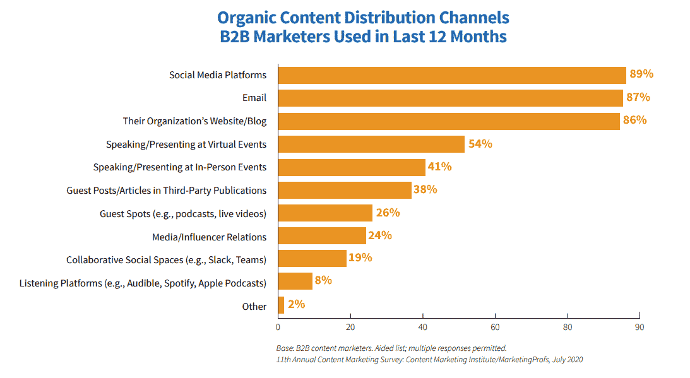

B2B content distribution channels (Image source: contentmarketinginstitute.com)

它排在社交媒体之后，比使用公司博客更常见。

B2C 内容营销专家也转向电子邮件来帮助分发他们的内容。79%的 B2C 营销人员依靠电子邮件来传播他们的新文章或博客文章。

B2C content distribution channels (Image source: contentmarketinginstitute.com)

只有社交媒体和公司网站的使用频率更高。

同一项研究还发现，电子邮件是在整个漏斗中培养和转化销售线索的最可靠渠道。

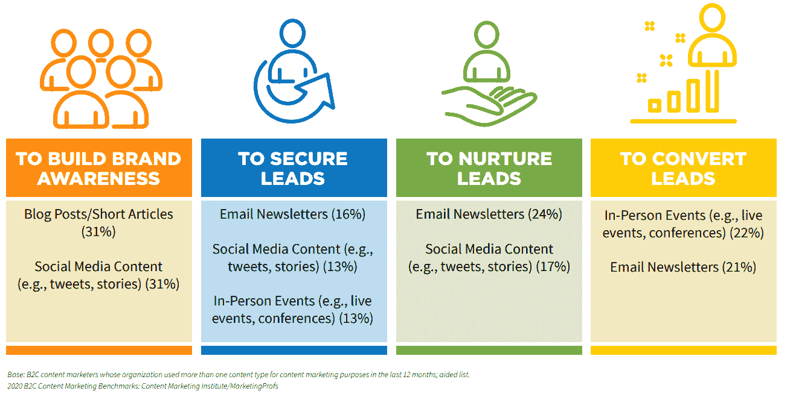

B2C sales funnel channels (Image source: contentmarketinginstitute.com)

这是获取、培育和转化潜在客户的主要渠道，也是转化潜在客户的第二选择。邮件是整个销售过程中不可或缺的一部分，而不仅仅是内容营销的早期阶段。

### 电子邮件是商务内容社交分享的三大渠道

电子邮件也是与同事分享业务相关内容的第二大流行渠道。多达 70%的专业人士使用电子邮件分享与他们公司或行业相关的内容。

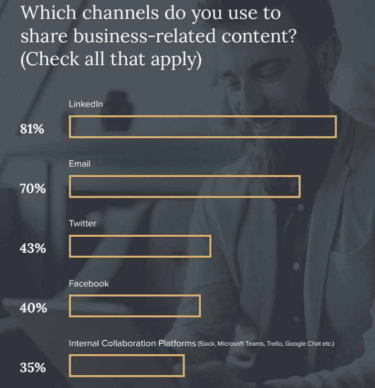

Business content sharing channels

这意味着你可以通过营销邮件接触到不止一个潜在的潜在客户。你的订户也可以直接转发给他们自己网络中的其他成员，增加你的电子邮件覆盖范围。

[Did you know that 4.03 billion people around the world used email in 2020? 👩‍💻 Move aside, social media- email is still the most powerful tool out there for content distribution.💥 Learn more right here 👇Click to Tweet](https://twitter.com/intent/tweet?url=https%3A%2F%2Fkinsta.com%2Fblog%2Femail-marketing-statistics%2F&via=kinsta&text=Did+you+know+that+4.03+billion+people+around+the+world+used+email+in+2020%3F+%F0%9F%91%A9%E2%80%8D%F0%9F%92%BB+Move+aside%2C+social+media-+email+is+still+the+most+powerful+tool+out+there+for+content+distribution.%F0%9F%92%A5+Learn+more+right+here...&hashtags=EmailMarketing%2CContentTips)

## 总潜在电子邮件覆盖范围和人口统计

2022 年，全球有[40.3 亿](https://www.statista.com/statistics/255080/number-of-e-mail-users-worldwide/)人使用电子邮件。专家预计，到 2024 年，这一数字将高达 44.8 亿。没有一个平台能与电子邮件的潜在影响力相提并论。

最新的脸书统计数据给了他们超过 22 亿的月活跃用户。即使你把他们和 [Instagram 的 10 亿多用户](https://kinsta.com/blog/instagram-stats/)加在一起，你甚至无法接近相同的用户数量。

更不用说，电子邮件在美国互联网用户中的渗透率 [90.3%](https://www.statista.com/statistics/628372/us-email-usage-reach-by-gender/) 。相比之下，只有 69%的美国成年人在脸书。

### 哪个年龄段的人使用电子邮件最多？

千禧一代可能是使用电子邮件最多的年龄段。数据告诉我们，在 Adobe 2018 年的一项研究中，1981 年至 1996 年出生的人每天花在电子邮件上的时间高达 6.4 小时。41%的人甚至在床上、下班前或下班后查看工作邮件。

相比之下，超过这个年龄的办公室职员每天只花 5 个小时在电子邮件上。

电子邮件不仅仅是老一代人的营销渠道。商业世界的很大一部分仍然 100%通过(或部分通过)电子邮件来管理，并且[使用模式](https://www.statista.com/statistics/628372/us-email-usage-reach-by-gender/)反映了这一点。

Percentage of US email users by age

这里的模式不像查看收件箱和发送电子邮件统计数据的实际时间那样清晰。

但我们可以肯定的是，电子邮件没有成为死亡渠道的危险。

许多营销人员将电子邮件描绘成一种过时的媒介，但事实并非如此。它活得好好的！

### 环境分享:人们用什么设备打开电子邮件？

但是消费者倾向于在哪里打开他们的电子邮件呢？近 42%的电子邮件打开发生在移动应用程序上。

剩下的 58%用于桌面应用程序，18.2%用于桌面应用程序，39.8%的电子邮件在网络应用程序中打开(如 [Gmail](https://kinsta.com/blog/gmail-search-operators/) 或 Outlook.com)。

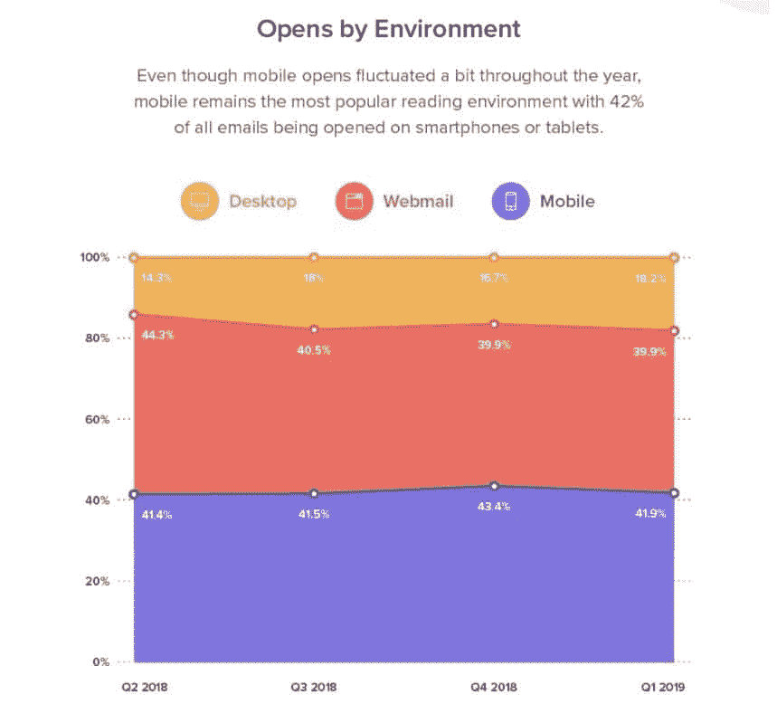

Email opens by device

这意味着至少有十分之四的用户可能会在移动设备上阅读你的邮件。所以当[设计你的时事通讯](https://kinsta.com/blog/best-fonts-for-email/)和[写你的主题](https://kinsta.com/blog/why-are-my-emails-going-to-spam/#3-your-subject-lines-are-misleading-or-contain-spam-triggers)时，你必须记住这一点。

### 电子邮件细分统计:你应该细分你的受众吗？

分段的电子邮件似乎比群发邮件给所有人要好得多。

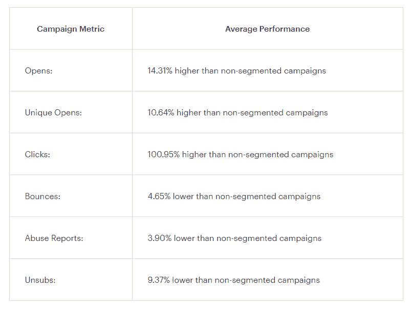

Segmented email performance

虽然打开、唯一打开、反弹和取消订阅有所改善，但这不是真正的情况。细分活动的点击率比非细分活动的点击率高**100.95%**(平均)。

如果每个订阅者对你的邮件采取行动的可能性是你的两倍，这可能意味着对你的底线也有重大影响。

## 平均邮件打开率:阅读邮件的百分比是多少？

根据来源的不同，平均电子邮件打开率从 18%(活动监控)到 22.15%(GetResponse)。平均下来，四大平台的打开率为 20.56%。

| **来源** | **平均打开率(2019-2020)** |
| [运动监控器](https://www.campaignmonitor.com/resources/guides/email-marketing-benchmarks/) | 18% |
| [轮毂位置](https://blog.hubspot.com/sales/average-email-open-rate-benchmark) | 20.94% |
| [MailChimp](https://mailchimp.com/resources/email-marketing-benchmarks/) | 21.33% |
| [推进](https://www.getresponse.com/resources/reports/email-marketing-benchmarks) | 22.15% |

**注意:**这些数字并不自动意味着一家[电子邮件营销软件提供商](https://kinsta.com/blog/email-marketing-software/)比另一家好。相反，它们可能代表了用户从列表中清除不活跃用户的频率和彻底程度的差异。

与有机社交接触相比，打开率保持相当稳定。每次你发送一封自动化的营销邮件，至少有超过五分之一的用户会打开它。

### 按行业划分的开放利率

行业差异呢？打开邮件的邮件订阅者的平均数量是否因类别而异？

下面我们重点介绍了几个关键行业之间的差异。

| **行业** | MailChimp | 轮毂点 | 活动监视器 | GetResponse |
| 代理 | 21.39% | 不适用的 | 18.50% | 16.10% |
| 美人 | 16.65% | 不适用的 | 不适用的 | 25.09% |
| 商业服务 | 21.56% | 20% | 18.3% | 不适用的 |
| 媒体和娱乐 | 22.15% | 21% | 20.80% | 28.72% |
| 零售 | 18.39% | 23% | 12.60% | 22.38% |
| 房地产 | 19.17% | 26% | 19.70% | 25.48% |

*   通过 GetResponse，媒体和娱乐行业的平均打开率最高，为 28.72%。
*   根据 Campaign Monitor 的数据，零售业的最低注册平均打开率为 12.6%。

**媒体&娱乐**在所有平台上的打开率一直高于平均水平。这可能表明消费者更有可能打开和阅读他们感兴趣的电子邮件。具有一定娱乐价值的电子邮件可能对竞选活动的表现至关重要。

请注意，开放率的行业差异在提供商之间并不完全一致。

### 冷外联与自动电子邮件

这听起来可能违反直觉，但当以令人信服的方式进行时，[冷外联邮件](https://kinsta.com/blog/find-email-address/)比选择加入营销邮件有更高的打开率。事实上，[根据 outreach.io](https://www.outreach.io/blog/how-we-create-outbound-sales-sequences-that-convert) 的数据，开放率基准为 27%，几乎比自动化电子邮件提供商的最低平均水平高出 10%。

向不同公司的核心人物发送有针对性的电子邮件是一种强有力的营销工具。但是你必须遵守当地关于不请自来的电子邮件的规章制度(否则[收件人会将你的电子邮件标记为垃圾邮件](https://kinsta.com/blog/why-are-my-emails-going-to-spam/#1-your-recipients-marked-your-emails-as-spam))。

## 平均电子邮件点击率:电子邮件带来了多少流量？

电子邮件的平均点击率从 2.6% (Campaign Monitor)到 3.43% (GetResponse)。

| **来源** | **平均点击率(2019–2020)** |
| 活动监视器 | 2.6% |
| 轮毂点 | 7.8%(打开的电子邮件) |
| MailChimp | 2.62% |
| GetResponse | 3.43% |

注意:HubSpot 根据打开的电子邮件计算点击率，而其他提供商根据成功发送的电子邮件来计算点击率。基于其打开率的推断意味着点击率(当以与其他来源相同的方式计算时)将在 1.6-7%左右。

### 按行业划分的点击率

让我们按行业检查点击率，以更细致地了解情况。

| **行业** | MailChimp | 轮毂点 | 活动监视器 | GetResponse |
| 代理 | 2.66% | 不适用的 | 2.30% | 1.87% |
| 美人 | 1.92% | 不适用的 | 不适用的 | 4.19% |
| 商业服务 | 2.72% | 8.01% ***** | 2.80% | 不适用的 |
| 媒体和娱乐 | 4.62% | 7.71%* | 3.60% | 4.48% |
| 零售 | 2.25% | 8.53%* | 1.10% | 3.39% |
| 房地产 | 1.77% | 7.17%* | 3.50% | 3.07% |

*同样，Hubspot 的点击率是根据打开的邮件计算的，而不是所有发送的邮件。

*   媒体的平均点击率最高，MailChimp 为 4.62%，GetResponse 为 4.48%。
*   来自 Campaign Monitor 的平均点击率最低的是零售业，为 1.1%。

就像打开率一样，媒体在点击率方面也做得很好。这证实了为你的观众提供娱乐价值的重要性。

## 平均邮件跳出率:有多少邮件成功了？

平均电子邮件退回率显示未安全到达目标电子邮件收件箱的电子邮件的百分比。

由于过期的电子邮件地址、垃圾邮件过滤器、选择输入的打字错误和其他原因，电子邮件没有到达目的地。

供应商记录的平均跳出率从 0.58% (MailChimp)到 0.7%(竞选监测)。

| **来源** | **平均跳出率(2019–2020)** |
| 活动监视器 | 0.7% |
| 轮毂点 | 0.63% |
| MailChimp | 0.58% |
| GetResponse | 不适用的 |

Campaign Monitor 的数字再次上升是有道理的，因为它的用户似乎比其他服务的用户更少地删除了他们的列表。

[电子邮件认证](https://kinsta.com/blog/email-authentication/)对于避免进入[垃圾邮件箱](https://kinsta.com/blog/why-are-my-emails-going-to-spam/)至关重要，这会大大降低你的电子邮件被打开和阅读的机会。

### 按行业

当我们按行业来看这些数字时，我们看到了与其他行业报告类似的趋势。

| **行业** | MailChimp | 轮毂点 | 活动监视器 |
| 代理 | 0.93% | 不适用的 | 1.10% |
| 美人 | 0.33% | 不适用的 | 不适用的 |
| 商业服务 | 0.55% | 0.70% | 0.80% |
| 媒体和娱乐 | 0.27% | 0.30% | 0.40% |
| 零售 | 0.32% | 0.40% | 0.40% |
| 房地产 | 0.56% | 0.70% | 1.40% |

注意:GetResponse 不提供跳出率数据。

*   平均而言，媒体和娱乐的反弹率最低，分别为 0.27%、0.3%和 0.4%。
*   代理、房地产公司和商业服务是反弹率最高的行业。

## 平均邮件退订率:每封邮件你会失去多少订阅者？

退订率是您发送的每封电子邮件中退订您的列表的平均订阅人数。

供应商的平均退订率从 0.1%(竞选监测)到 0.48% (HubSpot)。

| **来源** | **平均退订率(2019–2020)** |
| 活动监视器 | 0.1% |
| 轮毂点 | 0.48% |
| MailChimp | 0.26% |
| GetResponse | 0.2% |

### 按行业

当我们比较行业数据时，退订率再次显示出与其他数据相同的趋势。

| **行业** | MailChimp | 轮毂点 | 活动监视器 | GetResponse |
| 代理 | 0.35% | 不适用的 | 0.20% | 0.16% |
| 美人 | 0.30% | 不适用的 | 不适用的 | 0.25% |
| 商业服务 | 0.20% | 0.50% | 0.20% | 不适用的 |
| 媒体和娱乐 | 0.12% | 0.30% | 0.00% | 0.20% |
| 零售 | 0.25% | 0.50% | 0.00% | 0.19% |
| 房地产 | 0.27% | 0.60% | 0.20% | 0.20% |

*   媒体和娱乐的整体退订率最低，分别为 0.12%、0.3%、0.00%、0.19%。
*   房地产和中介公司的平均水平是最高的。

## 平均邮件转换率:你会产生多少销售额？

转换率显示了平均而言，营销邮件带来销售的百分比。

根据 Barilliance 的数据，2021 年，电子邮件的平均转化率为 [1.22%](https://www.barilliance.com/email-marketing-statistics/) 。这仅仅是 100 封电子邮件中的一次销售。

大多数电子邮件营销提供商不分享转化率的官方数据，因为许多用户不使用平台直接跟踪转化率。

当一百封电子邮件中只有一封能促成销售时，这听起来可能不太妙。

但是等一下。

电子邮件营销不像其他营销平台。你不必为展示或点击付费。

您只需根据您的列表或功能的大小支付固定的月费。

此外，产生的许多销售是对以前客户的追加销售或重复销售。这些往往比首次互动销售更有价值，这在电子邮件营销投资回报率数字中有所体现。

让我们仔细看看。

## 平均电子邮件营销投资回报率:值得吗？

投资回报(ROI)衡量在营销活动中投入的每一美元产生的收入。

 ## 注册订阅时事通讯

### 想知道我们是怎么让流量增长超过 1000%的吗？

加入 20，000 多名获得我们每周时事通讯和内部消息的人的行列吧！

[Subscribe Now](#newsletter)

根据 [DMA](https://dma.org.uk/uploads/misc/marketers-email-tracker-2019.pdf) 和 [Litmus](https://www.litmus.com/resources/email-marketing-roi/) 的数据，2019 年，在电子邮件营销上花费的每一美元的平均投资回报率为**42**。

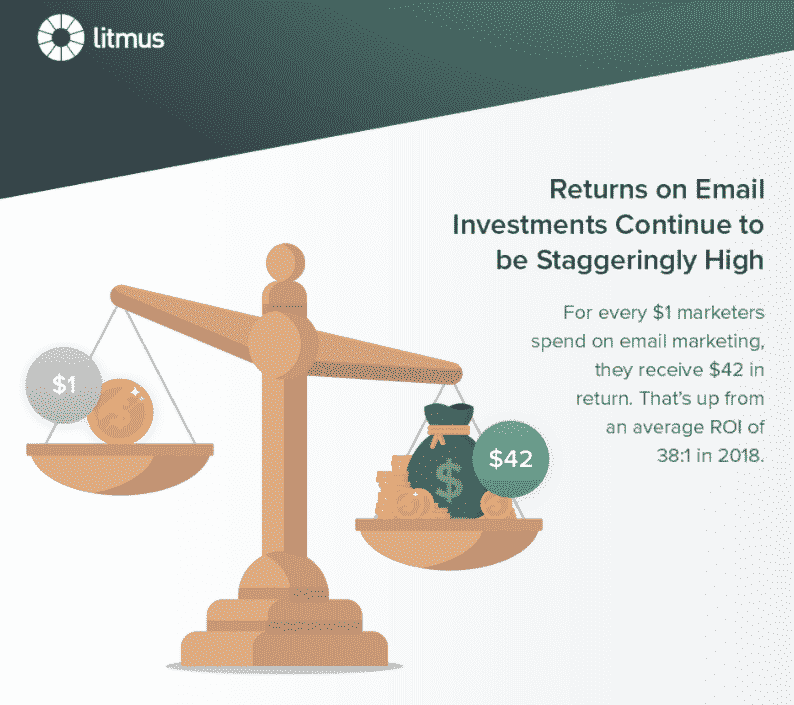

Email marketing ROI

有趣的是，这些研究来自不同国家的不同公司。

这大大高于其他数字营销渠道的投资回报率，如 PPC，谷歌在官方案例研究中吹嘘其 1.5 美元的回报。

## 最流行的电子邮件营销自动化

最好的订单自动化是欢迎电子邮件、购物车恢复电子邮件和客户重新激活自动化。

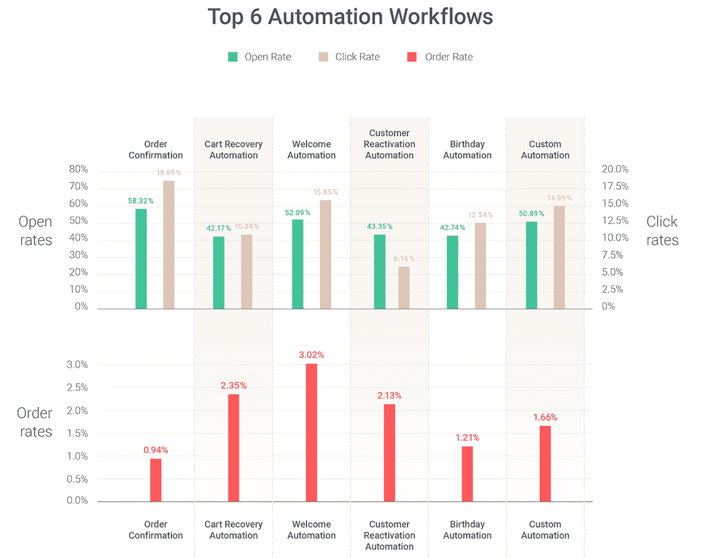

Most popular email automations

自动化的欢迎邮件不仅推动了第二高的打开率和点击率，而且还贡献了最高的销售百分比，订单率为 3.02%。

排在第二位的，从订单来看，分别是购物车恢复邮件(或[废弃购物车邮件](https://kinsta.com/blog/abandoned-cart-email/))，订单率 2.35%。

客户再激活邮件排在第三，平均下单率 2.13%。

所有这些触发电子邮件很容易与大多数电子邮件营销提供商建立起来，可以为你带来 7%或更多的额外销售。

这就是为什么任何精明的数字营销人员都将自动化作为其电子邮件营销活动的一部分。

让我们仔细看看购物车恢复电子邮件。

### 电子邮件可以帮助你重新获得高达 8%的废弃购物车(并增加 4%以上的总销售额)

[电子商务商店](https://kinsta.com/blog/ecommerce-platforms/)面临的最大问题之一是[废弃购物车](https://kinsta.com/blog/shopping-cart-abandonment/)数量庞大。

通过[汇总不同的研究](https://baymard.com/lists/cart-abandonment-rate)，我们可以看到**几乎 70%的消费者弃车而不买任何东西**。

那么你应该怎么做呢？

继续发送电子邮件(也许试着改进它们),因为如果你停下来，你将会错失良机。

根据 Barilliance 的数据，8.24% 的购物车恢复电子邮件会导致转化。这比平均 1%多一点的邮件转换率要高得多。

这可以帮助你将总销售额提高 5%或更多。

根据 SaleCycle，实施购物车放弃电子邮件的平均销售增长为 [4.43%](https://www.salecycle.com/blog/featured-en-us/18-essential-email-marketing-statistics/)

有些行业超过 6%。

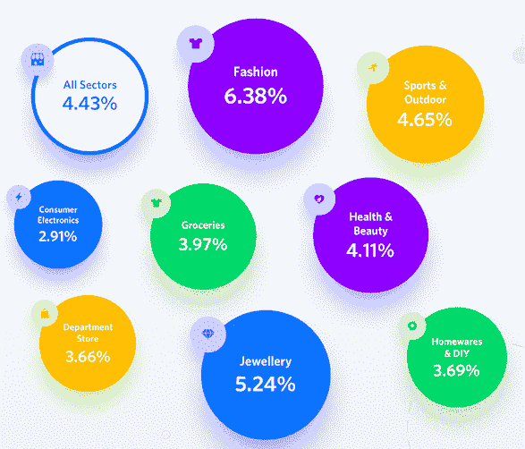

Sales uplift from cart recovery emails

## 何时发送以及如何写电子邮件才能获得最佳效果

有什么比探索最佳电子邮件更好的方式来完成这篇文章呢？让我们先来看看你应该在什么时候发送电子邮件。

### 发送营销邮件的最佳日期是哪一天？

不幸的是，一周中发送营销邮件的最佳日期取决于你所在的行业和受众。

数据显示**没有决定性的普遍的发送电子邮件的“最佳日”**。

GetResponse 和 Campaign Monitor 的数据显示，基于一周中的每一天，活动的平均表现几乎没有变化。

Email results by weekday

周末的总成交量要低得多，开盘价略有下降，但点击率保持不变。

Email results by weekday

周二的开放率比其他日子略高，但 CTR 几乎每天都不变。来自这些电子邮件活动的任何流量或销售数字也可能是可比的。

需要一个给你带来竞争优势的托管解决方案吗？Kinsta 为您提供了令人难以置信的速度、一流的安全性和自动伸缩功能。[查看我们的计划](https://kinsta.com/plans/?in-article-cta)

那么这是不是意味着你可以在任何你想要的日子发送邮件呢？不一定。

先前由 [MailChimp](https://kinsta.com/blog/how-to-use-mailchimp/) [进行的研究表明](https://mailchimp.com/resources/insights-from-mailchimps-send-time-optimization-system/)最佳发送时间取决于行业和人口因素。

Weekend optimal send time %

因此，虽然平均值没有变化，但运行 [A/B 测试](https://kinsta.com/blog/wordpress-ab-testing-tools/)来为你的订户找到一周中最好的一天仍然是值得的。

没有放之四海而皆准的正确答案，但是你可能会发现某一天会给你的听众带来更好的效果。

### 发送营销邮件的最佳时间是什么时候？

清晨发送的电子邮件似乎能给每封邮件带来最好的结果。至少，根据 Omnisend 的研究，这是一个明确的结论。

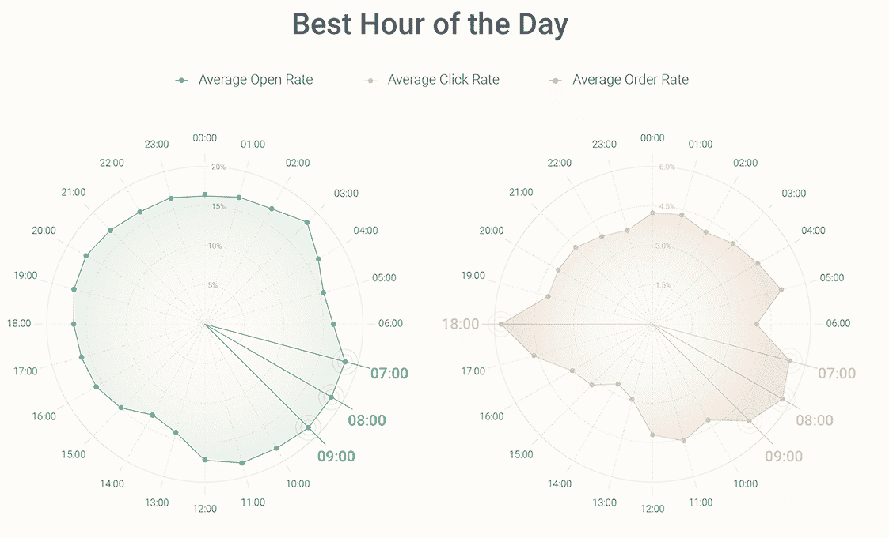

Best hour of the day for email

就开放率而言，早上 7 点到 9 点之间似乎有明显的优势。

下午 6 点似乎是发送电子邮件推动销售的最佳时间，平均订单率最高。

GetResponse 的数据显示，大部分电子邮件都是在此期间发送的，但不一定能获得最佳结果。

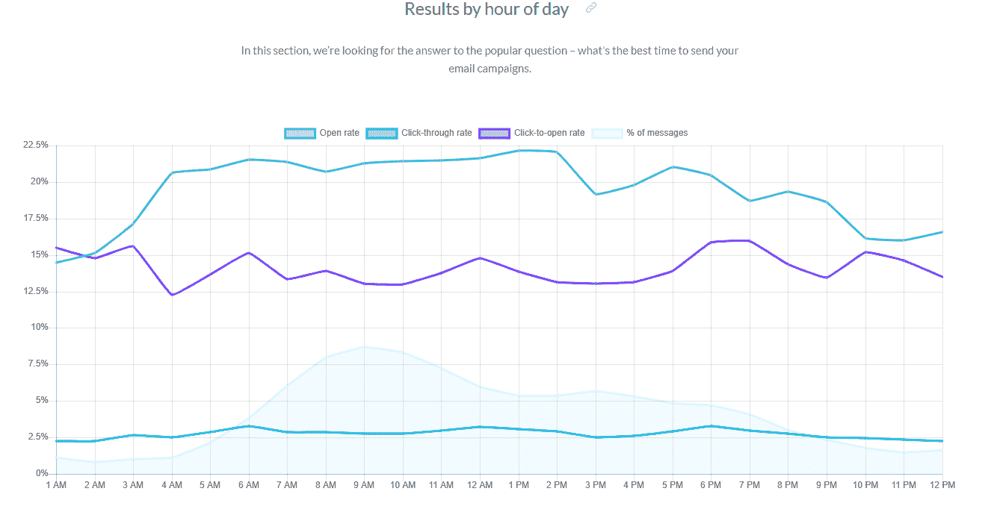

Best hour of day for email

相反，最高开盘价似乎出现在接近下午 1 点的时候，大约在午餐时间，但在下午时段面临急剧下降。

CTR 也在下午 6 点达到峰值，这是 Omnisend 数据的平均订单率。尝试在下午 6 点而不是早上发送优惠券或基于优惠的电子邮件可能是值得的。

### 理想主题行长度

你应该在邮件主题中使用多少字符比较理想？

简短的主题行在点击率和整体参与度方面似乎都表现不佳。

绝大多数邮件的主题不超过 100 个字符。但是更长的主题行(110-140 个字符)有更高的点击率和打开率。

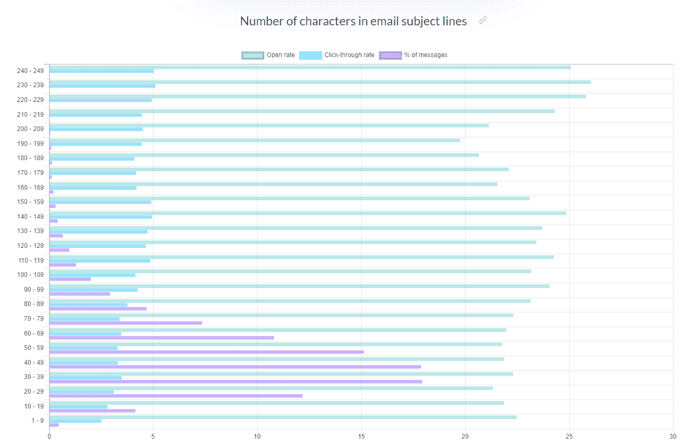

Ideal subject line length

来自 Marketo 的研究显示了点击率的类似趋势，即点击率越长越好。

Ideal subject line length

点击率的巨大差异可能表明文案质量的差异，而不仅仅是在同样好的主题行中增加或减少一个单词。

根据行业和目标受众的不同，结果可能也会有所不同。订户是在移动设备上还是在台式机上查看电子邮件也会有所不同。

但是不要害怕比几句话更长的时间。

### 你应该在主题中使用表情符号吗？

那么[表情符号](https://kinsta.com/knowledgebase/disable-emojis-wordpress/)呢？你应该在主题行中使用它们吗？根据数据，答案似乎是肯定的。

虽然不到 4%的电子邮件包含表情符号，但平均打开率比没有表情符号的电子邮件高 3%。

Subject line emoji usage

只要有意义，你可以尝试用主题来提高你的打开率。

### 个性化主题行表现更好吗？

一条个性化的主题线真的表现更好吗？

答案似乎是肯定的，但只有一点点。不到总消息的 12%，打开率只有 0.54%，这远非定论。

Subject line personalization

也可能是因为发送个性化邮件的电子邮件营销人员也倾向于写出稍好的文案。

### 哪些词让你的主题更容易点击？

最后，让我们来看看让你的主题更容易点击的单词和符号。

只有几个单词和符号似乎将电子邮件推高到 GetResponse 22.15%的平均打开率之上。

Best words for subject lines

*   **时事通讯—**24.09%的打开率值得注意，因为这个词并不意味着有人通过电子邮件立即注册下载。
*   **FW—**33.18%的打开率，但是样本量非常小，而且有点不诚实(假装不是自动邮件)。
*   **PDF**–24.54%的打开率可能是由电子邮件锁定的报告或白皮书下载造成的。
*   15.52%的人警告不要在邮件主题中使用这个词。

### 在电子邮件中使用动画 gif 来吸引你的观众

电子邮件不再局限于冗长单调的静态文本段落。

营销人员不仅仅是在主题行中使用表情符号来吸引用户的注意力。

他们还使用动画 gif 让他们的邮件更吸引人。56.5%的营销人员至少在一些营销邮件中使用 gif。

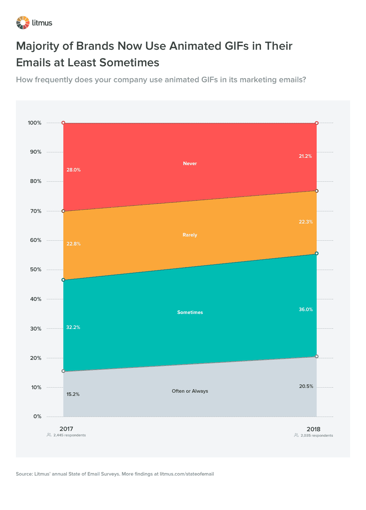

GIF usage in emails

您可以使用动画 GIF 来展示正在运行的新功能，为新产品增添视觉效果，等等。同时，别忘了为你的电子邮件选择最完美的字体。

### 尝试改进电子邮件时最重要的衡量标准

但是你应该关注什么指标来看你的[邮件是否在执行](https://kinsta.com/blog/email-marketing-tips/)？大多数营销人员认为点击率、打开率和邮件后转化率是三个最重要的 T2。

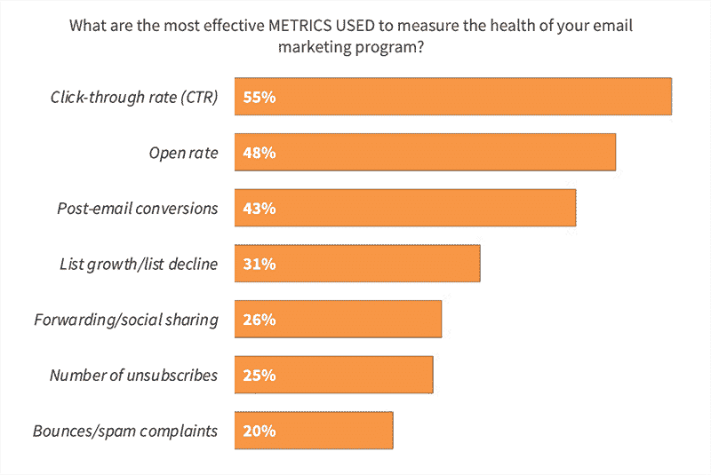

Most effective email metrics

通过关注正确的数据，你可以很容易地看到你对电子邮件所做的改变是否有积极的影响。

### 你应该在一封邮件上花多长时间？

大多数品牌在一封营销邮件上花费[多周](https://www.litmus.com/resources/state-of-email-workflows/)。

Time to produce email

这是因为电子邮件从集思广益到被审查和接受，遵循了一个严格的多阶段过程。

如果你在一个较小的团队，你显然不需要花那么多时间处理每封邮件。

当然，没有哪个团队会几个月只处理一封邮件。大多数电子邮件营销团队在任何时候都会处理至少五封电子邮件。

Number of emails in production

[Email is still alive and kicking- and its reach is only expected to grow in the next 4 years 📈 See how you can leverage the power of email marketing with these stats ⬇️Click to Tweet](https://twitter.com/intent/tweet?url=https%3A%2F%2Fkinsta.com%2Fblog%2Femail-marketing-statistics%2F&via=kinsta&text=Email+is+still+alive+and+kicking-+and+its+reach+is+only+expected+to+grow+in+the+next+4+years+%F0%9F%93%88+See+how+you+can+leverage+the+power+of+email+marketing+with+these+stats+%E2%AC%87%EF%B8%8F&hashtags=EmailTips%2CContentMarketing)

### 创建电子邮件时，你应该最关注哪个方面？

创建电子邮件时，你应该在哪些方面投入最多的时间和资源？

平均来说，公司花更多的时间在设计、编码和评审上。

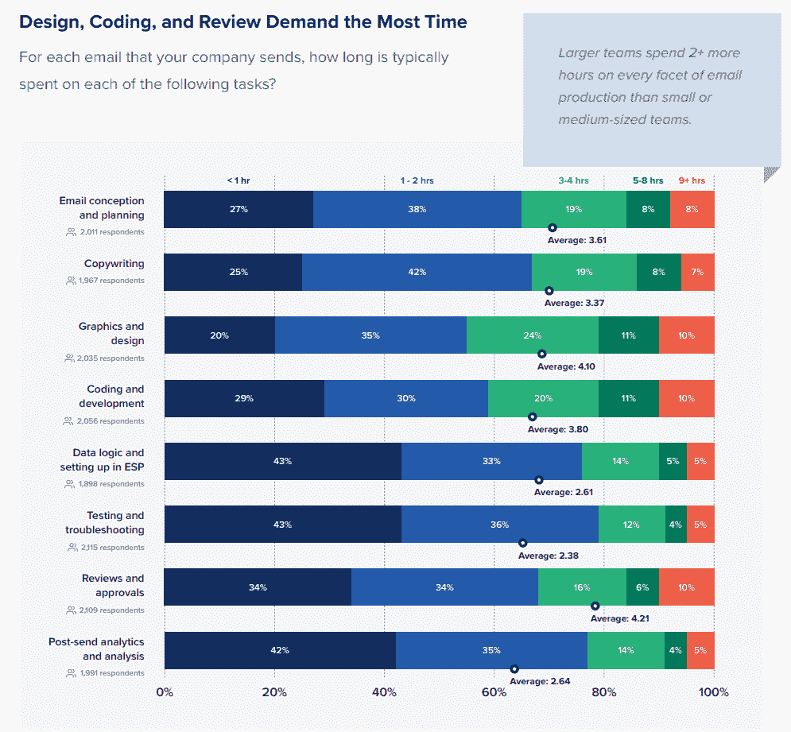

Email workflow time investment

这是有道理的，因为设计和编码比任何其他阶段都更能影响实际的电子邮件体验。

在评论中，高级编辑必须优化文案，确保邮件完全遵循品牌指南。

## 摘要

邮件营销没有死，还远没有死。在 2022 年，它仍然是任何规模的企业都可以投资的最佳渠道之一。

平均回报率超过投资的 40 倍，你不能忽视它。

虽然平均打开率和点击率比以前低了，但这仍然是培养与客户关系、挽回潜在的业务损失以及应对不活跃用户的有效方式。

任何忽视电子邮件的企业都错失了良机，而且是大错特错。

* * *

让你所有的[应用程序](https://kinsta.com/application-hosting/)、[数据库](https://kinsta.com/database-hosting/)和 [WordPress 网站](https://kinsta.com/wordpress-hosting/)在线并在一个屋檐下。我们功能丰富的高性能云平台包括:

*   在 MyKinsta 仪表盘中轻松设置和管理
*   24/7 专家支持
*   最好的谷歌云平台硬件和网络，由 Kubernetes 提供最大的可扩展性
*   面向速度和安全性的企业级 Cloudflare 集成
*   全球受众覆盖全球多达 35 个数据中心和 275 多个 pop

在第一个月使用托管的[应用程序或托管](https://kinsta.com/application-hosting/)的[数据库，您可以享受 20 美元的优惠，亲自测试一下。探索我们的](https://kinsta.com/database-hosting/)[计划](https://kinsta.com/plans/)或[与销售人员交谈](https://kinsta.com/contact-us/)以找到最适合您的方式。