# WordPress 5.6 的新特性(可访问性、性能、安全性)

> 原文:[https://kinsta.com/blog/wordpress-5-6/](https://kinsta.com/blog/wordpress-5-6/)

WordPress 5.6“Simone”已经发布，我们很高兴能和你一起深入了解 2020 年最新发布的 WordPress 核心版中最有趣的功能和新增功能。

像以前的版本一样，WordPress 5.6 包括了几个版本的 Block Editor，为那些网站上还没有安装和更新 Gutenberg 插件的 WordPress 用户增强了编辑体验。

然而，并不是所有的事情都与块编辑器有关。WordPress Core 增加了几个特性，比如新的默认 Twenty Twenty One 主题，主要版本的自动更新，对 PHP 8.0 的更好支持，REST API 认证的应用程序密码。

在 WordPress 5.6 中还有更多。我们将看到可访问性的改进、UI 的增强、大量的错误修复，以及为开发人员带来的大量变化。

[We are excited to share with you what's new in WordPress 5.6\. 🥳 Don't miss all the new features, enhancements, and the brand new default theme: Twenty Twenty-One 🎁Click to Tweet](https://twitter.com/intent/tweet?url=https%3A%2F%2Fbit.ly%2F2KTttwN&via=kinsta&text=We+are+excited+to+share+with+you+what%27s+new+in+WordPress+5.6.+%F0%9F%A5%B3+Don%27t+miss+all+the+new+features%2C+enhancements%2C+and+the+brand+new+default+theme%3A+Twenty+Twenty-One+%F0%9F%8E%81)

如果你想了解更多关于 WordPress 5.6 开发周期的信息，请点击下面的链接:

*   2020 年 10 月 20 日: [Beta 1](https://wordpress.org/news/2020/10/wordpress-5-6-beta-1/)
*   2020 年 10 月 27 日: [Beta 2](https://wordpress.org/news/2020/10/wordpress-5-6-beta-2/)
*   2020 年 11 月 2 日: [Beta 3](https://wordpress.org/news/2020/11/wordpress-5-6-beta-3/)
*   2020 年 11 月 12 日: [Beta 4](https://wordpress.org/news/2020/11/wordpress-5-6-beta-4/)
*   2020 年 11 月 17 日: [RC 1](https://wordpress.org/news/2020/11/wordpress-5-6-release-candidate/)
*   2020 年 12 月 7 日:WordPress 5.6 发布的试运行
*   2020 年 12 月 8 日:发布 5.6 版“西蒙”

准备好开始了吗？我们来看一下:

 ## 块编辑器的新特性

在 WordPress 5.6 中，[古腾堡插件](https://kinsta.com/blog/gutenberg-wordpress-editor/)的几个版本已经合并到核心中，所以 [WordPress 用户和作者](https://kinsta.com/blog/wordpress-keyboard-shortcuts/)应该会注意到编辑器中的几个改进。我们将会看到增强的区块模式、信息面板中的字数统计、改进的键盘导航、改进的拖拽&UI 等等。


关于添加到块编辑器的所有改进和更改的更全面列表，请查看发布公告帖子: [8.6](https://make.wordpress.org/core/2020/07/22/whats-new-in-gutenberg-july-22/) 、 [8.7](https://make.wordpress.org/core/2020/08/05/whats-new-in-gutenberg-august-5/) 、 [8.8](https://make.wordpress.org/core/2020/08/19/whats-new-in-gutenberg-august-19/) 、 [8.9](https://make.wordpress.org/core/2020/09/03/whats-new-in-gutenberg-2-september/) 、 [9.0](https://make.wordpress.org/core/2020/09/16/whats-new-in-gutenberg-16-september/) 、 [9.1](https://make.wordpress.org/core/2020/10/01/whats-new-in-gutenberg-30-september/) 和 [9.2](https://make.wordpress.org/core/2020/10/21/whats-new-in-gutenberg-21-october/) 。在古腾堡 [9.3](https://make.wordpress.org/core/2020/11/04/whats-new-in-gutenberg-4-november/) 和 [9.4](https://make.wordpress.org/core/2020/11/19/whats-new-in-gutenberg-18-november-2/) 中实现的 Bug 修复和性能提升也包含在 WordPress 5.6 中。

让我们深入研究一下我们将在块编辑器中看到的更有趣的变化。

1.  [模块、模式和用户界面改进](#blocks-patterns-and-ui-improvements)
2.  [阻止 API V2](#block-api-v2)
3.  [面向块开发人员的附加特性和改进](#additional-features-and-improvements-for-block-developers)

 ### 块、模式和 UI 改进

新的块功能、增强功能和错误修复将改善整体编辑体验。此外，在[可访问性](https://kinsta.com/blog/twenty-twenty-one-theme/#twenty-twentyones-theme-and-block-features)方面也做了大量工作。下面你会发现我们精心挑选的最有趣的功能，一旦你把你的网站更新到 WordPress 5.6，你就会在 block editor 中看到。

#### 封面块中视频的位置控制

自[古腾堡 8.6](https://make.wordpress.org/core/2020/07/22/whats-new-in-gutenberg-july-22/) 起添加到封面区块，视频的位置控件允许用户四处移动焦点，并为[视频](https://kinsta.com/blog/embed-youtube-video-wordpress/)设置自定义位置。该功能以前仅适用于图像背景。

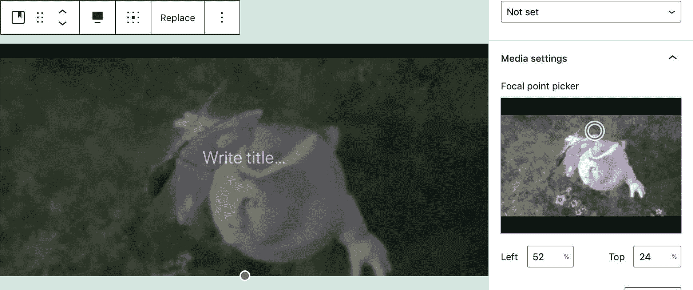

Video Position Controls for Cover Block


通过单击焦点选取器上的任意位置和/或使用键盘上的箭头键来设置位置值。按住 shift 键可以将数值跳跃 10(另见 [#22531](https://github.com/WordPress/gutenberg/pull/22531) )。

#### 阻止特征码更新

WordPress 5.6 还包括几个[区块模式](https://kinsta.com/blog/wordpress-5-5/#block-patterns)的改进，增加了[古腾堡 8.6](https://make.wordpress.org/core/2020/07/22/whats-new-in-gutenberg-july-22/) 。

**大标题和段落**的布局、文字和颜色已经更新( [#23858](https://github.com/WordPress/gutenberg/pull/23858)

两栏文本中的标题已经从文本块中移出，并放置在各栏之上( [#23853](https://github.com/WordPress/gutenberg/pull/23853) )

**引用**模式现在包括顶部的图像和底部的分隔符。


The new Quote pattern includes an image and a separator


添加了新的标题和段落模式[古腾堡 8.7](https://make.wordpress.org/core/2020/08/05/whats-new-in-gutenberg-august-5/) ( [#24143](https://github.com/WordPress/gutenberg/pull/24143) )。

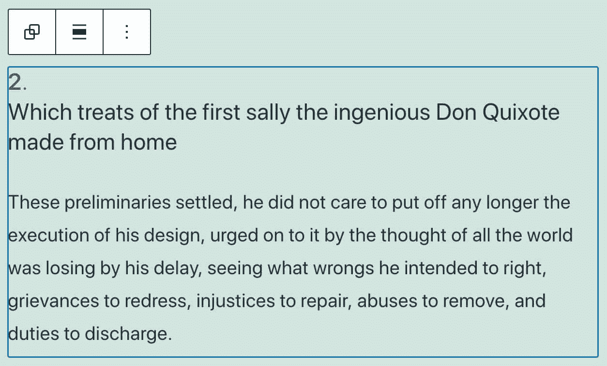

Heading and Paragraph pattern in WordPress 5.6


块插入器的一个很好的可用性改进是[块模式类别下拉菜单](https://make.wordpress.org/core/2020/10/01/whats-new-in-gutenberg-30-september/)，它允许你通过[类别](https://kinsta.com/knowledgebase/what-is-taxonomy/)过滤模式。当你有大量的图案可供选择时，这非常有用( [#24954](https://github.com/WordPress/gutenberg/pull/24954) )。

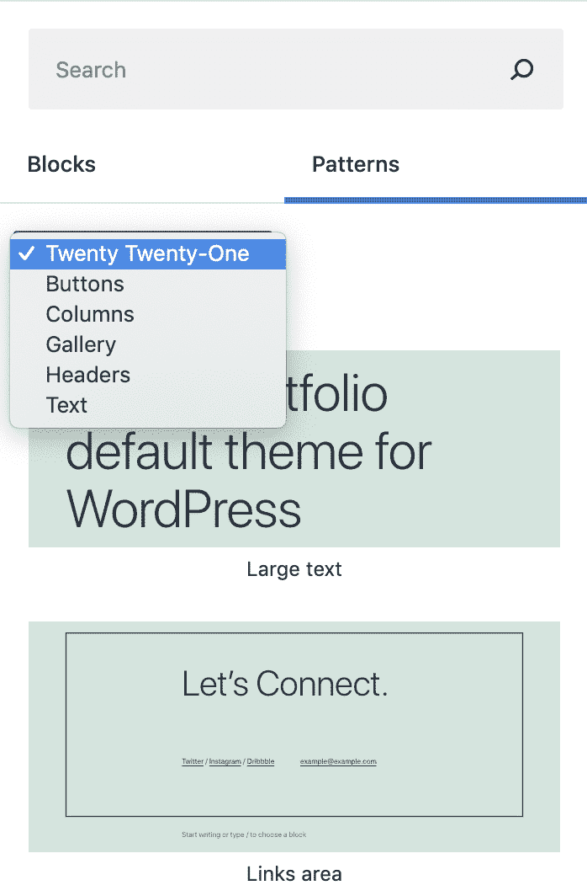

【方块图案类别】下拉框


 #### 支持视频字幕

视频块现在支持[视频字幕](https://make.wordpress.org/core/2020/10/21/whats-new-in-gutenberg-21-october/)。


Adding video subtitles in Video Block


编辑和内容创作者应提供 [WebVTT 格式](https://developer.mozilla.org/en-US/docs/Web/API/WebVTT_API)(网络视频文本轨道格式)的视频字幕，这是“一种使用`<track>`元素显示定时文本轨道(如字幕或说明文字)的格式”( [#25861](https://github.com/WordPress/gutenberg/pull/25861) )。


Track elements linking to subtitles in different languages


一旦你加载了你的*。vtt* 文件，网站观众将被允许启用他们最喜爱的语言字幕。

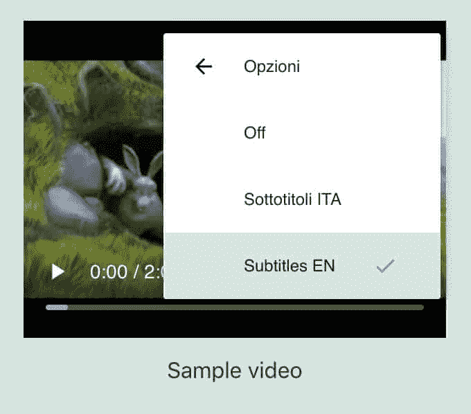

Video subtitles user settings


### Info

说到视频，每周一定要订阅[金斯塔的 YouTube 频道](https://www.youtube.com/channel/UCQnijdsf4IEy-3OvB_Qj6ZQ)获取新视频！


 #### 将多个块转换为一个列块

一个有趣的可用性改进是能够将多个选定的块转换成一个列块。


Select multiple blocks


你只需要选择你想在列中显示的块，然后点击块工具栏右上角的按钮。

每个选定的块将被转换为列块的列。

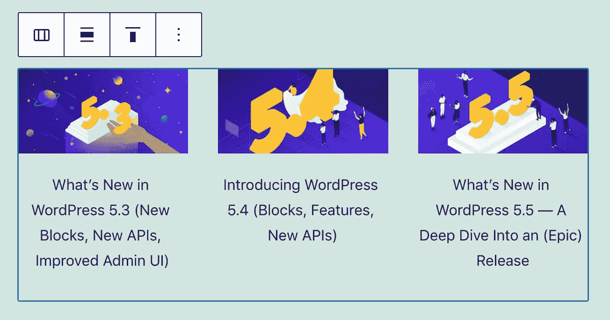

Three blocks converted into three columns


#### 封面块中的背景图案

覆盖块现在可以显示背景图案。

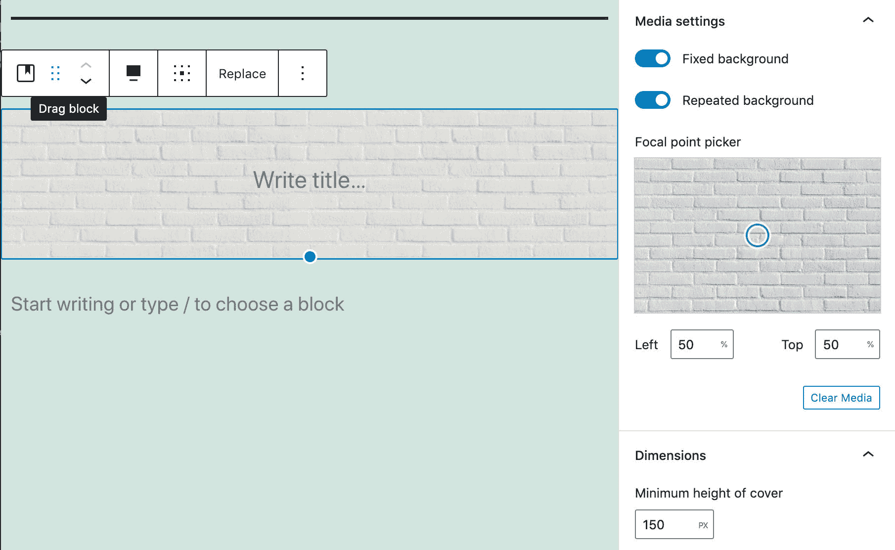

A cover block with a background pattern


要添加背景图案，上传图案图像，然后打开**重复背景**选项(这里是你需要知道的关于 WordPress 中[媒体库的一切)。](https://kinsta.com/blog/wordpress-media-library/)

完成后，根据您的需要调整焦点选择器，并尝试固定背景的不同组合。

#### 添加到媒体和文本块的图像大小控制

在古腾堡 9.1 中，一个新的图像尺寸控制被添加到媒体&文本块中的图像中。

用户现在可以从所有可用的图像尺寸中进行选择( [#24795](https://github.com/WordPress/gutenberg/pull/24795) )。

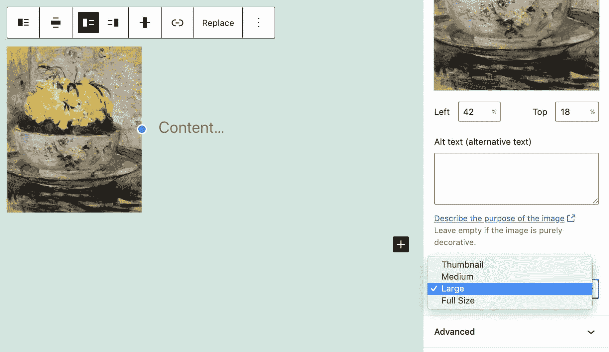

Image Size Control in Media & Text Block


### 阻止 API V2

新的[块 API 版本](https://make.wordpress.org/core/2020/11/18/block-api-version-2/)使块能够呈现它们的包装元素。新 API 版本的目标是减轻编辑器的 DOM，使其与首页内容相匹配。根据艾拉·范·杜普的说法:

> 这样做的最大好处是，如果编辑器中的标记相同，主题和插件可以更容易地设计块内容的样式。

新版本要求在块类型注册上声明`apiVersion`属性:

```
registerBlockType( name, { apiVersion: 2 } );
```

新 API 还需要块`Edit`函数中的`useBlockProps` [钩子](https://kinsta.com/blog/wordpress-hooks/)。这个钩子将块的包装元素标记为块元素。

传递给这个钩子的任何属性都将被合并并返回给包装元素。来自[开发笔记](https://make.wordpress.org/core/2020/11/18/block-api-version-2/)的以下示例展示了一个简单的用例:

```
import { useBlockProps } from '@wordpress/block-editor';

function Edit( { attributes } ) {
	const blockProps = useBlockProps( {
		className: someClassName,
		style: { color: 'blue' },
	} );
	return <p { ...blockProps }>{ attributes.content }</p>;
}
```

有关更多示例，请参见 [Block API 版本 2](https://make.wordpress.org/core/2020/11/18/block-api-version-2/) 。

### 面向块开发人员的附加功能和改进

除了 Block API 版本 2 之外，这里还有一份清单供[开发者](https://kinsta.com/blog/hire-wordpress-developer/)查看。

#### 块支持 API

[block Supports API](https://developer.wordpress.org/block-editor/developers/block-api/block-supports/) 允许 Block 开发者向他们的 Block 添加特性。[颜色](https://kinsta.com/blog/website-color-schemes/)、背景、[字体大小](https://kinsta.com/blog/how-to-change-font-in-wordpress/)只是可以通过块支持 API 添加到块中的许多特性中的几个。

WordPress 5.6 还引入了[几个新的块支持](https://make.wordpress.org/core/2020/11/18/block-supports-in-wordpress-5-6/)“以增加一致性，更容易将这些选项引入块中”。

开发者可以使用新的块支持将相应的键添加到 *block.json* 文件的`supports`属性中，或者直接添加到`registerBlockType` [函数](https://developer.wordpress.org/block-editor/developers/block-api/block-registration/#registerblocktype)中。

下面的例子来自[块支持开发说明](https://make.wordpress.org/core/2020/11/18/block-supports-in-wordpress-5-6/)显示了它是如何工作的:

```
supports: {
	color: {
		background: true, // Enable background color UI control.
		gradient: true, // Enable gradient color UI control.
		text: true // Enable text color UI control.
	},
	fontSize: true, // Enable font size UI control.
	lineHeight: true // Enable line height UI control.
}
```

样式值将通过`has-<value>-<preset-category>`类(对于预设值)或通过`style`元素(对于自定义值)自动附加到包装元素。

出于这个原因，组块支架打算与新的[组块 API V2](#block-api-v2) 一起使用。

块支架也可与[动态块](https://developer.wordpress.org/block-editor/tutorials/block-tutorial/creating-dynamic-blocks/)一起使用。

#### createblocksfrominblockstamp API

开发人员可以使用 [InnerBlocks 组件](https://developer.wordpress.org/block-editor/tutorials/block-tutorial/nested-blocks-inner-blocks/)来创建包含其他块的定制块。例如“专栏”块和“社交链接”块。

新的`createBlocksFromInnerBlocksTemplate`块 API 允许您从 InnerBlocks 模板创建块。

参见 [dev notes](https://make.wordpress.org/core/2020/11/18/new-createblocksfrominnerblockstemplate-block-api/) 获取 depper 视图和代码示例。

#### 工具栏组件

一些变化也影响了[工具栏组件](https://make.wordpress.org/core/2020/11/18/changes-to-toolbar-components-in-wordpress-5-6/):

##### 1.工具栏组组件

在 WordPress 5.6 之前，[工具栏](https://developer.wordpress.org/block-editor/components/toolbar/)组件允许开发者在一个公共容器中对相关选项进行分组。现在，应该使用一个新的[工具栏组](https://developer.wordpress.org/block-editor/components/toolbar-group/)组件。

```
<BlockControls>
	<ToolbarGroup>
		<ToolbarButton />
	</ToolbarGroup>
</BlockControls>
```

##### 2.工具栏按钮和工具栏项目组件

不赞成直接使用可制表元素作为工具栏项目(即`<button>`)。为了提高可访问性，可以使用[工具栏按钮](https://developer.wordpress.org/block-editor/components/toolbar-button/#inside-blockcontrols)添加工具栏项目，使用[工具栏项目](https://developer.wordpress.org/block-editor/components/toolbar-item/#inside-blockcontrols)添加其他控件。下面的例子显示了一个按钮和一个[下拉菜单](https://kinsta.com/knowledgebase/wordpress-dropdown-menu/):

```
<BlockControls>
	<ToolbarItem as="button" />
	<ToolbarButton />
	<ToolbarItem>
		{ ( itemProps ) => ( <DropdownMenu toggleProps={ itemProps } /> ) }
	</ToolbarItem>
</BlockControls>
```

#### 禁用核心块模式

现在可以使用`core-block-patterns`支持标志( [#24042](https://github.com/WordPress/gutenberg/pull/24042) )禁用核心模式

#### 禁用嵌入式图像编辑器

Gutenberg 8.4 增加了一个[内嵌图像编辑](https://kinsta.com/blog/wordpress-5-5/#inline-image-editing)功能，允许用户直接从块编辑器编辑图像。


Inline Image Editing


开发人员现在可以使用`block_editor_settings`过滤器( [#23966](https://github.com/WordPress/gutenberg/pull/23966) )禁用图像编辑器:

```
add_filter( 'block_editor_settings', function( $settings ) {
	$settings['imageEditing'] = false;
	return $settings;
} );
```


Inline Image Editing disabled


#### 移动到单独包装中的可重复使用的块

先前属于`@wordpress/editor`包的可重用块已经被[移动到](https://make.wordpress.org/core/2020/11/18/reusable-blocks-extracted-into-a-separate-package/)包中，以便在其他编辑器中可用。

## 一个新的默认主题:221

WordPress 5.6 包含了一个全新的默认主题。Twenty Twenty One 是一个高度易用的极简风格的 [WordPress 主题](https://kinsta.com/best-wordpress-themes/)，有一个单列布局和一个页脚侧边栏。

新的主题使用系统字体堆栈和基于柔和背景色的最小调色板。

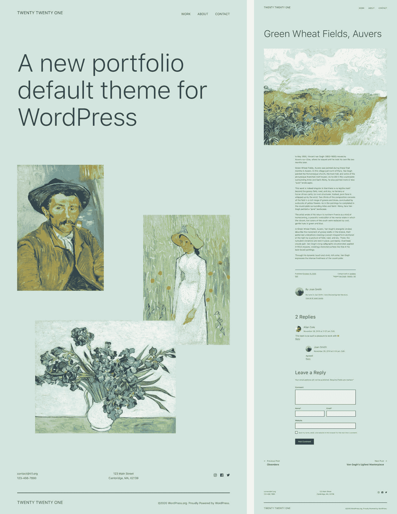

Twenty Twenty-One theme preview (Image source: Make WordPress Core)


你可以在我们的深度博客文章中读到更多关于 Twenty Twenty One 的内容:[Twenty Twenty One:深入探究 WordPress 新的默认主题](https://kinsta.com/blog/twenty-twenty-one-theme/)。

## 主要版本的自动更新

自动更新是 WordPress 3.7 中引入的一个核心功能，旨在提高[网站的安全性](https://kinsta.com/blog/wordpress-security/)，并使网站管理员更容易[保持他们的 WordPress 网站最新](https://kinsta.com/blog/wordpress-maintenance/)。

虽然在早期版本中已经实现了自动的次要核心更新，但是在 WordPress 5.6 中，站点管理员现在也可以手动启用主要版本的自动更新(稍后将详细介绍)。

不幸的是，对于非技术用户来说，这个重要的维护任务可能仍然有点混乱。你可以在我们的[深入 WordPress 自动更新](https://kinsta.com/blog/wordpress-automatic-updates/)博客文章中读到更多关于自动更新如何工作的信息。

因此， [WordPress 5.6 引入了一个新的界面](https://make.wordpress.org/core/2020/11/24/core-major-versions-auto-updates-ui-changes-in-wordpress-5-6-correction/)，允许站点管理员为主要核心版本启用自动更新。

这个特性的范围在 WordPress 5.6 测试周期中发生了变化，最初的[开发注释](https://make.wordpress.org/core/2020/11/02/introducing-auto-updates-interface-for-core-major-versions-in-wordpress-5-6/)已经被替换。用 [Jb 奥德拉斯](https://make.wordpress.org/core/2020/11/24/core-major-versions-auto-updates-ui-changes-in-wordpress-5-6-correction/)的话说，

> 核心自动更新的初始范围已经转移到:
> 
> *   为 UI 的设计提供一些更新。
> *   对于现有的安装，行为将保持不变:默认情况下选择加入较小的更新，但用户必须选择加入较大的更新(主机或代理已经在使用的常量和过滤器仍将优先)。
> *   对于新的安装，默认行为将会改变:默认情况下选择加入次要更新，默认情况下选择加入主要更新。

从 WordPress 5.6 开始，你可以在**更新**屏幕中选择主要核心版本的自动更新，其中一个新的 UI 提供了一个复选框，允许你**为所有新版本的 WordPress** 启用自动更新。

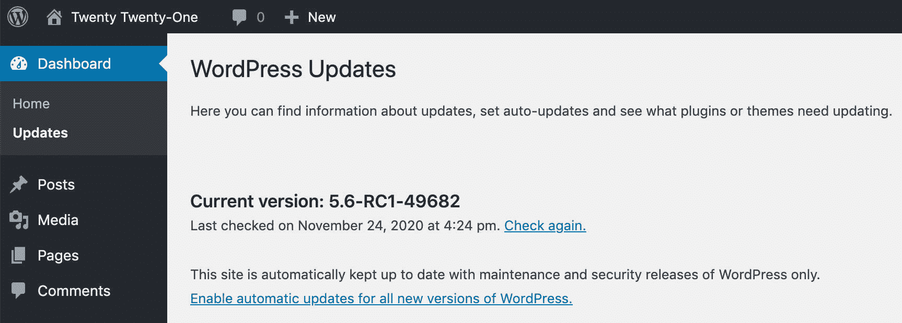

Enable automatic updates for all new versions of WordPress


一旦启用了主要版本的核心自动更新，您就可以通过单击**切换到仅针对维护和安全版本的自动更新**来启用仅针对维护和安全版本的核心自动更新。

 ## 注册订阅时事通讯


### 想知道我们是怎么让流量增长超过 1000%的吗？

加入 20，000 多名获得我们每周时事通讯和内部消息的人的行列吧！

[Subscribe Now](#newsletter)

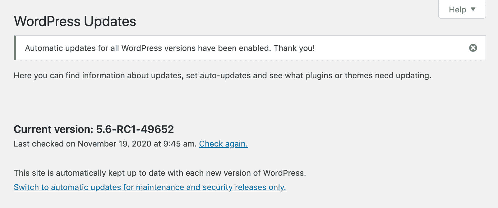

Switch to automatic updates for maintenance and security releases only


### 面向开发人员的主要自动核心更新

首先，当启用主要核心自动更新时，`auto_update_core_major`选项存储在启用了`option_value`的[数据库](https://kinsta.com/knowledgebase/wordpress-repair-database/)中。因此，如果`get_site_option( 'auto_update_core_major' )`返回`true`，自动更新复选框被选中。

然后，WordPress 通过`WP_AUTO_UPDATE_CORE`常量或`allow_major_auto_core_updates`过滤器检查是否启用了主要核心自动更新，并相应地设置复选框。

开发者也可以通过将`WP_AUTO_UPDATE_CORE`常量设置为`false`或`minor`来禁用主要核心自动更新，如下所示(参见[通过 wp-config.php](https://kinsta.com/blog/wordpress-automatic-updates/#background-updates-wp-config)控制后台更新):

```
# Disables all core updates:
define( 'WP_AUTO_UPDATE_CORE', false );

# Enables minor updates:
define( 'WP_AUTO_UPDATE_CORE', 'minor' );
```

注意，`WP_AUTO_UPDATE_CORE`的可能值是`true`(全部)、`'beta'`、`'rc'`、`'minor'`、`false`。

另一个默认禁用主要核心自动更新的选项是使用新的`allow_major_auto_core_updates`过滤器:

```
add_filter( 'allow_major_auto_core_updates', '_return_false' );
```

### 添加核心自动更新的几点意见

早在 2018 年 12 月，马特·莫楞威格就分享了 2019 年的九大优先事项，其中“为用户提供一种选择加入主要核心版本自动更新的方式”排在第七位。也许有点晚，但我们正在努力。

主要的自动核心更新应该会对 WordPress 的安全性和整体体验产生很大的影响。有一点似乎很清楚:从技术的角度来看，主要的自动核心更新功能是一项复杂的任务，并不是随着 WordPress 5.6 的发布而 100%完成的。

在对 Slack 进行了一次深思熟虑的讨论后，约瑟芬·哈登[总结了来自核心贡献者的担忧和问题。](https://make.wordpress.org/core/2020/11/10/wp5-6-auto-update-implementation-change/)

主要的长期目标是在大部分 WordPress 网站上提供自动更新，以提高整个 WordPress 生态系统的安全性(超过 30%的网站)。

总之，[核心首席开发人员 Helen Hou-Sandí](https://wordpress.slack.com/archives/C02RQBWTW/p1604531998308300) 表示:

> 在我看来，有一些非常困难的技术问题需要执行，这需要一些非常自律和专注的技术产品所有权

因此，随着时间的推移，我们应该会看到对主要自动核心更新 UI 的其他更改和改进。这就是我们从现在开始所期待的:

WordPress 5.6:

*   **在现有安装中，主要更新必须由用户启用**。任何正在使用的常量和过滤器都将优先。默认情况下，启用次要更新。
*   **在新的安装中，次要和主要更新都默认启用**。

**WordPress 5.6.1:**

*   根据反馈，我们应该会看到核心自动更新 UI 的一些变化。

WordPress 5.7:

*   对于那些选择退出主要自动更新的人，应该在网站健康屏幕上添加一个提示。
*   在安装过程中应该加入一个自动更新选项。

核心自动更新的一个大问题是用户的信任。根据海伦的说法:

> 我相信我们仍然可以做很多工作来主动赢得用户的信任，尤其是那些之前有过 WordPress 和/或更新的糟糕经历的用户

然而，每个 WordPress 网站都是核心、[插件](https://kinsta.com/best-wordpress-plugins)和主题的混合体。用海伦的话说:

> 核心更新大体上是相当安全的，并且有一些内置的保护措施，但是由于网站可以运行来自任何来源的任何代码，所以没有“100%”适用于“所有类型的 WordPress 网站”。

启用了核心自动更新的用户应该定期备份他们的网站，或者在他们的计划中选择一个提供[自动备份](https://kinsta.com/help/wordpress-backups/)的 web 主机。

核心自动更新也会影响整体更新体验，包括插件和主题自动更新。Joost de Valk 在评论中指出:

> 如果我们默认启用 WordPress 核心自动更新，我们应该对插件做同样的事情。否则插件和主题因为核心更新而无法对需要修复的东西进行更新。我想用户也希望这样:如果 WordPress 自动更新，插件和主题也应该自动更新。

## WordPress 5.6 中的站点健康变化

除了这里讨论的所有特性，WordPress 5.6 还带来了一个网站健康工具的[改进版本，它现在在后台的表现有所不同。](https://make.wordpress.org/core/2020/11/15/site-health-check-changes-in-5-6/)

### 站点运行状况检查数据验证

验证程序现在检查站点健康测试的问题响应。验证器将丢弃任何无效响应，防止[站点健康工具](https://kinsta.com/blog/wordpress-5-2/#site-health-check)导致[致命错误](https://kinsta.com/blog/wordpress-errors/)并停止任何进一步的控制。

从现在开始，无效响应不会影响站点健康指示器( [#50145](https://core.trac.wordpress.org/ticket/50145) )。

### 通过 rest 端点进行异步检查

站点健康工具是一个强大的安全工具，允许站点所有者了解其网站的健康状态。

需要一个给你带来竞争优势的托管解决方案吗？Kinsta 为您提供了令人难以置信的速度、一流的安全性和自动伸缩功能。[查看我们的计划](https://kinsta.com/plans/?in-article-cta)

该工具执行大量安全测试，提供网站健康状态的概览。

这些测试分为两类:**直接测试**，在页面负载上运行，以及**异步测试**，这可能需要一些时间来完成，稍后将通过 JavaScript 调用运行。

以前，这些测试是通过调用[admin-ajax.php](https://kinsta.com/blog/admin-ajax-php/)来执行的。有了 WordPress 5.6，事情正在远离*admin-ajax.php*，取而代之的是一个新的 [REST API](https://kinsta.com/blog/wordpress-rest-api/) 端点。从 WordPress 5.6 开始，异步测试可以在 `/wp-json/wp-site-health/v1` 名称空间下找到。

由于新的 REST API 增强，插件和主题也能够利用 REST 端点，而不局限于 Ajax 动作来进行健康测试。

每个异步测试现在可以声明`has_rest`参数，默认为`false`。

下面来自*WP-admin/includes/class-WP-site-health . PHP*的代码展示了 WordPress 5.6 中异步测试的数组:

```
'async'  => array(
	'dotorg_communication' => array(
		'label'             => __( 'Communication with WordPress.org' ),
		'test'              => rest_url( 'wp-site-health/v1/tests/dotorg-communication' ),
		'has_rest'          => true,
		'async_direct_test' => array( WP_Site_Health::get_instance(), 'get_test_dotorg_communication' ),
	),
	'background_updates'   => array(
		'label'             => __( 'Background updates' ),
		'test'              => rest_url( 'wp-site-health/v1/tests/background-updates' ),
		'has_rest'          => true,
		'async_direct_test' => array( WP_Site_Health::get_instance(), 'get_test_background_updates' ),
	),
	'loopback_requests'    => array(
		'label'             => __( 'Loopback request' ),
		'test'              => rest_url( 'wp-site-health/v1/tests/loopback-requests' ),
		'has_rest'          => true,
		'async_direct_test' => array( WP_Site_Health::get_instance(), 'get_test_loopback_requests' ),
	),
	'authorization_header' => array(
		'label'     => __( 'Authorization header' ),
		'test'      => rest_url( 'wp-site-health/v1/tests/authorization-header' ),
		'has_rest'  => true,
		'headers'   => array( 'Authorization' => 'Basic ' . base64_encode( 'user:pwd' ) ),
		'skip_cron' => true,
	),
),
```

**预定的站点健康检查**:

虽然已经实现了异步测试来防止[缓慢的页面加载和超时](https://kinsta.com/blog/application-performance-monitoring/)，但是对于预定的测试不存在这样的问题。

记住，除了我们上面提到的`has_rest`参数，测试数组也可以声明`async_direct_test`参数(使用上面的代码)，它应该是一个测试的可调用实例。

如果测试在预定事件期间运行，测试将不会使用 REST API 端点，而是直接运行。

## REST API 认证的应用程序密码

应用程序密码是一个新系统，用于向各种 WordPress APIs 发出认证请求。

密码长度为 24 个字符，由大写、小写和数字字符组成，可以手动生成，也可以通过 REST API 生成。

要手动生成新的应用程序密码，请浏览至您的个人资料屏幕并向下滚动页面。

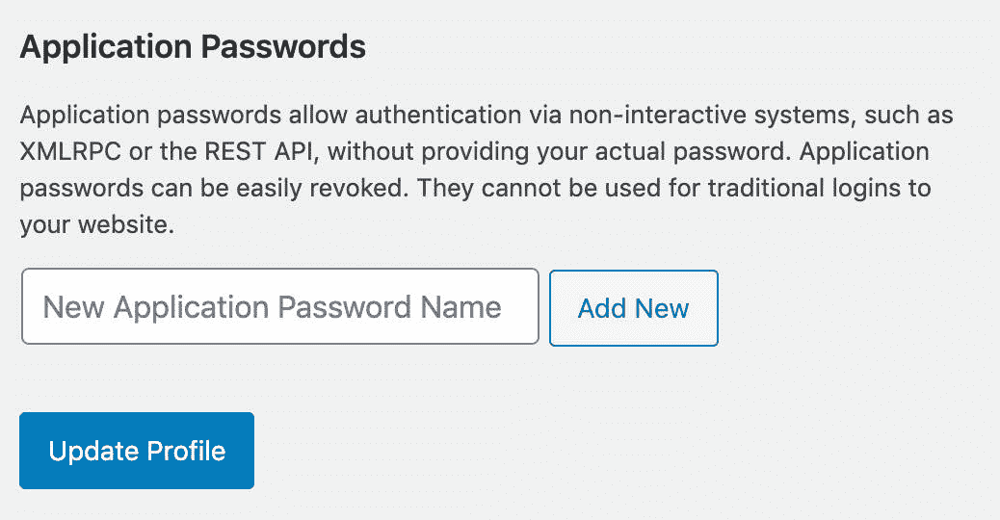

Application Passwords in User Profile screen


为您的应用程序密码选择一个名称并确认。WordPress 将显示您的新密码。

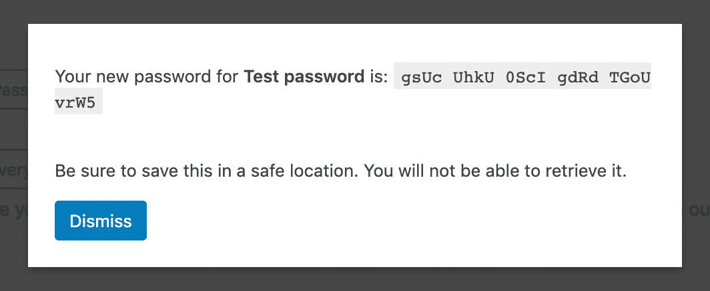

A new application password


应用程序密码以空格分隔的 4 字符块显示，如下所示:

```
gsUc UhkU 0ScI gdRd TGoU vrW5
```

然而，密码[可以带空格也可以不带空格](https://make.wordpress.org/core/2020/11/05/application-passwords-integration-guide/#comment-40226):

> 通过授权流传回的应用程序密码不包含空格。严格来说，它们是为了让盯着一个长字符串的人在手动输入时更容易保持位置。
> 
> 它们可以分块使用，没有空格，或者——见鬼——如果你愿意，你可以在每个字符后加一个空格。

在用户配置文件屏幕中，您可以查看、创建和撤销应用程序密码。“上次使用”和“上次 IP”列使您可以轻松找到应该撤销的不再使用的密码。

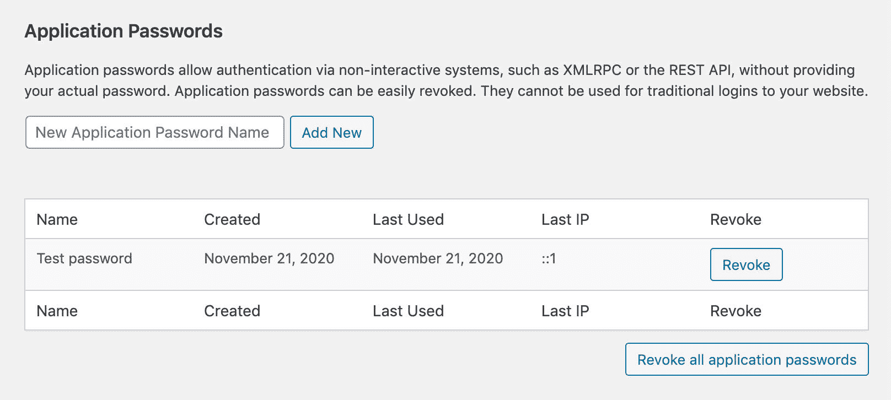

Last Used and Last IP fields


在撰写本文时，应用程序密码可以用于 REST API 认证请求和遗留的 [XML-RPC API](https://kinsta.com/blog/xmlrpc-php/) 。然而，将来我们应该会看到应用程序密码与其他 API 一起使用。乔治·斯蒂芬尼解释道:

> 当 WordPress 的 API 可用时，应用程序密码认证方案也可以应用于未来的 API。例如，如果 GraphQL 或其他系统在 WordPress 中启用，应用程序密码将为它们提供一个可靠的、现成的认证基础设施。


An authenticated call to the REST API in Postman


在*wp-login.php*上使用应用程序密码是不可能的。

要更深入地了解此功能和更多技术见解，请务必查看以下资源:

*   [提案:REST API 认证/应用密码](https://make.wordpress.org/core/2020/09/23/proposal-rest-api-authentication-application-passwords/)
*   [应用程序密码:集成指南](https://make.wordpress.org/core/2020/11/05/application-passwords-integration-guide/)
*   [应用程序密码功能插件](https://github.com/wordpress/application-passwords)

## 更好地支持 PHP 8

PHP 8.0 带来了大量的新特性和优化，使其成为语言发展过程中的一个真正的里程碑。新版的 [PHP](https://kinsta.com/blog/php-tutorials/) 引入了许多打破向后兼容性的更新，许多被否决的特性现在已经被正式移除。因此，在 WordPress 中添加对 PHP 8 的[支持是一个巨大的挑战。](https://kinsta.com/feature-updates/php-8-availability/)

事实上，即使 WordPress 的核心贡献者尽了很大努力使 WordPress 5.6 兼容 PHP 8，我们也不应该期望每个可能的问题都会被发现。这里的目标是达到一个点，使整个 WordPress 生态系统与 PHP 8 兼容，这在目前看来确实是一个棘手的问题。

此外，WordPress 网站包括至少一个主题和数量可变的插件。因此，我们可能期望 WordPress Core 对 PHP 8 的良好支持，但是很难相信插件和主题会迅速增加对 PHP 8 的支持。

我们同意 [Jonathan Desrosiers](https://make.wordpress.org/core/2020/11/23/wordpress-and-php-8-0/) 的观点，他说:

> PHP 8 在更广泛的生态系统(插件、主题等)中的支持状态。)是不可能知道的。出于这个原因，WordPress 5.6 应该被认为是与 PHP 8“beta 兼容”的。

“与 PHP 8 兼容的测试版”似乎是一个很好的表达，代表了一个仍需要大量努力的正在进行的过程，但同时也承认了迄今为止所做的大量工作。

然而，

> 所有插件和主题开发者，以及托管社区，都被要求让他们的代码与 PHP 8 兼容。这将允许 WordPress 更快地达到真正的“完全兼容”,而不需要终端用户来承担这个负担。


### 重要的

虽然通过自动化测试发现的大部分不兼容性已经被修复，但是仍然需要一些手工测试。出于这个原因，**强烈建议在将你的网站升级到 PHP 8** 之前，在一个临时或本地环境中运行严格的兼容性测试。


### 需要注意的一些 PHP 8 变化

正如我们上面提到的，让 WordPress 完全兼容 PHP 8 是一项正在进行的工作。Jonathan Desrosiers 提供了一份 PHP 8 特性和变化的清单，WordPress 开发者应该了解这些特性和变化。

#### 命名参数

使用 [PHP 命名参数](https://wiki.php.net/rfc/named_params)现在可以根据参数名而不是参数位置将参数传递给函数。这允许[编写自文档化的代码](https://kinsta.com/blog/free-html-editor/)，参数与顺序无关，默认值可以任意跳过。

不幸的是，当前命名的参数可能会导致 WordPress 向后兼容的问题。主要原因是，在当前审计完成之前，参数名称可能会在没有通知的情况下更改。所以，在写这篇文章的时候:

> 在调用 WordPress 函数和类方法时使用命名参数是明确不支持的**并且**强烈反对**直到审计完成，因为在审计期间，参数名称可能会在没有通知的情况下更改。审计完成后，将在未来的开发者笔记中宣布。**

 **#### 内部函数的严格类型/值验证

当传递非法类型的参数时，内部函数和用户定义函数的行为不同。用户定义的函数抛出一个`TypeError`，但是内部函数的行为有很多种，这取决于几个条件。

为了消除这些不一致，在 PHP 8 中，[内部参数解析 API](https://kinsta.com/blog/php-8/#type-errors-internal-functions)**总是**在参数类型不匹配的情况下生成一个`ThrowError`。

WordPress 核心中不使用严格类型声明。然而，核心贡献者正在努力防止无效类型被传递给核心函数。在这项工作完成之前，PHP 8 的这一变化可能会导致`TypeError` s，“特别是如果一个值的类型通过与过滤器挂钩的代码被错误地改变了”。

#### 对算术运算符和按位运算符进行更严格的类型检查

在以前的 PHP 版本中，允许对数组、资源或非重载对象使用算术和按位运算符，但是行为不一致，有时甚至不合理:

```
var_dump([] % [42]);
// int(0)
```

在 PHP 8 中，行为总是相同的，当操作数是数组、资源或非重载对象时，所有算术和位操作符都会抛出一个`TypeError`异常(参见[RFC](https://wiki.php.net/rfc/arithmetic_operator_type_checks))。

这是另一个需要核心贡献者做一些额外工作的变化，比如许多错误、警告和通知变化。

同样，由于还有几个问题没有解决，强烈建议在您的网站切换到 PHP 8 之前，在一个[阶段或开发环境](https://kinsta.com/help/staging-environment/)上运行兼容性测试。阅读更多关于 [WordPress 和 PHP 8.0](https://make.wordpress.org/core/2020/11/23/wordpress-and-php-8-0/) 的信息。

## 针对开发人员的其他更改

WordPress 5.6 为开发者引入了大量的变化，我们不能在我们的列表中包括所有的变化。但我们认为值得关注的前三项是:

### 1.wp_after_insert_post 操作挂钩

在 WordPress 5.6 之前，你可以使用`save_posts`或类似的动作在文章发布后运行自定义代码。现在 WordPress 5.6 引入了新的`wp_after_insert_post` action hook，它只在术语和元数据被保存后触发。

此外，还更新了几个函数来防止这些钩子被触发。新的`$fire_after_hooks`参数被添加到`wp_insert_posts()`、`wp_update_post()`和`wp_insert_attachment()`功能中。如果设置为`false`，它会阻止后插入挂钩被触发。

查看[开发笔记](https://make.wordpress.org/core/2020/11/20/new-action-wp_after_insert_post-in-wordpress-5-6/)以获得更深入的概述。

### 2.铅字铸造

从核心中移除了类型转换功能`intval()`、`strval()`、`floatval()`和`boolval()`，以支持直接类型转换:

1.  `intval()` → `(int)`
2.  `strval()` → `(string)`
3.  `floatval()` → `(float)`

这一变化对[性能](https://kinsta.com/apm-tool/)有直接影响，因为[直接类型转换](https://make.wordpress.org/core/2020/11/20/miscellaneous-developer-focused-changes-in-wordpress-5-6/)比类型转换函数快[到 6 倍。](https://core.trac.wordpress.org/ticket/42918)

### 3.WP_Error 对象

`WP_Error`类得到了增强，允许将多个`WP_Error`实例合并成一个。以前你只能手动操作。现在，WordPress 5.6 引入了三种新方法来帮助处理多个`WP_Error`实例。下面的代码是来自[开发笔记](https://make.wordpress.org/core/2020/11/20/miscellaneous-developer-focused-changes-in-wordpress-5-6/)的一个例子:

```
<?php
$error_1 = new WP_Error(
	'code1',
	'This is my first error message.',
	'Error_Data'
);

$error_2 = new WP_Error(
	'code2',
	'This is my second error message.',
	'Error_Data2'
);

// Merge from another WP_Error.
$error_1->merge_from( $error_2 );

// Retrieve all error data, optionally for a specific error code.
$error_1->get_all_error_data( 'code2' );

// Export to another WP_Error
$error_1->export_to( $error_2 );
```

### 开发者的进一步阅读

不可能提到 WordPress 5.6 引入的所有开发方面的变化，但是你可以通过下面的资源了解更多:

*   [更新 WordPress 附带的 jQuery 版本](https://make.wordpress.org/core/2020/06/29/updating-jquery-version-shipped-with-wordpress/)
*   [将核心 jQuery 更新到版本 3–第 2 部分](https://make.wordpress.org/core/2020/11/05/updating-core-jquery-to-version-3-part-2/)
*   [WordPress 和 PHP 8.0](https://make.wordpress.org/core/2020/11/23/wordpress-and-php-8-0/)
*   [WordPress 5.6 中的 REST API 批处理框架](https://make.wordpress.org/core/2020/11/20/rest-api-batch-framework-in-wordpress-5-6/)
*   [WordPress 5.6 中其他开发者关注的变化](https://make.wordpress.org/core/2020/11/20/miscellaneous-developer-focused-changes-in-wordpress-5-6/)

[PHP 8 support, Application Passwords, Site Health improvements, Block API V2, and much more... Click here and dive deep into WordPress 5.6! 🥳Click to Tweet](https://twitter.com/intent/tweet?url=https%3A%2F%2Fbit.ly%2F2KTttwN&via=kinsta&text=PHP+8+support%2C+Application+Passwords%2C+Site+Health+improvements%2C+Block+API+V2%2C+and+much+more...+Click+here+and+dive+deep+into+WordPress+5.6%21+%F0%9F%A5%B3)

## 摘要

WordPress 5.6 是一个主要版本，为用户和开发者提供了大量的特性和变化。我们总是很兴奋地看到网络技术的发展如何直接影响 WordPress 的安全性、[性能](https://kinsta.com/help/apm-tool/)、可用性和可访问性。

但是进化从未停止，我们已经可以窥见未来[潜在的发布日期](https://make.wordpress.org/core/2019/11/21/tentative-release-calendar-2020-2021/)。

现在由你决定:你最喜欢 WordPress 5.6 中的什么？还有你希望 [WordPress 5.7](https://make.wordpress.org/core/2020/11/23/wordpress-5-7-whats-on-your-wishlist/) 增加哪些功能？

* * *

让你所有的[应用程序](https://kinsta.com/application-hosting/)、[数据库](https://kinsta.com/database-hosting/)和 [WordPress 网站](https://kinsta.com/wordpress-hosting/)在线并在一个屋檐下。我们功能丰富的高性能云平台包括:

*   在 MyKinsta 仪表盘中轻松设置和管理
*   24/7 专家支持
*   最好的谷歌云平台硬件和网络，由 Kubernetes 提供最大的可扩展性
*   面向速度和安全性的企业级 Cloudflare 集成
*   全球受众覆盖全球多达 35 个数据中心和 275 多个 pop

在第一个月使用托管的[应用程序或托管](https://kinsta.com/application-hosting/)的[数据库，您可以享受 20 美元的优惠，亲自测试一下。探索我们的](https://kinsta.com/database-hosting/)[计划](https://kinsta.com/plans/)或[与销售人员交谈](https://kinsta.com/contact-us/)以找到最适合您的方式。**