# 如何改变你的 WordPress 主页(3 种方法)

> 原文:[https://kinsta.com/blog/wordpress-change-homepage/](https://kinsta.com/blog/wordpress-change-homepage/)

你的主页有助于为你的整个网站定下基调。如果您的网站没有显示正确的内容，或者看起来不像您预想的那样，您可能需要做一些更改。然而，如果你没有太多的网站建设经验，这可能是一个令人生畏的前景。

好消息是, [WordPress](https://kinsta.com/blog/why-use-wordpress/) 为你提供了许多改变主页的可能性，而且这并不是一件很难完成的任务。有几种方法可以让你的家更好地传达你的信息。

在本指南中，我们将介绍什么是 WordPress 主页，以及为什么你想改变它。然后我们会告诉你一些方法来编辑和定制你的主页。

我们开始吧！

 <kinsta-auto-toc heading="Table of Contents" exclude="last" list-style="arrow" selector="h2" count-number="-1">### 更喜欢看[视频版](https://www.youtube.com/watch?v=NUW397jd1Os)？

<kinsta-video src="https://www.youtube.com/watch?v=NUW397jd1Os"></kinsta-video>

## 什么是 WordPress 主页(以及为什么你想改变你的主页)

你的主页就像你网站的迎宾垫。当访问者[输入你的网址](https://kinsta.com/blog/choose-domain-name/)时，这是他们看到的第一页，所以你会希望它给人留下深刻的第一印象。

<link rel="stylesheet" href="https://kinsta.com/wp-content/themes/kinsta/dist/components/ctas/cta-mini.css?ver=2e932b8aba3918bfb818">

> 需要在这里大声喊出来。Kinsta 太神奇了，我用它做我的个人网站。支持是迅速和杰出的，他们的服务器是 WordPress 最快的。
> 
> <footer class="wp-block-kinsta-client-quote__footer">
> 
> 
> 
> <cite class="wp-block-kinsta-client-quote__cite">Phillip Stemann</cite></footer>

[View plans](https://kinsta.com/plans/)

主页应该让访问者清楚地知道你的网站是关于什么的，它能给他们提供什么。Slack 的主页在展示产品和吸引人们的注意力方面做得非常出色:

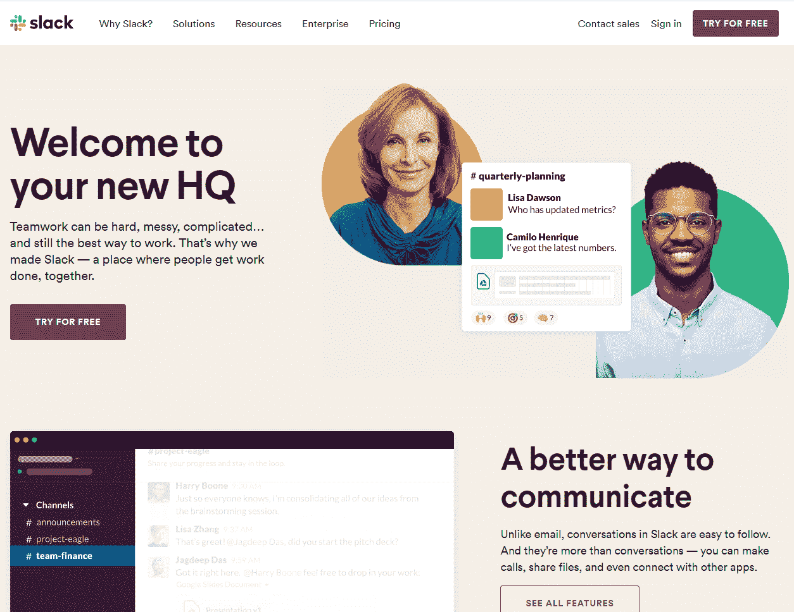

Slack homepage

默认情况下，你的主页会显示你最新的博客文章。

有一个变化，虽然，你可能想要一些不同的特色。如果你没有博客，或者博客不是你网站的重点，那就更是如此。

这些年来，你甚至可能想改变你的主页。例如，如果您决定进行一次[假日销售或活动](https://kinsta.com/blog/ecommerce-strategies/)，您可以更新页面来宣传该促销活动。换句话说，改变你的 WordPress 主页并不缺乏理由。

## 如何设置静态主页

如果你不想在网站首页显示你的博客文章，你可以设置一个“静态”主页。静态页面显示不经常改变的内容。在你的 WordPress 网站上，你可以有一个主页和一个独立的博客页面。

要创建您的主页，首先登录您的管理仪表板。点击**页面>添加新的**:

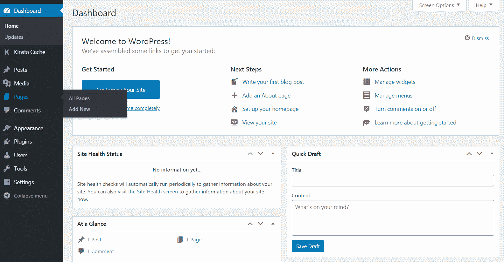

The first step is to create a new page for your homepage, and one for your blog if desired

给你的 WordPress 主页起个名字，然后点击**发布**按钮。然后再次重复这些步骤来创建您的博客页面。

现在你已经准备好了你的页面，你可以告诉 WordPress 如何使用它们。

导航到**设置>阅读**页面，在**首页显示**选项下，选择**静态页面**。接下来，使用[下拉菜单](https://kinsta.com/knowledgebase/wordpress-dropdown-menu/)选择你的主页和文章页面:

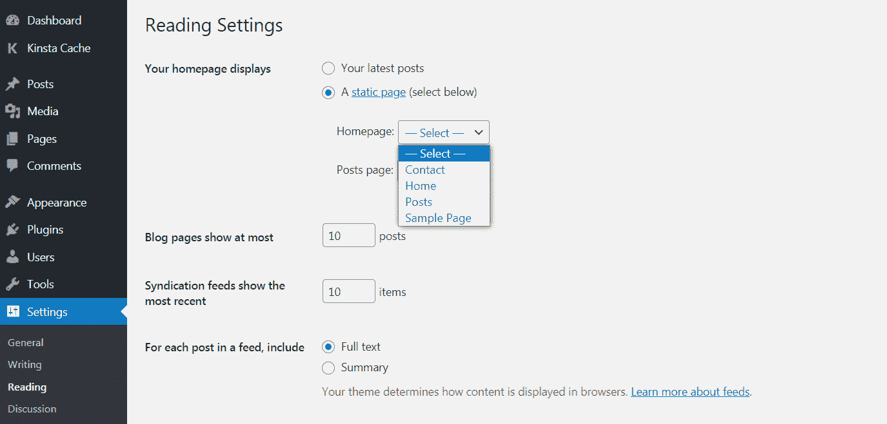

You’ll find the option to set a static homepage in the Reading settings

当你执行这些步骤的时候，你可能想要[将你的站点置于维护模式](https://kinsta.com/blog/wordpress-maintenance-mode)。这样做将向访问者显示你设置的信息，而不是一个不起作用的网站或一般的错误页面。如果你已经[给你的网站](https://kinsta.com/blog/how-to-drive-traffic-to-your-website/)带来了一些流量，你会想在调整你的主页之前考虑这么做。

您可以使用 [WP 维护模式插件](https://wordpress.org/plugins/wp-maintenance-mode/)来设置此功能:

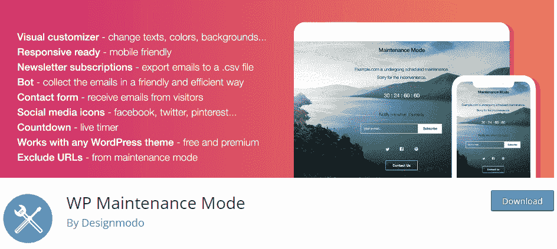

WP Maintenance Mode

这个插件使你能够向站点访问者发送自定义消息，并允许你创建自定义消息，让访问者知道你的站点将很快恢复运行。

## 如何改变你的 WordPress 主页(3 种方法)

现在你已经建立了你的主页，是时候设计它并添加一些内容了。

让我们来看看你可以用在这项工作中的三种不同的工具。

### 1.使用主题定制器编辑你的主页

许多 WordPress 主题会为你提供一个基本的主页设计，以及一些编辑它的选项。您可以通过主题定制器访问这些选项[。](https://kinsta.com/blog/how-to-customize-wordpress-theme/#customizing-your-theme-via-the-customizer)

从你的[管理区](https://kinsta.com/knowledgebase/wordpress-admin/)开始，点击**外观>定制**启动工具。当你编辑你的主页时，定制者将为你提供一个实时预览，这样你就可以看到你的调整是如何影响你的网站外观的。

然而，这些更改只有在您点击**发布**按钮后才会生效，所以您可以随意试验。

根据您的主题，您可能有不同的选项来进行更改。您可以使用菜单选项卡进行导航，或者单击带有蓝色铅笔图标的任何区域进行编辑:

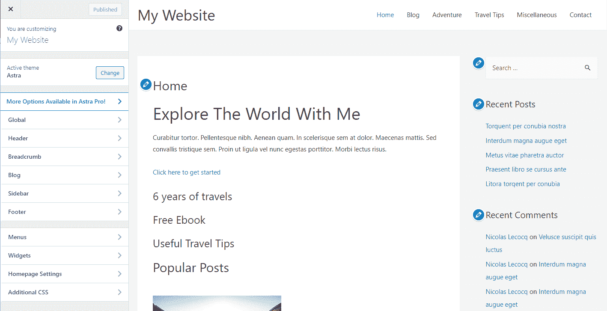

The elements marked with the blue pencil icon are all editable

如果您的主题包含多个页面模板，您可能希望从探索这些模板开始。

例如，有些主题为你提供了放置侧边栏的选项，或者让你[完全移除全幅页面的元素](https://kinsta.com/knowledgebase/remove-sidebar-wordpress/):

Your theme may provide you with some different layout options

如果主页上有您不想使用的部分，您可以使用主题定制器来删除它们。

为此，您可以导航到菜单中的元素，然后单击该部分名称旁边的眼睛图标:

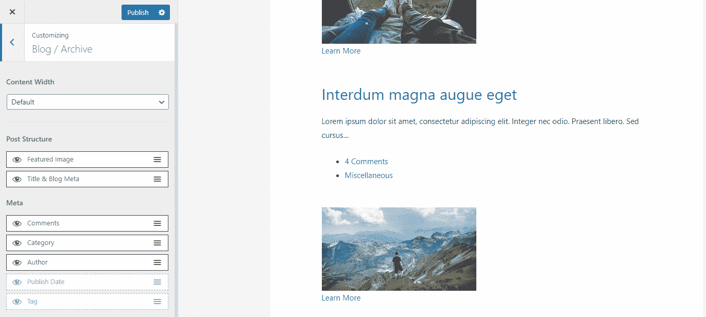

Removing a section from the homepage is done by clicking on the eye icon

通过再次点击同一图标，您可以随时恢复已移除的任何区域。如果您想要更改项目的顺序，也可以拖移栏中的项目。

### 2.用块编辑器编辑你的 WordPress 主页

即使您已经使用主题定制器做了一些更改，您可能还想使用块编辑器做进一步的编辑。后者为你调整主页的设计和布局提供了更多的选择。

首先，通过点击**页面**，从管理仪表板导航到您的主页，然后选择您设置为主页的页面。使用块编辑器，您可以将许多不同类型的内容添加到您的主页。你可能想用一些文字介绍你的网站和你的工作。

要开始，你可以点击页面，然后开始输入。将自动为您创建适当的段落块。

您也可以通过单击屏幕左上角或编辑器窗口中出现的加号来选择该块。然后，您可以选择或搜索段落块:

You can use the paragraph block to add text to your homepage

一旦你有你的文字在适当的位置，你可以使用块设置菜单来进一步定制它。在**文本设置**下，您可以通过选择预设或自定义尺寸来更改文本的[尺寸。你甚至可以包括一些额外的风格点首字下沉。](https://kinsta.com/blog/web-safe-fonts/)

为了给你的段落增加一点色彩，你可能想探索一下**颜色设置**。同样，您可以从一组预定义的颜色中进行选择，或者使用[定制品牌颜色](https://kinsta.com/blog/website-color-schemes/):

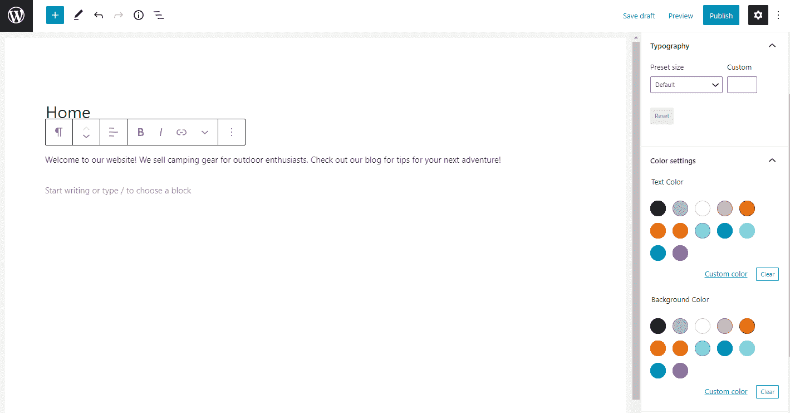

Customize the size and color of your text in the Block Editor

你可能还想在主页上[包含一些图片](https://kinsta.com/blog/free-images-for-wordpress/)。

 ## 注册订阅时事通讯

### 想知道我们是怎么让流量增长超过 1000%的吗？

加入 20，000 多名获得我们每周时事通讯和内部消息的人的行列吧！

[Subscribe Now](#newsletter)

您可以点击加号并选择**图像**块来完成此操作:

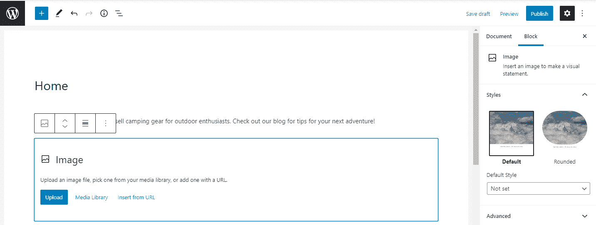

You can add images easily using the image block

你可以使用生成的块上传图像，从[你的媒体库](https://kinsta.com/blog/wordpress-media-library/)中选择一个，或者通过 [URL](https://kinsta.com/knowledgebase/what-is-a-url/) 添加一个。然后，您可以使用块上方的工具栏来调整图像的对齐方式，或者在页面上上下移动图像。

如果你想添加一个标题，图片下方有空间可以添加一个。

此时，您可以继续添加块，直到您对页面满意为止。要访问更多块，您可以单击加号并浏览或搜索出现的菜单。

您也可以点击**浏览所有**来查看您有权访问的所有块。

例如，如果您计划包含媒体和文本的混合，您可以使用单独的段落和图像块来实现。但是，您可能想尝试使用媒体和文本块来代替:

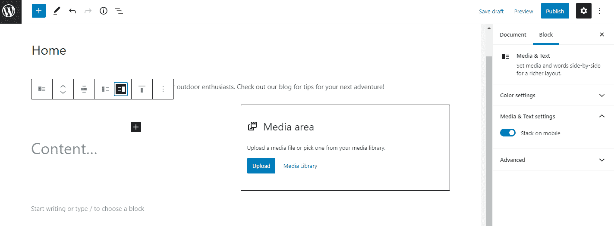

You can add media and text together in one block

该块使您能够在同一块中以多种配置显示媒体和文字内容:

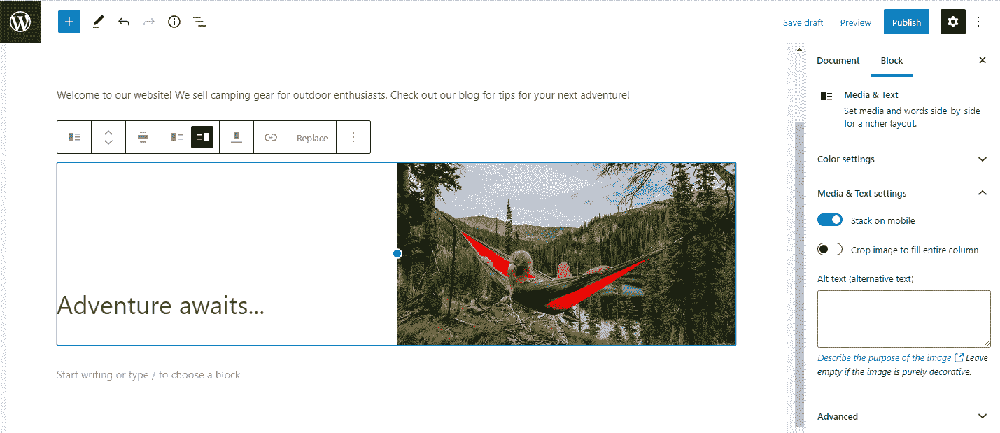

There are several configurations to choose from in the media and text block

要移除块，只需点击工具栏上的三个垂直点，然后选择**移除块**。有了这些工具，你就可以设计任何你能想到的网页。

### 3.用经典编辑器改变你的 WordPress 主页

如果你喜欢用经典编辑器工作[，你仍然可以创建一个令人惊叹的主页。同样，你将从 WordPress 管理仪表板开始。](https://kinsta.com/blog/disable-gutenberg-wordpress-editor/#install-classic-editor-plugin)

点击**页面**，然后选择你设置为站点主页的页面。

要添加文本，只需开始键入。默认情况下，文本将是一个段落，但您可以使用下拉菜单创建标题:

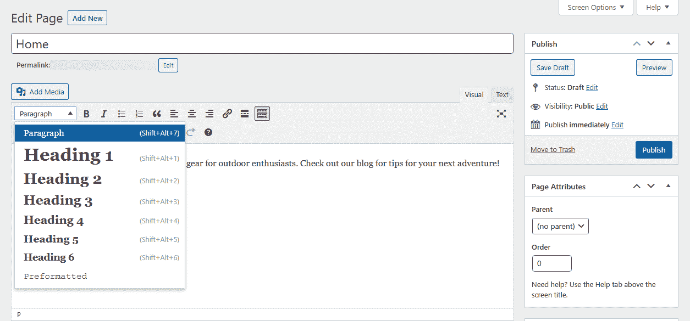

Formatting text in WordPress

在这个下拉菜单中，您可以将一个段落中的文本更改为不同的标题。

此下拉区域旁边的工具栏允许您对文本进行进一步的更改。您可以将其加粗或斜体，更改对齐方式，以及创建项目符号或编号列表。如果您想在您的页面上添加 blockquote，您也可以在此处添加。

该工具栏也是您向副本添加链接的地方。最后，还有一个按钮可以用来添加“阅读更多”标签。如果你想在你的网站上包含文章，但不想在你的主页上显示全文，这可能是一个有用的功能。

与宕机和 WordPress 问题做斗争？Kinsta 是一款考虑到性能和安全性的托管解决方案！[查看我们的计划](https://kinsta.com/plans/?in-article-cta)

该行的最后一个按钮将打开另一组工具。这为您提供了更多设置文本样式的选项，如添加颜色或更改大小:

Additional tools button

您还可以使用经典编辑器将图像和其他媒体添加到页面。为此，点击**添加媒体**按钮打开一个新窗口。您可以选择**选择文件**按钮将新文件添加到您的媒体库:

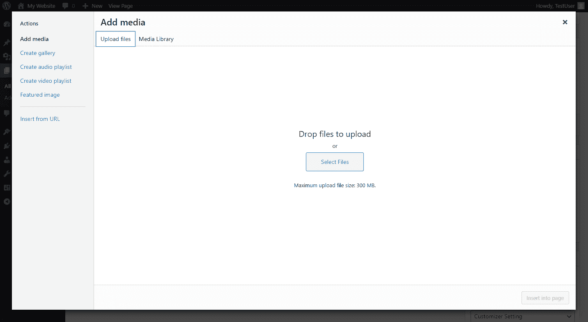

Media library

您可以将文件从您的设备上传到[并将它们添加到您的媒体库](https://kinsta.com/blog/wordpress-media-library/)。

在该窗口中，您还可以通过点击**媒体库**选项卡来访问之前上传的文件。选择想要添加的文件，点击**插入页面**按钮:

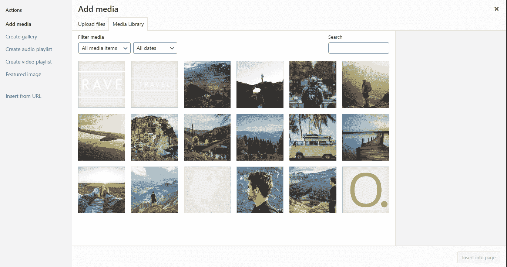

Add media to your homepage from the Media Library window

图像现在将出现在您的页面上。您可以通过单击来访问该文件的选项。对于此图像，您可以更改对齐方式、编辑对齐方式或删除对齐方式:

Image options in WordPress

插入图像后，您可以更改图像的对齐方式。

要查看你的主页进展如何，你可以点击**预览**按钮。一旦你对你的页面外观感到满意，点击**发布**按钮保存你的更改，并使它们在你的网站上可见。

### 可选:查看 2021 主题

如果你喜欢使用块编辑器，你可能会有兴趣查看一下[Twenty Twenty One theme](https://kinsta.com/blog/twenty-twenty-one-theme/)，WordPress 5.6 中新的默认主题:

Twenty Twenty-One theme

Twenty Twenty 1 主题的设计非常灵活，适用于各种不同类型的网站。它包括简单的字体和柔和的彩色图案。它还使[充分利用了【模式】](https://kinsta.com/blog/twenty-twenty-one-theme/#twenty-twentyone-block-patterns)，这是预定义的块布局，您可以进一步编辑，以满足您的需求。

如果你想要一个高度定制的主页，这些专业化的布局，结合 Twenty Twenty 1 的简单性，可能会使这个主题成为一个理想的选择，而不必使用第三方页面生成器。

## 如何为你的主页建立一个菜单

当你在你的主页上工作时，你可能也想注意一下你的[导航菜单](https://kinsta.com/blog/website-navigation/)。虽然这个菜单可能出现在你网站的大部分页面上，但是对于第一次登陆你主页的访问者来说，它可能特别有用。

从管理仪表板开始，点击**外观>菜单**。

如果您还没有任何菜单，系统会提示您创建一个，或者您可以选择**创建菜单**按钮。您的菜单需要一个名称，以区别于您可能创建的其他菜单:

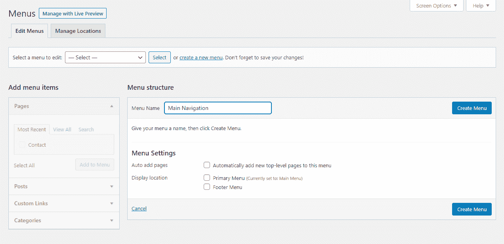

Give your menu a descriptive name

下一步是向菜单添加页面。您可以单独添加它们，或者选中**自动添加页面**框以自动添加所有顶层页面。

如果您喜欢自己选择页面，请选择左侧栏中的**查看全部**选项卡。勾选您想要添加的页面，然后点击**添加到菜单**按钮:

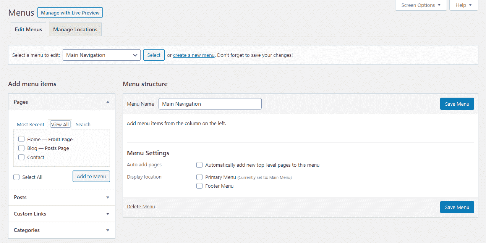

Adding pages to a menu

您可以自动添加顶级页面，也可以手动选择要添加的页面。

现在您已经将页面添加到菜单中，您可以决定它们的显示顺序。您可以通过简单地将菜单项拖放到适当的位置来做到这一点。

如果你想在其他项目下嵌套一些项目来创建一个下拉式菜单，你也可以在这里这样做。这使得你可以在你的导航中添加更多的链接，而不会让它看起来混乱不堪。

您需要做的就是将子页面拖到父页面的下方，稍微偏右一点:

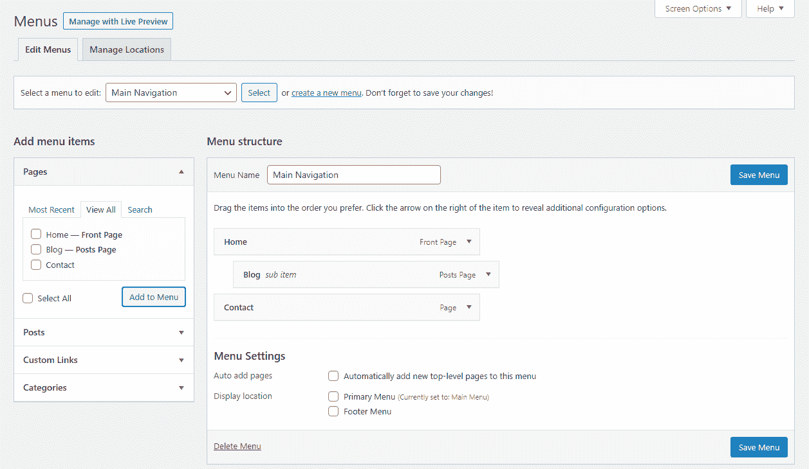

Create a dropdown menu

最后，[根据你的主题](https://kinsta.com/blog/how-to-install-a-wordpress-theme/)，你可以选择你的菜单出现在页面的什么地方。

常见的选项包括页脚、页面顶部和侧边栏(左侧或右侧)。如果默认的菜单选项对你来说还不够，这里有一个扩展你的菜单特性的的[最佳插件列表。](https://kinsta.com/blog/wordpress-menu-plugins/)

[Ready to give your homepage a makeover? 🎨✨ Everything you need to get started is in this guide!Click to Tweet](https://twitter.com/intent/tweet?url=https%3A%2F%2Fkinsta.com%2Fblog%2Fwordpress-change-homepage%2F&via=kinsta&text=Ready+to+give+your+homepage+a+makeover%3F+%F0%9F%8E%A8%E2%9C%A8+Everything+you+need+to+get+started+is+in+this+guide%21&hashtags=WebDesign%2CWordPress)

## 摘要

一个设计良好的主页可以让访问者准确了解你的网站是关于什么的。如果设置得当，它可以成为电子商务网站、个人博客以及其他一切的强大工具。

不过，有些情况下，你需要改变你的主页，以反映你的品牌信息，你现在可能提供的新服务，你的新主题。感谢 WordPress，你有不同的方法来改变和编辑你的 WordPress 主页，包括:

1.  使用主题定制器编辑你的主页
2.  用块编辑器编辑你的主页
3.  使用经典编辑器更改您的主页

关于修改你的 WordPress 主页，你还有问题吗？在下面的评论区问我们吧！

* * *

让你所有的[应用程序](https://kinsta.com/application-hosting/)、[数据库](https://kinsta.com/database-hosting/)和 [WordPress 网站](https://kinsta.com/wordpress-hosting/)在线并在一个屋檐下。我们功能丰富的高性能云平台包括:

*   在 MyKinsta 仪表盘中轻松设置和管理
*   24/7 专家支持
*   最好的谷歌云平台硬件和网络，由 Kubernetes 提供最大的可扩展性
*   面向速度和安全性的企业级 Cloudflare 集成
*   全球受众覆盖全球多达 35 个数据中心和 275 多个 pop

在第一个月使用托管的[应用程序或托管](https://kinsta.com/application-hosting/)的[数据库，您可以享受 20 美元的优惠，亲自测试一下。探索我们的](https://kinsta.com/database-hosting/)[计划](https://kinsta.com/plans/)或[与销售人员交谈](https://kinsta.com/contact-us/)以找到最适合您的方式。</kinsta-auto-toc>