# 如何快速修复混合内容警告(HTTPS/SSL)

> 原文:[https://kinsta.com/blog/mixed-content-warnings/](https://kinsta.com/blog/mixed-content-warnings/)

在 [HTTPS](https://kinsta.com/knowledgebase/redirect-http-to-https/) 运营你的网站不再是可选的。它不仅更安全(一切都是加密的，没有任何东西以明文形式传递)，而且它还建立了信任，是一个[搜索引擎排名因子](https://kinsta.com/blog/wordpress-seo/#27-install-an-ssl-certificate)，并提供更准确的推荐数据。不幸的是，当从 HTTP 迁移到 HTTPS 时，网站所有者会遇到几个问题。其中之一是“混合内容警告”。

由于 [HTTP/2](https://kinsta.com/learn/what-is-http2/) ，与加密相关的性能问题在很大程度上得到了解决，而[让我们加密](https://kinsta.com/blog/free-ssl-certificate/)为您提供了一种获得免费 SSL 证书的简单方法，从而改变了整个行业。

对在线业务来说，最重要的是，谷歌 Chrome 和 Mozilla Firefox 等网络浏览器正在打击不运行 HTTPS 的网站，并对潜在访问者发出更严格的警告。例如，如果你使用传统的 TLS 版本，你可能会在 Chrome 中遇到 [ERR_SSL_OBSOLETE_VERSION 通知](https://kinsta.com/knowledgebase/err_ssl_obsolete_version/)。警告是你最不希望访问者看到的。

为了帮助您避免这些问题，我们有一个关于如何从 [HTTP 迁移到 HTTPS](https://kinsta.com/blog/http-to-https/) 的深入指南。但是，在完成该过程后，您可能仍然会看到混合内容的警告。

今天，我们将向您展示几种不同的方法，您可以在您的网站上解决这个问题。

 ### 更喜欢看[视频版](https://www.youtube.com/watch?v=t_VW8ZVtHbk)？

## 什么是混合内容警告？

当用户试图访问的网站同时加载 HTTPS 和 HTTP 脚本或内容时，用户的浏览器中会出现混合内容警告。这可能会导致问题，因为 HTTP 和 HTTPS 是完全独立的协议。

> Kinsta 把我宠坏了，所以我现在要求每个供应商都提供这样的服务。我们还试图通过我们的 SaaS 工具支持达到这一水平。
> 
> <footer class="wp-block-kinsta-client-quote__footer">
> 
> 
> 
> <cite class="wp-block-kinsta-client-quote__cite">Suganthan Mohanadasan from @Suganthanmn</cite></footer>

[View plans](https://kinsta.com/plans/)

当你迁移到 HTTPS 时，所有东西都需要[在那个协议](https://kinsta.com/knowledgebase/redirect-http-to-https/)上运行，包括你的[图像](https://kinsta.com/blog/optimize-images-for-web/)，JavaScript 文件等等。下面是一些例子，说明如果你的一些内容仍然通过 HTTP 加载会发生什么。

### 混合内容警告示例

Chrome 是目前最受欢迎的浏览器，超过 77%的网络用户使用它。所以下面的警告是大多数访问者会看到的:

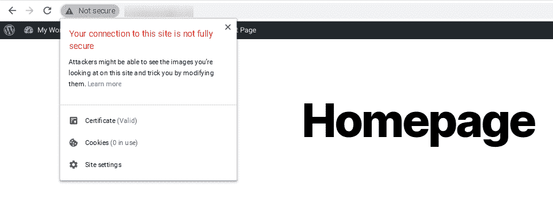

A mixed content warning in Google Chrome

当然，并不是所有人都在使用 Chrome。

下面是一个例子，说明当一个网站上显示混合内容警告时，Firefox 会发生什么:

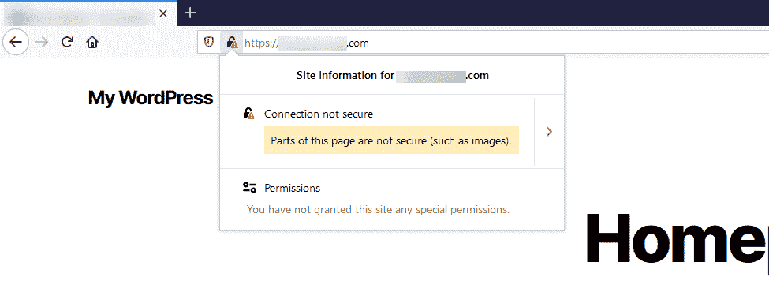

A mixed content warning in Firefox

下面是 Microsoft Edge 中此警告的一个示例:

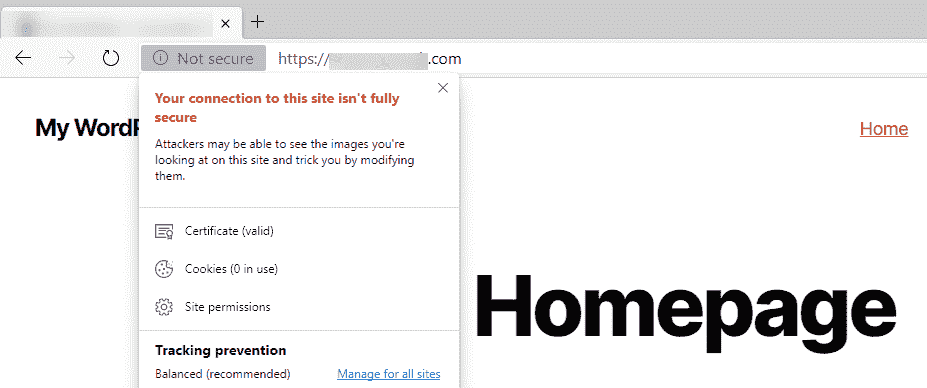

A mixed content warning in Microsoft Edge

下面是它在 Internet Explorer 中的显示方式:

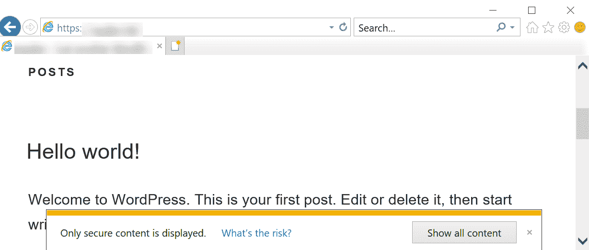

Internet Explorer mixed content warning

如您所见，Internet Explorer 可能是出现此警告的最糟糕的地方之一，因为它实际上会中断页面的呈现，直到弹出窗口被单击。

这不是你想让任何浏览器的访问者看到的错误。它是可以修复的，但是首先，你需要理解它为什么会发生。

[在 HTTPS 运营您的网站不再是可选的。✅，但从 HTTP ➡️ HTTPS 可以带来混合内容的警告。通过本指南了解如何快速解决这些问题💥 点击推文](https://twitter.com/intent/tweet?url=https%3A%2F%2Fkinsta.com%2Fblog%2Fmixed-content-warnings%2F&via=kinsta&text=Running+your+site+over+HTTPS+is+no+longer+optional.+%E2%9C%85++But+moving+from+HTTP+%E2%9E%A1%EF%B8%8F+HTTPS+can+come+with+mixed+content+warnings.+Learn+how+to+solve+them+quickly+with+this+guide+%F0%9F%92%A5)

## 什么导致混合内容警告？

我们发现，最常见的混合内容警告出现在有人将其网站从 HTTP 迁移到 HTTPS 之后。一些 HTTP 链接只是被遗留下来，这导致混合内容警告开始触发。

以下是此警告的一些其他原因:

*   你刚刚在你的网站上添加了一个新的服务或插件。特别是开发者有时候会在自己的插件或者[主题中使用绝对路径(*http://yourdomain.com/style.css*)来链接 CSS](https://kinsta.com/blog/wordpress-css/) 和 JavaScript，而不是使用相对路径( */style.css* )。
*   [你的图片](https://kinsta.com/blog/image-file-types/)有通过 HTTP 运行的硬编码的[网址](https://kinsta.com/knowledgebase/what-is-a-url/)(比如【http://yourdomain.com/image.png】的*)。这些可以在帖子、页面甚至[小工具](https://kinsta.com/blog/wordpress-widgets/)中。*
**   你正在链接到外部脚本的 HTTP 版本(托管的 [jQuery](https://kinsta.com/knowledgebase/what-is-jquery/) ，[字体牛逼](https://fontawesome.com/)等)。).*   你有使用 HTTP 而不是 HTTPS 的嵌入式视频脚本。*

 *不幸的是，在您开始[故障诊断](https://kinsta.com/blog/wordpress-errors/)之前，您可能不会发现问题的真正根源。

记住这一点，让我们来看看一些可以用来修复混合内容警告的方法。

## 如何修复混合内容警告(4 个步骤)

您可以按照下面的四个简单步骤来修复混合内容警告。此过程假设您已经完成了以下工作:

*   [安装了一个 SSL 证书](https://kinsta.com/help/how-to-install-ssl-certificate/)
*   [重定向](https://kinsta.com/knowledgebase/redirect-http-to-https/) [HTTP 到 HTTPS](https://kinsta.com/knowledgebase/redirect-http-to-https/) (全站点)

在下面的例子中，我们将使用一个示例开发站点。

### 1.找出哪些资源是通过 HTTP 加载的

您需要做的第一件事是找出哪些资源仍在通过 HTTP 加载。

请记住，这些警告可能只发生在网站的某些区域，而不是全球范围。浏览到提示警告的页面，点击以下按钮启动 [Chrome DevTools](https://developers.google.com/web/tools/chrome-devtools/) :

*   **窗口:** F12 或 CTRL + Shift + I
*   macOS : Cmd + Opt + I

您也可以从浏览器的工具菜单中打开 Chrome DevTools:

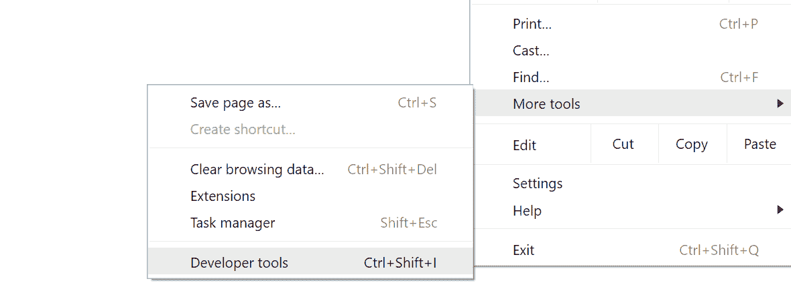

Chrome developer tools in browser tools menu

有几个地方你可以查看哪些资源没有在 HTTPS 加载。

第一个是**控制台**选项卡。请注意，您可能需要在打开 Chrome DevTools 后刷新页面，以便正确加载所有内容。

如果出现混合内容错误，它们将以红色或黄色突出显示。通常，它们会附带解释“该请求已被阻止；内容必须通过 HTTPS 提供。”这意味着浏览器设置被配置为自动阻止任何 HTTP 内容。

为了确保页面只在 HTTPS 上加载，Chrome 79 开始默认阻止混合内容。最近，他们推出了一些功能，开始自动升级混合图像和媒体。

因此，当使用 Chrome DevTools 时，您可能会看到混合内容的消息，指示某些请求的元素已自动升级:

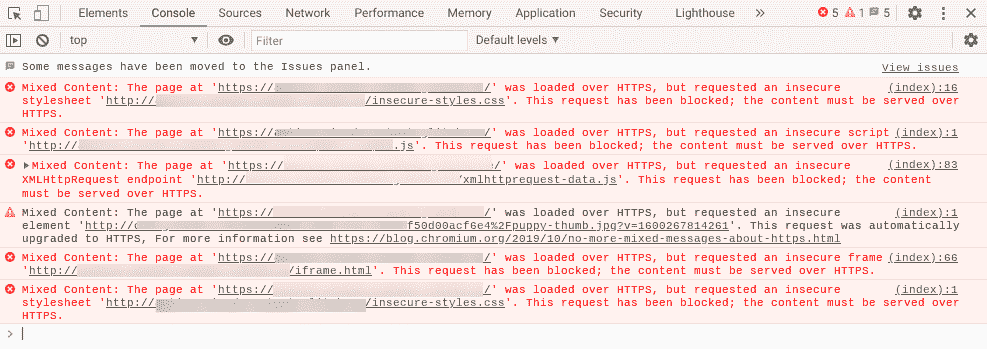

Chrome DevTools mixed content in console

在这里，我们可以清楚地看到，有各种不安全的元素导致了混合内容警告，包括样式表和脚本。

您还会注意到，一个请求是针对一个不安全的[发出的。jpg 图片](https://kinsta.com/blog/jpg-vs-jpeg/)，自动升级到 HTTPS。(注意:如果这是在 Chrome 以外的其他浏览器中，它不会自动升级)。

你也可以在 Chrome DevTools 的**安全**标签中查看。这将显示任何不安全的来源:

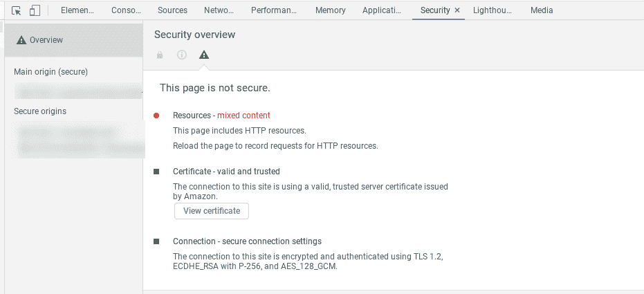

Chrome DevTools security

在**网络**选项卡下，您还可以找到被阻止请求的列表:

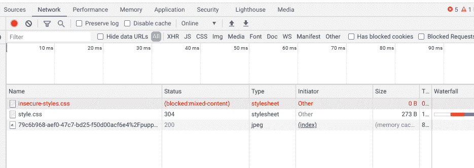

Chrome DevTools Network

如果你没有使用 Chrome，或者你只是想快速总结错误，你也可以使用一个免费的工具，比如[为什么没有挂锁](https://www.whynopadlock.com/)。

它会扫描单个页面，并向您显示所有不安全的资源:

Why No Padlock summary of mixed content errors

这个工具很容易使用。您可以简单地输入您的 URL 并点击**测试页面**，它会向您显示存在的任何错误。另外，它是免费的！

#### 批量检查 HTTPS 警告

如果你担心你的网站的其他部分，你可能想批量检查它。以下是为此推荐的一些选项:

 ## 注册订阅时事通讯

### 想知道我们是怎么让流量增长超过 1000%的吗？

加入 20，000 多名获得我们每周时事通讯和内部消息的人的行列吧！

[Subscribe Now](#newsletter)

*   JitBit 有一个免费的小工具叫做 [SSL Check](https://www.jitbit.com/sslcheck/) ，你可以用它来抓取你的 HTTPS 网站，搜索不安全的图片和脚本，这些图片和脚本会在浏览器中触发警告信息。每个网站抓取的页面数量限制为 400 个。
*   Ahrefs 站点审计工具能够检测 HTTPS/HTTP 混合内容。如果您已经有了这个解决方案，或者您的营销团队中的某个人有，这可能是一个很好的彻底的方法。
*   HTTPS 检查器是一款桌面软件，你可以安装它来扫描你的网站。它可以帮助您检查[“不安全”警告](https://kinsta.com/knowledgebase/err_ssl_obsolete_version/)和内容发生重大变化后。它可以在 Windows、Mac 和 Ubuntu 上使用。免费计划允许您每次扫描检查多达 500 页。
*   SSL 不安全内容修复程序是一个 WordPress 插件，你可以安装在你的网站上来发现导致混合内容警告的错误。它可以免费使用，甚至可以自动修复错误。

使用上述任何工具都可以帮助您节省时间，而不必手动检查网站上的每个页面是否有混合内容警告和错误。为了彻底评估您站点上的潜在错误，您可以考虑使用这些解决方案的组合。

### 2.验证是否可以通过 HTTPS 访问 HTTP 资源

下一步是确认通过 HTTP 加载的资源可以通过 HTTPS 访问。他们很可能是，你只需要更新链接。

例如，假设我们的混合内容错误指向以下不安全的 jQuery 脚本和。jpg 图像:

*   http://ajax.googleapis.com/ajax/libs/jquery/3.31/jquery.min.js
*   http://example-site.com/wp-content/50d00acf6e4%2Fpuppy-thumb.jpg?v=1600261043278

如果我们将这两个 URL 都输入到浏览器的地址栏中，并将开头的“http”替换为“https ”,我们可以看到它们加载得很好。因此，我们只需要在我们的网站上进行搜索和替换。

### 3.执行搜索和替换

有很多方法可以执行[搜索并替换](https://kinsta.com/knowledgebase/wordpress-search-and-replace/)。在本节中，我们将带您了解两个不同的推荐选项。

如果你很好奇，我们不推荐使用像[真正简单的 SSL](https://wordpress.org/plugins/really-simple-ssl/) 这样的工具。虽然它是一个很棒的插件，但最好不要长期依赖这样的解决方案。您以后不会再迁移回 HTTP，所以最好用正确的方式，在[您的数据库](https://kinsta.com/knowledgebase/wordpress-database/)中更新您的 HTTP URLs(如下所示)。

如果你是 Kinsta 的客户，你可以使用我们的搜索和替换工具，它就在 MyKinsta 的仪表板中。

进入你网站的**工具**页面，点击**搜索并替换**:

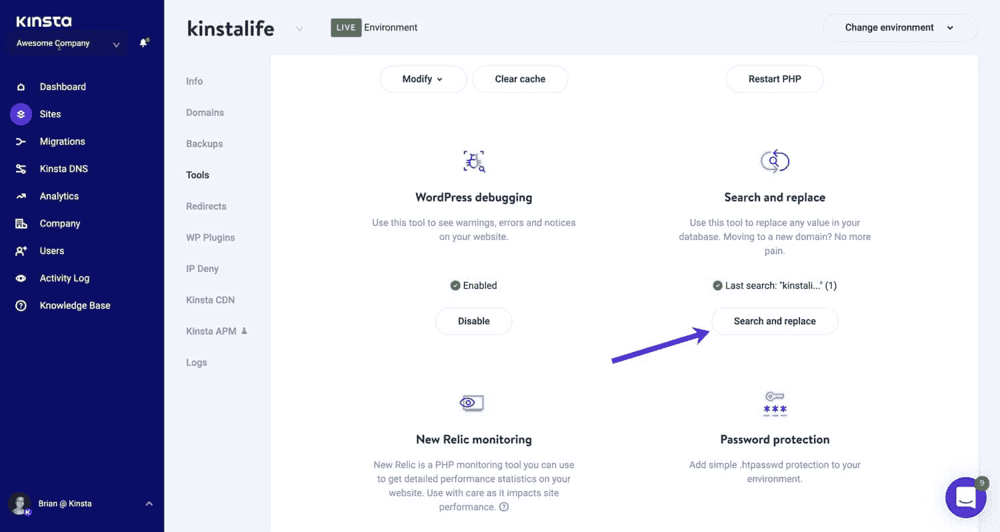

The Search and Replace tool in MyKinsta

接下来，在搜索字段中，输入要在数据库中查找的值。

在这种情况下，我们将使用我们的 HTTP 域:*http://kinstalife.com*。然后点击**搜索**按钮。搜索和替换工具将显示给定字符串的出现次数。

勾选**更换**框，继续更换过程。在**替换为**字段中，输入应该替换您正在搜索的值的内容。在这种情况下，我们将使用我们的 https://kinstalife.com 的 HTTPS 域名:*。*

 *我们还建议选中准备就绪时清除缓存复选框，以便在搜索和替换过程完成后自动清除 Kinsta 缓存。最后，点击**替换**按钮:

HTTP to HTTPS search and replace in MyKinsta

**重要提示:**确保在这些字段中不包含任何前导/尾随空格，因为这可能会产生不良结果。

#### 搜索和替换备选方案

如果你没有使用 Kinsta，你可以用免费的 [Better Search Replace](https://kinsta.com/knowledgebase/wordpress-search-and-replace/#2-install-a-wordpress-search-and-replace-plugin) 插件完成同样的任务，然后在完成后简单地删除它:

厌倦了低于 1 级的 WordPress 托管支持而没有答案？试试我们世界一流的支持团队！[查看我们的计划](https://kinsta.com/plans/?in-article-cta)

The Better Search Replace WordPress plugin

你可以从 WordPress 插件目录下载这个工具，或者在你的 [WordPress 仪表盘](https://kinsta.com/knowledgebase/wordpress-admin/)中搜索它。

激活后，只需搜索你的 HTTP 域名(*http://yourdomain.com*)并替换成你的 HTTPS 域名(*https://yourdomain.com*):

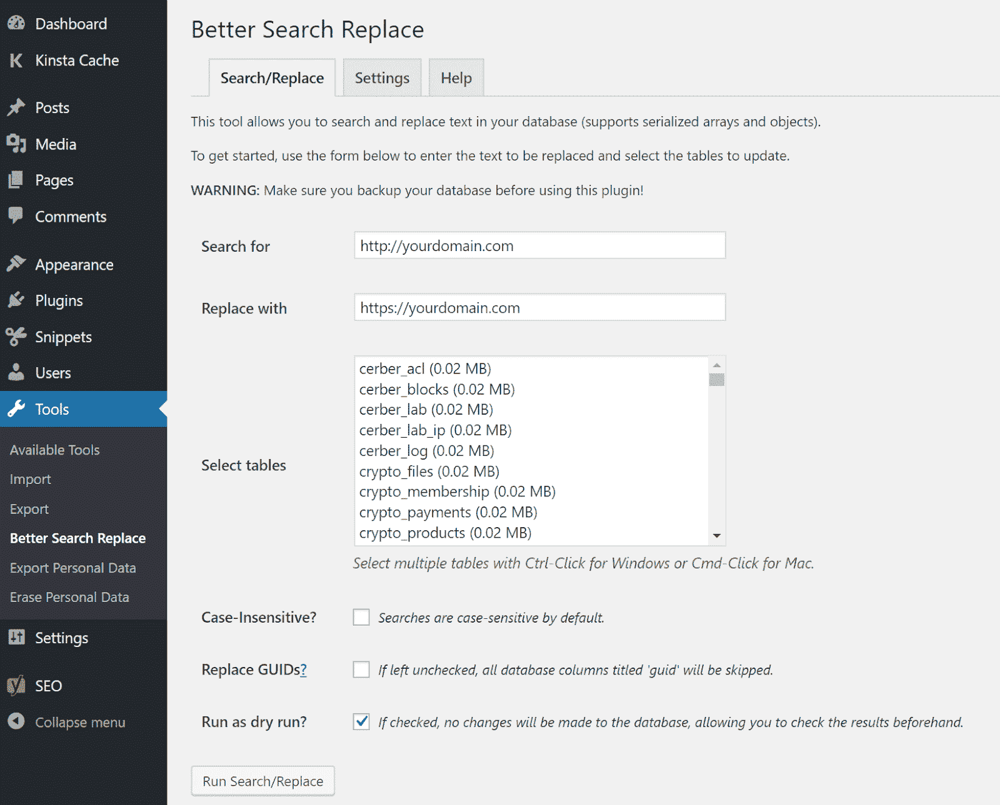

The Better Search Replace WordPress plugin options

或者，你也可以用[互连/it 搜索替换 DB PHP 脚本](https://kinsta.com/knowledgebase/wordpress-search-and-replace/#interconnect)或 [WP-CLI](https://kinsta.com/knowledgebase/wordpress-search-and-replace/#wp-cli) 进行搜索和替换。

查看我们的视频，了解更多关于在 WordPress:

 ### 4.确认混合内容警告已消失

完成搜索和替换后，您需要**再次检查您的站点**以确认混合内容警告已经消失。我们建议在前台访问你的网站，点击几个页面，同时查看地址栏中的浏览器状态指示器。

在我们的网站上，我们可以看到。jpg 图像现已修复，但不安全的脚本警告仍然存在。

这是因为我们对从我们自己的域加载的资源进行了搜索和替换。jQuery 警告是由必须手动更新的外部脚本引起的:

Mixed content warning in Console

在这种情况下，需要将脚本[手动添加到我们的头](https://kinsta.com/knowledgebase/add-code-wordpress-header-footer/)(【header.php】)中。应该是使用相对 URL，所以我们更新为*//Ajax . Google APIs . com/Ajax/libs/jquery/3 . 3 . 1/jquery . min . js*:

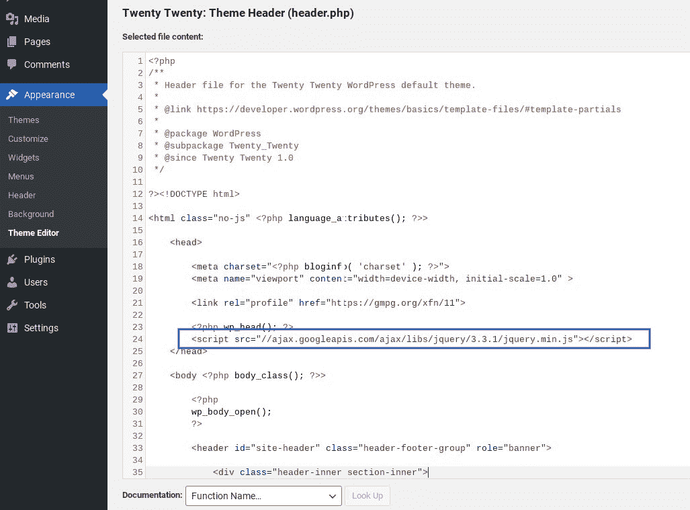

HTTP external script added to WordPress header in Theme Editor

搜索和替换很可能会解决您的所有问题。

一般来说，如果你的站点上有硬编码的东西，你只会遇到额外的问题。

如果你认为在你的[插件](https://kinsta.com/best-wordpress-plugins)或[主题](https://kinsta.com/best-wordpress-themes/)中有一个外部脚本被硬编码，并且你很难找到它，请随时向相关开发者寻求帮助。

## 无混合内容警告示例

现在，您知道应该寻找什么来修复这些混合内容错误了。

以下是 Chrome 中的一个例子，当一切都在 HTTPS 上正确加载，没有混合内容警告时会发生什么:

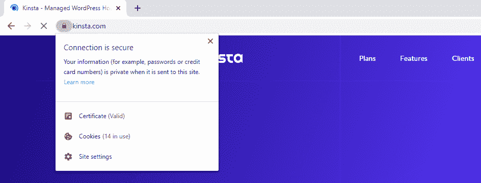

Chrome no mixed content warnings

Firefox 将提供类似的信息:

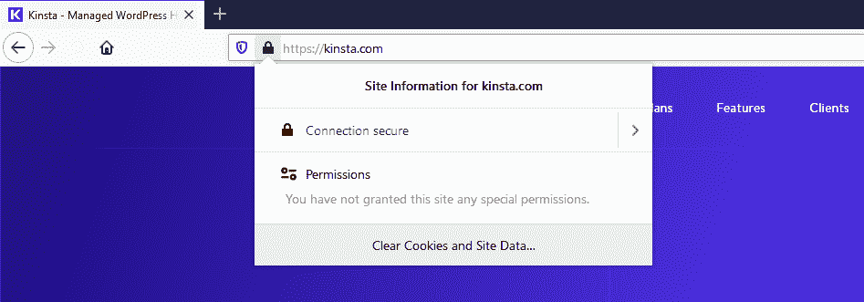

Firefox no mixed content warnings

以下是您将在 Microsoft Edge 中看到的内容:

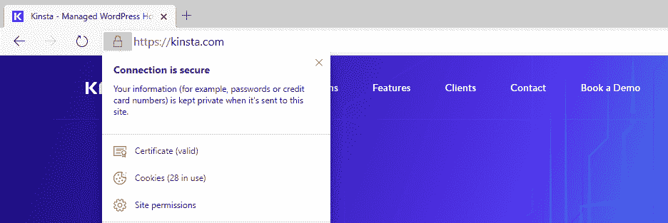

Microsoft Edge no mixed content warnings

虽然消息的措辞可能会因您使用的浏览器而略有不同，但您应该会看到一个通知，指示一个[安全连接](https://kinsta.com/blog/tls-1-3/)。如果你这样做了，你会知道你不再处理你的网站上的混合内容错误。

## HSTS 怎么样？

有些人可能想知道为什么不能简单地使用 [HSTS](https://kinsta.com/knowledgebase/hsts/) (HTTP 严格传输安全)来解决这个问题。创建 HSTS 是为了当一个网站在 HTTPS 上运行时，强制浏览器使用安全连接。

它是一个安全头，你可以添加到你的 web 服务器中，并在响应头中反映为“严格传输安全”。

然而， **HSTS 并不是所有混合内容警告的快速解决方案**。HSTS 仅仅处理[重定向](https://kinsta.com/blog/wordpress-redirect/)，而混合内容警告是浏览器本身的一个特性。您也无法控制第三方网站是否启用 HSTS。

因此，你总是需要更新你的*http://*URL。Esa Jokinen 在这次[服务器故障讨论](https://serverfault.com/a/927170/147648)中深入探究了原因。

## 其他建议(特殊情况)

如果您使用的是 [Elementor 页面生成器](https://kinsta.com/blog/wordpress-page-builders/#elementor)，您还必须进入 Elementor 设置并在那里更新您站点的 URL，这样 CSS 文件将使用新的 URL 重新生成。

一旦你这样做了，[清除缓存](https://kinsta.com/knowledgebase/how-to-clear-browser-cache/)应该可以解决任何由 Elementor 引起的不安全警告。此外，如果你正在使用 [Kinsta CDN](https://kinsta.com/help/kinsta-cdn/) ，建议[也清除 CDN 区](https://kinsta.com/help/kinsta-cdn/#how-to-enable-the-kinsta-cdn)。

[Ready to make the switch to HTTPS, but frustrated by mixed content warnings? 🥴 Learn how to resolve this issue with help from this guide!Click to Tweet](https://twitter.com/intent/tweet?url=https%3A%2F%2Fkinsta.com%2Fblog%2Fmixed-content-warnings%2F&via=kinsta&text=Ready+to+make+the+switch+to+HTTPS%2C+but+frustrated+by+mixed+content+warnings%3F+%F0%9F%A5%B4+Learn+how+to+resolve+this+issue+with+help+from+this+guide%21)

## 摘要

处理混合内容的警告可能会令人沮丧，尤其是当它们可以归因于少数几个原因时。幸运的是，你可以采取一些简单的步骤来解决这些问题。

在大多数情况下，一个简单的搜索和替换应该可以快速解决您的混合内容警告，并让您的网站在几分钟内恢复正常。如果这不能解决所有问题，很可能会留下一两个硬编码的脚本。你需要找到它们并手动更新它们来清除这个错误，或者[雇佣一个开发人员](https://kinsta.com/blog/hire-wordpress-developer/)来为你做这件事。

如果您有任何反馈或遇到任何问题，请在下面的评论区告诉我们！

* * *

让你所有的[应用程序](https://kinsta.com/application-hosting/)、[数据库](https://kinsta.com/database-hosting/)和 [WordPress 网站](https://kinsta.com/wordpress-hosting/)在线并在一个屋檐下。我们功能丰富的高性能云平台包括:

*   在 MyKinsta 仪表盘中轻松设置和管理
*   24/7 专家支持
*   最好的谷歌云平台硬件和网络，由 Kubernetes 提供最大的可扩展性
*   面向速度和安全性的企业级 Cloudflare 集成
*   全球受众覆盖全球多达 35 个数据中心和 275 多个 pop

在第一个月使用托管的[应用程序或托管](https://kinsta.com/application-hosting/)的[数据库，您可以享受 20 美元的优惠，亲自测试一下。探索我们的](https://kinsta.com/database-hosting/)[计划](https://kinsta.com/plans/)或[与销售人员交谈](https://kinsta.com/contact-us/)以找到最适合您的方式。**