# 15 种最佳图像文件类型(每种格式的优缺点+使用案例)

> 原文:[https://kinsta.com/blog/image-file-types/](https://kinsta.com/blog/image-file-types/)

选择正确的图像文件类型似乎是一个微不足道的决定。

但是人类是视觉动物，图像是在线体验不可或缺的一部分。

大部分页面和文章都使用截图和图片来丰富文字内容。事实上，只有大约 8% 的网站不包含任何视觉内容。

不幸的是，许多网站所有者仍然不明白为不同的用例选择哪种图像文件类型。结果呢？他们最终[降低了网站加载速度](https://kinsta.com/blog/debugging-wordpress-performance/)，因为他们的图片不是最佳格式，也没有经过优化。

在本文中，我们将涵盖所有最重要的图像文件扩展名，以及何时应该使用它们来为您的访问者提供最佳的用户体验。

## 有哪些不同的图像文件类型？

图像文件类型和格式分为两个主要的不同类别:光栅图像文件和矢量图像文件。

让我们仔细看看每个类别。

### 光栅图像文件格式

网络上最常见的图像格式( [JPEG、GIF 和 PNG](https://kinsta.com/blog/optimize-images-for-web/#choose-the-right-file-format) )都属于光栅类别。

光栅图像文件类型显示静态图像，其中每个像素根据其分辨率(例如 1280×720)具有定义的颜色、位置和比例。

因为它们是静态的，你不能有效地调整图像的大小，原始的设计和像素将简单地被拉伸以填充额外的空间。这最终会产生模糊、像素化或扭曲的图像。

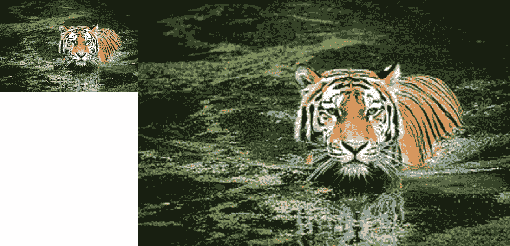

Raster Image – JPEG example

您在互联网上看到的绝大多数照片或图像都使用光栅图像格式。

### 矢量图像文件格式

[SVG](https://kinsta.com/blog/what-is-an-svg-file/) 、EPS、AI 和 [PDF](https://kinsta.com/blog/wordpress-pdf-viewer-plugins/) 都是矢量图像文件类型的例子。

与静态光栅图像文件格式不同(在静态光栅图像文件格式中，每个设计形状和颜色都与一个像素相关联)，这些格式更加灵活。

相反，矢量图形使用笛卡尔平面上的直线和曲线系统，与总面积相比进行缩放，而不是任何单个像素。

这意味着您可以无休止地扩大原始图像的分辨率，而不会有任何质量损失或失真。

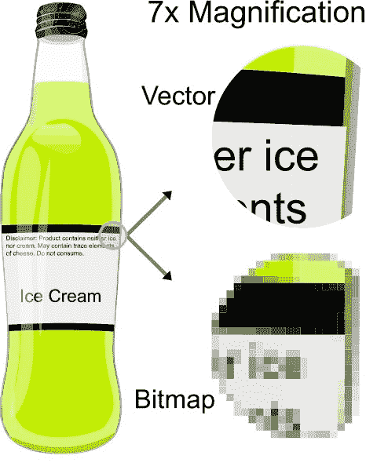

Vector Image Format Magnification (Image source: [Wikipedia.com](https://en.wikipedia.org/wiki/File:VectorBitmapExample.svg))

如你所见，放大 7 倍时的质量差异是完全无法相比的。

因为 SVG 是基于总面积的百分比而不是像素来计算位置的，所以根本没有像素化。

[只有 8%的网站不包含视觉内容...但是对于另外 92%的人来说，用正确的文件类型显示图像是必不可少的。🖼在本指南中找出 15 个最佳选项👇 点击推文](https://twitter.com/intent/tweet?url=https%3A%2F%2Fkinsta.com%2Fblog%2Fimage-file-types%2F&via=kinsta&text=Only+8%25+of+websites+include+no+visual+content...+but+for+the+other+92%25%2C+displaying+images+with+the+right+file+type+is+essential.+%F0%9F%96%BC++Find+the+15+best+options+in+this+guide%F0%9F%91%87&hashtags=WPTips%2Cwebdev)

## 15 种最流行的图像文件类型

下面，我们涵盖了每一个主要的图形文件格式，从光栅网页图像，向量，图像编辑软件文件。

我们深入探讨了每种格式的优缺点、浏览器和操作系统支持以及理想的使用案例。

### 1.JPEG(和 JPG)——联合摄影专家组

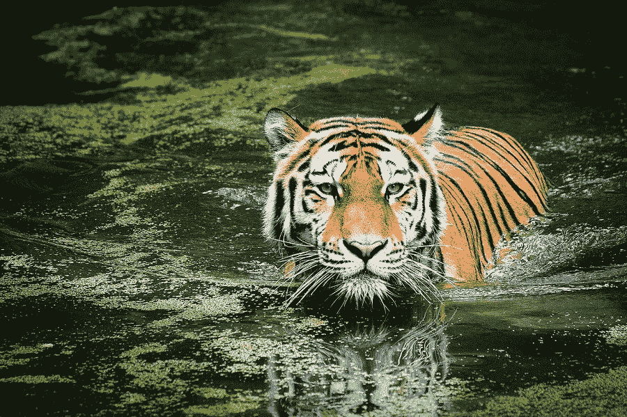

Tiger Image JPEG Format

[JPEG(或 JPG)](https://kinsta.com/blog/jpg-vs-jpeg/) 是一种光栅图像文件格式，具有[有损压缩](https://kinsta.com/blog/lossy-compression/)，适合共享图像。JPEGs 是“有损的”,这意味着当您使用这种格式时，它们会减小文件大小，但也会降低图像质量。

JPEG 仍然是你在互联网上看到的最常用的图像文件类型之一，因为它的压缩和几乎通用的浏览器/操作系统支持。

大多数社交媒体平台(如脸书和 Instagram)会自动将上传的图片文件转换成 JPEGs 格式。他们还使用独特的[社交媒体图像尺寸](https://kinsta.com/blog/social-media-image-sizes/)来控制你照片的分辨率。

#### 优点和缺点

*   通用浏览器和操作系统支持。
*   相当低的文件大小。
*   有损图像压缩可能会导致文本可读性差。

#### 浏览器和操作系统支持

*   所有主流浏览器(Chrome、Firefox、Safari 等)从 1.0 版本开始支持。)
*   默认情况下，所有主要操作系统的所有图像查看器和编辑器都支持该功能。

#### 用例

*   对于[博客和文章](https://kinsta.com/blog/best-blogging-platform/)图片来说是个不错的选择，比如[受访者头像](https://kinsta.com/blog/interview-with-enrico-battocchi/)，产品图片等等。
*   不要将 JPEG 用于包含大量小文本的信息图或教程截图，因为文本是关键。

### 2.PNG —便携式网络图形

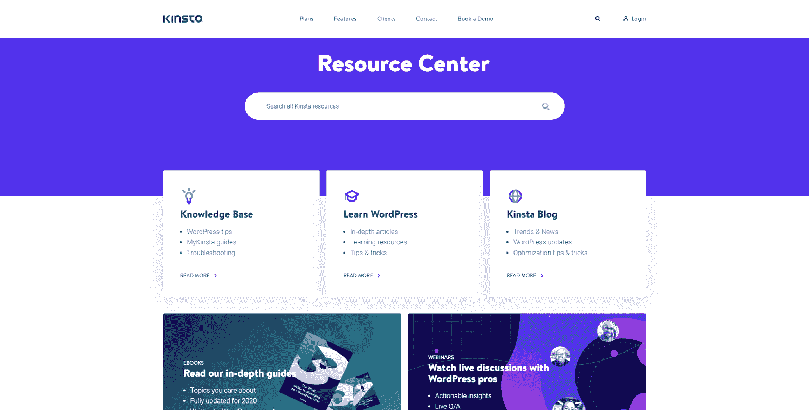

Kinsta’s resource center .png image file

PNG 是一种光栅图形格式，支持无损压缩，保持颜色之间的细节和对比度。

特别是，PNG 提供了比 JPEG 更好的文本可读性。

这使得 PNG 成为信息图、[横幅](https://kinsta.com/blog/banner-ad-sizes/)、截图和其他包含图像和文本的图形的更受欢迎的选择。

#### 优点和缺点

*   更高质量([无损](https://kinsta.com/blog/optimize-images-for-web/#lossy-vs-lossless-optimization))的图像和清晰可见的文本。
*   如果过度使用，较大的文件会降低网站速度(尤其是高分辨率图像)。

#### 浏览器和操作系统支持

*   受所有主流浏览器(Chrome、Edge、Firefox、Internet Explorer、Opera、Safari)支持。
*   受所有主要操作系统及其标准图像编辑器支持。

#### 用例

*   适用于信息图、横幅、博客图片、截图、优惠券和其他包含文本的视觉材料。
*   不要将**用于高分辨率照片，因为它会创建高达几兆字节的大文件。**

### 3.GIF —图形交换格式

Example of a gif image

GIF 是属于光栅格式的另一种图像文件类型。它使用无损压缩，但将图像“限制”为每像素 8 位和 256 色的有限调色板。

GIF 格式对于动画图像来说是最著名的(也是最常用的),因为它的 8 位限制使得动画文件很小并且对互联网友好。

#### 优点和缺点

*   低文件大小。
*   动画支持。
*   8 位限制导致图像质量有限。

#### 浏览器和操作系统支持

*   受所有主流浏览器(Chrome、Edge、Firefox、Internet Explorer、Opera、Safari)支持。
*   受所有主要操作系统及其标准图像编辑器支持。

#### 用例

*   使用动画 gif 不仅仅是为了“增加内容的趣味”,还可以演示如何在教程和指南中完成任务。
*   如果您需要大于 8 位的彩色图像(JPEG 最高支持 24 位)，请不要使用它。

### 4.WebP

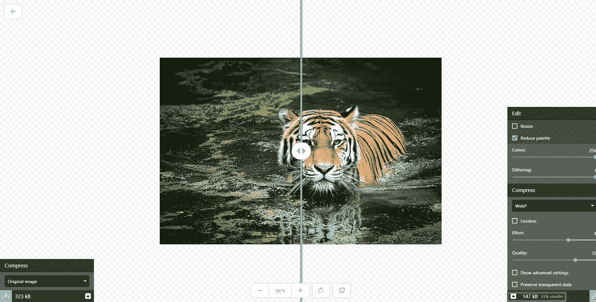

WebP image example

WebP 是一种专门为提供更好的图像无损和有损压缩而开发的图像格式。

从 JPEG 和 PNG 转换到 WebP 有助于节省[服务器磁盘空间](https://kinsta.com/blog/disk-usage-wordpress/)和大量带宽，相同质量的图像文件最多可减少 35%。

#### 优点和缺点

*   较小的文件获得相同或更好的图像质量。
*   并非所有浏览器和图像编辑器都支持。

#### 浏览器和操作系统支持

*   Google Chrome(桌面版 17+，移动版 25+)，Firefox (65+)，Edge (18+)，Opera (11.0+)，原生支持 WebP。Safari 计划的 14 版本将支持 WebP。
*   大多数原生操作系统图像编辑器仍不支持该格式，但 Photoshop 等专业选项支持 WebP。

#### 用例

*   取代 JPEG 和 PNG 文件，以节省带宽和加快您的网站。如果你正在使用 WordPress 作为你的首选 [CMS 软件](https://kinsta.com/blog/cms-software/)，这里有[如何在 WordPress](https://kinsta.com/blog/webp/) 中使用 WebP 图片，并向传统浏览器发送其他格式。

### 5.争执

TIFFC icon

在这个图像文件类型指南中，有一种格式是不可缺少的，那就是 TIFF。

TIFF 是标记图像文件格式的缩写，是一种光栅图像格式，最常用于存储和编辑以后用于打印的图像。

虽然它支持有损压缩，但通常用作无损图像格式。此外，大多数支持 TIFF 的专业图形应用程序(Photoshop、Illustrator 等。)不要使用压缩。因此，TIFF 图像通常文件很大。

#### 优点和缺点

*   适合存储或[打印出版](https://kinsta.com/clients/colorprinter/)的高质量文件。
*   由于没有压缩的典型使用，文件很大。
*   有限的浏览器支持。

#### 浏览器和操作系统支持

*   没有哪种主流浏览器可以在没有附加组件或扩展的情况下呈现 TIFF 文件。
*   主要用作专业图像编辑和发布工具的导出格式。

#### 用例

*   存储和准备用于出版的图像和图形。
*   许多扫描仪使用它来保持扫描文档或图片的质量。

### 6.BMP —位图

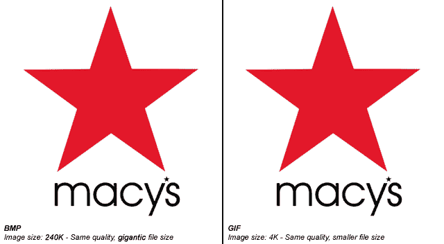

Bitmap vs gif

位图(BMP)是一种非常过时的图像文件格式，它只对单个像素进行很少甚至没有压缩的映射。这意味着 BMP 文件很容易变得非常大，不适合存储或处理。

#### **优缺点**

*   与 WebP、GIF 或 PNG 等格式相比，巨大的文件没有明显的质量提升。

#### 浏览器和操作系统支持

*   受所有主流浏览器(Chrome、Edge、Firefox、Internet Explorer、Opera、Safari)支持。
*   大多数默认操作系统图像编辑器中的原生支持，如 MS Paint。

#### 用例

*   2022 年，BMP 图像格式的合法使用案例基本为零。

### 7.HEIF —高效图像文件格式

JPEG vs HEIF format

HEIF 是高效图像文件格式的缩写，是由 MPEG 视频格式的团队开发的一种图像格式，是 JPEG 的直接竞争对手。

理论上，压缩效率几乎是 JPEG 的两倍，在文件大小相同的情况下，图像质量提高了一倍。

这是一种基于像素映射的光栅图像格式，这意味着您无法在不损失质量的情况下放大图像。

#### 优点和缺点

*   伟大的质量与文件大小的比例。
*   没有浏览器和有限的操作系统支持。

#### 浏览器和操作系统支持

*   任何主流浏览器都不支持。
*   macOS Sierra 和 iOS 11 及更高版本中的原生支持，但在各自的 Safari 版本中不支持。

#### 用例

*   一些较新的手机和设备使用它来储存比 JPEG 文件质量更高的照片。

### 8.SVG —可缩放矢量图形

SVG logo

可缩放矢量图形文件格式，通常称为 SVG，是 W3C 开发的一种标记语言，用于在浏览器中呈现二维图像。

它不像光栅格式那样依赖像素，而是使用 XML 文本来勾勒形状和线条，类似于数学方程创建图形的方式。

这意味着您可以无限放大 SVG 图像，而不会有任何质量损失。

## 注册订阅时事通讯

### 想知道我们是怎么让流量增长超过 1000%的吗？

加入 20，000 多名获得我们每周时事通讯和内部消息的人的行列吧！

[Subscribe Now](#newsletter)

#### 优点和缺点

*   小文件大小和无损缩放简单的插图，形状和文本。
*   不是图像或复杂绘图的理想格式。

#### 浏览器和操作系统支持

*   受所有主流浏览器(Chrome、Edge、Firefox、Internet Explorer、Opera、Safari)支持。
*   默认的图像编辑器往往不支持 SVG(因为它不适合照片)，但大多数插图软件支持 SVG 导出。

#### 用例

*   SVG 是标志、图标、简单插图和任何你想用你的[响应式设计](https://kinsta.com/blog/responsive-web-design/)自由扩展的东西的理想格式。如果你正在使用 WordPress，请确保查看[如何为你的网站启用 WordPress SVG 支持](https://kinsta.com/blog/what-is-an-svg-file/)。

### 9.EPS —封装的 Postscript

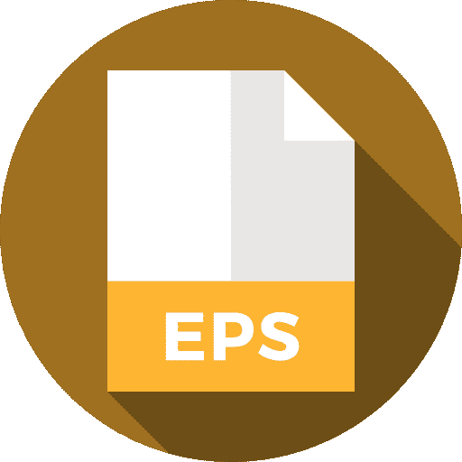

EPS icon

本质上，EPS (Encapsulated PostScript)文件是一种矢量图像文件，用于在 Adobe Illustrator 和其他插图软件(如 CorelDraw)中存储插图。

与 SVG 文件一样，EPS 实际上是一个基于文本的文档，它用代码勾勒出形状和线条，而不是映射像素和颜色。因此，EPS 文件也支持无损缩放。

#### 优点和缺点

*   无损缩放。
*   文档和设计的打印机支持。

#### 浏览器和操作系统支持

*   EPS 不是标准的 web 图像文件格式，也不受任何主流浏览器的支持。

#### 用例

*   在使用 Adobe Illustrator 或其他软件时，它主要用于存储、保存和打印插图。

### 10.PDF —可移植文档格式

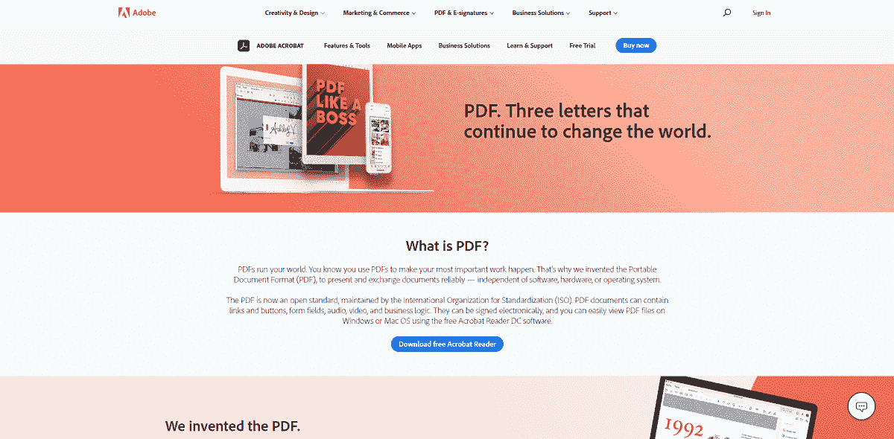

PDF file example

您可能会将 PDF 与存储、保存和阅读主要基于文本的文档联系在一起。这完全可以理解——毕竟文档就在名称中。

但是 PDF 文件实际上是基于与 EPS 矢量图像文件相同的 PostScript 语言，也可以用来保存图像和插图。

这是存储插图、杂志封面和更多供以后打印的图像格式的选择。这也是我们 [Kinsta 电子书](https://kinsta.com/ebooks/)的首选。

#### 优点和缺点

*   可索引和可搜索的文本使其非常适合深度信息图或报告。
*   可以包括链接、 [CTA 按钮](https://kinsta.com/blog/conversion-rate-optimization-tips/#strategic-ctas)和其他交互元素。
*   无损可扩展性。
*   不能包含在 web 内容中，必须作为单独的文件加载和读取[。](https://kinsta.com/knowledgebase/pdf-mp3-hosting/)

#### 浏览器和操作系统支持

*   所有主流浏览器都支持，但是您必须将 PDF 作为一个单独的文件打开。(您不能使用 PDF 文件在整个 HTML 内容中显示图像。)
*   大多数标准文档编辑器(如 MS Word 或 Google Docs)和插图软件(AI、Inkscape)支持这种格式，但图像编辑软件不支持。

#### 用例

*   如果您想创建交互式可视报告或信息图来补充您的内容，PDF 是最佳选择。这里有一个给 WordPress 用户的[最佳 PDF 浏览器插件](https://kinsta.com/blog/wordpress-pdf-viewer-plugins/)的列表。

### 11.PSD — Photoshop 文档

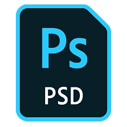

PSD logo

顾名思义，PSD 文件格式是一种用于保存图像文档和使用 Adobe Photoshop 进行工作的图像格式。

它不是网络安全的图像格式，所以它不被任何浏览器或标准图像查看器或编辑器支持。

#### 优点和缺点

*   所有滤镜、透明度、路径和编辑都是完全可自定义和可逆的。
*   无损图像质量。
*   大文件大小。

#### 用例

*   在 Photoshop 项目完成前后保存和储存它们。

### 12.AI — Adobe Illustrator 作品

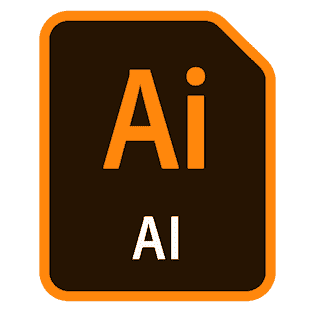

Adobe Illustrator file icon

AI 是 Adobe 专门开发的另一种图像格式，不仅可以保存图像，还可以保存项目状态。

厌倦了你的 WordPress 站点缓慢的主机？我们提供超快的服务器和来自 WordPress 专家的 24/7 世界级支持。[查看我们的计划](https://kinsta.com/plans/?in-article-cta)

像 PSD 一样，**它不适合在网络上使用**，也不被任何浏览器支持，也不被大多数默认的图像浏览器支持。

与 PSD 文件不同，你可以自由缩放 AI 文件，而不会有任何质量损失。

#### 优点和缺点

*   所有的笔画，线条，形状，过滤器，都是可定制和可逆的。
*   自由放大或缩小插图尺寸。
*   大文件大小。

#### 用例

*   在 Adobe Illustrator 项目完成前后保存和储存它们。

### 13.XCF——实验计算设施

XCF icon

XCF，代表实验计算设备，是开源图像编辑器 GIMP 的原生图像文件类型。它相当于 PSD 文件，并保存路径，透明度，过滤器，等等。

再说一次，这是一种用于存储项目的本地文件类型，**任何浏览器**或默认图像查看器都不支持它。

#### 优点和缺点

*   所有路径、滤镜和形状都是可自定义和可逆的。
*   无损图像质量。
*   大文件大小。

#### 用例

*   在 GIMP 项目完成前后保存和储存它们。

### 14.INDD — Adobe InDesign 文件

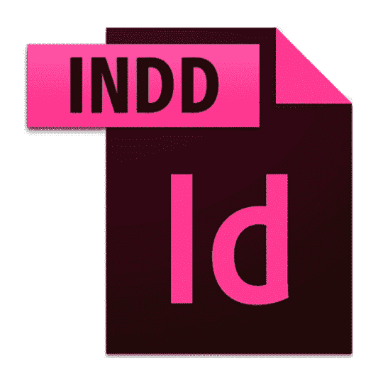

Adobe InDesign icon

INDD 是 Adobe InDesign 用户的一种原生文件类型，您可以在其中存储项目文件，包括页面内容、样式、色板等。

虽然有时被称为图像文件格式，但它往往链接到文本之外的视觉元素。

它不受任何浏览器或默认图像浏览器的支持，因为**它不是网页安全格式**。

#### 优点和缺点

*   存储包含可自定义元素的大型多页设计项目。

#### 用例

*   它主要由平面设计师和制作艺术家用于设计和协作海报、传单、杂志、小册子等。

### 15.原始图像文件类型

原始图像格式是数码相机用来存储高质量图像以供后期制作和编辑的文件类型。

相机制造商提供的主要原始图像文件类型:

*   柯达:CR，K25，KDC
*   佳能:CRW CR2 CR3
*   爱普生:ERF
*   尼康:耐夫 NRW
*   奥林巴斯:ORF
*   Pentax: PEF
*   松下:RW2
*   索尼:ARW、SRF、SR2

与 JPEG 文件中每个颜色通道(8 位)256 种色调不同，RAW 文件在一张图片中每个颜色通道(14 位)最多提供 16，384 种色调。这让您在后期处理中调整颜色和对比度时更加灵活。

原始图像不适合在网上分享，也不受任何主流浏览器或图像浏览器的支持。

#### 优点和缺点

*   更高质量的图片，颜色变化更大。
*   巨大的图像文件(原始文件很容易达到 20 到 40 兆字节)。

#### 用例

*   以尽可能高的质量保存照片，以便进行后期处理和编辑。

## 图像文件类型常见问题

### 图像文件的 3 种常见文件类型是什么？

根据与网络使用相关的数据，三种最常见的图像文件类型是 JPEG、 [PNG 和 SVG](https://kinsta.com/blog/svg-vs-png/) 。

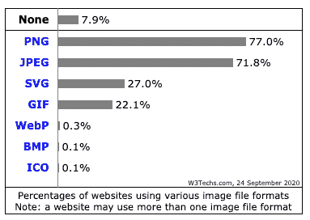

Usage statistics of image file formats (Image source: [w3techs.com](https://w3techs.com/technologies/overview/image_format))

下面让我们来看看是什么让它们如此普遍。

#### 1.巴布亚新几内亚:截图，横幅，信息图，图片

由于 PNG 作为一种格式更适合图像中的文本，它更常用于截图、横幅(取决于[横幅广告大小](https://kinsta.com/blog/banner-ad-sizes/))等等。

由于它使用无损压缩，它也被设计师和摄影师用来在他们的[作品集网站](https://kinsta.com/blog/wordpress-portfolio-plugins/)上展示高质量的图片。

这两个因素，加上它的通用浏览器和操作系统支持，使它成为网络上最流行的图像文件类型。高达 77%的网站上都有 png。

#### 2.JPEG:图片

有损压缩意味着 JPEG 是展示内容中图片的更好选择。质量上的损失对于一般的互联网用户来说几乎看不到，而且你可以节省大量的磁盘空间和带宽。

这就是为什么它是互联网上第二受欢迎的格式，几乎有 72%的网站使用它。大多数网站出于不同的目的同时使用 png 和 JPEGs。

提醒一下:JPG 和 JPEG 没有区别，它们是相同格式的两个不同的缩写和文件扩展名。

#### 3.SVG:徽标、图标和插图

SVG 文件是可缩放的矢量文件，非常适合图标、徽标、图形和简单的插图。图像甚至可以作为 [CSS 代码](https://kinsta.com/blog/wordpress-css/)直接插入页面。

这就是为什么 SVG 排在第三位，被 27%的网站使用。

#### 荣誉奖:动画 GIF 图片

虽然很少选择静态图像的格式，GIF 已经卷土重来，成为分享动画的首选。

Animated gif example

因此，大约 22%的网站在其页面上使用 gif，尽管他们也可能使用 png 和 JPEGs 作为标准格式。

### 哪种图像格式的质量最高？

Raw 图像格式是最高质量的，但是文件过大，高达数百兆字节。

对于网络图像， [WebP 文件格式提供了比 JPEG 小 25-35%的文件大小](https://kinsta.com/blog/webp/)用于相同质量的照片，这意味着你可以在相同的磁盘空间上传更高质量的图像，[加速你的网站](https://kinsta.com/learn/speed-up-wordpress/)。

HEIF 是另一种压缩效率更高的 JPEG 替代方案，但目前没有任何主流浏览器支持。

PNG 文件提供无损压缩，但这意味着文件会非常大，加载速度很慢。单个 PNG 文件往往可以有几百 KB 甚至 1MB+。然而，如果你利用一些策略，比如[惰性加载(从 WordPress 5.5 开始就有了)](https://kinsta.com/blog/wordpress-5-5/#native-image-lazyloading-in-wordpress-core)和[CDN](https://kinsta.com/help/kinsta-cdn/)，你仍然可以拥有一个快速的站点。

### 哪些文件格式支持透明？

支持透明性的最常见的 web 图像文件类型是 PNG、WebP、GIF，甚至 SVG。

大多数本地项目图像文件类型，如 PSD、XCF 和 AI 也支持透明度。

另一方面，流行的 JPEG 图像格式**不支持** **透明度。**

### PNG 比 JPEG 好吗？

PNG 和 JPEG 的主要区别在于，PNG 是无损图像格式，而 JPEG 是有损图像格式。这基本上意味着 PNG 使用压缩技术，而不会牺牲图像的原始质量或细节。

对于图像中的文本、教程截图，以及当您希望标志或其他精细元素在照片中 100%可见时，PNG 是合适的格式。

PNG vs JPEG comic strip (Image source: lbrandy.com)

正如你从上面这张有趣的图片中看到的，与右边的 JPEG 相比，左边描绘的 PNG 在清晰显示文本和简单形状方面要好得多。

这是否意味着 JPEG 是一种不好的图像文件类型？一点也不！

对于常规的博客文章或标题图片，JPEG 提供了足够好的质量，而且文件大小大大降低。您通常可以节省高达 50%或更多的空间，同时努力用肉眼发现任何质量差异。

[Keep your website's visual content looking clear with this guide to the best image file types ✨Click to Tweet](https://twitter.com/intent/tweet?url=https%3A%2F%2Fkinsta.com%2Fblog%2Fimage-file-types%2F&via=kinsta&text=Keep+your+website%27s+visual+content+looking+clear+with+this+guide+to+the+best+image+file+types+%E2%9C%A8&hashtags=WordPress%2Cvisual)

## 摘要

你可以合法地在你的项目中使用很多图片。希望本文已经帮助您理解了在什么样的环境中使用哪种图像文件类型和格式可以获得最佳效果。

光栅格式最适合用于图像和图片，而矢量是徽标、图标和数字图形的绝佳替代品。

为正确的任务使用正确的图像文件类型不仅可以帮助[提高页面加载速度](https://kinsta.com/learn/speed-up-wordpress/)，还可以[降低带宽和服务器负载](https://kinsta.com/blog/disk-space-wordpress-hosting/)。作为后续的积极影响，您的整体用户体验也将大大改善。还不错吧。

* * *

让你所有的[应用程序](https://kinsta.com/application-hosting/)、[数据库](https://kinsta.com/database-hosting/)和 [WordPress 网站](https://kinsta.com/wordpress-hosting/)在线并在一个屋檐下。我们功能丰富的高性能云平台包括:

*   在 MyKinsta 仪表盘中轻松设置和管理
*   24/7 专家支持
*   最好的谷歌云平台硬件和网络，由 Kubernetes 提供最大的可扩展性
*   面向速度和安全性的企业级 Cloudflare 集成
*   全球受众覆盖全球多达 35 个数据中心和 275 多个 pop

在第一个月使用托管的[应用程序或托管](https://kinsta.com/application-hosting/)的[数据库，您可以享受 20 美元的优惠，亲自测试一下。探索我们的](https://kinsta.com/database-hosting/)[计划](https://kinsta.com/plans/)或[与销售人员交谈](https://kinsta.com/contact-us/)以找到最适合您的方式。