# 响应式网页设计初学者指南(代码示例和布局示例)

> 原文:[https://kinsta.com/blog/responsive-web-design/](https://kinsta.com/blog/responsive-web-design/)

随着越来越多的人通过移动设备访问互联网，只有在电脑屏幕上看起来不错的静态网站设计已经不够了。

更不用说，在进行设计时，你还必须考虑平板电脑、2 合 1 笔记本电脑以及不同屏幕尺寸的不同智能手机型号。

所以把你的内容放到一个单独的专栏里，然后就此打住是不会有任何效果的。

有了响应式[网页设计](https://kinsta.com/blog/web-design-courses/)，你可以确保你的网站在手机、平板电脑、笔记本电脑和桌面屏幕上呈现最佳效果。

用户体验的改善意味着更高的转化率和业务增长。

本指南将为您提供关于响应式网站设计的所有信息，包括定义、逐步演练、示例等等。

 ### 查看我们的响应式网页设计视频指南:


> 需要在这里大声喊出来。Kinsta 太神奇了，我用它做我的个人网站。支持是迅速和杰出的，他们的服务器是 WordPress 最快的。
> 
> <footer class="wp-block-kinsta-client-quote__footer">
> 
> 
> 
> <cite class="wp-block-kinsta-client-quote__cite">Phillip Stemann</cite></footer>

[View plans](https://kinsta.com/plans/)

## 什么是响应式网页设计？

响应式设计是一种网页设计方法，可以使你的网页内容适应各种设备的不同屏幕和窗口大小。

例如，您的内容可能会在桌面屏幕上分成不同的栏，因为它们足够宽以适应这种设计。

如果你在移动设备上将内容分成多个栏目，用户将很难阅读和互动。

[响应式设计](https://kinsta.com/blog/web-design-best-practices/#mobile-responsiveness)可根据屏幕尺寸将您的内容和设计的多种独立布局交付给不同的设备。

[It’s not enough for your website to look good on a computer screen. 🖥 Tablets, 2-in-1 laptops, and smartphones are all part of the equation... and this guide covers everything you need to know about responsive design 🤳Click to Tweet](https://twitter.com/intent/tweet?url=https%3A%2F%2Fkinsta.com%2Fblog%2Fresponsive-web-design%2F&via=kinsta&text=It%E2%80%99s+not+enough+for+your+website+to+look+good+on+a+computer+screen.+%F0%9F%96%A5++Tablets%2C+2-in-1+laptops%2C+and+smartphones+are+all+part+of+the+equation...+and+this+guide+covers+everything+you+need+to+know+about+responsive+design+%F0%9F%A4%B3&hashtags=WebDesign%2CUX)

## 响应式网页设计与适应性设计

响应式设计和自适应设计的区别在于，响应式设计适应单个页面版本的呈现。相比之下，自适应设计提供了同一页面的多个完全不同的版本。

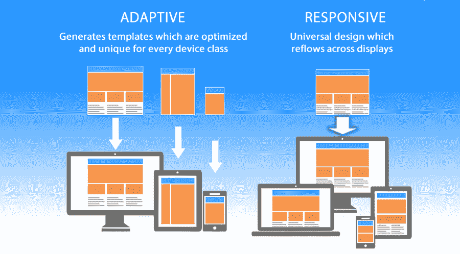

Responsive vs adaptive design


它们都是至关重要的网站设计趋势，帮助网站管理员控制他们的网站在不同屏幕上的外观，但是方法不同。

使用响应式设计，用户将通过他们的浏览器访问相同的基本文件，而不管设备如何，但 [CSS 代码](https://kinsta.com/blog/wordpress-css/)将控制布局，并根据屏幕大小以不同方式呈现。对于自适应设计，有一个脚本检查屏幕尺寸，然后访问为该设备设计的模板。
T3】

## 为什么响应式设计很重要

如果你是网页设计、[开发、](https://kinsta.com/blog/hire-wordpress-developer/)或[博客](https://kinsta.com/blog/best-blogging-platform/)的新手，你可能想知道为什么响应式设计首先如此重要。

答案很简单。为单一设备设计已经不够了。移动网络流量已经超过了桌面，现在占据了[网站流量](https://kinsta.com/blog/how-to-drive-traffic-to-your-website/)的大部分，超过了[的 51%](https://gs.statcounter.com/platform-market-share/desktop-mobile-tablet/worldwide/#monthly-201112-202002) 。

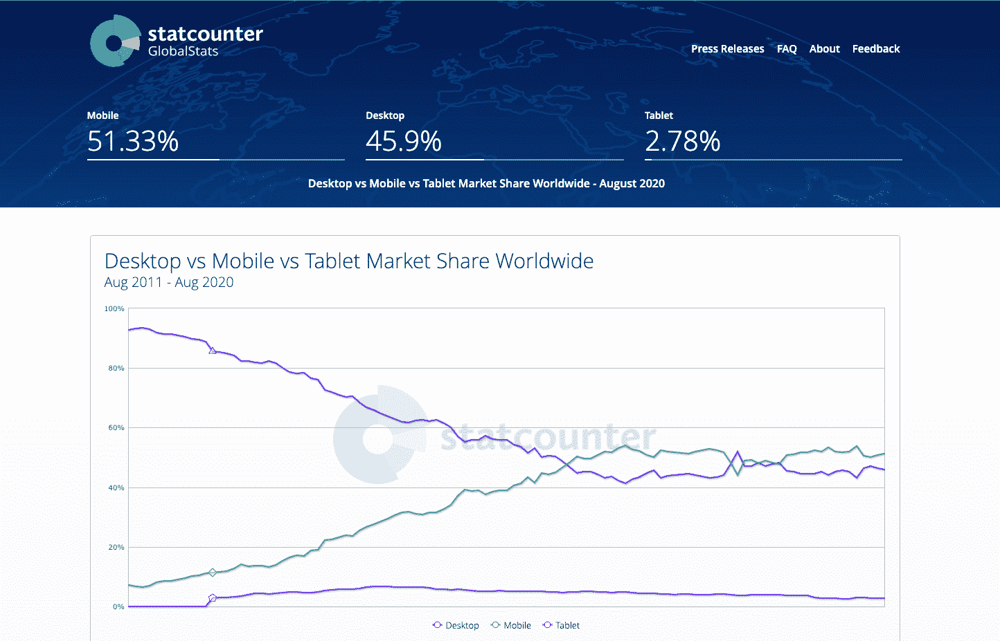

Mobile, tablet, desktop market share


当超过一半的潜在访问者使用移动设备浏览互联网时，你不能只为他们提供一个为桌面设计的页面。这将很难阅读和使用，并导致糟糕的用户体验。

但这还不是全部。移动设备上的用户也构成了搜索引擎访问量的大部分。


Mobile search traffic


最后，在过去的几年里，手机已经成为最重要的广告渠道之一。即使在大流行后的市场，移动广告支出也增长了 4.8%，达到 915.2 亿美元。

无论你选择在社交媒体上做广告还是使用像 T2、YouTube、SEO 这样的有机方式，你的大部分流量都将来自移动用户。

如果您的[登录页面](https://kinsta.com/blog/wordpress-landing-page-plugins/)没有针对移动设备进行优化并且易于使用，您将无法最大化您营销工作的投资回报。糟糕的[转换率](https://kinsta.com/blog/conversion-tracking/)将导致更少的线索和浪费的广告支出。


## WordPress 站点有响应吗？

WordPress 站点是否有响应取决于你的 WP 站点的主题。WordPress 主题相当于一个静态网站的模板，控制着你内容的设计和布局。

如果你使用一个默认的 WordPress 主题，比如 [Twenty Twenty](https://wordpress.org/themes/twentytwenty/) ，这个设计是有反应的，但是因为它是一个单列的设计，当你在不同的屏幕上看到它时，你可能意识不到这一点。

如果你使用另一个 WordPress 主题，你可以通过比较它在不同设备上的外观或者使用 Chrome 开发者工具来测试它是否有响应。

## 响应式网页设计的构建模块

在这一部分，我们将介绍响应式网站设计的基础及其不同的构建模块。

 ### CSS 和 HTML

响应式设计的基础是 HTML 和 CSS 的结合，这两种语言在任何给定的网络浏览器中控制页面的内容和布局。

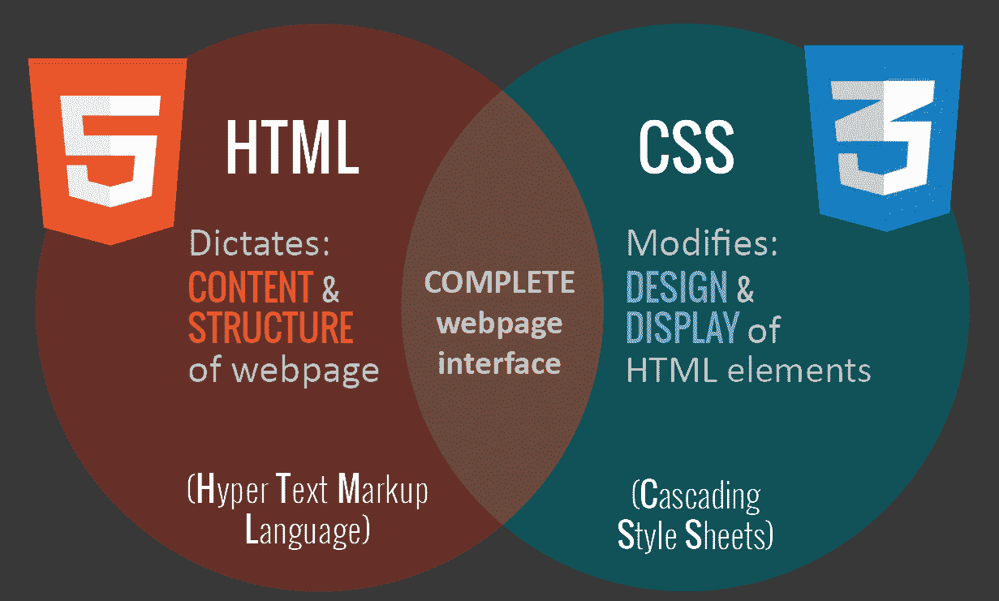

HTML vs CSS (Image source: codingdojo.com)


HTML 主要控制网页的结构、元素和内容。例如，要将一个[图像添加到一个网站](https://kinsta.com/blog/free-images-for-wordpress/)，您必须使用如下 HTML 代码:

```

```

您可以设置一个“类”或“id ”,稍后您可以使用 [CSS 代码](https://kinsta.com/knowledgebase/combine-external-css/)将其作为目标。

您还可以控制 HTML 中的主要属性，如高度和宽度，但这不再被认为是最佳实践。

相反， [CSS](https://kinsta.com/blog/wordpress-css/) 是用来编辑 HTML 页面中元素的设计和布局的。CSS 代码可以包含在 HTML 文档的`<style>`部分，或者作为单独的[样式表文件](https://kinsta.com/blog/how-to-customize-wordpress-theme/#the-stylesheet)。

例如，我们可以在元素级别编辑所有 HTML 图像的宽度，如下所示:

```
img {
width: 100%;
}
```

或者我们可以通过在前面添加一个句点来定位特定的类“全宽-img”。

```
.full-width-img {
width: 100%;
}
```

除了高度、宽度和颜色之外，你还可以控制设计。像这样使用 CSS，当你把它和一种叫做媒体查询的技术结合起来时，你就能使设计更具响应性。
T3】

### 媒体查询

[媒体查询](https://www.seobility.net/en/wiki/Media_Queries)是 CSS3 的一个基本部分，它允许你渲染内容以适应不同的因素，如屏幕大小或分辨率。

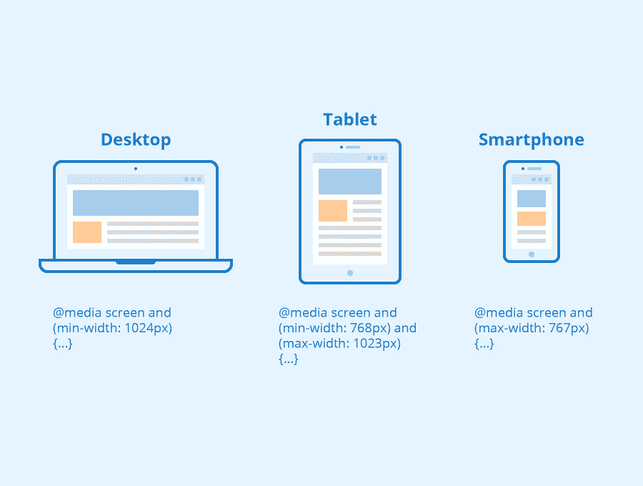

Media queries for desktop, tablet, smartphone


它的工作方式类似于一些[编程语言](https://kinsta.com/blog/scripting-languages/)中的“if 子句”，基本上是在执行适当的代码之前检查*屏幕的视窗是否足够宽或太宽。*

```
@media screen and (min-width: 780px) {
.full-width-img {
margin: auto;
width: 90%;
}
```

如果屏幕至少有 780 像素宽，“全幅-img”类图像将占据屏幕的 90%,并自动以同样宽的边距居中。

### 流畅的布局

流畅的布局是现代响应式设计的重要组成部分。在过去，你可以为每个 HTML 元素设置一个静态值，比如 600 像素。

流体布局依赖于动态值，如视口宽度的百分比。

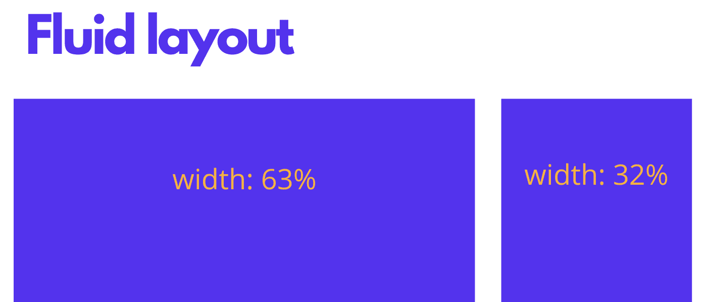

Example of fluid layout


这种方法将根据屏幕的大小动态地增加或减少不同容器元素的大小。

### Flexbox 布局

虽然基于百分比的布局是可变的，但许多设计师和 web 开发人员认为它不够动态或灵活。Flexbox 是一个 CSS 模块，旨在提供一种更有效的方式来布局多个元素，即使容器内的内容大小未知。

flex 容器扩展项目以填充可用空间，或者收缩项目以防止溢出。这些 flex 容器有许多独特的属性，比如 justify-content，这些属性不能用常规的 HTML 元素来编辑。


Flexbox container


这是一个复杂的话题，所以如果你想在你的设计中使用它，你应该阅读 [CSS Tricks 的 flexbox 指南](https://css-tricks.com/snippets/css/a-guide-to-flexbox/)。

### 响应图像

响应图像的最基本迭代遵循与流体布局相同的概念，使用动态单元来控制宽度或高度。我们之前介绍的示例 CSS 代码已经实现了这一点:

```
img {
width: 100%;
}
```

%单位近似于视窗宽度或高度的单一百分比，并确保图像与屏幕保持比例。

这种方法的问题是，每个用户都必须下载完整大小的图像，即使是在手机上。

要为不同的设备提供不同的缩放版本，您需要在 img 标签中使用 HTML `srcset`属性，以指定多个图像大小供选择。

```

```

WordPress 会自动为文章或页面中的图片使用这一功能。

### 速度

当你试图为你的网站创建一个响应式设计时，[加载速度应该是重中之重](https://kinsta.com/learn/speed-up-wordpress/)。

在 2 秒内加载的页面平均有 9%的跳出率，而花费 5 秒的页面有 38%的跳出率。

您的响应方法不能阻塞或延迟页面的首次呈现。

有几种方法可以让你的网页更快。[优化你的图像](https://kinsta.com/blog/optimize-images-for-web/)，实现[缓存](https://kinsta.com/blog/wordpress-cache/)，缩小，使用更有效的 CSS 布局，避免[渲染阻塞 JS](https://kinsta.com/blog/eliminate-render-blocking-javascript-css/) ，以及[改善你的关键渲染路径](https://kinsta.com/blog/critical-rendering-path/)都是你应该考虑的好主意。

[Kinsta 客户](https://kinsta.com/plans/?plan=visits-business1&interval=month)可以通过使用  [代码缩小功能](https://kinsta.com/help/kinsta-cdn-code-minification/) 快速简便地完成这项工作，该功能内置于 [MyKinsta 仪表板](https://kinsta.com/mykinsta/) 中，客户只需简单点击即可实现 CSS 和 JavaScript 的自动缩小。

你也可以尝试在你的移动页面上实现 Google AMP，但是在我们的 [Google AMP 案例研究](https://kinsta.com/blog/disable-google-amp/)中，我们的移动领先优势下降了 59%。

 ## 注册订阅时事通讯


### 想知道我们是怎么让流量增长超过 1000%的吗？

加入 20，000 多名获得我们每周时事通讯和内部消息的人的行列吧！

[Subscribe Now](#newsletter)

## 常见响应断点

要处理媒体查询，您需要决定“响应断点”或屏幕大小断点。断点是使用媒体查询实现新 CSS 样式的屏幕宽度。

### 常见屏幕尺寸

*   手机:360 x 640
*   手机:375 x 667
*   手机:360 x 720
*   iPhone X: 375 x 812
*   像素 2: 411 x 731
*   平板电脑:768 x 1024
*   笔记本电脑:1366 x 768
*   高分辨率笔记本电脑或台式机:1920 x 1080

如果你选择移动优先的设计方法，以单列和较小的字体大小为基础，你不需要包括移动断点——除非你想优化特定模型的设计。

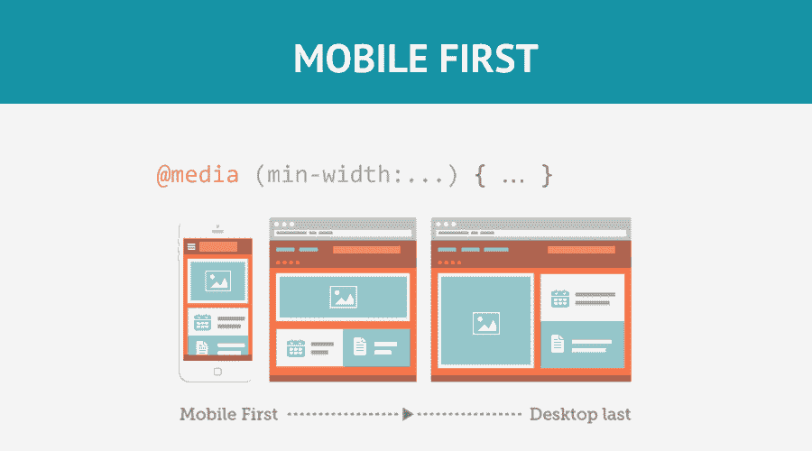

Mobile-first design (Image source: silocreativo.com)


因此，您可以创建一个只有两个断点的基本响应设计，一个用于平板电脑，一个用于笔记本电脑和台式电脑。

### 引导程序的响应断点

作为第一个也是最受欢迎的响应式框架之一， [Bootstrap](https://getbootstrap.com/) 引领了对静态网页设计的冲击，并帮助建立了移动优先的设计作为行业标准。

因此，直到今天，许多设计师仍然遵循 Bootstrap 的屏幕宽度断点。

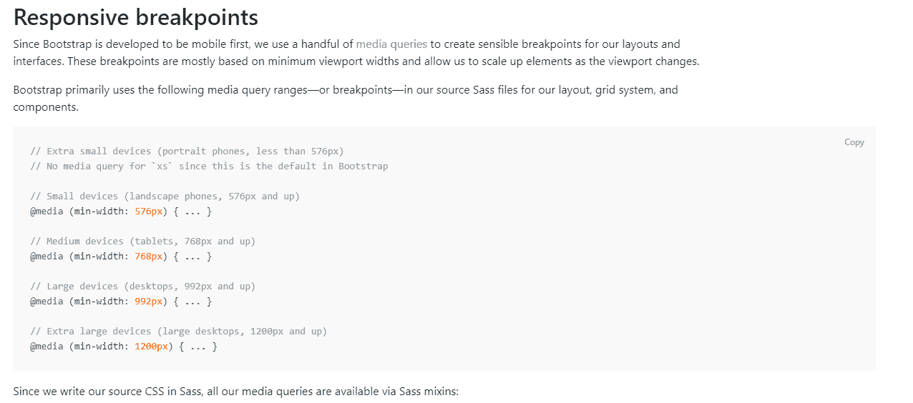

Bootstrap responsive breakpoints


他们使用媒体查询来定位风景手机(576 像素)、平板电脑(768 像素)、笔记本电脑(992 像素)和超大桌面屏幕(1200 像素)。

## 如何让你的网站响应迅速

现在你已经熟悉了构建模块，是时候让你的网站更有响应性了。

 ### 设置媒体查询范围(响应断点)

根据设计的独特需求设置媒体查询范围。例如，如果我们希望在设计中遵循引导标准，我们将使用以下媒体查询:

*   用于肖像手机的 576 像素
*   平板电脑 768 像素
*   笔记本电脑的 992px
*   大型设备 1200 像素

### 用百分比调整布局元素的大小或创建 CSS 网格布局

第一步也是最重要的一步是根据媒体查询或屏幕断点为不同的布局元素设置不同的大小。

布局容器的数量取决于设计，但是大多数网站都关注下面列出的元素:

*   包装或容器
*   页眉
*   内容
*   [侧边栏](https://kinsta.com/knowledgebase/remove-sidebar-wordpress/)
*   [页脚](https://kinsta.com/knowledgebase/add-code-wordpress-header-footer/)

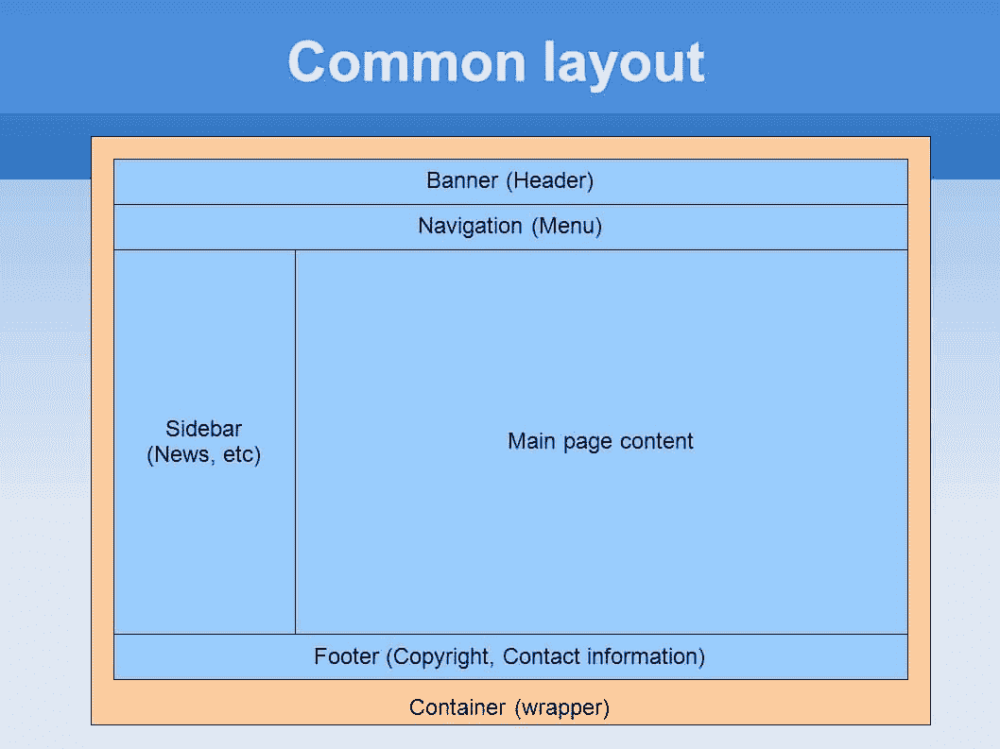

Common layout


使用[移动优先的方法](https://kinsta.com/blog/google-mobile-first-index/)，你可以像这样设计主要的布局元素(没有媒体询问移动电话的基本样式):

```
#wrapper {width:95%;  margin: 0 auto; }

#header {width:100%; }

#content {width:100%; }

#sidebar {width:100%; }

#footer {width:100%; }

// Small devices (landscape phones, 576px and up)

@media (min-width: 576px) {

// Medium devices (tablets, 768px and up)

@media (min-width: 768px) {

#wrapper {width:90%;  margin: 0 auto; }

#content {width:70%; float:left; }

#sidebar {width:30%; float:right; }

// Large devices (desktops, 992px and up)

@media (min-width: 992px) { ... }

}

// Extra large devices (large desktops, 1200px and up)

@media (min-width: 1200px) {

#wrapper {width:90%;  margin: 0 auto; }

}
```

在基于百分比的方法中，“float”属性控制元素出现在屏幕的哪一边，左边还是右边。

如果你想超越基础，创造一个前沿的响应式设计，你需要熟悉 CSS flexbox 布局及其属性，如[框尺寸](https://developer.mozilla.org/en-US/docs/Web/CSS/box-sizing)和 [flex](https://developer.mozilla.org/en-US/docs/Web/CSS/flex) 。

需要为您的客户站点提供一个非常快速、安全且对开发人员友好的托管服务吗？Kinsta 是为 WordPress 开发者设计的，提供了大量的工具和强大的仪表板。[查看我们的计划](https://kinsta.com/plans/?in-article-cta)

### 实施响应图像

一种确保你的图像不被破坏的方法就是对所有的图片使用一个动态值，就像我们之前提到的那样。

```
img {
width: 100%;
}
```

但这不会减轻移动访问者访问你的网站时的负担。

当你添加图片到你的页面时，确保你总是包含不同尺寸的图片。

手动完成这项工作可能相当耗时，但有了像 WordPress 这样的 [CMS，当你](https://kinsta.com/blog/cms-software/#1-wordpress--price-free)[上传媒体文件](https://kinsta.com/blog/wordpress-media-library/)时，这项工作就会自动完成。

### 为你的网站文本设计有反应的字体

响应式网页设计的主要焦点是布局块、元素和媒体的响应性。文本通常被认为是事后的想法。

但是对于一个真正反应灵敏的设计，你也应该[适当地调整你的字体大小](https://kinsta.com/blog/how-to-change-font-in-wordpress/)来匹配屏幕大小。

最简单的方法是为 font-size 设置一个静态值，比如 22 px，然后[在每个媒体查询](https://www.smashingmagazine.com/2017/05/fluid-responsive-typography-css-poly-fluid-sizing/)中修改它。

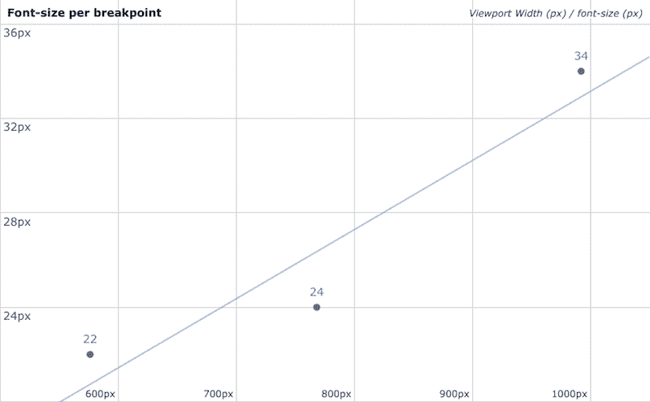

Font size vs view size scatter points


通过使用逗号分隔每个文本元素，可以同时定位多个文本元素。

```
@media (min-width: 992px) {

body, p, a, h4 {

font-size: 14px;

}

}
```

### 测试响应度

首先，你想用谷歌的手机友好测试来测试你的网站是否是手机友好的。只需输入您网站的[网址](https://kinsta.com/knowledgebase/what-is-a-url/)，点击“测试网址”按钮即可获得结果。

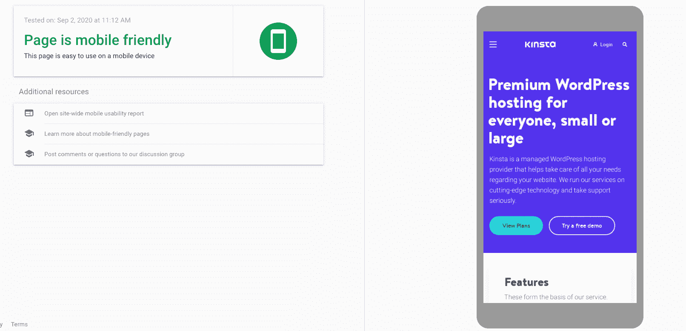

Google’s Mobile-Friendly Test


不要担心，如果它需要一段时间来获取您的网站。那并不能反映你的页面加载速度。

如果你遵循了这篇文章中概述的步骤，它应该说你有一个手机友好的网站。

然后你想用像 Chrome 开发者工具这样的工具在多种屏幕尺寸上测试你的网站。

在 Windows 电脑上按 CTRL + Shift + I，或在 MAC 上按 Command + Option + I 打开相关的设备视图。在这里，您可以选择自己喜欢的移动设备或平板电脑来测试设计的响应能力。

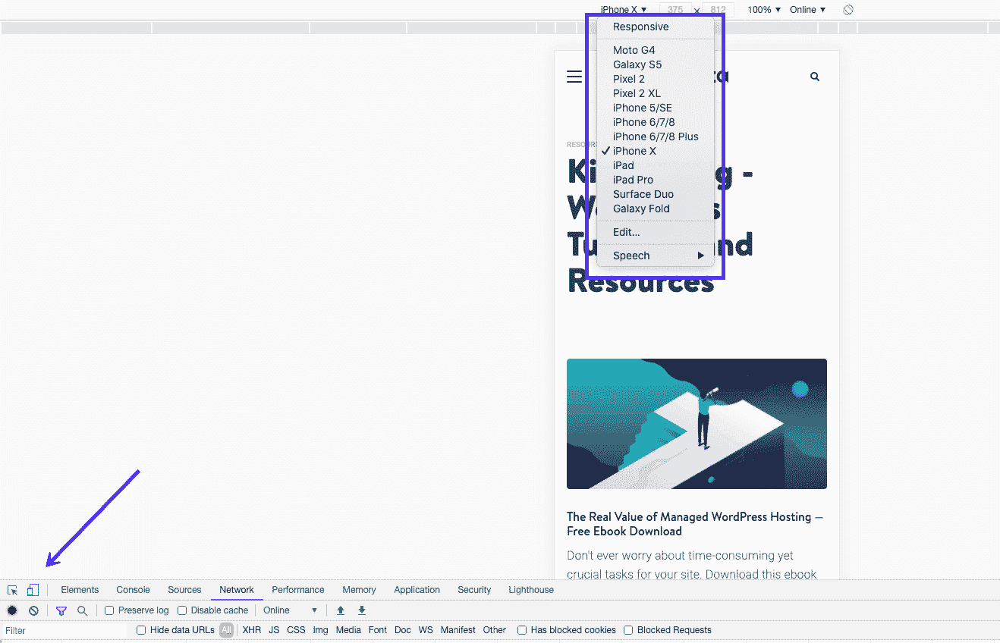

Testing responsive & mobile layouts in Chrome


在此过程中，您需要回答几个问题。

*   布局调整到正确的列数了吗？
*   内容是否适合不同屏幕上的布局元素和容器？
*   字体大小适合每个屏幕吗？

## 响应性设计的 CSS 单位和数值

CSS 有绝对和相对的度量单位。绝对长度单位的一个例子是厘米或像素。相对单位或动态值取决于屏幕的大小和分辨率或根元素的字体大小。

### PX 与 EM、REM 与视口单位的响应设计

*   PX–单个像素
*   EM–基于元素字体大小的相对单位。
*   REM–基于元素字体大小的相对单位。
*   VH，VW–视口高度或宽度的百分比。
*   %–父元素的百分比。

一个新的网页设计者或开发者应该坚持使用像素作为文本，因为像素是 CSS 中最直接的长度单位。

但是当设置图像和其他元素的宽度和最大宽度时，使用%是最好的解决方案。这种方法将确保组件调整到每个设备的屏幕大小。

## 响应式设计示例

下面我们将介绍一些来自不同行业的响应式网页设计的例子——并从他们的对错中学习。

### 1.在线报纸:纽约时报

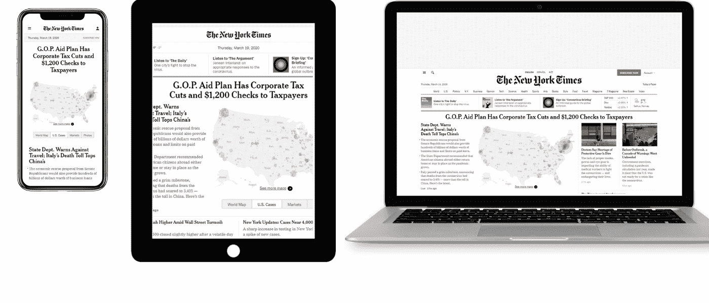

NYT on mobile, tablet, and laptop


在桌面上， [NYT](https://www.nytimes.com/) 的布局让你想起传统的报纸，充斥着视觉效果和不同的内容行和列。似乎每一类新闻都有单独的一栏或一行。

在手机上，它符合单栏标准，还将菜单调整为手风琴格式，以便于使用。

### 2.博客:不墨守成规的艺术


The Art of Non-Conformity on mobile, tablet, and laptop


Chris Guillebeau 的博客[“非一致性的艺术”](https://chrisguillebeau.com/)十多年来一直很受欢迎。虽然这种设计不是最前沿的，但它反应灵敏，将两栏侧栏和主要内容布局调整为移动设备上的单列设计。

### 3.电子商务:亚马逊


Amazon on mobile, tablet, and laptop


亚马逊是全球电子商务的领导者，因为某种原因，他们的用户界面在所有设备上都非常流畅。

他们的平板电脑布局只是删除了一些空白，并添加了一个可滚动的图标部分，以便在一个更小的包中容纳更多的内容。

他们的移动布局将它放在一个单独的栏中，集中在要点上，比如最近的购买历史，而不是主页上的不同部分链接图标。

### 4.视频网站:YouTube

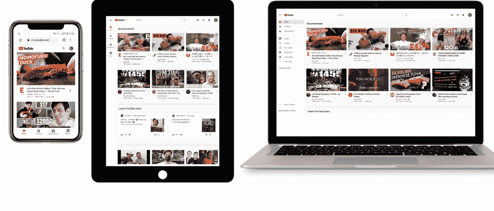

手机、平板电脑和笔记本电脑上的 YouTube

YouTube 主页设计的核心是一个与每个用户相关的灵活的视频网格。在平板电脑上，每行的列数减少到三列。在手机上，它被简化为单栏设计。

手机版还将主菜单移到了屏幕底部，更靠近智能手机用户的拇指。这个简单的动作[改善了导航](https://kinsta.com/blog/website-navigation/)和 UX。

### 5.在线杂志:连线


Wired on mobile, tablet, and laptop


《连线》的响应式网页设计方法侧重于在所有较小的屏幕上实现单列布局，从平板电脑开始。

这是一个基本的布局，但更容易吸引用户对头条新闻和他们的 [CTA 订阅](https://kinsta.com/blog/conversion-rate-optimization-tips/)。

[Make sure your website looks ✨ stunning ✨ across devices with this guide to responsive design!Click to Tweet](https://twitter.com/intent/tweet?url=https%3A%2F%2Fkinsta.com%2Fblog%2Fresponsive-web-design%2F&via=kinsta&text=Make+sure+your+website+looks+%E2%9C%A8++stunning+%E2%9C%A8++across+devices+with+this+guide+to+responsive+design%21&hashtags=webdev%2Cdesign)

## 摘要

响应式网站设计包含许多不同的元素。如果对 HTML 和 CSS 没有基本的了解，就很容易出错。

但是通过熟悉不同的构建模块，使用 web 开发工具分析示例，并使用示例代码进行测试，您应该能够使您的网站响应迅速，而不会出现任何重大问题。

如果这听起来太难实现，你总是可以雇佣一个 WordPress 开发者或者简单地确保你的主题已经响应了。

* * *

让你所有的[应用程序](https://kinsta.com/application-hosting/)、[数据库](https://kinsta.com/database-hosting/)和 [WordPress 网站](https://kinsta.com/wordpress-hosting/)在线并在一个屋檐下。我们功能丰富的高性能云平台包括:

*   在 MyKinsta 仪表盘中轻松设置和管理
*   24/7 专家支持
*   最好的谷歌云平台硬件和网络，由 Kubernetes 提供最大的可扩展性
*   面向速度和安全性的企业级 Cloudflare 集成
*   全球受众覆盖全球多达 35 个数据中心和 275 多个 pop

在第一个月使用托管的[应用程序或托管](https://kinsta.com/application-hosting/)的[数据库，您可以享受 20 美元的优惠，亲自测试一下。探索我们的](https://kinsta.com/database-hosting/)[计划](https://kinsta.com/plans/)或[与销售人员交谈](https://kinsta.com/contact-us/)以找到最适合您的方式。