# 如何为你的 WordPress 站点配置 W3 总缓存设置

> 原文:[https://kinsta.com/blog/w3-total-cache/](https://kinsta.com/blog/w3-total-cache/)

拥有超过 100 万的活跃安装，W3 Total Cache 是 WordPress 知识库中最受欢迎的[缓存](https://kinsta.com/blog/what-is-cache/)和优化插件之一。不像其他 WordPress 优化插件提供一个相对简单和精简的界面，W3 Total Cache 完全控制你的 [WordPress 站点的缓存配置](https://kinsta.com/blog/wordpress-cache/)。

W3TC 设置的粒度使其成为高级用户和开发者的理想插件，他们希望最终控制他们的 WordPress 站点。在本文中，我们将深入了解 W3 Total Cache 的设置，并给出我们推荐的配置来[提升你的 WordPress 站点](https://kinsta.com/learn/speed-up-wordpress/)的性能。

如果你是 Kinsta 用户，你不需要在 W3 总缓存中配置某些设置，因为我们的[托管栈](https://kinsta.com/advanced-features/)已经内置了许多优化。例如，通过 NGINX 的服务器级页面缓存在所有 Kinsta 站点上默认是启用的，所以您不需要在 W3 Total Cache 中启用它。如果你在 Kinsta 托管的网站上设置 W3TC，只需特别注意下面的设置说明。如果特定设置不需要或与 Kinsta 不兼容，我们一定会通知您。

 <kinsta-auto-toc heading="Table of Contents" exclude="last" list-style="arrow" selector="h2" count-number="-1">## 如何安装 W3 总缓存

如果你的网站上没有安装 W3 Total Cache，你可以直接在你的 [WordPress 仪表盘](https://kinsta.com/knowledgebase/wordpress-admin/)中安装。只需在“添加插件”页面搜索“W3 总缓存”并安装即可。

Install W3 Total Cache.

还有 W3 Total Cache 的 Pro 版，可以在 [BoldGrid 的网站](https://www.boldgrid.com/w3-total-cache/)购买。专业版附带了一些额外的功能，如 REST API 缓存、Google Maps 缓存和其他扩展。在本文中，我们将使用来自 [WordPress 插件库](https://kinsta.com/knowledgebase/how-to-install-wordpress-plugins/#1-how-to-install-wordpress-plugins-via-dashboard)的免费版本。

[Boost the performance of your #WordPress site 🚀 and take control of advanced features with this guide to W3 Total Cache settings ⚡️Click to Tweet](https://twitter.com/intent/tweet?url=https%3A%2F%2Fkinsta.com%2Fblog%2Fw3-total-cache%2F&via=kinsta&text=Boost+the+performance+of+your+%23WordPress+site+%F0%9F%9A%80+and+take+control+of+advanced+features+with+this+guide+to+W3+Total+Cache+settings+%E2%9A%A1%EF%B8%8F&hashtags=WordPressPlugin%2CCaching)

### W3 总缓存设置存储在哪里？

安装 W3 Total Cache 后，你会在 WordPress 管理面板的侧边栏看到一个“性能”标签。点击“性能”选项卡将显示各种子菜单，如“常规设置”、“页面缓存”、“缩小”等。

<link rel="stylesheet" href="https://kinsta.com/wp-content/themes/kinsta/dist/components/ctas/cta-mini.css?ver=2e932b8aba3918bfb818">

> 需要在这里大声喊出来。Kinsta 太神奇了，我用它做我的个人网站。支持是迅速和杰出的，他们的服务器是 WordPress 最快的。
> 
> <footer class="wp-block-kinsta-client-quote__footer">
> 
> 
> 
> <cite class="wp-block-kinsta-client-quote__cite">Phillip Stemann</cite></footer>

[View plans](https://kinsta.com/plans/)

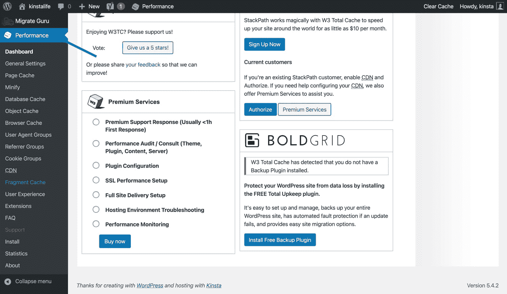

W3 Total Cache sidebar settings.

你也可以使用 WordPress 管理工具栏中的“性能”标签来访问 W3 总缓存设置。

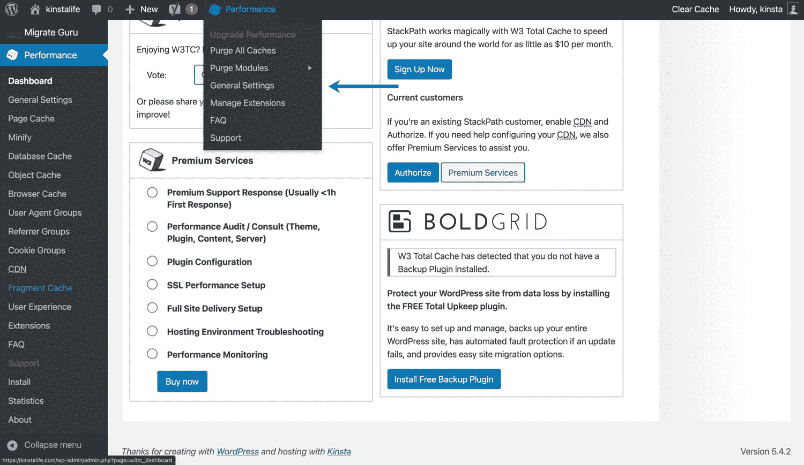

W3 Total Cache admin toolbar settings.

 <kinsta-advanced-cta language="en_US" type-int-post="77508" type-int-position="0">## 如何清除 W3 总缓存

在我们开始如何配置 W3 总缓存之前，让我们快速回顾一下如何清除缓存。如果您将鼠标悬停在管理工具栏中的“性能”选项卡上，您会看到两个清除选项。

1.  **清除所有缓存—**一次清除所有缓存。
2.  **清除模块—**清除单个缓存(例如，缩小的资产、页面缓存、对象缓存等。).

Purge W3 Total Cache.

## W3 总缓存常规设置

让我们深入 W3 总缓存的“一般设置”菜单来配置一些基本设置。

### 页面缓存

默认情况下，对你的 WordPress 站点的每个请求都是实时呈现的。对于某些类型的网站，如[电子商务商店](https://kinsta.com/blog/ecommerce-strategies/)或[论坛](https://kinsta.com/knowledgebase/bbpress/)，动态渲染是理想的。然而，对于博客、新闻网站和其他不需要动态内容的网站，添加页面缓存层可以提高性能并减少服务器负载。

Enable page caching in W3TC.

如果你的站点托管在 Kinsta 上，你就不用担心页面缓存了。我们有一个高性能的服务器级配置，[自动将您网站的页面](https://kinsta.com/help/full-page-caching/)缓存到静态 HTML 文件中。如果您的主机不提供页面缓存，您可以在 W3 Total Cache 插件中启用页面缓存。

### 使变小

缩小你的 HTML、 [CSS](https://kinsta.com/blog/wordpress-css/) 和 JavaScript 资产可以通过移除不必要的空白来减少你的网站页面的整体大小。对于大多数 WordPress 网站来说，启用 W3 Total Cache 的“Minify”功能并选择“Minify 模式”的“自动”选项就可以了。

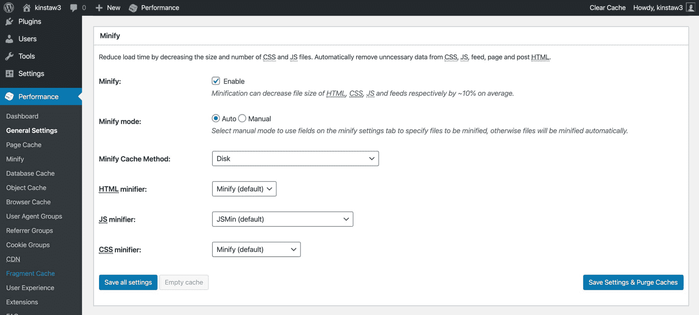

Minify HTML, CSS, and JavaScript assets in W3TC.

在某些情况下，[缩小资产](https://kinsta.com/learn/speed-up-wordpress/#use-minification-on-html-css-and-javascript)可能会导致 CSS 或 JavaScript 代码中断，这通常会导致前端出现明显的错误。如果你在缩小资产后注意到你的站点上有不寻常的问题，我们建议[与开发者](https://kinsta.com/blog/hire-wordpress-developer/)一起工作来识别引起问题的资产。之后，您可以在手动模式下使用“缩小”功能，这允许您绕过特定 CSS 和 JavaScript 文件的缩小。

### 操作码缓存

WordPress 是一个动态 CMS，这意味着 [PHP 工作人员](https://kinsta.com/blog/php-workers/)在后台不断执行代码。[操作码缓存](https://kinsta.com/blog/wordpress-cache/#bytecode-cache)通过存储编译后的 PHP 代码来帮助加速你的站点，这使得需要相同代码的后续请求更快。

Enable opcode cache in W3TC.

如果您的站点托管在 Kinsta 上，您不必担心在 W3 Total Cache 中启用操作码缓存层。我们在所有实时环境中启用 OPcache，一种操作码缓存。OPcache 在 [staging environments](https://kinsta.com/help/staging-environment/) 上被禁用，以确保编译的 PHP 代码不会被缓存，也不会干扰站点开发和[调试](https://kinsta.com/blog/wordpress-debug/)。

如果您的主机不提供操作码缓存，我们建议在 W3 总缓存中启用它。请记住，操作码缓存特性仅在 W3TC 的 Pro 版本中可用。

### 数据库缓存

W3TC 的数据库存储了 [MySQL 数据库查询](https://kinsta.com/knowledgebase/what-is-mysql/)的结果。虽然这个特性听起来很有用，但是我们建议禁用它，而使用对象缓存。

Database caching in W3 Total Cache.

我们发现，在某些情况下，数据库缓存特性可能会导致高 CPU 使用率。这意味着通过存储数据库查询结果节省的 CPU 资源最终可能会被该特性所需的 CPU 资源的增加所抵消。

### 对象缓存

在 WordPress 的上下文中，[对象缓存](https://kinsta.com/blog/wordpress-cache/#object-cache)存储已完成的数据库查询的结果。WordPress 实际上有一个内置的对象缓存，但是它只保留单次页面加载的数据。这允许更高效的页面呈现，因为它确保页面加载不需要浪费 CPU 资源来运行相同的数据库查询。

虽然 WordPress 的默认对象缓存无疑对性能有益，但跨页面加载保留数据的对象缓存甚至更好！W3TC 的“对象缓存”特性在你的`/wp-content`目录中添加了一个定制的缓存脚本，并改变了 WordPress 的对象缓存的行为以持久地保留数据(跨多个页面加载)。

我们建议在你的 WordPress 站点上启用 W3TC 的对象缓存功能，如果你的站点没有托管在 Kinsta 上，可以加速利用数据库查询**的请求。**

W3 Total Cache object cache.

如果您的站点托管在 Kinsta 上，我们会提供一个由我们的 [Redis 插件](https://kinsta.com/plans/)支持的高性能对象缓存层。Redis 是一种开源的内存数据结构存储，通常用于数据库和消息代理应用程序。

由于 Redis 在 RAM 中缓存数据，它允许 WordPress 从一个比传统对象缓存配置快得多的[持久对象缓存](https://kinsta.com/help/redis-cache/)中访问[缓存的数据](https://kinsta.com/blog/what-is-cached-data/)。

### 浏览器缓存

浏览器缓存通过在本地存储静态资产，如 CSS、JavaScript、图像和字体，可以大大提高你的 WordPress 站点的速度。浏览器缓存使用过期时间来确定缓存资产的时间。在现代网络上，大多数开发者为静态资产指定 1 年的有效期。

Enable browser caching in W3 Total Cache.

对于 Kinsta 上托管的站点，我们对静态文件强制实施 1 年的缓存期。这可以通过检查 Kinsta 上的静态文件的`cache-control`头来验证。如果您的 web 主机没有对浏览器缓存实施“未来过期时间”,您可以在 W3 总缓存中启用“浏览器缓存”功能并配置过期时间。

### 内容交付网络

如果您使用 [CDN](https://kinsta.com/blog/wordpress-cdn/) 或内容交付网络将静态文件卸载到世界各地的数据中心，您可以将 W3 Total Cache 配置为[用您的 CDN 主机名重写“](https://kinsta.com/knowledgebase/wordpress-change-url/)[主题文件](https://kinsta.com/blog/how-to-install-a-wordpress-theme/)、媒体库附件、CSS、JS”等的 URL。

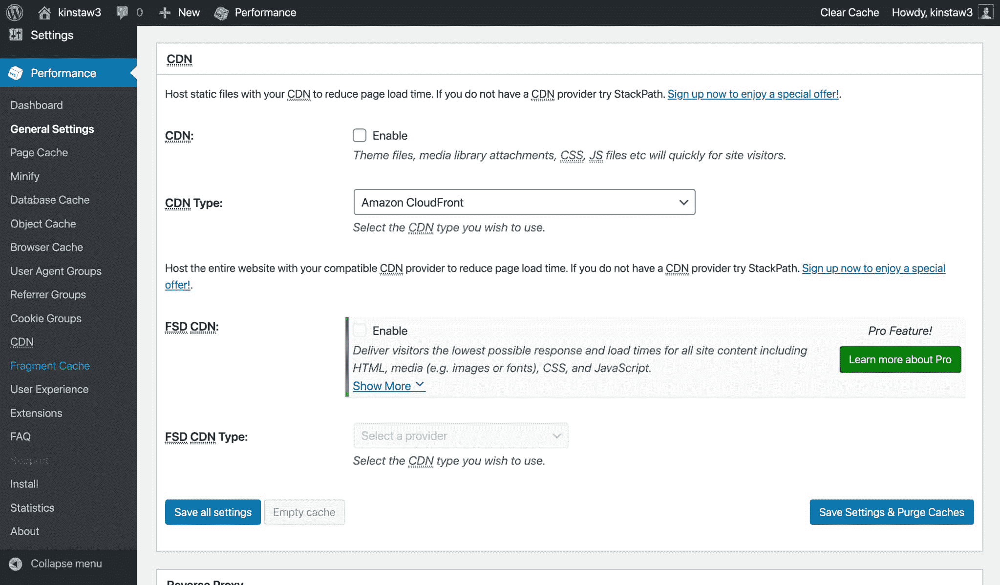

CDN settings in W3 Total Cache.

如果您的网站托管在 Kinsta 上，我们建议使用由 Cloudflare 支持的高性能内容交付网络 [Kinsta CDN](https://kinsta.com/help/kinsta-cdn/) 。当 Kinsta CDN 启用时，静态文件 URL 将自动重写，以便从 Kinsta CDN 提供服务。

您还可以访问其他内置功能，包括[代码缩小功能](https://kinsta.com/help/kinsta-cdn-code-minification/)，它允许 [Kinsta 客户](https://kinsta.com/plans/?plan=visits-business1&interval=month)通过点击一个按钮，直接在 [MyKinsta 仪表板](https://kinsta.com/mykinsta/)中启用自动 CSS 和 JavaScript 缩小。

如果你喜欢使用另一个 CDN 提供商，或者如果你的站点没有托管在 Kinsta 上，你可以在 W3 Total Cache 中启用“CDN”特性并添加你的 CDN URL。

### 反向代理

一个反向代理位于你的 web 服务器和 WordPress 之间，可以用来对输入的请求执行各种基于逻辑的操作。W3TC 支持 Varnish，这是一个流行的“HTTP 加速器”,用于缓存和提供数据，目的是减少后端负载。

为了使用 Varnish，必须首先由您的主机安装 Varnish 包。如果你是 Kinsta 的客户，不要启用[反向代理](https://kinsta.com/blog/reverse-proxy/)选项，因为我们的基础设施不是为 Varnish 设计的。

### 用户体验

W3TC 的“用户体验”优化让你可以启用[延迟加载](https://kinsta.com/blog/wordpress-lazy-load/)，禁用表情符号，禁用`wp-embed.js`脚本。我们建议在你的 WordPress 站点上启用延迟加载来加速页面加载。如果你还没有使用浏览器本地或者基于插件的延迟加载，我们推荐使用 W3 Total Cache 进行延迟加载。

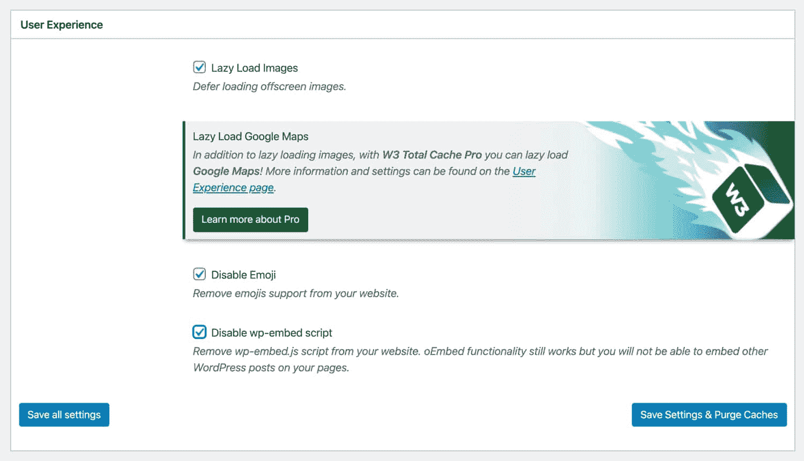

User experience settings in W3TC.

在当今世界，大多数操作系统都内置了对[表情符号](https://kinsta.com/knowledgebase/disable-emojis-wordpress/)的支持。因此，如果你不是一个重度表情符号用户，你可能需要禁用 WordPress 自带的表情符号脚本。使用 W3TC 移除`wp-emoji-release.min.js`将帮助您减少 HTTP 请求，并从页面负载中移除大约 10KB。

同样，如果你不嵌入 WordPress 的帖子，你可以用 W3 总缓存禁用`wp-embed.js`。禁用此脚本不会影响嵌入 YouTube 视频、SoundCloud 流等的 oEmbed 功能。

### 多方面的

W3 Total Cache 有一些其他的设置，您也可以进行配置。如果你想在 WordPress 中显示一个[Google Page Speed](https://kinsta.com/blog/google-pagespeed-insights/)dashboard widget，你可以输入你的 Page Speed API 键。在你的 WordPress 站点的每个页面的菜单栏中，也有一个显示页面速度等级的选项。

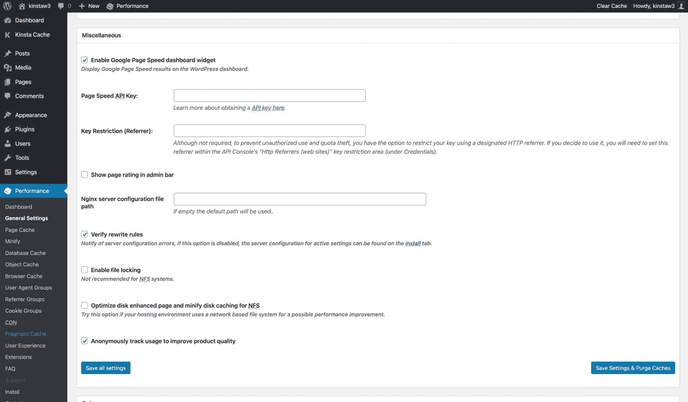

Miscellaneous settings in W3 Total Cache.

对于其他设置，如“ [NGINX 服务器](https://kinsta.com/knowledgebase/what-is-nginx/)配置文件路径”、“启用文件锁定”、“优化磁盘增强页面和缩小 NFS 的磁盘缓存”，我们建议保留其默认设置，除非您有特殊原因要更改它们。

### 调试

如果您正在解决网站上的问题，W3 Total Cache 有一个方便的“调试”菜单，可以让您禁用特定的缓存层和优化设置。例如，如果您注意到站点上的视觉故障，您可以启用“Minify”选项的调试模式，这将在页面的源代码中插入 HTML 注释来帮助您排除故障。

Debug mode in W3 Total Cache.

由于调试模式特性会给服务器资源带来额外的负载，我们建议仅在[阶段环境](https://kinsta.com/help/staging-environment/)或低流量时段使用它。此外，在完成故障诊断后，一定要禁用调试模式！

### 导入/导出设置

完成设置配置后，您可以使用 W3TC 的“导入/导出”功能来创建配置的备份。W3 Total Cache 有很多设置，因此能够导出完整备份对您来说非常安心。此外，它允许您轻松地跨多个站点复制您的定制 W3TC 配置，而不必手动配置任何东西。

Import and export W3TC settings.

 <kinsta-advanced-cta language="en_US" type-int-post="77508" type-int-position="1">## W3 总缓存设置—页面缓存

让我们深入 W3 总缓存的“页面缓存”设置。请记住，如果你的网站是在 Kinsta 上托管的，你不需要担心页面缓存——所以请随意跳过这一节。

*   **缓存首页**–对于大多数网站来说，首页通常是流量最大的页面。因此，我们建议启用此设置。
*   **缓存提要**——WordPress 生成各种 [RSS 提要](https://kinsta.com/blog/wordpress-rss-feed/)，允许外部应用程序和服务，如 Feedburner，显示你网站的内容。虽然 RSS 现在不像以前那么流行了，我们仍然建议启用这个设置。
*   **缓存 SSL (HTTPS 请求)**–如果您的 web 服务器不[对所有传入请求强制 HTTPS](https://kinsta.com/feature-updates/force-https/) ，启用此设置可能会对性能产生积极影响。如果您已经在 web 服务器级别强制实施 HTTPS，就没有必要启用它。
*   **使用查询字符串变量缓存 URIs**–查询字符串是添加在 URL 末尾的参数(例如/？版本=123)。查询字符串通常用于请求和显示 WordPress 数据库中的特定数据。一般来说，查询字符串的目的是请求页面的唯一版本，所以我们建议保持禁用，除非您有特定的查询字符串想要缓存。
*   **缓存 404(未找到)页面**–默认情况下，W3TC 保持此选项禁用。如果您使用“磁盘增强”页面缓存方法，这可能是由于缓存行为造成的。选择该选项后， [404 页面](https://kinsta.com/blog/error-404-not-found/)返回一个 [200 响应代码](https://kinsta.com/blog/http-status-codes/#200-status-codes)。理想情况下，404 页面应该返回 [404 响应代码](https://kinsta.com/blog/http-status-codes/#400-status-codes)，所以我们建议用您的缓存配置测试这个设置，看看它是否兼容。
*   **不缓存登录用户的页面**–我们建议启用此选项。登录的用户通常在更新页面。启用缓存后，用户需要不断清除缓存才能看到页面更新。
*   **不缓存某些用户角色的页面—**这个选项允许你绕过缓存某些 [WordPress 用户角色](https://kinsta.com/blog/wordpress-user-roles/)。如果“不缓存登录用户的页面”选项已经启用，此选项对缓存行为没有影响。

### 别名

W3 Total Cache 的“别名”功能允许你缓存不同域中相同的 WordPres 内容。我们不建议启用此功能。如果你的 WordPress 站点可以通过不同的域名访问(例如 domain.com 和 www.domain.com)，最好设置一个 301 重定向规则[将请求转发到你的主域名](https://kinsta.com/blog/wordpress-redirect/)以避免来自谷歌和其他搜索引擎的[重复内容惩罚](https://kinsta.com/blog/content-scraping/#does-content-scraping-affect-seo)。

### 缓存预加载

“缓存预加载”功能会搜索您的[站点地图](https://kinsta.com/blog/wordpress-sitemap/)，并请求您站点的页面预加载页面缓存。对于大多数站点，我们建议禁用缓存预加载，因为这会导致服务器资源峰值，抵消潜在的性能优势。

如果您确实想启用缓存预加载，W3TC 允许您指定站点地图 URL、更新间隔和每个间隔的页面数。确保不要将“更新间隔”和“内部页数”设置得太高，以减少 CPU 峰值的机会。

### 清除策略

W3TC 的“清除策略”允许您指定发布或编辑帖子后要自动清除的页面和提要。对于大多数网站来说，默认设置(首页、文章页面和博客订阅源)应该足够了。如果要向清除策略添加额外的页面，可配置多种选项。

### REST API

包含的 REST API 让你可以查询 JSON 格式的数据。REST API 被各种插件使用，并且对于无头 WordPress 设置是至关重要的。根据 REST API 的具体用例，缓存查询结果可能是个好主意。REST API 缓存属于“如果你需要，你就会知道”类别，所以如果你不确定是否要启用 REST API 缓存，我们建议让它保持“不缓存”。

### 先进的

在 W3TC 的“高级”页面缓存选项中，您可以自定义各种设置，包括“接受的查询字符串”、“拒绝的用户代理”、粒度缓存旁路设置等等。例如，如果你需要配置你的 W3 总缓存来从不缓存某个类别或标签下的文章，你可以在“高级”选项中这样做。

 ## 注册订阅时事通讯

### 想知道我们是怎么让流量增长超过 1000%的吗？

加入 20，000 多名获得我们每周时事通讯和内部消息的人的行列吧！

[Subscribe Now](#newsletter)

由于这些设置可能因具体站点而异，因此我们无法提供“推荐设置”。也就是说，如果你想定制网站页面缓存行为的一个非常特殊的方面，一定要看看高级选项。

## W3 总缓存设置—缩小

接下来，让我们看看 W3 总缓存的“缩小”设置。

*   **重写 URL 结构—**该设置影响被缩小资产的 [URL](https://kinsta.com/knowledgebase/what-is-a-url/) 结构。我们建议保持启用，这样你的网址看起来“漂亮”。
*   **禁用登录用户的缩小功能—**如果您正在进行一些[故障排除或调试](https://kinsta.com/blog/wordpress-errors/)，禁用登录用户的缩小功能可能会有所帮助。否则，我们建议禁用此选项。

### HTML 和 XML

在“HTML & XML”部分，您可以配置 HTML 缩小设置。

*   **内联 CSS 缩小–**我们建议启用此选项来移除内联 CSS 中的空白。
*   **内联 JS 缩小–**我们建议启用此选项来删除内联 JavaScript 中的空白。在某些情况下，JS 缩小可能会导致代码错误。如果启用此选项会破坏您的站点功能，请禁用它。
*   **不要缩小订阅源–**我们建议禁用此选项。提要只被 RSS 阅读器和其他类似的服务使用，所以缩小提要是没有必要的。
*   **换行符移除–**默认情况下，此选项是禁用的，我们不建议启用它来确保您的站点正确呈现。

### 射流研究…

在“JS”部分，您可以配置 JavaScript 缩小设置。

*   **区域操作-**该选项允许您选择小型 JavaScript 的“嵌入类型”。对于`</head>`之前和`<body>`之后的 JS 文件，可以在“阻塞”、“非阻塞”、“使用 async 的非阻塞”和“使用 defer 的非阻塞”之间选择。虽然[非阻塞加载方法](https://kinsta.com/blog/defer-parsing-of-javascript/)通常会带来更好的性能，但它们并不总是 100%兼容所有的 JavaScript 代码。此外，“异步”和“延迟”有非常不同的用例。因此，我们建议使用默认的“阻塞”方法，除非您知道非阻塞 JavaScript 的古怪之处。
*   **仅缩小或合并—**您可以在两种 JavaScript 优化模式之间进行选择。当选择“缩小”时，您的 JS 文件将被合并和缩小。如果选择“仅合并”，则不会缩小合并后的 JS 文件。如果您遇到与缩小相关的问题，并且不想通过调试来找出是哪个脚本导致了问题，请选择“仅合并”选项可能会修复错误。
*   **HTTP/2 推送-**如果您的服务器支持 [HTTP/2 服务器推送](https://kinsta.com/learn/what-is-http2/#http2-server-push)，启用此选项可以帮助您减少页面加载时间。HTTP/2 服务器推送在访问者请求之前将文件推送给他们。我们建议在生产环境中启用该选项之前进行充分的测试，因为服务器推送经常被误用。服务器推送对于较大的 JavaScript 文件来说并不理想，您需要确保其好处大于直接从访问者的浏览器缓存中加载 JS 文件。

### 半铸钢ˌ钢性铸铁(Cast Semi-Steel)

在“CSS”部分，您可以配置 [CSS](https://kinsta.com/blog/wordpress-css/) 缩小设置。

*   **仅合并–**与 JavaScript 文件不同，CSS 通常不会遇到与缩小相关的问题。因此，我们不建议启用“仅合并”。
*   **删除保留的注释–**该设置从 CSS 文件中删除注释。我们建议启用此选项以尽可能减小文件大小。
*   **换行符移除–**该设置从 CSS 文件中移除换行符。我们建议也启用该选项。如果您在启用“换行符移除”后发现任何显示问题，请将其禁用。

### 先进的

“高级”部分包含一些用于自定义缩小行为的附加设置。

*   **更新外部文件间隔–**W3TC 允许您指定 CSS 和 JS 文件更新之间的时间间隔。默认设置为 86400 秒，您的资产将每 24 小时下载并缩小一次。如果你的站点不经常改变，可以随意设置一个更长的时间段。
*   **垃圾收集间隔–**此时间段设置指定删除过期缓存数据的频率。默认设置是 24 小时。如果您的站点的[存储空间](https://kinsta.com/blog/disk-space-wordpress-hosting/)不足，我们建议降低“垃圾收集间隔”。

“高级”部分的其余部分包括允许您指定永远不应缩小的资产文件的输入字段。还有一个“拒绝的用户代理”字段，允许向某些用户代理提供非精简文件。最后，您可以在 W3 Total Cache 的缩小过程中添加外部资产文件。

## W3 总缓存设置—对象缓存

接下来是 W3TC 的“对象缓存”设置。对于大多数网站来说，默认设置就可以了，但是不管怎样，让我们检查一下。

*   **缓存对象的默认生存期—**未更改的缓存项目的到期时间。时间段越长，对象缓存越大。如果您担心服务器的存储容量，我们建议保持默认值或降低它。
*   **垃圾收集间隔–**该设置指定过期缓存数据被丢弃的频率。对于大多数站点来说，默认值 3，600 秒(1 小时)应该没问题。
*   **全局组—**此设置允许您在单个多站点网络中的站点之间配置共享缓存组。除非有特殊原因需要更改，否则我们建议您保留此设置的默认状态。
*   **非持久组–**此设置允许您选择从不缓存的对象组。同样，我们建议坚持使用默认配置。
*   **为 wp-admin 请求启用缓存-**默认情况下，此选项是禁用的，我们不建议启用它，因为它可能会导致副作用。此外，大多数 WordPress 网站的访问者从不与 wp-admin 仪表板交互。

## W3 总缓存设置—浏览器缓存

大多数 WordPress 主机，包括 Kinsta，已经在 web 服务器级别实现了[适当的浏览器缓存头](https://kinsta.com/blog/leverage-browser-caching/)。如果您的主机没有，或者如果您想进一步定制浏览器缓存行为，您可以使用 W3 Total Cache 来实现。

在“浏览器缓存”设置中，“常规”、“CSS & JS”、“HTML & XML”和“媒体&其他文件”部分的默认设置对于大多数 WordPress 站点来说已经足够了。由于这个页面上有如此多的设置，我们建议[在对浏览器缓存行为进行任何更改之前咨询开发人员](https://kinsta.com/partners/)。也就是说，下面是一些关于浏览器缓存需要注意的关键设置。

*   **Expires Headers Lifetime—**配置一个长的“ [expires headers](https://kinsta.com/knowledgebase/add-expires-headers-wordpress/) lifetime”对于高效的浏览器缓存非常重要。在 Kinsta，我们对 CSS、JS、图像和字体等静态资产实施 1 年的生命周期。如果您使用 W3TC 来配置浏览器缓存，请确保将该值设置为`31536000` (1 年)。
*   **缓存控制策略—**为了确保您的静态资产可被浏览器缓存，请确保将“缓存控制策略”设置为“公共，max_age=EXPIRES SECONDS”。
*   **启用 HTTP (gzip)压缩-**[gzip 压缩](https://kinsta.com/blog/enable-gzip-compression/)在将 HTML 页面和资源发送给访问者之前，会显著减小它们的文件大小，因此，如果您的主机服务器配置支持 GZIP，请确保启用此选项。如果您的站点托管在 Kinsta 上，那么不需要在 W3TC 中启用 GZIP 压缩，因为它已经作为我们默认配置的一部分启用了。
*   **从静态资源中删除查询字符串—**查询字符串是添加到 URL 路径末尾的附加字符串，用于指定请求参数或强制 web 服务器提供新的资源。查询字符串以一个`?`开始，大多数 web 服务器被配置为对于带有查询字符串的请求绕过缓存。从页面请求中删除查询字符串有助于减少服务器负载，因为这些请求使用 PHP 来呈现页面。我们不建议从 W3 Total Cache 的静态资源中删除查询字符串，因为它们有助于确保向访问者提供最新版本的 CSS 和 JS 文件。

“浏览器缓存”设置页面还包含各种与安全标题相关的设置，如[内容安全策略(CSP)](https://www.keycdn.com/support/content-security-policy) 和 X-XSS 保护。我们始终建议与合格的开发人员一起检查这些设置，因为不正确的配置会直接影响您网站的用户体验。例如，在没有正确的 [SSL 证书](https://kinsta.com/help/how-to-install-ssl-certificate/)和 [HTTPS 配置](https://kinsta.com/blog/http-to-https/)的情况下启用 HSTS 报头可能会导致您的网站无法访问。
<kinsta-advanced-cta language="en_US" type-int-post="77508" type-int-position="2"></kinsta-advanced-cta>

## W3 总缓存设置-用户代理组

如果您需要根据用户的设备类型重定向流量，W3 Total Cache 的“[用户代理](https://kinsta.com/blog/wordpress-robots-txt/#what-to-put-in-your-robotstxt-file)组”功能非常强大。例如，如果用户通过移动电话访问您的站点，您可以将您的站点配置为使用不同的主题进行呈现。同样，如果您的移动站点位于一个唯一的子域上，您可以将用户重定向到一个完全不同的站点。

与宕机和 WordPress 问题做斗争？Kinsta 是一款考虑到性能和安全性的托管解决方案！[查看我们的计划](https://kinsta.com/plans/?in-article-cta)

在[响应式网页设计](https://kinsta.com/blog/responsive-web-design/)的时代，我们没有看到太多这种特殊功能的用例。如今，最好的做法是从一开始就让你的网站响应迅速，而不是依赖于多个主题或一个仅限移动的子域。

## W3 总缓存设置-引用者组

一个 [HTTP referrer](https://kinsta.com/blog/google-analytics-spam/) 是一个可选的 HTTP 头，它提供了关于请求来源的信息。例如，如果一个访问者从谷歌搜索列表中点击你的网站，HTTP referrer 将会是`google.com`。

在 W3 Total Cache 中，您可以基于带有“引用组”的请求的 HTTP 引用来定义自定义缓存行为。例如，您可以创建一个由搜索引擎组成的 referrer 组，并仅为来自这些域的请求自定义缓存行为。

与上面提到的“用户代理组”类似，您也可以使用“推荐组”功能将请求重定向到不同的域。大多数 WordPress 站点不需要设置推荐人群组，所以我们不建议配置任何群组。

## W3 总缓存设置— Cookie 组

W3 Total Cache 支持的最新缓存组是“Cookie 组”。这个特性允许您基于请求的[cookie](https://kinsta.com/blog/wordpress-cookies-php-sessions/)创建独特的缓存桶和行为。与“用户代理组”和“推荐组”类似，大多数网站不需要设置自定义的基于 cookie 的缓存配置。如果您的站点需要基于 cookie 的缓存，我们建议您与开发人员合作，对其进行正确配置。

## W3 总缓存设置— CDN

现在，让我们继续 W3 Total Cache 的 [CDN 设置](https://kinsta.com/help/kinsta-cdn/)。

*   **主机附件–**启用此功能，从您的 CDN 提供您的 WordPress 媒体库中的资产。
*   **Host WP-includes/Files—**启用此选项以提供来自 CDN 的`wp-includes`文件夹中的文件。
*   **托管主题文件–**启用此功能，从您的 CDN 提供您的主题文件。
*   **托管缩小的 CSS 和 JS 文件–**启用此功能，从您的 CDN 提供 W3TC 的缩小的 CSS 和 JS 文件。
*   **托管自定义文件–**如果您的媒体库或主题文件夹中没有文件，您可以在 W3TC 中添加文件路径，以便从您的 CDN 提供这些文件。
*   **添加规范标题—**一个`rel=”canonical”`标签帮助搜索引擎识别原始来源或 URL。由于 cdn 通常使用不同的域，添加一个规范的标签可以通知搜索引擎原始资产的位置。也就是说，保持禁用这个设置是没问题的，因为现代搜索引擎足够智能来识别 cdn，而不会影响你网站的 SEO 排名。

### 先进的

*   **仅手动清除 CDN–**我们建议禁用此选项，让 W3TC 自动处理缓存清除。
*   **禁用 SSL 页面上的 CDN-**保持此设置禁用。如果你使用的是 CDN，最好在 HTTP 和 HTTPS 页面上都激活它。
*   **在管理页面上使用媒体库的 CDN 链接—**我们不建议启用此选项，因为它会重写您的[媒体库](https://kinsta.com/blog/wordpress-media-library/)中的 URL。
*   **添加 CORS 标题–**保持启用此设置，以允许您的 CDN 资产显示在其他域上。
*   **禁用以下角色的 CDN-**此选项允许您禁用某些 WordPress 用户角色的 CDN。在大多数情况下，最好禁用该选项。
*   **WP-包括要上传的文件类型—**该字段指定将从您的 CDN 提供的`wp-includes`中的文件格式。对于大多数网站来说，默认的文件格式列表应该没问题。如果您的`wp-includes`文件夹中有自定义文件，可以根据需要随意添加其他格式。
*   **要上传的主题文件类型–**这个字段指定了你的 WordPress 主题文件夹中的文件格式，这些文件将由你的 CDN 提供。默认列表包含所有流行的资源、图像和[字体格式](https://kinsta.com/blog/local-fonts/#5-fewer-requests-can-equal-faster-load-times)。如果需要，可以随意添加其他格式。
*   **自定义文件列表–**如果您启用了“主机自定义文件”,您可以在此字段中添加文件列表，以便从您的 CDN 提供服务。
*   **拒绝的用户代理—**该字段允许您指定不会从您的 CDN 获得资产的[用户代理](https://kinsta.com/blog/analyzing-log-entries/#desktop-vs-mobile-vs-everything-else)。我们建议将此字段留空，以确保您的 CDN 得到正确利用。
*   **拒绝的文件–**此字段允许您指定不应由您的 CDN 提供的文件。如果您正在使用的服务要求从根域提供资源，您可以将文件路径添加到“拒绝的文件”栏。

## W3 总缓存设置—用户体验

接下来，让我们定制 W3 Total Cache 中的“用户体验”或延迟加载设置。

*   **处理 HTML 图像标签–**启用此选项以确保图像被延迟加载。
*   **处理背景图像–**如果你使用“背景”来显示 CSS 中的图像，启用这个选项将允许这些图像被延迟加载。
*   **排除单词—**在该字段中，您可以指定文本以绕过延迟加载。例如，如果您将`no-lazy-load`添加到该字段，则使用``显示的图像将不会被延迟加载。
*   **脚本嵌入方法—**该设置允许您自定义惰性加载脚本的加载方法。默认的`async`方法是大多数站点的最佳选择。如果你的网站只包含一个登陆页面，那么`inline`方法可以用来[减少加载页面的 HTTP 请求](https://kinsta.com/blog/make-fewer-http-requests/)的数量。

## W3 总缓存的可用扩展

W3 Total Cache 提供了各种扩展来集成第三方服务。W3TC 目前有以下服务的扩展。

*   [AMP](https://kinsta.com/blog/google-amp/)
*   [Cloudflare](https://kinsta.com/knowledgebase/install-cloudflare/)
*   谷歌 Feedburner
*   片段缓存
*   创世纪框架
*   [新遗迹](https://kinsta.com/blog/wordpress-performance-new-relic/)
*   群集化
*   [Yoast SEO](https://kinsta.com/blog/yoast-seo/)
*   [WPML](https://kinsta.com/blog/wordpress-multilingual/)

如果您正在您的站点上使用这些服务中的任何一个，我们建议您设置相关的扩展以确保与 W3 Total Cache 的适当兼容性。在本节中，我们将了解一下适用于 W3 Total Cache 的 Cloudflare 扩展。

### 如何使用 Cloudflare 扩展设置 W3 总缓存

要将 [Cloudflare](https://kinsta.com/blog/cloudflare-settings-wordpress/) 与 W3 Total Cache 集成，您将需要来自 Cloudflare 仪表盘的两条信息——帐户电子邮件和 API 密钥。帐户电子邮件是您用于登录 Cloudflare 的电子邮件地址。让我们来看看如何设置 Cloudflare API 密钥。

在 Cloudflare 控制面板中，单击“Overview”选项卡。接下来，向下滚动并点击右边栏中的**获取您的 API 令牌**。

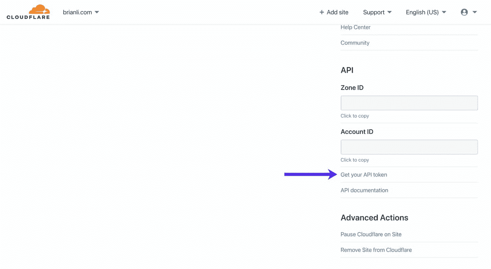

View your Cloudflare Global API Key.

向下滚动，并单击“全局 API 密钥”旁边的**视图**以获取您的 Cloudflare API 密钥。注意不要在 W3 总缓存之外的任何地方共享此 API 密钥，因为它可用于控制您的 Cloudflare 帐户。

View your Cloudflare Global API Key.

接下来，在 W3 Total Cache 的“扩展”页面中激活 Cloudflare 扩展，点击“设置”。在“凭证”部分，点击**授权**按钮。

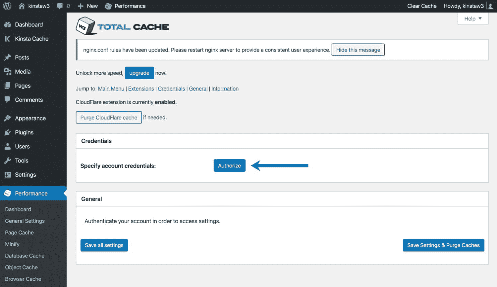

Authorize Cloudflare in W3 Total Cache.

在随后的弹出窗口中，输入您的 Cloudflare 帐户电子邮件和 API 密钥。如果您收到错误消息，请仔细检查以确保您的电子邮件地址和 API 密钥是正确的。授权凭据后，您应该会在页面上看到其他 Cloudflare 设置。

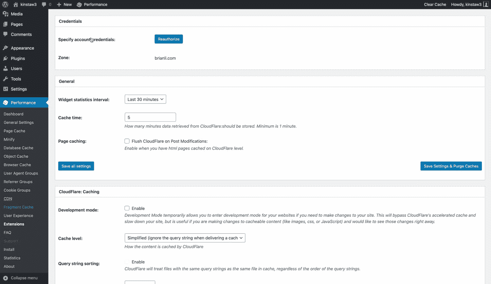

Cloudflare settings in W3 Total Cache.

让我们看看 W3 Total Cache 中的 Cloudflare 设置。

*   **Widget Statistics Interval—**这指定了 W3TC 的 Cloudflare widget 所覆盖的时间段。默认设置是 30 分钟。如果你想看更长的时间，请随意增加。
*   **缓存时间–**这指定了缓存来自 Cloudflare 的小组件数据的时间量。如果您不打算经常使用该小部件，我们建议增加该数量，以减少您的站点对 Cloudflare 的请求数量。
*   **页面缓存-**如果你已经为你的 WordPress 站点配置了 Cloudflare 来[缓存 HTML 页面，启用这个选项在 post 修改和更新后自动清除 Cloudflare 缓存。](https://kinsta.com/blog/cloudflare-settings-wordpress/#cache-html-with-a-cloudflare-page-rule)

#### Cloudflare 缓存

此部分允许您自定义 Cloudflare 的缓存设置。

*   **开发模式—**除非您需要将 Cloudflare 置于开发模式，否则请禁用此选项。当 Cloudflare 处于开发模式时，边缘缓存、缩小和映像优化将被禁用三个小时。这可以让你立即看到 CSS 和 JS 文件的更新，对于[故障排除](https://kinsta.com/blog/wordpress-errors/)非常有用。
*   **缓存级别–**对于大多数网站，我们建议使用“标准”缓存级别，它在每次查询字符串改变时提供不同的资源。如果你 100%确定你的 WordPress 站点没有使用查询字符串来提供动态内容，你也可以使用“忽略查询字符串”设置。
*   **浏览器缓存 TTL—**我们建议将 Cloudflare 的浏览器缓存 TTL 设置为 31536000 秒，等于 1 年。
*   **挑战 TTL—**cloud flare 提供各种与安全相关的服务，访客挑战就是其中之一。如果 Cloudflare 检测到恶意用户或奇怪的行为，它会以[验证码](https://kinsta.com/blog/wordpress-captcha/)的形式提供一条挑战消息。“质询 TTL”设置指定用户在完成质询后可以访问您的站点多长时间。默认设置为 3600 秒，受到挑战的访问者将能够在下一次挑战前使用您的网站 1 小时。
*   **边缘缓存 TTL–**该设置控制资产将在 Cloudflare 的[边缘服务器](https://kinsta.com/knowledgebase/edge-servers/)上缓存多长时间。我们建议将其设置为最大值 31536000 秒，即 1 年。

#### Cloudflare 内容处理

让我们深入了解 W3 Total Cache 中的 Cloudflare 内容处理设置。

*   **Rocket Loader—**cloud flare 的 Rocket Loader 加快了 WordPress 站点的 JavaScript 加载速度。如果你的网站有很多 JS，我们建议启用 Rocket Loader。
*   **缩小 JS/CSS/HTML–**如果您已经在 W3 Total Cache 中启用了 HTML、CSS 和 JavaScript 的缩小，请随意禁用 Cloudflare 扩展设置中的这些选项，因为没有必要缩小已经缩小的资产。
*   **服务器端排除(SSE)–**此选项允许您对可疑访问者隐藏敏感信息(被 Cloudflare 视为可疑)。服务器端排除对于隐藏网站上的电子邮件地址、电话号码和其他个人信息非常有用。要使用 SSE，启用它并在 HTML 代码或 PHP 主题模板的`<!--sse--><!--/sse-->`标签中包装敏感信息。
*   **电子邮件混淆–**启用此选项后，Cloudflare 将使用 JavaScript 自动混淆您的 WordPress 站点上的电子邮件地址。虽然模糊处理不会完全消除垃圾邮件，但我们建议启用此选项，因为它确实可以阻止基本的僵尸程序从您的站点抓取电子邮件地址。

#### 云耀斑图像处理

让我们检查一下 Cloudflare 的图像处理设置。

*   **热链接保护-**启用[热链接保护](https://kinsta.com/blog/hotlinking/)将阻止其他网站嵌入您的图片。如果您由于未授权的外部嵌入而遇到带宽限制，启用“热链接保护”可以帮助您减少带宽使用。
*   **Mirage(仅限专业版)–**Mirage 优化了向低带宽设备和网络的映像交付。此功能仅适用于 Cloudflare Pro plan 及更高版本。
*   **波兰语(仅限专业版)–**波兰语[优化您网站的图像](https://kinsta.com/blog/optimize-images-for-web/)，并且可以配置为向支持的浏览器提供 [WEBP 图像](https://kinsta.com/blog/webp/)。此功能仅适用于 Cloudflare Pro plan 及更高版本。

### 云闪防护

Cloudflare 的主要功能是一个复杂的防火墙，可以帮助您抵御 DDoS 攻击和恶意行为。让我们检查一下 Cloudflare 的安全设置。

*   **安全级别—**此设置控制 Cloudflare 的防火墙和安全规则的敏感度。我们建议将大多数站点的“安全级别”设置为“中”。
*   **浏览器完整性检查–**该功能可发现不良行为和可疑的用户代理。如果它检测到潜在的恶意用户或垃圾邮件发送者，Cloudflare 将自动提供质询。我们建议启用此功能。
*   **始终在线—**如果你的站点出现故障，这个选项将为你的站点提供静态 HTML 页面。如果您已经[配置了 Cloudflare 来缓存 HTML](https://kinsta.com/blog/cloudflare-settings-wordpress/#cache-html-with-a-cloudflare-page-rule) ，我们建议您启用它。
*   **Web 应用防火墙—**cloud flare 的 [WAF，或 Web 应用防火墙](https://kinsta.com/blog/what-is-a-firewall/)，将扫描传入的流量，并过滤掉到达您站点的“非法流量”。我们建议启用此功能。
*   **高级 DDoS 保护—**默认情况下，此功能处于启用状态，只要 Cloudflare 的代理处于活动状态，就无法禁用。DDoS 保护有助于保护您的网站免受[“分布式拒绝服务”攻击](https://kinsta.com/blog/what-is-a-ddos-attack/)。
*   **最大上传–**设置上传到您网站的最大允许文件大小。你要确保这个设置等于或大于你在 WordPress 中的[上传文件大小设置。](https://kinsta.com/blog/increase-max-upload-size-wordpress/)

### Cloudflare SSL

最后，您需要确保您的 Cloudflare SSL 设置配置正确。让我们在这一部分回顾一下正确的配置。

*   **SSL–**如果您的网站托管在 Kinsta 上，我们建议使用“完整”或“完整(严格)”SSL 选项。“灵活”选项与我们的基础架构不兼容。“完全严格”[需要来自有效认证机构的 SSL](https://kinsta.com/help/how-to-install-ssl-certificate/)，而“完全”选项也支持自签名 SSL。“灵活”选项不需要原始服务器上的 SSL 证书，我们不推荐这个选项，因为它是最不安全的。
*   **仅 TLS 1.2-**[TLS，或传输层安全性](https://kinsta.com/blog/tls-1-3/)，是一种通过网络传输数据的安全协议。一些 PCI 兼容标准要求放弃对 TLS 1.1 及以下版本的支持。如果这是您的站点的要求，您可以在 Cloudflare 中启用“仅限 TLS 1.2”设置，将最低 TLS 版本设置为 1.2。

建议阅读:[如何为 WordPress](https://kinsta.com/blog/cloudflare-apo-wordpress/) 设置 Cloudflare APO。

## W3 总缓存 WooCommerce 设置

WooCommerce 是 WordPress 网站最受欢迎的电子商务平台。如果你的 WooCommerce 商店使用 W3 Total Cache，你需要确保你的配置是正确的，以避免缓存客户信息。

### 绕过 WooCommerce Cookies

要绕过有 WooCommerce 专用 cookie 的页面的页面缓存，请转到 W3TC 的“页面缓存”设置，向下滚动到“拒绝的 cookie”，并添加下面的四项。

*   woocommerce_items_in_cart
*   woocommerce _ 购物车 _ 哈希
*   wp_woocommerce_session_
*   已登录

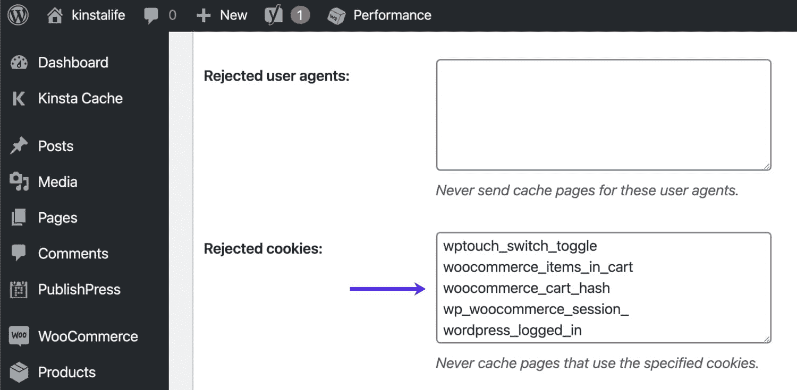

Bypass WooCommerce cookies in W3 Total Cache.

为了安全起见，我们还建议绕过 WooCommerce 特有的 URL，如购物车页面、结帐页面和帐户页面。要绕过缓存这些页面，请转到 W3TC 的“页面缓存”设置，并将 URL 添加到“从不缓存以下页面”部分。

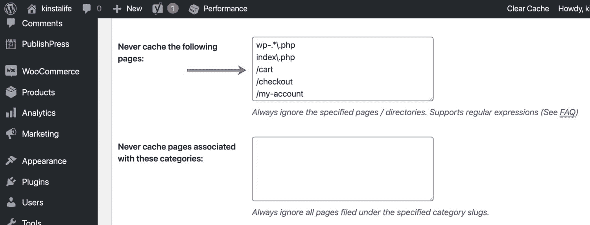

Bypass WooCommerce pages from W3 Total Cache.

## 如何重置 W3 总缓存中的所有设置

在某些情况下，您可能需要重新开始 W3TC 配置。以下是如何将 W3 总缓存恢复到默认设置。进入 W3TC 的“通用设置”菜单，向下滚动到“导入/导出设置”部分，点击**恢复默认设置**。

Reset W3 Total Cache to default settings.

[With 1 million+ active installations, W3 Total Cache is ✨popular✨ for a reason. Learn how to set it up & optimize your settings right here 👇Click to Tweet](https://twitter.com/intent/tweet?url=https%3A%2F%2Fkinsta.com%2Fblog%2Fw3-total-cache%2F&via=kinsta&text=With+1+million%2B+active+installations%2C+W3+Total+Cache+is+%E2%9C%A8popular%E2%9C%A8+for+a+reason.+Learn+how+to+set+it+up+%26amp%3B+optimize+your+settings+right+here+%F0%9F%91%87&hashtags=PageCaching%2CWordPressTips)

## 摘要

如你所见，W3 Total Cache 插件塞满了特性和设置。从页面缓存到资产缩减，再到 Cloudflare 集成，W3TC 拥有提升 WordPress 站点性能所需的一切！

在本文中，我们介绍了为 W3TC 推荐的配置插件。你有喜欢的 WordPress 优化插件吗？请在下面的评论中告诉我们！

* * *

让你所有的[应用程序](https://kinsta.com/application-hosting/)、[数据库](https://kinsta.com/database-hosting/)和 [WordPress 网站](https://kinsta.com/wordpress-hosting/)在线并在一个屋檐下。我们功能丰富的高性能云平台包括:

*   在 MyKinsta 仪表盘中轻松设置和管理
*   24/7 专家支持
*   最好的谷歌云平台硬件和网络，由 Kubernetes 提供最大的可扩展性
*   面向速度和安全性的企业级 Cloudflare 集成
*   全球受众覆盖全球多达 35 个数据中心和 275 多个 pop

在第一个月使用托管的[应用程序或托管](https://kinsta.com/application-hosting/)的[数据库，您可以享受 20 美元的优惠，亲自测试一下。探索我们的](https://kinsta.com/database-hosting/)[计划](https://kinsta.com/plans/)或[与销售人员交谈](https://kinsta.com/contact-us/)以找到最适合您的方式。</kinsta-advanced-cta></kinsta-advanced-cta></kinsta-auto-toc>