# 更新 woo commerce:2022 年安全深入指南

> 原文:[https://kinsta.com/blog/woocommerce-update/](https://kinsta.com/blog/woocommerce-update/)

更新你的 [WooCommerce 商店](https://kinsta.com/blog/woocommerce-tutorial/)是一件严肃的事情，因为你可能会破坏一些功能，这可能会对你的底线或你的网站的工作方式产生负面影响。

当 WooCommerce 更新时，店主们有四种想法:

*   牛仔:这些店主不假思索地点击了“更新”。然后他们的商店在他们周围轰然倒塌。
*   沙发土豆:那些完全忽视更新的人，视其为不存在。
*   这些店主有这么多过时的插件和主题，因为他们害怕尝试更新会发生什么。
*   **特立独行的人:**最后，这些店主会定期进行备份，在临时网站上测试 WooCommerce 的新版本，然后毫无问题地更新他们的实时网站。

理想状态下，每个人都应该特立独行。还好，做一个不难！有了合适的工具、可靠的测试清单和一些自动化，您就可以开始让您的 WooCommerce 网站保持最新并始终平稳运行。

在这篇文章中，我们将从头到尾向你介绍如何执行一个安全的 WooCommerce 更新，包括使用什么工具和一个大的测试和更新清单。

请记住，你的最终目标是增加商店的收入。所以一定要下载我们的免费电子书**， [10 种提高你的网络商务产品页面转化率的方法](https://kinsta.com/ebooks/wordpress/ecommerce-conversion-rate/?utm_source=Blog&utm_medium=Link&utm_campaign=WooCommerce+Conversions+Ebook)。**

 **准备好开始了吗？那就让我们开始吧！

 ## 现在投资一点时间，为以后节省大量时间(和焦虑)

在我们开始之前，最佳实践告诉我们，在没有彻底测试任何新版本之前，永远不要更新你的站点，尤其是 WooCommerce。这适用于主要版本、次要版本和补丁版本——没关系。

> 需要在这里大声喊出来。Kinsta 太神奇了，我用它做我的个人网站。支持是迅速和杰出的，他们的服务器是 WordPress 最快的。
> 
> <footer class="wp-block-kinsta-client-quote__footer">
> 
> 
> 
> <cite class="wp-block-kinsta-client-quote__cite">Phillip Stemann</cite></footer>

[View plans](https://kinsta.com/plans/)

你必须愿意现在花一点时间来节省以后的大量时间。

你不需要马上点击“更新”按钮。给你自己一些时间，确保你明白将会发生什么变化，最重要的是，它们会如何影响你网站上的其他东西。只要仔细阅读你想更新的 WooCommerce 版本中的新功能，就能帮助你了解你需要准备些什么。

为了客观地看待事物，并理解事物有多容易崩溃，请从插件或主题开发者的角度考虑一下:因为 WooCommerce 核心和 WordPress 核心都需要向后兼容。现在，想想你或者你的客户站点正在使用的插件数量。WooCommerce 更新破坏某些功能的可能性有多大？嗯，我想你已经知道答案了:极有可能。

这就是为什么在 WooCommerce 更新公告之后，在更新 WooCommerce 之前回顾一下变更日志和[WordPress.org 支持论坛](https://kinsta.com/blog/wordpress-support/#official-sources)总是有好处的。**如果某个更新有问题，99%的情况下会是别人先发现这个问题，这样可以节省你大量的时间，也省去了你自己处理问题的麻烦。**

在你更新你的网站之前，不立即将 WooCommerce 更新推送到你的网站并等待插件/主题作者发布他们自己的 WooCommerce 相关产品的更新也是很常见的。所以耐心并花时间检查兼容性真的会有回报。

[说到更新你的 WooCommerce 网站，你的操作方式如何🤠牛仔，🥔电视迷，🙀受惊的猫，或者😎特立独行的人？点击查看你是哪种类型的店主👇 点击推文](https://twitter.com/intent/tweet?url=https%3A%2F%2Fbit.ly%2F3mpNhVK&via=kinsta&text=When+it+comes+to+updating+your+WooCommerce+site%2C+do+you+operate+like+%F0%9F%A4%A0+the+Cowboy%2C+%F0%9F%A5%94+the+Couch+Potato%2C+%F0%9F%99%80+the+Scaredy-Cat%2C+or+%F0%9F%98%8E+the+Maverick%3F+Click+to+see+which+type+of+store+owner+you+are+%F0%9F%91%87&hashtags=WooCommerce%2CEcommerce)

## 开始使用您的 WooCommerce 更新

接近 WooCommerce 更新有四个基本阶段，每个阶段都有自己的步骤。我们保证，当你完成一次后，每一次都会变得更快更容易！我们将带您经历更新 WooCommerce 的以下四个阶段:

 ### 更新 WooCommerce:获得正确的工具

让我们面对现实吧:手动测试 WooCommerce 既繁琐又耗时。正是因为这些原因，很多人根本不这样做，或者当他们这样做时，他们没有正确地测试，并且错过了他们网站上的错误。

幸运的是，有一些工具可以帮助加速测试过程，让测试变得不那么无聊。经过多年来无数次测试 WooCommerce 更新，这些是我们推荐的工具。让我们仔细看看每一个。

#### 暂存站点

这是没得商量的。你不应该在 WooCommerce 新版本发布后立即更新你的 live 站点。

暂存站点提供了一个安全的测试环境，在这里您可以自由地破坏东西(通常没有任何后果)。在那里，你可以运行 WooCommerce 更新，测试新版本，并在更新你的 live 站点之前看看你的站点会有什么反应。

如果你没有中转网站，Kinsta 可以帮助你——我们为每个网站提供免费的[中转环境](https://kinsta.com/wordpress-staging/),如果一个不够，还可以提供多达五个附加的[高级中转环境](https://kinsta.com/help/premium-staging-environments/)。

#### 视觉比较工具

你如何知道你的网站在 WooCommerce 更新后是否发生了变化？如果你运行一个有几十个页面的大型网站，跟踪格式上的小变化，甚至是已经停止显示的[小部件](https://kinsta.com/blog/wordpress-widgets/)都需要时间。

有了像 [WP Boom](https://www.wpboom.com/) 这样的视觉比较工具，我们将在本教程中使用，你可以给你的网站拍一张快照，点击“更新”，然后拍第二张快照，这样你就可以很快看到有什么变化:

WP Boom

需要指出的是，视觉上的改变并不一定意味着你的网站的某些功能被破坏了，只是它可能会被破坏。

#### 端到端测试工具

虽然视觉比较工具可以帮助您快速发现网站的格式和设计的变化，但端到端测试工具走得更远。他们测试你的网站的实际功能，并在某些东西不工作时提供更多的确定性。

点击你的站点来完成测试，像[添加一个商品到购物车和检查](https://kinsta.com/blog/shopping-cart-abandonment/)，需要时间。如果你之前已经测试过上百次 WooCommerce 更新，这些任务很快就会过时。

借助端到端测试工具，您可以自动完成这一过程。

随着[机器人忍者关闭](https://robotninja.com/blog/robot-ninja-is-shutting-down/)，我们将在本教程中向你展示如何使用两种不同的工具。

第一个是[幽灵探长](https://ghostinspector.com/):

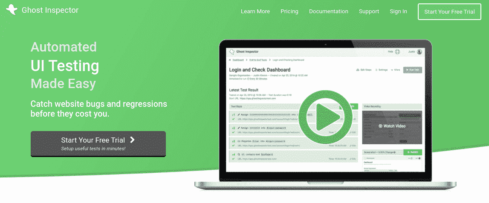

Ghost Inspector

您可以尝试的第二个端到端测试工具是 [Usetrace](https://usetrace.com/) :

Usetrace

这是 WooCommerce 的另一个自动化端到端测试工具，你可以在舞台和现场使用。我们将在本文的后面介绍如何设置这两者。WooCommerce 也有一些 [E2E 测试](https://github.com/woocommerce/woocommerce/wiki/End-to-end-Testing)，如果你是一个更像[的开发者](https://kinsta.com/blog/hire-wordpress-developer/)，你可以通过这些测试。

#### 备份工具

你应该定期备份你的网站。如果你对数据库备份感兴趣，我们推荐 [WP Migrate DB Pro](https://kinsta.com/blog/wordpress-migration-plugins/#WP-Migrate-DB) ，或者简单地使用 [WP-CLI](https://kinsta.com/blog/wp-cli/) 运行快速导出。

如果您使用 Kinsta，我们为您的所有计划提供[自动每日备份](https://kinsta.com/help/wordpress-backups/)、手动备份点和备份保留:

MyKinsta backups

一旦你准备好了合适的工具，就该做些准备了。

### 更新 WooCommerce:准备(7 步清单)

如果你想让你的 WooCommerce 更新顺利进行，你需要做一些准备。这需要做一些工作，但是在你做了一次准备之后，下次你更新的时候会更容易填充空白并且做得更快。下面是我们推荐的七个准备步骤。

#### 第一步:重新熟悉你正在更新的网站

如果你不确定你的网站应该如何运作(例如，如果它是一个新客户的网站)，做些笔记。这将有助于减轻你的焦虑，如果你在更新后对网站的工作方式感到困惑的话(这比你想象的更经常发生)。

我还建议列出你网站(和客户)的关键网址和功能。这应该包括你网站上的重要页面，比如你的主页、[类别和产品](https://kinsta.com/learn/woocommerce-guide/#high-quality-product-images)、【我的账户】、购物车和[结账页面](https://kinsta.com/learn/woocommerce-guide/#optimize-checkout-process)。

#### 步骤 2:验证您的备份是最新的

如果您的备份不是最新的，现在是运行另一个备份的时候了。重新熟悉您的备份工具。最重要的是，检查它是否正常工作，并确保你知道如何[恢复到你的站点](https://kinsta.com/blog/restore-wordpress-from-backup/)之前的快照。

#### 第三步:安装 WP 吊杆

安装这个工具只需要一分钟。如果你的记忆和笔记不好(我们都可能犯错误)，WP Boom 可以通过你的网站截图来帮助填补空白。把它们想象成减肥宣传中的“之前”照片。

您需要从拍摄第一个站点快照开始，这样您就有了一个临时站点更新前的可视基线记录。

它通常不能对结账(你的购物车中需要一些产品)和受保护的页面进行截图，但这是下一代工具可以帮助的地方。

**注意:**在这篇文章的后面，我们将带你了解如何设置和使用 WP Boom。

#### 步骤 4:设置您的自动化测试工具

如果你手动测试 WooCommerce，这是你需要列出一系列测试场景的部分:比如，打开你的网站，把一个产品添加到购物车，去结账，输入支付信息，等等。

幸运的是，Ghost Inspector 和 Usetrace 都可以自动为您完成所有这些工作。我们稍后将解释如何设置这两个工具。

#### 步骤 5:确定你的站点中你想要测试的任何其他部分

下一步是根据您之前创建的关键 URL 和功能列表，确定您的站点中您想要测试的任何其他部分。这可能是像[联系人表单](https://kinsta.com/blog/wordpress-contact-form-plugins/)和弹出窗口这样的功能，或者是像幻灯片和[图库](https://kinsta.com/blog/wordpress-photo-gallery-plugins/)这样的元素。

您可以手动测试这些东西，或者如果您更注重技术，您也可以尝试自动化这一步骤。

#### 第六步:看看你正在升级的 WooCommerce 版本有什么新内容

查看您正在更新的 WooCommerce 版本中有哪些新的更新和功能也是一个不错的主意。更具体地说，检查你的[插件](https://kinsta.com/best-wordpress-plugins/)和[主题](https://kinsta.com/best-wordpress-themes/)是否与之兼容。

还是那句话，不如现在花点时间给自己省点时间，省得以后焦虑。我们建议查看 WooCommerce.com 的发布公告、变更日志、GitHub 问题以及 [WordPress 支持论坛](https://kinsta.com/blog/wordpress-support/#forums-groups-and-channels)。

#### 步骤 7:将您的实时站点克隆到您的临时环境中

如果你正在使用任何以分期模式为特色的插件，比如 [WooCommerce 订阅](https://kinsta.com/blog/woocommerce-subscriptions/)，打开它们或者干脆禁用它们。同样，你会想要禁用电子邮件。

然后，仔细检查以确保您的试运行环境尽可能地模拟您的实际站点。我们还建议在这一点上启用 [WordPress 调试模式](https://kinsta.com/blog/wordpress-debug/),以帮助以后解决问题。

**重要提示:**在你把你的网站推向试运行后，你不想失去任何可能到来的订单。为了避免这种情况，我们建议将你的 WooCommerce 商店设置为[维护模式](https://kinsta.com/blog/wordpress-maintenance-mode/)。这将确保在您执行更新和测试时不会下订单。

### 更新 WooCommerce:更新和测试你的筹备网站(7 步清单)

现在，您已经准备好了，接下来是有趣的部分:更新您的登台站点。分期网站最棒的一点是，即使你的网站崩溃了也没关系，因为它只是一个副本。让我们来看看这部分流程涉及的步骤。

#### 第一步:用 WP Boom 给你的网站拍快照

你要做的第一件事就是用 WP Boom 给你的网站拍一张快照。这将为您提供临时站点更新前的直观基线记录。

#### 步骤 2:运行您的测试工具，并确保您的测试通过

正如我们前面提到的，您可以使用一个端到端的测试工具，比如 Ghost Inspector 或者 Usetrace 来自动化您的测试。在本文的后面，我们将带您了解如何使用这两种工具运行测试，并检查以确保测试通过。

#### 步骤 3:更新你的插件和主题

在准备阶段，我们提到要检查你的插件和主题是否与你升级到的最新版本的 WooCommerce 兼容。如果你发现你的插件或主题已经过时，不再与 WooCommerce 的最新版本兼容，现在是时候把它们更新到一个兼容的版本了。

#### 步骤 4:在你的暂存站点上更新 WooCommerce

一旦你更新了你的插件和主题，确保不会有任何兼容性问题，你就可以把你的临时站点更新到 WooCommerce 的最新版本了。更新你的临时站点可以让你在把 WooCommerce 更新推送到你的实时站点之前，发现任何潜在的错误。

#### 步骤 5:检查日志中的错误

更新完你的插件、主题和 WooCommerce 后，明智的做法是[检查你的日志，寻找这些更新导致的任何错误](https://kinsta.com/knowledgebase/wordpress-error-log/)。快速浏览一下，确保你仍然可以访问你的主页和[管理区](https://kinsta.com/knowledgebase/wordpress-admin/)。

如果你得到一个[白屏死机](https://kinsta.com/blog/wordpress-white-screen-of-death/)或者陷入其他一些不可恢复的情况，现在是一个好时机[恢复到你的站点以前的快照](https://kinsta.com/blog/downgrade-wordpress/)。你可以自己解决问题，也可以寻求帮助。

#### 步骤 6:拍摄第二个快照来比较更改

如果到目前为止一切顺利，再次运行 WP Boom 并获取第二个快照。比较前后的快照，查看有哪些变化。

 ## 注册订阅时事通讯

### 想知道我们是怎么让流量增长超过 1000%的吗？

加入 20，000 多名获得我们每周时事通讯和内部消息的人的行列吧！

[Subscribe Now](#newsletter)

WP Boom 的伟大之处在于，它会告诉你自上次快照以来，你的网站发生了多大的变化。

例如，两组快照之间可能有 7%的视觉变化。虽然这并不一定意味着你的网站崩溃了，但这可能意味着你需要 T2 调整一些风格。

#### 第 7 步:运行 Ghost Inspector 或再次使用 trace 来确保一切正常工作

接下来，使用 Ghost Inspector 或 Usetrace(或您选择的任何端到端测试工具)运行另一个测试，以确保您的结账流程处于正常工作状态。您还可以对网站上的任何其他功能执行手动或自动检查，例如联系人表单。

如果有任何事情不像你预期的那样工作，现在是时候报告和/或修复它了。

如果您的站点上运行了[自定义代码(即不是由第三方插件/扩展开发者维护的代码)，您将需要修复它，并确保在运行更新之前或之后将修复应用到您的活动站点(取决于问题)。](https://kinsta.com/knowledgebase/edit-wordpress-code/)

[版本控制](https://kinsta.com/blog/wordpress-version-control/)，**比如让你的站点在 Git 中，可以帮助你更好地管理变更。**您在哪里报告错误将取决于您使用的插件和您的支持安排。从这里开始，你要么等待你的插件/主题的新版本，然后再次尝试这个过程，要么自己动手修复并更新你的代码。

好消息是，**你的 live 网站没有被破坏，你的客户仍然可以购买**。另外，你可以根据需要花时间重复这个过程，直到你觉得一切都如预期的那样顺利。

### 更新 WooCommerce:更新和测试你的网站(8 步清单)

一旦您更新了您的临时站点并使其顺利工作，修复了任何损坏的功能并排除了所有错误，您就可以更新您的实时站点了。

让我们来看看更新你的在线 WooCommerce 站点的步骤，其中许多步骤与你在测试你的临时站点时执行的步骤相似。

#### 步骤 1:备份您的实时网站

第一步是备份您的实时网站。确保你不会错过这一步很重要。如果您是 Kinsta 用户，您有多种备份选项可供选择。不过，你也可以使用一个[备份插件](https://kinsta.com/blog/wordpress-backup-plugins/)。

#### 第二步:给你的网站再拍一张快照

接下来，你会想用 WP Boom 给你的网站再拍一张快照。这为你提供了一个可视化的基线记录，你的现场，更新前。

#### 步骤 3:运行 Ghost Inspector 或 Usetrace，并确保您的测试通过

同样，您可以使用 Ghost Inspector 或 Usetrace 来完成这项工作，这取决于您是希望使用 Chrome 扩展还是在线工具来记录您的测试。这为您的站点预更新提供了另一个基线。

#### 步骤 4:同步并实时推送您的更改

接下来，根据您的临时和实时环境的工作方式，您可能只需要在临时和实时站点之间同步更改。或者，你可能不得不再次更新你的插件和代码。

如果你和 Kinsta 在一起，你可以[一键推送实时更改](https://kinsta.com/help/push-staging-live/):

The MyKinsta push staging to live option

记得首先将你的 WooCommerce 商店退出维护模式。

#### 步骤 5:检查日志中的错误

完成更新同步后，请再次检查错误日志，了解可能因此而出现的任何问题。验证您仍然能够访问主页和管理区。

与暂存站点一样，如果您出现白屏死机或遇到另一种不可恢复的情况，最好恢复到您站点之前的快照，并进行一些故障排除或[寻求帮助](https://kinsta.com/blog/wordpress-support/)。

#### 第六步:用 WP Boom 再拍一张快照

接下来，再次运行 WP Boom，这样你就有了第二组快照。比较之前和之后的快照，查看是否有任何更改。

#### 第 7 步:再次运行 Ghost Inspector 或使用 trace 来确认站点工作正常

同样，您可以使用您的自动化工具运行另一个测试，并确保一切正常工作。此时，您还可以对站点上的其他功能执行任何其他手动(或自动)检查，例如联系人表单。

如果您在更新您的登台站点时处理并修复了任何问题，例如冲突的插件代码和您自己的自定义代码，那么在此阶段应该不会有太多问题(如果有的话)需要修复。

你的电子商务网站需要一个超快的、可靠的、完全安全的主机吗？Kinsta 提供所有这些服务，并由 WooCommerce 专家提供 24/7 的世界级支持。[查看我们的计划](https://kinsta.com/plans/?in-article-cta)

#### 第八步:做最后的目视检查

你差不多完成了。剩下唯一要做的就是仔细检查你的关键 URL 列表和功能，确保一切正常。

如果一切顺利，那就这样吧！您的 WooCommerce 更新现已上线。

## WP Boom 入门

[WP Boom](https://www.wpboom.com/) 是为 WordPress 打造的可视化测试和比较工具。设置完成后，您可以比较网站更新前后的屏幕截图，并在自动更新导致网站发生视觉变化时收到提醒:

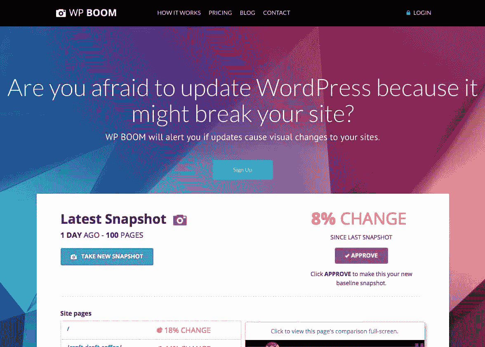

WP Boom

要开始使用 WP Boom，请注册一个免费帐户。输入您的电子邮件和密码后，会弹出一个模式，要求您连接一个新站点:

The WP Boom sign-up form

一旦您输入详细信息并点击**创建网站**，WP Boom 将开始拍摄您网站的第一张快照。这将需要一两分钟的时间，取决于您的站点包含的页面数量:

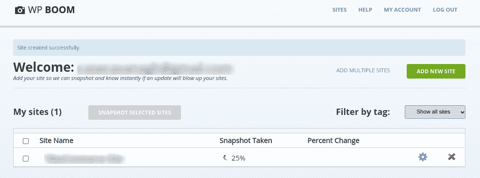

A WP Boom snapshot

完成此过程后，页面将会刷新。当您点击您的网站名称时，您将看到您的快照的概述，包括拍摄时间和您的网站上有多少页面:

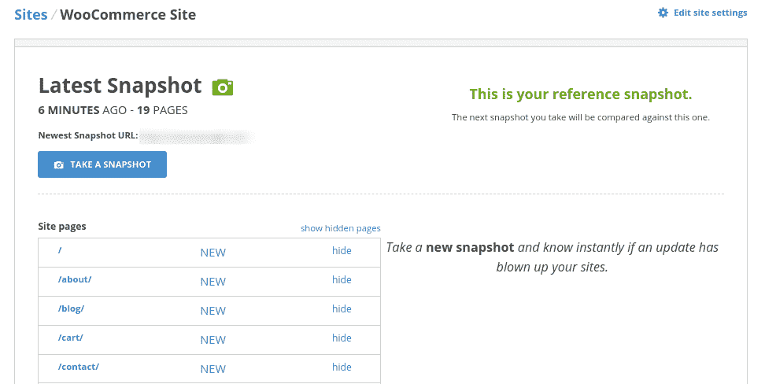

A WP Boom latest snapshot

当您准备好拍摄第二张快照时，只需返回 WP Boom 仪表板，选择您想要拍摄快照的站点，然后单击**拍摄选定站点的快照**。

WP Boom 包括的其他一些不错的功能是可以安排每周快照和电子邮件报告，详细说明你网站上的任何视觉变化。如果你管理大量的网站并且有自动更新功能，这是很有用的。

## 自动化测试工具:Ghost Inspector 和 Usetrace

重要的是，在更新后，测试并确保整个 WooCommerce 网站的功能正常工作，而不仅仅是你的结账过程。

毕竟，如果一个客户填写了一份[联系表](https://kinsta.com/blog/wordpress-contact-form-plugins/)或者试图使用[实时聊天](https://kinsta.com/blog/wordpress-live-chat-plugin/)，而这些功能都被破坏了，如果你没有测试过，你怎么知道呢？

运行手动测试很容易:只需点击你的站点，填写表格，使用你的实时聊天窗口。

为了帮助自动化这一过程，您可以首先列出关键功能的列表，以及如何手动执行测试的说明(例如，“打开网站，导航到联系页面，填写表格等。”).这将确保您在进行手动测试时不会遗漏任何东西。

如果您更喜欢自动化这个过程，希望对您的自动化测试有更多的控制，或者有一个高度定制的站点或功能，我们建议您查看 Ghost Inspector 和/或 UseTrace。

如果你不熟悉 PHP，也不想乱搞脚本和代码，这两个都是很好的选择。这些选项为自动化您的检验测试提供了相似的特性。

最终，你选择哪一个将取决于你是想使用一个 Chrome 扩展还是一个在线工具来记录你的测试。或者，如果你是一名开发人员，并且喜欢弄脏自己的手， [Codeception](https://codeception.com/) 对开发人员来说是一个很好的选择。

### Ghost Inspector 入门

Ghost Inspector 是一个工具，你可以用它来自动测试你的 WooCommerce 网站，并确保它正常工作。最好的部分是，你不需要任何编程或测试经验来使用它。

Ghost Inspector 的工作原理是在你的浏览器中添加一个 Chrome 或 [Firefox 扩展](https://kinsta.com/blog/firefox-extensions/)。然后扩展记录你的站点并自动运行测试。

要开始，请访问 [Ghost Inspector 网站](https://ghostinspector.com/)并点击**开始您的免费试用**。在表格中输入您的信息，然后选择**创建账户**:

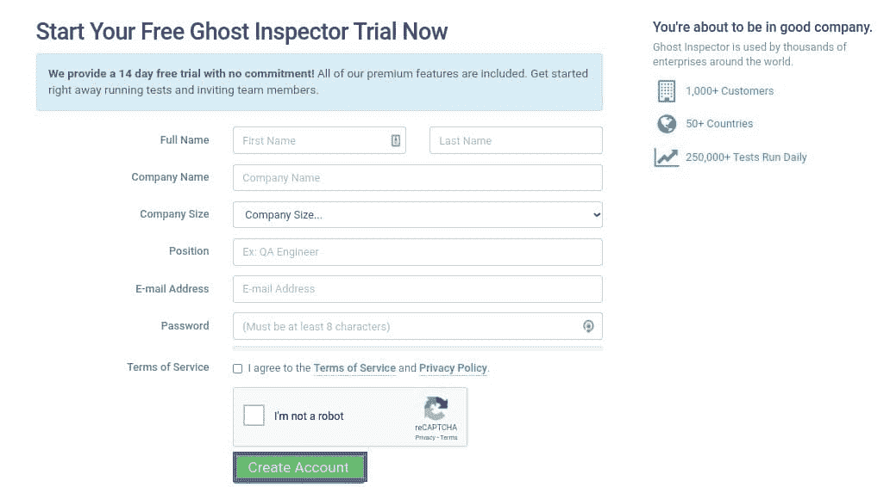

The Ghost Inspector sign-up page

这将把您重定向到欢迎页面。在底部，点击**安装测试记录器**按钮:

Installing the Ghost Inspector test recorder

这将在一个新的浏览器标签中打开 Chrome 网络商店。选择**添加到 Chrome** :

Adding the Ghost Inspector Chrome extension

Ghost Inspector 扩展将自动添加到您的浏览器中，显示在右上角。第一次单击它时，它会要求您使用您的凭据登录:

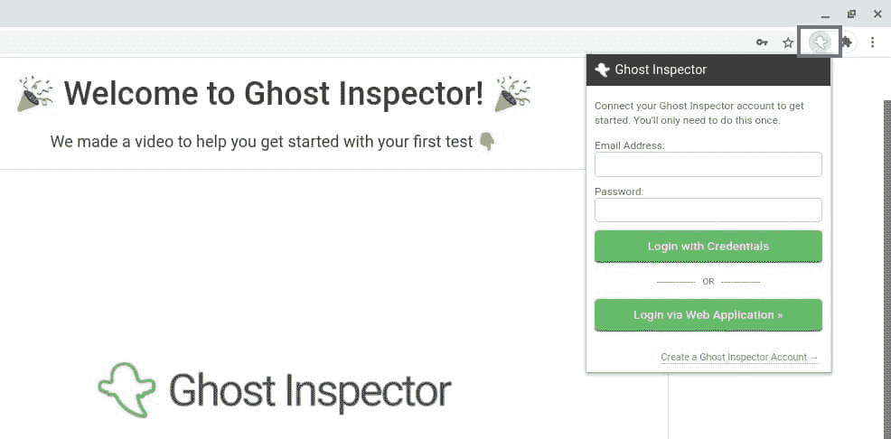

Logging in to the Ghost Inspector Chrome extension

刷新您的浏览器。当你准备好运行测试时，访问你的 WooCommerce 网站(确保你已经退出)，然后点击浏览器扩展。

在下拉菜单中，选择“创建新测试”选项，然后点击**开始记录**按钮:

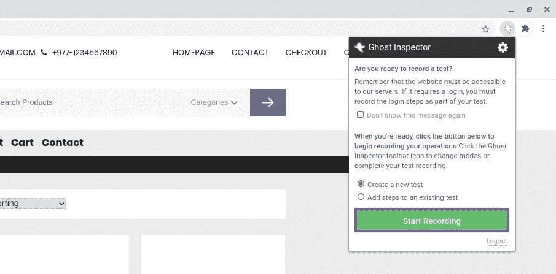

The Ghost Inspector ‘start recording’ button

当您运行和测试您的网站，鬼督察将记录您的所有行动。完成后，再次点击扩展，然后点击**我已完成录制**:

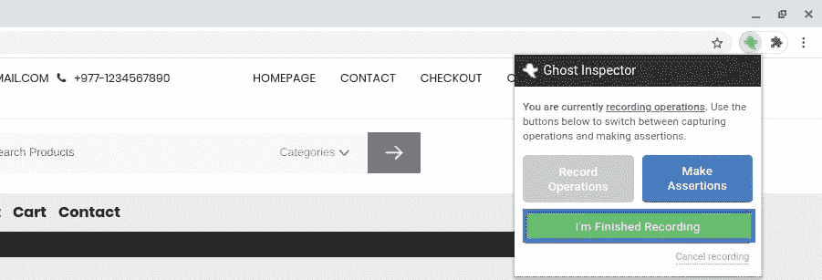

The Ghost Inspector ‘finished recording’ button

然后，您可以命名并保存您的测试。如果您选择**查看我的测试**，它会将您带到 Ghost Inspector 仪表板:

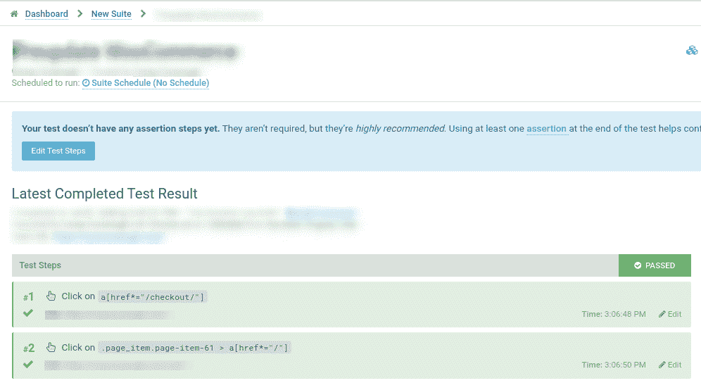

The Ghost Inspector dashboard

在这里您可以查看测试的所有细节。您将看到所涉及步骤的列表，并可以选择编辑它们。它会告诉你测试是否通过，如果没有，哪些步骤需要你的注意。更多详细信息，请查看 [Ghost Inspector 文档](https://ghostinspector.com/docs/)。

### Usetrace 入门

如果你想使用一个不特定于任何浏览器的自动化测试工具，你可能想使用 Usetrace。使用此工具，您可以通过使用在线编辑器记录您的工作流程来创建“跟踪”。然后你可以用它们来自动测试你的站点。

要开始，请访问[use trace 网站](https://usetrace.com/)并点击**注册并立即开始测试**。创建帐户后，您将被重定向到 Usetrace 仪表板。选择**开始创建新的轨迹**:

The Usetrace dashboard

左边的窗口是您的跟踪步骤和设置。右边是您正在测试的站点。首先，点击**记录步骤**:

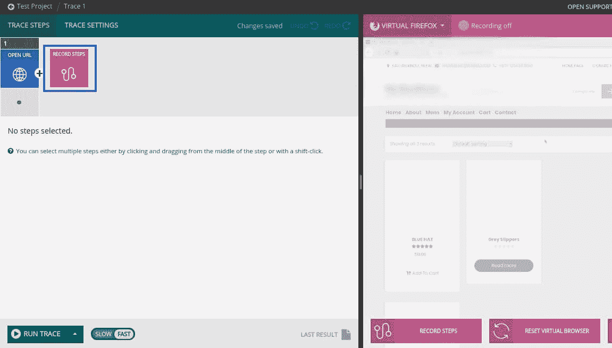

Recording trace steps

该计划将开始记录您的网站互动。每当你采取一个动作，比如添加一个商品到你的购物车或者填写一个联系表单，它会在左边的跟踪步骤中添加一个检查点。

完成后，点击**保存步骤**按钮:

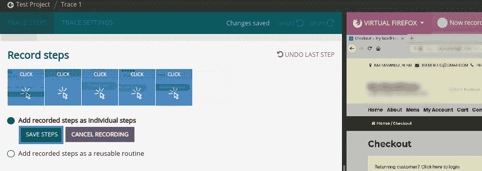

A Usetrace test

要运行整个跟踪以确认一切正常，选择左下角的**运行跟踪**:

The Run Trace button in Usetrace

完成后，您应该会看到一条成功消息:

A Usetrace success message

您可以点击**详情**了解每个步骤的更多信息，或者如果您完成了，选择**确定**。如需更详细的指导和说明，请随意参考 [Usetrace 文档](https://intercom.help/usetrace/en/)。

[Do the words 'WooCommerce site update' make you nervous? 😅 Learn how to complete the process safely and easily with this guide!Click to Tweet](https://twitter.com/intent/tweet?url=https%3A%2F%2Fbit.ly%2F3mpNhVK&via=kinsta&text=Do+the+words+%27WooCommerce+site+update%27+make+you+nervous%3F+%F0%9F%98%85+Learn+how+to+complete+the+process+safely+and+easily+with+this+guide%21&hashtags=WooCommerce%2Cwebdev)

## 摘要

有了正确的工具、一些准备时间和一份可靠的清单，测试和实现 WooCommerce 更新应该没有问题。为了消除对更新 WooCommerce 的焦虑，重要的是揭开这个过程的神秘面纱，我们在这里已经做到了。希望这个指南为你的 WooCommerce 网站保持最新提供了一个坚实的基础。

我们还应该强调，测试你的商店的[交易电子邮件](https://kinsta.com/help/transactional-email/)也很重要，但这是一个完全不同的旅程。

*现在，回到你的问题:你在更新 WooCommerce 和 WordPress 时使用可视化或截图工具吗？您还使用哪些其他工具和工作流程进行更新？在下面的评论中与我们分享吧！*

* * *

让你所有的[应用程序](https://kinsta.com/application-hosting/)、[数据库](https://kinsta.com/database-hosting/)和 [WordPress 网站](https://kinsta.com/wordpress-hosting/)在线并在一个屋檐下。我们功能丰富的高性能云平台包括:

*   在 MyKinsta 仪表盘中轻松设置和管理
*   24/7 专家支持
*   最好的谷歌云平台硬件和网络，由 Kubernetes 提供最大的可扩展性
*   面向速度和安全性的企业级 Cloudflare 集成
*   全球受众覆盖全球多达 35 个数据中心和 275 多个 pop

在第一个月使用托管的[应用程序或托管](https://kinsta.com/application-hosting/)的[数据库，您可以享受 20 美元的优惠，亲自测试一下。探索我们的](https://kinsta.com/database-hosting/)[计划](https://kinsta.com/plans/)或[与销售人员交谈](https://kinsta.com/contact-us/)以找到最适合您的方式。**