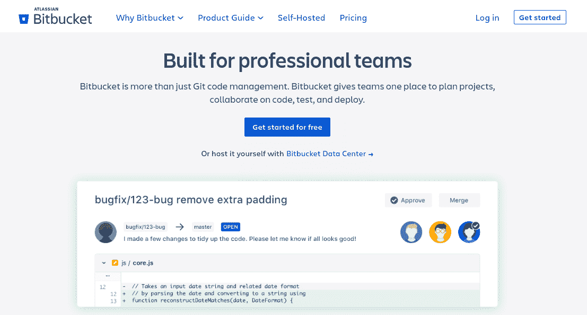
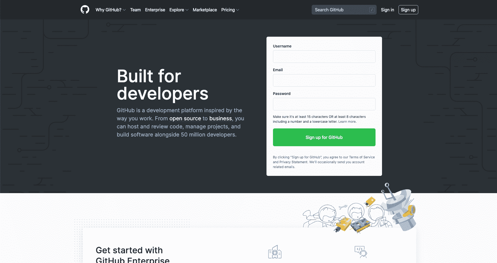
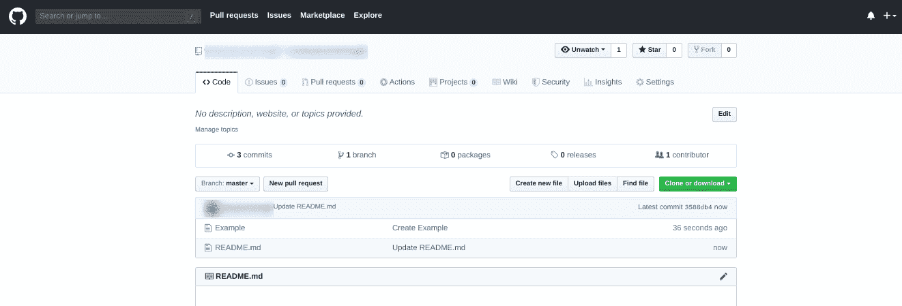
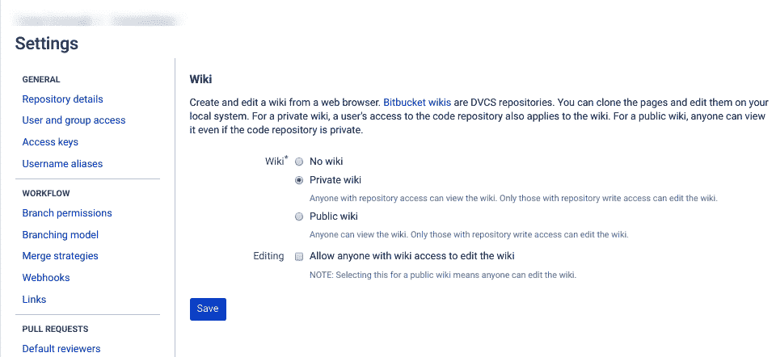
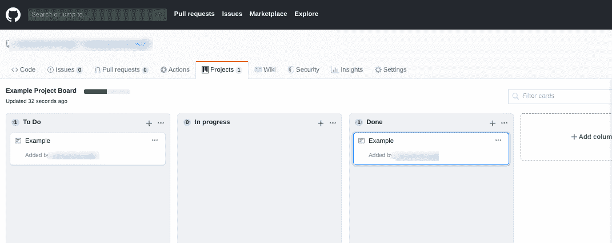
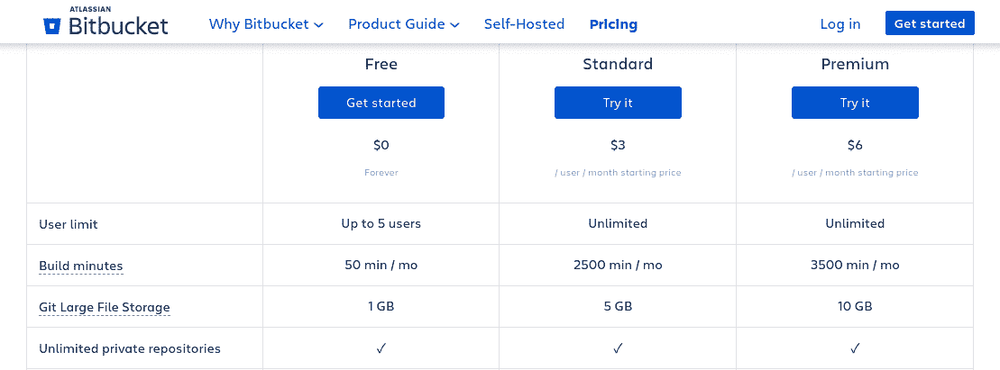
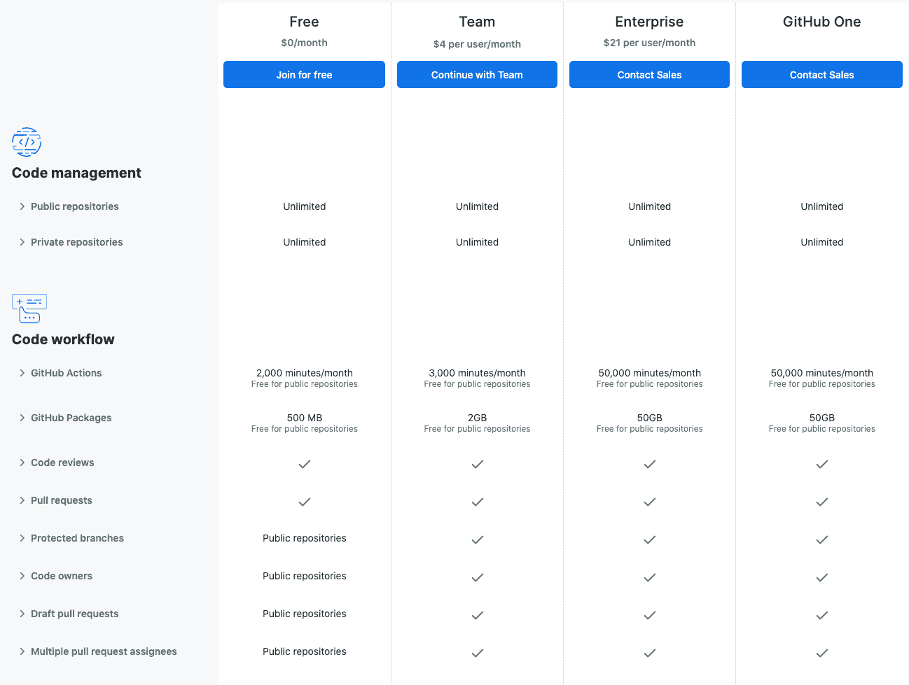

# Bitbucket vs GitHub:哪个代码库更适合你的开发项目？

> 原文:[https://kinsta.com/blog/bitbucket-vs-github/](https://kinsta.com/blog/bitbucket-vs-github/)

选择存储库托管服务是一个重大决定。如何托管代码是您工作的一个重要部分，并影响您的生产率。因此，您需要确保选择最有利于您(和您团队)特定需求和目标的平台。

如果你像大多数开发人员一样，你可能会使用 Git 作为你的[版本控制系统(VCS)](https://kinsta.com/blog/wordpress-version-control/) 。然而，决定在哪里托管源代码可能是一个挑战。最受欢迎的两个选项是 Bitbucket 和 GitHub，但是你如何决定哪一个适合你呢？

在这篇文章中，我们将讨论选择正确的代码库的重要性。然后我们再来看 Bitbucket vs GitHub，看两者对比如何。

我们开始吧！

## 为什么选择正确的代码库系统对开发人员很重要

您的存储库托管服务是增强您的 VCS 的第三方应用程序(在大多数情况下是 Git T1)。您使用的代码存储库在您的开发工作流程中起着关键的作用。

例如，它会影响您与团队中其他成员的协作能力，以及该过程的效率。它还会影响您如何度量、监控和管理您的项目。每个代码库系统都有其优点和缺点。比较它们时，有几个重要的考虑因素需要考虑，包括:

*   VCS 支持
*   协作者访问
*   界面和可用性
*   扩展和第三方集成
*   定价计划

另一个需要考虑的主要因素是，您是在寻找公共存储库还是私有存储库。某些平台更适合一种或另一种用例，因此提前知道您将需要什么非常重要。

Bitbucket 和 GitHub 是源代码存储库的两个最受欢迎的选择。虽然它们在许多方面是相似的，但是在决定哪个选项最适合您的开发项目需求之前，有一些关键的差异值得考虑。

## Bitbucket 和 GitHub 简介

Bitbucket 和 [GitHub](https://kinsta.com/knowledgebase/what-is-github/) 是托管平台，为[开发者](https://kinsta.com/blog/hire-wordpress-developer/)提供公共和私有存储库。在功能上，Bitbucket 和 GitHub 的运行方式非常相似。使用这两个工具，您可以执行基本命令，例如:

*   创建和管理存储库
*   使用[双因素认证(2FA)](https://kinsta.com/blog/wordpress-two-factor-authentication/) 登录
*   提出拉取请求
*   [进行代码评审](https://kinsta.com/blog/code-review-tools/)
*   使用内嵌编辑和降价支持
*   执行问题跟踪

然而，为了真正理解这两个平台，有必要仔细看看它们各自带来了什么。

### 比特桶概述

Bitbucket 是一个版本控制库托管服务，创建于 2008 年，由 [Atlassian](https://www.atlassian.com/) 所有。这个 Git 存储库管理解决方案是用 Python 编写的，并使用[Django web 框架](https://www.djangoproject.com/)构建:

The Bitbucket website home page

Bitbucket 的主要吸引力之一是它在 VCS 支持方面提供了内置的灵活性。它还为 Mercurial 和 Git 提供了无限的私有代码库。

额外的位存储桶特性包括:

*   直接与吉拉，竹，坩埚，和詹金斯集成
*   能够从 Git、Codeplex、GoogleCode 和 SVN 导入回购协议
*   对 GitHub、Google、[脸书](https://kinsta.com/blog/facebook-statistics/)和 [Twitter](https://kinsta.com/blog/twitter-marketing/) 的外部认证支持
*   与 [Trello](https://kinsta.com/blog/trello-vs-asana/) 的深度整合
*   一个 Mac 和 Windows 客户端( [Sourcetree](https://www.sourcetreeapp.com/) )和一个 Android 应用(Bitbeaker)

虽然您可以使用 Bitbucket 来托管开源存储库，但它主要面向开发私有代码的企业。Bitbucket 的另一个独特的好处是，它为你的代码提供了一个[安全平台](https://kinsta.com/blog/wordpress-security/)和 [Soc 2 Type 2 认证](https://www.evariant.com/faq/what-is-soc-2-type-II-certification)。

### GitHub 概述

可以说 GitHub 是最受欢迎的开发平台，提供了最大的编码社区之一。它在全球拥有超过 4000 万用户和 1 亿个仓库，被广泛认为是 Git 版本控制的*中心，也是这个星球上最大的源代码主机:*

The GitHub website home page

GitHub 是开源的知识库托管服务，2004 年开始，[2018 年](https://blogs.microsoft.com/blog/2018/06/04/microsoft-github-empowering-developers/)被微软收购。它是用 Ruby 和 Erlang 编写的，主要关注公共代码。您可以使用它来托管和审查代码、构建软件以及管理您的开发项目。

GitHub 的功能包括:

*   [GitHub 页面](https://pages.github.com/)和 [GitHub 要点](https://gist.github.com/discover)
*   对 Git 和 SVN 的支持(部分)
*   与 Zendesk、 [Azure](https://kinsta.com/blog/google-cloud-vs-azure/) 、Cloudbees、 [Google Cloud](https://kinsta.com/blog/google-cloud-hosting/) 、Amazon、Code Climate 和 Heroku 直接集成
*   支持超过 200 种[编程语言](https://kinsta.com/blog/scripting-languages/)
*   [用于 Mac 和 Windows 的 GitHub 桌面客户端](https://desktop.github.com/)

您可以将 GitHub 用于您的个人和[业务开发项目](https://kinsta.com/blog/web-developer-salary/)。GitHub 最大的吸引力之一是它对无限的公共存储库是免费的。
T3】

## Bitbucket 与 GitHub:主要区别

Bitbucket 和 GitHub 的最大区别在于，前者主要用于私有存储库，而后者是公共存储库的首选。这并不意味着你不能将 GitHub 用于私有库，反之亦然，只是这是两个平台的专长。

还有一些值得注意的小差异。例如，GitHub 提供桌面客户端和 SVN 支持。Bitbucket 不支持，尽管它提供了 Mercurial 支持。让我们来看看这两个平台在其他几个重要因素上的比较。

### 扩展和第三方集成

从问题跟踪到[项目管理工具](https://kinsta.com/blog/trello-vs-asana/)，有各种各样的扩展和应用可以帮助扩展您的存储库托管平台的功能和有用性。Bitbucket 和 GitHub 都提供了大量的扩展和第三方集成供您选择。

从数量的角度来看，Bitbucket 在第三方集成方面比 GitHub 有优势。这要归功于 [Atlassian Marketplace](https://marketplace.atlassian.com/addons/app/bitbucket) ，它有大约 2300 个应用程序可以用于 Bitbucket 和 Atlassian 姊妹产品。它还具有跨产品兼容性，这对企业开发人员尤其有用:

The Atlassian Marketplace website

然而， [GitHub Marketplace](https://github.com/marketplace/) 还提供了大量的应用程序和“GitHub 操作”,帮助您扩展开发工作流程的功能和自动化:

## 注册订阅时事通讯

### 想知道我们是怎么让流量增长超过 1000%的吗？

加入 20，000 多名获得我们每周时事通讯和内部消息的人的行列吧！

[Subscribe Now](#newsletter)

The GitHub Marketplace

这些工具可以帮助[项目管理](https://kinsta.com/blog/wordpress-project-management-plugins/)，监控，代码质量等等。GitHub 提供的 92+集成中的大多数都是 GitHub 专有的。

### 用户界面

在选择 Bitbucket 还是 GitHub 时，另一个可能很重要的因素是它们的用户界面(ui)。毕竟，您希望确保您选择的项目管理平台易于使用和导航。

Bitbucket 有一个令人难以置信的整洁有序的界面:

The Bitbucket dashboard

在仪表板上移动并找到您要找的东西很简单。此外，清晰的侧边栏导航使得查找所需内容变得非常简单。

至于 GitHub，它没有过于复杂的界面。然而，它确实比 Bitbucket 的用户界面更混乱:

The GitHub dashboard

导航和使用这个仪表板可能会更有挑战性，尤其是如果您不熟悉它的话。然而，虽然它可能不是最时尚的用户界面，但它并不缺乏功能或实用性。

### 维基和公告板

在比较 Bitbucket 和 GitHub 时，另一个值得注意的区别与 wiki 功能有关。当涉及到[与其他团队成员](https://kinsta.com/blog/saas-products/)和项目开发人员合作和交流时，拥有一个 wiki 是非常有用的。

使用 Bitbucket，您可以为您的每个存储库启用一个 wiki，并选择是将其公开还是私有:

The wiki settings page in Bitbucket

不幸的是，与 Bitbucket 不同，GitHub 上的免费私有库不能拥有自己的维基。只有免费的公共存储库可以。

需要为您的客户站点提供一个非常快速、安全且对开发人员友好的托管服务吗？Kinsta 是为 WordPress 开发者设计的，提供了大量的工具和强大的仪表板。[查看我们的计划](https://kinsta.com/plans/?in-article-cta)

相反，GitHub 默认带有一个*项目*标签，而 Bitbucket 没有。然而，你*可以*将你的 Bitbucket 存储库直接链接到 [Trello](https://kinsta.com/blog/trello-vs-asana/#trello) ，它提供类似的功能。

在 GitHub 中，*项目*选项卡包含一个内置的[看板解决方案](https://github.com/kanboard/kanboard):

The GitHub ‘Projects’ tab

这意味着每个项目都有自己的董事会。虽然这些板没有 Trello 那么多功能，但它们足以满足许多规划和文档目的。

### 分支权限

Bitbucket 和 GitHub 都允许您授予用户对特定分支的访问权限。

假设您不希望团队成员或合作者拥有对您的存储库的完全访问权。相反，您可以配置权限以限制他们只能访问单个分支。

使用 Bitbucket 优于 GitHub 的一个优点是，它在每个计划中都免费包含了这个功能。有了 GitHub，虽然你可以在公共存储库上免费启用分支限制，但你只能在付费的私有存储库上强制执行。

### 支持和社区

Bitbucket 主要面向商业和企业。因此，它的大多数用户依赖它作为私有存储库。另一方面，GitHub 是公共代码的最大主机，反过来，它有一个巨大的开源社区。

从纯粹的数字角度来看，GitHub 比 Bitbucket 有更多的社区参与。如果你的目标是接触尽可能多的开发者，GitHub 可能是更好的选择。

然而，这并不是说 Bitbucket 没有任何支持或社区基础。除了庞大的用户群，Bitbucket 还提供在线支持，包括[网络研讨会](https://kinsta.com/webinars/)、教程和大量的文档。

### 定价结构

由于 Bitbucket 和 GitHub 都提供私有和公共的存储库，你的决定可能在很大程度上取决于价格，更具体地说，取决于你的价格。当然，你的需求和资源会因你是企业公司、自由职业者还是小团队而有所不同。

先说 [Bitbucket 的定价](https://bitbucket.org/product/pricing)。在其免费的云托管计划中，您可以创建最多五个用户的无限私有和公共存储库。这包括 1gb Git 大文件存储(LFS ),用于存储大型非文本文件。此后，每个用户每月增加 3 美元的费用:

Bitbucket’s pricing plans

对于其自我管理的主机，Bitbucket 提供了一个基于用户数量的分级定价结构，并提供一些折扣。如果你正在寻找一个比特桶数据中心的企业级主机，价格为 25 个用户 1980 美元起。

GitHub 可以免费用于创建无限的公共和私有库，对用户数量没有限制。免费计划还包括 500 MB 的存储空间。

付费计划[从每月 4 美元](https://github.com/pricing#compare)开始。这包括无限的合作者，无限的公共和私人存储库，更多的存储，提醒，维基和私人存储库的页面，等等。如果你想要一个企业计划，每个用户每月 21 美元起:

GitHub’s pricing plans

GitHub 的企业级定价——GitHub One——不公开，需要你与销售人员联系。此外，GitHub 不提供 Bitbucket 通过其数据中心提供的自我管理托管选项。

## 摘要

在 Bitbucket 和 GitHub 之间选择一个合适的平台来托管你的源代码是很棘手的。然而，仔细看看这些流行的和已建立的存储库主机是一个很好的起点。

正如我们所见，Bitbucket 和 GitHub 都有独特的优势，使它们非常适合某些类型的开发团队:

1.  GitHub 是一个强大的开源平台，它可以处理你愿意与公众分享的个人或小型团队项目。
2.  如果你是一个为你的私有代码寻找安全托管服务的企业，Bitbucket 是一个划算的解决方案。

现在，轮到你了:你对 Bitbucket vs GitHub 的挑战有什么看法？请在下面的评论区告诉我们！

* * *

让你所有的[应用程序](https://kinsta.com/application-hosting/)、[数据库](https://kinsta.com/database-hosting/)和 [WordPress 网站](https://kinsta.com/wordpress-hosting/)在线并在一个屋檐下。我们功能丰富的高性能云平台包括:

*   在 MyKinsta 仪表盘中轻松设置和管理
*   24/7 专家支持
*   最好的谷歌云平台硬件和网络，由 Kubernetes 提供最大的可扩展性
*   面向速度和安全性的企业级 Cloudflare 集成
*   全球受众覆盖全球多达 35 个数据中心和 275 多个 pop

在第一个月使用托管的[应用程序或托管](https://kinsta.com/application-hosting/)的[数据库，您可以享受 20 美元的优惠，亲自测试一下。探索我们的](https://kinsta.com/database-hosting/)[计划](https://kinsta.com/plans/)或[与销售人员交谈](https://kinsta.com/contact-us/)以找到最适合您的方式。