# 21 款构建网站(并有效管理内容)的最佳 CMS 软件

> 原文:[https://kinsta.com/blog/cms-software/](https://kinsta.com/blog/cms-software/)

寻找最好的 CMS 软件来建立你的网站？在高层次上，CMS，或者内容管理系统，帮助你创建一个功能性的网站，而不需要使用代码从头开始构建每一个页面[。](https://kinsta.com/knowledgebase/edit-wordpress-code/)

然而，不同的 CMS 软件有不同的优缺点，所以你要选择最适合你的具体需求和预算的工具。

为了提供帮助，我们收集了 21 个最佳 CMS 选项，从博客到电子商务商店、营销网站等等。

## 什么是 CMS？

在我们进入列表之前，让我们从头开始:[什么是 CMS](https://kinsta.com/knowledgebase/content-management-system/) ？

内容管理系统顾名思义:它帮助你以一种“系统化”的方式“管理”你的网站内容。

当你想在网站上添加内容时，不需要用代码来工作，CMS 可以让你在一个简单易用的编辑器中工作，看起来就像这样:

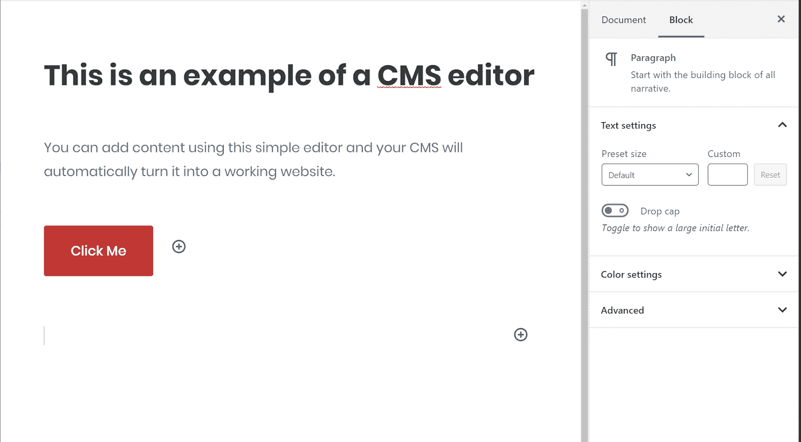

CMS editor example

然后，当您“发布”该内容时，CMS 将根据您的偏好向访问者正确显示该内容。

> 需要在这里大声喊出来。Kinsta 太神奇了，我用它做我的个人网站。支持是迅速和杰出的，他们的服务器是 WordPress 最快的。
> 
> <footer class="wp-block-kinsta-client-quote__footer">
> 
> 
> 
> <cite class="wp-block-kinsta-client-quote__cite">Phillip Stemann</cite></footer>

[View plans](https://kinsta.com/plans/)

CMS 还负责组织网站前端的一切。例如，如果你[发表了一篇博客文章](https://kinsta.com/blog/how-to-start-a-fashion-blog/)，CMS 会自动将其显示在你博客页面的顶部，并添加一个时间戳。

然而，CMS 比博客平台更加灵活。你可以把一个博客平台想象成一个特定内容类型的 CMS([博客文章](https://kinsta.com/blog/how-to-monetize-a-blog/))，而 CMS 可以帮助你管理几乎任何类型的内容。

例如，CMS 中的“内容”可能是:

*   博客帖子
*   静态页面
*   [电子商务产品](https://kinsta.com/blog/ecommerce-hosting/)
*   [论坛帖子](https://kinsta.com/blog/wordpress-forum-plugins/)
*   [私人课程内容](https://kinsta.com/blog/wordpress-lms-plugins/)
*   [会员资格](https://kinsta.com/blog/wordpress-membership-plugins/)

或者，它可能同时是多种类型的内容！一个好的 CMS 平台可以帮助你管理你所需要的各种不同类型的内容。

### 什么是无头 CMS？

在下面的列表中，你会看到另一个术语:[无头 CMS](https://kinsta.com/blog/gatsby-wordpress/) 。有了无头 CMS，你就可以用你的 CMS 来管理后端的所有内容。然后，您可以通过 API 查询数据来构建自己的前端。

这种“无头”方式的好处是，你可以在任何地方使用你的内容，从网站到移动应用等等。

一个无头的 CMS 需要更多的技术知识来实现，但是在如何和在哪里使用你的内容上给你更多的灵活性。

## 选择 CMS 时需要考虑什么？

选择 CMS 时，以下是一些需要考虑的最重要的特性:

1.  **定价**–每个 CMS 都有相关的成本。有些是免费和开源的，但是你需要付费来托管它们。对于其他人，您可能需要从创建 CMS 的公司购买软件。
2.  **支持&客户体验**–一些工具是开源的，没有中央支持选项，而其他工具提供 24/7 支持–确保您了解您将获得什么。
3.  **SEO**——重要的是，你选择的软件为你提供了在谷歌和[其他搜索引擎](https://kinsta.com/blog/alternative-search-engines/)中进行[排名的工具。](https://kinsta.com/blog/wordpress-seo/)
4.  **个性化**–对于业务用例，选择一个可以让您创建个性化访客体验的 CMS 可以帮助您提高营销和转化率。
5.  **易用性**——如果你不是[开发人员](https://kinsta.com/blog/web-developer-salary/)，你会想要选择一个无需开发知识就能使用的工具。
6.  **安全**-使用一些 CMS 工具，你将负责你的[站点的安全](https://kinsta.com/blog/wordpress-security/)，而其他工具为你处理。

[Check out the 2020 guide to the best #CMS options from marketing websites 📈 to ecommerce stores 🛍 right here ⤵Click to Tweet](https://twitter.com/intent/tweet?url=https%3A%2F%2Fbit.ly%2F2WzLJOQ&via=kinsta&text=Check+out+the+2020+guide+to+the+best+%23CMS+options+from+marketing+websites+%F0%9F%93%88+to+ecommerce+stores+%F0%9F%9B%8D+right+here+%E2%A4%B5&hashtags=website%2Ccontent)

## 2022 年 21 个最佳 CMS 软件解决方案

现在是获取 CMS 选项列表的时候了，让我们深入了解一下:

### 1.免费价格

WordPress.org

WordPress 是迄今为止世界上最受欢迎的内容管理系统——它[为互联网上超过 37%的网站提供服务。它最初是一个博客平台，但很久以来已经演变成一个完整的 CMS，你可以用它来](https://kinsta.com/wordpress-market-share/)[建立任何类型的网站](https://academy.hubspot.com/courses/build-a-wordpress-website)，从[电子商务商店](https://kinsta.com/blog/wordpress-ecommerce-plugins/)到[会员网站](https://kinsta.com/blog/wordpress-membership-plugins/)、[论坛](https://kinsta.com/blog/wordpress-forum-plugins/)等等。

事实上，通过 WooCommerce 扩展，WordPress 也是创建电子商务商店最流行的方式之一。解释 WordPress 受欢迎的一些原因是:

1.  是[免费开源](https://kinsta.com/blog/is-wordpress-free/)。
2.  你可以找到数以千计的主题来控制你网站的外观。
3.  你可以访问 55，000 多个免费插件来扩展你网站的功能(这里的[是一些最好的](https://kinsta.com/best-wordpress-plugins/))。

高级用户也可以[使用 WordPress 作为一个类似 Gatsby](https://kinsta.com/blog/gatsby-wordpress/) 的无头 CMS。

如果你想使用 WordPress，Kinsta 提供了[托管 WordPress 主机](https://kinsta.com/blog/managed-wordpress-hosting/)，让你很容易上手。

### 2.Drupal — **价格:**免费

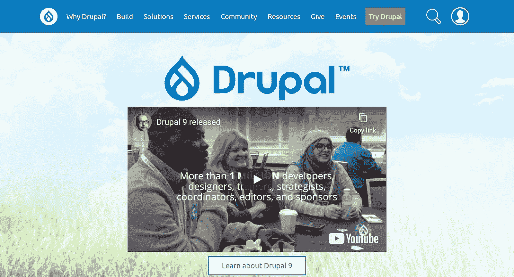

Drupal

Drupal 是另一个流行的开源 CMS，它和 WordPress 在[有着相同的空间。](https://kinsta.com/blog/wordpress-vs-drupal/)

凭借其灵活的分类系统，Drupal 在管理包含大量内容的站点方面表现出色。它还有一个内置的用户访问系统，可以让你充分控制注册用户在 CMS 中可以做什么。

像 WordPress 一样，您可以使用主题来控制站点的外观，并使用模块来扩展 Drupal 的功能。

### 3.Joomla — **价格:**免费

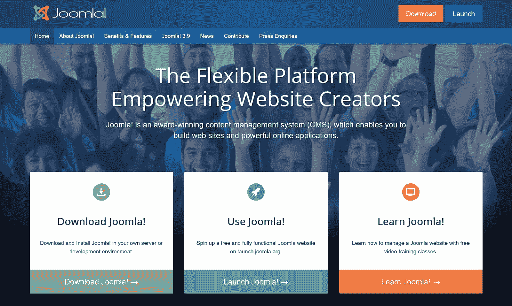

Joomla

除了 WordPress 和 Drupal， [Joomla](https://kinsta.com/blog/best-blogging-platform/#4-joomla) 是三个流行的开源 CMS 软件中的第三个。

像 WordPress 和 Drupal 一样，Joomla 提供了大量的模板和扩展，可以帮助你创建一个符合你需求的网站。

就所需的技术知识而言，Joomla 在 WordPress 和 Drupal 之间提供了一个很好的中间地带。

### 4.Magento —免费，每月 2000 美元起

Magento

Magento 是一款为[电子商务商店](https://kinsta.com/blog/wordpress-ecommerce-plugins/)开发的开源 CMS。它很灵活，具有强大的安全性，但对于非技术用户来说也不太容易使用。你几乎肯定需要一些技术知识来设置它(或者愿意雇佣有这方面知识的人)。

你可以免费使用开源软件(称为 Magento OpenSource)。或者，你可以付钱给 Magento 来为你建立和维护你的商店(Magento Commerce)，这可能会变得昂贵，每月 2000 美元以上。

### 5.HubSpot CMS——每月 300 美元起

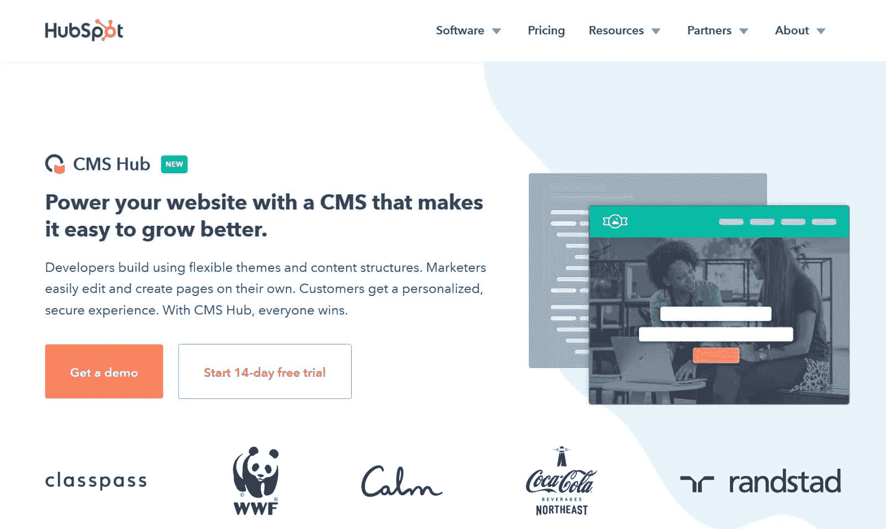

HubSpot

[HubSpot CMS](https://www.hubspot.com/products/cms) 是一款优秀的 CMS，适合希望与客户建立联系的企业和营销人员。

HubSpot CMS 与免费的 [HubSpot CRM](https://kinsta.com/blog/wordpress-crm/#3-hubspot) 有一个内置的集成(查看这些 [WordPress CRM 插件](https://kinsta.com/blog/wordpress-crm/))。这不仅能让你直接将线索添加到你的 CRM 中，还能让你对个人访问者个性化你的网站，这可以[帮助你将他们转化为客户](https://kinsta.com/blog/conversion-rate-optimization-tips/)。

开发人员可以挖掘代码来定制网站，而非技术用户可以使用拖放编辑器来创建页面。

其他显著特征包括:

*   内置的 A/B/n 测试可优化您的内容
*   搜索引擎优化推荐在谷歌搜索结果中排名
*   联系归因分析你的线索和销售来自哪里
*   全天候安全监控
*   如果您需要任何帮助，24/7 全天候支持

### 6.Kentico —免费起步，每年 7，999 美元起

Kentico

[Kentico](https://www.kentico.com/) 是一款专注于企业的 CMS，提供两种不同的 CMS 产品:

*   **Kontent**–一款基于云的无头内容管理系统，帮助您管理您的内容，并通过 API 将其交付到任何地方。
*   **体验**–一个内部或基于云的平台，将 CMS 和数字营销工具合二为一。

Kentico 为其 Kontent 平台提供有限的免费服务，但如果你需要付费服务，价格可能会很高。

因为 Kentico Kontent 是一个无头 CMS，你还需要一些技术知识来创建你的网站的前端。

### 7.squarespace——每月 16 美元起

Squarespace

Squarespace 是一款托管网站构建工具，让非技术用户可以轻松创建网站。你也可以用它来创建一个轻量级的电子商务商店。

Squarespace 不像所有其他工具那样灵活，但这实际上是它的卖点。通过简化事情，Squarespace 让非技术用户很容易创建基本的网站。

然而，如果你正在建立一个超越基本博客、[作品集](https://kinsta.com/blog/wordpress-portfolio-plugins/)或小册子网站的东西，你可能会想要选择更灵活的 CMS 软件。更多信息，请查看这个 [Squarespace 与 WordPress](https://kinsta.com/blog/squarespace-vs-wordpress/) 的深度对比。

### 8.dotCMS —免费，企业选项的高级

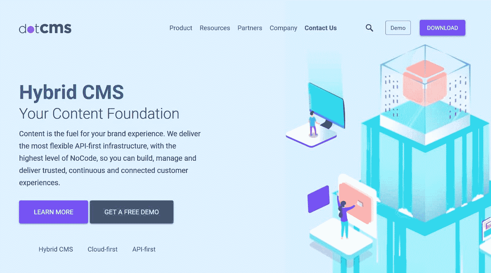

dotCMS

dotCMS 是一个开源的无头 CMS，采用 API 优先的方法。您可以使用拖放 UI 来模拟不同类型的内容。例如，博客帖子或电子商务产品。

## 注册订阅时事通讯

### 想知道我们是怎么让流量增长超过 1000%的吗？

加入 20，000 多名获得我们每周时事通讯和内部消息的人的行列吧！

[Subscribe Now](#newsletter)

然后，您可以使用 API 将您的内容交付到任何目的地，如网站或应用程序。

在后端，你仍然可以获得传统的[作者身份功能](https://kinsta.com/knowledgebase/how-to-change-author-in-wordpress/)，以及创建不同角色和权限来控制对你内容的访问的能力。

### 9.内容丰富—个人每月 39 美元/企业每月 879 美元

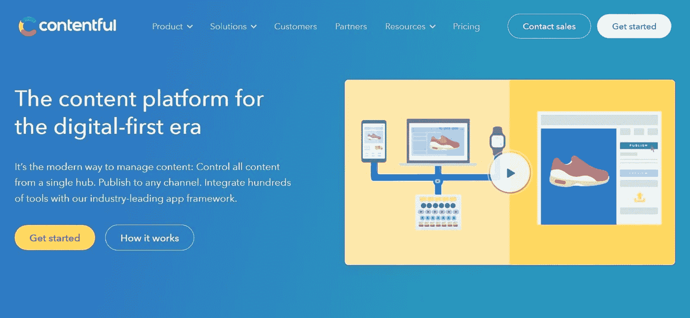

Contentful

大多数其他工具都专注于帮助你创建网页，而 [Contentful](https://www.contentful.com/) 是为所谓的“全渠道数字体验”而构建的。简而言之，这意味着您可以将所有内容组织在一个中心，然后根据需要在任何数字频道中使用。

你将能够使用一个 [RESTful API](https://kinsta.com/blog/wordpress-rest-api/) 查询你的内容，Contentful 将你的内容缓存在外部[cdn](https://kinsta.com/blog/wordpress-cdn/)上，能够在 100 毫秒内交付 API 有效负载

Contentful 是一个无头的 CMS，所以你需要一些技术知识来实现它。

### 10.泽法—联系销售人员

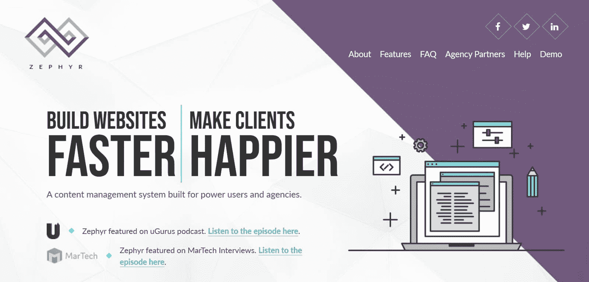

Zephyr

泽法是一个云托管的内容管理系统，专门面向建立客户网站的机构进行营销。事实上，泽法只授权给 T2 的代理商，所以个人不能使用泽法，除非你愿意和代理商合作。

因为它是云托管的，泽法对代理商的主要宣传是，它能够提供一个免维护的替代方案，取代 WordPress 或 Drupal 等其他代理商解决方案。

### 11.Canvas CMS —联系销售人员

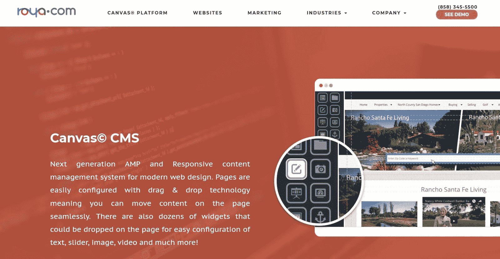

Canvas

[Canvas CMS](https://www.roya.com/canvas-cms.html) 是一个基于云的 CMS，它带有一个[拖放设计系统](https://kinsta.com/blog/wordpress-page-builders/)，这使得非技术用户可以设计一个定制的网站。

你用 Canvas 构建的所有设计都是可移动的[响应的](https://kinsta.com/blog/responsive-web-design/)和[准备好的](https://kinsta.com/blog/google-amp/)，这将给你的移动访问者一个极好的体验。

对于更高级的用户，Canvas 可以让你从 CMS 内部构建动态的数据库结构(T1 ),并且还包括 API 来将其他来源的数据集成到你的站点中。

### 12.Grav 免费

Grav

Grav 是一个开源的平面文件 CMS。“平面文件”的名称意味着 Grav 不需要数据库来操作。相反，它从文本文件中查询内容。这使得 Grav 非常轻量级，易于部署在任何地方，因为你需要做的就是上传你的网站文件。

但是，您仍然可以创建动态内容类型和过滤内容，并且还可以使用降价编辑器来创建内容。

### 13.Craft CMS —免费

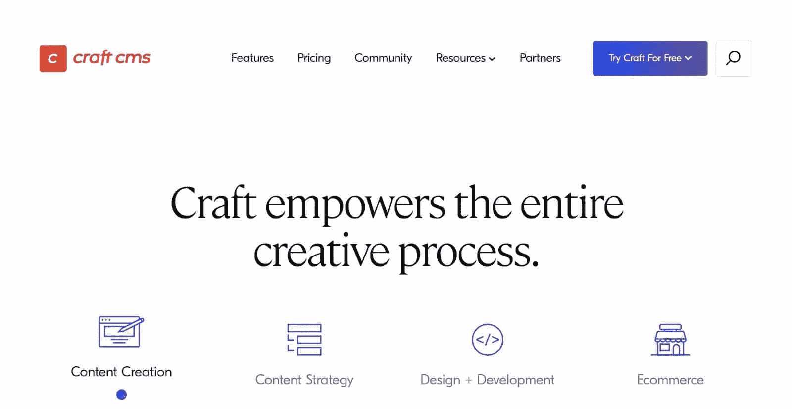

Craft CMS

[Craft CMS](https://craftcms.com/) 是一款开源 CMS，专注于用户友好的内容创建过程。它也使得使用[定制内容类型](https://kinsta.com/blog/wordpress-custom-post-types/)变得容易，通过一个内置工具为不同类型的内容设计定制字段布局。

你的新网站需要一流的、快速的、安全的主机吗？Kinsta 提供超快的服务器和来自 WordPress 专家的 24/7 世界级支持。[查看我们的计划](https://kinsta.com/plans/?in-article-cta)

要控制前端，您可以使用 Twig 模板自己构建，或者使用 Craft CMS 的自生成 GraphQL API 在无头设置中使用 Craft CMS。

### 14.Sitefinity —联系销售人员

Sitefinity

Sitefinity 是一个 CMS，致力于帮助营销人员提供优化的个性化内容。

您可以利用洞察力来了解您的客户并提供个性化内容。然后，您还可以快速设置新的 [A/B 测试](https://kinsta.com/blog/wordpress-ab-testing-tools/)来优化您的内容。

你也可以使用 Sitefinity 作为一个无头的 CMS 来将内容传递到任何地方，一切都托管在 [Microsoft Azure cloud](https://kinsta.com/blog/google-cloud-vs-azure/) 中，以获得可靠性和可伸缩性。

### 15.Shopify —每月 29 美元起

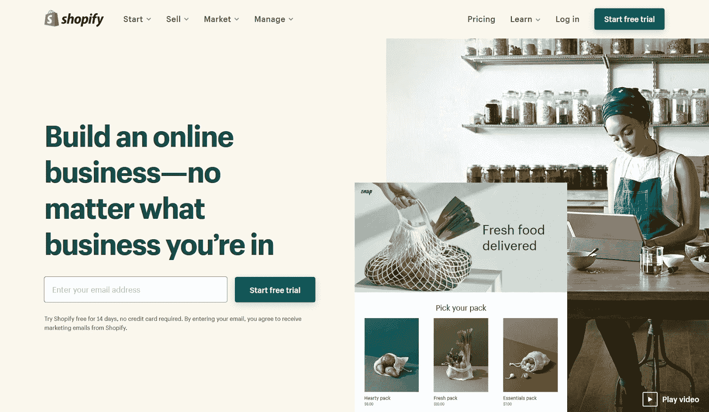

Shopify

Shopify 是一个托管的电子商务平台。[在 WooCommerce](https://kinsta.com/blog/woocommerce-vs-shopify/) 之后，这是创建电子商务商店第二流行的方式。

Shopify 的主要优势是简单。因为它是一个托管工具，你不必担心你的商店的安全或维护。你可以专注于寻找顾客和扩大店铺。

由于 Shopify 应用程序市场，你仍然可以获得很大的灵活性，但你不能完全访问你的商店的底层源代码。

需要更多灵活性的企业可以选择 [Shopify Plus](https://www.shopify.com/plus) 。

(建议阅读:[2022 年 11 个最佳 Shopify 备选方案)。](https://kinsta.com/blog/shopify-alternatives/)

### 16.BigCommerce —每月 30 美元起

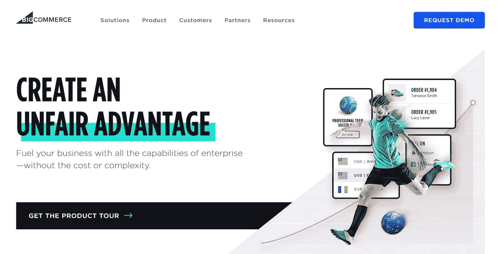

BigCommerce

[BigCommerce](https://www.bigcommerce.com/) 是另一个知名的电子商务商店托管 CMS [平台](https://kinsta.com/blog/ecommerce-platforms/#2-bigcommerce)。BigCommerce 的突出特点之一是它的[多渠道销售方式](https://kinsta.com/blog/ecommerce-statistics/)。你可以通过自己的托管商店、亚马逊、易贝等进行销售。

您甚至可以利用这个列表中的一些其他 CMS 选项。例如，你可以[将 BigCommerce 与 WordPress](https://kinsta.com/blog/woocommerce-alternative-bigcommerce/) 配对，以获得两个世界的优势。

BigCommerce 提供每月 30 美元起的可访问的基本计划，以及面向大型组织的企业计划。

### 17.um braco CMS——免费(开源),每月 39 美元起(托管版)

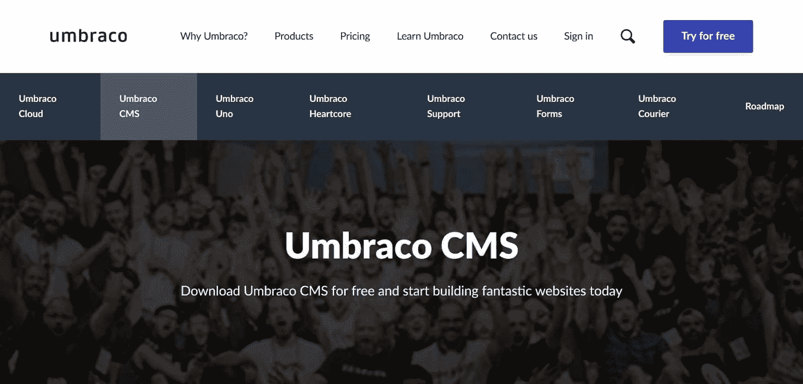

Umbraco

[Umbraco](https://umbraco.com/products/umbraco-cms/) 是开源的 CMS 软件，你可以自己托管。或者，你可以使用 Umbraco 的付费托管服务。

您可以使用一个简单的编辑器以及一些有用的特性(如内置的表单编辑器)来添加内容。如果需要，您还可以使用 Umbraco 应用程序扩展核心 CMS。

对于更多的技术用户，Umbraco 还提供了一个名为 Umbraco Heartcore 的无头 CMS 产品。

### 18.Agility CMS —每月 47 美元起

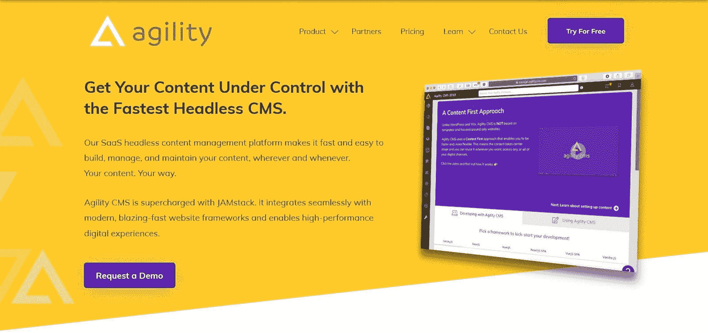

Agility

[Agility CMS](https://agilitycms.com/) 是另一个无头 CMS，允许您从一个位置管理内容，并通过 RESTful APIs、GraphQL 和 JAMstack 将其交付到任何地方。

您仍然有很多管理内容的选项，包括内容建模、 [SEO](https://kinsta.com/blog/what-does-seo-stand-for/) 、时间安排、内容关系等功能。

然后，Agility CMS 可以通过 cdn 部署内容，确保您的内容快速加载。

### 19.Adobe 体验经理-联系销售人员(平均。25 万美元以上/年)

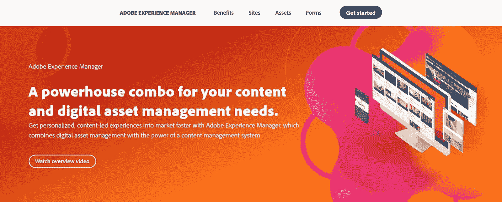

Adobe Experience Manager

Adobe Experience Manager 是一款面向企业的工具，将 CMS 与数字资产管理(DAM)解决方案相结合。

您可以使用 Adobe Experience Manager 站点为不同渠道的访问者创建个性化的 web 体验，同时还可以使用 Adobe Experience Manager 资产从一个中心点管理您品牌的所有数字资产。

### 20.Oracle WebCenter 内容—起价 3，450 美元

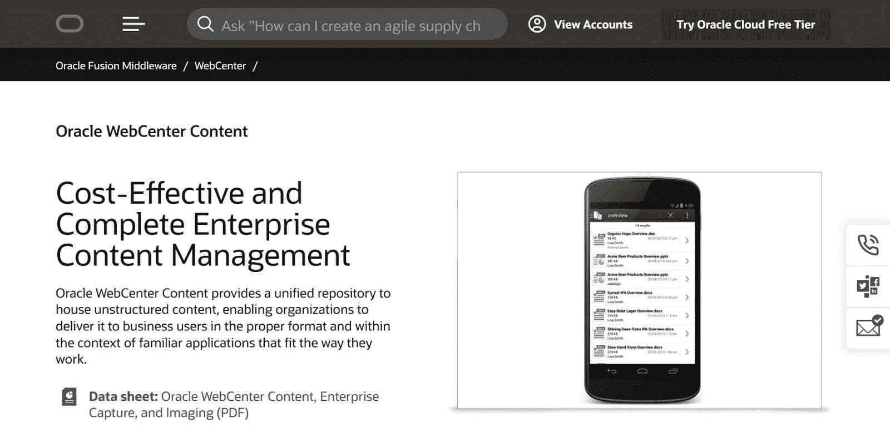

Oracle WebCenter Content

[Oracle WebCenter Content](https://www.oracle.com/middleware/webcenter/content/) 是一款企业内容管理工具(ECM)。它本身并不专注于创建网站。相反，它为您提供了一个存放非结构化内容的地方，然后您可以将这些内容交付给任何应用程序(包括网站)。

它也更专注于管理文档、[图像](https://kinsta.com/blog/optimize-images-for-web/)、富媒体文件和记录，而不是像许多其他工具一样给你一个文本编辑器来上传内容。

### 21.ghost——免费，每月 29 美元起(托管版)

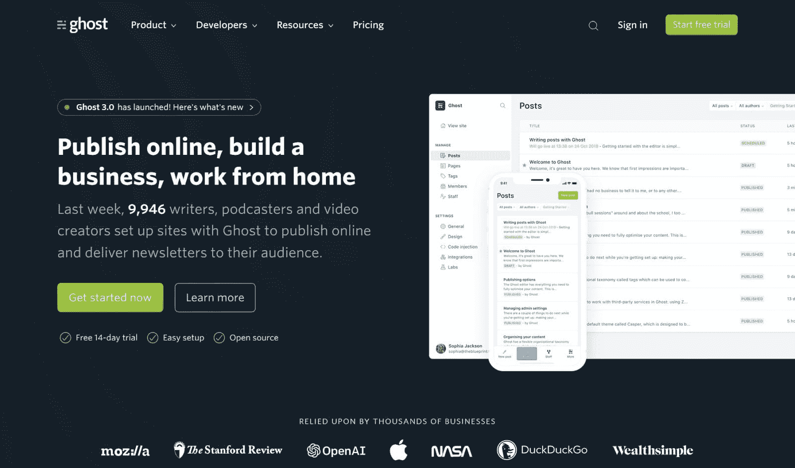

Ghost

Ghost 是一个用 Node.js 编写的速度很快的 CMS，主要专注于博客和发布。

为了简化事情，Ghost 还内置了一些最重要的功能，博客和媒体出版商需要这些功能来赚钱。例如，你可以[创建电子邮件选择加入表格](https://kinsta.com/blog/wordpress-lead-generation/)并向访问你内容的访问者收取[月订阅费](https://kinsta.com/blog/woocommerce-subscriptions/)。

然而，如果你想要一个超越博客/出版的 CMS，Ghost 并不是一个很好的选择。

[Easily grow & manage your website's content with this roundup of the ✨ 21 best ✨ CMS options for 2020Click to Tweet](https://twitter.com/intent/tweet?url=https%3A%2F%2Fbit.ly%2F2WzLJOQ&via=kinsta&text=Easily+grow+%26amp%3B+manage+your+website%27s+content+with+this+roundup+of+the+%E2%9C%A8+21+best+%E2%9C%A8+CMS+options+for+2020&hashtags=CMS%2CContentCreation)

## 摘要

正如我们所看到的，CMS 帮助你管理你的内容，并把它变成一个网站，而不需要每次你想添加/改变内容时[编辑代码](https://kinsta.com/knowledgebase/edit-wordpress-code/)。

其中一些工具几乎完全专注于帮助您启动网站，而其他工具则更专注于管理您的内容，并允许您通过 API 将其部署到任何地方(无头 CMS 方法)。

如果你不是一个技术用户(或者没有一个技术团队在背后支持你)，你可能会想要选择诸如 [WordPress](https://kinsta.com/knowledgebase/what-is-wordpress/) 、Drupal、HubSpot CMS 或 Squarespace 之类的工具，并远离无头 CMS 选项。

然而，如果您需要将您的内容部署到多个位置，您可能更喜欢无头 CMS 的灵活性…如果您有使用它的技术知识的话。

* * *

让你所有的[应用程序](https://kinsta.com/application-hosting/)、[数据库](https://kinsta.com/database-hosting/)和 [WordPress 网站](https://kinsta.com/wordpress-hosting/)在线并在一个屋檐下。我们功能丰富的高性能云平台包括:

*   在 MyKinsta 仪表盘中轻松设置和管理
*   24/7 专家支持
*   最好的谷歌云平台硬件和网络，由 Kubernetes 提供最大的可扩展性
*   面向速度和安全性的企业级 Cloudflare 集成
*   全球受众覆盖全球多达 35 个数据中心和 275 多个 pop

在第一个月使用托管的[应用程序或托管](https://kinsta.com/application-hosting/)的[数据库，您可以享受 20 美元的优惠，亲自测试一下。探索我们的](https://kinsta.com/database-hosting/)[计划](https://kinsta.com/plans/)或[与销售人员交谈](https://kinsta.com/contact-us/)以找到最适合您的方式。