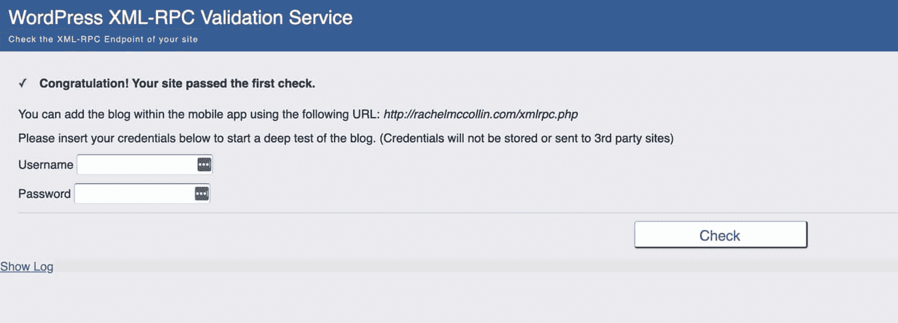

# WordPress 中的 xmlrpc.php 完整指南(它是什么，安全风险，如何禁用它)

> 原文:[https://kinsta.com/blog/xmlrpc-php/](https://kinsta.com/blog/xmlrpc-php/)

开发 XML-RPC WordPress 规范是为了标准化不同系统之间的通信，这意味着 WordPress 之外的应用程序(比如其他博客平台和桌面客户端)可以与 WordPress 交互。

自从 WordPress】诞生以来，这个规范就一直是它的一部分，并且做了非常有用的工作。如果没有它，WordPress 将会在它自己的筒仓里，与互联网的其他部分分离开来。

然而，xmlrpc.php 也有它的缺点。它会给你的 WordPress 站点带来漏洞，现在已经被 T2 的 WordPress REST API 所取代，它在向其他应用开放 WordPress 方面做得更好。

在这篇文章中，我们将解释什么是 xmlrpc.php，为什么你应该禁用它，并帮助你识别它是否在你的 WordPress 站点上运行。

准备好了吗？让我们开始吧！

## 什么是 xmlrpc.php？

XML-RPC 是一个支持 WordPress 和其他系统之间通信的规范。它通过标准化这些通信，使用 HTTP 作为传输机制，XML 作为编码机制来实现这一点。

XML-RPC 出现在 WordPress 之前:它出现在 b2 博客软件中，该软件在 2003 年被派生出来创建 WordPress。系统背后的代码存储在网站根目录下一个名为**xmlrpc.php**的文件中。尽管 XML-RPC 在很大程度上已经过时，但它仍然存在。


在 WordPress 的早期版本中，XML-RPC 是默认关闭的。但是从 3.5 版本开始，默认启用。这样做的主要原因是允许 WordPress 移动应用程序与你的 WordPress 安装程序进行对话。

如果你使用的是 3.5 版本之前的 WordPress mobile 应用程序，你可能还记得必须在你的网站上启用 XML-RPC，应用程序才能发布内容。这是因为这款应用本身没有运行 WordPress 相反，它是一个独立的应用程序，使用 xmlrpc.php 与你的 WordPress 网站进行交流。

但 XML-RPC 不仅仅用于移动应用:它还用于 WordPress 和其他博客平台之间的通信，它支持 [trackbacks](https://kinsta.com/knowledgebase/what-is-a-trackback/) 和 [pingbacks](https://kinsta.com/knowledgebase/what-is-a-pingback/) ，它支持 [Jetpack 插件](https://kinsta.com/knowledgebase/wordpress-jetpack/)，该插件将[自托管 WordPress 网站链接到 WordPress.com](https://kinsta.com/blog/wordpress-com-vs-wordpress-org/)。

但是由于 REST API 被集成到 WordPress 核心中，xmlrpc.php 文件不再用于这种通信。相反，REST API 用于与 WordPress 移动应用程序、桌面客户端、其他博客平台、WordPress 和其他系统和服务进行通信。REST API 可以交互的系统范围比 xmlrpc.php 允许的要大得多。此外，还有更大的灵活性。

因为 REST API 已经取代了 XML-RPC，所以您现在应该在您的站点上禁用 xmlrpc.php。我们来看看为什么。


## 为什么你应该禁用 xmlrpc.php

你应该在你的 WordPress 站点上禁用 xmlrpc.php 的主要原因是因为它引入了[安全漏洞](https://kinsta.com/knowledgebase/disclose-security-vulnerability/)，并且可能成为攻击的目标。

既然不再需要 XML-RPC 在 WordPress 之外进行通信，就没有理由让它保持活动状态。这就是为什么明智的做法是通过禁用它来使你的网站更加安全。

> 如果 xmlrpc.php 是一个安全隐患，它不再起作用了，为什么它没有从 WordPress 中完全移除？

这样做的原因是因为 WordPress 的关键特性之一是向后兼容。如果你[管理好你的网站](https://kinsta.com/ebooks/wordpress/manage-multiple-wordpress-sites/)，你会知道[保持 WordPress 最新](https://kinsta.com/blog/wordpress-automatic-updates/)，以及任何[插件](https://kinsta.com/knowledgebase/manually-update-wordpress-plugin/)或[主题](https://kinsta.com/blog/how-to-update-wordpress-theme/)，是必不可少的。

但是总会有网站所有者不愿意或者不能更新他们的 WordPress 版本。如果他们运行的版本早于 REST API，他们仍然需要访问 xmlrpc.php。

让我们更详细地看看具体的漏洞。


### 信息

默认情况下，Kinsta 会阻止 XML-RPC。您可以在我们的常见问题 中了解更多信息。如果您想为某个应用程序启用它，请 [联系支持](https://kinsta.com/kinsta-support/) 。


### 通过 XML-RPC ping back 的 DDoS 攻击

xmlrpc.php 启用的功能之一是 pingbacks 和 trackbacks。当另一个博客或网站链接到你的内容时，这些通知会出现在你网站的[评论中。](https://kinsta.com/blog/wordpress-comment-plugins/)

XML-RPC 规范使得这种通信成为可能，但是它已经被 REST API 取代了(正如我们已经看到的)。

如果您的站点启用了 XML-RPC，黑客可能会利用 xmlrpc.php 在短时间内向您的站点发送大量 pingbacks，从而在您的站点上发起 [DDoS 攻击](https://kinsta.com/blog/what-is-a-ddos-attack/)。这可能会使您的服务器过载，使您的网站无法运行。

### 通过 XML-RPC 的暴力攻击

每次 xmlrpc.php 发出请求时，它都会发送用户名和密码进行身份验证。这带来了严重的安全隐患，是 REST API 所不具备的。事实上， [REST API 使用 OAuth](https://kinsta.com/blog/wordpress-rest-api/#authentication) 发送令牌进行认证，而不是用户名或密码。

因为 xmlrpc.php 在每个请求中都发送认证信息，[黑客可以利用它来尝试访问你的 sit](https://kinsta.com/blog/wordpress-hacked/) e。像这样的暴力攻击可能允许他们插入内容、删除代码或[破坏你的数据库](https://kinsta.com/knowledgebase/wordpress-repair-database/)。

如果攻击者向您的站点发送足够多的请求，每个请求都使用不同的用户名和密码对，那么他们有可能最终找到正确的用户名和密码，从而获得访问您站点的权限。

这就是为什么，如果你运行的是最新版本的 WordPress，它使用 REST API 与外部系统通信，**你应该禁用 xmlrpc.php**。这是不必要的，它可能会使您的网站易受攻击。


### 信息

虽然 Kinsta 本身并不支持 OAuth，[企业及以上计划](https://kinsta.com/plans/)可以要求实现它。


## xmlrpc.php 在你的 WordPress 网站上运行吗？

你需要做的第一件事是确定 xmlrpc.php 是否在你的 WordPress 站点上运行。

这不是检查文件是否存在的简单情况:它是每个 WordPress 安装的一部分，即使 XML-RPC 被禁用，它也会存在。


在删除任何东西之前，一定要备份你的网站。在这种情况下，不要只是删除 xmlrpc.php 文件，因为它会破坏你的网站。


要检查您的站点上是否启用了 xmlrpc.php，请使用 [XML-RPC Validator Web 应用程序](http://scripting.com/code/xmlrpcbrowserclient/index.html)。这将检查您的网站，并告诉您是否启用了 xmlrpc.php。


XML-RPC Validator Web App


这说明 xmlrpc.php 在[kinsta.com](https://kinsta.com/)已经被禁用。因此，如果您运行检查并发现 xmlrpc.php 仍然在您的网站上启用，您如何关闭它？

## 如何禁用 xmlrpc.php

有三种方法可以禁用 xmlrpc.php:

 让我们分别来看看每一个。

## 注册订阅时事通讯


### 想知道我们是怎么让流量增长超过 1000%的吗？

加入 20，000 多名获得我们每周时事通讯和内部消息的人的行列吧！

[Subscribe Now](#newsletter)

### 如何用插件禁用 xmlrpc.php

安装一个插件来禁用 xmlrpc.php 是最简单的方法。[禁用 XML-RPC 插件](https://wordpress.org/plugins/disable-xml-rpc/)将完全禁用它。这是你如何使用它。

我的起点是我自己的网站，xmlrpc.php 是在上面启用的。你可以通过我做的检查看到这一点:



Rachel McCollin website – XML-RPC check


通过你在 WordPress admin 中的**插件**屏幕安装插件，并激活它。

您不需要做任何其他事情:激活插件将导致它禁用 XML-RPC。现在，如果我在我的网站上运行检查，我会得到不同的结果:


Rachel McCollin website – second XML-RPC check


就这么简单！

#### 使用插件禁用 XML-RPC ping back

但是，如果您想禁用 xmlrpc.php 的某些方面，而不是其他方面呢？[禁用 XML-RPC Pingback 插件](https://wordpress.org/plugins/disable-xml-rpc-pingback/)允许您仅禁用 Pingback 功能，这意味着如果您需要，您仍然可以访问 XML-RPC 的其他功能。

该插件的工作方式与禁用 XML-RPC 插件相同:只需安装，激活它，它就会工作。

#### 用插件配置 XML-RPC 和 REST API 激活

如果您想要更细粒度地控制如何在您的站点上配置 xmlrpc.php 和 REST API，您可以安装 [REST XML-RPC 数据检查器插件](https://wordpress.org/plugins/rest-xmlrpc-data-checker/)。

一旦你安装并激活了这个插件，进入**设置> REST XML-RPC 数据检查器**并点击 **XML-RPC** 标签。


REST XML-RPC Data Checker


这使您可以准确配置 xmlrpc.php 的哪些方面在您的站点上是活动的。

需要一个超快的、安全的、开发者友好的主机？Kinsta 是为 WordPress 开发者设计的，提供了大量的工具和强大的仪表板。[查看我们的计划](https://kinsta.com/plans/?in-article-cta)

或者，你可以干脆把它完全关掉。如果你还想控制 [REST API](https://kinsta.com/blog/wordpress-rest-api/) ，插件会为你提供另一个选项卡。

### 如何禁用没有插件的 xmlrpc.php

如果你不想在你的网站上安装另一个插件，你可以通过在过滤器或者你的[中添加一些代码来禁用 xmlrpc.php。htaccess 文件](https://kinsta.com/knowledgebase/wordpress-htaccess-file/)。让我们看看这两种方法。

#### 通过过滤器禁用 xmlrpc.php

这里的一个选项是使用 **xmlrpc_enabled** 过滤器来禁用 xmlrpc.php。将此功能添加到插件并在您的网站上激活它:

```
add_filter( 'xmlrpc_enabled', '__return_false' );
```

你可以把它添加到你的主题函数文件中，但是最好还是写一个插件。

另一个选项与编辑您的。htaccess 文件，使用 [Apache](https://kinsta.com/knowledgebase/what-is-apache/) 的主机提供商可以通过[经由 FTP](https://kinsta.com/knowledgebase/how-to-use-sftp/) 或 [cPanel](https://kinsta.com/knowledgebase/what-is-cpanel/) 连接到你网站的服务器。


### 信息

Kinsta 使用 [Nginx web 服务器](https://kinsta.com/knowledgebase/what-is-nginx/)，这意味着您将没有一个工作的。htaccess 文件。相反，您可以利用仪表板中的工具来复制许多重要的。通过 [MyKinsta 仪表盘](https://kinsta.com/mykinsta)以更直观的方式访问 htaccess 功能。


#### 通过禁用 xmlrpc.php。htacess 文件

在你的**里。htaccess** 文件，添加以下代码:

```
<Files xmlrpc.php>
Order Allow,Deny
Deny from all
</Files>
```

在这样做之前，请确保备份旧文件，以防遇到任何问题。

### 让你的主机提供商禁用 xmlrpc.php

或者，如果检测到攻击，一些主机提供商将禁用 xmlrpc.php。

这将产生一个 [403 错误](https://kinsta.com/blog/403-forbidden-error/)并阻止攻击。

在金斯塔，不用担心，这个已经屏蔽了。如有任何问题，请联系支持人员

如果你自己做这个，最好使用上面的方法之一。但是在你这么做之前，一定要先咨询你的主机提供商。


## 您何时需要启用 xmlrpc.php？

在某些情况下，你可能需要在你的 WordPress 网站上启用 xmlrpc.php，或者你不应该完全禁用它。

这些是:

*   你没有运行 REST API(不建议，但在某些情况下是必要的)，但需要在你的 WordPress 站点和其他系统之间进行通信。
*   你不能[更新 WordPress](https://kinsta.com/blog/wordpress-automatic-updates/) 到 4.4 或更高版本，所以不能访问 REST API。这可能是因为你的主机设置的限制(在这种情况下，我会[改变主机提供商](https://kinsta.com/knowledgebase/wordpress-migrations/))或主题或插件的不兼容(在这种情况下，我会更换或更新这些)。
*   您正在使用一个不能访问 WP REST API 但可以访问 XML-RPC 的外部应用程序(从长远来看，我建议更新该应用程序或切换到 REST 兼容的应用程序)。

就是这样！这些都不是保持 XML-RPC 规范的特别好的理由。

它仍然存在于 WordPress 的唯一原因是为了向后兼容，只有当你使用过时的系统时才会使用它。对于任何想保持网站更新和使用最新技术的人来说，禁用 xmlrpc.php 是正确的选择。

[XML-RPC was once an essential part of WordPress. Now it represents a security risk 🔒 - This guide will show you exactly how to disable it on your site 🚨.Click to Tweet](https://twitter.com/intent/tweet?url=https%3A%2F%2Fbit.ly%2F2DgSYEB&via=kinsta&text=XML-RPC+was+once+an+essential+part+of+WordPress.+Now+it+represents+a+security+risk+%F0%9F%94%92+-+This+guide+will+show+you+exactly+how+to+disable+it+on+your+site+%F0%9F%9A%A8.&hashtags=security%2CRESTAPI)

## 摘要

XML-RPC 规范是在 WordPress 创建之前开发的，作为 WordPress 与外部系统和应用程序通信的一种方式。它有固有的安全缺陷，可能使你的网站容易受到攻击。

既然 [REST API 允许您的站点与其他应用程序](https://kinsta.com/blog/wordpress-rest-api/#understanding-the-wordpress-rest-api)通信，您可以安全地禁用 xmlrpc.php。如果你按照上述步骤，通过禁用它，你将提高您的网站的安全性。

* * *

让你所有的[应用程序](https://kinsta.com/application-hosting/)、[数据库](https://kinsta.com/database-hosting/)和 [WordPress 网站](https://kinsta.com/wordpress-hosting/)在线并在一个屋檐下。我们功能丰富的高性能云平台包括:

*   在 MyKinsta 仪表盘中轻松设置和管理
*   24/7 专家支持
*   最好的谷歌云平台硬件和网络，由 Kubernetes 提供最大的可扩展性
*   面向速度和安全性的企业级 Cloudflare 集成
*   全球受众覆盖全球多达 35 个数据中心和 275 多个 pop

在第一个月使用托管的[应用程序或托管](https://kinsta.com/application-hosting/)的[数据库，您可以享受 20 美元的优惠，亲自测试一下。探索我们的](https://kinsta.com/database-hosting/)[计划](https://kinsta.com/plans/)或[与销售人员交谈](https://kinsta.com/contact-us/)以找到最适合您的方式。